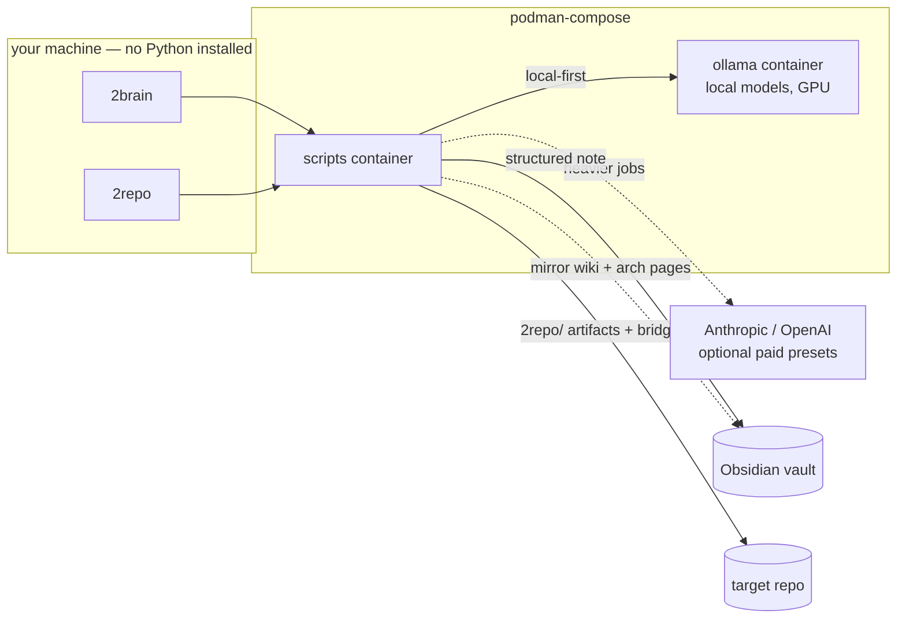

# knowledge-hub

Two commands that externalize memory. Local-first (Ollama), with optional paid Anthropic/OpenAI presets for heavier jobs.

```
learn something   →  2brain "topic"          →  structured note in Obsidian
open a codebase   →  2repo ~/Work/my-repo     →  AI-ready repo context
```

Everything runs in containers — **no Python on the host.**



---

## Quick Start

```bash
# 1. Clone
git clone https://github.com/Guebbit/knowledge-hub.git ~/knowledge-hub
cd ~/knowledge-hub

# 2. Configure
cp .env-example .env
# Edit .env — set LINUX_USERNAME (or OPENAI_API_KEY for cloud presets)

# 3. Register the two commands (one-time)
#    Add to ~/.bashrc or ~/.zshrc:
echo 'export KNOWLEDGE_HUB="$HOME/knowledge-hub"' >> ~/.bashrc
echo 'alias 2brain="$KNOWLEDGE_HUB/scripts/2brain.sh"' >> ~/.bashrc
echo 'alias 2repo="$KNOWLEDGE_HUB/scripts/2repo.sh"'   >> ~/.bashrc
source ~/.bashrc

# 4. Build the container image
docker compose build

# 5. Verify
2brain --version   # → knowledge-hub 0.1.0
2repo --version    # → knowledge-hub 0.1.0

# 6. First run
2brain "my first note"
2repo /path/to/some/repo
```

> Windows users: skip to **[Installing the commands (Windows)](#windowspowershell)** below.

---

## What the two commands do

### `2brain` — your second brain
Type `2brain "what I just figured out"` and an AI writes a clean, always-identically-structured note straight into your Obsidian vault. Capture from a topic, a file, a PDF, or audio/video; split broad topics into several notes; link notes together for Obsidian's graph view.

→ **Full usage, every flag, examples: [docs/2brain.md](docs/2brain.md)**

### `2repo` — repository intelligence
Run `2repo ~/Work/my-repo` and it runs the full repo intelligence stack in order: **graph → wiki → arch**. The graph layer creates the canonical repo artifacts under `2repo/` (graph report, execution knowledge, durable memory, semantic index, and `REPO_CONTEXT.md`), then writes one editor bridge file for your selected AI target (`CLAUDE.md`, Copilot instructions, or Cursor rules). The wiki layer adds the per-file living wiki, and the arch layer adds component docs + Mermaid diagrams. Your AI assistant starts each session already knowing the repo instead of re-reading it. Re-running is incremental, so only what changed is regenerated; `--force-all` rebuilds everything.

Yes: a bare `2repo <repo>` is the full pipeline. If you want only one layer, use `2repo graph <repo>`, `2repo wiki <repo>`, or `2repo arch <repo>`.

If you want to hook Claude Code directly, run it once per repo:

```bash
2repo ~/Work/my-repo --ai-target claude
# or: 2repo ~/Work/my-repo    # then pick Claude from the interactive selector
```

That creates `CLAUDE.md` at the repo root. Claude Code automatically follows the generated context, and the file includes `@2repo/REPO_CONTEXT.md`, so the repo context is loaded at session start. You can still rerun `2repo ~/Work/my-repo` later to refresh everything incrementally.

Each layer is also callable on its own (`2repo graph`, `2repo wiki`, `2repo arch`), alongside semantic `query`, durable `remember`, and staleness checks.

**Two tiers, two audiences.** The per-file wiki is written for machines — one page per source file, read through the semantic index so your AI never has to open the file — and stays in the repo. On top of it, 2repo builds a **module tier**: one note per meaningful directory (~30 for a 430-file repo), linked to each other along the real dependency graph. That tier and the architecture pages are what get mirrored into Obsidian, so a project shows up as a couple of dozen readable, connected notes instead of hundreds of orphans. Generated notes are tagged `2repo`, so a graph filter of `-tag:2repo` shows only your own writing.

On the first run per repository, 2repo asks which paths to document — include (blank = everything) and exclude (blank = nothing), as gitignore-style patterns like `**/*.test.ts`. The answer is saved to `.2repoignore` in that repo and is editable by hand; `--include` / `--exclude` / `--rescope` set it from the command line.

→ **New here? Start with [docs/2repo-why.md](docs/2repo-why.md)** — why to run it and what it costs. Full pipeline, subcommands, examples: **[docs/2repo.md](docs/2repo.md)**

---

## Prerequisites

- Docker or Podman
- NVIDIA GPU + drivers ( `nvidia-smi` must work )
- [NVIDIA Container Toolkit](https://docs.nvidia.com/datacenter/cloud-native/container-toolkit/install-guide.html) for GPU passthrough
- Obsidian installed on the host

```bash
nvidia-smi   # verify the GPU is visible before anything else
```

---

## Setup (do this once)

### 1. Clone and configure

```bash
git clone <this-repo> ~/knowledge-hub
cd ~/knowledge-hub
cp .env-example .env
```

Edit `.env` and set at minimum:

```bash
LINUX_USERNAME=yourname        # your Linux username (for the ~/.ollama mount)
CONTAINER_ENGINE=podman        # or docker
```

The shipped `DEFAULT_PRESET=fast` runs on Ollama and works once you pull the model in step 5.

### 2. Register `2brain` and `2repo` as global commands

Add to `~/.zshrc` or `~/.bashrc` (check with `echo $SHELL`):

```bash
export KNOWLEDGE_HUB="$HOME/knowledge-hub"   # adjust if you cloned elsewhere
alias 2brain="$KNOWLEDGE_HUB/scripts/2brain.sh"
alias 2repo="$KNOWLEDGE_HUB/scripts/2repo.sh"
```

Then reload: `source ~/.zshrc`. Now both commands work from any directory.

### 3. Build the container images

```bash
docker compose build
```

Installs all Python deps (anthropic, openai, faster-whisper, pypdf, …) inside the image. Nothing touches host Python. Repeat only after updating the repo.

### 4. Start Ollama

```bash
docker compose up -d
```

### 5. Pull the model your local preset points at

`PRESET_FAST` in `.env` decides which model to pull. Match your VRAM:

```bash
docker compose exec ollama ollama pull qwen3:8b        # 8 GB VRAM
docker compose exec ollama ollama pull qwen3.6:27B     # 24 GB VRAM (the shipped default)
docker compose exec ollama ollama list                 # verify
```

Tip: `scripts/ollama.sh install` gives you a plain `ollama` command on the host that forwards to the container, so you can drop the `docker compose exec ollama` prefix. See **[docs/ollama.md](docs/ollama.md)**.

### 6. Open the vault in Obsidian

Obsidian → **Open folder as vault** → select `vault/` inside this repo.

Done. Type `2brain "topic"` and a note appears; type `2repo /path/to/repo` to generate repo intelligence.

---

## Installing the commands

Both commands are **shell aliases/functions that call `docker compose`** — nothing is `pip install`ed on the host. Pick your platform:

### Linux / macOS (bash, zsh)

Add to `~/.bashrc`, `~/.zshrc`, or `~/.profile`:

```bash
export KNOWLEDGE_HUB="$HOME/knowledge-hub"   # adjust if you cloned elsewhere
alias 2brain="$KNOWLEDGE_HUB/scripts/2brain.sh"
alias 2repo="$KNOWLEDGE_HUB/scripts/2repo.sh"
```

Reload: `source ~/.bashrc` (or `~/.zshrc`). Both commands are now available in any new terminal.

> **Podman users**: set `CONTAINER_ENGINE=podman` in `.env` before building.

### Windows (PowerShell)

Add to your `$PROFILE` (run `notepad $PROFILE` to create/open it):

```powershell
$KH = "$HOME\Documents\knowledge-hub"   # adjust to your clone path
function 2brain { & "$KH\scripts\2brain.ps1" @args }
function 2repo  { & "$KH\scripts\2repo.ps1"  @args }
```

Close and reopen PowerShell. The `.ps1` wrappers target `docker-compose.windows.yml` automatically.

> **Prerequisite**: [Docker Desktop for Windows](https://docs.docker.com/desktop/install/windows-install/) with WSL 2 backend, or Podman Desktop with `CONTAINER_ENGINE=podman` set in `.env`.

### Windows (Git Bash)

Works identically to Linux — the `.sh` scripts are POSIX-compatible:

```bash
export KNOWLEDGE_HUB="$HOME/Documents/knowledge-hub"
alias 2brain="$KNOWLEDGE_HUB/scripts/2brain.sh"
alias 2repo="$KNOWLEDGE_HUB/scripts/2repo.sh"
```

> Git Bash paths work because Docker Desktop maps them via WSL. Use Unix-style paths (`~/Documents/…`).

### WSL (Windows Subsystem for Linux)

Identical to native Linux. Clone inside the WSL distro, add the aliases to `~/.bashrc`, and use Docker Desktop (or `podman` via WSL).

---

### Verify the install

On any platform:

```bash
2brain --version
2repo --version
# → knowledge-hub 0.1.0
```

If you get `command not found`, your shell profile wasn't reloaded — run `source ~/.bashrc` (Linux/macOS) or open a new PowerShell window.

---

## Using a paid provider

Both commands route through two **presets** (`provider:model`): `fast` (local Ollama, the default) and `deep` (a cloud model for heavy jobs). Point `deep` at whatever paid model you like.

```bash
# .env
OPENAI_API_KEY=sk-...
PRESET_DEEP=openai:gpt-4o        # or anthropic:claude-sonnet-4-6

2brain "topic" --preset deep     # use once
DEFAULT_PRESET=deep              # or make it the default
```

`2repo` can use its own defaults via `REPO_PRESET_GRAPH` and `REPO_PRESET_WIKI`. See the docs for the full preset story.

---

## ⚠️ Shared model cache

The Ollama container mounts `~/.ollama` from the host (`/home/${LINUX_USERNAME}/.ollama`):

- Models are **shared across all Ollama containers** — pull once, available everywhere.
- Models **survive `docker compose down`** — they live on your disk.
- **Do not delete `~/.ollama`** — models are 4–20 GB each.
- **Do not run two Ollama containers** against the same folder — they conflict.

---

## Everyday operation

Replace `docker` with `podman` if `CONTAINER_ENGINE=podman`.

```bash
docker compose up -d       # start Ollama
docker compose down        # stop (models stay downloaded)
docker compose restart     # restart
```

```bash
scripts/ollama.sh update   # update Ollama to the newest image (models stay downloaded)
scripts/ollama.sh status   # version, GPU, models
scripts/ollama.sh fix-gpu  # after a driver update/reboot, if you see "Could not locate device X:Y"
```

**Troubleshooting**

| Symptom | Fix |
|---|---|
| `2brain: command not found` | `source ~/.zshrc` (reload after adding the alias) |
| Cannot reach Ollama | `docker compose ps` · `docker compose logs ollama` |
| GPU not used | `nvidia-smi` · `docker compose exec ollama nvidia-smi` |
| Model not found | `docker compose exec ollama ollama pull qwen3:8b` |
| Note not visible in Obsidian | The command prints the path; press the vault refresh button |

Full configuration reference lives in the docs: **[docs/2brain.md](docs/2brain.md)** · **[docs/2repo.md](docs/2repo.md)** · **[docs/ollama.md](docs/ollama.md)**.

## Development

Everything below runs on the host in a throwaway `.venv`. The test suite covers
pure logic — how files are grouped into modules, how the scope filter decides what
gets documented, how graphify's JSON is parsed — so it needs no container, no
Ollama, and no API key, and finishes in well under a second.

```bash
make          # list the targets
make test     # pytest
make lint     # ruff
make check    # both — this is what CI runs
make fix      # apply ruff's safe fixes
make image    # rebuild the scripts container
make clean    # drop the venv and caches
```

The first `make` target creates the venv itself, so there is nothing to set up.
CI (`.github/workflows/ci.yml`) runs `ruff check` and `pytest` on every push and
pull request.

Ruff is used as a **linter only**, not a formatter: the explanatory comment blocks
in this codebase are deliberately laid out, and auto-formatting would churn them
for no benefit. Two rules are switched off on purpose (`E501` long lines, `SIM108`
forced ternaries) — both are documented with their reason in `pyproject.toml`.
