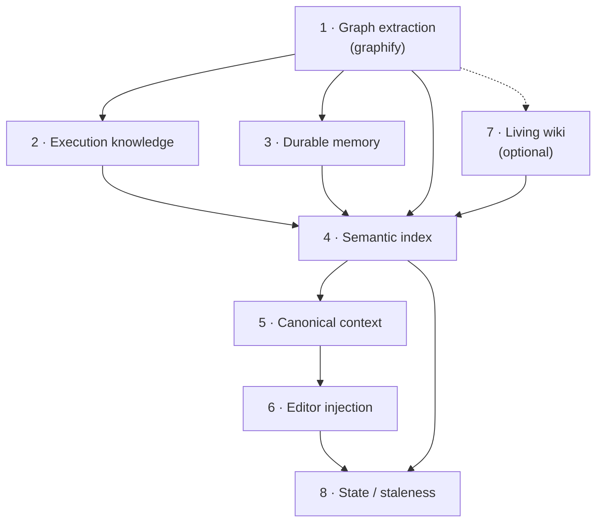
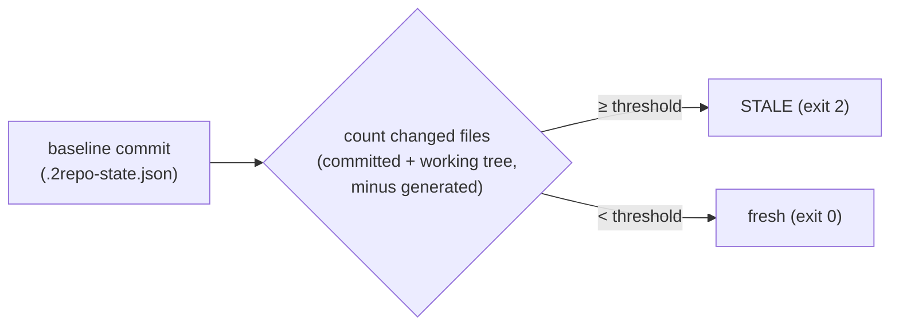
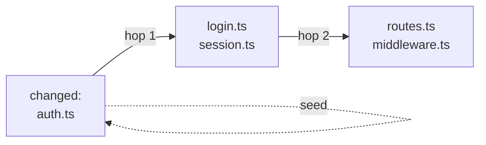

# 2repo — internals, logic & theory

This document explains *how* `2repo` works under the hood: what the moving parts are, how they combine, how incremental refresh is decided, and how staleness is detected. If you just want commands and examples, read **[2repo.md](2repo.md)** instead.

---

## 1. The core idea: one pipeline, seven layers

You're right that `2repo` is not a single feature — it's a **pipeline of independent layers that stack on top of each other**. Each layer produces one or more files under `graphify-out/`, and every layer above consumes the ones below it.



The design rule behind the whole thing: **one canonical source, zero duplicated AI summaries.** Everything funnels into `REPO_CONTEXT.md`, and the editor bridge files (Claude/Copilot/Cursor) only *point* at it — they never copy it. Regenerate once, every assistant sees the update.

A second rule: **fail-fast, no placeholders.** If a required artifact is missing (e.g. `GRAPH_REPORT.md`, `EXECUTION.md`), the run aborts rather than writing an empty or fake file. Layers refuse to build on a broken foundation.

Here's what each layer actually is.

### Layer 1 — Graph extraction (`graphify`)
The foundation. `2repo` shells out to the external `graphify` tool, which parses the codebase into a **dependency graph**: nodes are files, edges are relationships (imports, references). Output: `GRAPH_REPORT.md` (human/AI-readable) and `graph.json` (raw graph). Everything else keys off this graph. `graphify` honors `.gitignore`/`.graphifyignore` and skips heavy dirs (`node_modules`, `dist`, `.next`, …).

This is the only layer that calls an LLM as part of *extraction* (for semantic enrichment). The provider is chosen by preset and mapped to a graphify backend: `anthropic→claude`, `openai→openai`, `ollama→ollama`.

### Layer 2 — Execution knowledge (`EXECUTION.md`)
**Purely deterministic — no LLM.** It scrapes the repo for *how to run it*:
- `package.json` scripts, `Makefile` targets, `pyproject.toml` scripts (project/poetry/poe)
- GitHub Actions workflows (parsed for `run:` commands, including block scalars)
- Migration directories (Alembic, Prisma, Django, Flyway…) and tool-hint files

It then distills a short "Quick Commands" list by keyword-matching script names (`test`, `build`, `lint`, `start`, `dev`, `check`, `format`). This is the layer that lets an assistant answer "how do I run the tests?" without guessing.

### Layer 3 — Durable memory (`repo-memory.json` + `REPO_MEMORY.md`)
Facts you explicitly store with `2repo remember`. Three kinds: `fact`, `decision`, `runbook`. Entries are **deduplicated by `(kind, case-insensitive text)`** — re-remembering the same thing updates the existing entry instead of duplicating it. Each entry carries an `id` (SHA-256 prefix of `kind:text`), a `created_at`, and pointers to the git `head` and `index_revision` it was last synced against. The JSON is the source of truth; the `.md` is a human-readable mirror.

### Layer 4 — Semantic index (`repo-index.json`)
The retrieval engine behind `2repo query`. It chunks the text artifacts from layers 1–3 (plus runtime metadata and, if present, wiki pages) and builds a **TF-IDF vector index** served by cosine similarity. Full algorithm in §4.

### Layer 5 — Canonical context (`REPO_CONTEXT.md`)
A small, always-regenerated index page that lists the core artifacts, the current index metadata (provider, model, revision, chunk count, memory count), and the query commands. This is *the* file assistants are pointed at.

### Layer 6 — Editor injection (bridge files)
Writes one editor-specific file that references `REPO_CONTEXT.md`:
- **Claude** → `.claude/KNOWLEDGE.md` (points via `@../graphify-out/REPO_CONTEXT.md`) + a managed block in `CLAUDE.md`
- **Copilot** → managed block in `.github/copilot-instructions.md`
- **Cursor** → `.cursor/rules/2repo.mdc` (a global always-apply rule)
- **Neutral** → nothing (for local/custom setups)

Injected blocks are wrapped in `<!-- 2repo:start --> … <!-- 2repo:end -->` markers and rewritten **only if the content changed** — so your own edits around them survive, and re-running is idempotent.

### Layer 7 — Living wiki (optional, `graphify-out/wiki/`)
One LLM-written Markdown page per source file, plus `OVERVIEW.md`. This is the only layer that's *incremental by design* (§3), because it's the expensive one — every page is an LLM call. Generated pages are folded back into the index (layer 4) so `query` can retrieve them.

### Layer 8 — State (`.2repo-state.json`)
The bookkeeping layer that makes staleness detection possible (§2). Records the git commit the artifacts were generated from, the stale threshold, and per-layer metadata.

---

## 2. How staleness detection works

The question "is this repo stale?" reduces to: **has the code drifted far enough from the commit the artifacts were built at?**

### The baseline
Every full run (`graph`, `reindex`, `remember`) ends by writing `graphify-out/.2repo-state.json`:

```json
{
  "generated_at": "2026-07-11T…Z",
  "head": "<git commit SHA at generation time>",
  "threshold": 5,
  "layers": { "execution": {…}, "memory": {…}, "index": {…}, "context": {…} }
}
```

The `head` field is the **baseline commit** — the anchor everything is measured against.

> **Important nuance:** `2repo wiki` deliberately does **not** rewrite the state. The graph baseline must only move when `graphify` itself re-runs; otherwise a wiki refresh would make `check` report a genuinely stale graph as "fresh."

### The measurement (`2repo check`)
1. Read the baseline commit from state. Abort if the commit no longer exists (history was rewritten).
2. Compute the set of **changed files since the baseline**, which is the union of:
   - **committed drift** — `git diff --name-only <baseline>..HEAD`
   - **working-tree drift** — `git status --porcelain` (modified, staged, *and* untracked files)
3. Exclude `2repo`'s own outputs from that set (`graphify-out/**`, `.claude/**`, `.cursor/**`, `CLAUDE.md`, `.github/copilot-instructions.md`) — regenerating artifacts must never count as the repo changing.
4. Compare the count to the threshold: **stale ⇔ `threshold > 0` and `changed_count ≥ threshold`.**

Exit codes make it scriptable: `0` = fresh, `2` = stale, `1` = no state yet.



**This is a heuristic by file *count*, not by content or semantics.** Changing 5 trivial files marks the graph stale; changing 1 critical file does not. The threshold (`REPO_STALE_THRESHOLD`, default 5) is your sensitivity knob — set it to `0` to disable staleness warnings entirely.

### The automation (`2repo hook`)
`2repo hook` installs a `post-commit` git hook that re-runs the same count-vs-threshold logic after every commit and prints a warning when the graph may be stale. Two differences from `check`:
- The hook only counts **committed** drift (`git diff <baseline>..HEAD`), since it fires right after a commit.
- If you set `REPO_WIKI_AUTO=1` *before* installing the hook, and the alias `2repo` is on your PATH, the hook also auto-runs `2repo wiki .` to keep the wiki fresh.

---

## 3. How incremental refresh really works

There are two independent notions of "incremental," and they work very differently.

### 3a. `graph --update` — delegated incrementality
`2repo graph <repo> --update` swaps `graphify extract` for `graphify update`. The incrementality of the *graph itself* is entirely `graphify`'s job — it re-extracts only what changed. Everything downstream (execution, memory, index, context, injection) is **rebuilt in full every time**, because those layers are cheap and deterministic. So "incremental graph" means: expensive graph extraction is incremental; the fast layers on top are always recomputed for consistency.

### 3b. `wiki` — genuine incremental generation
The wiki is where incrementality matters, because each page is an LLM call and re-documenting an untouched 500-file repo would be absurdly expensive. Three mechanisms combine:

**Step 1 — What changed (the seed set).** Three ways to seed:
- explicit files: `2repo wiki . src/auth.ts` → seed = those files
- default: `git diff` against the state baseline → seed = changed files
- `--force-all` or no usable baseline → seed = *every* documentable graph file

**Step 2 — Graph closure (2-hop neighbor expansion).** This is the key insight. When you change `auth.ts`, the files that *depend on* `auth.ts` may now be documented incorrectly — so their pages need refreshing too. The seed set is expanded along the (undirected) dependency graph up to **2 hops** via breadth-first search:



So a 1-file change can legitimately regenerate a handful of related pages, but not the whole repo.

**Step 3 — Content-hash cache (the cost floor).** Even after expansion, each candidate page is only regenerated if its source file's SHA-256 hash differs from `.wiki-cache.json` (or the page file is missing). **Unchanged source ⇒ cache hit ⇒ zero tokens spent.** `--force-all` bypasses the cache.

**Step 4 — Pruning & overview.** Pages whose source file disappeared are deleted, and stale cache entries dropped. `OVERVIEW.md` is regenerated only if something was written, removed, or it's missing.

After generation, the wiki pages are folded into the semantic index and referenced from `REPO_CONTEXT.md` — but, as noted above, the **state baseline is not touched**.

`--dry-run` runs steps 1–2 and the cache check, then prints which pages *would* regenerate without making a single LLM call — the safe way to preview cost.

> Model selection for the wiki follows its own cascade: `--preset` > `REPO_PRESET_WIKI` > `REPO_PRESET_GRAPH` > default preset. Use a small/fast model for routine refreshes and a big model for `--force-all` rebuilds.

---

## 4. The semantic retrieval algorithm (`2repo query`)

No embeddings model, no vector database — the index is a **classic TF-IDF + cosine similarity** engine implemented in pure Python, with a pseudo-relevance-feedback twist. That keeps it dependency-light and fully local.

**Building the index (`build_index`):**
1. **Collect chunks** from: runtime metadata (1 chunk), every `.md`/`.json`/`.txt` under `graphify-out/` (excluding the index/state/cache files themselves), and every durable memory entry.
2. **Chunk** long text into paragraph-like blocks capped at 1200 chars.
3. **Tokenize**: lowercase `[a-z0-9]{2,}` tokens, with a light plural fold (`configs` → also `config`) to improve recall. Not a real stemmer.
4. **Weight**: `idf(t) = log((1+N)/(1+df(t))) + 1`; term weight = `(tf/max_tf) · idf`. Each chunk vector is stored sparse with its precomputed L2 norm.

**Querying (`semantic_query`):**
1. Vectorize the query with the stored IDF; cosine-score it against every chunk → **base score**.
2. **Query expansion (pseudo-relevance feedback):** take the top seed chunks (≈ `top_k·2`), harvest their highest-weighted terms, and add the 8 strongest *new* terms to the query vector at weight `0.35`. This pulls in synonyms/co-occurring vocabulary the original query didn't contain.
3. Re-score with the expanded query, then blend: **`final = 0.65·base + 0.35·expanded`**.
4. Return the top-`k` chunks with their `kind` (`artifact` / `memory` / `runtime`), `source`, and score.

The blend keeps the original query dominant (65%) while letting expansion break ties and surface related context (35%).

---

## 5. The revision & digest model

How does the system know the index is consistent with memory and artifacts? Every build computes a **revision hash**:

```
revision = sha256( artifact_digest : runtime_digest : memory_digest )
```

- `artifact_digest` — hash of all indexed artifact paths + bytes
- `runtime_digest` — hash of the runtime metadata (provider, model, mode, head)
- `memory_digest` — hash of all memory entries (`id|kind|text`)

After the index is built, `sync_entries` stamps every memory entry with the current `head` and this `revision`, so each fact records exactly which git state and index build it was last aligned with. Change any input — a new artifact, a new memory entry, a different model — and the revision changes, making drift detectable at the metadata level (independent of the file-count staleness heuristic in §2).

---

## 6. Which layers each command runs

Putting it together — this is the "what combines with what" map:

| Command | Graph | Execution | Memory | Index | Context | Injection | Wiki | Writes state |
|---|:--:|:--:|:--:|:--:|:--:|:--:|:--:|:--:|
| `graph` / `graph --update` | ● | ● | ● | ● | ● | ● | — | ● |
| `reindex` | — | — | ● | ● | ● | ● | — | ● |
| `remember` | — | — | ● (add) | ● | ● | ● | — | ● |
| `wiki` | — | — | ● | ● | ● | ● | ● | — |
| `query` | — | — | — | read | — | — | — | — |
| `check` | — | — | — | — | — | — | — | read |
| `hook` | — | — | — | — | — | — | — | — |

Reading the table:
- **`graph`** is the only command that runs the full stack from extraction up.
- **`reindex`** rebuilds everything *above* the graph from existing artifacts — use it after editing memory or switching AI target without paying for re-extraction.
- **`remember`** adds a fact, then rebuilds index→context→injection so the fact is immediately retrievable, and moves the state baseline.
- **`wiki`** runs its own layer, then refreshes index+context so pages are queryable — but pointedly leaves the state baseline alone (§2).
- **`query`** and **`check`** are read-only.

---

See **[2repo.md](2repo.md)** for the command reference and examples, **[2brain.md](2brain.md#configuration-reference)** for shared configuration, and the main **[README](../README.md)** for installation.
