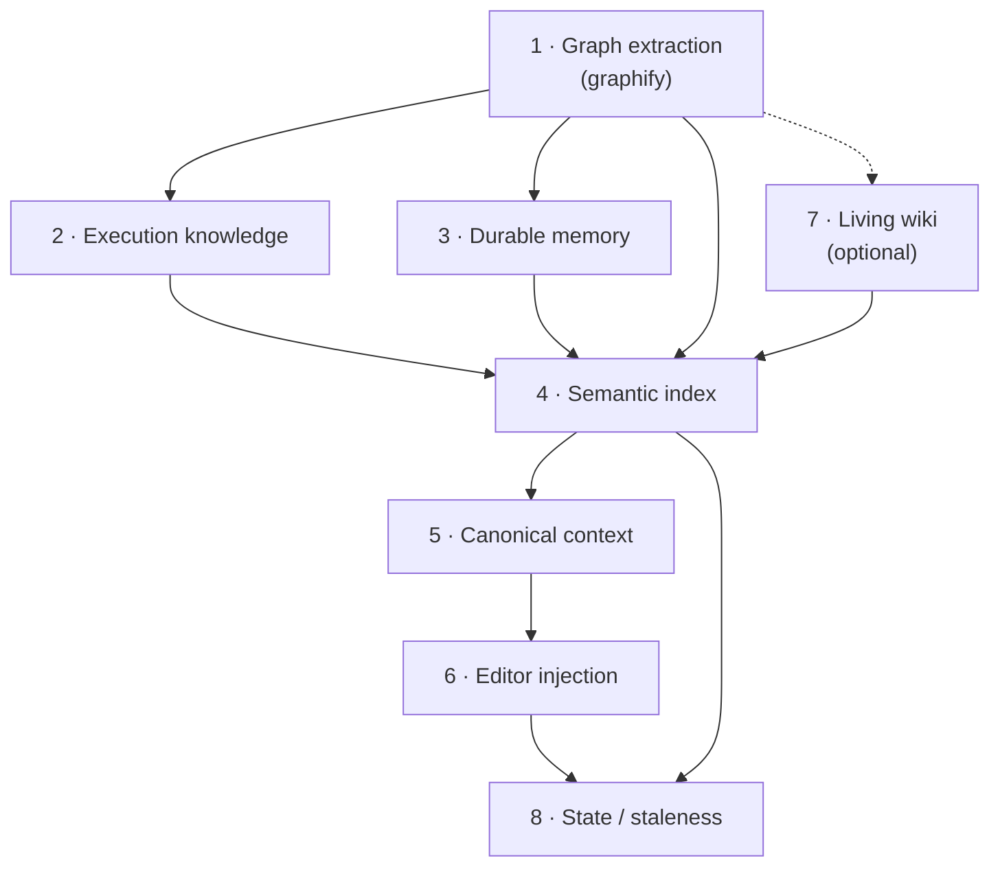
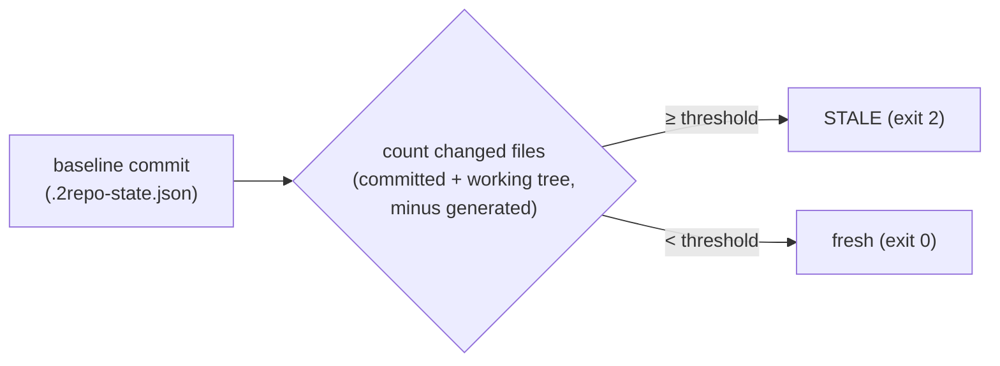
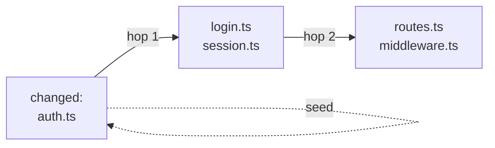
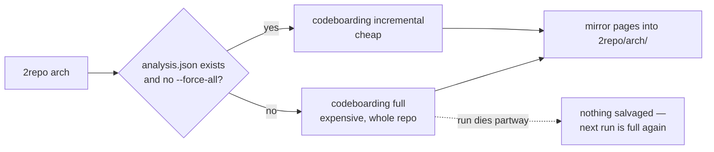

# 2repo — internals, logic & theory

This document explains *how* `2repo` works under the hood: what the moving parts are, how they combine, how incremental refresh is decided, and how staleness is detected. If you just want commands and examples, read **[2repo.md](2repo.md)** instead.

---

## 1. The core idea: one pipeline, seven layers

You're right that `2repo` is not a single feature — it's a **pipeline of independent layers that stack on top of each other**. Each layer produces one or more files under `2repo/`, and every layer above consumes the ones below it.


```mermaid
flowchart TD
    A["1 · Graph extraction<br/>(graphify)"] --> B["2 · Execution knowledge"]
    A --> C["3 · Durable memory"]
    B --> D["4 · Semantic index"]
    C --> D
    A --> D
    D --> E["5 · Canonical context"]
    E --> F["6 · Editor injection"]
    A -.-> G["7 · Living wiki<br/>(optional)"]
    G --> D
    F --> H["8 · State / staleness"]
    D --> H
```

The design rule behind the whole thing: **one canonical source, zero duplicated AI summaries.** Everything funnels into `REPO_CONTEXT.md`, and the editor bridge files (Claude/Copilot/Cursor) only *point* at it — they never copy it. Regenerate once, every assistant sees the update.

A second rule: **fail-fast, no placeholders.** If a required artifact is missing (e.g. `GRAPH_REPORT.md`, `EXECUTION.md`), the run aborts rather than writing an empty or fake file. Layers refuse to build on a broken foundation.

Here's what each layer actually is.

### Layer 1 — Graph extraction (`graphify`)
The foundation. `2repo` shells out to the external `graphify` tool, which parses the codebase into a **dependency graph**: nodes are files, edges are relationships (imports, references). Output: `GRAPH_REPORT.md` (human/AI-readable) and `graph.json` (raw graph). Everything else keys off this graph. `graphify` honors `.gitignore`/`.graphifyignore` and skips heavy dirs (`node_modules`, `dist`, `.next`, …).

This is the only layer that calls an LLM as part of *extraction* (for semantic enrichment). The provider is chosen by preset and mapped to a graphify backend: `anthropic→claude`, `openai→openai`, `ollama→ollama`.

### Layer 2 — Execution knowledge (`EXECUTION.md`)
**Purely deterministic — no LLM.** It scrapes the repo for *how to run it*:
- `package.json` scripts, `Makefile` targets, `pyproject.toml` scripts (project/poetry/poe)
- GitHub Actions workflows (parsed for `run:` commands, including block scalars)
- Migration directories (Alembic, Prisma, Django, Flyway…) and tool-hint files

It then distills a short "Quick Commands" list by keyword-matching script names (`test`, `build`, `lint`, `start`, `dev`, `check`, `format`). This is the layer that lets an assistant answer "how do I run the tests?" without guessing.

### Layer 3 — Durable memory (`repo-memory.json` + `REPO_MEMORY.md`)
Facts you explicitly store with `2repo remember`. Three kinds: `fact`, `decision`, `runbook`. Entries are **deduplicated by `(kind, case-insensitive text)`** — re-remembering the same thing updates the existing entry instead of duplicating it. Each entry carries an `id` (SHA-256 prefix of `kind:text`), a `created_at`, and pointers to the git `head` and `index_revision` it was last synced against. The JSON is the source of truth; the `.md` is a human-readable mirror.

### Layer 4 — Semantic index (`repo-index.json`)
The retrieval engine behind `2repo query`. It chunks the text artifacts from layers 1–3 (plus runtime metadata and, if present, wiki pages) and builds a **TF-IDF vector index** served by cosine similarity. Full algorithm in §4.

### Layer 5 — Canonical context (`REPO_CONTEXT.md`)
A small, always-regenerated index page that lists the core artifacts, the current index metadata (provider, model, revision, chunk count, memory count), and the query commands. This is *the* file assistants are pointed at.

### Layer 6 — Editor injection (bridge files)
Writes one editor-specific file that references `REPO_CONTEXT.md`:
- **Claude** → a managed block in `CLAUDE.md` that `@`-imports `2repo/REPO_CONTEXT.md` (Claude Code auto-loads `CLAUDE.md` and resolves `@`-imports, so this is the only file on the load path — nothing under `.claude/` is picked up on its own)
- **Copilot** → managed block in `.github/copilot-instructions.md`
- **Cursor** → `.cursor/rules/2repo.mdc` (a global always-apply rule)
- **Neutral** → nothing (for local/custom setups)

Regardless of target, this layer also writes two managed blocks that the
generated tree depends on:
- **`.graphifyignore`** → lists `2repo/` and `.codeboarding/`. graphify self-prunes only the single directory it writes to, so without this it re-ingests our own wiki, arch pages and `EXECUTION.md` as source on the next extraction — generated prose feeding the next generation of it.
- **`.gitattributes`** → marks `2repo/**` as `linguist-generated` so the committed artifacts collapse in reviews. Deliberately not `-diff`, which would suppress the textual diff locally too.

Injected blocks are wrapped in `<!-- 2repo:start --> … <!-- 2repo:end -->` markers and rewritten **only if the content changed** — so your own edits around them survive, and re-running is idempotent.

### Layer 7 — Living wiki (optional, `2repo/wiki/`)
One LLM-written Markdown page per source file, plus `OVERVIEW.md`. This is the only layer that's *incremental by design* (§3), because it's the expensive one — every page is an LLM call. Generated pages are folded back into the index (layer 4) so `query` can retrieve them.

**Audience: machines.** One page per file is the right granularity for retrieval and the wrong one for a human — see §8. These pages stay in the repo and are never mirrored into the vault.

### Layer 7c — Module tier (`2repo/modules/`)
One note per meaningful directory, written from the per-file pages rather than from source, plus a hub note. Filenames are namespaced by repository (`<repo>_src_ui.md`, `<repo>_INDEX.md`). This is the human-facing tier and the only wiki-side output mirrored into the Obsidian vault. Modules are chosen top-down over the directory tree (subtree ≤ 40 documented files becomes a module; bigger trees split into children; the result merges upward until it fits 30 modules), and their edges are the file-level dependency graph lifted to module level. Rationale and the prior art it follows: §8.

### Layer 7b — Architecture layer (optional, `2repo/arch/`)
The tier *above* the per-file wiki: component/subsystem narrative pages plus **Mermaid architecture diagrams**, generated by [CodeBoarding](https://github.com/CodeBoarding/CodeBoarding) (static analysis + LLM) behind a thin adapter (`scripts/repo/arch.py`). Also opt-in and expensive; also folded back into the index (layer 4). Two design points make it swappable and safe:
- **Isolation seam.** The CodeBoarding-specific surface is confined to a handful of helpers in `scripts/repo/arch.py` (`_run_codeboarding`, `_render_markdown`, `_codeboarding_python`, `_codeboarding_dir`, plus the `_RENDER_SCRIPT` and promo-stripping in `_clean_page`). CodeBoarding writes its native analysis + incremental baseline to `<repo>/.codeboarding/`; because this version's local mode emits only `analysis.json`, the adapter renders the Markdown itself (via `render_docs` in CodeBoarding's venv), then mirrors the pages into `2repo/arch/` (the indexed, canonical copy). Replacing the generator later means reworking only those helpers — everything downstream keys off `2repo/arch/`.
- **Deterministic provider.** CodeBoarding selects its LLM provider by which credential env var is set. Since the container may hold several keys at once, the adapter runs it with a scrubbed environment exposing only the selected provider's credentials (ollama/openai/anthropic; `claude-code` is rejected — no CLI backend). Telemetry is force-disabled.

Like the wiki, it deliberately does **not** move the staleness baseline.

### Layer 8 — State (`.2repo-state.json`)
The bookkeeping layer that makes staleness detection possible (§2). Records the git commit the artifacts were generated from, the stale threshold, and per-layer metadata.

---

## 2. How staleness detection works

The question "is this repo stale?" reduces to: **has the code drifted far enough from the commit the artifacts were built at?**

### The baseline
Every full run (`graph`, `reindex`, `remember`) ends by writing `2repo/.2repo-state.json`:

```json
{
  "generated_at": "2026-07-11T…Z",
  "head": "<git commit SHA at generation time>",
  "threshold": 5,
  "layers": { "execution": {…}, "memory": {…}, "index": {…}, "context": {…} }
}
```

The `head` field is the **baseline commit** — the anchor everything is measured against.

> **Important nuance:** `2repo wiki` deliberately does **not** rewrite the state. The graph baseline must only move when `graphify` itself re-runs; otherwise a wiki refresh would make `check` report a genuinely stale graph as "fresh."

### The measurement (`2repo check`)
1. Read the baseline commit from state. Abort if the commit no longer exists (history was rewritten).
2. Compute the set of **changed files since the baseline**, which is the union of:
   - **committed drift** — `git diff --name-only <baseline>..HEAD`
   - **working-tree drift** — `git status --porcelain` (modified, staged, *and* untracked files)
3. Exclude `2repo`'s own outputs from that set (`2repo/**`, `.cursor/**`, `.codeboarding/**`, `CLAUDE.md`, `.github/copilot-instructions.md`, `.graphifyignore`, `.gitattributes`) — regenerating artifacts must never count as the repo changing.
4. Compare the count to the threshold: **stale ⇔ `threshold > 0` and `changed_count ≥ threshold`.**

Exit codes make it scriptable: `0` = fresh, `2` = stale, `1` = no state yet.


```mermaid
flowchart LR
    S["baseline commit<br/>(.2repo-state.json)"] --> D{"count changed files<br/>(committed + working tree,<br/>minus generated)"}
    D -->|"≥ threshold"| ST["STALE (exit 2)"]
    D -->|"< threshold"| FR["fresh (exit 0)"]
```

**This is a heuristic by file *count*, not by content or semantics.** Changing 5 trivial files marks the graph stale; changing 1 critical file does not. The threshold (`REPO_STALE_THRESHOLD`, default 5) is your sensitivity knob — set it to `0` to disable staleness warnings entirely.

### The automation (`2repo hook`)
`2repo hook` installs a `post-commit` git hook that re-runs the same count-vs-threshold logic after every commit and prints a warning when the graph may be stale. Two differences from `check`:
- The hook only counts **committed** drift (`git diff <baseline>..HEAD`), since it fires right after a commit.
- If you set `REPO_WIKI_AUTO=1` *before* installing the hook, and the alias `2repo` is on your PATH, the hook also auto-runs `2repo wiki .` to keep the wiki fresh.

---

## 3. How incremental refresh really works

There are two independent notions of "incremental," and they work very differently.

### 3a. `graph --update` — delegated incrementality
`2repo graph <repo> --update` swaps `graphify extract` for `graphify update`. The incrementality of the *graph itself* is entirely `graphify`'s job — it re-extracts only what changed. Everything downstream (execution, memory, index, context, injection) is **rebuilt in full every time**, because those layers are cheap and deterministic. So "incremental graph" means: expensive graph extraction is incremental; the fast layers on top are always recomputed for consistency.

### 3b. `wiki` — genuine incremental generation
The wiki is where incrementality matters, because each page is an LLM call and re-documenting an untouched 500-file repo would be absurdly expensive. Three mechanisms combine:

**Step 1 — What changed (the seed set).** Three ways to seed:
- explicit files: `2repo wiki . src/auth.ts` → seed = those files
- default: `git diff` against the state baseline → seed = changed files
- `--force-all` or no usable baseline → seed = *every* documentable graph file

**Step 2 — Graph closure (2-hop neighbor expansion).** This is the key insight. When you change `auth.ts`, the files that *depend on* `auth.ts` may now be documented incorrectly — so their pages need refreshing too. The seed set is expanded along the (undirected) dependency graph up to **2 hops** via breadth-first search:


```mermaid
flowchart LR
    C["changed:<br/>auth.ts"] -->|"hop 1"| N1["login.ts<br/>session.ts"]
    N1 -->|"hop 2"| N2["routes.ts<br/>middleware.ts"]
    C -.->|"seed"| C
```

So a 1-file change can legitimately regenerate a handful of related pages, but not the whole repo.

**Step 3 — Content-hash cache (the cost floor).** Even after expansion, each candidate page is only regenerated if its source file's SHA-256 hash differs from `.wiki-cache.json` (or the page file is missing). **Unchanged source ⇒ cache hit ⇒ zero tokens spent.** `--force-all` bypasses the cache.

**Step 4 — Pruning & overview.** Pages whose source file disappeared are deleted, and stale cache entries dropped. `OVERVIEW.md` is regenerated only if something was written, removed, or it's missing.

After generation, the wiki pages are folded into the semantic index and referenced from `REPO_CONTEXT.md` — but, as noted above, the **state baseline is not touched**.

`--dry-run` runs steps 1–2 and the cache check, then prints which pages *would* regenerate without making a single LLM call — the safe way to preview cost.

> Model selection for the wiki follows its own cascade: `--preset` > `REPO_PRESET_WIKI` > `REPO_PRESET_GRAPH` > default preset. Use a small/fast model for routine refreshes and a big model for `--force-all` rebuilds.

### 3c. `arch` — delegated, all-or-nothing incrementality
The architecture layer's incrementality is CodeBoarding's, not 2repo's. The adapter (`scripts/repo/arch.py`) makes exactly one decision before handing over:


```mermaid
flowchart LR
    S["2repo arch"] --> D{"analysis.json exists<br/>and no --force-all?"}
    D -->|"yes"| I["codeboarding incremental<br/>cheap"]
    D -->|"no"| F["codeboarding full<br/>expensive, whole repo"]
    I --> M["mirror pages into 2repo/arch/"]
    F --> M
    F -.->|"run dies partway"| X["nothing salvaged —<br/>next run is full again"]
```

`analysis.json` is both the rendered pages' source *and* the incremental baseline — there is no separate cache file and no per-component hash check on 2repo's side. Three consequences worth internalising:

- **The first successful run is the expensive one.** It is a full analysis of the whole repo. Every run after it is incremental and much cheaper, until you pass `--force-all` or delete `.codeboarding/`.
- **A failed run is not resumable.** CodeBoarding writes `analysis.json` at the end of a run, not progressively. If a run dies — crashed CLI, killed container, unreachable model — nothing is salvaged and the *next* run starts a full analysis again from zero. There is no partial-progress file to resume from.
- **`--force-all` does not delete the old pages up front.** It re-runs the full analysis, then `_mirror_pages` overwrites `2repo/arch/` and prunes pages the new analysis no longer produces. So a failed `--force-all` leaves the previous pages intact.

Unlike the wiki, the arch layer never consults git: it does not diff against the `.2repo-state.json` baseline and does not expand along the dependency graph. Deciding what changed is entirely CodeBoarding's `fingerprint.json` business.

`--dry-run` prints which mode *would* run (`baseline present` / `no baseline yet` / `--force-all`) and makes no LLM calls — the cheapest way to check whether you are about to pay for a full analysis.

### 3d. `modules` — cached bodies, always-fresh wiring
The module tier splits every note into two halves with different lifetimes:

- **The LLM body** (Purpose / Key parts / How it connects / Where to start) is cached in `.modules-cache.json` under a SHA-256 over the module's member paths *and* the text of their per-file pages. Change a file → its wiki page changes → that module's digest changes → exactly that one module is rewritten. Nothing else in the tier costs a token.
- **The deterministic wrapper** (YAML frontmatter, `## Connected modules` wikilinks, the `## Files` list) is re-rendered for *every* module on *every* run, from the current graph. That is free, and it means links and file lists never drift from the codebase even when no body was regenerated.

That split is also the upgrade path: an existing tier picks up changes to the wrapper format on the next ordinary run, without regenerating a single body.

The `updated:` frontmatter timestamp deliberately records when the *body* was last written, not when the wrapper was last rendered — otherwise every run would rewrite every note, churning the index revision and Obsidian's file times for nothing.

---

## 4. The semantic retrieval algorithm (`2repo query`)

No embeddings model, no vector database — the index is a **classic TF-IDF + cosine similarity** engine implemented in pure Python, with a pseudo-relevance-feedback twist. That keeps it dependency-light and fully local.

**Building the index (`build_index`):**
1. **Collect chunks** from: runtime metadata (1 chunk), every `.md`/`.json`/`.txt` under `2repo/` (excluding the index/state/cache files themselves), and every durable memory entry.
2. **Chunk** long text into paragraph-like blocks capped at 1200 chars.
3. **Tokenize**: lowercase `[a-z0-9]{2,}` tokens, with a light plural fold (`configs` → also `config`) to improve recall. Not a real stemmer.
4. **Weight**: `idf(t) = log((1+N)/(1+df(t))) + 1`; term weight = `(tf/max_tf) · idf`. Each chunk vector is stored sparse with its precomputed L2 norm.

**Querying (`semantic_query`):**
1. Vectorize the query with the stored IDF; cosine-score it against every chunk → **base score**.
2. **Query expansion (pseudo-relevance feedback):** take the top seed chunks (≈ `top_k·2`), harvest their highest-weighted terms, and add the 8 strongest *new* terms to the query vector at weight `0.35`. This pulls in synonyms/co-occurring vocabulary the original query didn't contain.
3. Re-score with the expanded query, then blend: **`final = 0.65·base + 0.35·expanded`**.
4. Return the top-`k` chunks with their `kind` (`artifact` / `memory` / `runtime`), `source`, and score.

The blend keeps the original query dominant (65%) while letting expansion break ties and surface related context (35%).

---

## 5. The revision & digest model

How does the system know the index is consistent with memory and artifacts? Every build computes a **revision hash**:

```
revision = sha256( artifact_digest : runtime_digest : memory_digest )
```

- `artifact_digest` — hash of all indexed artifact paths + bytes
- `runtime_digest` — hash of the runtime metadata (provider, model, mode, head)
- `memory_digest` — hash of all memory entries (`id|kind|text`)

After the index is built, `sync_entries` stamps every memory entry with the current `head` and this `revision`, so each fact records exactly which git state and index build it was last aligned with. Change any input — a new artifact, a new memory entry, a different model — and the revision changes, making drift detectable at the metadata level (independent of the file-count staleness heuristic in §2).

---

## 6. Which layers each command runs

Putting it together — this is the "what combines with what" map:

| Command | Graph | Execution | Memory | Index | Context | Injection | Wiki | Modules | Arch | Writes state |
|---|:--:|:--:|:--:|:--:|:--:|:--:|:--:|:--:|:--:|:--:|
| `all` (bare `2repo <repo>`) | ● | ● | ● | ●×3 | ●×3 | ●×3 | ● | ● | ● | ● |
| `graph` / `graph --update` | ● | ● | ● | ● | ● | ● | — | — | — | ● |
| `reindex` | — | — | ● | ● | ● | ● | — | — | — | ● |
| `remember` | — | — | ● (add) | ● | ● | ● | — | — | — | ● |
| `wiki` | — | — | ● | ● | ● | ● | ● | ● | — | — |
| `arch` | — | — | ● | ● | ● | ● | — | — | ● | — |
| `query` | — | — | — | read | — | — | — | — | — | — |
| `check` | — | — | — | — | — | — | — | — | — | read |
| `hook` | — | — | — | — | — | — | — | — | — | — |

Reading the table:
- **`all`** runs `graph → wiki → arch` in that order, and each of the three calls `_build_layers` on the way out — so memory/index/context/injection are rebuilt **three times** in one run (`●×3`). They are deterministic and cheap, so this costs seconds, not tokens; the benefit is that a run which dies in the arch layer still leaves a consistent index covering everything the graph and wiki layers produced.
- **`graph`** is the only command that runs the full stack from extraction up.
- **`reindex`** rebuilds everything *above* the graph from existing artifacts — use it after editing memory or switching AI target without paying for re-extraction.
- **`remember`** adds a fact, then rebuilds index→context→injection so the fact is immediately retrievable, and moves the state baseline.
- **`wiki`** runs the per-file layer *and* the module tier built on top of it — the two always move together, so module links can never drift from the page set — then refreshes index+context so both are queryable. It pointedly leaves the state baseline alone (§2).
- **`arch`** behaves exactly like `wiki` (its own optional doc layer, then index+context refresh, no state write), but produces component/topic pages + Mermaid diagrams in `2repo/arch/` instead of per-file pages. It does not run the wiki layer, and the wiki does not run it — the two are independent tiers over the same graph.
- **`query`** and **`check`** are read-only.

---

---

## 7. Change response — what each layer does when things change

§3 explains *how* incrementality works. This section is the practical companion: given some event — a file created, edited, deleted, a run that crashed, a model swapped — what actually recomputes on the next `2repo <repo>`?

### 7.1 What each layer keys off

| Layer | Persisted state | Invalidated by | Cost when nothing changed |
|---|---|---|---|
| Graph (`graphify`) | `2repo/graphify-out/graph.json` + `manifest.json` | graphify's own manifest (per-file) | `update` walks the manifest; near-zero LLM calls |
| Execution | *(none)* | nothing — always regenerated | milliseconds, no LLM (pure file scan of `package.json`, `Makefile`, `pyproject.toml`, workflows, migrations) |
| Memory | `2repo/repo-memory.json` | `2repo remember` only | milliseconds, no LLM |
| Index | `2repo/repo-index.json` | rebuilt in full every time; its **revision** changes when artifacts, memory, or runtime metadata change | seconds, no LLM (TF-IDF is local) |
| Context / Injection | `REPO_CONTEXT.md` + managed blocks in `CLAUDE.md` etc. | rebuilt every time; blocks are only rewritten if the bytes differ | milliseconds, no LLM |
| Wiki | `2repo/wiki/.wiki-cache.json` (SHA-256 per source file) | source-file content hash, or a missing page file | zero LLM calls — every page is a cache hit |
| Modules | `2repo/modules/.modules-cache.json` (SHA-256 per module over its member pages) | a member page changed, or the module's file set moved | zero LLM calls; the deterministic wrapper is still re-rendered (free) |
| Arch | `.codeboarding/analysis.json` + `fingerprint.json` | CodeBoarding's fingerprint | one incremental CodeBoarding run (still an LLM pass, but scoped) |

The dividing line: **everything except the graph, wiki, and arch layers is recomputed unconditionally**, because those layers are deterministic and free. Only the three LLM-backed layers are cached.

### 7.2 Event by event

**You create a new file.**
The graph layer picks it up (`graphify update` sees a new entry in its manifest). The wiki then documents it, because `git status --porcelain --untracked-files=normal` counts untracked files as changed — a new file does **not** need to be committed first. The arch layer notices it only if CodeBoarding's fingerprint decides the component structure moved.

> Ordering matters: wiki candidates come from `graph.json`, so a file that is not yet in the graph gets no page. A bare `2repo <repo>` is safe (graph runs first, in the same run). Running `2repo wiki <repo>` on its own against a stale graph will silently skip the new file — refresh the graph first.

**You edit an existing file.**
Its content hash changes → its wiki page regenerates, plus its 2-hop dependency-graph neighbors (§3b). Committed and uncommitted edits both count: the changed set is the union of `git diff <baseline>..HEAD` and the working-tree/untracked status, minus 2repo's own generated paths.

**You delete or rename a file.**
Once the graph refreshes, the file leaves `candidates`; `_prune_stale_pages` deletes its wiki page and its `.wiki-cache.json` entry is dropped. A rename is seen as a delete + create, so the old page is pruned and a new one generated. Same caveat as above: run the graph layer (or a bare `2repo <repo>`), not `2repo wiki` alone, or the stale page survives.

If the deleted file was the last member of a module, that module disappears too: `modules.py::generate` recomputes `grouped` from the current candidate set, `_prune` deletes the now-orphaned note from `2repo/modules/`, and its `.modules-cache.json` entry is dropped. The vault follows automatically — `mirror_to_vault` calls `vault.mirror_markdown_tree`, which treats the vault's `Generated/Modules/` folder as an exact reflection of `2repo/modules/`: it copies every current note over and `unlink()`s any destination note whose source is gone. So a module deleted (or emptied by scope) vanishes from the vault on the same run, not just from the repo-local tier. Arch pages behave the same way through `mirror_to_vault` in `arch.py` → `Generated/Architecture/`.

**Nothing changed since the last run.**
`2repo <repo>` is close to free on the LLM budget: `graphify update` finds no dirty files, every wiki page is a cache hit ("nothing to regenerate — all pages fresh"), and only the deterministic layers rewrite themselves. The arch layer is the exception — it still performs an incremental CodeBoarding run, which is real work. Use `2repo graph <repo> --update` or `2repo wiki <repo>` if you specifically want to avoid that.

**You narrow or widen the scope** (`.2repoignore`, `--include`/`--exclude`).
Narrowing prunes: files that fall out of scope lose their wiki page, their cache entry is dropped, and any module that becomes empty disappears from the tier and from the vault mirror. Widening costs one LLM call per newly-included file, plus a regeneration of every module whose membership changed. Scope never touches graphify, so the dependency graph — and therefore neighbour expansion and module edges — stays complete either way.

**You switch preset or model.**
This invalidates **nothing**. The wiki cache hashes source bytes, not the model, and CodeBoarding's fingerprint is structural. A better model will only be applied to files that happen to change. To actually re-document a repo with a new model, you must ask for it: `2repo wiki <repo> --force-all`, `2repo arch <repo> --force-all`, or `2repo <repo> --force-all` for everything. The model change *is* visible in the index revision (it feeds `runtime_digest`), but that is metadata, not regeneration.

**You switch AI target** (`--ai-target claude|copilot|cursor|neutral`).
Only the injection step reacts: managed blocks are rewritten in the new target's bridge files. If every block already matches byte-for-byte, 2repo prints `Inject : skipped (all managed blocks already current)` — that is an idempotent re-run, not a misconfiguration.

**You hand-edit a generated page.**
Don't — but know what happens if you do. A hand-edited wiki page is **not** restored on the next run: `_page_is_fresh` only checks the source hash and that the page file exists, so your edit survives until the source file changes or you pass `--force-all`. Arch pages are the opposite: they are re-mirrored from `.codeboarding/` on every arch run, so edits are overwritten. Either way the index picks the edited bytes up (they change `artifact_digest`, hence the revision). Put durable human knowledge in `2repo remember` or the vault's `Notes/` folder instead.

**You delete a generated page by hand.**
The wiki regenerates a missing page only if that file is in the current target set. If nothing changed, the target set is empty and the page stays missing — use `2repo wiki <repo> <the-file>` to target it explicitly, or `--force-all`.

### 7.3 Re-running after a failed run

A `2repo <repo>` that dies partway leaves everything the completed layers wrote on disk, so the retry resumes at layer granularity rather than starting over:

| Failed in | On retry, the graph layer | the wiki layer | the arch layer |
|---|---|---|---|
| Graph | full extract if `graph.json`/`manifest.json` are missing, otherwise `update` | not reached before, so runs now | runs now |
| Wiki | `update` (baseline intact) | resumes: already-written pages are cache hits, only the unwritten remainder costs tokens | runs now |
| Arch | `update` | all cache hits, ~zero cost | **restarts from zero** |

Two things are worth spelling out:

- **The wiki resumes page-by-page — this is 2repo's pause mechanism.** `.wiki-cache.json` is written after every page (not once at the end), and `_page_is_fresh` also requires the page file to exist. So killing a wiki run at page 300 of 430 — a deliberate Ctrl+C to pause it, or a crash — re-uses those 300 for free on the next `2repo wiki <repo>`; only the unwritten remainder costs tokens.
- **The arch layer does not resume at all** (§3c). CodeBoarding writes `analysis.json` only on success, so a crashed *or paused* arch run leaves no baseline and the next attempt is another full analysis. This is the one place where interrupting a run costs you the whole layer — let an arch run finish, or accept redoing it.

Because the state baseline is written by the graph layer and never by wiki or arch, a run that dies in the arch layer still records the graph baseline at the new HEAD. The retry therefore sees "nothing changed" for the wiki — which is correct, since the wiki already completed.

### 7.4 Forcing a rebuild

| Goal | Command |
|---|---|
| Rebuild every layer from scratch | `2repo <repo> --force-all` |
| Re-document every file with a new model | `2repo wiki <repo> --force-all` |
| Full architecture re-analysis | `2repo arch <repo> --force-all` |
| Re-document specific files (+ their neighbors) | `2repo wiki <repo> src/a.ts src/b.ts` |
| Preview cost without spending tokens | `2repo wiki <repo> --dry-run` / `2repo arch <repo> --dry-run` |
| Rebuild index/context/injection from existing artifacts | `2repo reindex <repo>` |
| Hard reset of one layer | delete `2repo/wiki/` / `.codeboarding/` / `2repo/graphify-out/` and re-run |

Deleting `2repo/` entirely resets everything, including the staleness baseline — the next run is a first run.

---

## 8. Why not one note per file — the tier split

The wiki layer produces one page per source file. That is correct for its actual
consumer and catastrophic for the other one, and the difference is worth stating
plainly because it drove the design of the module tier (layer 7c).

### The two audiences

| | Per-file wiki (`2repo/wiki/`) | Module tier (`2repo/modules/`) |
|---|---|---|
| Read by | the semantic index, `2repo query`, `REPO_CONTEXT.md` | a human, in Obsidian |
| Unit | one source file | one meaningful directory |
| Count on a 430-file repo | 430 | ~30 |
| Mirrored to the vault | no | yes |
| Cost to build | one LLM call per file | one LLM call per module, from the pages above |

An AI resolving "where is auth handled" wants the page that corresponds exactly
to `src/auth/login.ts`; retrieval is keyword-driven and more, smaller chunks make
it *better*. A human opening a vault wants twenty things they can name, not four
hundred they cannot. Mirroring the machine tier into a human tool was the actual
defect: it produced 1,340 notes across two repos, none of them linked, burying
the hand-written ones underneath.

### What the rest of the field does

Three traditions, and none of them ships per-file pages into a knowledge graph:

- **AI codebase wikis.** DeepWiki — which this layer's docstring cites as its
  model — generates a *topic-structured* wiki with a table of contents, on the
  order of tens of pages for a large repo. Source files are cited inside those
  pages, never given their own. CodeBoarding, which backs our arch layer, works
  the same way at component granularity. We already had the right shape at the
  top of the stack and the wrong one directly beneath it.
- **API doc generators.** Doxygen, Sphinx, TypeDoc and javadoc *do* emit a page
  per file or symbol — thousands of them. But they are consumed through search
  and an index, never presented as a network. Per-file granularity is fine there
  precisely because nobody is asked to look at it all at once.
- **PKM practice.** Obsidian's convention for exactly this problem is the Map of
  Content: hub notes that index a domain so the graph reads as hubs and spokes
  rather than a hairball. The companion convention is that generated reference
  material is kept out of the thinking graph — PARA files it under Resources,
  and the common advice is to segregate or exclude it rather than interleave it.

The module tier is the MOC layer, sized the way the AI-wiki tools size theirs.

### What follows from it

- **Only the module tier and the arch layer reach the vault.** `wiki.py` has no
  `mirror_to_vault` at all; `prune_legacy_vault_mirror` clears the flat per-file
  mirror that earlier versions wrote, so an existing vault converges on the new
  layout on the next ordinary run.
- **Links are drawn only between notes that exist in the vault.** Module edges
  come from the file-level dependency graph lifted to module level; member files
  are listed as plain code spans, never as wikilinks, because a link to a note
  that was deliberately not mirrored would render in Obsidian as an unresolved
  ghost node — reintroducing the clutter at one remove.
- **Note filenames carry the repository name.** Obsidian resolves `[[...]]` by
  filename across the entire vault, and a vault holds many projects — two repos
  with a `src/ui/` would otherwise both produce `src_ui.md`, and a link meant for
  one could resolve to the other, welding two project graphs together. The prefix
  makes resolution unambiguous; the link alias (`[[repo_src_ui|src/ui/]]`) keeps
  the rendered text short.
- **The graph is drawn, not just linked.** Every module note carries a Mermaid
  flowchart of itself plus its direct neighbours, and the hub note carries the
  whole module map. Obsidian renders Mermaid natively, so the architecture is
  visible *in the note* instead of requiring a trip to the global graph view —
  which is the view that was unusable in the first place. Edges are undirected
  (`---`): lifting file edges to module level symmetrises them, so an arrow would
  assert a direction the data no longer carries. The overview diagram is capped
  at `_MAX_DIAGRAM_EDGES`, dropping the lowest-degree connections first and
  saying how many it hid — a 30-module graph can hold 435 edges, and past a few
  dozen a flowchart stops being a map.
- **Frontmatter is not decoration.** `tags: 2repo, 2repo/module, project/<name>`
  is what lets the graph view separate generated notes from hand-written ones;
  without it the vault has no way to tell the two apart, which was half of the
  original complaint.
- **Scope is not the fix.** Excluding tests and docs from a 430-file repo leaves
  285 pages. Filtering is for cost control and noise; the tier split is what makes
  the vault readable.

See **[2repo.md](2repo.md)** for the command reference and examples, **[2brain.md](2brain.md#configuration-reference)** for shared configuration, and the main **[README](../README.md)** for installation.
