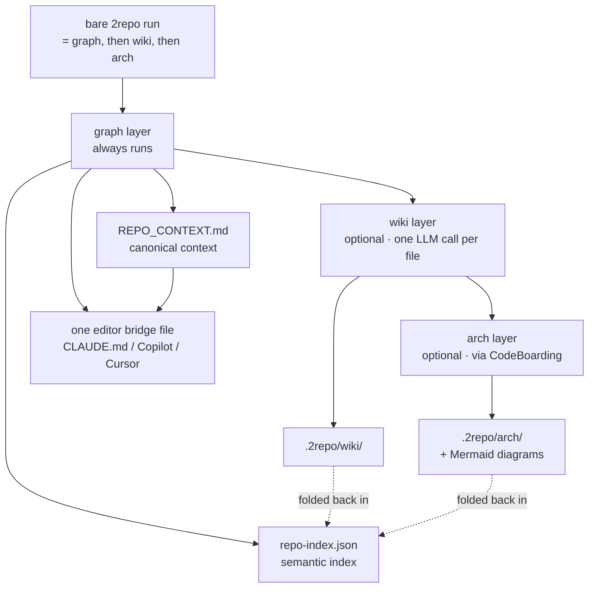

# 2repo — repository intelligence for AI coding sessions

**What it is:** deterministic repository artifacts generated inside the repo (`.2repo/*`) plus one optional editor bridge file for your selected AI target.

**How it works:** `2repo ~/Work/my-repo` runs every layer in order — `graph`, then `wiki`, then `arch`. The graph layer reads the repo, calls graphify, and builds canonical artifacts (`GRAPH_REPORT.md`, `EXECUTION.md`, `REPO_MEMORY.md`, `repo-index.json`, `REPO_CONTEXT.md`), then writes only the selected AI bridge file (Claude/Copilot/Cursor) that points to `REPO_CONTEXT.md`. The wiki and arch layers add per-file pages and component diagrams on top, and mirror them into the Obsidian vault when one is present. Run a single layer by naming it (`2repo graph <repo>`).

**Why it matters:**

When you open a project in Claude Code (or any AI assistant), the AI starts cold — it knows nothing about your codebase. It has to read dozens of files to understand the structure, burning through its context window before you've asked a single question.

With `.2repo/REPO_CONTEXT.md`, the AI starts every session already knowing:
- What the repo does (purpose)
- Which files do what (key files table)
- How modules depend on each other (Mermaid diagram)
- What conventions to follow and what to avoid
- How to build/test/run it

One canonical source. Zero duplicated AI-specific summaries. The AI is useful from the first message.

**For humans too:** open `.2repo/graphify-out/GRAPH_REPORT.md` and understand any repo in 30 seconds — no need to read 50 files.

> Want the theory — how the layers combine, how incremental refresh and staleness detection actually work? See **[2repo-internals.md](2repo-internals.md)**.

---

## Quick start

```bash
2repo ~/Work/my-repo             # 1. generate everything: graph + wiki + arch (pick an AI target when prompted)
2repo query ~/Work/my-repo "how do I run tests?"   # 2. ask the repo a question
2repo wiki ~/Work/my-repo        # 3. generate the per-file living wiki
2repo arch ~/Work/my-repo        # 4. generate the architecture layer (component docs + Mermaid diagrams)
2repo hook ~/Work/my-repo        # 5. (optional) warn on commit when the graph goes stale
```

Everything from here on is the detail behind those commands.

## Subcommands at a glance

| Command | What it does |
|---|---|
| `2repo <repo>` | Shortcut for `2repo graph <repo>` |
| `2repo graph <repo>` | Full pipeline: extract → execution → memory → index → context → AI bridge |
| `2repo graph <repo> --update` | Incremental refresh (changed files only) |
| `2repo graph <repo> --ai-target <t>` | Non-interactive target select: `claude` `copilot` `cursor` `neutral` |
| `2repo reindex <repo>` | Rebuild index/context/injections from existing artifacts |
| `2repo check <repo>` | Is the graph stale vs. the baseline commit? |
| `2repo hook <repo>` | Install the stale-warning post-commit hook |
| `2repo query <repo> "…"` | Semantic retrieval over artifacts + memory (`--top-k N`) |
| `2repo remember <repo> "…"` | Store a durable memory entry (`--kind fact\|decision\|runbook`) |
| `2repo wiki <repo>` | Generate/update the living per-file wiki |
| `2repo arch <repo>` | Generate/update the architecture layer (component docs + Mermaid diagrams) |

---

## Operational recall (`2repo query` + memory)

**What it is:** semantic recall on top of generated artifacts, with durable repository memory entries.

**How it works:** `2repo query <repo> "question"` retrieves ranked snippets from `.2repo/*`; `2repo remember` stores durable facts/decisions/runbooks for future retrieval.

**Why it matters for ADHD:**

Coming back to a project after weeks away means re-reading everything. With ADHD, that re-reading costs real time and attention — and the context still doesn't fully load.

With retrieval + durable memory:
- Ask a repo question and get immediate, grounded snippets
- Store key decisions so they survive context resets
- Rehydrate project context after breaks without re-reading everything

---

## What 2repo does

One tool, one subcommand per category (so no single command does too many different things):

| Command | Category | What it does |
|---|---|---|
| `2repo graph <repo>` | Graph pipeline | Full run: extraction, execution knowledge, memory, index, context, AI injection (`--update` for incremental) |
| `2repo check <repo>` | Staleness | Check if the graph is stale vs the last baseline |
| `2repo hook <repo>` | Staleness | Install the stale-warning post-commit hook |
| `2repo reindex <repo>` | Index | Rebuild index/context/injections from existing artifacts |
| `2repo query <repo> "..."` | Recall | Semantic retrieval over artifacts + memory |
| `2repo remember <repo> "..."` | Recall | Store a durable repository memory entry |
| `2repo wiki <repo>` | Wiki | Generate/update the living LLM wiki incrementally |
| `2repo arch <repo>` | Architecture | Generate/update component/topic docs + Mermaid diagrams (CodeBoarding), incrementally |

`2repo <repo>` with no subcommand is a shortcut for `2repo graph <repo>`. Every other action uses its subcommand (`2repo wiki <repo>`, `2repo check <repo>`, ...).

The `graph` pipeline:

1. Graph extraction (`graphify extract` or `graphify update`)
2. Execution knowledge extraction (`EXECUTION.md`)
3. Repo memory materialization (`repo-memory.json`, `REPO_MEMORY.md`)
4. Semantic index build (`repo-index.json`)
5. Canonical context build (`REPO_CONTEXT.md`)
6. Targeted editor injection (single selected AI target)
7. State write for staleness + layer metadata (`.2repo-state.json`)

Fail-fast rule: if required artifacts are missing, 2repo exits with error (no placeholders).



## Generated artifacts (repo-local only)

After a successful run, the target repository gets:

```text
<repo>/
├── .2repo/
│   ├── EXECUTION.md
│   ├── repo-memory.json
│   ├── REPO_MEMORY.md
│   ├── repo-index.json
│   ├── REPO_CONTEXT.md
│   ├── graphify-out/          # graphify's own output, nested
│   │   ├── GRAPH_REPORT.md
│   │   ├── graph.json
│   │   ├── manifest.json
│   │   └── graph.html
│   ├── wiki/                  # per-file pages — machine tier, not mirrored
│   │   ├── OVERVIEW.md
│   │   ├── <path_with_underscores>.md
│   │   └── .wiki-cache.json
│   ├── modules/               # per-module notes — human tier, mirrored to the vault
│   │   ├── <repo>_INDEX.md
│   │   ├── <repo>_<module_with_underscores>.md
│   │   └── .modules-cache.json
│   ├── arch/                  # optional, only after 2repo arch
│   │   ├── overview.md
│   │   └── <Component>.md
│   └── .2repo-state.json
├── .2repoignore               # hand-editable: which files 2repo documents
├── .graphifyignore            # managed block: keeps .2repo/ out of the graph
├── .gitattributes             # managed block: marks .2repo/ generated
└── .gitignore                 # managed block: excludes regen-only caches/dupes
```

The tree is named after the tool that owns it. 2repo writes the execution,
memory, index, context and wiki artifacts; CodeBoarding writes `arch/`; graphify
gets the nested subdirectory. 2repo arranges that nesting by exporting
`GRAPHIFY_OUT=.2repo/graphify-out` to every graphify subprocess — graphify reads
that env var once at import time and every one of its readers honours it.

The nested directory keeps the basename `graphify-out` on purpose: graphify
injects `basename(GRAPHIFY_OUT)` into its own scan-skip set so it never
re-ingests its output as source, so a basename like `graph` would silently drop
every `graph/` directory in the *target* repo from extraction.

**Committing the artifacts is the intended workflow.** Regenerating them costs
real LLM tokens, the caches that keep re-runs cheap live in the same tree, and a
teammate who clones without them gets a `CLAUDE.md` pointing at a file that does
not exist. They are also not reproducible the way build output is — a different
provider, model, or day yields different text. The generated `.gitattributes`
block marks them `linguist-generated` so they collapse in GitHub reviews;
`graph.html` and `.codeboarding/` are the two things worth adding to your own
`.gitignore`, being large and regenerable respectively.

`2repo arch` also keeps CodeBoarding's native working/baseline directory at
`<repo>/.codeboarding/` (`analysis.json` + `fingerprint.json` + rendered pages).
That directory is what makes incremental arch runs cheap — it is machine-owned,
marked generated (ignored by staleness checks and never documented by the wiki),
and its Markdown is mirrored into the indexed `.2repo/arch/` copy.

Only one integration target is generated per run:

- Claude: `CLAUDE.md`
- Copilot: `.github/copilot-instructions.md`
- Cursor: `.cursor/rules/2repo.mdc`
- Neutral target: no editor-specific file

Every target gets the same directive — use the generated context before
proposing changes — plus the artifact list. Claude's block additionally
`@`-imports `REPO_CONTEXT.md`, which is what puts it in context automatically at
session start; the other two name the path and rely on the assistant reading it.

`2repo wiki` and `2repo arch` mirror their pages into the Obsidian vault **by default**, whenever a vault is found at `VAULT_PATH` — that is, the directory exists and holds either `.obsidian/` or one of the standard 2brain folders. Wiki pages land in `vault/Projects/<repo-name>/Generated/` and architecture pages in `vault/Projects/<repo-name>/Generated/Architecture/`, while `vault/Projects/<repo-name>/Notes/` is reserved for human-authored notes. The other subcommands (`graph`, `reindex`, `query`, …) never touch the vault.

Override the default in either direction:

| Setting | Effect |
|---|---|
| *(nothing)* | Mirror when a vault is found, skip quietly when it is not |
| `--no-mirror-vault` | Never mirror, this run |
| `--mirror-vault` | Always mirror, and fail loudly if the pages or vault are missing |
| `REPO_MIRROR_VAULT=0` in `.env` | Never mirror |
| `REPO_MIRROR_VAULT=1` in `.env` | Always mirror |

The command-line flag always beats the env var, which always beats auto-detection.

### File objectives

| File | Objective |
|---|---|
| `.2repo/graphify-out/GRAPH_REPORT.md` | Human + AI summary of repository structure, modules, and relationships |
| `.2repo/graphify-out/graph.json` | Raw graph data produced by graphify |
| `.2repo/EXECUTION.md` | Build/test/runbook-style operational knowledge extracted from the repo |
| `.2repo/repo-memory.json` | Durable machine-readable memory entries stored by 2repo |
| `.2repo/REPO_MEMORY.md` | Human-readable rendering of durable memory entries |
| `.2repo/repo-index.json` | Semantic retrieval index used by `2repo query` |
| `.2repo/REPO_CONTEXT.md` | Canonical context synthesized for AI assistant consumption |
| `.2repo/.2repo-state.json` | Baseline commit + metadata used for staleness checks and hooks |
| `.2repo/wiki/*.md` | Living wiki: per-file documentation pages + `OVERVIEW.md` (via `2repo wiki`) |
| `.2repo/wiki/.wiki-cache.json` | Content-hash cache enabling incremental wiki regeneration |
| `.2repo/arch/*.md` | Architecture layer: component/topic pages with Mermaid diagrams + `overview.md` (via `2repo arch`) |
| `.codeboarding/` | CodeBoarding's native working/baseline dir (incremental baseline for `2repo arch`); machine-owned |
| `.graphifyignore` | Managed block keeping `.2repo/` and `.codeboarding/` out of graphify's source scan |
| `.gitattributes` | Managed block marking `.2repo/**` as generated so it collapses in reviews |
| `.gitignore` | Managed block excluding regeneration-only caches and duplicates (graphify's raw dumps, its dated snapshot dirs, the wiki/module incremental caches, `.codeboarding/`) — everything else under `.2repo/` is committed |
| `CLAUDE.md` | Managed block that `@`-imports `REPO_CONTEXT.md` into every Claude Code session |
| `.github/copilot-instructions.md` | Copilot integration instructions with managed 2repo context block |
| `.cursor/rules/2repo.mdc` | Cursor global project rule that applies 2repo context |

## Commands

```bash
# Full run — `all` is the default command, so these two are equivalent
2repo /path/to/repo
2repo all /path/to/repo

# One layer only
2repo graph /path/to/repo

# Optional non-interactive target selection (otherwise 2repo shows a small CLI selector)
2repo graph /path/to/repo --ai-target copilot

# Every layer at once (graph + wiki + arch) — this is what a bare `2repo <repo>` runs
2repo all /path/to/repo
2repo all /path/to/repo --force-all              # rebuild every layer from scratch
2repo all /path/to/repo --ai-target neutral      # skip the interactive target selector

# Incremental graph update
2repo graph /path/to/repo --update

# Rebuild index/context/injections from existing artifacts
2repo reindex /path/to/repo

# Staleness check / hook
2repo check /path/to/repo
2repo hook /path/to/repo

# Semantic retrieval
2repo query /path/to/repo "how do I run tests?" --top-k 5

# Durable repo memory
2repo remember /path/to/repo "Use make test for fast CI parity" --kind runbook --source manual

# Living wiki (LLM-generated, incremental)
2repo wiki /path/to/repo                        # regenerate pages for changed files + 2-hop graph neighbors
2repo wiki /path/to/repo src/auth.ts src/db.ts  # target specific files (+ their graph neighbors)
2repo wiki /path/to/repo --force-all            # full rebuild (ignore cache and baseline)
2repo wiki /path/to/repo --dry-run              # preview which pages would regenerate (no LLM calls)
2repo wiki /path/to/repo --no-mirror-vault      # skip the vault mirror (on by default when a vault exists)

# Architecture layer (component/topic docs + Mermaid diagrams, via CodeBoarding)
2repo arch /path/to/repo                         # incremental if a baseline exists, else a full analysis
2repo arch /path/to/repo --force-all             # full re-analysis (ignore the incremental baseline)
2repo arch /path/to/repo --dry-run               # report full-vs-incremental without calling the LLM
2repo arch /path/to/repo --no-mirror-vault       # skip the vault mirror (on by default when a vault exists)
```

`--kind` values:

- `fact`
- `decision`
- `runbook`

### A typical session, start to finish

```bash
# First time on a repo — generate everything, choose Claude as the AI target
2repo graph ~/Work/api --ai-target claude

# Capture a decision you don't want to re-derive later
2repo remember ~/Work/api "Auth lives in src/auth; tokens are RS256" --kind decision
2repo remember ~/Work/api "make test runs the fast suite; make e2e is slow" --kind runbook

# A week later, coming back cold — ask instead of re-reading
2repo query ~/Work/api "where is request validation handled?" --top-k 5

# After a feature branch touched a few files — cheap incremental refresh
2repo graph ~/Work/api --update
2repo wiki ~/Work/api               # only changed files + their graph neighbors regenerate

# Keep it honest automatically
2repo hook ~/Work/api               # commits now warn when the graph drifts
```

## Living wiki (`2repo wiki`)

**What it is:** DeepWiki-style living documentation — one readable Markdown page per source file, plus a top-level `OVERVIEW.md`, written to `.2repo/wiki/`. Pages describe purpose, key elements, and graph relationships so humans and AI can understand a file without reading it.

**Incrementality is the core design** (this is what makes LLM documentation affordable):

1. Changed files are detected via `git diff` against the `.2repo-state.json` baseline commit (or pass explicit files: `2repo wiki <repo> src/auth.ts`)
2. The changed set expands to dependency-graph neighbors up to **2 hops** (from `.2repo/graphify-out/graph.json`)
3. A per-file content-hash cache (`.2repo/wiki/.wiki-cache.json`) skips pages whose source did not change — untouched pages cost zero tokens
4. Pages whose source file disappeared are pruned automatically

Page naming replaces `/` and `.` with `_` (e.g. `src/auth/login.ts` → `src_auth_login_ts.md`).

Model selection: `--preset NAME` > `REPO_PRESET_WIKI` > `REPO_PRESET_GRAPH` > default preset. Use a fast model for routine updates and a big model for `--force-all` rebuilds. Wiki generation goes through the shared `call_llm` path, so any provider works here — including the subscription-backed CLI providers `claude-code` and `copilot-cli` (no metered API key; `copilot-cli` draws on your GitHub Copilot request allowance). See **[docs/2brain.md](2brain.md#presets--mixing-local-and-paid-models)** for the provider list.

After generation the wiki pages are folded into the semantic index (`2repo query` retrieves them) and referenced from `REPO_CONTEXT.md`. Wiki pages are **generated artifacts — never edit them by hand**; regenerate with `2repo wiki <repo>`.

**These pages are the machine tier and are not mirrored into the vault.** One page per file is the right granularity for retrieval and the wrong one for a human. The same run builds the [module tier](#module-tier-2repomodules) on top of them, and that is what reaches Obsidian. Keep human-written project notes in `vault/Projects/<repo-name>/Notes/` so they are never touched by a refresh.

Post-commit automation: `2repo hook` always adds a wiki refresh reminder to the stale warning. Set `REPO_WIKI_AUTO=1` before running `2repo hook` to make the hook run `2repo wiki .` automatically after commits (requires the `2repo` alias on the host).

## Architecture layer (`2repo arch`)

**What it is:** the tier *above* the per-file wiki. Where `2repo wiki` writes one page per source file, `2repo arch` clusters the codebase into **components/subsystems** and writes narrative "how X works" pages plus **Mermaid architecture diagrams** — the two things the file-by-file wiki cannot give you. Output lands in `.2repo/arch/` (`overview.md` + one page per component).

**How it works:** it delegates to [CodeBoarding](https://github.com/CodeBoarding/CodeBoarding) (MIT) — static analysis (language servers) + LLM reasoning → Mermaid diagrams + component Markdown. 2repo runs it behind a thin adapter, then mirrors the rendered Markdown into `.2repo/arch/` so the pages fold into the semantic index (`2repo query` retrieves them) and are referenced from `REPO_CONTEXT.md`.

**Incrementality:** CodeBoarding keeps a baseline in `<repo>/.codeboarding/` (`analysis.json` + `fingerprint.json`). When that baseline exists, `2repo arch` runs an incremental re-analysis of only the changed parts; otherwise (or with `--force-all`) it runs a full analysis. `--dry-run` reports which mode would run without any LLM calls.

**Model selection:** `--preset NAME` > `REPO_PRESET_ARCH` > `REPO_PRESET_WIKI` > `REPO_PRESET_GRAPH` > default preset. Point it at an **ollama**, **openai**, or **anthropic** preset — `claude-code` presets are not usable here because CodeBoarding has no CLI/subscription backend (2repo fails fast with guidance if you try). Provider selection is deterministic: the adapter runs CodeBoarding with an environment exposing only the selected provider's credentials, even if several API keys are present in the container.

**Privacy:** CodeBoarding telemetry is disabled unconditionally (`CODEBOARDING_TELEMETRY=false` / `DO_NOT_TRACK=1`), consistent with 2repo's local-first design. No source code leaves the machine.

Like the wiki, the architecture layer is **opt-in and expensive** (never run by `2repo graph`), its pages are **generated artifacts — never edit them by hand** (regenerate with `2repo arch <repo>`), and it deliberately does **not** move the staleness baseline (only `graphify` does).

> Swappable by design: if CodeBoarding is ever abandoned, only two helpers in `scripts/repo/arch.py` (`_run_codeboarding` and `_codeboarding_dir`) know the tool — replace them with another generator that emits Markdown into `<repo>/.codeboarding/` and the rest (indexing, context, CLI) is unchanged.

## Module tier (`.2repo/modules/`)

**What it is:** one note per meaningful directory — the tier between the per-file wiki and the whole-repo architecture view. This is what you read, and the only wiki-side output mirrored into the Obsidian vault.

**Why it exists.** The per-file wiki is written for machines: one page per source file, hundreds of them, consumed through the semantic index so an AI never has to open the file. Mirrored into a vault it is unreadable — a 430-file repo becomes 430 disconnected notes that bury your hand-written ones. Every mature tool in this space documents *units of meaning* instead: DeepWiki emits a few dozen topic pages, CodeBoarding (our arch layer) emits component pages, and Obsidian practice calls the same shape a Map of Content. The module tier is that layer.

**How modules are chosen.** Top-down over the directory tree: a directory whose entire subtree holds at most 40 documented files becomes one module; anything larger splits into its children, with files sitting directly in the split directory kept as a module of their own. The result is then merged upward until it fits 30 modules. A 430-file frontend lands on ~30 modules like `src/modules/cart/`, `src/ui/`, `scripts/`.

**What each note contains:** an LLM-written Purpose / Key parts / How it connects / Where to start, then three deterministic sections — a **Mermaid diagram** of the module and its direct neighbours (Obsidian renders these natively), `## Connected modules` as wikilinks taken from the real dependency graph, and `## Files` listing members with their one-line purpose. The hub note opens with a **module map**: the whole dependency graph as one flowchart, edge-capped so it stays a map rather than a hairball. YAML frontmatter carries `tags: 2repo, 2repo/module, project/<repo>` so the vault graph can filter or colour generated notes separately from your own (`-tag:2repo` shows only your thinking). `<repo>_INDEX.md` is the hub every module links back to. Note filenames are namespaced by repository — Obsidian resolves wikilinks by filename across the whole vault, so two projects with a `src/ui/` would otherwise collide.

**Cost:** module notes are written from the already-generated per-file summaries, not from source — about 30 LLM calls for a repo where the per-file tier costs 430. A content hash over each module's member pages makes unchanged modules free on re-runs, and the deterministic parts (frontmatter, links, file lists) are re-rendered every run at zero cost, so links stay correct as the codebase moves.

## Scope: which files get documented (`.2repoignore`)

`2repo` asks once per repository which paths to document, and persists the answer to `.2repoignore` at the repo root:

```text
[include]
src/**

[exclude]
**/*.test.ts
docs/**
```

Both sections take gitignore-syntax patterns matched against repo-relative paths — `src/**`, `**/*.test.ts`, `!keep/this.ts`. `[include]` restricts the documented set (empty = everything), `[exclude]` removes from it (empty = nothing), and exclude always wins. The file is hand-editable; the prompt only exists to write it the first time.

```bash
2repo <repo> --exclude '**/*.test.ts,docs/**'   # set it non-interactively (persists)
2repo <repo> --include 'src/**,api/**'          # document only these
2repo <repo> --rescope                          # re-ask the prompt
REPO_INCLUDE=... REPO_EXCLUDE=... 2repo <repo>  # override for one run, no persistence
```

Precedence: `--include`/`--exclude` > `REPO_INCLUDE`/`REPO_EXCLUDE` > `.2repoignore` > the interactive prompt > everything.

**Scope is a documentation filter, not an extraction filter.** It decides which files get a wiki page — and therefore which modules exist and what reaches the vault. graphify still extracts everything, so the dependency graph stays complete and neighbour expansion still sees the real topology. Note that narrowing the scope prunes the pages that fall outside it, and widening it later costs one LLM call per file to regenerate them.

> Scope alone will not make a vault readable — excluding tests and docs takes a 430-file repo to 285, still far too many notes. That is what the module tier is for; scope is for cost control and for keeping noise out of the graph.

## Vault layout

When a vault is present, a run produces:

```text
vault/Projects/<repo-name>/
├── Notes/                     # yours, never touched
└── Generated/
    ├── Modules/               # INDEX.md + one note per module  ← what you read
    └── Architecture/          # CodeBoarding component pages + Mermaid diagrams
```

Per-file wiki pages are **not** mirrored: they stay in `<repo>/.2repo/wiki/` where the AI reads them. Earlier versions did mirror them flat into `Generated/`; the next wiki run clears that legacy output automatically and reports how many notes it removed.

**The mirror is exact, both directions.** `Generated/Modules/` and `Generated/Architecture/` are re-synced from `.2repo/modules/` and `.2repo/arch/` on every `wiki`/`arch` run: changed notes are re-copied, and any vault note whose source note no longer exists is deleted — not just skipped. So removing a module (delete its files, or narrow `.2repoignore` until it has none left) removes that module's page from `.2repo/modules/` *and* from the vault on the next run; editing a file updates its module's note in both places the same way. As with per-file pruning, this only fires once the **graph** layer has seen the change — run a bare `2repo <repo>` (or `2repo graph <repo>` first) rather than `2repo wiki <repo>` alone after deleting or renaming files.


## Re-running: what recomputes, what is cached

2repo is designed to be re-run constantly. Only the three LLM-backed layers are cached; everything else is deterministic and rebuilt every time (milliseconds, no tokens).

| Layer | Cached in | Re-runs when |
|---|---|---|
| Graph | `.2repo/graphify-out/manifest.json` | a file changed (delegated to `graphify update`) |
| Wiki | `.2repo/wiki/.wiki-cache.json` | the source file's SHA-256 changed, or the page is missing |
| Modules | `.2repo/modules/.modules-cache.json` | any per-file page inside the module changed, or its file set moved |
| Arch | `.codeboarding/analysis.json` | every arch run (incremental if the baseline exists, full otherwise) |
| Execution / Memory / Index / Context / Injection | *(not cached)* | always — they are free |

**Creating, editing, deleting files.** Uncommitted and untracked changes count, so you do not have to commit before refreshing. A new file gets a wiki page and a deleted file's page is pruned — but only after the graph layer has seen it, so use a bare `2repo <repo>` (graph runs first) rather than `2repo wiki <repo>` alone when the file set changed.

**Switching model or preset invalidates nothing.** The wiki cache hashes source bytes, not the model. To re-document with a better model, ask explicitly: `--force-all`.

**After a failed run — or a deliberate pause** (Ctrl+C included), retry at layer granularity — completed layers are cache hits, so only the layer that died (or that you interrupted) costs anything. The wiki layer resumes page-by-page: its cache is saved after every page, so killing it at page 300 of 430 re-uses those 300 for free. The exception is `arch`: CodeBoarding writes its baseline only on success, so a crashed or paused arch run leaves nothing to resume from and the next attempt is another full analysis.

> Full mechanics, per-event breakdown and reset recipes: **[2repo-internals.md §7](2repo-internals.md#7-change-response--what-each-layer-does-when-things-change)**.


## Semantic retrieval model

`repo-index.json` stores chunked vectors from:

- `.2repo/*` textual artifacts
- runtime metadata
- persisted repo memory entries

Querying uses cosine similarity over TF-IDF vectors plus query expansion from top-ranked chunks, then returns ranked context snippets.

## State model

2repo writes `.2repo/.2repo-state.json` with:

- baseline git commit (`head`)
- stale threshold (`threshold`)
- per-layer metadata (`layers.execution`, `layers.memory`, `layers.index`, `layers.context`)

`2repo check` compares git changes since the baseline commit while excluding generated artifacts.

## AI target selection and injections

All integrations use one canonical source:

- `.2repo/REPO_CONTEXT.md`

When `--ai-target` is not passed, 2repo prompts a small CLI selection (non-interactive runs default to `neutral`):

- `claude`
- `copilot`
- `cursor`
- `neutral` (local models/custom setups; no editor-specific file generation)

Generated outputs by selection:

- Claude: managed block in `CLAUDE.md`
- Copilot: managed block in `.github/copilot-instructions.md`
- Cursor: `.cursor/rules/2repo.mdc`
- Neutral: no claude/copilot/cursor files

## 2repo configuration (`.env`)

| Variable | Default | What it does |
|---|---|---|
| `REPO_PRESET_GRAPH` | `smart` | Preset used for graphify extraction (`2repo graph`) |
| `REPO_PRESET_WIKI` | falls back to `REPO_PRESET_GRAPH` | Preset used for wiki page generation (`2repo wiki`) |
| `REPO_PRESET_ARCH` | falls back to `REPO_PRESET_WIKI` → `REPO_PRESET_GRAPH` | Preset used for the architecture layer (`2repo arch`); ollama/openai/anthropic only |
| `COPILOT_GITHUB_TOKEN` | — | Token for a `copilot-cli` preset (fine-grained PAT with the "Copilot Requests" permission); see [docs/2brain.md](2brain.md#configuration-reference) |
| `REPO_AI_TARGET` | — | Optional default AI target (`claude`, `copilot`, `cursor`, `neutral`) |
| `REPO_STALE_THRESHOLD` | `5` | Files-changed threshold for stale warnings (`0` disables warning mode) |
| `REPO_WIKI_AUTO` | — | Set to `1` before `2repo hook` to auto-refresh the wiki after each commit |

Shared variables (`LINUX_USERNAME`, `DEFAULT_PRESET`, `PRESET_*`, API keys, Ollama tuning) are documented in **[docs/2brain.md](2brain.md#configuration-reference)**.

---

See the main [README](../README.md) for installation, the shared model cache, and troubleshooting.
