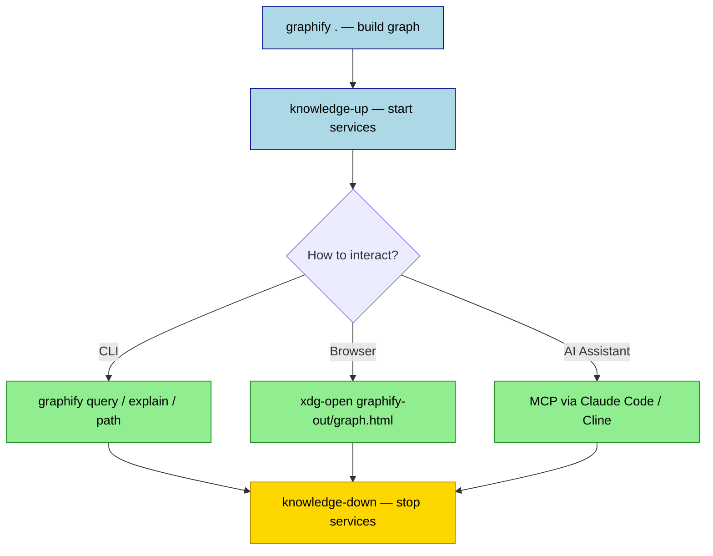

## Summary
Graphify converts your codebase into a queryable knowledge graph, enabling AI assistants to search code structure and semantics without re-reading files. It runs locally using tree-sitter for code analysis and optionally [[Ollama]] for documentation, available via Podman containers or native installation.

## Setup

### Container Mode (Recommended)

> [!TIP] Container mode keeps dependencies isolated and ports consistent across machines.

Register shell commands via `~/.zshrc` or `~/.bashrc`. Adjust `KNOWLEDGE_REPO` if the repo path differs.

```bash
KNOWLEDGE_REPO="/path/to/AI-ollama-tests"

graphify() {
  podman run --rm \
    -v "$(pwd):/workspace:z" -w /workspace \
    python:3.11-slim \
    bash -c "pip install graphifyy -q && graphify $*"
}

knowledge-up() {
  podman run -d --name knowledge-mcp \
    -v "$(pwd):/workspace:z" \
    -v "$KNOWLEDGE_REPO/scripts:/workspace/scripts:ro,z" \
    -w /workspace -p 8888:8888 -p 8081:8081 \
    -e OLLAMA_URL="http://host.containers.internal:11434" \
    -e OLLAMA_MODEL="${OLLAMA_MODEL:-qwen3.5:9b}" \
    python:3.11-slim \
    bash /workspace/scripts/start.sh
  echo "Graphify MCP → http://localhost:8888"
  echo "Wiki MCP     → http://localhost:8081/mcp"
}

knowledge-down() {
  podman stop knowledge-mcp
  podman rm knowledge-mcp 2>/dev/null
}
```

### Native Install

> [!WARNING] The PyPI package is `graphifyy` (double-y). The CLI command is `graphify` (single-y).

```bash
uv tool install graphifyy
# or pipx install graphifyy

# Optional extras
uv tool install "graphifyy[pdf]"   # PDF support
uv tool install "graphifyy[all]"   # PDF + video + Neo4j
```

## Workflow



1. **Build Graph:**
   - `graphify .` (initial scan)
   - `graphify . --update` (incremental after changes)
2. **Start MCP Server:** `knowledge-up`
3. **Query (CLI):**
   - `graphify query "how does auth work?"`
   - `graphify explain "RequestHandler"`
   - `graphify path "router" "database"`
4. **Visualize:** `xdg-open graphify-out/graph.html`
5. **Cleanup:** `knowledge-down`
6. **Git Ignore:** Add `graphify-out/` and `docs/wiki/` to `.gitignore`.

## AI Integrations

- **Claude Code:**
  - Add MCP server to `~/.claude/settings.json`: `"url": "http://localhost:8888"`
  - Install skill: `graphify claude install`
  - Use slash commands: `/graphify query`, `/graphify explain`, `/graphify path`
- **Cline (VS Code):**
  - Add MCP server in settings: `http://localhost:8888`
- **HTTP API:**
  - List tools: `curl http://localhost:8888/tools`
  - Call tool: `POST http://localhost:8888/call` with JSON payload

## Configuration

- **Ollama Backend:**
  - Code parsing is local via tree-sitter.
  - Enable semantic extraction for docs/markdown: `graphify . --backend ollama --model <model>`
- **Exclusions:**
  - Create `.graphifyignore` (gitignore syntax) in project root.
  - Respects both `.gitignore` and `.graphifyignore`.
- **Auto-Rebuild:**
  - `graphify hook install` or add manual `.git/hooks/post-commit` script.

## Quick Reference

| Action | Command / URL |
|---|---|
| Build Graph | `graphify .` |
| Update Graph | `graphify . --update` |
| Start MCP | `knowledge-up` |
| Stop MCP | `knowledge-down` |
| Graphify MCP | `http://localhost:8888` |
| Wiki MCP | `http://localhost:8081/mcp` |
