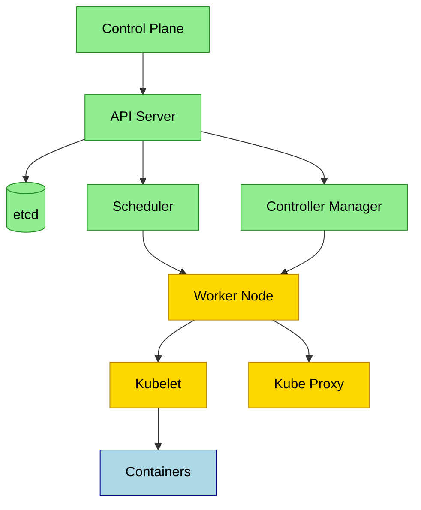
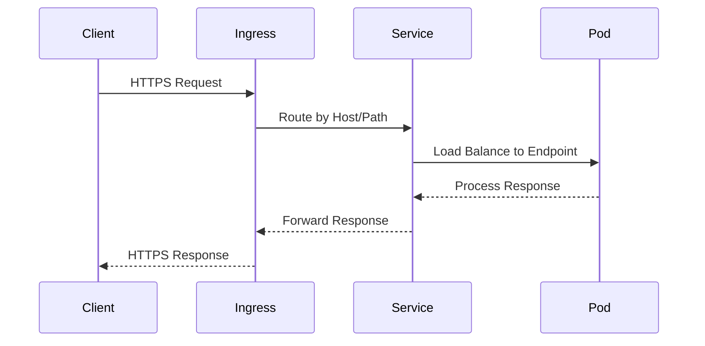

## Summary
Kubernetes automates deploying, scaling, and managing containerized applications across machine clusters. It groups containers into logical units for easy management and discovery, handling the heavy lifting of orchestration so you can focus on building software.

## Core Concepts
- **Pods**: Smallest deployable unit wrapping containers, storage, and network config
- **Nodes**: Physical or virtual machines running pod workloads
- **Cluster**: Connected group of nodes coordinated by a control plane
- **Deployment**: Manages stateless pod replicas and handles rolling updates
- **Service**: Stable network endpoint routing traffic to underlying pods
- **ConfigMap/Secret**: Separates configuration and credentials from container images
- **Namespace**: Virtual boundary for resource isolation and team separation

## Architecture Overview

## Workload Comparison
| Type | State | Guarantee | Best For |
|---|---|---|---|
| Deployment | Stateless | Replica count & rolling updates | Web apps, APIs, microservices |
| StatefulSet | Stateful | Ordered deployment & stable identities | Databases, queues, distributed systems |
| DaemonSet | System-level | Exactly one pod per selected node | Log agents, monitoring, network plugins |
| Job / CronJob | Ephemeral | Runs to completion (optional schedule) | Batch tasks, backups, data migrations |

## Request Routing Flow

## Operational Guidelines
> [!IMPORTANT] Key Takeaways
- Treat infrastructure as immutable: replace nodes/pods instead of patching them
- Always define resource requests and limits to prevent noisy-neighbor issues
- Use meaningful labels for filtering, automation, and cost tracking

> [!TIP] Best Practices
- Validate manifests locally with `kubeconform` or `kubeval` before applying
- Enable PodDisruptionBudgets before draining or scaling down nodes
- Externalize secrets to vaults (AWS KMS, HashiCorp Vault) rather than base64 ConfigMaps

> [!WARNING] Gotchas
- `restartPolicy: Always` on Jobs triggers infinite loops; use `OnFailure` or `Never`
- Services with mismatched selectors silently drop traffic without error logs
- HPA requires metrics-server deployed and valid CPU/memory limits set

> [!DANGER] Critical Issues
- Exposing etcd or kube-apiserver publicly compromises the entire cluster
- Running containers as `root` bypasses security contexts and escalates attack surface
- Skipping etcd backups guarantees catastrophic data loss during control plane crashes

## Mental Model Sketch
> [!NOTE] Excalidraw: Quick hand-drawn map of cluster networking showing pod CIDR, service VIP, node ports, and ingress controller routing paths