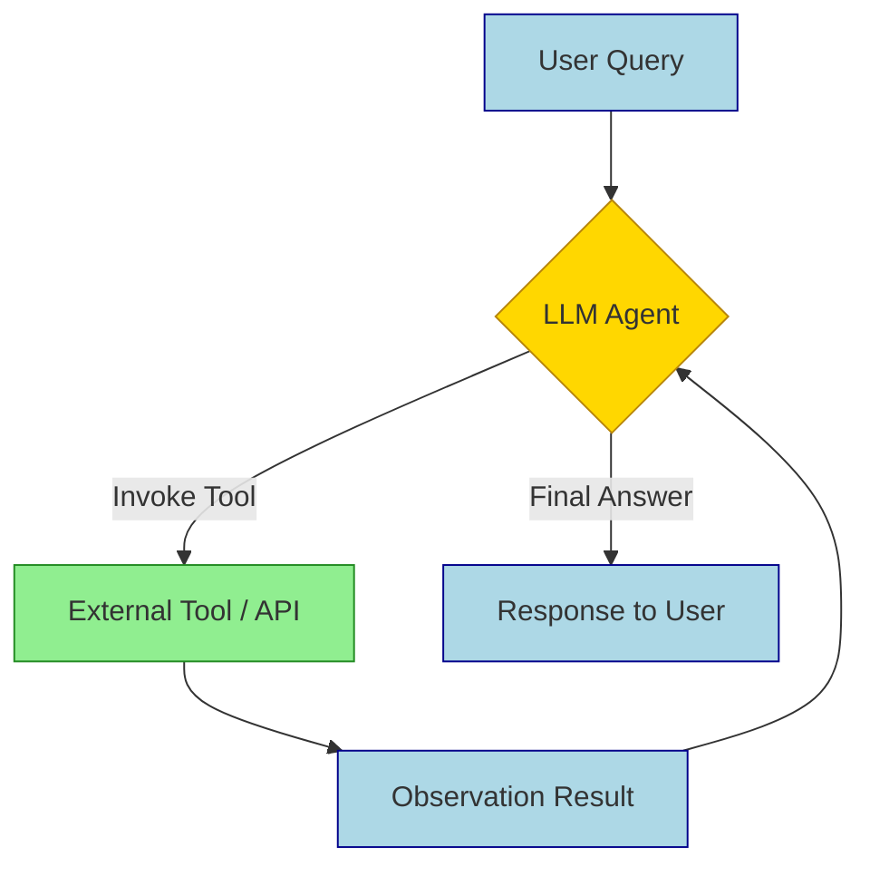
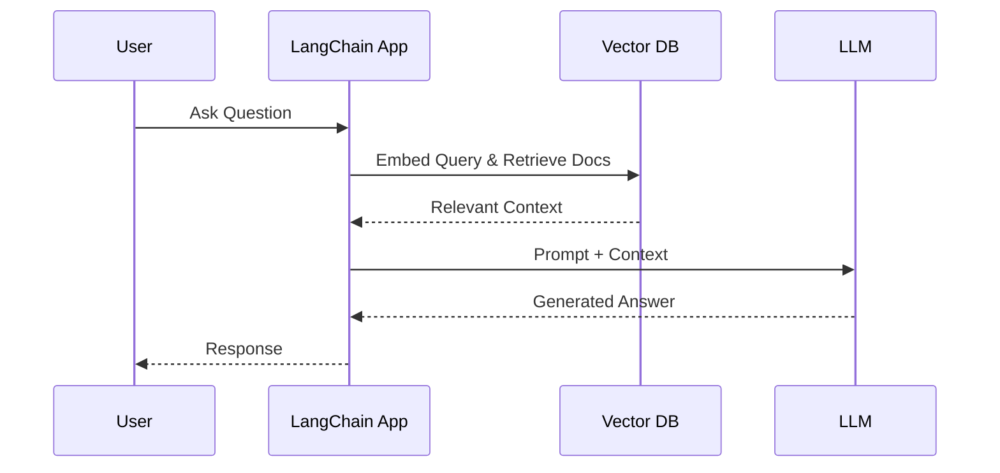

## Summary
LangChain is a framework for building applications powered by Large Language Models (LLMs) by chaining modular components like prompts, memory, and tools. It streamlines complex workflows such as retrieval-augmented generation (RAG), automated agents, and data-augmented chatbots while handling boilerplate code.

## Core Components
- **LLMs:** Abstract interface to connect to models (OpenAI, Anthropic, local).
- **Prompts:** Templates that structure inputs, variables, and few-shot examples.
- **Chains:** Sequences combining prompts and LLMs to execute multi-step logic.
- **Agents:** LLM-driven logic that dynamically selects and calls tools.
- **Memory:** Modules to retain context across turns (conversation history, vector stores).
- **Tools:** External functions/APIs the LLM can invoke (search, calculators, databases).

> [!IMPORTANT] Modern Standard: LCEL
> Use **LangChain Expression Language (LCEL)** for composing chains.
> - Native support for streaming and async.
> - Built-in debugging, tracing, and fallbacks.
> - Declarative syntax reduces boilerplate.

## Agent Loop Flow
Agents iteratively reason, select tools, observe results, and generate final answers.

## Common Patterns
- **RAG (Retrieval-Augmented Generation):**
    - Retrieve relevant documents from a vector store.
    - Inject context into the prompt.
    - LLM answers based *only* on provided context.
    - Reduces hallucinations and adds up-to-date info.
- **Chatbots:**
    - Combine `LLM` + `PromptTemplate` + `ConversationBufferMemory`.
    - Maintains state across user interactions.
- **Structured Output:**
    - Parse LLM responses into JSON or Pydantic models.
    - Essential for downstream automation.

## RAG Sequence Diagram
Request/response flow for a typical RAG query.

## Chains vs Agents

| Feature | Chains | Agents |
| :--- | :--- | :--- |
| **Flow** | Static, predefined steps | Dynamic, LLM-decided path |
| **Control** | Developer defines logic | LLM orchestrates logic |
| **Use Case** | Summarization, fixed pipelines | Search, coding, complex reasoning |
| **Risk** | Rigid, may break on edge cases | Unpredictable, higher latency |
| **Cost** | Lower token usage | Higher token usage (looping) |

> [!WARNING] Agent Gotchas
> - **Infinite Loops:** Agents can get stuck reasoning in circles.
>     - *Fix:* Set `max_iterations` and implement early exit conditions.
> - **Tool Hallucination:** LLM may invent tool arguments or names.
>     - *Fix:* Provide clear tool descriptions and validation schemas.
> - **Security:** Tools execute real actions.
>     - *Fix:* Sanitize inputs, use sandboxing, and restrict tool permissions.

> [!TIP] Debugging & Testing
> - Use **LangSmith** for tracing runs, evaluating outputs, and monitoring costs.
> - Test chains with unit tests on individual components before chaining.
> - Mock LLM responses to verify tool calling logic without API costs.

> [!NOTE] Excalidraw: Sketch the LangChain ecosystem map showing Core, Community, and Ecosystem integrations with arrows connecting to LLM providers, Vector Stores, and external APIs.

## Quick Implementation Checklist
- [ ] Define goal and required tools.
- [ ] Choose LLM (balance speed vs. quality).
- [ ] Select memory strategy (buffer vs. vector).
- [ ] Build prompt templates with clear instructions.
- [ ] Implement LCEL chain.
- [ ] Add error handling and fallbacks.
- [ ] Test with edge cases.