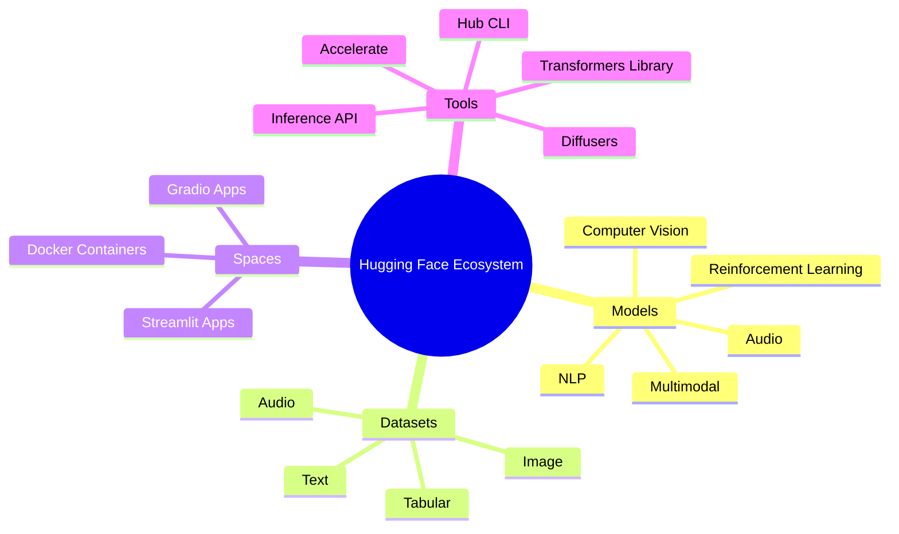
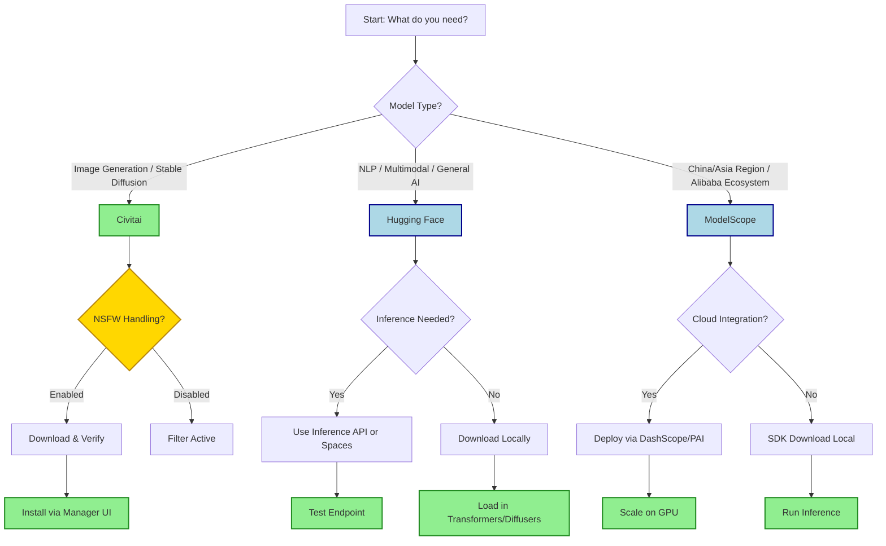

## Summary
Hugging Face, Civitai, and ModelScope are leading platforms for hosting, sharing, and downloading AI models, datasets, and tools. Hugging Face dominates open-source NLP and multimodal development, Civitai is the go-to community for image generation models like [[Diffusion Model Assistants]], and ModelScope offers a robust ecosystem with strong support for Asian languages and enterprise integration.

## Hugging Face
- **Overview:** The "GitHub of AI"; central hub for open-source ML, NLP, CV, audio, and multimodal models.
- **Core Features:**
  - Model Hub: Repos for weights, configs, and tokenizers.
  - Datasets: Version-controlled data with viewer tools.
  - Spaces: Host demos via Gradio or Streamlit.
  - Inference API: Serverless endpoints for quick testing.
- **How It Works:**
  - Create account → Generate token → Clone/push repos via Git or `huggingface_hub` SDK.
  - Models are organized by organization/user; metadata drives search and filtering.
- **Tips & Tricks:**
  - Use `huggingface-cli download` for fast, resumable downloads without full git clone.
  - Pin versions in code using `revision="main"` or commit hashes for reproducibility.
  - Check `model-index` and `card` data for license and capability warnings.
  - Enable caching directory env vars (`HF_HOME`) to manage disk space.

> [!WARNING] Supply Chain Security
> - **Verify provenance:** Malicious actors can upload rogue models that exfiltrate data or execute code.
> - Check "Who can view?" settings and trust only official or verified creators.
> - Avoid running `eval` or arbitrary code in model configs.

## Civitai
- **Overview:** Community-driven platform focused on Stable Diffusion, ComfyUI, and image generation assets.
- **Core Features:**
  - Checkpoints, [[Low Rank Adaptation]], Embeddings, ControlNets.
  - User uploads with tagging, versions, and training metadata.
  - Integrated galleries and comment sections.
- **How It Works:**
  - Users upload model files + metadata JSON.
  - Platform hosts files; clients download directly or via API.
  - Community ratings and trending algorithms surface popular assets.
- **Tips & Tricks:**
  - **Use Model Managers:** Tools like Auto1111's Model Manager or ComfyUI Manager handle dependency resolution and file placement.
  - **Check Base Model:** LoRAs are often model-specific; mismatching base models causes broken outputs.
  - **Filter Tags:** Use advanced search to filter by resolution, trigger words, and NSFW status.
  - **API Access:** Use the public API to fetch model details programmatically for custom workflows.

> [!IMPORTANT] NSFW Handling
> - Civitai contains adult content by default.
> - Configure your browser or client settings to filter NSFW tags if needed.
> - Respect content warnings and creator tags.

> [!TIP] Metadata Matters
> - Always check the "Versions" tab for training steps, base model, and hyperparameters.
> - Look for "Trigger Words" to activate LoRA effects effectively.

## ModelScope
- **Overview:** Alibaba's open-source model community; similar to Hugging Face but optimized for APAC region and enterprise use.
- **Core Features:**
  - Model Zoo: Thousands of models including Qwen series and specialized Asian language models.
  - Datasets: Rich collections with Chinese/Asian focus.
  - Creation: Tools for fine-tuning and deployment on Alibaba Cloud.
  - SDK: Unified Python library for downloading and inference.
- **How It Works:**
  - Uses `modelscope` SDK for seamless integration.
  - Models often mirror HF but include regional exclusives and optimizations.
  - Supports Docker-based deployment and GPU marketplace.
- **Tips & Tricks:**
  - Install SDK: `pip install modelscope`.
  - Use `modelscope download` for direct access; handles mirrors automatically.
  - Great for accessing large Chinese [[llm wiki]] (e.g., Qwen) before they appear elsewhere.
  - Check `DashScope` for serverless inference of hosted models.

> [!NOTE] Regional Advantages
> - Faster download speeds for users in China/Asia due to local nodes.
> - Better compliance and support for Asian language datasets.
> - Direct integration with Alibaba Cloud PAI for scaling.

## Quick Comparison

| Feature | Hugging Face | Civitai | ModelScope |
| :--- | :--- | :--- | :--- |
| **Primary Focus** | NLP, Multimodal, General AI | Image Gen, Stable Diffusion, LoRAs | General AI, Asian Languages, Enterprise |
| **Best For** | Researchers, ML Ops, Developers | Artists, SD Community, Hobbyists | APAC Devs, Alibaba Cloud Users |
| **API Quality** | High (Inference API, Hub API) | Moderate (Public API, scraping) | High (SDK, DashScope) |
| **NSFW Filter** | Strict by default | Toggleable (Off by default) | Regional Compliance |
| **Version Control** | Git-based (Full history) | File-based (Snapshots) | SDK-based (Snapshots) |
| **Community** | Massive, Academic/Industry | Art-focused, Active Forums | Growing, Enterprise/Asia-focused |

## Tips & Tricks (Cross-Platform)

- **Caching Strategy:**
  - Set environment variables to centralize caches (`HF_HOME`, `MODELScope_CACHE`).
  - Prune unused models periodically to save disk space.
- **Security First:**
  - Scan downloaded `.py` or `.json` files for malicious code before execution.
  - Use sandboxes (Docker/Spaces) when testing untrusted models.
- **Efficiency:**
  - Use `--resume-download` flags in CLIs to handle interruptions.
  - Prefer streaming downloads for huge models if memory allows.
- **Reproducibility:**
  - Always record commit hashes or version IDs, not just filenames.
  - Save `requirements.txt` or environment locks alongside model configs.

> [!DANGER] Code Injection Risks
> - Model configs can execute code during loading.
> - Never load untrusted models in production without auditing source code.
> - Use trusted libraries (Transformers, Diffusers) that sanitize inputs where possible.

> [!NOTE] Excalidraw: Sketch a workflow diagram showing a user cloning a repo, loading weights into [[Local Inference Engines]], and pushing a fine-tune back to the hub.
