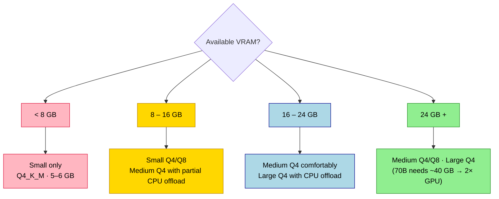

## Summary
[[Ollama]] runs large language models locally, requiring VRAM to store model weights and process text efficiently. Your available VRAM dictates which model sizes and quantization levels you can load, with insufficient VRAM causing slower performance due to system RAM swapping.

## VRAM Estimates by Model Tier

| Tier | Parameters | Q4_K_M | Q8_0 | Fits on |
|---|---|---|---|---|
| Small | 7B–8B | ~5–6 GB | ~9–10 GB | GTX 1060 6GB+, RTX 3060 12GB |
| Medium | 27B–32B | ~17–19 GB | ~34–38 GB | RTX 3090/4090 with Q4 |
| Large | 70B | ~40–42 GB | ~80+ GB | Multi-GPU or heavy CPU offload |
| MoE (Mixtral 8x7B) | 8×7B | ~26–28 GB | — | RTX 4090 (tight) |

> [!WARNING] MoE models load **all** weights despite active parameter reduction — check specific model requirements before assuming they fit in your VRAM.

## Which Model Fits My GPU?

## Quantization Impact on VRAM

> [!TIP] **Rule of thumb:** Divide parameter count by 2 for a Q4 VRAM estimate. Example: 7B params ≈ 3.5 GB + overhead.

- [[Model Quantization]] reduces precision to save memory with minimal quality loss.
- **Q4_K_M (Recommended default):**
  - ~4 bits per parameter.
  - Best balance of speed, quality, and size for most users.
- **Q8_0:**
  - ~8 bits per parameter.
  - Highest quality, doubles VRAM usage compared to Q4.
- **Q2_K / Q3_K:**
  - Lower bits per parameter.
  - Significant VRAM savings but noticeable degradation in reasoning and instruction following.

## Managing GPU Allocation
- **Environment Variables:**
  - `OLLAMA_NUM_GPU`: Forces Ollama to offload a specific number of layers to GPU.
  - Set to `0` to force CPU-only inference for troubleshooting or server use.
- **Modelfile Configuration:**
  - `PARAMETER num_gpu 9999` attempts to offload all layers to VRAM.
  - Useful for forcing GPU usage on specific custom models.
- **Partial Offloading:**
  - Ollama automatically splits models between VRAM and System RAM if VRAM is full.
  - Performance drops significantly when layers fall back to system RAM or SSD.
  - Tokens per second (t/s) correlates directly with how many layers fit in VRAM.

## Monitoring and Optimization
- **Check VRAM Usage:**
  - Use `nvidia-smi` (Linux) or `Task Manager > Performance > GPU` (Windows).
  - Third-party tools like `nvtop` provide detailed VRAM graphs and per-process usage.
- **Speed Indicators:**
  - High t/s indicates full VRAM loading.
  - Low t/s suggests swapping to RAM/SSD; consider smaller quantization or model.
- **Optimization Tips:**
  - Close background GPU apps (games, browsers, Blender) before loading models.
  - Reduce context window (`num_ctx`) to lower VRAM overhead for long conversations.
  - Keep multiple large models loaded only if total VRAM exceeds the sum of their requirements.
