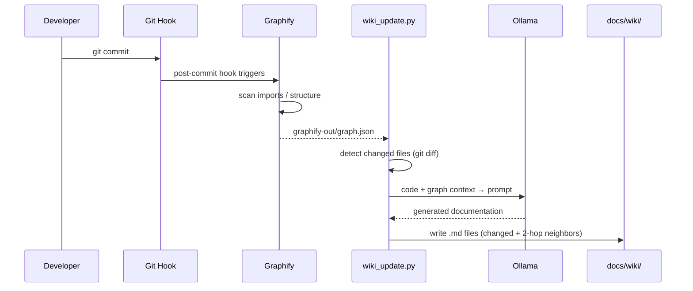

## Summary
This system automatically generates living documentation for any codebase by mapping code dependencies via [[graphify]] and translating them into readable Markdown using [[Ollama]]. Wiki pages update automatically on `git commit` or manually via MCP tools, integrating seamlessly with AI coding assistants like Cline and Claude Code.

## Workflow & Architecture



- **Trigger:** Code edit → `git commit` → post-commit hook (or manual/MCP trigger)
- **Graph Analysis:** `graphify` scans imports/structure → outputs `graphify-out/graph.json`
- **Doc Generation:** `wiki_update.py` reads graph + git diff → prompts Ollama → writes `.md` files to `docs/wiki/`
- **Scope:** Updates only changed files and adjacent graph nodes (up to 2 hops)
- **Naming:** Filenames replace `/` and `.` with `_` (e.g., `src_auth_login_ts.md`)

## Setup & Configuration
- Run `graphify .` first to build the initial knowledge graph
- Start services: `knowledge-up` (Graphify MCP `:8888`, Wiki MCP `:8081/mcp`)
- Stop services: `knowledge-down`
- Add to `.gitignore`:
  ```
  docs/wiki/
  graphify-out/
  ```
- **Model Selection:**
  - `qwen3.5:9b` (default): Fast, covers standard updates
  - `qwen3.6:27B`: Deeper explanations for complex modules
  - Override via environment: `OLLAMA_MODEL=qwen3.6:27B` (set in `.env` or inline)

## MCP Integration
Add to your AI assistant's MCP configuration:
```json
{
  "mcpServers": {
    "llm-wiki": {
      "url": "http://localhost:8081/mcp"
    }
  }
}
```
- **Cline:** Prompt naturally (e.g., *"Update the wiki for changed files"*)
- **Claude Code:** Paste config into `~/.claude/settings.json`
- **Available Tools:**
  - `update_wiki_pages`: Regenerates docs (auto-detects changes or accepts file list)
  - `query_wiki`: Full-text search across all wiki pages
  - `list_wiki_pages`: Lists generated documentation
  - `rebuild_graph`: Re-runs Graphify structure analysis

## Automation & Git Hooks
Add to `.git/hooks/post-commit`:
```bash
#!/bin/bash
podman exec knowledge-mcp python3 scripts/wiki_update.py 2>/dev/null \
  || echo "[wiki] container not running — skipping"
```
- Runs fire-and-forget on every commit
- Silently skips if the container is inactive
- Automatically scopes updates to changed files + graph neighbors

## Manual Updates & Commands
Execute inside the container (or directly on host):
- Auto-detect last commit: `python3 scripts/wiki_update.py`
- Target specific files: `python3 scripts/wiki_update.py src/auth.ts src/db.ts`
- Dry run (bypass LLM): `python3 scripts/wiki_update.py --dry-run`
- Full rebuild (slow, use after major refactors): `python3 scripts/wiki_update.py --force-all`
- Graph maintenance: `graphify .` (full) or `graphify . --update` (incremental)

## Host-Only Execution (No Container)
Run natively when Docker/Podman isn't available:
- Install dependencies: `pip install requests mcp`
- Update wiki: `python scripts/wiki_update.py [files] [--dry-run]`
- Start MCP server locally: `MCP_PORT=8081 python scripts/mcp_wiki_server.py`
- Remote Ollama endpoint: `OLLAMA_URL=http://<ip>:11434 python scripts/wiki_update.py`

## Notes & Maintenance

> [!WARNING] Wiki accuracy depends on the underlying Graphify graph. Rebuild after bulk file additions or major renames with `python3 scripts/wiki_update.py --force-all`.

- MCP tools handle scope detection automatically when prompted by AI assistants
- Keep `.gitignore` rules and environment variables consistent across dev environments
