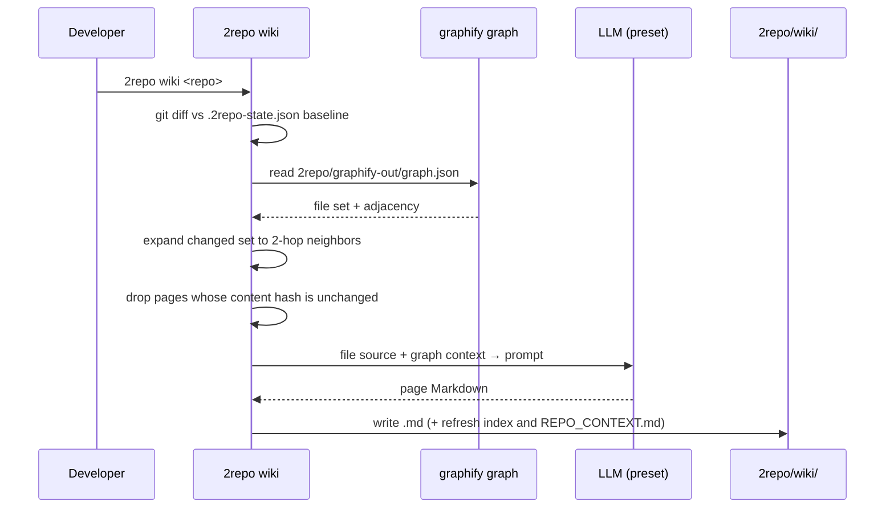

## Summary
Living documentation for any codebase: one readable Markdown page per source file plus a top-level `OVERVIEW.md`, generated by an LLM from the [[graphify]] dependency graph. Pages describe purpose, key elements, and graph relationships, so a human or an assistant can understand a file without opening it.

Implemented as the **wiki layer of [[2repo]]** (`2repo wiki <repo>`). Output lands in `<repo>/2repo/wiki/` and is mirrored into this vault at `Projects/<repo-name>/Generated/`.

## Workflow


```mermaid
sequenceDiagram
    participant Dev as Developer
    participant R as 2repo wiki
    participant GF as graphify graph
    participant AI as LLM (preset)
    participant Wiki as 2repo/wiki/

    Dev->>R: 2repo wiki <repo>
    R->>R: git diff vs .2repo-state.json baseline
    R->>GF: read 2repo/graphify-out/graph.json
    GF-->>R: file set + adjacency
    R->>R: expand changed set to 2-hop neighbors
    R->>R: drop pages whose content hash is unchanged
    R->>AI: file source + graph context → prompt
    AI-->>R: page Markdown
    R->>Wiki: write .md (+ refresh index and REPO_CONTEXT.md)
```

- **Scope:** changed files only, expanded to graph neighbors up to 2 hops
- **Cache:** `2repo/wiki/.wiki-cache.json` holds per-file content hashes — unchanged pages cost zero tokens
- **Naming:** `/` and `.` become `_` (e.g. `src/auth/login.ts` → `src_auth_login_ts.md`)
- **Baseline:** the changed set is computed against the commit recorded in `2repo/.2repo-state.json`

## Commands

```bash
2repo wiki .                        # incremental: changed files + graph neighbors
2repo wiki . src/auth.ts src/db.ts  # target specific files (+ their neighbors)
2repo wiki . --force-all            # full rebuild, ignore cache and baseline
2repo wiki . --dry-run              # list pages that would regenerate, no LLM calls
2repo wiki . --no-mirror-vault      # skip the vault mirror
```

Model selection comes from `REPO_PRESET_WIKI` in `.env`, falling back to `REPO_PRESET_GRAPH`. Override per-run with `--preset`.

## Automation

`2repo hook <repo>` installs a post-commit hook that warns when the graph has drifted past `REPO_STALE_THRESHOLD` changed files. Set `REPO_WIKI_AUTO=1` **before** installing the hook to have it also refresh the wiki incrementally on every commit.

## Above the wiki

`2repo arch` is the tier above: instead of one page per file, it clusters the codebase into components and writes narrative "how X works" pages with Mermaid diagrams (via CodeBoarding) into `2repo/arch/`. The two layers are complementary — per-file detail versus subsystem shape.

## Notes & Maintenance

> [!WARNING] Wiki accuracy depends on the underlying graph. After bulk file additions or a large rename, rebuild with `2repo wiki . --force-all` — the content-hash cache cannot detect that the *graph* moved, only that a file's text did.

- Pages are generated: do not hand-edit them, edits are overwritten on the next run
- Both the pages and the cache are committed — regenerating costs real tokens, and the cache is what keeps re-runs cheap

## Related
- [[2repo]] — the full pipeline; the wiki is one of its layers
- [[graphify]] — produces the dependency graph this layer reads
- [[Ollama]] — local model backend
