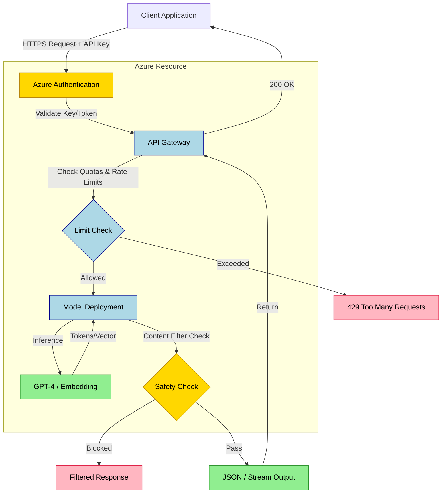
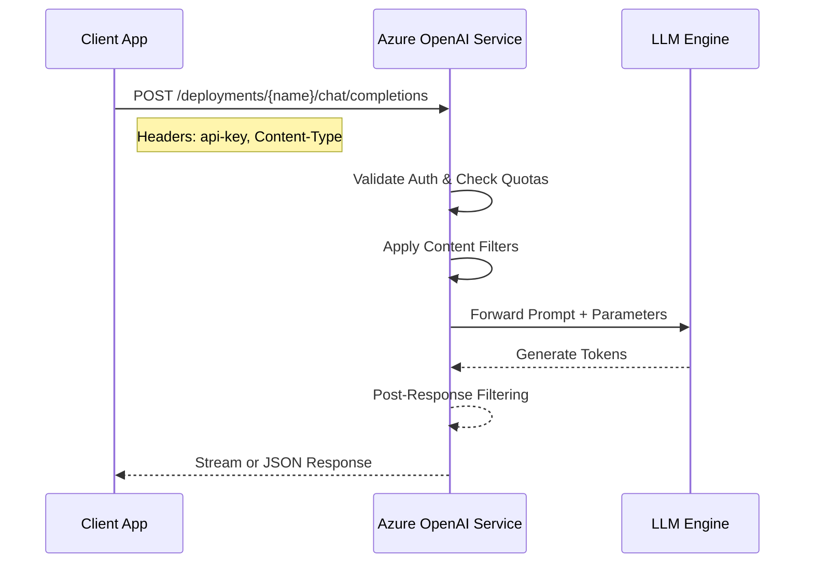
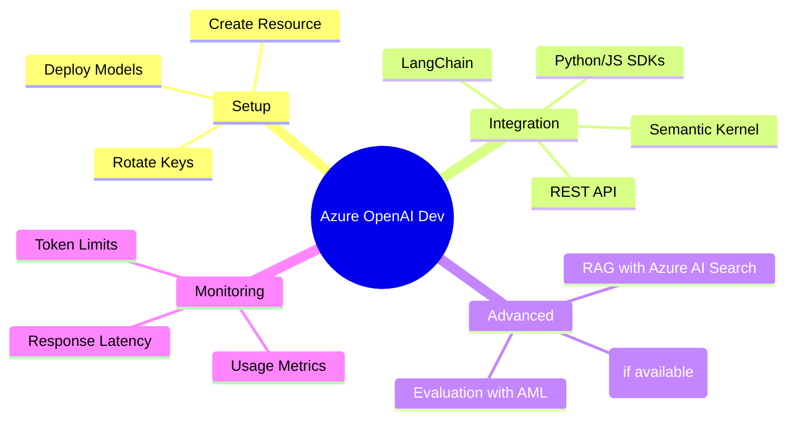

## Summary
Azure OpenAI is Microsoft's enterprise-ready service for accessing OpenAI models like GPT-4, Embeddings, and DALL-E within Azure cloud infrastructure. It provides strict data isolation, regional compliance, and granular control over quotas, deployments, and networking via the Azure portal.

## Core Concepts
- **Resource:** The Azure container housing all OpenAI services; defines region, networking, and authentication settings.
- **Model:** The base AI capability (e.g., `gpt-4`, `text-embedding-ada-002`).
- **Deployment:** An instantiated model with specific configuration, versioning, scaling, and capacity allocation.
- **Endpoints & Keys:** REST API URLs and authentication keys required for application integration.
- **Quotas:** Hard limits on capacity (TPM/Token Per Minute) that must be requested and managed manually.

## Architecture Overview

## API Request Flow

## Models & Pricing Comparison

| Model Category | Pricing Unit | Ideal Use Case | Capacity Metric |
| :--- | :--- | :--- | :--- |
| **GPT-4 / 4o** | Tokens (Input/Output) | Complex reasoning, code, structured data | Tokens per minute |
| **GPT-3.5 Turbo** | Tokens (Input/Output) | High-volume, cost-sensitive chat | Tokens per minute |
| **Embeddings** | Tokens (Input) | RAG, semantic search, clustering | Tokens per minute |
| **DALL-E 3** | Image Requests | Image generation, creative assets | Requests per minute |
| **Fine-tuning** | Tokens + Compute Hours | Domain-specific adaptation | Custom training jobs |

> [!TIP] Cost Optimization
> - Use **GPT-3.5 Turbo** for tasks where GPT-4 is overkill.
> - Enable **streaming** to improve perceived latency and reduce timeout errors.
> - Monitor **Token Usage** in Azure Metrics to prevent bill shock.

## Security & Compliance

- **Data Privacy:** Customer data is *never* used to train base OpenAI models by default.
- **Data Residency:** Data remains within the assigned Azure region (unless cross-region is explicitly enabled).
- **Networking:** Supports **Private Endpoints** to restrict traffic to your Virtual Network.
- **Authentication:** Supports API Keys or Managed Identity for server-to-server auth.
- **Content Safety:** Built-in filters detect harmful content; review `content_filter_results` in responses.

> [!WARNING] Content Filters
> Filters may block valid prompts based on sensitivity settings.
> Adjust filter thresholds in the Azure portal if blocking legitimate traffic, but balance with safety requirements.

> [!DANGER] Rate Limits
> Exceeding TPM limits results in `429 Too Many Requests`.
> Limits do not auto-scale; you must request quota increases via Azure support.
> Implement **exponential backoff** in your retry logic.

## Development Patterns

> [!NOTE] Excalidraw: Sketch a RAG loop showing User Query -> Embedding API -> Vector Store Lookup -> Context Assembly -> LLM Prompt -> Final Answer.

## Gotchas & Best Practices

- **Versioning:** Deployments lock to a specific model version; updates require redeployment or version change.
- **Keys:** Rotate keys regularly; avoid hardcoding in client-side code.
- **Quotas:** Request quotas *before* peak usage; approval can take time.
- **Prompt Injection:** Always sanitize inputs and use system prompts to constrain model behavior.
- **Streaming:** Use streaming for long outputs to handle network interruptions gracefully.