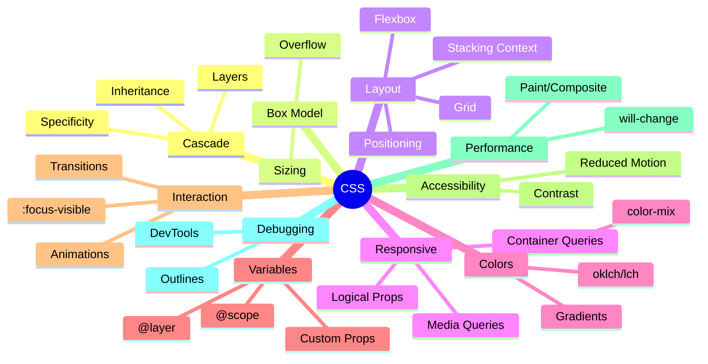

## Summary
CSS styles the web: it controls layout, look, and interaction. Think cascade + box model + modern layout (Flexbox/Grid) + responsive patterns, layered with variables and accessibility-first defaults.

## Mental Model (Cascade + Boxes)
- Cascade decides “which rule wins”
  - Order: importance → origin → cascade layer → specificity → source order (later wins)
  - Specificity: inline > id > class/attr/pseudo-class > element/pseudo-element
- Inheritance: typography/color often inherit; layout rarely does
- Box model: content → padding → border → margin; use box-sizing: border-box
- Flow: block vs inline; establish new formatting contexts (e.g., flow-root) to contain floats/clears

> [!IMPORTANT] key takeaways
> - Reduce specificity; let order and layers do the work
> - Build layouts with Grid/Flex, not margins/hacks
> - Use custom properties and logical properties for theming and internationalization

```mermaid
flowchart LR
  A[All matching declarations] --> B[Importance]
  B --> C[Origin (UA/User/Author)]
  C --> D[@layer order]
  D --> E[Specificity]
  E --> F[Source order (later wins)]
  classDef blue fill:#ADD8E6,stroke:#00008B,color:#000;
  class A,B,C,D,E,F blue;
```

## Core Building Blocks
- Specificity cheat
  - Inline: 1000
  - ID: 100
  - Class/attr/:hover/:focus: 10
  - Element/::before: 1
  - :where() adds 0 (great for scoping without weight)
- Inheritance controls: inherit | initial | unset | revert
- Display/contexts
  - block, inline, inline-block, flow-root
  - Flex → one dimensional; Grid → two dimensional
  - Containing blocks affect percentage sizing/positioned elements
- Stacking context (z-index)
  - Created by position + z-index, opacity<1, transform, filter, mix-blend-mode, isolation:isolate, etc.
  - z-index only compares within the same stacking context

## Selectors & Pseudo
- Combinators: descendant ( ), child (>), adjacent (+), sibling (~)
- Attribute: [type="email"], [data-state~="open"]
- Pseudo-classes: :hover, :focus-visible, :disabled, :nth-child(), :is(), :where(), :has()
  - :is() takes specificity of the most specific argument
  - :where() has zero specificity
  - :has() enables parent/relational queries (supported in modern browsers)
- Pseudo-elements: ::before, ::after, ::marker, ::selection, ::file-selector-button

## Units & Sizing
- Relative: em (to current font-size), rem (root), ch (0 width), ex, lh/rlh (line-height)
- Viewport: vw, vh, vmin, vmax, svh/lvh/dvh (stable/large/dynamic viewport on mobile)
- Container units: cqi/cqb/cqmin/cqmax (with container queries)
- Functions: min(), max(), clamp(), calc()
  - Fluid type: font-size: clamp(1rem, 1rem + 2vw, 2rem);
- aspect-ratio: 16 / 9 keeps boxes proportional

## Layout: Flexbox vs Grid
- Flexbox
  - One-axis alignment; content-driven; great for navs, toolbars, chips
  - Gap, justify-content, align-items; beware flex-basis vs width
- Grid
  - Two-axis, explicit tracks; layout-driven; great for pages, cards, dashboards
  - repeat(), minmax(), auto-fit/auto-fill; subgrid for inherited tracks

| Use Case | Flex | Grid |
|---|---|---|
| Single row/column | ✅ | ❌ |
| Complex 2D layout | ❌ | ✅ |
| Content size drives layout | ✅ | ⚠️ |
| Explicit track control | ⚠️ | ✅ |

## Responsive & Modern CSS
- Media queries
  - width/height, pointer, hover, prefers-reduced-motion, prefers-color-scheme
- Container queries (component-first responsiveness)
  - Opt-in container: container-type: inline-size; container-name: card;
  - Query by container size instead of viewport
- Logical properties (RTL/vertical writing-friendly)
  - margin-inline, padding-block, inset-inline, border-start-end-radius, text-align: start
- CSS Nesting (supported modern browsers)
  - Prefer &: for clarity and to avoid ambiguity

```css
/* Container queries */
.card {
  container-type: inline-size;
  container-name: card;
}
@container card (min-width: 35rem) {
  .card { grid-template-columns: 1fr 2fr; }
}

/* Logical props */
.section { padding-block: 1rem; margin-inline: auto; }

/* Nesting */
.nav {
  display: flex;
  & > a { padding: .5rem 1rem; }
  &:has(.active) { background: var(--accent-weak); }
}
```

## Colors & Effects
- Modern color spaces: lch(), oklch() for perceptual uniformity (with fallbacks)
- color-mix(): generate tints/shades programmatically
- Gradients: linear-gradient(), radial-gradient(), conic-gradient()
- Shadows: box-shadow (layout), filter: drop-shadow() (shape-aware for transparent PNG/SVG)
- Prefer outline for focus; avoid removing focus unless replaced with visible equivalent

```css
/* Progressive color */
.button {
  background: #0b5; /* fallback */
  background: oklch(65% 0.15 150);
}
.badge {
  background: color-mix(in oklch, oklch(70% 0.12 40) 80%, black);
}
```

## State, Transitions, Animations
- Animate transform and opacity for better performance; avoid layout-affecting properties (top/left/width)
- Use transition: property duration easing; prefer custom cubic-bezier for feel
- prefers-reduced-motion: reduce or remove motion
- :focus-visible for accessible focus; :has() for open/expanded states

```css
@media (prefers-reduced-motion: reduce) {
  * { animation: none !important; transition: none !important; }
}
.card {
  transform: translateY(0);
  transition: transform .2s ease, box-shadow .2s;
}
.card:hover { transform: translateY(-2px); }
```

## Variables, Layers, Scope
- Custom properties are dynamic (inherit, can be themed at runtime)
  - Define in :root; override per component or via [data-theme]
- Cascade layers (@layer) prevent specificity wars; order layers intentionally
  - Later layers override earlier ones

```css
/* Theming */
:root {
  --bg: #fff; --fg: #111; --accent: oklch(65% 0.15 230);
}
[data-theme="dark"] {
  --bg: #000; --fg: #eee; --accent: oklch(70% 0.12 260);
}

/* Layers */
@layer reset, base, components, utilities;

@layer reset { *,*::before,*::after{ box-sizing:border-box; } }
@layer base { body { background: var(--bg); color: var(--fg); } }
@layer components { .btn { background: var(--accent); } }
@layer utilities { .mt-4 { margin-top: 1rem; } }

/* Scope (check support) */
@scope (.dialog) {
  :scope { display: grid; gap: 1rem; }
  h2 { font-size: 1.25rem; }
}
```

## Accessibility Essentials
- Always provide visible focus (use :focus-visible)
- Respect user preferences: reduced motion, color scheme
- Color contrast: aim WCAG AA at minimum
- Large tap targets, adequate spacing; avoid text in images

## Debugging Playbook
- Inspect in DevTools → Computed styles → Specificity/Rules panel
- Toggle :hover/:focus/:active; use element state panel
- Box model: check overflow/scroll, padding/border
- Temporarily outline everything
  - * { outline: 1px solid #0001 } .debug { outline: 2px solid hotpink }
- Check stacking contexts (Layers panel if available)
- Use CSS.supports() to gate new features

## Performance Tips
- Minimize layout thrash: avoid animating layout properties; batch DOM reads/writes
- will-change: transform, opacity (sparingly; it consumes memory)
- Font loading: font-display: swap; limit variants; preconnect to font CDNs
- Critical CSS inline above-the-fold; lazy-load the rest
- Reduce large shadows/filters on many elements (paint cost)

## Handy Patterns
- Centering
  - Grid: place-items: center; Flex: align-items:center; justify-content:center
- Intrinsic sizing
  - width: min(100%, 75ch); img { max-inline-size: 100%; block-size: auto; }
- Truncation
  - single line: overflow: hidden; text-overflow: ellipsis; white-space: nowrap;
  - multiline: display: -webkit-box; -webkit-line-clamp: 3; -webkit-box-orient: vertical;

## Modern Feature Cheatsheet
- :has() → parent/state queries: .tab:has(> input:checked) { … }
- Container queries → component-driven responsiveness
- CSS Nesting → scoped, readable styles
- @layer → predictable cascade
- Logical properties → instant RTL support
- New viewport units (svh/lvh/dvh) → stable mobile sizing



> [!TIP] best practices
> - Keep selectors simple and shallow; prefer classes over IDs
> - Use layers and utilities to avoid high specificity
> - Build responsive components with container queries + clamp()