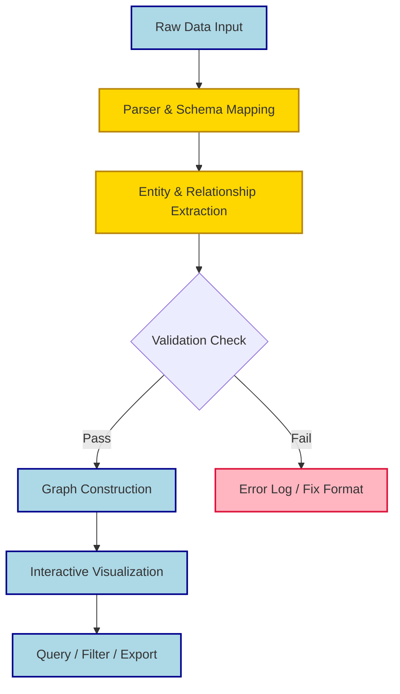

## Summary
Graphifyy transforms raw data and text into interactive knowledge graphs. It maps connections between entities, visualizes relationships, and supports quick querying without coding. Ideal for researchers, analysts, and knowledge workers who need to spot patterns fast.

## Core Features
- Drag-and-drop import (CSV, JSON, Markdown, REST API)
- Automatic entity extraction & relationship inference
- Customizable layouts (force-directed, hierarchical, radial)
- Interactive filtering, highlight paths, and subgraph isolation
- Export to static images, SVG, or graph DB formats (Neo4j, ArangoDB)

## Data Pipeline

> [!TIP] Best Practices
- Start with a small pilot dataset to test schema mapping
- Standardize node naming conventions to prevent duplicate clusters
- Assign edge weights for relationship strength instead of binary links
- Save versioned snapshots; complex graph states are hard to recreate manually

> [!WARNING] Gotchas
- Overloading nodes with raw text causes browser rendering lag
- Missing relationship definitions create false-positive connections
- Deep circular references can break auto-layout algorithms
- Memory limits apply when exporting 10k+ nodes as SVG

## When to Use vs Avoid
| Scenario | Graphifyy Fit | Better Alternative |
|----------|---------------|-------------------|
| Mapping unstructured text relationships | ✅ High | NLP pipelines + custom viz |
| Real-time dashboard metrics | ❌ Low | BI tools (Tableau, Metabase) |
| Knowledge base linking | ✅ High | Obsidian/CMS with native graph |
| Large-scale ETL processing | ❌ Low | dbt, Apache Spark |

> [!NOTE] Excalidraw: Sketch node density zones to visualize layout bottlenecks before scaling datasets