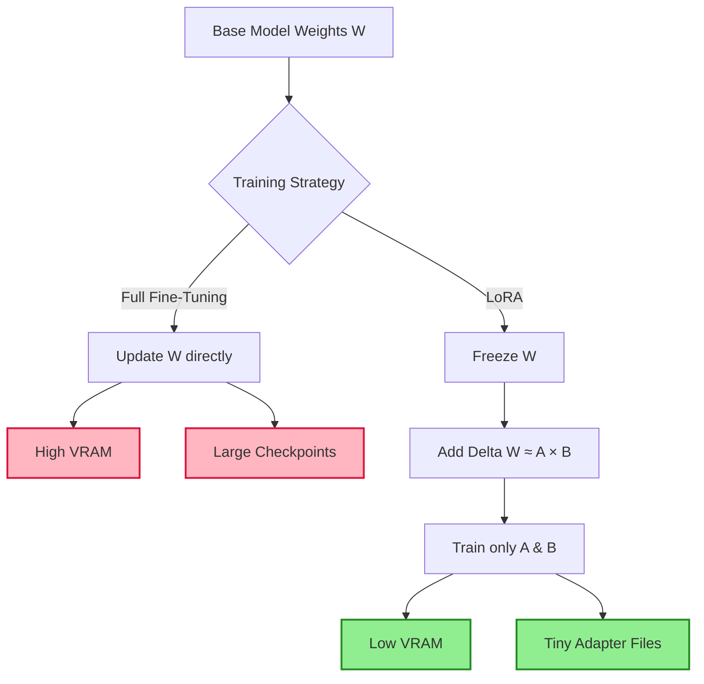
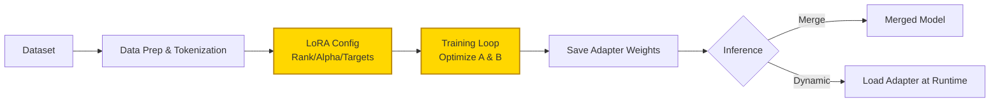

## Summary
LoRA trains AI models by adding small, efficient update layers instead of modifying the entire model. This approach slashes memory usage and file size, allowing you to customize powerful models on standard hardware without losing quality.

## What is LoRA?
- **Low-Rank Adaptation**: Technique to fine-tune large models by freezing base weights and training small adapter matrices.
- **Core Math**: Updates weights via $\Delta W \approx A \times B$, where $A$ and $B$ are low-rank matrices.
- **Modular**: Adapters are independent files that can be swapped or merged onto any compatible base model.
- **Origin**: Proposed by Hu et al. (Microsoft) for efficient adaptation of Transformers.

> [!NOTE] Concept: Imagine the model is a heavy encyclopedia. Full fine-tuning rewrites every page. LoRA adds sticky notes with corrections. The result is the same, but the sticky notes are tiny and easy to swap.

## Why do LoRA?

| Feature | Full Fine-Tuning | LoRA |
| :--- | :---: | :---: |
| **VRAM Required** | 🔴 High (Often 80GB+) | 🟢 Low (16GB-24GB often enough) |
| **Checkpoint Size** | 🔴 GBs to TBs | 🟢 MBs |
| **Training Speed** | 🟡 Slow | 🟢 Faster (Fewer parameters) |
| **Catastrophic Forgetting** | 🔴 High risk | 🟢 Lower risk (Base frozen) |
| **Hardware Access** | Cloud/Datacenter | Consumer GPU feasible |

- **Storage Efficiency**: Store multiple styles/personas in megabytes rather than duplicating gigabyte models.
- **Portability**: Move adapters between different base models of the same architecture.
- **Community Standard**: Dominant format for Hugging Face and Civai adapters.

## How to do LoRA?

### Key Parameters
- **Rank (`r`)**: Dimension of low-rank matrix. Higher = more capacity, more VRAM.
- **Alpha (`lora_alpha`)**: Scaling factor for adapter impact. Usually `alpha >= r`.
- **Dropout**: Regularization to prevent overfitting.
- **Target Modules**: Which layers get adapters (e.g., `q_proj`, `v_proj`, `gate_proj`).

> [!TIP] Best Practices
> - Set `alpha = 2 * r` as a starting point.
> - Use Rank 4-8 for simple style transfers; Rank 16-64 for complex instruction tuning.
> - Target `q_proj` and `v_proj` for minimal performance hit; add `gate_proj`/`up_proj` for deeper adaptation.

> [!WARNING] Gotchas
> - **Merging Artifacts**: Merging LoRA into base can sometimes cause slight degradation vs. dynamic loading.
> - **Wrong Targets**: Applying LoRA to non-linear layers or output heads can break generation.
> - **Overtraining**: LoRA can overfit quickly; monitor validation loss and use early stopping.

> [!NOTE] Excalidraw: Sketch of weight matrix decomposition showing large frozen matrix W and small trainable matrices A and B stacked to form delta weights.

## Merging & Inference
- **Dynamic Loading**: Load base model + adapter at runtime.
    - ✅ Flexible swapping, small disk footprint.
    - ❌ Requires adapter file present during inference.
- **Merging**: Adds $A \times B$ to $W$ to create a single checkpoint.
    - ✅ Single file, standard inference pipeline.
    - ❌ Larger file, harder to revert changes.