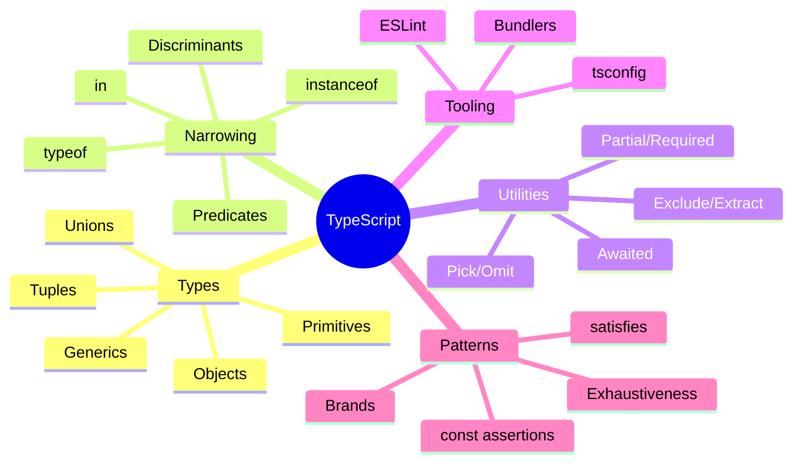

## Summary
TypeScript adds a static type system on top of JavaScript so you catch problems before runtime and get better tooling. Think “annotations + compiler + language services” that guide you toward safer code without changing how JS runs.

## Mental model
- TS types are erased at compile time; runtime is still plain JS
- The compiler does two things: type-checks and emits JS (if configured)
- Structural typing: compatibility is based on shape, not names


## Core types (quick map)
- Primitives: string, number, boolean, bigint, symbol, null, undefined
- Top types: any (unsafe), unknown (safe, must narrow), never (unreachable)
- Objects: { a: number }, index signatures {[k: string]: T}, maps/sets have their own generics
- Arrays/Tuples: T[], Array<T>, [A, B], readonly [A, B]
- Unions/Intersections: A | B, A & B
- Literals: "on", 42, true; combine as "a" | "b"
- Enums: prefer union literals or const objects + keyof typeof; be careful with runtime enums

## Type narrowing (make unions usable)
- typeof: if (typeof x === "string") { /* x: string */ }
- equality checks: x === null, x === "on"
- in: if ("kind" in obj) { /* guard by property existence */ }
- instanceof: if (e instanceof Error) { ... }
- Discriminated unions: use a tag field like kind: "A" | "B"
- Type predicates: function isUser(x: unknown): x is User { ... }
- Assertion functions: function assertUser(x: unknown): asserts x is User { ... }

```ts
type Result =
  | { kind: "ok"; value: string }
  | { kind: "err"; error: Error };

function handle(r: Result) {
  switch (r.kind) {
    case "ok":
      return r.value;
    case "err":
      throw r.error;
    default: {
      const _exhaustive: never = r; // compile-time check
      return _exhaustive;
    }
  }
}
```

## Functions
- Annotate params and return: (x: number): string
- Optional/rest/defaults: (a?: T), (...args: T[])
- Overloads: multiple signatures + one implementation
- this: specify via this: Foo in first param slot (JS method style)
- void: ignores return value; never: does not return (throw, infinite loop)
- any vs unknown: prefer unknown; narrow before use

```ts
function parseJson<T>(s: string): T {
  return JSON.parse(s) as unknown as T; // runtime unsafe; consider zod
}
type Fn = (...args: unknown[]) => unknown;
```

## Generics (power tools)
- Basics: function id<T>(x: T): T { return x }
- Constraints: <T extends { id: string }>
- Defaults: <T = string>
- keyof, indexed access: type V = T[K]; K extends keyof T
- Conditional types: T extends U ? X : Y
- Infer: Extract types from positions inside conditionals

```ts
type UnwrapPromise<T> = T extends Promise<infer U> ? U : T;
type Prop<T, K extends keyof T> = T[K];
function pick<T, K extends keyof T>(t: T, keys: K[]): Pick<T, K> { /* ... */ return {} as any; }
```

## Utility types (built-ins)
- Partial<T>, Required<T>, Readonly<T>
- Pick<T, K>, Omit<T, K>, Record<K, V>
- Exclude<T, U>, Extract<T, U>, NonNullable<T>
- Parameters<F>, ReturnType<F>, InstanceType<C>, ConstructorParameters<C>
- Awaited<T>, ThisType<T> (contextual)

## Type vs Interface
- Both declare shapes; both structurally typed
- interface merges (declaration merging), type aliases don’t
- type supports unions, intersections, conditional types, mapped/templatized types
- Rule of thumb: interface for public object shapes; type for composition and advanced types

```ts
interface User { id: string }
type WithTs = User & { createdAt: Date };
type Mode = "light" | "dark"; // not possible with interface
```

## Classes
- public/private/protected, readonly
- Parameter properties: constructor(private id: string) {}
- implements Interface; abstract classes with abstract methods
- Prefer composition over heavy class hierarchies in TS

## Modules and imports
- Use ES modules (import/export). CommonJS interop needs esModuleInterop or syntheticDefaultImports
- Type-only imports/exports: import type { Foo } from "./types"
- preserveValueImports: avoid eliding needed runtime imports
- isolatedModules: true for transpilers like swc/esbuild

```ts
import type { User } from "./types";
export type { User };
```

## tsconfig essentials
- "strict": true enables core safety (do this!)
- Helpful flags:
  - "noImplicitAny": true, "strictNullChecks": true
  - "exactOptionalPropertyTypes": true
  - "noUncheckedIndexedAccess": true
  - "useUnknownInCatchVariables": true
  - "noPropertyAccessFromIndexSignature": true
  - "forceConsistentCasingInFileNames": true
- Module/target: match your runtime (ES2020+, NodeNext, etc.)
- Paths/aliases: "baseUrl", "paths" for cleaner imports
- "skipLibCheck": true speeds builds; keep false in libs

## Patterns you’ll reuse
- Discriminated unions instead of enums with logic
- Exhaustiveness via never in switch (see above)
- Branded/nominal types to avoid mixing primitives

```ts
type Brand<B, T> = T & { readonly __brand: B };
type UserId = Brand<"UserId", string>;
declare const uid: UserId;
function loadUser(id: UserId) { /* ... */ }
// loadUser("abc"); // error, need branded value
```

- const assertions: as const to keep literal types; readonly deep

```ts
const cfg = {
  mode: "dark",
  ports: [3000, 3001],
} as const;
// cfg.mode: "dark"; cfg.ports: readonly [3000, 3001]
```

- satisfies operator: validate shape without narrowing value

```ts
const routes = {
  home: "/",
  user: "/users/:id",
} as const satisfies Record<string, `/${string}`>;
```

- Runtime validation + type inference: zod/valibot/yup schema.infer

## Interop and migration
- JSDoc types in JS files: // @ts-check + JSDoc annotations
- Declaration files: .d.ts for library types; use declare global for augmentation
- Gradual typing: start with allowJs and checkJs, then migrate file-by-file

## Performance and ergonomics
- Prefer simpler types over deeply nested conditional/mapped types
- Export helper types from a single place; avoid circular type explosions
- Use explicit annotations at module boundaries (public APIs)
- Turn on incremental and composite for large monorepos

## Testing and tooling
- ESLint with @typescript-eslint for lint + type-aware rules
- ts-jest / vitest + tsconfig isolatedModules for fast tests
- Build: tsc --build, tsup, esbuild, swc for bundling
- CI: run tsc --noEmit to type-check; keep emits in build step

## Gotchas
- any leaks: once any enters, type safety collapses downstream
- JSON.parse returns any; prefer unknown + validation
- Date is not string; parse and handle timezones explicitly
- Enums have runtime footprint; union literals are zero-cost
- Structural typing can allow “accidental compatibility”; prefer precise types
- Optional vs undefined: with exactOptionalPropertyTypes, foo?: T means absent, not T | undefined

> [!TIP] Best practices
> - Enable strict mode and friends
> - Model data with discriminated unions
> - Type-only imports and exports to keep bundlers happy
> - Validate inputs at runtime; derive types from schemas

> [!WARNING] Gotchas
> - Avoid broad any and unknown-to-any casts
> - Don’t overuse type assertions; prefer narrowing
> - Watch out for const enum with transpilers that don’t preserve inlining

