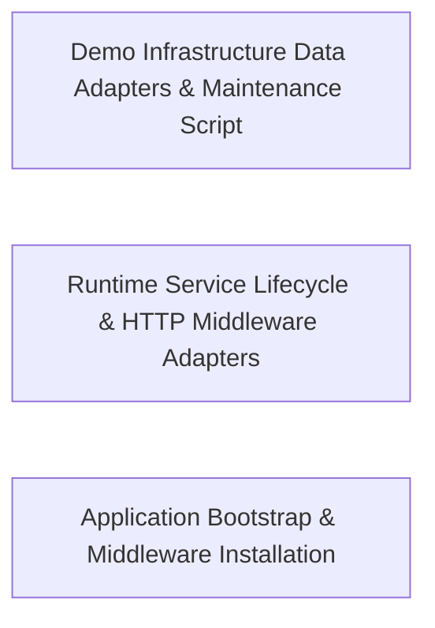

---
tags:
  - 2repo
  - 2repo/arch
  - project/boilerplate-node-backend
type: architecture
component: Application_Bootstrap_Demo_Runtime
---

## Details

The runtime boot path: shapes the process environment for the demo profile (forced defaults, external-service suppression), starts an in-memory MongoDB, waits for connection readiness, then installs the full application middleware chain (security, error handling, request context, telemetry, static assets, workers) and triggers the demo seed. Also owns the cache-clear maintenance script. This is the single entry point that makes the API self-contained and disposable for local dev, e2e, and paired-frontend integration.

### Demo Infrastructure Data Adapters & Maintenance Script
Provides the concrete data-plane implementations consumed by the demo runtime: cache read/write/clear operations, PDF rendering (HTML→PDF via puppeteer-core), image signature detection, queue connection management, and file storage. Also owns the cache-clear maintenance script that flushes all cached entries, and the demo seed entry point that populates the in-memory MongoDB with representative e-commerce data. This is the 'adapter' half of the Ports & Adapters pattern, exposing stable interfaces while hiding concrete technology.

**Related Classes/Methods**:

- `src.infrastructure.adapters.pdf.renderHtmlToPdf`:45-71
- `src.infrastructure.adapters.queue.queueConnection`:90-151

**Source Files:**

- `db/demo/index.ts`
  - `db.demo.index.runScript() callback` (L100-L100) - Function
- `src/infrastructure/adapters/cache.ts`
  - `src.infrastructure.adapters.cache.cacheConnection` (L60-L112) - Class
  - `src.infrastructure.adapters.cache.cacheConnection.isReady` (L66-L66) - Method
  - `src.infrastructure.adapters.cache.cacheConnection.connect` (L67-L94) - Method
  - `src.infrastructure.adapters.cache.cacheConnection.connect.then() callback` (L93-L93) - Function
  - `src.infrastructure.adapters.cache.cacheConnection.close` (L95-L111) - Method
  - `src.infrastructure.adapters.cache.cacheConnection.close.then() callback` (L108-L108) - Function
  - `src.infrastructure.adapters.cache.getCacheValue` (L152-L169) - Class
  - `src.infrastructure.adapters.cache.getCacheValue.then() callback` (L155-L161) - Function
  - `src.infrastructure.adapters.cache.getCacheValue.then() callback.then() callback` (L160-L160) - Function
  - `src.infrastructure.adapters.cache.getCacheValue.catch() callback` (L162-L169) - Function
  - `src.infrastructure.adapters.cache.setCacheValue` (L180-L230) - Class
  - `src.infrastructure.adapters.cache.setCacheValue.then() callback` (L196-L222) - Function
  - `src.infrastructure.adapters.cache.setCacheValue.then() callback.then() callback.cacheTags.map() callback` (L216-L216) - Function
  - `src.infrastructure.adapters.cache.setCacheValue.then() callback.then() callback` (L220-L220) - Function
  - `src.infrastructure.adapters.cache.setCacheValue.catch() callback` (L223-L229) - Function
- `src/infrastructure/adapters/image-signatures.ts`
  - `src.infrastructure.adapters.image-signatures.ImageSignature` (L23-L27) - Interface
  - `src.infrastructure.adapters.image-signatures.HEADER_LENGTH` (L58-L60) - Class
  - `src.infrastructure.adapters.image-signatures.HEADER_LENGTH.IMAGE_SIGNATURES.map() callback` (L59-L59) - Function
- `src/infrastructure/adapters/pdf.ts`
  - `src.infrastructure.adapters.pdf.renderHtmlToPdf` (L45-L71) - Class
  - `src.infrastructure.adapters.pdf.renderHtmlToPdf.then() callback` (L50-L70) - Function
  - `src.infrastructure.adapters.pdf.renderHtmlToPdf.then() callback.then() callback` (L54-L66) - Function
  - `src.infrastructure.adapters.pdf.renderHtmlToPdf.then() callback.then() callback.then() callback` (L66-L66) - Function
  - `src.infrastructure.adapters.pdf.renderHtmlToPdf.then() callback.finally() callback` (L70-L70) - Function
- `src/infrastructure/adapters/queue.ts`
  - `src.infrastructure.adapters.queue.queueConnection` (L90-L151) - Class
  - `src.infrastructure.adapters.queue.queueConnection.isReady` (L99-L99) - Method
  - `src.infrastructure.adapters.queue.queueConnection.connect` (L100-L133) - Method
  - `src.infrastructure.adapters.queue.queueConnection.connect.then() callback` (L122-L131) - Function
  - `src.infrastructure.adapters.queue.queueConnection.connect.then() callback.superviseHandle() callback` (L127-L129) - Function
  - `src.infrastructure.adapters.queue.queueConnection.close` (L134-L150) - Method
  - `src.infrastructure.adapters.queue.queueConnection.close.finally() callback` (L146-L148) - Function
- `src/infrastructure/adapters/storage.ts`
  - `src.infrastructure.adapters.storage.resolveUploadDestination` (L70-L90) - Class
  - `src.infrastructure.adapters.storage.resolveUploadDestination.then() callback` (L88-L88) - Function
  - `src.infrastructure.adapters.storage.resolveUploadDestination.catch() callback` (L89-L89) - Function
  - `src.infrastructure.adapters.storage.storeUploadedImages.then() callback.failed` (L350-L350) - Class
  - `src.infrastructure.adapters.storage.storeUploadedImages.then() callback.failed.results.find() callback` (L350-L350) - Function
- `src/infrastructure/http/middlewares/cache.ts`
  - `src.infrastructure.http.middlewares.cache.setCache` (L248-L373) - Class
  - `src.infrastructure.http.middlewares.cache.setCache.<function>` (L253-L372) - Function
  - `src.infrastructure.http.middlewares.cache.setCache.<function>.then() callback` (L342-L371) - Function
  - `src.infrastructure.http.middlewares.cache.setCache.<function>.then() callback.<function>` (L355-L367) - Function
- `src/infrastructure/http/middlewares/request-logger.ts`
  - `src.infrastructure.http.middlewares.request-logger.requestLogger` (L10-L35) - Class
  - `src.infrastructure.http.middlewares.request-logger.requestLogger.response.once('finish') callback` (L14-L32) - Function
- `src/infrastructure/i18n/context.ts`
  - `src.infrastructure.i18n.context.LocaleContext` (L26-L29) - Interface
- `src/infrastructure/persistence/search.ts`
  - `src.infrastructure.persistence.search.PaginationResult` (L17-L21) - Interface
  - `src.infrastructure.persistence.search.PaginatedMeta` (L23-L28) - Interface
- `src/infrastructure/runtime/database.ts`
  - `src.infrastructure.runtime.database.start.attemptConnect` (L70-L88) - Class
  - `src.infrastructure.runtime.database.attemptConnect.then() callback` (L75-L75) - Function
  - `src.infrastructure.runtime.database.start.attemptConnect.then() callback` (L76-L87) - Function
  - `src.infrastructure.runtime.database.start.attemptConnect.then() callback.then() callback` (L86-L86) - Function
  - `src.infrastructure.runtime.database.stopDatabase` (L100-L110) - Class
  - `src.infrastructure.runtime.database.stopDatabase.then() callback` (L103-L109) - Function
- `src/infrastructure/runtime/managed-connection.ts`
  - `src.infrastructure.runtime.managed-connection.ManagedConnectionOptions` (L26-L70) - Interface
  - `src.infrastructure.runtime.managed-connection.ManagedConnection` (L73-L112) - Interface
  - `src.infrastructure.runtime.managed-connection.manageConnection` (L120-L221) - Class
  - `src.infrastructure.runtime.managed-connection.manageConnection.get.attempt` (L157-L174) - Class
  - `src.infrastructure.runtime.managed-connection.manageConnection.get.attempt.then() callback` (L158-L163) - Function
  - `src.infrastructure.runtime.managed-connection.manageConnection.get.attempt.catch() callback` (L164-L170) - Function
  - `src.infrastructure.runtime.managed-connection.manageConnection.get.attempt.finally() callback` (L171-L174) - Function
  - `src.infrastructure.runtime.managed-connection.manageConnection.state` (L184-L192) - Method
  - `src.infrastructure.runtime.managed-connection.manageConnection.forget` (L194-L196) - Method
  - `src.infrastructure.runtime.managed-connection.manageConnection.stop` (L200-L219) - Method
  - `src.infrastructure.runtime.managed-connection.manageConnection.stop.catch() callback` (L212-L212) - Function
  - `src.infrastructure.runtime.managed-connection.manageConnection.stop.finally() callback` (L213-L217) - Function
- `src/infrastructure/runtime/otel-sdk.ts`
  - `src.infrastructure.runtime.otel-sdk.buildProcessors.headers.map() callback` (L67-L72) - Function
- `src/infrastructure/runtime/server-lifecycle.ts`
  - `src.infrastructure.runtime.server-lifecycle.registerSignalHandlers.onProcessSignal` (L97-L129) - Class
  - `src.infrastructure.runtime.server-lifecycle.registerSignalHandlers.onProcessSignal.forcedExitTimer` (L103-L106) - Class
  - `src.infrastructure.runtime.server-lifecycle.registerSignalHandlers.onProcessSignal.forcedExitTimer.setTimeout() callback` (L103-L106) - Function
  - `src.infrastructure.runtime.server-lifecycle.registerSignalHandlers.onProcessSignal.then() callback` (L115-L120) - Function
  - `src.infrastructure.runtime.server-lifecycle.registerSignalHandlers.onProcessSignal.catch() callback` (L121-L128) - Function

### Runtime Service Lifecycle & HTTP Middleware Adapters
Manages the lifecycle (start/stop) of long-running infrastructure services and provides the HTTP-level middleware adapters that gate incoming requests. startCache initializes the Redis connection and tag-based invalidation registry; startQueue opens the RabbitMQ channel and registers consumer bindings; startLocaleOverrideRefresh begins the periodic polling loop for i18n locale overrides. The HTTP middleware layer includes the rate-limit store (Redis-backed sliding-window counters) and the cache middleware (tag-based invalidation on writes, read-through on GETs). This is the 'control plane' counterpart to the data-plane adapters.

**Related Classes/Methods**:

- `src.infrastructure.adapters.cache.startCache`
- `src.infrastructure.adapters.queue.startQueue`
- `src.infrastructure.i18n.overrides.startLocaleOverrideRefresh`:132-136
- `src.infrastructure.adapters.image-signatures.identifyImage`:68-73

**Source Files:**

- `src/infrastructure/adapters/cache.ts`
  - `src.infrastructure.adapters.cache.close.then() callback` (L105-L105) - Function
  - `src.infrastructure.adapters.cache.startCache` (L138-L138) - Class
  - `src.infrastructure.adapters.cache.startCache.then() callback` (L138-L138) - Function
  - `src.infrastructure.adapters.cache.then() callback.cacheTags.map() callback.then() callback` (L271-L271) - Function
  - `src.infrastructure.adapters.cache.ClearCacheResult` (L300-L312) - Interface
- `src/infrastructure/adapters/image-signatures.ts`
  - `src.infrastructure.adapters.image-signatures.identifyImage` (L68-L73) - Class
  - `src.infrastructure.adapters.image-signatures.identifyImage.IMAGE_SIGNATURES.find() callback` (L70-L72) - Function
  - `src.infrastructure.adapters.image-signatures.identifyImage.IMAGE_SIGNATURES.find() callback.signature.bytes.every() callback` (L72-L72) - Function
- `src/infrastructure/adapters/logger.ts`
  - `src.infrastructure.adapters.logger.redactSensitiveFields` (L59-L79) - Class
  - `src.infrastructure.adapters.logger.redactSensitiveFields.input.map() callback` (L62-L62) - Function
  - `src.infrastructure.adapters.logger.redactFormat` (L114-L129) - Class
  - `src.infrastructure.adapters.logger.redactFormat.winston.format() callback` (L114-L129) - Function
  - `src.infrastructure.adapters.logger.prettyFormat` (L166-L179) - Class
  - `src.infrastructure.adapters.logger.prettyFormat.winston.format.printf() callback` (L172-L178) - Function
- `src/infrastructure/adapters/pdf.worker.ts`
  - `src.infrastructure.adapters.pdf.worker.then() callback` (L36-L36) - Function
- `src/infrastructure/adapters/queue.ts`
  - `src.infrastructure.adapters.queue.connect.then() callback` (L111-L121) - Function
  - `src.infrastructure.adapters.queue.connect.then() callback.superviseHandle() callback` (L114-L117) - Function
  - `src.infrastructure.adapters.queue.startQueue` (L173-L173) - Class
  - `src.infrastructure.adapters.queue.startQueue.then() callback` (L173-L173) - Function
  - `src.infrastructure.adapters.queue.then() callback` (L228-L228) - Function
  - `src.infrastructure.adapters.queue.PublishOptions` (L244-L253) - Interface
  - `src.infrastructure.adapters.queue.ConsumeOptions` (L308-L317) - Interface
  - `src.infrastructure.adapters.queue.then() callback.then() callback` (L353-L353) - Function
- `src/infrastructure/adapters/storage.ts`
  - `src.infrastructure.adapters.storage.validateUploadedImages.then() callback.rejected` (L284-L288) - Class
  - `src.infrastructure.adapters.storage.validateUploadedImages.then() callback.rejected.paths.filter() callback` (L285-L287) - Function
  - `src.infrastructure.adapters.storage.validateUploadedImages.then() callback.rejected.map() callback` (L304-L304) - Function
- `src/infrastructure/http/middlewares/cache.ts`
  - `src.infrastructure.http.middlewares.cache.CachedResponse` (L19-L22) - Interface
  - `src.infrastructure.http.middlewares.cache.CacheOptions` (L123-L161) - Interface
- `src/infrastructure/http/middlewares/rate-limit-store.ts`
  - `src.infrastructure.http.middlewares.rate-limit-store.build` (L104-L124) - Class
  - `src.infrastructure.http.middlewares.rate-limit-store.build.redisClient.on('error') callback` (L121-L121) - Function
  - `src.infrastructure.http.middlewares.rate-limit-store.send` (L133-L181) - Class
  - `src.infrastructure.http.middlewares.rate-limit-store.then() callback` (L137-L137) - Function
  - `src.infrastructure.http.middlewares.rate-limit-store.send.then() callback` (L148-L157) - Function
  - `src.infrastructure.http.middlewares.rate-limit-store.send.catch() callback` (L158-L179) - Function
  - `src.infrastructure.http.middlewares.rate-limit-store.lazyRedisStore` (L194-L223) - Class
  - `src.infrastructure.http.middlewares.rate-limit-store.lazyRedisStore.store` (L198-L212) - Class
  - `src.infrastructure.http.middlewares.rate-limit-store.lazyRedisStore.store.sendCommand` (L204-L204) - Method
  - `src.infrastructure.http.middlewares.rate-limit-store.lazyRedisStore.init` (L215-L217) - Method
  - `src.infrastructure.http.middlewares.rate-limit-store.lazyRedisStore.increment` (L218-L218) - Method
  - `src.infrastructure.http.middlewares.rate-limit-store.lazyRedisStore.decrement` (L219-L219) - Method
  - `src.infrastructure.http.middlewares.rate-limit-store.lazyRedisStore.resetKey` (L220-L220) - Method
  - `src.infrastructure.http.middlewares.rate-limit-store.lazyRedisStore.get` (L221-L221) - Method
  - `src.infrastructure.http.middlewares.rate-limit-store.stopRateLimitStore` (L257-L269) - Class
  - `src.infrastructure.http.middlewares.rate-limit-store.stopRateLimitStore.then() callback` (L267-L267) - Function
- `src/infrastructure/i18n/overrides.ts`
  - `src.infrastructure.i18n.overrides.startLocaleOverrideRefresh` (L132-L136) - Class
  - `src.infrastructure.i18n.overrides.startLocaleOverrideRefresh.setInterval() callback` (L134-L134) - Function
- `src/infrastructure/runtime/environment.ts`
  - `src.infrastructure.runtime.environment.validateRequiredEnvironment.missing` (L85-L88) - Class
  - `src.infrastructure.runtime.environment.validateRequiredEnvironment.missing.REQUIRED_ENV_KEYS.filter() callback` (L85-L88) - Function
- `src/infrastructure/runtime/server-lifecycle.ts`
  - `src.infrastructure.runtime.server-lifecycle.registerSignalHandlers` (L92-L135) - Class
  - `src.infrastructure.runtime.server-lifecycle.registerSignalHandlers.process.on('SIGTERM') callback` (L132-L132) - Function
  - `src.infrastructure.runtime.server-lifecycle.registerSignalHandlers.process.on('SIGINT') callback` (L134-L134) - Function

### Application Bootstrap & Middleware Installation
The orchestration layer that sequences the entire application boot. It shapes the process environment for the demo profile, starts the in-memory MongoDB and awaits connection readiness, installs the middleware chain in strict order (security → request context → error handling → telemetry → static → workers), and triggers runDemoSeed to populate the database. This is the single entry point (src/app/index.ts) that makes the API disposable with no external infrastructure required. It is the composition root of the application.

**Related Classes/Methods**:

- `src.app.demo.runDemoSeed`:34-43
- `src.app.security.installSecurity`:39-98
- `src.app.error-handling.installErrorHandling`:93-124
- `src.app.request-context.installRequestContext`:19-40
- `src.app.workers.registerWorkers`:20-30

**Source Files:**

- `db/cache-clear.ts`
  - `db.cache-clear.runScript() callback` (L41-L41) - Function
- `db/demo/index.ts`
  - `db.demo.index.seed` (L38-L92) - Function
- `src/app/demo.ts`
  - `src.app.demo.runDemoSeed` (L34-L43) - Class
  - `src.app.demo.runDemoSeed.then() callback.enabledModules.map() callback` (L38-L38) - Function
  - `src.app.demo.runDemoSeed.then() callback` (L41-L43) - Function
  - `src.app.demo.installDemo` (L45-L58) - Class
  - `src.app.demo.installDemo.app.post('/__demo/reset') callback` (L46-L53) - Function
  - `src.app.demo.installDemo.app.post('/__demo/reset') callback.then() callback` (L48-L48) - Function
  - `src.app.demo.installDemo.app.post('/__demo/reset') callback.catch() callback` (L49-L52) - Function
  - `src.app.demo.installDemo.app.get('/__demo/emails') callback` (L55-L57) - Function
- `src/app/error-handling.ts`
  - `src.app.error-handling.installErrorHandling` (L93-L124) - Class
  - `src.app.error-handling.installErrorHandling.process.on('unhandledRejection') callback` (L99-L107) - Function
  - `src.app.error-handling.installErrorHandling.process.on('uncaughtException') callback` (L113-L123) - Function
- `src/app/request-context.ts`
  - `src.app.request-context.installRequestContext` (L19-L40) - Class
  - `src.app.request-context.installRequestContext.app.use() callback` (L23-L28) - Function
- `src/app/security.ts`
  - `src.app.security.allowedOrigins` (L27-L32) - Class
  - `src.app.security.allowedOrigins.map() callback` (L30-L30) - Function
  - `src.app.security.installSecurity` (L39-L98) - Class
  - `src.app.security.installSecurity.origin` (L62-L73) - Method
- `src/app/static-assets.ts`
  - `src.app.static-assets.installStatic` (L13-L40) - Class
  - `src.app.static-assets.installStatic.setHeaders` (L35-L37) - Method
- `src/app/telemetry.ts`
  - `src.app.telemetry.installTelemetry` (L23-L43) - Class
  - `src.app.telemetry.installTelemetry.app.use() callback` (L27-L42) - Function
  - `src.app.telemetry.installTelemetry.app.use() callback.response.once('finish') callback` (L30-L40) - Function
- `src/app/workers.ts`
  - `src.app.workers.registerWorkers` (L20-L30) - Class
  - `src.app.workers.registerWorkers.then() callback` (L27-L29) - Function
- `src/cluster.ts`
  - `src.cluster.cluster.on('exit') callback.recentCrashes` (L140-L140) - Class
  - `src.cluster.cluster.on('exit') callback.recentCrashes.crashHistory.filter() callback` (L140-L140) - Function
- `src/infrastructure/adapters/cache.ts`
  - `src.infrastructure.adapters.cache.invalidateCacheTags` (L246-L291) - Class
  - `src.infrastructure.adapters.cache.invalidateCacheTags.then() callback` (L252-L282) - Function
  - `src.infrastructure.adapters.cache.invalidateCacheTags.then() callback.cacheTags.map() callback` (L262-L277) - Function
  - `src.infrastructure.adapters.cache.invalidateCacheTags.then() callback.cacheTags.map() callback.then() callback.then() callback` (L275-L275) - Function
  - `src.infrastructure.adapters.cache.invalidateCacheTags.then() callback.then() callback` (L278-L281) - Function
  - `src.infrastructure.adapters.cache.invalidateCacheTags.then() callback.then() callback.deleted.perTag.reduce() callback` (L279-L279) - Function
  - `src.infrastructure.adapters.cache.invalidateCacheTags.catch() callback` (L283-L290) - Function
  - `src.infrastructure.adapters.cache.clearCache` (L326-L367) - Class
  - `src.infrastructure.adapters.cache.clearCache.then() callback` (L329-L357) - Function
  - `src.infrastructure.adapters.cache.clearCache.catch() callback` (L358-L367) - Function
- `src/infrastructure/adapters/pdf.worker.ts`
  - `src.infrastructure.adapters.pdf.worker.handlePdfJob` (L19-L45) - Class
  - `src.infrastructure.adapters.pdf.worker.handlePdfJob.then() callback` (L37-L40) - Function
  - `src.infrastructure.adapters.pdf.worker.handlePdfJob.catch() callback` (L41-L44) - Function
- `src/infrastructure/adapters/queue.ts`
  - `src.infrastructure.adapters.queue.assertJobQueue` (L225-L240) - Class
  - `src.infrastructure.adapters.queue.assertJobQueue.then() callback` (L240-L240) - Function
  - `src.infrastructure.adapters.queue.publishToQueue` (L271-L304) - Class
  - `src.infrastructure.adapters.queue.publishToQueue.then() callback` (L274-L304) - Function
  - `src.infrastructure.adapters.queue.publishToQueue.then() callback.then() callback` (L283-L291) - Function
  - `src.infrastructure.adapters.queue.publishToQueue.then() callback.catch() callback` (L299-L302) - Function
  - `src.infrastructure.adapters.queue.consumeFromQueue` (L339-L405) - Class
  - `src.infrastructure.adapters.queue.consumeFromQueue.then() callback` (L342-L405) - Function
  - `src.infrastructure.adapters.queue.consumeFromQueue.then() callback.then() callback.ch.consume() callback` (L357-L400) - Function
  - `src.infrastructure.adapters.queue.consumeFromQueue.then() callback.then() callback.ch.consume() callback.then() callback` (L391-L396) - Function
  - `src.infrastructure.adapters.queue.consumeFromQueue.then() callback.then() callback.ch.consume() callback.catch() callback` (L399-L399) - Function
  - `src.infrastructure.adapters.queue.consumeFromQueue.then() callback.then() callback` (L403-L403) - Function
- `src/infrastructure/http/middlewares/cache.ts`
  - `src.infrastructure.http.middlewares.cache.getCacheKey.values` (L228-L234) - Class
  - `src.infrastructure.http.middlewares.cache.getCacheKey.values.sortedKeyParameters.filter() callback` (L229-L229) - Function
  - `src.infrastructure.http.middlewares.cache.getCacheKey.values.map() callback` (L230-L233) - Function
  - `src.infrastructure.http.middlewares.cache.invalidateCache` (L383-L406) - Class
  - `src.infrastructure.http.middlewares.cache.invalidateCache.<function>` (L384-L406) - Function
  - `src.infrastructure.http.middlewares.cache.invalidateCache.<function>.response.on('finish') callback` (L385-L403) - Function
  - `src.infrastructure.http.middlewares.cache.invalidateCache.<function>.response.on('finish') callback.then() callback` (L389-L402) - Function
