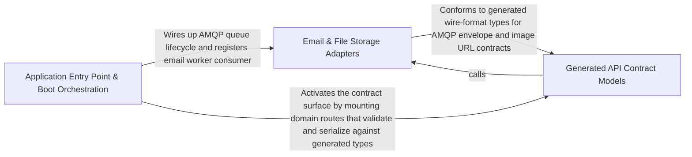

---
tags:
  - 2repo
  - 2repo/arch
  - project/boilerplate-node-backend
type: architecture
component: Application_Bootstrap_HTTP_Server_Lifecycle
---

## Details

The application entry point that owns server startup/shutdown, global error handling, route installation, and system routes, plus the long-running worker adapters (email, outbox) and file/image storage it wires up.

### Email & File Storage Adapters [[Expand]](./Email_File_Storage_Adapters.md)
The infrastructure adapters the boot sequence wires up for asynchronous side effects and binary I/O. Contains the email producer (enqueueEmail/nodemailer), the queue consumer (handleEmailJob), the demo-mode outbox sink, the multer-based upload pipeline (staging, MIME filter, byte-level image validation, locale-context restoration), and the ImageStore port with its filesystem implementation. These are the only components in the subsystem that touch SMTP, RabbitMQ email queues, or the on-disk image directory.

**Related Classes/Methods**:

- `src.infrastructure.adapters.mailer.enqueueEmail`:282-310
- `src.infrastructure.adapters.email.worker.handleEmailJob`:23-49
- `src.infrastructure.adapters.image-store.filesystemImageStore`:80-126

**Source Files:**

- `src/app/system-routes.ts`
  - `src.app.system-routes.router.get('/') callback` (L7-L9) - Function
- `src/globals.d.ts`
  - `src.globals.d.'express-serve-static-core'.Request` (L5-L23) - Interface
- `src/infrastructure/adapters/demo-outbox.ts`
  - `src.infrastructure.adapters.demo-outbox.DemoOutboxEmail` (L18-L26) - Interface
  - `src.infrastructure.adapters.demo-outbox.recordDemoEmail.lines.filter() callback` (L50-L50) - Function
  - `src.infrastructure.adapters.demo-outbox.recordDemoEmail.lines.map() callback` (L51-L51) - Function
- `src/infrastructure/adapters/email.worker.ts`
  - `src.infrastructure.adapters.email.worker.handleEmailJob` (L23-L49) - Class
  - `src.infrastructure.adapters.email.worker.handleEmailJob.then() callback` (L42-L42) - Function
  - `src.infrastructure.adapters.email.worker.handleEmailJob.catch() callback` (L43-L48) - Function
- `src/infrastructure/adapters/filesystem.ts`
  - `src.infrastructure.adapters.filesystem.deleteFile` (L51-L61) - Class
  - `src.infrastructure.adapters.filesystem.deleteFile.toolkitDeleteFile() callback` (L53-L60) - Function
- `src/infrastructure/adapters/image-store.ts`
  - `src.infrastructure.adapters.image-store.ImageStore` (L21-L50) - Interface
  - `src.infrastructure.adapters.image-store.ImageStore.put` (L37-L37) - Method
  - `src.infrastructure.adapters.image-store.ImageStore.remove` (L49-L49) - Method
  - `src.infrastructure.adapters.image-store.filesystemImageStore` (L80-L126) - Class
  - `src.infrastructure.adapters.image-store.filesystemImageStore.put` (L81-L88) - Method
  - `src.infrastructure.adapters.image-store.filesystemImageStore.remove` (L90-L125) - Method
- `src/infrastructure/adapters/mailer.ts`
  - `src.infrastructure.adapters.mailer.nodemailer` (L148-L212) - Class
  - `src.infrastructure.adapters.mailer.nodemailer.withSpan('email.send') callback` (L160-L211) - Function
  - `src.infrastructure.adapters.mailer.withSpan('email.send') callback.then() callback` (L191-L200) - Function
  - `src.infrastructure.adapters.mailer.nodemailer.withSpan('email.send') callback.then() callback` (L202-L207) - Function
  - `src.infrastructure.adapters.mailer.EmailContent` (L248-L264) - Interface
  - `src.infrastructure.adapters.mailer.enqueueEmail` (L282-L310) - Class
  - `src.infrastructure.adapters.mailer.then() callback` (L289-L289) - Function
  - `src.infrastructure.adapters.mailer.enqueueEmail.then() callback` (L298-L309) - Function
  - `src.infrastructure.adapters.mailer.enqueueEmail.then() callback.then() callback` (L301-L301) - Function
- `src/infrastructure/adapters/storage.ts`
  - `src.infrastructure.adapters.storage.withLocaleRestored` (L240-L249) - Class
  - `src.infrastructure.adapters.storage.withLocaleRestored.<function>` (L242-L249) - Function
  - `src.infrastructure.adapters.storage.withLocaleRestored.<function>.middleware() callback` (L243-L249) - Function
  - `src.infrastructure.adapters.storage.withLocaleRestored.<function>.middleware() callback.runWithLocaleContext() callback` (L248-L248) - Function
  - `src.infrastructure.adapters.storage.upload` (L389-L396) - Class
  - `src.infrastructure.adapters.storage.upload.single` (L390-L390) - Method
  - `src.infrastructure.adapters.storage.upload.array` (L391-L392) - Method
  - `src.infrastructure.adapters.storage.upload.fields` (L393-L393) - Method
  - `src.infrastructure.adapters.storage.upload.none` (L394-L394) - Method
  - `src.infrastructure.adapters.storage.upload.any` (L395-L395) - Method
- `src/infrastructure/observability/analytics/index.ts`
  - `src.infrastructure.observability.analytics.index.AnalyticsProvider` (L83-L110) - Interface
  - `src.infrastructure.observability.analytics.index.AnalyticsProvider.capture` (L91-L91) - Method
  - `src.infrastructure.observability.analytics.index.AnalyticsProvider.configured` (L101-L101) - Method
  - `src.infrastructure.observability.analytics.index.AnalyticsProvider.shutdown` (L109-L109) - Method
  - `src.infrastructure.observability.analytics.index.shutdownAnalytics` (L195-L202) - Class
  - `src.infrastructure.observability.analytics.index.shutdownAnalytics.then() callback` (L197-L201) - Function
- `src/infrastructure/observability/analytics/none.ts`
  - `src.infrastructure.observability.analytics.none.noneAnalyticsProvider` (L12-L27) - Class
  - `src.infrastructure.observability.analytics.none.noneAnalyticsProvider.capture` (L15-L17) - Method
  - `src.infrastructure.observability.analytics.none.noneAnalyticsProvider.configured` (L20-L22) - Method
  - `src.infrastructure.observability.analytics.none.noneAnalyticsProvider.shutdown` (L24-L26) - Method
- `src/infrastructure/observability/analytics/posthog.ts`
  - `src.infrastructure.observability.analytics.posthog.posthogAnalyticsProvider` (L55-L110) - Class
  - `src.infrastructure.observability.analytics.posthog.posthogAnalyticsProvider.configured` (L58-L60) - Method
  - `src.infrastructure.observability.analytics.posthog.posthogAnalyticsProvider.capture` (L62-L93) - Method
  - `src.infrastructure.observability.analytics.posthog.posthogAnalyticsProvider.shutdown` (L102-L109) - Method
- `src/infrastructure/observability/analytics/umami.ts`
  - `src.infrastructure.observability.analytics.umami.umamiAnalyticsProvider` (L94-L174) - Class
  - `src.infrastructure.observability.analytics.umami.umamiAnalyticsProvider.configured` (L99-L101) - Method
  - `src.infrastructure.observability.analytics.umami.umamiAnalyticsProvider.capture` (L103-L163) - Method
  - `src.infrastructure.observability.analytics.umami.umamiAnalyticsProvider.capture.then() callback` (L146-L156) - Function
  - `src.infrastructure.observability.analytics.umami.umamiAnalyticsProvider.capture.catch() callback` (L157-L162) - Function
  - `src.infrastructure.observability.analytics.umami.umamiAnalyticsProvider.shutdown` (L171-L173) - Method
- `src/infrastructure/observability/audit.ts`
  - `src.infrastructure.observability.audit.AuditEvent` (L57-L79) - Interface
  - `src.infrastructure.observability.audit.AuditEntry` (L85-L90) - Interface
- `src/infrastructure/observability/dependency-health.ts`
  - `src.infrastructure.observability.dependency-health.DependencyHealth` (L52-L56) - Interface
  - `src.infrastructure.observability.dependency-health.overallStatus` (L91-L94) - Class
  - `src.infrastructure.observability.dependency-health.overallStatus.every() callback` (L92-L92) - Function
- `src/infrastructure/observability/metrics-http.ts`
  - `src.infrastructure.observability.metrics-http._processUptimeGauge` (L41-L53) - Class
  - `src.infrastructure.observability.metrics-http._processUptimeGauge.collect` (L50-L52) - Method
  - `src.infrastructure.observability.metrics-http._heapSizeLimitGauge` (L68-L75) - Class
  - `src.infrastructure.observability.metrics-http._heapSizeLimitGauge.collect` (L72-L74) - Method
  - `src.infrastructure.observability.metrics-http.RequestMetricInput` (L162-L168) - Interface
  - `src.infrastructure.observability.metrics-http.sumMetricValues` (L212-L213) - Class
  - `src.infrastructure.observability.metrics-http.sumMetricValues.values.reduce() callback` (L213-L213) - Function
  - `src.infrastructure.observability.metrics-http.LatencyBucket` (L216-L220) - Interface
  - `src.infrastructure.observability.metrics-http.aggregateLatencyBuckets.buckets.toSorted() callback` (L259-L259) - Function
  - `src.infrastructure.observability.metrics-http.aggregateLatencyBuckets.buckets.map() callback` (L260-L260) - Function
  - `src.infrastructure.observability.metrics-http.getHttpRequestCounters` (L302-L308) - Class
  - `src.infrastructure.observability.metrics-http.getHttpRequestCounters.then() callback` (L304-L307) - Function
  - `src.infrastructure.observability.metrics-http.getLatencyPercentiles` (L327-L336) - Class
  - `src.infrastructure.observability.metrics-http.getLatencyPercentiles.then() callback` (L328-L336) - Function
- `src/infrastructure/observability/process-snapshot.ts`
  - `src.infrastructure.observability.process-snapshot.ProcessMemorySnapshot` (L28-L40) - Interface
  - `src.infrastructure.observability.process-snapshot.ProcessSnapshot` (L43-L53) - Interface
- `src/infrastructure/observability/stream.ts`
  - `src.infrastructure.observability.stream.buildObservabilityPayload` (L69-L90) - Class
  - `src.infrastructure.observability.stream.buildObservabilityPayload.then() callback` (L73-L89) - Function
  - `src.infrastructure.observability.stream.writeMetricsEvent` (L99-L106) - Class
  - `src.infrastructure.observability.stream.writeMetricsEvent.then() callback` (L102-L104) - Function
  - `src.infrastructure.observability.stream.writeMetricsEvent.catch() callback` (L105-L105) - Function
  - `src.infrastructure.observability.stream.streamObservabilityMetrics.updatesInterval` (L133-L135) - Class
  - `src.infrastructure.observability.stream.streamObservabilityMetrics.updatesInterval.setInterval() callback` (L133-L135) - Function
  - `src.infrastructure.observability.stream.streamObservabilityMetrics.heartbeatInterval` (L139-L141) - Class
  - `src.infrastructure.observability.stream.streamObservabilityMetrics.heartbeatInterval.setInterval() callback` (L139-L141) - Function
- `src/infrastructure/observability/tracer.ts`
  - `src.infrastructure.observability.tracer.withSpan` (L46-L90) - Class
  - `src.infrastructure.observability.tracer.withSpan.tracer.startActiveSpan() callback` (L56-L89) - Function
  - `src.infrastructure.observability.tracer.tracer.startActiveSpan() callback.then() callback` (L65-L71) - Function
  - `src.infrastructure.observability.tracer.withSpan.tracer.startActiveSpan() callback.then() callback` (L72-L87) - Function
- `src/modules/account/analytics.ts`
  - `src.modules.account.analytics.'@infrastructure/observability/analytics'.AnalyticsEventMap` (L26-L28) - Interface
- `src/modules/account/audit.ts`
  - `src.modules.account.audit.'@infrastructure/observability/audit'.AuditActionMap` (L36-L38) - Interface
- `src/modules/account/controllers/delete-account-confirm.ts`
  - `src.modules.account.controllers.delete-account-confirm.deleteAccountConfirm` (L20-L81) - Class
  - `src.modules.account.controllers.delete-account-confirm.deleteAccountConfirm.then() callback` (L31-L79) - Function
  - `src.modules.account.controllers.delete-account-confirm.deleteAccountConfirm.then() callback.then() callback` (L46-L78) - Function
  - `src.modules.account.controllers.delete-account-confirm.deleteAccountConfirm.catch() callback` (L80-L80) - Function
- `src/modules/account/controllers/delete-account-request.ts`
  - `src.modules.account.controllers.delete-account-request.deleteAccountRequest` (L23-L61) - Class
  - `src.modules.account.controllers.delete-account-request.deleteAccountRequest.then() callback` (L29-L59) - Function
  - `src.modules.account.controllers.delete-account-request.deleteAccountRequest.then() callback.then() callback` (L34-L58) - Function
  - `src.modules.account.controllers.delete-account-request.deleteAccountRequest.catch() callback` (L60-L60) - Function
- `src/modules/account/controllers/delete-address.ts`
  - `src.modules.account.controllers.delete-address.deleteAddress` (L17-L29) - Class
  - `src.modules.account.controllers.delete-address.deleteAddress.then() callback` (L24-L27) - Function
- `src/modules/account/controllers/delete-expired-tokens.ts`
  - `src.modules.account.controllers.delete-expired-tokens.deleteExpiredTokens` (L14-L31) - Class
  - `src.modules.account.controllers.delete-expired-tokens.deleteExpiredTokens.then() callback` (L19-L29) - Function
- `src/modules/account/controllers/delete-session.ts`
  - `src.modules.account.controllers.delete-session.deleteSession` (L23-L46) - Class
  - `src.modules.account.controllers.delete-session.deleteSession.then() callback` (L30-L44) - Function
- `src/modules/account/controllers/get-account.ts`
  - `src.modules.account.controllers.get-account.getAccount` (L17-L35) - Class
  - `src.modules.account.controllers.get-account.getAccount.then() callback` (L29-L33) - Function
  - `src.modules.account.controllers.get-account.getAccount.catch() callback` (L34-L34) - Function
- `src/modules/account/controllers/get-addresses.ts`
  - `src.modules.account.controllers.get-addresses.getAddresses` (L14-L24) - Class
  - `src.modules.account.controllers.get-addresses.getAddresses.then() callback` (L20-L22) - Function
- `src/modules/account/controllers/get-refresh-token.ts`
  - `src.modules.account.controllers.get-refresh-token.getRefreshToken` (L21-L86) - Class
  - `src.modules.account.controllers.get-refresh-token.getRefreshToken.then() callback` (L50-L77) - Function
  - `src.modules.account.controllers.get-refresh-token.getRefreshToken.then() callback.then() callback.then() callback` (L54-L54) - Function
  - `src.modules.account.controllers.get-refresh-token.getRefreshToken.then() callback.then() callback` (L55-L64) - Function
  - `src.modules.account.controllers.get-refresh-token.getRefreshToken.then() callback.catch() callback` (L65-L77) - Function
  - `src.modules.account.controllers.get-refresh-token.getRefreshToken.catch() callback` (L79-L85) - Function
- `src/modules/account/controllers/get-sessions.ts`
  - `src.modules.account.controllers.get-sessions.getSessions` (L30-L58) - Class
  - `src.modules.account.controllers.get-sessions.getSessions.then() callback` (L39-L55) - Function
  - `src.modules.account.controllers.get-sessions.getSessions.then() callback.sessions.user.tokens.filter() callback` (L51-L51) - Function
  - `src.modules.account.controllers.get-sessions.getSessions.then() callback.sessions.map() callback` (L52-L52) - Function
- `src/modules/account/controllers/post-login.ts`
  - `src.modules.account.controllers.post-login.postLogin` (L63-L144) - Class
  - `src.modules.account.controllers.post-login.postLogin.then() callback` (L99-L137) - Function
  - `src.modules.account.controllers.post-login.postLogin.then() callback.then() callback` (L128-L136) - Function
  - `src.modules.account.controllers.post-login.postLogin.catch() callback` (L138-L143) - Function
- `src/modules/account/controllers/post-logout-everywhere.ts`
  - `src.modules.account.controllers.post-logout-everywhere.postLogoutEverywhere` (L16-L33) - Class
  - `src.modules.account.controllers.post-logout-everywhere.postLogoutEverywhere.then() callback` (L19-L31) - Function
- `src/modules/account/controllers/post-logout.ts`
  - `src.modules.account.controllers.post-logout.postLogout` (L22-L40) - Class
  - `src.modules.account.controllers.post-logout.postLogout.then() callback` (L26-L38) - Function
- `src/modules/account/controllers/post-password-change.ts`
  - `src.modules.account.controllers.post-password-change.postPasswordChange` (L23-L67) - Class
  - `src.modules.account.controllers.post-password-change.postPasswordChange.then() callback` (L41-L62) - Function
  - `src.modules.account.controllers.post-password-change.postPasswordChange.catch() callback` (L63-L66) - Function
- `src/modules/account/controllers/post-reset-confirm.ts`
  - `src.modules.account.controllers.post-reset-confirm.postResetConfirm` (L19-L117) - Class
  - `src.modules.account.controllers.post-reset-confirm.postResetConfirm.then() callback` (L34-L113) - Function
  - `src.modules.account.controllers.post-reset-confirm.postResetConfirm.then() callback.then() callback` (L68-L112) - Function
  - `src.modules.account.controllers.post-reset-confirm.postResetConfirm.then() callback.then() callback.then() callback` (L79-L111) - Function
  - `src.modules.account.controllers.post-reset-confirm.postResetConfirm.catch() callback` (L114-L116) - Function
- `src/modules/account/controllers/post-reset-request.ts`
  - `src.modules.account.controllers.post-reset-request.lookupResetData` (L26-L38) - Class
  - `src.modules.account.controllers.post-reset-request.lookupResetData.then() callback` (L28-L37) - Function
  - `src.modules.account.controllers.post-reset-request.lookupResetData.then() callback.then() callback` (L30-L36) - Function
  - `src.modules.account.controllers.post-reset-request.postResetRequest` (L46-L92) - Class
  - `src.modules.account.controllers.post-reset-request.postResetRequest.catch() callback` (L59-L61) - Function
  - `src.modules.account.controllers.post-reset-request.postResetRequest.then() callback` (L62-L90) - Function
- `src/modules/account/controllers/post-signup.ts`
  - `src.modules.account.controllers.post-signup.postSignup` (L20-L94) - Class
  - `src.modules.account.controllers.post-signup.postSignup.then() callback` (L48-L88) - Function
  - `src.modules.account.controllers.post-signup.postSignup.then() callback.then() callback` (L50-L61) - Function
  - `src.modules.account.controllers.post-signup.postSignup.catch() callback` (L89-L93) - Function
- `src/modules/account/controllers/post-verify-confirm.ts`
  - `src.modules.account.controllers.post-verify-confirm.postVerifyConfirm` (L25-L82) - Class
  - `src.modules.account.controllers.post-verify-confirm.postVerifyConfirm.then() callback` (L39-L77) - Function
  - `src.modules.account.controllers.post-verify-confirm.postVerifyConfirm.then() callback.then() callback` (L55-L76) - Function
  - `src.modules.account.controllers.post-verify-confirm.postVerifyConfirm.then() callback.then() callback.then() callback` (L63-L75) - Function
  - `src.modules.account.controllers.post-verify-confirm.postVerifyConfirm.catch() callback` (L78-L81) - Function
- `src/modules/account/controllers/post-verify-request.ts`
  - `src.modules.account.controllers.post-verify-request.postVerifyRequest` (L20-L51) - Class
  - `src.modules.account.controllers.post-verify-request.postVerifyRequest.then() callback` (L28-L48) - Function
  - `src.modules.account.controllers.post-verify-request.postVerifyRequest.then() callback.then() callback` (L38-L47) - Function
- `src/modules/account/controllers/put-account.ts`
  - `src.modules.account.controllers.put-account.putAccount` (L22-L75) - Class
  - `src.modules.account.controllers.put-account.putAccount.then() callback` (L47-L70) - Function
  - `src.modules.account.controllers.put-account.putAccount.then() callback.then() callback` (L49-L51) - Function
  - `src.modules.account.controllers.put-account.putAccount.catch() callback` (L71-L74) - Function
- `src/modules/account/controllers/write-addresses.ts`
  - `src.modules.account.controllers.write-addresses.postAddress` (L28-L45) - Class
  - `src.modules.account.controllers.write-addresses.postAddress.then() callback` (L40-L43) - Function
  - `src.modules.account.controllers.write-addresses.putAddress` (L53-L71) - Class
  - `src.modules.account.controllers.write-addresses.putAddress.then() callback` (L66-L69) - Function
- `src/modules/account/services/verification.ts`
  - `src.modules.account.services.verification.sendVerificationEmail` (L40-L60) - Class
  - `src.modules.account.services.verification.sendVerificationEmail.then() callback` (L44-L60) - Function
- `src/modules/account/session/jwt.ts`
  - `src.modules.account.session.jwt.TokenData` (L22-L24) - Interface
  - `src.modules.account.session.jwt.verifyAccessToken` (L33-L42) - Class
  - `src.modules.account.session.jwt.verifyAccessToken.<function>` (L34-L42) - Function
  - `src.modules.account.session.jwt.verifyAccessToken.<function>.verify() callback` (L35-L41) - Function
  - `src.modules.account.session.jwt.verifyRefreshToken` (L50-L69) - Class
  - `src.modules.account.session.jwt.verifyRefreshToken.<function>` (L51-L69) - Function
  - `src.modules.account.session.jwt.verifyRefreshToken.<function>.verify() callback` (L52-L68) - Function
  - `src.modules.account.session.jwt.verifyRefreshToken.<function>.verify() callback.then() callback` (L60-L66) - Function
  - `src.modules.account.session.jwt.verifyRefreshToken.<function>.verify() callback.catch() callback` (L67-L67) - Function
  - `src.modules.account.session.jwt.createRefreshToken` (L77-L102) - Class
  - `src.modules.account.session.jwt.createRefreshToken.then() callback` (L80-L102) - Function
  - `src.modules.account.session.jwt.recordRefreshTokenUse` (L122-L128) - Class
  - `src.modules.account.session.jwt.recordRefreshTokenUse.then() callback` (L127-L127) - Function
  - `src.modules.account.session.jwt.recordRefreshTokenUse.catch() callback` (L128-L128) - Function
  - `src.modules.account.session.jwt.createAccessToken` (L135-L141) - Class
  - `src.modules.account.session.jwt.createAccessToken.then() callback` (L136-L140) - Function
- `src/modules/audit-logs/repository.ts`
  - `src.modules.audit-logs.repository.AuditLogSearchFilters` (L14-L22) - Interface
- `src/modules/cart/analytics.ts`
  - `src.modules.cart.analytics.'@infrastructure/observability/analytics'.AnalyticsEventMap` (L37-L39) - Interface
- `src/modules/cart/audit.ts`
  - `src.modules.cart.audit.'@infrastructure/observability/audit'.AuditActionMap` (L18-L20) - Interface
- `src/modules/cart/controllers/delete-cart-item.ts`
  - `src.modules.cart.controllers.delete-cart-item.deleteCartItem` (L18-L56) - Class
  - `src.modules.cart.controllers.delete-cart-item.deleteCartItem.then() callback` (L36-L54) - Function
- `src/modules/cart/controllers/delete-cart.ts`
  - `src.modules.cart.controllers.delete-cart.deleteCart` (L13-L27) - Class
  - `src.modules.cart.controllers.delete-cart.deleteCart.then() callback` (L18-L25) - Function
- `src/modules/cart/controllers/get-cart-summary.ts`
  - `src.modules.cart.controllers.get-cart-summary.getCartSummary` (L11-L18) - Class
  - `src.modules.cart.controllers.get-cart-summary.getCartSummary.then() callback` (L14-L16) - Function
- `src/modules/cart/controllers/get-cart.ts`
  - `src.modules.cart.controllers.get-cart.getCart` (L14-L25) - Class
  - `src.modules.cart.controllers.get-cart.getCart.then() callback` (L17-L23) - Function
- `src/modules/cart/controllers/post-cart.ts`
  - `src.modules.cart.controllers.post-cart.postCart` (L20-L50) - Class
  - `src.modules.cart.controllers.post-cart.postCart.then() callback` (L39-L48) - Function
- `src/modules/cart/controllers/post-checkout.ts`
  - `src.modules.cart.controllers.post-checkout.postCheckout` (L15-L52) - Class
  - `src.modules.cart.controllers.post-checkout.postCheckout.then() callback` (L24-L47) - Function
  - `src.modules.cart.controllers.post-checkout.postCheckout.catch() callback` (L48-L51) - Function
- `src/modules/cart/controllers/post-reorder.ts`
  - `src.modules.cart.controllers.post-reorder.postReorder` (L19-L44) - Class
  - `src.modules.cart.controllers.post-reorder.postReorder.then() callback` (L25-L42) - Function
- `src/modules/cart/controllers/put-cart-item.ts`
  - `src.modules.cart.controllers.put-cart-item.putCartItem` (L20-L51) - Class
  - `src.modules.cart.controllers.put-cart-item.putCartItem.then() callback` (L40-L49) - Function
- `src/modules/cart/repository.ts`
  - `src.modules.cart.repository.upsertLine` (L31-L65) - Class
  - `src.modules.cart.repository.upsertLine.then() callback` (L51-L59) - Function
  - `src.modules.cart.repository.upsertLine.catch() callback` (L61-L64) - Function
- `src/modules/cart/services/checkout.ts`
  - `src.modules.cart.services.checkout.orderConfirm.<function>.then() callback.then() callback.then() callback.then() callback` (L223-L259) - Function
  - `src.modules.cart.services.checkout.<function>.then() callback.then() callback.then() callback.then() callback.then() callback` (L250-L250) - Function
- `src/modules/delivery/audit.ts`
  - `src.modules.delivery.audit.'@infrastructure/observability/audit'.AuditActionMap` (L14-L16) - Interface
- `src/modules/delivery/model.ts`
  - `src.modules.delivery.model.ShipmentDocument` (L18-L26) - Interface
- `src/modules/feedback/audit.ts`
  - `src.modules.feedback.audit.'@infrastructure/observability/audit'.AuditActionMap` (L17-L19) - Interface
- `src/modules/feedback/controllers/get-feedback.ts`
  - `src.modules.feedback.controllers.get-feedback.getFeedback` (L37-L73) - Class
  - `src.modules.feedback.controllers.get-feedback.getFeedback.then() callback` (L63-L71) - Function
- `src/modules/feedback/controllers/post-feedback-contact.ts`
  - `src.modules.feedback.controllers.post-feedback-contact.postFeedbackContact` (L29-L75) - Class
  - `src.modules.feedback.controllers.post-feedback-contact.postFeedbackContact.then() callback` (L38-L73) - Function
  - `src.modules.feedback.controllers.post-feedback-contact.postFeedbackContact.then() callback.catch() callback` (L64-L68) - Function
- `src/modules/feedback/controllers/put-feedback-status.ts`
  - `src.modules.feedback.controllers.put-feedback-status.putFeedbackStatus` (L24-L49) - Class
  - `src.modules.feedback.controllers.put-feedback-status.putFeedbackStatus.then() callback` (L35-L47) - Function
- `src/modules/feedback/emails.ts`
  - `src.modules.feedback.emails.ContactRequest` (L18-L24) - Interface
- `src/modules/feedback/model.ts`
  - `src.modules.feedback.model.FeedbackRequestDocument` (L9-L14) - Interface
- `src/modules/inventory/audit.ts`
  - `src.modules.inventory.audit.'@infrastructure/observability/audit'.AuditActionMap` (L22-L24) - Interface
- `src/modules/inventory/domain/transitions.ts`
  - `src.modules.inventory.domain.transitions.CounterDelta` (L21-L24) - Interface
- `src/modules/inventory/events.ts`
  - `src.modules.inventory.events.'@kernel/events'.DomainEventMap` (L15-L27) - Interface
- `src/modules/locales/audit.ts`
  - `src.modules.locales.audit.'@infrastructure/observability/audit'.AuditActionMap` (L37-L39) - Interface
- `src/modules/observability/controllers/get-observability-audit.ts`
  - `src.modules.observability.controllers.get-observability-audit.getObservabilityAuditLogs` (L13-L51) - Class
  - `src.modules.observability.controllers.get-observability-audit.getObservabilityAuditLogs.then() callback` (L49-L49) - Function
- `src/modules/observability/controllers/get-observability-metrics-overview.ts`
  - `src.modules.observability.controllers.get-observability-metrics-overview.MetricSample` (L12-L15) - Interface
  - `src.modules.observability.controllers.get-observability-metrics-overview.sumByLabel` (L39-L40) - Class
  - `src.modules.observability.controllers.get-observability-metrics-overview.sumByLabel.reduce() callback` (L40-L40) - Function
  - `src.modules.observability.controllers.get-observability-metrics-overview.sumByLabel.values.filter() callback` (L40-L40) - Function
  - `src.modules.observability.controllers.get-observability-metrics-overview.getObservabilityMetricsOverview` (L46-L110) - Class
  - `src.modules.observability.controllers.get-observability-metrics-overview.getObservabilityMetricsOverview.then() callback` (L61-L106) - Function
  - `src.modules.observability.controllers.get-observability-metrics-overview.getObservabilityMetricsOverview.then() callback.inFlight` (L73-L73) - Class
  - `src.modules.observability.controllers.get-observability-metrics-overview.getObservabilityMetricsOverview.then() callback.inFlight.inflightMetric.values.reduce() callback` (L73-L73) - Function
  - `src.modules.observability.controllers.get-observability-metrics-overview.getObservabilityMetricsOverview.then() callback.data.business.ordersCreated.orderValues.reduce() callback` (L90-L90) - Function
  - `src.modules.observability.controllers.get-observability-metrics-overview.getObservabilityMetricsOverview.then() callback.data.business.lowStockProducts.lowStockValues.reduce() callback` (L91-L91) - Function
  - `src.modules.observability.controllers.get-observability-metrics-overview.getObservabilityMetricsOverview.then() callback.data.business.reservedUnits.reservedValues.reduce() callback` (L92-L92) - Function
  - `src.modules.observability.controllers.get-observability-metrics-overview.getObservabilityMetricsOverview.catch() callback` (L108-L110) - Function
- `src/modules/observability/routes.ts`
  - `src.modules.observability.routes.router.get('/events') callback` (L24-L26) - Function
  - `src.modules.observability.routes.router.get('/metrics') callback` (L28-L38) - Function
  - `src.modules.observability.routes.router.get('/metrics') callback.then() callback` (L30-L33) - Function
  - `src.modules.observability.routes.router.get('/metrics') callback.catch() callback` (L34-L37) - Function
- `src/modules/orders/analytics.ts`
  - `src.modules.orders.analytics.'@infrastructure/observability/analytics'.AnalyticsEventMap` (L26-L28) - Interface
- `src/modules/orders/audit.ts`
  - `src.modules.orders.audit.'@infrastructure/observability/audit'.AuditActionMap` (L23-L25) - Interface
- `src/modules/orders/emails.ts`
  - `src.modules.orders.emails.orderConfirmEmail.data.lines.order.items.map() callback` (L50-L55) - Function
  - `src.modules.orders.emails.invoiceDocument.lines.order.items.map() callback` (L88-L93) - Function
- `src/modules/orders/events.ts`
  - `src.modules.orders.events.'@kernel/events'.DomainEventMap` (L15-L33) - Interface
- `src/modules/payments/analytics.ts`
  - `src.modules.payments.analytics.'@infrastructure/observability/analytics'.AnalyticsEventMap` (L26-L28) - Interface
- `src/modules/payments/audit.ts`
  - `src.modules.payments.audit.'@infrastructure/observability/audit'.AuditActionMap` (L18-L20) - Interface
- `src/modules/payments/model.ts`
  - `src.modules.payments.model.PaymentDocument` (L26-L40) - Interface
- `src/modules/products/analytics.ts`
  - `src.modules.products.analytics.'@infrastructure/observability/analytics'.AnalyticsEventMap` (L24-L26) - Interface
- `src/modules/products/audit.ts`
  - `src.modules.products.audit.'@infrastructure/observability/audit'.AuditActionMap` (L16-L18) - Interface
- `src/modules/products/events.ts`
  - `src.modules.products.events.'@kernel/events'.DomainEventMap` (L9-L18) - Interface
- `src/modules/products/service.ts`
  - `src.modules.products.service.sanitizeStringArray` (L43-L46) - Class
  - `src.modules.products.service.sanitizeStringArray.values.map() callback` (L45-L45) - Function
  - `src.modules.products.service.update` (L111-L149) - Class
  - `src.modules.products.service.update.then() callback` (L141-L148) - Function
  - `src.modules.products.service.update.then() callback.then() callback` (L147-L147) - Function
- `src/modules/users/audit.ts`
  - `src.modules.users.audit.'@infrastructure/observability/audit'.AuditActionMap` (L16-L18) - Interface
- `src/modules/users/events.ts`
  - `src.modules.users.events.'@kernel/events'.DomainEventMap` (L9-L22) - Interface
- `src/modules/wishlist/analytics.ts`
  - `src.modules.wishlist.analytics.'@infrastructure/observability/analytics'.AnalyticsEventMap` (L25-L27) - Interface
- `src/types/auth-context.ts`
  - `src.types.auth-context.AuthContext` (L6-L12) - Interface

### Application Entry Point & Boot Orchestration [[Expand]](./Application_Entry_Point_Boot_Orchestration.md)
The process entry point that owns the boot/shutdown sequence and the Express middleware installation order. startServer runs the ordered promise chain (env validation → DB → cache → queue → workers → i18n → listen), stopServer performs idempotent graceful shutdown, and the module-scope calls (registerModules, installSecurity, installRequestContext, installTelemetry, installStatic, installDemo, installRoutes, installErrorHandling) define the request-path middleware stack. Also carries the boot-time callbacks (then/catch) and the script-level orchestration steps that drive regeneration and mutation baselines.

**Related Classes/Methods**:

- `src.app.startServer`:59-117
- `src.app.stopServer`:122-131
- `src.app.routes.installRoutes`:26-48
- `scripts.regenerate.Step`:31-36

**Source Files:**

- `api/models/accountDeleteConfirmRequest.ts`
  - `api.models.accountDeleteConfirmRequest.AccountDeleteConfirmRequest` (L22-L25) - Interface
- `api/models/addWishlistItemRequest.ts`
  - `api.models.addWishlistItemRequest.AddWishlistItemRequest` (L23-L25) - Interface
- `api/models/address.ts`
  - `api.models.address.Address` (L23-L34) - Interface
- `api/models/addressInput.ts`
  - `api.models.addressInput.AddressInput` (L22-L36) - Interface
- `api/models/addressesEnvelope.ts`
  - `api.models.addressesEnvelope.AddressesEnvelope` (L26-L31) - Interface
- `api/models/addressesResponse.ts`
  - `api.models.addressesResponse.AddressesResponse` (L23-L25) - Interface
- `api/models/adjustmentRequest.ts`
  - `api.models.adjustmentRequest.AdjustmentRequest` (L23-L29) - Interface
- `api/models/auditEventItem.ts`
  - `api.models.auditEventItem.AuditEventItem` (L26-L41) - Interface
- `api/models/auditLogsPage.ts`
  - `api.models.auditLogsPage.AuditLogsPage` (L24-L27) - Interface
- `api/models/auditLogsResponseEnvelope.ts`
  - `api.models.auditLogsResponseEnvelope.AuditLogsResponseEnvelope` (L26-L31) - Interface
- `api/models/authTokens.ts`
  - `api.models.authTokens.AuthTokens` (L22-L29) - Interface
- `api/models/authTokensEnvelope.ts`
  - `api.models.authTokensEnvelope.AuthTokensEnvelope` (L26-L31) - Interface
- `api/models/cancelOrderRequest.ts`
  - `api.models.cancelOrderRequest.CancelOrderRequest` (L25-L28) - Interface
- `api/models/cartResponse.ts`
  - `api.models.cartResponse.CartResponse` (L24-L27) - Interface
- `api/models/cartResponseEnvelope.ts`
  - `api.models.cartResponseEnvelope.CartResponseEnvelope` (L26-L31) - Interface
- `api/models/cartSummaryResponse.ts`
  - `api.models.cartSummaryResponse.CartSummaryResponse` (L22-L40) - Interface
- `api/models/cartSummaryResponseEnvelope.ts`
  - `api.models.cartSummaryResponseEnvelope.CartSummaryResponseEnvelope` (L26-L31) - Interface
- `api/models/catalogueFacetsEnvelope.ts`
  - `api.models.catalogueFacetsEnvelope.CatalogueFacetsEnvelope` (L26-L31) - Interface
- `api/models/catalogueFacetsResponse.ts`
  - `api.models.catalogueFacetsResponse.CatalogueFacetsResponse` (L23-L26) - Interface
- `api/models/changePasswordRequest.ts`
  - `api.models.changePasswordRequest.ChangePasswordRequest` (L23-L27) - Interface
- `api/models/checkoutRequest.ts`
  - `api.models.checkoutRequest.CheckoutRequest` (L24-L32) - Interface
- `api/models/checkoutResponse.ts`
  - `api.models.checkoutResponse.CheckoutResponse` (L23-L26) - Interface
- `api/models/checkoutResponseEnvelope.ts`
  - `api.models.checkoutResponseEnvelope.CheckoutResponseEnvelope` (L26-L31) - Interface
- `api/models/confirmPaymentRequest.ts`
  - `api.models.confirmPaymentRequest.ConfirmPaymentRequest` (L22-L30) - Interface
- `api/models/courierAdvanceResponse.ts`
  - `api.models.courierAdvanceResponse.CourierAdvanceResponse` (L22-L28) - Interface
- `api/models/courierAdvanceResponseEnvelope.ts`
  - `api.models.courierAdvanceResponseEnvelope.CourierAdvanceResponseEnvelope` (L26-L31) - Interface
- `api/models/createFeedbackRequest.ts`
  - `api.models.createFeedbackRequest.CreateFeedbackRequest` (L23-L28) - Interface
- `api/models/createLocaleEntryRequest.ts`
  - `api.models.createLocaleEntryRequest.CreateLocaleEntryRequest` (L23-L28) - Interface
- `api/models/createLocaleRequest.ts`
  - `api.models.createLocaleRequest.CreateLocaleRequest` (L24-L32) - Interface
- `api/models/createOrderRequest.ts`
  - `api.models.createOrderRequest.CreateOrderRequest` (L28-L33) - Interface
- `api/models/createPaymentIntentRequest.ts`
  - `api.models.createPaymentIntentRequest.CreatePaymentIntentRequest` (L23-L25) - Interface
- `api/models/createProductRequest.ts`
  - `api.models.createProductRequest.CreateProductRequest` (L23-L34) - Interface
- `api/models/createProductRequestMultipart.ts`
  - `api.models.createProductRequestMultipart.CreateProductRequestMultipart` (L22-L34) - Interface
- `api/models/createUserRequest.ts`
  - `api.models.createUserRequest.CreateUserRequest` (L26-L34) - Interface
- `api/models/createUserRequestMultipart.ts`
  - `api.models.createUserRequestMultipart.CreateUserRequestMultipart` (L25-L34) - Interface
- `api/models/deleteOrderRequest.ts`
  - `api.models.deleteOrderRequest.DeleteOrderRequest` (L23-L26) - Interface
- `api/models/deleteProductRequest.ts`
  - `api.models.deleteProductRequest.DeleteProductRequest` (L23-L26) - Interface
- `api/models/deleteUserRequest.ts`
  - `api.models.deleteUserRequest.DeleteUserRequest` (L23-L26) - Interface
- `api/models/errorItem.ts`
  - `api.models.errorItem.ErrorItem` (L23-L30) - Interface
- `api/models/errorResponse.ts`
  - `api.models.errorResponse.ErrorResponse` (L23-L33) - Interface
- `api/models/facetCount.ts`
  - `api.models.facetCount.FacetCount` (L22-L26) - Interface
- `api/models/feedbackRequest.ts`
  - `api.models.feedbackRequest.FeedbackRequest` (L25-L36) - Interface
- `api/models/feedbackRequestEnvelope.ts`
  - `api.models.feedbackRequestEnvelope.FeedbackRequestEnvelope` (L26-L31) - Interface
- `api/models/feedbackRequestsResponse.ts`
  - `api.models.feedbackRequestsResponse.FeedbackRequestsResponse` (L24-L27) - Interface
- `api/models/feedbackRequestsResponseEnvelope.ts`
  - `api.models.feedbackRequestsResponseEnvelope.FeedbackRequestsResponseEnvelope` (L26-L31) - Interface
- `api/models/hardDeleteRequest.ts`
  - `api.models.hardDeleteRequest.HardDeleteRequest` (L22-L24) - Interface
- `api/models/healthPing.ts`
  - `api.models.healthPing.HealthPing` (L23-L26) - Interface
- `api/models/healthPingEnvelope.ts`
  - `api.models.healthPingEnvelope.HealthPingEnvelope` (L26-L31) - Interface
- `api/models/inventoryLevel.ts`
  - `api.models.inventoryLevel.InventoryLevel` (L23-L33) - Interface
- `api/models/inventoryLevelEnvelope.ts`
  - `api.models.inventoryLevelEnvelope.InventoryLevelEnvelope` (L26-L31) - Interface
- `api/models/inventoryLevelsResponse.ts`
  - `api.models.inventoryLevelsResponse.InventoryLevelsResponse` (L24-L27) - Interface
- `api/models/inventoryLevelsResponseEnvelope.ts`
  - `api.models.inventoryLevelsResponseEnvelope.InventoryLevelsResponseEnvelope` (L26-L31) - Interface
- `api/models/language.ts`
  - `api.models.language.Language` (L28-L47) - Interface
- `api/models/languageEnvelope.ts`
  - `api.models.languageEnvelope.LanguageEnvelope` (L26-L31) - Interface
- `api/models/localeCapabilities.ts`
  - `api.models.localeCapabilities.LocaleCapabilities` (L27-L32) - Interface
- `api/models/localeCapabilitiesEnvelope.ts`
  - `api.models.localeCapabilitiesEnvelope.LocaleCapabilitiesEnvelope` (L26-L31) - Interface
- `api/models/localeCapability.ts`
  - `api.models.localeCapability.LocaleCapability` (L29-L45) - Interface
- `api/models/localeDictionary.ts`
  - `api.models.localeDictionary.LocaleDictionary` (L27-L31) - Interface
- `api/models/localeDictionaryEnvelope.ts`
  - `api.models.localeDictionaryEnvelope.LocaleDictionaryEnvelope` (L26-L31) - Interface
- `api/models/localeEntriesResponse.ts`
  - `api.models.localeEntriesResponse.LocaleEntriesResponse` (L24-L27) - Interface
- `api/models/localeEntriesResponseEnvelope.ts`
  - `api.models.localeEntriesResponseEnvelope.LocaleEntriesResponseEnvelope` (L26-L31) - Interface
- `api/models/localeEntry.ts`
  - `api.models.localeEntry.LocaleEntry` (L29-L38) - Interface
- `api/models/localeEntryEnvelope.ts`
  - `api.models.localeEntryEnvelope.LocaleEntryEnvelope` (L26-L31) - Interface
- `api/models/localeEntryInput.ts`
  - `api.models.localeEntryInput.LocaleEntryInput` (L27-L31) - Interface
- `api/models/localeImportResult.ts`
  - `api.models.localeImportResult.LocaleImportResult` (L25-L34) - Interface
- `api/models/localeImportResultEnvelope.ts`
  - `api.models.localeImportResultEnvelope.LocaleImportResultEnvelope` (L26-L31) - Interface
- `api/models/localeMessages.ts`
  - `api.models.localeMessages.LocaleMessages` (L27-L33) - Interface
- `api/models/localeMessagesEnvelope.ts`
  - `api.models.localeMessagesEnvelope.LocaleMessagesEnvelope` (L26-L31) - Interface
- `api/models/localeTenantDescriptor.ts`
  - `api.models.localeTenantDescriptor.LocaleTenantDescriptor` (L27-L32) - Interface
- `api/models/localeTenants.ts`
  - `api.models.localeTenants.LocaleTenants` (L23-L26) - Interface
- `api/models/localeTenantsEnvelope.ts`
  - `api.models.localeTenantsEnvelope.LocaleTenantsEnvelope` (L26-L31) - Interface
- `api/models/loginRequest.ts`
  - `api.models.loginRequest.LoginRequest` (L25-L30) - Interface
- `api/models/mergeLocaleEntriesRequest.ts`
  - `api.models.mergeLocaleEntriesRequest.MergeLocaleEntriesRequest` (L27-L31) - Interface
- `api/models/messageResponse.ts`
  - `api.models.messageResponse.MessageResponse` (L25-L29) - Interface
- `api/models/observabilityDependency.ts`
  - `api.models.observabilityDependency.ObservabilityDependency` (L23-L25) - Interface
- `api/models/observabilityHealth.ts`
  - `api.models.observabilityHealth.ObservabilityHealth` (L27-L44) - Interface
- `api/models/observabilityHealthDependencies.ts`
  - `api.models.observabilityHealthDependencies.ObservabilityHealthDependencies` (L26-L30) - Interface
- `api/models/observabilityHealthResponseEnvelope.ts`
  - `api.models.observabilityHealthResponseEnvelope.ObservabilityHealthResponseEnvelope` (L26-L31) - Interface
- `api/models/observabilityHealthSystem.ts`
  - `api.models.observabilityHealthSystem.ObservabilityHealthSystem` (L22-L26) - Interface
- `api/models/observabilityHealthTelemetry.ts`
  - `api.models.observabilityHealthTelemetry.ObservabilityHealthTelemetry` (L27-L33) - Interface
- `api/models/observabilityMetricsLatency.ts`
  - `api.models.observabilityMetricsLatency.ObservabilityMetricsLatency` (L22-L27) - Interface
- `api/models/observabilityMetricsSummary.ts`
  - `api.models.observabilityMetricsSummary.ObservabilityMetricsSummary` (L27-L34) - Interface
- `api/models/observabilityMetricsSummaryResponseEnvelope.ts`
  - `api.models.observabilityMetricsSummaryResponseEnvelope.ObservabilityMetricsSummaryResponseEnvelope` (L26-L31) - Interface
- `api/models/order.ts`
  - `api.models.order.Order` (L28-L63) - Interface
- `api/models/orderActions.ts`
  - `api.models.orderActions.OrderActions` (L26-L33) - Interface
- `api/models/orderAddress.ts`
  - `api.models.orderAddress.OrderAddress` (L22-L29) - Interface
- `api/models/orderEnvelope.ts`
  - `api.models.orderEnvelope.OrderEnvelope` (L26-L31) - Interface
- `api/models/orderItem.ts`
  - `api.models.orderItem.OrderItem` (L23-L27) - Interface
- `api/models/ordersResponse.ts`
  - `api.models.ordersResponse.OrdersResponse` (L24-L27) - Interface
- `api/models/ordersResponseEnvelope.ts`
  - `api.models.ordersResponseEnvelope.OrdersResponseEnvelope` (L26-L31) - Interface
- `api/models/paginationMeta.ts`
  - `api.models.paginationMeta.PaginationMeta` (L24-L31) - Interface
- `api/models/passwordResetConfirmRequest.ts`
  - `api.models.passwordResetConfirmRequest.PasswordResetConfirmRequest` (L23-L28) - Interface
- `api/models/passwordResetRequest.ts`
  - `api.models.passwordResetRequest.PasswordResetRequest` (L23-L25) - Interface
- `api/models/payment.ts`
  - `api.models.payment.Payment` (L25-L45) - Interface
- `api/models/paymentActions.ts`
  - `api.models.paymentActions.PaymentActions` (L25-L30) - Interface
- `api/models/paymentEnvelope.ts`
  - `api.models.paymentEnvelope.PaymentEnvelope` (L26-L31) - Interface
- `api/models/processMemory.ts`
  - `api.models.processMemory.ProcessMemory` (L26-L35) - Interface
- `api/models/product.ts`
  - `api.models.product.Product` (L24-L52) - Interface
- `api/models/productEnvelope.ts`
  - `api.models.productEnvelope.ProductEnvelope` (L26-L31) - Interface
- `api/models/productsResponse.ts`
  - `api.models.productsResponse.ProductsResponse` (L24-L27) - Interface
- `api/models/productsResponseEnvelope.ts`
  - `api.models.productsResponseEnvelope.ProductsResponseEnvelope` (L26-L31) - Interface
- `api/models/receiptRequest.ts`
  - `api.models.receiptRequest.ReceiptRequest` (L23-L32) - Interface
- `api/models/refreshTokenEnvelope.ts`
  - `api.models.refreshTokenEnvelope.RefreshTokenEnvelope` (L26-L31) - Interface
- `api/models/refreshTokenResponse.ts`
  - `api.models.refreshTokenResponse.RefreshTokenResponse` (L22-L29) - Interface
- `api/models/removeCartItemRequest.ts`
  - `api.models.removeCartItemRequest.RemoveCartItemRequest` (L23-L25) - Interface
- `api/models/replaceLocaleEntriesRequest.ts`
  - `api.models.replaceLocaleEntriesRequest.ReplaceLocaleEntriesRequest` (L28-L31) - Interface
- `api/models/reservationSweepEnvelope.ts`
  - `api.models.reservationSweepEnvelope.ReservationSweepEnvelope` (L26-L31) - Interface
- `api/models/reservationSweepResponse.ts`
  - `api.models.reservationSweepResponse.ReservationSweepResponse` (L22-L28) - Interface
- `api/models/searchFeedbackRequestsRequest.ts`
  - `api.models.searchFeedbackRequestsRequest.SearchFeedbackRequestsRequest` (L27-L33) - Interface
- `api/models/searchOrdersRequest.ts`
  - `api.models.searchOrdersRequest.SearchOrdersRequest` (L27-L36) - Interface
- `api/models/searchProductsRequest.ts`
  - `api.models.searchProductsRequest.SearchProductsRequest` (L26-L39) - Interface
- `api/models/searchUsersRequest.ts`
  - `api.models.searchUsersRequest.SearchUsersRequest` (L27-L37) - Interface
- `api/models/session.ts`
  - `api.models.session.Session` (L23-L31) - Interface
- `api/models/sessionsEnvelope.ts`
  - `api.models.sessionsEnvelope.SessionsEnvelope` (L26-L31) - Interface
- `api/models/sessionsResponse.ts`
  - `api.models.sessionsResponse.SessionsResponse` (L23-L25) - Interface
- `api/models/shipment.ts`
  - `api.models.shipment.Shipment` (L24-L34) - Interface
- `api/models/shipmentEnvelope.ts`
  - `api.models.shipmentEnvelope.ShipmentEnvelope` (L26-L31) - Interface
- `api/models/shippingMethod.ts`
  - `api.models.shippingMethod.ShippingMethod` (L22-L35) - Interface
- `api/models/shippingMethodsResponse.ts`
  - `api.models.shippingMethodsResponse.ShippingMethodsResponse` (L23-L25) - Interface
- `api/models/shippingMethodsResponseEnvelope.ts`
  - `api.models.shippingMethodsResponseEnvelope.ShippingMethodsResponseEnvelope` (L26-L31) - Interface
- `api/models/signupRequest.ts`
  - `api.models.signupRequest.SignupRequest` (L25-L32) - Interface
- `api/models/signupRequestMultipart.ts`
  - `api.models.signupRequestMultipart.SignupRequestMultipart` (L24-L32) - Interface
- `api/models/stockMovement.ts`
  - `api.models.stockMovement.StockMovement` (L24-L36) - Interface
- `api/models/stockMovementsResponse.ts`
  - `api.models.stockMovementsResponse.StockMovementsResponse` (L24-L27) - Interface
- `api/models/stockMovementsResponseEnvelope.ts`
  - `api.models.stockMovementsResponseEnvelope.StockMovementsResponseEnvelope` (L26-L31) - Interface
- `api/models/updateAccountRequest.ts`
  - `api.models.updateAccountRequest.UpdateAccountRequest` (L25-L31) - Interface
- `api/models/updateAccountRequestMultipart.ts`
  - `api.models.updateAccountRequestMultipart.UpdateAccountRequestMultipart` (L24-L31) - Interface
- `api/models/updateAddressRequest.ts`
  - `api.models.updateAddressRequest.UpdateAddressRequest` (L22-L36) - Interface
- `api/models/updateCartItemByIdRequest.ts`
  - `api.models.updateCartItemByIdRequest.UpdateCartItemByIdRequest` (L23-L27) - Interface
- `api/models/updateFeedbackRequestStatusRequest.ts`
  - `api.models.updateFeedbackRequestStatusRequest.UpdateFeedbackRequestStatusRequest` (L23-L26) - Interface
- `api/models/updateLocaleEntryRequest.ts`
  - `api.models.updateLocaleEntryRequest.UpdateLocaleEntryRequest` (L22-L24) - Interface
- `api/models/updateLocaleRequest.ts`
  - `api.models.updateLocaleRequest.UpdateLocaleRequest` (L26-L33) - Interface
- `api/models/updateOrderByIdRequest.ts`
  - `api.models.updateOrderByIdRequest.UpdateOrderByIdRequest` (L26-L33) - Interface
- `api/models/updateOrderRequest.ts`
  - `api.models.updateOrderRequest.UpdateOrderRequest` (L26-L34) - Interface
- `api/models/updateProductByIdRequest.ts`
  - `api.models.updateProductByIdRequest.UpdateProductByIdRequest` (L23-L32) - Interface
- `api/models/updateProductByIdRequestMultipart.ts`
  - `api.models.updateProductByIdRequestMultipart.UpdateProductByIdRequestMultipart` (L22-L32) - Interface
- `api/models/updateProductRequest.ts`
  - `api.models.updateProductRequest.UpdateProductRequest` (L24-L34) - Interface
- `api/models/updateProductRequestMultipart.ts`
  - `api.models.updateProductRequestMultipart.UpdateProductRequestMultipart` (L23-L34) - Interface
- `api/models/updateUserByIdRequest.ts`
  - `api.models.updateUserByIdRequest.UpdateUserByIdRequest` (L25-L32) - Interface
- `api/models/updateUserByIdRequestMultipart.ts`
  - `api.models.updateUserByIdRequestMultipart.UpdateUserByIdRequestMultipart` (L24-L32) - Interface
- `api/models/updateUserRequest.ts`
  - `api.models.updateUserRequest.UpdateUserRequest` (L27-L36) - Interface
- `api/models/updateUserRequestMultipart.ts`
  - `api.models.updateUserRequestMultipart.UpdateUserRequestMultipart` (L26-L36) - Interface
- `api/models/upsertCartItemRequest.ts`
  - `api.models.upsertCartItemRequest.UpsertCartItemRequest` (L23-L27) - Interface
- `api/models/user.ts`
  - `api.models.user.User` (L26-L38) - Interface
- `api/models/userEnvelope.ts`
  - `api.models.userEnvelope.UserEnvelope` (L26-L31) - Interface
- `api/models/usersResponse.ts`
  - `api.models.usersResponse.UsersResponse` (L24-L27) - Interface
- `api/models/usersResponseEnvelope.ts`
  - `api.models.usersResponseEnvelope.UsersResponseEnvelope` (L26-L31) - Interface
- `api/models/validationErrorResponse.ts`
  - `api.models.validationErrorResponse.ValidationErrorResponse` (L23-L33) - Interface
- `api/models/verifyEmailConfirmRequest.ts`
  - `api.models.verifyEmailConfirmRequest.VerifyEmailConfirmRequest` (L22-L25) - Interface
- `api/models/wishlistItem.ts`
  - `api.models.wishlistItem.WishlistItem` (L23-L25) - Interface
- `api/models/wishlistResponse.ts`
  - `api.models.wishlistResponse.WishlistResponse` (L23-L25) - Interface
- `api/models/wishlistResponseEnvelope.ts`
  - `api.models.wishlistResponseEnvelope.WishlistResponseEnvelope` (L26-L31) - Interface
- `scripts/check-mutation-baseline.ts`
  - `scripts.check-mutation-baseline.counts.held.comparisons.filter() callback` (L40-L40) - Function
  - `scripts.check-mutation-baseline.counts.improved.comparisons.filter() callback` (L41-L41) - Function
  - `scripts.check-mutation-baseline.counts.regressed.comparisons.filter() callback` (L42-L42) - Function
  - `scripts.check-mutation-baseline.counts.added.comparisons.filter() callback` (L43-L43) - Function
  - `scripts.check-mutation-baseline.counts.removed.comparisons.filter() callback` (L44-L44) - Function
  - `scripts.check-mutation-baseline.map() callback` (L70-L70) - Function
  - `scripts.check-mutation-baseline.comparisons.filter() callback` (L94-L94) - Function
- `scripts/regenerate.ts`
  - `scripts.regenerate.Step` (L31-L36) - Interface
- `src/app.ts`
  - `src.app.startServer` (L59-L117) - Class
  - `src.app.then() callback` (L64-L64) - Function
  - `src.app.startServer.then() callback.enabledModules.map() callback` (L75-L75) - Function
  - `src.app.startServer.then() callback.filter() callback` (L76-L76) - Function
  - `src.app.startServer.then() callback` (L105-L114) - Function
  - `src.app.startServer.then() callback.<function>` (L106-L114) - Function
  - `src.app.startServer.then() callback.<function>.server` (L109-L113) - Class
  - `src.app.startServer.then() callback.<function>.server.app.listen() callback` (L109-L113) - Function
  - `src.app.stopServer` (L122-L131) - Class
  - `src.app.stopServer.finally() callback` (L125-L128) - Function
  - `src.app.catch() callback` (L171-L172) - Function
- `src/app/routes.ts`
  - `src.app.routes.installRoutes` (L26-L48) - Class
  - `src.app.routes.installRoutes.app.use() callback` (L45-L47) - Function
- `src/infrastructure/i18n/catalog.ts`
  - `src.infrastructure.i18n.catalog.listSupportedLocales` (L42-L59) - Class
  - `src.infrastructure.i18n.catalog.listSupportedLocales.declared` (L45-L47) - Class
  - `src.infrastructure.i18n.catalog.listSupportedLocales.declared.map() callback` (L46-L46) - Function
  - `src.infrastructure.i18n.catalog.listSupportedLocales.filter() callback` (L54-L54) - Function
  - `src.infrastructure.i18n.catalog.listSupportedLocales.map() callback` (L55-L55) - Function
  - `src.infrastructure.i18n.catalog.loadLocaleResources` (L153-L159) - Class
  - `src.infrastructure.i18n.catalog.loadLocaleResources.map() callback` (L155-L158) - Function
- `src/infrastructure/i18n/overrides.ts`
  - `src.infrastructure.i18n.overrides.refreshLocaleOverrides` (L105-L118) - Class
  - `src.infrastructure.i18n.overrides.refreshLocaleOverrides.then() callback` (L109-L109) - Function
  - `src.infrastructure.i18n.overrides.refreshLocaleOverrides.catch() callback` (L110-L117) - Function
- `src/infrastructure/runtime/server-lifecycle.ts`
  - `src.infrastructure.runtime.server-lifecycle.closeServer` (L45-L54) - Class
  - `src.infrastructure.runtime.server-lifecycle.closeServer.<function>` (L46-L54) - Function
  - `src.infrastructure.runtime.server-lifecycle.closeServer.<function>.server.close() callback` (L47-L53) - Function
  - `src.infrastructure.runtime.server-lifecycle.shutdownInfra` (L69-L85) - Class
  - `src.infrastructure.runtime.server-lifecycle.shutdownInfra.then() callback` (L85-L85) - Function
  - `src.infrastructure.runtime.server-lifecycle.onProcessSignal.then() callback` (L114-L114) - Function
- `src/modules/delivery/controllers/get-shipment-by-order.ts`
  - `src.modules.delivery.controllers.get-shipment-by-order.getShipmentByOrder` (L11-L18) - Class
  - `src.modules.delivery.controllers.get-shipment-by-order.getShipmentByOrder.then() callback` (L14-L17) - Function
- `src/modules/delivery/controllers/post-courier-advance.ts`
  - `src.modules.delivery.controllers.post-courier-advance.postCourierAdvance` (L14-L27) - Class
  - `src.modules.delivery.controllers.post-courier-advance.postCourierAdvance.then() callback` (L17-L26) - Function
- `src/modules/locales/controllers/delete-locale-entry.ts`
  - `src.modules.locales.controllers.delete-locale-entry.deleteLocaleEntry` (L22-L48) - Class
  - `src.modules.locales.controllers.delete-locale-entry.deleteLocaleEntry.then() callback` (L28-L47) - Function
- `src/modules/locales/controllers/delete-locale.ts`
  - `src.modules.locales.controllers.delete-locale.deleteLocale` (L22-L45) - Class
  - `src.modules.locales.controllers.delete-locale.deleteLocale.then() callback` (L25-L44) - Function
- `src/modules/locales/controllers/get-locale-entries.ts`
  - `src.modules.locales.controllers.get-locale-entries.getLocaleEntries` (L22-L55) - Class
  - `src.modules.locales.controllers.get-locale-entries.getLocaleEntries.then() callback` (L49-L52) - Function
- `src/modules/locales/controllers/get-locale-messages.ts`
  - `src.modules.locales.controllers.get-locale-messages.getLocaleMessages` (L24-L36) - Class
  - `src.modules.locales.controllers.get-locale-messages.getLocaleMessages.then() callback` (L31-L34) - Function
- `src/modules/locales/controllers/get-locales.ts`
  - `src.modules.locales.controllers.get-locales.getLocales` (L24-L30) - Class
  - `src.modules.locales.controllers.get-locales.getLocales.then() callback` (L29-L29) - Function
- `src/modules/locales/controllers/write-locale-entries.ts`
  - `src.modules.locales.controllers.write-locale-entries.createLocaleEntry` (L59-L90) - Class
  - `src.modules.locales.controllers.write-locale-entries.createLocaleEntry.then() callback` (L68-L88) - Function
  - `src.modules.locales.controllers.write-locale-entries.updateLocaleEntry` (L99-L129) - Class
  - `src.modules.locales.controllers.write-locale-entries.updateLocaleEntry.then() callback` (L108-L127) - Function
  - `src.modules.locales.controllers.write-locale-entries.importEntries` (L132-L162) - Class
  - `src.modules.locales.controllers.write-locale-entries.importEntries.then() callback` (L141-L161) - Function
  - `src.modules.locales.controllers.write-locale-entries.importEntries.catch() callback` (L162-L162) - Function
- `src/modules/locales/controllers/write-locales.ts`
  - `src.modules.locales.controllers.write-locales.createLocale` (L41-L69) - Class
  - `src.modules.locales.controllers.write-locales.createLocale.then() callback` (L53-L67) - Function
  - `src.modules.locales.controllers.write-locales.updateLocale` (L78-L109) - Class
  - `src.modules.locales.controllers.write-locales.updateLocale.then() callback` (L90-L107) - Function
- `src/modules/locales/module.ts`
  - `src.modules.locales.module.registerLocaleOverrideProvider() callback` (L70-L70) - Function
- `src/modules/locales/tenants.ts`
  - `src.modules.locales.tenants.isKnownTenant` (L69-L69) - Class
  - `src.modules.locales.tenants.isKnownTenant.some() callback` (L69-L69) - Function
- `src/modules/payments/controllers/post-payment-confirm.ts`
  - `src.modules.payments.controllers.post-payment-confirm.postPaymentConfirm.then() callback.declined` (L31-L32) - Class
  - `src.modules.payments.controllers.post-payment-confirm.postPaymentConfirm.then() callback.declined.result.errors.some() callback` (L32-L32) - Function
- `src/modules/wishlist/controllers/delete-wishlist-item.ts`
  - `src.modules.wishlist.controllers.delete-wishlist-item.deleteWishlistItem` (L15-L40) - Class
  - `src.modules.wishlist.controllers.delete-wishlist-item.deleteWishlistItem.then() callback` (L28-L38) - Function
- `src/modules/wishlist/controllers/get-wishlist.ts`
  - `src.modules.wishlist.controllers.get-wishlist.getWishlist` (L12-L19) - Class
  - `src.modules.wishlist.controllers.get-wishlist.getWishlist.then() callback` (L15-L17) - Function
- `src/modules/wishlist/controllers/post-move-to-cart.ts`
  - `src.modules.wishlist.controllers.post-move-to-cart.postMoveToCart` (L16-L41) - Class
  - `src.modules.wishlist.controllers.post-move-to-cart.postMoveToCart.then() callback` (L29-L39) - Function
- `src/modules/wishlist/controllers/post-wishlist.ts`
  - `src.modules.wishlist.controllers.post-wishlist.postWishlist` (L17-L49) - Class
  - `src.modules.wishlist.controllers.post-wishlist.postWishlist.then() callback` (L37-L47) - Function

### Generated API Contract Models [[Expand]](./Generated_API_Contract_Models.md)
The OpenAPI-generated TypeScript model types that form the shared data vocabulary between the HTTP layer and every domain module. These are pure type declarations (request/response envelopes, entity shapes, pagination wrappers) derived from openapi.yaml via orval. They are consumed by controllers, services, and the route handlers installed by the boot sequence, and they are the single source of truth for the wire format. This group is the contract surface of the subsystem — every request that enters through installRoutes is validated and serialized against these types.

**Related Classes/Methods**: _None_

**Source Files:**

- `src/infrastructure/http/delete-controller.ts`
  - `src.infrastructure.http.delete-controller.DeleteControllerSpec` (L44-L56) - Interface
  - `src.infrastructure.http.delete-controller.createDeleteController.handler` (L72-L121) - Class
  - `src.infrastructure.http.delete-controller.createDeleteController.handler.[operation]` (L73-L120) - Method
  - `src.infrastructure.http.delete-controller.createDeleteController.handler.[operation].then() callback` (L99-L112) - Function
  - `src.infrastructure.http.delete-controller.createDeleteController.handler.[operation].catch() callback` (L113-L119) - Function
- `src/infrastructure/http/errors.ts`
  - `src.infrastructure.http.errors.databaseErrorInterpreter` (L99-L129) - Function
- `src/infrastructure/http/middlewares/security.ts`
  - `src.infrastructure.http.middlewares.security.refuse` (L47-L62) - Class
  - `src.infrastructure.http.middlewares.security.refuse.<function>` (L49-L62) - Function
- `src/infrastructure/http/uploads.ts`
  - `src.infrastructure.http.uploads.resolveImageUrl` (L73-L76) - Function
- `src/modules/inventory/controllers/get-inventory-levels.ts`
  - `src.modules.inventory.controllers.get-inventory-levels.getInventoryLevels` (L24-L43) - Class
  - `src.modules.inventory.controllers.get-inventory-levels.getInventoryLevels.then() callback` (L39-L41) - Function
- `src/modules/inventory/controllers/get-stock-movements.ts`
  - `src.modules.inventory.controllers.get-stock-movements.getStockMovements` (L24-L41) - Class
  - `src.modules.inventory.controllers.get-stock-movements.getStockMovements.then() callback` (L37-L39) - Function
- `src/modules/inventory/controllers/post-adjustment.ts`
  - `src.modules.inventory.controllers.post-adjustment.postAdjustment` (L16-L51) - Class
  - `src.modules.inventory.controllers.post-adjustment.postAdjustment.then() callback` (L37-L49) - Function
- `src/modules/inventory/controllers/post-receipt.ts`
  - `src.modules.inventory.controllers.post-receipt.postReceipt` (L14-L38) - Class
  - `src.modules.inventory.controllers.post-receipt.postReceipt.then() callback` (L24-L36) - Function
- `src/modules/inventory/controllers/post-reservations-sweep.ts`
  - `src.modules.inventory.controllers.post-reservations-sweep.postReservationsSweep` (L21-L35) - Class
  - `src.modules.inventory.controllers.post-reservations-sweep.postReservationsSweep.then() callback` (L24-L34) - Function
- `src/modules/inventory/model.ts`
  - `src.modules.inventory.model.StockMovementDocument` (L28-L33) - Interface
  - `src.modules.inventory.model.ReservationItem` (L107-L110) - Interface
  - `src.modules.inventory.model.ReservationDocument` (L122-L129) - Interface
- `src/modules/orders/controllers/delete-orders.ts`
  - `src.modules.orders.controllers.delete-orders.deleteOrders` (L14-L19) - Class
  - `src.modules.orders.controllers.delete-orders.deleteOrders.remove` (L16-L16) - Method
- `src/modules/orders/controllers/get-order-invoice.ts`
  - `src.modules.orders.controllers.get-order-invoice.getOrderInvoice` (L21-L73) - Class
  - `src.modules.orders.controllers.get-order-invoice.getOrderInvoice.then() callback` (L31-L71) - Function
  - `src.modules.orders.controllers.get-order-invoice.getOrderInvoice.then() callback.then() callback` (L61-L70) - Function
- `src/modules/orders/controllers/get-order-item.ts`
  - `src.modules.orders.controllers.get-order-item.getOrderItem` (L23-L45) - Class
  - `src.modules.orders.controllers.get-order-item.getOrderItem.then() callback` (L35-L43) - Function
- `src/modules/orders/controllers/get-orders.ts`
  - `src.modules.orders.controllers.get-orders.getOrders` (L45-L74) - Class
  - `src.modules.orders.controllers.get-orders.getOrders.then() callback` (L66-L72) - Function
- `src/modules/orders/controllers/post-cancel-order.ts`
  - `src.modules.orders.controllers.post-cancel-order.postCancelOrder` (L23-L56) - Class
  - `src.modules.orders.controllers.post-cancel-order.postCancelOrder.then() callback` (L33-L55) - Function
- `src/modules/orders/controllers/write-orders.ts`
  - `src.modules.orders.controllers.write-orders.writeOrders` (L29-L131) - Class
  - `src.modules.orders.controllers.write-orders.writeOrders.then() callback` (L116-L129) - Function
- `src/modules/payments/controllers/get-payment-by-order.ts`
  - `src.modules.payments.controllers.get-payment-by-order.getPaymentByOrder` (L11-L18) - Class
  - `src.modules.payments.controllers.get-payment-by-order.getPaymentByOrder.then() callback` (L14-L17) - Function
- `src/modules/payments/controllers/post-payment-confirm.ts`
  - `src.modules.payments.controllers.post-payment-confirm.postPaymentConfirm` (L20-L58) - Class
  - `src.modules.payments.controllers.post-payment-confirm.postPaymentConfirm.then() callback` (L30-L56) - Function
- `src/modules/payments/controllers/post-payment-intent.ts`
  - `src.modules.payments.controllers.post-payment-intent.postPaymentIntent` (L15-L29) - Class
  - `src.modules.payments.controllers.post-payment-intent.postPaymentIntent.then() callback` (L24-L27) - Function
- `src/modules/payments/controllers/post-payment-refund.ts`
  - `src.modules.payments.controllers.post-payment-refund.postPaymentRefund` (L13-L20) - Class
  - `src.modules.payments.controllers.post-payment-refund.postPaymentRefund.then() callback` (L16-L19) - Function
- `src/modules/products/controllers/delete-products.ts`
  - `src.modules.products.controllers.delete-products.deleteProducts` (L13-L18) - Class
  - `src.modules.products.controllers.delete-products.deleteProducts.remove` (L15-L15) - Method
- `src/modules/products/controllers/get-catalogue-facets.ts`
  - `src.modules.products.controllers.get-catalogue-facets.getCatalogueFacets` (L12-L18) - Class
  - `src.modules.products.controllers.get-catalogue-facets.getCatalogueFacets.then() callback` (L15-L17) - Function
- `src/modules/products/controllers/get-product-item.ts`
  - `src.modules.products.controllers.get-product-item.getProductItem` (L15-L35) - Class
  - `src.modules.products.controllers.get-product-item.getProductItem.then() callback` (L19-L30) - Function
  - `src.modules.products.controllers.get-product-item.getProductItem.catch() callback` (L31-L35) - Function
- `src/modules/products/controllers/get-products.ts`
  - `src.modules.products.controllers.get-products.getProducts` (L65-L104) - Class
  - `src.modules.products.controllers.get-products.getProducts.then() callback` (L88-L102) - Function
- `src/modules/products/controllers/write-products.ts`
  - `src.modules.products.controllers.write-products.writeProducts` (L30-L173) - Class
  - `src.modules.products.controllers.write-products.writeProducts.then() callback` (L153-L167) - Function
  - `src.modules.products.controllers.write-products.writeProducts.then() callback.then() callback` (L155-L157) - Function
  - `src.modules.products.controllers.write-products.writeProducts.catch() callback` (L168-L171) - Function
  - `src.modules.products.controllers.write-products.writeProducts.catch() callback.then() callback` (L169-L171) - Function
- `src/modules/users/controllers/delete-users.ts`
  - `src.modules.users.controllers.delete-users.deleteUsers` (L13-L18) - Class
  - `src.modules.users.controllers.delete-users.deleteUsers.remove` (L15-L15) - Method
- `src/modules/users/controllers/get-user-item.ts`
  - `src.modules.users.controllers.get-user-item.getUserItem` (L12-L26) - Class
  - `src.modules.users.controllers.get-user-item.getUserItem.then() callback` (L15-L21) - Function
  - `src.modules.users.controllers.get-user-item.getUserItem.catch() callback` (L22-L26) - Function
- `src/modules/users/controllers/get-users.ts`
  - `src.modules.users.controllers.get-users.queryBoolean` (L26-L29) - Class
  - `src.modules.users.controllers.get-users.queryBoolean.z.preprocess() callback` (L27-L27) - Function
  - `src.modules.users.controllers.get-users.getUsers` (L52-L68) - Class
  - `src.modules.users.controllers.get-users.getUsers.then() callback` (L64-L66) - Function
- `src/modules/users/controllers/write-users.ts`
  - `src.modules.users.controllers.write-users.writeUsers` (L31-L150) - Class
  - `src.modules.users.controllers.write-users.writeUsers.then() callback` (L128-L142) - Function
  - `src.modules.users.controllers.write-users.writeUsers.then() callback.then() callback` (L130-L132) - Function
  - `src.modules.users.controllers.write-users.writeUsers.catch() callback` (L143-L148) - Function
  - `src.modules.users.controllers.write-users.writeUsers.catch() callback.then() callback` (L146-L148) - Function
- `src/modules/wishlist/demo.ts`
  - `src.modules.wishlist.demo.seedWishlistsCollection` (L48-L49) - Class
  - `src.modules.wishlist.demo.seedWishlistsCollection.wishlistFixtures.map() callback` (L49-L49) - Function
- `src/modules/wishlist/model.ts`
  - `src.modules.wishlist.model.WishlistItem` (L24-L26) - Interface
  - `src.modules.wishlist.model.WishlistDocument` (L34-L39) - Interface
- `src/types/asyncapi.generated.ts`
  - `src.types.asyncapi.generated.ObservabilityMetricsPayload` (L8-L14) - Interface
  - `src.types.asyncapi.generated.AnonymousSchema3` (L15-L20) - Interface
  - `src.types.asyncapi.generated.AnonymousSchema8` (L21-L24) - Interface
  - `src.types.asyncapi.generated.AnonymousSchema11` (L25-L27) - Interface
  - `src.types.asyncapi.generated.EmailJobPayload` (L28-L33) - Interface
  - `src.types.asyncapi.generated.AnonymousSchema13` (L34-L39) - Interface
  - `src.types.asyncapi.generated.PdfJobPayload` (L40-L44) - Interface
  - `src.types.asyncapi.generated.SseEventPayloadMap` (L81-L85) - Interface
