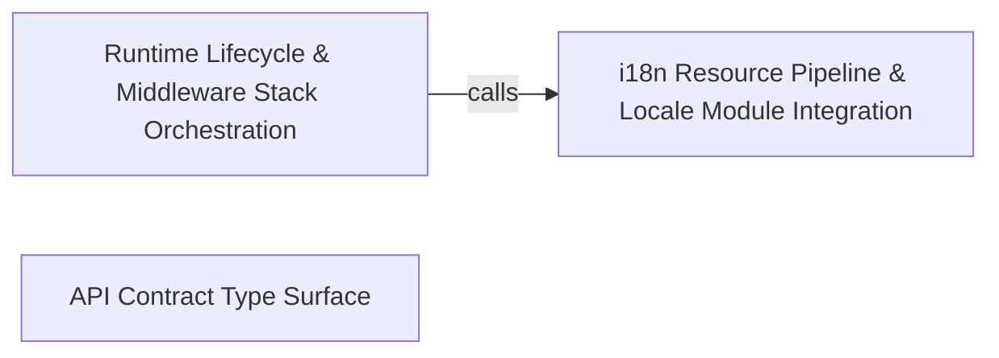

---
tags:
  - 2repo
  - 2repo/arch
  - project/boilerplate-node-backend
type: architecture
component: Application_Entry_Point_Boot_Orchestration
---

## Details

The process entry point that owns the boot/shutdown sequence and the Express middleware installation order. startServer runs the ordered promise chain (env validation → DB → cache → queue → workers → i18n → listen), stopServer performs idempotent graceful shutdown, and the module-scope calls (registerModules, installSecurity, installRequestContext, installTelemetry, installStatic, installDemo, installRoutes, installErrorHandling) define the request-path middleware stack. Also carries the boot-time callbacks (then/catch) and the script-level orchestration steps that drive regeneration and mutation baselines.

### i18n Resource Pipeline & Locale Module Integration
This sub-component is the i18n resource pipeline that the boot sequence drives. At boot, startServer calls registerLocaleDirectories (handing in each module's locale directory), then i18next.init with the merged resource set from loadLocaleResources, then refreshLocaleOverrides to layer runtime edits on top of the static files, and finally startLocaleOverrideRefresh to keep the overlay current. The catalog module (listSupportedLocales, loadLocaleResources) is the read-side: it discovers every dictionary under src/locales and the per-module locale directories, producing the supported-language list and the merged resource bundle. The overrides module (refreshLocaleOverrides) is the write-side: it reads runtime locale overrides from the database and applies them as a live overlay, with a periodic refresh loop. The locales domain module exposes CRUD controllers and registers a locale-override provider callback into the kernel registry. The tenants helper (isKnownTenant) gates multi-tenant locale resolution. Delivery controllers appear here because they consume the negotiated locale from the request context to localise their responses.

**Related Classes/Methods**:

- `src.infrastructure.i18n.catalog.loadLocaleResources`:153-159
- `src.infrastructure.i18n.overrides.refreshLocaleOverrides`:105-118
- `src.modules.locales.tenants.isKnownTenant`
- `src.modules.delivery.controllers.get-shipment-by-order.getShipmentByOrder`:11-18

**Source Files:**

- `src/infrastructure/i18n/catalog.ts`
  - `src.infrastructure.i18n.catalog.listSupportedLocales` (L42-L59) - Class
  - `src.infrastructure.i18n.catalog.listSupportedLocales.declared` (L45-L47) - Class
  - `src.infrastructure.i18n.catalog.listSupportedLocales.declared.map() callback` (L46-L46) - Function
  - `src.infrastructure.i18n.catalog.listSupportedLocales.filter() callback` (L54-L54) - Function
  - `src.infrastructure.i18n.catalog.listSupportedLocales.map() callback` (L55-L55) - Function
  - `src.infrastructure.i18n.catalog.loadLocaleResources` (L153-L159) - Class
  - `src.infrastructure.i18n.catalog.loadLocaleResources.map() callback` (L155-L158) - Function
- `src/infrastructure/i18n/overrides.ts`
  - `src.infrastructure.i18n.overrides.refreshLocaleOverrides` (L105-L118) - Class
  - `src.infrastructure.i18n.overrides.refreshLocaleOverrides.then() callback` (L109-L109) - Function
  - `src.infrastructure.i18n.overrides.refreshLocaleOverrides.catch() callback` (L110-L117) - Function
- `src/modules/delivery/controllers/get-shipment-by-order.ts`
  - `src.modules.delivery.controllers.get-shipment-by-order.getShipmentByOrder` (L11-L18) - Class
  - `src.modules.delivery.controllers.get-shipment-by-order.getShipmentByOrder.then() callback` (L14-L17) - Function
- `src/modules/delivery/controllers/post-courier-advance.ts`
  - `src.modules.delivery.controllers.post-courier-advance.postCourierAdvance` (L14-L27) - Class
  - `src.modules.delivery.controllers.post-courier-advance.postCourierAdvance.then() callback` (L17-L26) - Function
- `src/modules/locales/controllers/delete-locale-entry.ts`
  - `src.modules.locales.controllers.delete-locale-entry.deleteLocaleEntry` (L22-L48) - Class
  - `src.modules.locales.controllers.delete-locale-entry.deleteLocaleEntry.then() callback` (L28-L47) - Function
- `src/modules/locales/controllers/delete-locale.ts`
  - `src.modules.locales.controllers.delete-locale.deleteLocale` (L22-L45) - Class
  - `src.modules.locales.controllers.delete-locale.deleteLocale.then() callback` (L25-L44) - Function
- `src/modules/locales/controllers/get-locale-entries.ts`
  - `src.modules.locales.controllers.get-locale-entries.getLocaleEntries` (L22-L55) - Class
  - `src.modules.locales.controllers.get-locale-entries.getLocaleEntries.then() callback` (L49-L52) - Function
- `src/modules/locales/controllers/get-locale-messages.ts`
  - `src.modules.locales.controllers.get-locale-messages.getLocaleMessages` (L24-L36) - Class
  - `src.modules.locales.controllers.get-locale-messages.getLocaleMessages.then() callback` (L31-L34) - Function
- `src/modules/locales/controllers/get-locales.ts`
  - `src.modules.locales.controllers.get-locales.getLocales` (L24-L30) - Class
  - `src.modules.locales.controllers.get-locales.getLocales.then() callback` (L29-L29) - Function
- `src/modules/locales/controllers/write-locale-entries.ts`
  - `src.modules.locales.controllers.write-locale-entries.createLocaleEntry` (L59-L90) - Class
  - `src.modules.locales.controllers.write-locale-entries.createLocaleEntry.then() callback` (L68-L88) - Function
  - `src.modules.locales.controllers.write-locale-entries.updateLocaleEntry` (L99-L129) - Class
  - `src.modules.locales.controllers.write-locale-entries.updateLocaleEntry.then() callback` (L108-L127) - Function
  - `src.modules.locales.controllers.write-locale-entries.importEntries` (L132-L162) - Class
  - `src.modules.locales.controllers.write-locale-entries.importEntries.then() callback` (L141-L161) - Function
  - `src.modules.locales.controllers.write-locale-entries.importEntries.catch() callback` (L162-L162) - Function
- `src/modules/locales/controllers/write-locales.ts`
  - `src.modules.locales.controllers.write-locales.createLocale` (L41-L69) - Class
  - `src.modules.locales.controllers.write-locales.createLocale.then() callback` (L53-L67) - Function
  - `src.modules.locales.controllers.write-locales.updateLocale` (L78-L109) - Class
  - `src.modules.locales.controllers.write-locales.updateLocale.then() callback` (L90-L107) - Function
- `src/modules/locales/module.ts`
  - `src.modules.locales.module.registerLocaleOverrideProvider() callback` (L70-L70) - Function
- `src/modules/locales/tenants.ts`
  - `src.modules.locales.tenants.isKnownTenant` (L69-L69) - Class
  - `src.modules.locales.tenants.isKnownTenant.some() callback` (L69-L69) - Function
- `src/modules/payments/controllers/post-payment-confirm.ts`
  - `src.modules.payments.controllers.post-payment-confirm.postPaymentConfirm.then() callback.declined` (L31-L32) - Class
  - `src.modules.payments.controllers.post-payment-confirm.postPaymentConfirm.then() callback.declined.result.errors.some() callback` (L32-L32) - Function
- `src/modules/wishlist/controllers/delete-wishlist-item.ts`
  - `src.modules.wishlist.controllers.delete-wishlist-item.deleteWishlistItem` (L15-L40) - Class
  - `src.modules.wishlist.controllers.delete-wishlist-item.deleteWishlistItem.then() callback` (L28-L38) - Function
- `src/modules/wishlist/controllers/get-wishlist.ts`
  - `src.modules.wishlist.controllers.get-wishlist.getWishlist` (L12-L19) - Class
  - `src.modules.wishlist.controllers.get-wishlist.getWishlist.then() callback` (L15-L17) - Function
- `src/modules/wishlist/controllers/post-move-to-cart.ts`
  - `src.modules.wishlist.controllers.post-move-to-cart.postMoveToCart` (L16-L41) - Class
  - `src.modules.wishlist.controllers.post-move-to-cart.postMoveToCart.then() callback` (L29-L39) - Function
- `src/modules/wishlist/controllers/post-wishlist.ts`
  - `src.modules.wishlist.controllers.post-wishlist.postWishlist` (L17-L49) - Class
  - `src.modules.wishlist.controllers.post-wishlist.postWishlist.then() callback` (L37-L47) - Function

### Runtime Lifecycle & Middleware Stack Orchestration
This is the core of the subsystem. It contains the two lifecycle entry points (startServer, stopServer) that form the ordered promise chain for boot and the reverse-order teardown for shutdown. The module-scope calls in app.ts (registerModules, installSecurity, installRequestContext, installTelemetry, installStatic, installDemo, installRoutes, installErrorHandling) define the Express middleware stack in registration order. installRoutes walks the module registry to mount every domain router at its declared base path, then the system routes, then the 404 catch-all. server-lifecycle.ts provides the reusable closeServer, shutdownInfra, and registerSignalHandlers primitives that stopServer delegates to, enforcing a reverse-of-startup teardown order with a configurable grace-period deadline. The two script-level orchestrators (regenerate.ts with its Step chain, and check-mutation-baseline.ts with its ratchet comparison) are the build-time counterparts: they encode the only-order-that-works dependency chain for generated artifacts and the mutation-score gate, respectively.

**Related Classes/Methods**:

- `src.app.startServer`:59-117
- `src.app.stopServer`:122-131
- `src.app.routes.installRoutes`:26-48
- `src.infrastructure.runtime.server-lifecycle.shutdownInfra`:69-85

**Source Files:**

- `scripts/check-mutation-baseline.ts`
  - `scripts.check-mutation-baseline.counts.held.comparisons.filter() callback` (L40-L40) - Function
  - `scripts.check-mutation-baseline.counts.improved.comparisons.filter() callback` (L41-L41) - Function
  - `scripts.check-mutation-baseline.counts.regressed.comparisons.filter() callback` (L42-L42) - Function
  - `scripts.check-mutation-baseline.counts.added.comparisons.filter() callback` (L43-L43) - Function
  - `scripts.check-mutation-baseline.counts.removed.comparisons.filter() callback` (L44-L44) - Function
  - `scripts.check-mutation-baseline.map() callback` (L70-L70) - Function
  - `scripts.check-mutation-baseline.comparisons.filter() callback` (L94-L94) - Function
- `scripts/regenerate.ts`
  - `scripts.regenerate.Step` (L31-L36) - Interface
- `src/app.ts`
  - `src.app.startServer` (L59-L117) - Class
  - `src.app.then() callback` (L64-L64) - Function
  - `src.app.startServer.then() callback.enabledModules.map() callback` (L75-L75) - Function
  - `src.app.startServer.then() callback.filter() callback` (L76-L76) - Function
  - `src.app.startServer.then() callback` (L105-L114) - Function
  - `src.app.startServer.then() callback.<function>` (L106-L114) - Function
  - `src.app.startServer.then() callback.<function>.server` (L109-L113) - Class
  - `src.app.startServer.then() callback.<function>.server.app.listen() callback` (L109-L113) - Function
  - `src.app.stopServer` (L122-L131) - Class
  - `src.app.stopServer.finally() callback` (L125-L128) - Function
  - `src.app.catch() callback` (L171-L172) - Function
- `src/app/routes.ts`
  - `src.app.routes.installRoutes` (L26-L48) - Class
  - `src.app.routes.installRoutes.app.use() callback` (L45-L47) - Function
- `src/infrastructure/runtime/server-lifecycle.ts`
  - `src.infrastructure.runtime.server-lifecycle.closeServer` (L45-L54) - Class
  - `src.infrastructure.runtime.server-lifecycle.closeServer.<function>` (L46-L54) - Function
  - `src.infrastructure.runtime.server-lifecycle.closeServer.<function>.server.close() callback` (L47-L53) - Function
  - `src.infrastructure.runtime.server-lifecycle.shutdownInfra` (L69-L85) - Class
  - `src.infrastructure.runtime.server-lifecycle.shutdownInfra.then() callback` (L85-L85) - Function
  - `src.infrastructure.runtime.server-lifecycle.onProcessSignal.then() callback` (L114-L114) - Function

### API Contract Type Surface
This sub-component is the generated TypeScript type surface produced from the OpenAPI 3 contract. It contains 152 model files, each exporting a single typed interface (request bodies, response envelopes, domain entities, pagination wrappers) that the application imports at compile time. The boot sequence depends on this surface indirectly: registerValidationMessages (called in the boot chain after i18n) resolves its Zod schemas through @api/schemas.zod, which are generated from the same OpenAPI spec. The regenerate.ts script's gen:api step is the producer of this surface — it runs orval to emit the typed client and Zod schemas from openapi.yaml. The check-mutation-baseline.ts script gates the quality of the code that consumes these types. In the flow diagram, this group is the contract boundary: it is the shared type vocabulary between the HTTP layer (controllers, request validation), the domain layer (service return types), and the external consumer (frontend client generated from the same spec). It is not a runtime component — it is a compile-time surface that every other sub-component's code references.

**Related Classes/Methods**:

- `api.models.address.Address`:23-34
- `api.models.authTokens.AuthTokens`:22-29
- `api.models.auditLogsResponseEnvelope.AuditLogsResponseEnvelope`:26-31
- `api.models.addWishlistItemRequest.AddWishlistItemRequest`:23-25
- `api.models.accountDeleteConfirmRequest.AccountDeleteConfirmRequest`:22-25

**Source Files:**

- `api/models/accountDeleteConfirmRequest.ts`
  - `api.models.accountDeleteConfirmRequest.AccountDeleteConfirmRequest` (L22-L25) - Interface
- `api/models/addWishlistItemRequest.ts`
  - `api.models.addWishlistItemRequest.AddWishlistItemRequest` (L23-L25) - Interface
- `api/models/address.ts`
  - `api.models.address.Address` (L23-L34) - Interface
- `api/models/addressInput.ts`
  - `api.models.addressInput.AddressInput` (L22-L36) - Interface
- `api/models/addressesEnvelope.ts`
  - `api.models.addressesEnvelope.AddressesEnvelope` (L26-L31) - Interface
- `api/models/addressesResponse.ts`
  - `api.models.addressesResponse.AddressesResponse` (L23-L25) - Interface
- `api/models/adjustmentRequest.ts`
  - `api.models.adjustmentRequest.AdjustmentRequest` (L23-L29) - Interface
- `api/models/auditEventItem.ts`
  - `api.models.auditEventItem.AuditEventItem` (L26-L41) - Interface
- `api/models/auditLogsPage.ts`
  - `api.models.auditLogsPage.AuditLogsPage` (L24-L27) - Interface
- `api/models/auditLogsResponseEnvelope.ts`
  - `api.models.auditLogsResponseEnvelope.AuditLogsResponseEnvelope` (L26-L31) - Interface
- `api/models/authTokens.ts`
  - `api.models.authTokens.AuthTokens` (L22-L29) - Interface
- `api/models/authTokensEnvelope.ts`
  - `api.models.authTokensEnvelope.AuthTokensEnvelope` (L26-L31) - Interface
- `api/models/cancelOrderRequest.ts`
  - `api.models.cancelOrderRequest.CancelOrderRequest` (L25-L28) - Interface
- `api/models/cartResponse.ts`
  - `api.models.cartResponse.CartResponse` (L24-L27) - Interface
- `api/models/cartResponseEnvelope.ts`
  - `api.models.cartResponseEnvelope.CartResponseEnvelope` (L26-L31) - Interface
- `api/models/cartSummaryResponse.ts`
  - `api.models.cartSummaryResponse.CartSummaryResponse` (L22-L40) - Interface
- `api/models/cartSummaryResponseEnvelope.ts`
  - `api.models.cartSummaryResponseEnvelope.CartSummaryResponseEnvelope` (L26-L31) - Interface
- `api/models/catalogueFacetsEnvelope.ts`
  - `api.models.catalogueFacetsEnvelope.CatalogueFacetsEnvelope` (L26-L31) - Interface
- `api/models/catalogueFacetsResponse.ts`
  - `api.models.catalogueFacetsResponse.CatalogueFacetsResponse` (L23-L26) - Interface
- `api/models/changePasswordRequest.ts`
  - `api.models.changePasswordRequest.ChangePasswordRequest` (L23-L27) - Interface
- `api/models/checkoutRequest.ts`
  - `api.models.checkoutRequest.CheckoutRequest` (L24-L32) - Interface
- `api/models/checkoutResponse.ts`
  - `api.models.checkoutResponse.CheckoutResponse` (L23-L26) - Interface
- `api/models/checkoutResponseEnvelope.ts`
  - `api.models.checkoutResponseEnvelope.CheckoutResponseEnvelope` (L26-L31) - Interface
- `api/models/confirmPaymentRequest.ts`
  - `api.models.confirmPaymentRequest.ConfirmPaymentRequest` (L22-L30) - Interface
- `api/models/courierAdvanceResponse.ts`
  - `api.models.courierAdvanceResponse.CourierAdvanceResponse` (L22-L28) - Interface
- `api/models/courierAdvanceResponseEnvelope.ts`
  - `api.models.courierAdvanceResponseEnvelope.CourierAdvanceResponseEnvelope` (L26-L31) - Interface
- `api/models/createFeedbackRequest.ts`
  - `api.models.createFeedbackRequest.CreateFeedbackRequest` (L23-L28) - Interface
- `api/models/createLocaleEntryRequest.ts`
  - `api.models.createLocaleEntryRequest.CreateLocaleEntryRequest` (L23-L28) - Interface
- `api/models/createLocaleRequest.ts`
  - `api.models.createLocaleRequest.CreateLocaleRequest` (L24-L32) - Interface
- `api/models/createOrderRequest.ts`
  - `api.models.createOrderRequest.CreateOrderRequest` (L28-L33) - Interface
- `api/models/createPaymentIntentRequest.ts`
  - `api.models.createPaymentIntentRequest.CreatePaymentIntentRequest` (L23-L25) - Interface
- `api/models/createProductRequest.ts`
  - `api.models.createProductRequest.CreateProductRequest` (L23-L34) - Interface
- `api/models/createProductRequestMultipart.ts`
  - `api.models.createProductRequestMultipart.CreateProductRequestMultipart` (L22-L34) - Interface
- `api/models/createUserRequest.ts`
  - `api.models.createUserRequest.CreateUserRequest` (L26-L34) - Interface
- `api/models/createUserRequestMultipart.ts`
  - `api.models.createUserRequestMultipart.CreateUserRequestMultipart` (L25-L34) - Interface
- `api/models/deleteOrderRequest.ts`
  - `api.models.deleteOrderRequest.DeleteOrderRequest` (L23-L26) - Interface
- `api/models/deleteProductRequest.ts`
  - `api.models.deleteProductRequest.DeleteProductRequest` (L23-L26) - Interface
- `api/models/deleteUserRequest.ts`
  - `api.models.deleteUserRequest.DeleteUserRequest` (L23-L26) - Interface
- `api/models/errorItem.ts`
  - `api.models.errorItem.ErrorItem` (L23-L30) - Interface
- `api/models/errorResponse.ts`
  - `api.models.errorResponse.ErrorResponse` (L23-L33) - Interface
- `api/models/facetCount.ts`
  - `api.models.facetCount.FacetCount` (L22-L26) - Interface
- `api/models/feedbackRequest.ts`
  - `api.models.feedbackRequest.FeedbackRequest` (L25-L36) - Interface
- `api/models/feedbackRequestEnvelope.ts`
  - `api.models.feedbackRequestEnvelope.FeedbackRequestEnvelope` (L26-L31) - Interface
- `api/models/feedbackRequestsResponse.ts`
  - `api.models.feedbackRequestsResponse.FeedbackRequestsResponse` (L24-L27) - Interface
- `api/models/feedbackRequestsResponseEnvelope.ts`
  - `api.models.feedbackRequestsResponseEnvelope.FeedbackRequestsResponseEnvelope` (L26-L31) - Interface
- `api/models/hardDeleteRequest.ts`
  - `api.models.hardDeleteRequest.HardDeleteRequest` (L22-L24) - Interface
- `api/models/healthPing.ts`
  - `api.models.healthPing.HealthPing` (L23-L26) - Interface
- `api/models/healthPingEnvelope.ts`
  - `api.models.healthPingEnvelope.HealthPingEnvelope` (L26-L31) - Interface
- `api/models/inventoryLevel.ts`
  - `api.models.inventoryLevel.InventoryLevel` (L23-L33) - Interface
- `api/models/inventoryLevelEnvelope.ts`
  - `api.models.inventoryLevelEnvelope.InventoryLevelEnvelope` (L26-L31) - Interface
- `api/models/inventoryLevelsResponse.ts`
  - `api.models.inventoryLevelsResponse.InventoryLevelsResponse` (L24-L27) - Interface
- `api/models/inventoryLevelsResponseEnvelope.ts`
  - `api.models.inventoryLevelsResponseEnvelope.InventoryLevelsResponseEnvelope` (L26-L31) - Interface
- `api/models/language.ts`
  - `api.models.language.Language` (L28-L47) - Interface
- `api/models/languageEnvelope.ts`
  - `api.models.languageEnvelope.LanguageEnvelope` (L26-L31) - Interface
- `api/models/localeCapabilities.ts`
  - `api.models.localeCapabilities.LocaleCapabilities` (L27-L32) - Interface
- `api/models/localeCapabilitiesEnvelope.ts`
  - `api.models.localeCapabilitiesEnvelope.LocaleCapabilitiesEnvelope` (L26-L31) - Interface
- `api/models/localeCapability.ts`
  - `api.models.localeCapability.LocaleCapability` (L29-L45) - Interface
- `api/models/localeDictionary.ts`
  - `api.models.localeDictionary.LocaleDictionary` (L27-L31) - Interface
- `api/models/localeDictionaryEnvelope.ts`
  - `api.models.localeDictionaryEnvelope.LocaleDictionaryEnvelope` (L26-L31) - Interface
- `api/models/localeEntriesResponse.ts`
  - `api.models.localeEntriesResponse.LocaleEntriesResponse` (L24-L27) - Interface
- `api/models/localeEntriesResponseEnvelope.ts`
  - `api.models.localeEntriesResponseEnvelope.LocaleEntriesResponseEnvelope` (L26-L31) - Interface
- `api/models/localeEntry.ts`
  - `api.models.localeEntry.LocaleEntry` (L29-L38) - Interface
- `api/models/localeEntryEnvelope.ts`
  - `api.models.localeEntryEnvelope.LocaleEntryEnvelope` (L26-L31) - Interface
- `api/models/localeEntryInput.ts`
  - `api.models.localeEntryInput.LocaleEntryInput` (L27-L31) - Interface
- `api/models/localeImportResult.ts`
  - `api.models.localeImportResult.LocaleImportResult` (L25-L34) - Interface
- `api/models/localeImportResultEnvelope.ts`
  - `api.models.localeImportResultEnvelope.LocaleImportResultEnvelope` (L26-L31) - Interface
- `api/models/localeMessages.ts`
  - `api.models.localeMessages.LocaleMessages` (L27-L33) - Interface
- `api/models/localeMessagesEnvelope.ts`
  - `api.models.localeMessagesEnvelope.LocaleMessagesEnvelope` (L26-L31) - Interface
- `api/models/localeTenantDescriptor.ts`
  - `api.models.localeTenantDescriptor.LocaleTenantDescriptor` (L27-L32) - Interface
- `api/models/localeTenants.ts`
  - `api.models.localeTenants.LocaleTenants` (L23-L26) - Interface
- `api/models/localeTenantsEnvelope.ts`
  - `api.models.localeTenantsEnvelope.LocaleTenantsEnvelope` (L26-L31) - Interface
- `api/models/loginRequest.ts`
  - `api.models.loginRequest.LoginRequest` (L25-L30) - Interface
- `api/models/mergeLocaleEntriesRequest.ts`
  - `api.models.mergeLocaleEntriesRequest.MergeLocaleEntriesRequest` (L27-L31) - Interface
- `api/models/messageResponse.ts`
  - `api.models.messageResponse.MessageResponse` (L25-L29) - Interface
- `api/models/observabilityDependency.ts`
  - `api.models.observabilityDependency.ObservabilityDependency` (L23-L25) - Interface
- `api/models/observabilityHealth.ts`
  - `api.models.observabilityHealth.ObservabilityHealth` (L27-L44) - Interface
- `api/models/observabilityHealthDependencies.ts`
  - `api.models.observabilityHealthDependencies.ObservabilityHealthDependencies` (L26-L30) - Interface
- `api/models/observabilityHealthResponseEnvelope.ts`
  - `api.models.observabilityHealthResponseEnvelope.ObservabilityHealthResponseEnvelope` (L26-L31) - Interface
- `api/models/observabilityHealthSystem.ts`
  - `api.models.observabilityHealthSystem.ObservabilityHealthSystem` (L22-L26) - Interface
- `api/models/observabilityHealthTelemetry.ts`
  - `api.models.observabilityHealthTelemetry.ObservabilityHealthTelemetry` (L27-L33) - Interface
- `api/models/observabilityMetricsLatency.ts`
  - `api.models.observabilityMetricsLatency.ObservabilityMetricsLatency` (L22-L27) - Interface
- `api/models/observabilityMetricsSummary.ts`
  - `api.models.observabilityMetricsSummary.ObservabilityMetricsSummary` (L27-L34) - Interface
- `api/models/observabilityMetricsSummaryResponseEnvelope.ts`
  - `api.models.observabilityMetricsSummaryResponseEnvelope.ObservabilityMetricsSummaryResponseEnvelope` (L26-L31) - Interface
- `api/models/order.ts`
  - `api.models.order.Order` (L28-L63) - Interface
- `api/models/orderActions.ts`
  - `api.models.orderActions.OrderActions` (L26-L33) - Interface
- `api/models/orderAddress.ts`
  - `api.models.orderAddress.OrderAddress` (L22-L29) - Interface
- `api/models/orderEnvelope.ts`
  - `api.models.orderEnvelope.OrderEnvelope` (L26-L31) - Interface
- `api/models/orderItem.ts`
  - `api.models.orderItem.OrderItem` (L23-L27) - Interface
- `api/models/ordersResponse.ts`
  - `api.models.ordersResponse.OrdersResponse` (L24-L27) - Interface
- `api/models/ordersResponseEnvelope.ts`
  - `api.models.ordersResponseEnvelope.OrdersResponseEnvelope` (L26-L31) - Interface
- `api/models/paginationMeta.ts`
  - `api.models.paginationMeta.PaginationMeta` (L24-L31) - Interface
- `api/models/passwordResetConfirmRequest.ts`
  - `api.models.passwordResetConfirmRequest.PasswordResetConfirmRequest` (L23-L28) - Interface
- `api/models/passwordResetRequest.ts`
  - `api.models.passwordResetRequest.PasswordResetRequest` (L23-L25) - Interface
- `api/models/payment.ts`
  - `api.models.payment.Payment` (L25-L45) - Interface
- `api/models/paymentActions.ts`
  - `api.models.paymentActions.PaymentActions` (L25-L30) - Interface
- `api/models/paymentEnvelope.ts`
  - `api.models.paymentEnvelope.PaymentEnvelope` (L26-L31) - Interface
- `api/models/processMemory.ts`
  - `api.models.processMemory.ProcessMemory` (L26-L35) - Interface
- `api/models/product.ts`
  - `api.models.product.Product` (L24-L52) - Interface
- `api/models/productEnvelope.ts`
  - `api.models.productEnvelope.ProductEnvelope` (L26-L31) - Interface
- `api/models/productsResponse.ts`
  - `api.models.productsResponse.ProductsResponse` (L24-L27) - Interface
- `api/models/productsResponseEnvelope.ts`
  - `api.models.productsResponseEnvelope.ProductsResponseEnvelope` (L26-L31) - Interface
- `api/models/receiptRequest.ts`
  - `api.models.receiptRequest.ReceiptRequest` (L23-L32) - Interface
- `api/models/refreshTokenEnvelope.ts`
  - `api.models.refreshTokenEnvelope.RefreshTokenEnvelope` (L26-L31) - Interface
- `api/models/refreshTokenResponse.ts`
  - `api.models.refreshTokenResponse.RefreshTokenResponse` (L22-L29) - Interface
- `api/models/removeCartItemRequest.ts`
  - `api.models.removeCartItemRequest.RemoveCartItemRequest` (L23-L25) - Interface
- `api/models/replaceLocaleEntriesRequest.ts`
  - `api.models.replaceLocaleEntriesRequest.ReplaceLocaleEntriesRequest` (L28-L31) - Interface
- `api/models/reservationSweepEnvelope.ts`
  - `api.models.reservationSweepEnvelope.ReservationSweepEnvelope` (L26-L31) - Interface
- `api/models/reservationSweepResponse.ts`
  - `api.models.reservationSweepResponse.ReservationSweepResponse` (L22-L28) - Interface
- `api/models/searchFeedbackRequestsRequest.ts`
  - `api.models.searchFeedbackRequestsRequest.SearchFeedbackRequestsRequest` (L27-L33) - Interface
- `api/models/searchOrdersRequest.ts`
  - `api.models.searchOrdersRequest.SearchOrdersRequest` (L27-L36) - Interface
- `api/models/searchProductsRequest.ts`
  - `api.models.searchProductsRequest.SearchProductsRequest` (L26-L39) - Interface
- `api/models/searchUsersRequest.ts`
  - `api.models.searchUsersRequest.SearchUsersRequest` (L27-L37) - Interface
- `api/models/session.ts`
  - `api.models.session.Session` (L23-L31) - Interface
- `api/models/sessionsEnvelope.ts`
  - `api.models.sessionsEnvelope.SessionsEnvelope` (L26-L31) - Interface
- `api/models/sessionsResponse.ts`
  - `api.models.sessionsResponse.SessionsResponse` (L23-L25) - Interface
- `api/models/shipment.ts`
  - `api.models.shipment.Shipment` (L24-L34) - Interface
- `api/models/shipmentEnvelope.ts`
  - `api.models.shipmentEnvelope.ShipmentEnvelope` (L26-L31) - Interface
- `api/models/shippingMethod.ts`
  - `api.models.shippingMethod.ShippingMethod` (L22-L35) - Interface
- `api/models/shippingMethodsResponse.ts`
  - `api.models.shippingMethodsResponse.ShippingMethodsResponse` (L23-L25) - Interface
- `api/models/shippingMethodsResponseEnvelope.ts`
  - `api.models.shippingMethodsResponseEnvelope.ShippingMethodsResponseEnvelope` (L26-L31) - Interface
- `api/models/signupRequest.ts`
  - `api.models.signupRequest.SignupRequest` (L25-L32) - Interface
- `api/models/signupRequestMultipart.ts`
  - `api.models.signupRequestMultipart.SignupRequestMultipart` (L24-L32) - Interface
- `api/models/stockMovement.ts`
  - `api.models.stockMovement.StockMovement` (L24-L36) - Interface
- `api/models/stockMovementsResponse.ts`
  - `api.models.stockMovementsResponse.StockMovementsResponse` (L24-L27) - Interface
- `api/models/stockMovementsResponseEnvelope.ts`
  - `api.models.stockMovementsResponseEnvelope.StockMovementsResponseEnvelope` (L26-L31) - Interface
- `api/models/updateAccountRequest.ts`
  - `api.models.updateAccountRequest.UpdateAccountRequest` (L25-L31) - Interface
- `api/models/updateAccountRequestMultipart.ts`
  - `api.models.updateAccountRequestMultipart.UpdateAccountRequestMultipart` (L24-L31) - Interface
- `api/models/updateAddressRequest.ts`
  - `api.models.updateAddressRequest.UpdateAddressRequest` (L22-L36) - Interface
- `api/models/updateCartItemByIdRequest.ts`
  - `api.models.updateCartItemByIdRequest.UpdateCartItemByIdRequest` (L23-L27) - Interface
- `api/models/updateFeedbackRequestStatusRequest.ts`
  - `api.models.updateFeedbackRequestStatusRequest.UpdateFeedbackRequestStatusRequest` (L23-L26) - Interface
- `api/models/updateLocaleEntryRequest.ts`
  - `api.models.updateLocaleEntryRequest.UpdateLocaleEntryRequest` (L22-L24) - Interface
- `api/models/updateLocaleRequest.ts`
  - `api.models.updateLocaleRequest.UpdateLocaleRequest` (L26-L33) - Interface
- `api/models/updateOrderByIdRequest.ts`
  - `api.models.updateOrderByIdRequest.UpdateOrderByIdRequest` (L26-L33) - Interface
- `api/models/updateOrderRequest.ts`
  - `api.models.updateOrderRequest.UpdateOrderRequest` (L26-L34) - Interface
- `api/models/updateProductByIdRequest.ts`
  - `api.models.updateProductByIdRequest.UpdateProductByIdRequest` (L23-L32) - Interface
- `api/models/updateProductByIdRequestMultipart.ts`
  - `api.models.updateProductByIdRequestMultipart.UpdateProductByIdRequestMultipart` (L22-L32) - Interface
- `api/models/updateProductRequest.ts`
  - `api.models.updateProductRequest.UpdateProductRequest` (L24-L34) - Interface
- `api/models/updateProductRequestMultipart.ts`
  - `api.models.updateProductRequestMultipart.UpdateProductRequestMultipart` (L23-L34) - Interface
- `api/models/updateUserByIdRequest.ts`
  - `api.models.updateUserByIdRequest.UpdateUserByIdRequest` (L25-L32) - Interface
- `api/models/updateUserByIdRequestMultipart.ts`
  - `api.models.updateUserByIdRequestMultipart.UpdateUserByIdRequestMultipart` (L24-L32) - Interface
- `api/models/updateUserRequest.ts`
  - `api.models.updateUserRequest.UpdateUserRequest` (L27-L36) - Interface
- `api/models/updateUserRequestMultipart.ts`
  - `api.models.updateUserRequestMultipart.UpdateUserRequestMultipart` (L26-L36) - Interface
- `api/models/upsertCartItemRequest.ts`
  - `api.models.upsertCartItemRequest.UpsertCartItemRequest` (L23-L27) - Interface
- `api/models/user.ts`
  - `api.models.user.User` (L26-L38) - Interface
- `api/models/userEnvelope.ts`
  - `api.models.userEnvelope.UserEnvelope` (L26-L31) - Interface
- `api/models/usersResponse.ts`
  - `api.models.usersResponse.UsersResponse` (L24-L27) - Interface
- `api/models/usersResponseEnvelope.ts`
  - `api.models.usersResponseEnvelope.UsersResponseEnvelope` (L26-L31) - Interface
- `api/models/validationErrorResponse.ts`
  - `api.models.validationErrorResponse.ValidationErrorResponse` (L23-L33) - Interface
- `api/models/verifyEmailConfirmRequest.ts`
  - `api.models.verifyEmailConfirmRequest.VerifyEmailConfirmRequest` (L22-L25) - Interface
- `api/models/wishlistItem.ts`
  - `api.models.wishlistItem.WishlistItem` (L23-L25) - Interface
- `api/models/wishlistResponse.ts`
  - `api.models.wishlistResponse.WishlistResponse` (L23-L25) - Interface
- `api/models/wishlistResponseEnvelope.ts`
  - `api.models.wishlistResponseEnvelope.WishlistResponseEnvelope` (L26-L31) - Interface
