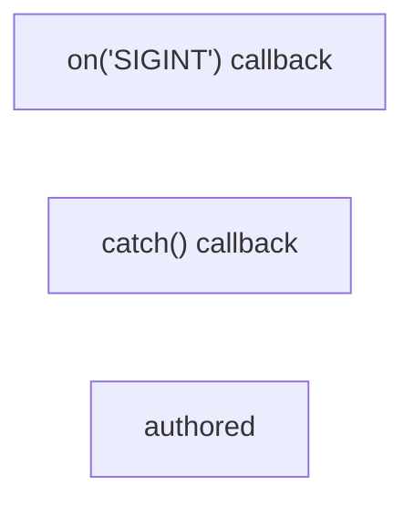

---
tags:
  - 2repo
  - 2repo/arch
  - project/boilerplate-node-backend
type: architecture
component: Contract_Assembly_Spec_Tooling
---

## Details

The contract-assembly and spec tooling that authors, bundles, and staleness-checks the OpenAPI/AsyncAPI contract fragments, groups channels by namespace, and keeps the frontend and spec identity in sync.

### on('SIGINT') callback [[Expand]](./on_SIGINT_callback.md)
40 leaf clusters, 73 symbols across 19 files. Files: cluster.ts, request.ts, response.ts, uploads.ts, validation-messages.ts, index.ts, authentication.ts, delete-account-confirm.ts, ... Key symbols: src.cluster.process.on('SIGINT') callback, src.cluster.process.on('SIGTERM') callback, src.cluster.scheduleRespawn.timer, src.kernel.authentication.AuthResolver, src.kernel.authentication.AuthenticatedUser, src.cluster.scheduleRespawn.timer.setTimeout() callback, src.infrastructure.http.response.ResponseErrorItem, src.infrastructure.http.response.ResponseNeutral, src.infrastructure.http.response.ResponseReject, src.infrastructure.http.response.ResponseSuccess, src.infrastructure.http.response.normalizeErrors, src.infrastructure.http.validation-messages.registerValidationMessages, ...

**Related Classes/Methods**: _None_

**Source Files:**

- `src/cluster.ts`
  - `src.cluster.scheduleRespawn.timer` (L74-L77) - Class
  - `src.cluster.scheduleRespawn.timer.setTimeout() callback` (L74-L77) - Function
  - `src.cluster.process.on('SIGTERM') callback` (L158-L158) - Function
  - `src.cluster.process.on('SIGINT') callback` (L159-L159) - Function
- `src/infrastructure/http/controller.ts`
  - `src.infrastructure.http.controller.ServiceResult` (L33-L39) - Interface
- `src/infrastructure/http/delete-controller.ts`
  - `src.infrastructure.http.delete-controller.RemoveResult` (L36-L41) - Interface
- `src/infrastructure/http/request.ts`
  - `src.infrastructure.http.request.RequestInputDeclaration` (L152-L176) - Interface
  - `src.infrastructure.http.request.readInput.sources.map() callback` (L247-L248) - Function
  - `src.infrastructure.http.request.readInput.sources` (L247-L249) - Class
  - `src.infrastructure.http.request.readInput.stated` (L279-L281) - Class
  - `src.infrastructure.http.request.readInput.stated.sources.map() callback` (L280-L280) - Function
  - `src.infrastructure.http.request.readInput.stated.filter() callback` (L281-L281) - Function
  - `src.infrastructure.http.request.readInput.undecoded` (L285-L285) - Class
  - `src.infrastructure.http.request.readInput.undecoded.stated.find() callback` (L285-L285) - Function
- `src/infrastructure/http/response.ts`
  - `src.infrastructure.http.response.ResponseNeutral` (L12-L19) - Interface
  - `src.infrastructure.http.response.ResponseSuccess` (L21-L31) - Interface
  - `src.infrastructure.http.response.ResponseErrorItem` (L34-L41) - Interface
  - `src.infrastructure.http.response.ResponseReject` (L43-L50) - Interface
  - `src.infrastructure.http.response.normalizeErrors` (L145-L172) - Class
  - `src.infrastructure.http.response.normalizeErrors.inputErrors.map() callback` (L154-L171) - Function
- `src/infrastructure/http/uploads.ts`
  - `src.infrastructure.http.uploads.getFormFiles.paths` (L47-L49) - Class
  - `src.infrastructure.http.uploads.getFormFiles.paths.request.files.map() callback` (L48-L48) - Function
  - `src.infrastructure.http.uploads.getFormFiles.paths.flatMap() callback` (L49-L49) - Function
  - `src.infrastructure.http.uploads.getFormFiles.paths.flatMap() callback.files.map() callback` (L49-L49) - Function
- `src/infrastructure/http/validation-messages.ts`
  - `src.infrastructure.http.validation-messages.registerValidationMessages` (L102-L104) - Class
  - `src.infrastructure.http.validation-messages.registerValidationMessages.customError` (L103-L103) - Method
- `src/infrastructure/observability/analytics/index.ts`
  - `src.infrastructure.observability.analytics.index.AnalyticsEventMap` (L35-L35) - Interface
  - `src.infrastructure.observability.analytics.index.AnalyticsEvent` (L57-L78) - Interface
- `src/infrastructure/observability/audit.ts`
  - `src.infrastructure.observability.audit.AuditActionMap` (L44-L44) - Interface
- `src/kernel/authentication.ts`
  - `src.kernel.authentication.AuthenticatedUser` (L15-L21) - Interface
  - `src.kernel.authentication.AuthResolver` (L24-L27) - Interface
- `src/modules/account/controllers/delete-account-confirm.ts`
  - `src.modules.account.controllers.delete-account-confirm.deleteAccountConfirm.then() callback.tokenEntry` (L37-L37) - Class
  - `src.modules.account.controllers.delete-account-confirm.deleteAccountConfirm.then() callback.tokenEntry.user.tokens.find() callback` (L37-L37) - Function
- `src/modules/account/controllers/get-refresh-token.ts`
  - `src.modules.account.controllers.get-refresh-token.then() callback.then() callback` (L54-L54) - Function
- `src/modules/account/controllers/get-sessions.ts`
  - `src.modules.account.controllers.get-sessions.then() callback.sessions` (L50-L52) - Class
- `src/modules/account/controllers/post-login.ts`
  - `src.modules.account.controllers.post-login.then() callback` (L98-L98) - Function
  - `src.modules.account.controllers.post-login.then() callback.then() callback` (L119-L127) - Function
- `src/modules/account/controllers/post-reset-confirm.ts`
  - `src.modules.account.controllers.post-reset-confirm.postResetConfirm.then() callback.tokenEntry` (L41-L43) - Class
  - `src.modules.account.controllers.post-reset-confirm.postResetConfirm.then() callback.tokenEntry.user.tokens.find() callback` (L42-L42) - Function
- `src/modules/account/controllers/post-verify-confirm.ts`
  - `src.modules.account.controllers.post-verify-confirm.postVerifyConfirm.then() callback.tokenEntry` (L46-L48) - Class
  - `src.modules.account.controllers.post-verify-confirm.postVerifyConfirm.then() callback.tokenEntry.user.tokens.find() callback` (L47-L47) - Function
- `src/modules/account/repository.ts`
  - `src.modules.account.repository.addressBookRepository.removeEntry.entry` (L102-L102) - Class
  - `src.modules.account.repository.addressBookRepository.removeEntry.entry.book.items.find() callback` (L102-L102) - Function
- `src/modules/account/services/authentication.ts`
  - `src.modules.account.services.authentication.signup.<function>` (L84-L98) - Function
  - `src.modules.account.services.authentication.signup.<function>.then() callback` (L97-L97) - Function
  - `src.modules.account.services.authentication.tokenRemoveAll` (L137-L161) - Class
  - `src.modules.account.services.authentication.tokenRemoveAll.then() callback` (L145-L159) - Function
  - `src.modules.account.services.authentication.tokenRemoveAll.then() callback.then() callback` (L158-L158) - Function
  - `src.modules.account.services.authentication.tokenRemoveAll.catch() callback` (L161-L161) - Function
- `src/modules/account/services/profile.ts`
  - `src.modules.account.services.profile.passwordChangeWithCurrent.<function>` (L172-L180) - Function
  - `src.modules.account.services.profile.passwordChangeWithCurrent.<function>.then() callback` (L175-L179) - Function
- `src/modules/account/services/verification.ts`
  - `src.modules.account.services.verification.then() callback` (L43-L43) - Function
- `src/modules/locales/tenants.ts`
  - `src.modules.locales.tenants.map() callback` (L41-L41) - Function
- `src/modules/orders/controllers/get-order-invoice.ts`
  - `src.modules.orders.controllers.get-order-invoice.then() callback.then() callback` (L60-L60) - Function
- `src/modules/orders/controllers/write-orders.ts`
  - `src.modules.orders.controllers.write-orders.then() callback` (L61-L99) - Function
- `src/modules/products/controllers/get-products.ts`
  - `src.modules.products.controllers.get-products.searchProductsQuerySchema.minPrice.z.preprocess() callback` (L36-L36) - Function
  - `src.modules.products.controllers.get-products.searchProductsQuerySchema.maxPrice.z.preprocess() callback` (L40-L40) - Function
  - `src.modules.products.controllers.get-products.searchProductsQuerySchema.active.z.preprocess() callback` (L45-L45) - Function
- `src/modules/products/controllers/write-products.ts`
  - `src.modules.products.controllers.write-products.catch() callback` (L84-L84) - Function
  - `src.modules.products.controllers.write-products.catch() callback.then() callback` (L139-L141) - Function
- `src/modules/products/demo.ts`
  - `src.modules.products.demo.seedProductById.product` (L148-L148) - Class
  - `src.modules.products.demo.seedProductById.product.productFixtures.find() callback` (L148-L148) - Function
  - `src.modules.products.demo.seedProductsCollection` (L155-L156) - Class
  - `src.modules.products.demo.seedProductsCollection.productFixtures.map() callback` (L156-L156) - Function
- `src/modules/products/model.ts`
  - `src.modules.products.model.ProductSnapshot` (L28-L37) - Interface
  - `src.modules.products.model.ProductDocument` (L42-L42) - Interface
- `src/modules/users/controllers/write-users.ts`
  - `src.modules.users.controllers.write-users.catch() callback` (L77-L77) - Function
  - `src.modules.users.controllers.write-users.catch() callback.then() callback` (L117-L119) - Function
- `src/modules/users/demo.ts`
  - `src.modules.users.demo.seedUsersCollection` (L56-L57) - Class
  - `src.modules.users.demo.seedUsersCollection.userFixtures.map() callback` (L57-L57) - Function
- `src/modules/users/model.ts`
  - `src.modules.users.model.TokenType` (L20-L23) - Enum
  - `src.modules.users.model.Token` (L29-L50) - Interface
  - `src.modules.users.model.UserRecord` (L61-L86) - Interface
  - `src.modules.users.model.UserDocument` (L91-L94) - Interface
  - `src.modules.users.model.UserMethods` (L99-L106) - Interface
  - `src.modules.users.model.email.error` (L139-L139) - Method
  - `src.modules.users.model.zodUserSchema.email.error` (L140-L140) - Method
  - `src.modules.users.model.username.error` (L144-L144) - Method
  - `src.modules.users.model.zodUserSchema.username.error` (L145-L145) - Method
  - `src.modules.users.model.password.error` (L149-L149) - Method
  - `src.modules.users.model.zodUserSchema.password.error` (L150-L150) - Method
  - `src.modules.users.model.userSchema.pre('save') callback` (L307-L313) - Function
  - `src.modules.users.model.userSchema.pre('save') callback.then() callback` (L310-L312) - Function
  - `src.modules.users.model.tokenAdd` (L349-L369) - Function
  - `src.modules.users.model.tokenAdd.then() callback` (L362-L368) - Function
  - `src.modules.users.model.tokenRemoveAll` (L374-L384) - Function
  - `src.modules.users.model.tokenRemoveAll.then() callback` (L377-L383) - Function
  - `src.modules.users.model.tokenRemoveAll.then() callback.tokens.filter() callback` (L382-L382) - Function
  - `src.modules.users.model.userSchema.static('tokenRemoveExpired') callback` (L390-L407) - Function
  - `src.modules.users.model.userSchema.static('tokenRemoveExpired') callback.then() callback` (L399-L399) - Function
  - `src.modules.users.model.userSchema.static('tokenRemoveExpired') callback.catch() callback` (L400-L406) - Function
- `src/modules/users/repository.ts`
  - `src.modules.users.repository.userRepository` (L27-L168) - Class
  - `src.modules.users.repository.userRepository.updateMany` (L60-L61) - Method
  - `src.modules.users.repository.userRepository.findByIdWithCredentials` (L66-L67) - Method
  - `src.modules.users.repository.userRepository.findOneWithCredentials` (L72-L73) - Method
  - `src.modules.users.repository.userRepository.findByToken` (L93-L97) - Method
  - `src.modules.users.repository.userRepository.tokenRemove` (L113-L122) - Method
  - `src.modules.users.repository.userRepository.tokenRemoveByValue` (L138-L145) - Method
  - `src.modules.users.repository.userRepository.sessionRemove` (L160-L167) - Method
- `src/modules/users/service.ts`
  - `src.modules.users.service.getById` (L63-L66) - Class
  - `src.modules.users.service.getById.then() callback` (L65-L65) - Function
  - `src.modules.users.service.updateById` (L106-L116) - Class
  - `src.modules.users.service.consumeToken` (L206-L213) - Class
  - `src.modules.users.service.consumeToken.then() callback` (L207-L213) - Function
  - `src.modules.users.service.consumeToken.then() callback.user.tokens.filter() callback` (L208-L208) - Function

### catch() callback
19 leaf clusters, 54 symbols across 13 files. Files: controller-chain-must-catch.ts, no-hardcoded-user-text.ts, analytics-events.ts, index.ts, openapi.ts, demo.ts, gen-asyncapi-types.ts, heap-report.ts, ... Key symbols: scripts.demo.catch() callback, scripts.demo.then() callback, scripts.gen-asyncapi-types.AsyncApiChannel, scripts.gen-asyncapi-types.AsyncApiDocument, scripts.gen-asyncapi-types.AsyncApiMessage, scripts.gen-asyncapi-types.AsyncApiOperation, scripts.gen-asyncapi-types.JsonSchema, scripts.gen-asyncapi-types.catch() callback, scripts.gen-asyncapi-types.channelNamespaceBlocks, scripts.gen-asyncapi-types.then() callback, scripts.gen-asyncapi-types.toPascalCase, scripts.heap-report.main, ...

**Related Classes/Methods**: _None_

**Source Files:**

- `eslint/rules/no-hardcoded-user-text.ts`
  - `eslint.rules.no-hardcoded-user-text.noHardcodedUserText.create.CallExpression.errors` (L36-L38) - Class
  - `eslint.rules.no-hardcoded-user-text.noHardcodedUserText.create.CallExpression.errors.node.arguments.find() callback` (L37-L37) - Function
- `scripts/contracts/index.ts`
  - `scripts.contracts.index.findBundle` (L39-L40) - Class
  - `scripts.contracts.index.findBundle.CONTRACT_BUNDLES.find() callback` (L40-L40) - Function
- `scripts/demo.ts`
  - `scripts.demo.then() callback` (L59-L89) - Function
  - `scripts.demo.catch() callback` (L90-L93) - Function
- `scripts/gen-asyncapi-types.ts`
  - `scripts.gen-asyncapi-types.renderLiteralArray.lines` (L216-L216) - Class
  - `scripts.gen-asyncapi-types.renderLiteralArray.lines.values.map() callback` (L216-L216) - Function
- `scripts/heap-report.ts`
  - `scripts.heap-report.streamArray` (L50-L112) - Class
  - `scripts.heap-report.streamArray.<function>` (L51-L112) - Function
  - `scripts.heap-report.streamArray.<function>.stream.on('data') callback` (L61-L108) - Function
  - `scripts.heap-report.streamArray.<function>.stream.on('close') callback` (L111-L111) - Function
  - `scripts.heap-report.main` (L114-L194) - Class
  - `scripts.heap-report.main.streamArray('nodes') callback` (L131-L165) - Function
  - `scripts.heap-report.main.streamArray('strings') callback` (L174-L181) - Function
- `scripts/mutation-baseline.ts`
  - `scripts.mutation-baseline.formatRegressions.lines` (L184-L187) - Class
  - `scripts.mutation-baseline.formatRegressions.lines.regressed.map() callback` (L185-L186) - Function
- `scripts/prism-smoke.ts`
  - `scripts.prism-smoke.prism.on('error') callback` (L47-L48) - Function
  - `scripts.prism-smoke.prism.on('exit') callback` (L50-L52) - Function
- `scripts/spec-identity.ts`
  - `scripts.spec-identity.SharedFile` (L32-L35) - Interface
  - `scripts.spec-identity.SpecComparison` (L112-L122) - Interface
  - `scripts.spec-identity.sharedFileProblems` (L176-L177) - Class
  - `scripts.spec-identity.sharedFileProblems.comparisons.filter() callback` (L177-L177) - Function
- `scripts/test-report.ts`
  - `scripts.test-report.suite.assertionResults.filter() callback` (L139-L139) - Function

### authored
18 leaf clusters, 53 symbols across 14 files. Files: controller-chain-must-catch.ts, bundle-contracts.ts, check-environment-keys.ts, analytics-events.ts, generate-collections.ts, index.ts, openapi.ts, demo.ts, ... Key symbols: scripts.bundle-contracts.authored, scripts.bundle-contracts.named, scripts.bundle-contracts.unknown, scripts.check-environment-keys.sourceFiles, scripts.gen-asyncapi-types.AsyncApiChannel, scripts.gen-asyncapi-types.AsyncApiDocument, scripts.gen-asyncapi-types.AsyncApiMessage, scripts.gen-asyncapi-types.AsyncApiOperation, scripts.gen-asyncapi-types.JsonSchema, scripts.gen-asyncapi-types.catch() callback, scripts.gen-asyncapi-types.channelNamespaceBlocks, scripts.gen-asyncapi-types.then() callback, ...

**Related Classes/Methods**: _None_

**Source Files:**

- `eslint/rules/controller-chain-must-catch.ts`
  - `eslint.rules.controller-chain-must-catch.controllerChainMustCatch` (L83-L111) - Class
  - `eslint.rules.controller-chain-must-catch.controllerChainMustCatch.create` (L94-L110) - Method
  - `eslint.rules.controller-chain-must-catch.controllerChainMustCatch.create.CallExpression` (L96-L108) - Method
- `scripts/bundle-contracts.ts`
  - `scripts.bundle-contracts.named` (L34-L34) - Class
  - `scripts.bundle-contracts.named.arguments_.filter() callback` (L34-L34) - Function
  - `scripts.bundle-contracts.unknown` (L36-L36) - Class
  - `scripts.bundle-contracts.unknown.named.filter() callback` (L36-L36) - Function
  - `scripts.bundle-contracts.authored` (L108-L108) - Class
  - `scripts.bundle-contracts.authored.CONTRACT_BUNDLES.filter() callback` (L108-L108) - Function
- `scripts/check-environment-keys.ts`
  - `scripts.check-environment-keys.sourceFiles` (L49-L54) - Class
  - `scripts.check-environment-keys.sourceFiles.flatMap() callback` (L50-L54) - Function
- `scripts/contracts/analytics-events.ts`
  - `scripts.contracts.analytics-events.content.slices` (L240-L244) - Class
  - `scripts.contracts.analytics-events.content.slices.map() callback` (L240-L244) - Function
- `scripts/contracts/generate-collections.ts`
  - `scripts.contracts.generate-collections.allProbes` (L260-L261) - Class
  - `scripts.contracts.generate-collections.allProbes.requests.filter() callback` (L261-L261) - Function
  - `scripts.contracts.generate-collections.contentFor` (L264-L269) - Class
  - `scripts.contracts.generate-collections.contentFor.<function>` (L264-L269) - Function
- `scripts/contracts/openapi.ts`
  - `scripts.contracts.openapi.rootPaths` (L85-L92) - Class
  - `scripts.contracts.openapi.rootPaths.filter() callback` (L90-L90) - Function
  - `scripts.contracts.openapi.rootPaths.map() callback` (L91-L91) - Function
  - `scripts.contracts.openapi.sectionPaths` (L95-L100) - Class
  - `scripts.contracts.openapi.sectionPaths.map() callback` (L99-L99) - Function
- `scripts/demo.ts`
  - `scripts.demo.then() callback.process.once() callback` (L65-L70) - Function
  - `scripts.demo.then() callback.process.once() callback.catch() callback` (L68-L68) - Function
  - `scripts.demo.then() callback.process.once() callback.then() callback` (L69-L69) - Function
  - `scripts.demo.then() callback.then() callback.waitForDatabase() callback` (L81-L81) - Function
  - `scripts.demo.then() callback.then() callback` (L84-L88) - Function
- `scripts/gen-asyncapi-types.ts`
  - `scripts.gen-asyncapi-types.AsyncApiOperation` (L27-L31) - Interface
  - `scripts.gen-asyncapi-types.AsyncApiChannel` (L33-L36) - Interface
  - `scripts.gen-asyncapi-types.AsyncApiMessage` (L38-L40) - Interface
  - `scripts.gen-asyncapi-types.JsonSchema` (L42-L53) - Interface
  - `scripts.gen-asyncapi-types.AsyncApiDocument` (L55-L60) - Interface
  - `scripts.gen-asyncapi-types.toPascalCase` (L91-L98) - Class
  - `scripts.gen-asyncapi-types.toPascalCase.map() callback` (L97-L97) - Function
  - `scripts.gen-asyncapi-types.channelNamespaceBlocks` (L319-L321) - Class
  - `scripts.gen-asyncapi-types.channelNamespaceBlocks.map() callback` (L320-L320) - Function
  - `scripts.gen-asyncapi-types.then() callback` (L376-L401) - Function
  - `scripts.gen-asyncapi-types.catch() callback` (L402-L405) - Function
- `scripts/heap-retainers.ts`
  - `scripts.heap-retainers.main.ranked` (L260-L260) - Class
  - `scripts.heap-retainers.main.ranked.toSorted() callback` (L260-L260) - Function
- `scripts/mutation.ts`
  - `scripts.mutation.wasPassed` (L44-L44) - Class
  - `scripts.mutation.wasPassed.passthrough.some() callback` (L44-L44) - Function
- `scripts/test-report.ts`
  - `scripts.test-report.SuiteResult` (L51-L63) - Interface
  - `scripts.test-report.Report` (L65-L71) - Interface
  - `scripts.test-report.Bucket` (L124-L129) - Interface
  - `scripts.test-report.slowestSuites` (L181-L187) - Class
  - `scripts.test-report.slowestSuites.report.testResults.map() callback` (L182-L185) - Function
  - `scripts.test-report.slowestSuites.toSorted() callback` (L186-L186) - Function
  - `scripts.test-report.labelWidth` (L274-L274) - Class
  - `scripts.test-report.labelWidth.covered.map() callback` (L274-L274) - Function
