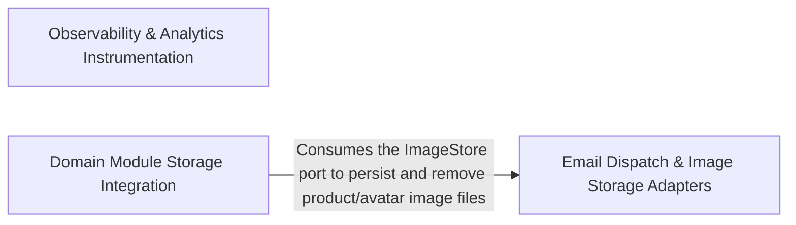

---
tags:
  - 2repo
  - 2repo/arch
  - project/boilerplate-node-backend
type: architecture
component: Email_File_Storage_Adapters
---

## Details

The infrastructure adapters the boot sequence wires up for asynchronous side effects and binary I/O. Contains the email producer (enqueueEmail/nodemailer), the queue consumer (handleEmailJob), the demo-mode outbox sink, the multer-based upload pipeline (staging, MIME filter, byte-level image validation, locale-context restoration), and the ImageStore port with its filesystem implementation. These are the only components in the subsystem that touch SMTP, RabbitMQ email queues, or the on-disk image directory.

### Email Dispatch & Image Storage Adapters
The core adapter implementations that own the two I/O channels. The email side provides enqueueEmail (the queue-aware entry point controllers call), nodemailer (the synchronous SMTP sender with EJS template rendering and demo-outbox fallback), and handleEmailJob (the RabbitMQ consumer that validates the payload and delegates to nodemailer). The storage side defines the ImageStore port (put/remove) and its filesystemImageStore implementation that moves staged uploads into NODE_PUBLIC_PATH/images/ and safely unlinks them with path-containment guards. The group also includes the storage.upload pipeline (multer staging, MIME filtering, byte-level image validation, locale-context restoration) and the filesystem primitives (deleteFile, moveFile) that both the image store and the upload pipeline depend on.

**Related Classes/Methods**:

- `src.infrastructure.adapters.mailer.enqueueEmail`:282-310
- `src.infrastructure.adapters.mailer.nodemailer`:148-212
- `src.infrastructure.adapters.email.worker.handleEmailJob`:23-49
- `src.infrastructure.adapters.image-store.ImageStore`:21-50
- `src.infrastructure.adapters.image-store.filesystemImageStore`:80-126

**Source Files:**

- `src/app/system-routes.ts`
  - `src.app.system-routes.router.get('/') callback` (L7-L9) - Function
- `src/globals.d.ts`
  - `src.globals.d.'express-serve-static-core'.Request` (L5-L23) - Interface
- `src/infrastructure/adapters/demo-outbox.ts`
  - `src.infrastructure.adapters.demo-outbox.DemoOutboxEmail` (L18-L26) - Interface
  - `src.infrastructure.adapters.demo-outbox.recordDemoEmail.lines.filter() callback` (L50-L50) - Function
  - `src.infrastructure.adapters.demo-outbox.recordDemoEmail.lines.map() callback` (L51-L51) - Function
- `src/infrastructure/adapters/email.worker.ts`
  - `src.infrastructure.adapters.email.worker.handleEmailJob` (L23-L49) - Class
  - `src.infrastructure.adapters.email.worker.handleEmailJob.then() callback` (L42-L42) - Function
  - `src.infrastructure.adapters.email.worker.handleEmailJob.catch() callback` (L43-L48) - Function
- `src/infrastructure/adapters/filesystem.ts`
  - `src.infrastructure.adapters.filesystem.deleteFile` (L51-L61) - Class
  - `src.infrastructure.adapters.filesystem.deleteFile.toolkitDeleteFile() callback` (L53-L60) - Function
- `src/infrastructure/adapters/image-store.ts`
  - `src.infrastructure.adapters.image-store.ImageStore` (L21-L50) - Interface
  - `src.infrastructure.adapters.image-store.ImageStore.put` (L37-L37) - Method
  - `src.infrastructure.adapters.image-store.ImageStore.remove` (L49-L49) - Method
  - `src.infrastructure.adapters.image-store.filesystemImageStore` (L80-L126) - Class
  - `src.infrastructure.adapters.image-store.filesystemImageStore.put` (L81-L88) - Method
  - `src.infrastructure.adapters.image-store.filesystemImageStore.remove` (L90-L125) - Method
- `src/infrastructure/adapters/mailer.ts`
  - `src.infrastructure.adapters.mailer.nodemailer` (L148-L212) - Class
  - `src.infrastructure.adapters.mailer.nodemailer.withSpan('email.send') callback` (L160-L211) - Function
  - `src.infrastructure.adapters.mailer.withSpan('email.send') callback.then() callback` (L191-L200) - Function
  - `src.infrastructure.adapters.mailer.nodemailer.withSpan('email.send') callback.then() callback` (L202-L207) - Function
  - `src.infrastructure.adapters.mailer.EmailContent` (L248-L264) - Interface
  - `src.infrastructure.adapters.mailer.enqueueEmail` (L282-L310) - Class
  - `src.infrastructure.adapters.mailer.then() callback` (L289-L289) - Function
  - `src.infrastructure.adapters.mailer.enqueueEmail.then() callback` (L298-L309) - Function
  - `src.infrastructure.adapters.mailer.enqueueEmail.then() callback.then() callback` (L301-L301) - Function
- `src/infrastructure/adapters/storage.ts`
  - `src.infrastructure.adapters.storage.withLocaleRestored` (L240-L249) - Class
  - `src.infrastructure.adapters.storage.withLocaleRestored.<function>` (L242-L249) - Function
  - `src.infrastructure.adapters.storage.withLocaleRestored.<function>.middleware() callback` (L243-L249) - Function
  - `src.infrastructure.adapters.storage.withLocaleRestored.<function>.middleware() callback.runWithLocaleContext() callback` (L248-L248) - Function
  - `src.infrastructure.adapters.storage.upload` (L389-L396) - Class
  - `src.infrastructure.adapters.storage.upload.single` (L390-L390) - Method
  - `src.infrastructure.adapters.storage.upload.array` (L391-L392) - Method
  - `src.infrastructure.adapters.storage.upload.fields` (L393-L393) - Method
  - `src.infrastructure.adapters.storage.upload.none` (L394-L394) - Method
  - `src.infrastructure.adapters.storage.upload.any` (L395-L395) - Method
- `src/infrastructure/observability/audit.ts`
  - `src.infrastructure.observability.audit.AuditEvent` (L57-L79) - Interface
  - `src.infrastructure.observability.audit.AuditEntry` (L85-L90) - Interface
- `src/infrastructure/observability/metrics-http.ts`
  - `src.infrastructure.observability.metrics-http._heapSizeLimitGauge` (L68-L75) - Class
  - `src.infrastructure.observability.metrics-http._heapSizeLimitGauge.collect` (L72-L74) - Method
- `src/infrastructure/observability/process-snapshot.ts`
  - `src.infrastructure.observability.process-snapshot.ProcessMemorySnapshot` (L28-L40) - Interface
  - `src.infrastructure.observability.process-snapshot.ProcessSnapshot` (L43-L53) - Interface
- `src/infrastructure/observability/tracer.ts`
  - `src.infrastructure.observability.tracer.withSpan` (L46-L90) - Class
  - `src.infrastructure.observability.tracer.withSpan.tracer.startActiveSpan() callback` (L56-L89) - Function
  - `src.infrastructure.observability.tracer.tracer.startActiveSpan() callback.then() callback` (L65-L71) - Function
  - `src.infrastructure.observability.tracer.withSpan.tracer.startActiveSpan() callback.then() callback` (L72-L87) - Function
- `src/modules/account/analytics.ts`
  - `src.modules.account.analytics.'@infrastructure/observability/analytics'.AnalyticsEventMap` (L26-L28) - Interface
- `src/modules/account/audit.ts`
  - `src.modules.account.audit.'@infrastructure/observability/audit'.AuditActionMap` (L36-L38) - Interface
- `src/modules/account/controllers/delete-account-confirm.ts`
  - `src.modules.account.controllers.delete-account-confirm.deleteAccountConfirm` (L20-L81) - Class
  - `src.modules.account.controllers.delete-account-confirm.deleteAccountConfirm.then() callback` (L31-L79) - Function
  - `src.modules.account.controllers.delete-account-confirm.deleteAccountConfirm.then() callback.then() callback` (L46-L78) - Function
  - `src.modules.account.controllers.delete-account-confirm.deleteAccountConfirm.catch() callback` (L80-L80) - Function
- `src/modules/account/controllers/delete-account-request.ts`
  - `src.modules.account.controllers.delete-account-request.deleteAccountRequest` (L23-L61) - Class
  - `src.modules.account.controllers.delete-account-request.deleteAccountRequest.then() callback` (L29-L59) - Function
  - `src.modules.account.controllers.delete-account-request.deleteAccountRequest.then() callback.then() callback` (L34-L58) - Function
  - `src.modules.account.controllers.delete-account-request.deleteAccountRequest.catch() callback` (L60-L60) - Function
- `src/modules/account/controllers/get-account.ts`
  - `src.modules.account.controllers.get-account.getAccount` (L17-L35) - Class
  - `src.modules.account.controllers.get-account.getAccount.then() callback` (L29-L33) - Function
  - `src.modules.account.controllers.get-account.getAccount.catch() callback` (L34-L34) - Function
- `src/modules/account/controllers/post-logout.ts`
  - `src.modules.account.controllers.post-logout.postLogout` (L22-L40) - Class
  - `src.modules.account.controllers.post-logout.postLogout.then() callback` (L26-L38) - Function
- `src/modules/account/controllers/post-signup.ts`
  - `src.modules.account.controllers.post-signup.postSignup` (L20-L94) - Class
  - `src.modules.account.controllers.post-signup.postSignup.then() callback` (L48-L88) - Function
  - `src.modules.account.controllers.post-signup.postSignup.then() callback.then() callback` (L50-L61) - Function
  - `src.modules.account.controllers.post-signup.postSignup.catch() callback` (L89-L93) - Function
- `src/modules/account/controllers/post-verify-request.ts`
  - `src.modules.account.controllers.post-verify-request.postVerifyRequest` (L20-L51) - Class
  - `src.modules.account.controllers.post-verify-request.postVerifyRequest.then() callback` (L28-L48) - Function
  - `src.modules.account.controllers.post-verify-request.postVerifyRequest.then() callback.then() callback` (L38-L47) - Function
- `src/modules/account/controllers/put-account.ts`
  - `src.modules.account.controllers.put-account.putAccount` (L22-L75) - Class
  - `src.modules.account.controllers.put-account.putAccount.then() callback` (L47-L70) - Function
  - `src.modules.account.controllers.put-account.putAccount.then() callback.then() callback` (L49-L51) - Function
  - `src.modules.account.controllers.put-account.putAccount.catch() callback` (L71-L74) - Function
- `src/modules/account/controllers/write-addresses.ts`
  - `src.modules.account.controllers.write-addresses.putAddress` (L53-L71) - Class
  - `src.modules.account.controllers.write-addresses.putAddress.then() callback` (L66-L69) - Function
- `src/modules/account/services/verification.ts`
  - `src.modules.account.services.verification.sendVerificationEmail` (L40-L60) - Class
  - `src.modules.account.services.verification.sendVerificationEmail.then() callback` (L44-L60) - Function
- `src/modules/account/session/jwt.ts`
  - `src.modules.account.session.jwt.recordRefreshTokenUse` (L122-L128) - Class
  - `src.modules.account.session.jwt.recordRefreshTokenUse.then() callback` (L127-L127) - Function
  - `src.modules.account.session.jwt.recordRefreshTokenUse.catch() callback` (L128-L128) - Function
- `src/modules/audit-logs/repository.ts`
  - `src.modules.audit-logs.repository.AuditLogSearchFilters` (L14-L22) - Interface
- `src/modules/cart/analytics.ts`
  - `src.modules.cart.analytics.'@infrastructure/observability/analytics'.AnalyticsEventMap` (L37-L39) - Interface
- `src/modules/cart/audit.ts`
  - `src.modules.cart.audit.'@infrastructure/observability/audit'.AuditActionMap` (L18-L20) - Interface
- `src/modules/cart/controllers/get-cart.ts`
  - `src.modules.cart.controllers.get-cart.getCart` (L14-L25) - Class
  - `src.modules.cart.controllers.get-cart.getCart.then() callback` (L17-L23) - Function
- `src/modules/cart/controllers/put-cart-item.ts`
  - `src.modules.cart.controllers.put-cart-item.putCartItem` (L20-L51) - Class
  - `src.modules.cart.controllers.put-cart-item.putCartItem.then() callback` (L40-L49) - Function
- `src/modules/cart/services/checkout.ts`
  - `src.modules.cart.services.checkout.orderConfirm.<function>.then() callback.then() callback.then() callback.then() callback` (L223-L259) - Function
  - `src.modules.cart.services.checkout.<function>.then() callback.then() callback.then() callback.then() callback.then() callback` (L250-L250) - Function
- `src/modules/delivery/audit.ts`
  - `src.modules.delivery.audit.'@infrastructure/observability/audit'.AuditActionMap` (L14-L16) - Interface
- `src/modules/delivery/model.ts`
  - `src.modules.delivery.model.ShipmentDocument` (L18-L26) - Interface
- `src/modules/feedback/audit.ts`
  - `src.modules.feedback.audit.'@infrastructure/observability/audit'.AuditActionMap` (L17-L19) - Interface
- `src/modules/feedback/controllers/get-feedback.ts`
  - `src.modules.feedback.controllers.get-feedback.getFeedback` (L37-L73) - Class
  - `src.modules.feedback.controllers.get-feedback.getFeedback.then() callback` (L63-L71) - Function
- `src/modules/feedback/controllers/post-feedback-contact.ts`
  - `src.modules.feedback.controllers.post-feedback-contact.postFeedbackContact` (L29-L75) - Class
  - `src.modules.feedback.controllers.post-feedback-contact.postFeedbackContact.then() callback` (L38-L73) - Function
  - `src.modules.feedback.controllers.post-feedback-contact.postFeedbackContact.then() callback.catch() callback` (L64-L68) - Function
- `src/modules/feedback/controllers/put-feedback-status.ts`
  - `src.modules.feedback.controllers.put-feedback-status.putFeedbackStatus` (L24-L49) - Class
  - `src.modules.feedback.controllers.put-feedback-status.putFeedbackStatus.then() callback` (L35-L47) - Function
- `src/modules/feedback/emails.ts`
  - `src.modules.feedback.emails.ContactRequest` (L18-L24) - Interface
- `src/modules/feedback/model.ts`
  - `src.modules.feedback.model.FeedbackRequestDocument` (L9-L14) - Interface
- `src/modules/inventory/audit.ts`
  - `src.modules.inventory.audit.'@infrastructure/observability/audit'.AuditActionMap` (L22-L24) - Interface
- `src/modules/inventory/domain/transitions.ts`
  - `src.modules.inventory.domain.transitions.CounterDelta` (L21-L24) - Interface
- `src/modules/inventory/events.ts`
  - `src.modules.inventory.events.'@kernel/events'.DomainEventMap` (L15-L27) - Interface
- `src/modules/locales/audit.ts`
  - `src.modules.locales.audit.'@infrastructure/observability/audit'.AuditActionMap` (L37-L39) - Interface
- `src/modules/observability/routes.ts`
  - `src.modules.observability.routes.router.get('/events') callback` (L24-L26) - Function
  - `src.modules.observability.routes.router.get('/metrics') callback` (L28-L38) - Function
  - `src.modules.observability.routes.router.get('/metrics') callback.then() callback` (L30-L33) - Function
  - `src.modules.observability.routes.router.get('/metrics') callback.catch() callback` (L34-L37) - Function
- `src/modules/orders/analytics.ts`
  - `src.modules.orders.analytics.'@infrastructure/observability/analytics'.AnalyticsEventMap` (L26-L28) - Interface
- `src/modules/orders/audit.ts`
  - `src.modules.orders.audit.'@infrastructure/observability/audit'.AuditActionMap` (L23-L25) - Interface
- `src/modules/orders/emails.ts`
  - `src.modules.orders.emails.orderConfirmEmail.data.lines.order.items.map() callback` (L50-L55) - Function
  - `src.modules.orders.emails.invoiceDocument.lines.order.items.map() callback` (L88-L93) - Function
- `src/modules/orders/events.ts`
  - `src.modules.orders.events.'@kernel/events'.DomainEventMap` (L15-L33) - Interface
- `src/modules/payments/analytics.ts`
  - `src.modules.payments.analytics.'@infrastructure/observability/analytics'.AnalyticsEventMap` (L26-L28) - Interface
- `src/modules/payments/audit.ts`
  - `src.modules.payments.audit.'@infrastructure/observability/audit'.AuditActionMap` (L18-L20) - Interface
- `src/modules/payments/model.ts`
  - `src.modules.payments.model.PaymentDocument` (L26-L40) - Interface
- `src/modules/products/analytics.ts`
  - `src.modules.products.analytics.'@infrastructure/observability/analytics'.AnalyticsEventMap` (L24-L26) - Interface
- `src/modules/products/audit.ts`
  - `src.modules.products.audit.'@infrastructure/observability/audit'.AuditActionMap` (L16-L18) - Interface
- `src/modules/products/events.ts`
  - `src.modules.products.events.'@kernel/events'.DomainEventMap` (L9-L18) - Interface
- `src/modules/products/service.ts`
  - `src.modules.products.service.sanitizeStringArray` (L43-L46) - Class
  - `src.modules.products.service.sanitizeStringArray.values.map() callback` (L45-L45) - Function
  - `src.modules.products.service.update` (L111-L149) - Class
  - `src.modules.products.service.update.then() callback` (L141-L148) - Function
  - `src.modules.products.service.update.then() callback.then() callback` (L147-L147) - Function
- `src/modules/users/audit.ts`
  - `src.modules.users.audit.'@infrastructure/observability/audit'.AuditActionMap` (L16-L18) - Interface
- `src/modules/users/events.ts`
  - `src.modules.users.events.'@kernel/events'.DomainEventMap` (L9-L22) - Interface
- `src/modules/wishlist/analytics.ts`
  - `src.modules.wishlist.analytics.'@infrastructure/observability/analytics'.AnalyticsEventMap` (L25-L27) - Interface
- `src/types/auth-context.ts`
  - `src.types.auth-context.AuthContext` (L6-L12) - Interface

### Observability & Analytics Instrumentation
The cross-cutting instrumentation layer that wraps the email and storage operations with measurable, auditable, and analytically trackable signals. It provides the AnalyticsProvider port with PostHog, Umami, and no-op implementations for product-analytics events; dependency-health that aggregates the liveness of SMTP, RabbitMQ, and filesystem into an overallStatus for health-check endpoints; metrics-http that exposes Prometheus gauges/counters for the HTTP surface; stream that serializes observability payloads into structured event streams; and audit entries/events that record who sent which email or deleted which image, providing a tamper-evident trail.

**Related Classes/Methods**:

- `src.infrastructure.observability.analytics.index.AnalyticsProvider`:83-110
- `src.infrastructure.observability.dependency-health.overallStatus`:91-94
- `src.infrastructure.observability.metrics-http.getHttpRequestCounters`:302-308
- `src.infrastructure.observability.stream.writeMetricsEvent`:99-106

**Source Files:**

- `src/infrastructure/observability/analytics/index.ts`
  - `src.infrastructure.observability.analytics.index.AnalyticsProvider` (L83-L110) - Interface
  - `src.infrastructure.observability.analytics.index.AnalyticsProvider.capture` (L91-L91) - Method
  - `src.infrastructure.observability.analytics.index.AnalyticsProvider.configured` (L101-L101) - Method
  - `src.infrastructure.observability.analytics.index.AnalyticsProvider.shutdown` (L109-L109) - Method
  - `src.infrastructure.observability.analytics.index.shutdownAnalytics` (L195-L202) - Class
  - `src.infrastructure.observability.analytics.index.shutdownAnalytics.then() callback` (L197-L201) - Function
- `src/infrastructure/observability/analytics/none.ts`
  - `src.infrastructure.observability.analytics.none.noneAnalyticsProvider` (L12-L27) - Class
  - `src.infrastructure.observability.analytics.none.noneAnalyticsProvider.capture` (L15-L17) - Method
  - `src.infrastructure.observability.analytics.none.noneAnalyticsProvider.configured` (L20-L22) - Method
  - `src.infrastructure.observability.analytics.none.noneAnalyticsProvider.shutdown` (L24-L26) - Method
- `src/infrastructure/observability/analytics/posthog.ts`
  - `src.infrastructure.observability.analytics.posthog.posthogAnalyticsProvider` (L55-L110) - Class
  - `src.infrastructure.observability.analytics.posthog.posthogAnalyticsProvider.configured` (L58-L60) - Method
  - `src.infrastructure.observability.analytics.posthog.posthogAnalyticsProvider.capture` (L62-L93) - Method
  - `src.infrastructure.observability.analytics.posthog.posthogAnalyticsProvider.shutdown` (L102-L109) - Method
- `src/infrastructure/observability/analytics/umami.ts`
  - `src.infrastructure.observability.analytics.umami.umamiAnalyticsProvider` (L94-L174) - Class
  - `src.infrastructure.observability.analytics.umami.umamiAnalyticsProvider.configured` (L99-L101) - Method
  - `src.infrastructure.observability.analytics.umami.umamiAnalyticsProvider.capture` (L103-L163) - Method
  - `src.infrastructure.observability.analytics.umami.umamiAnalyticsProvider.capture.then() callback` (L146-L156) - Function
  - `src.infrastructure.observability.analytics.umami.umamiAnalyticsProvider.capture.catch() callback` (L157-L162) - Function
  - `src.infrastructure.observability.analytics.umami.umamiAnalyticsProvider.shutdown` (L171-L173) - Method
- `src/infrastructure/observability/dependency-health.ts`
  - `src.infrastructure.observability.dependency-health.DependencyHealth` (L52-L56) - Interface
  - `src.infrastructure.observability.dependency-health.overallStatus` (L91-L94) - Class
  - `src.infrastructure.observability.dependency-health.overallStatus.every() callback` (L92-L92) - Function
- `src/infrastructure/observability/metrics-http.ts`
  - `src.infrastructure.observability.metrics-http._processUptimeGauge` (L41-L53) - Class
  - `src.infrastructure.observability.metrics-http._processUptimeGauge.collect` (L50-L52) - Method
  - `src.infrastructure.observability.metrics-http.RequestMetricInput` (L162-L168) - Interface
  - `src.infrastructure.observability.metrics-http.sumMetricValues` (L212-L213) - Class
  - `src.infrastructure.observability.metrics-http.sumMetricValues.values.reduce() callback` (L213-L213) - Function
  - `src.infrastructure.observability.metrics-http.LatencyBucket` (L216-L220) - Interface
  - `src.infrastructure.observability.metrics-http.aggregateLatencyBuckets.buckets.toSorted() callback` (L259-L259) - Function
  - `src.infrastructure.observability.metrics-http.aggregateLatencyBuckets.buckets.map() callback` (L260-L260) - Function
  - `src.infrastructure.observability.metrics-http.getHttpRequestCounters` (L302-L308) - Class
  - `src.infrastructure.observability.metrics-http.getHttpRequestCounters.then() callback` (L304-L307) - Function
  - `src.infrastructure.observability.metrics-http.getLatencyPercentiles` (L327-L336) - Class
  - `src.infrastructure.observability.metrics-http.getLatencyPercentiles.then() callback` (L328-L336) - Function
- `src/infrastructure/observability/stream.ts`
  - `src.infrastructure.observability.stream.buildObservabilityPayload` (L69-L90) - Class
  - `src.infrastructure.observability.stream.buildObservabilityPayload.then() callback` (L73-L89) - Function
  - `src.infrastructure.observability.stream.writeMetricsEvent` (L99-L106) - Class
  - `src.infrastructure.observability.stream.writeMetricsEvent.then() callback` (L102-L104) - Function
  - `src.infrastructure.observability.stream.writeMetricsEvent.catch() callback` (L105-L105) - Function
  - `src.infrastructure.observability.stream.streamObservabilityMetrics.updatesInterval` (L133-L135) - Class
  - `src.infrastructure.observability.stream.streamObservabilityMetrics.updatesInterval.setInterval() callback` (L133-L135) - Function
  - `src.infrastructure.observability.stream.streamObservabilityMetrics.heartbeatInterval` (L139-L141) - Class
  - `src.infrastructure.observability.stream.streamObservabilityMetrics.heartbeatInterval.setInterval() callback` (L139-L141) - Function
- `src/modules/cart/controllers/delete-cart-item.ts`
  - `src.modules.cart.controllers.delete-cart-item.deleteCartItem` (L18-L56) - Class
  - `src.modules.cart.controllers.delete-cart-item.deleteCartItem.then() callback` (L36-L54) - Function
- `src/modules/cart/controllers/delete-cart.ts`
  - `src.modules.cart.controllers.delete-cart.deleteCart` (L13-L27) - Class
  - `src.modules.cart.controllers.delete-cart.deleteCart.then() callback` (L18-L25) - Function
- `src/modules/cart/controllers/post-cart.ts`
  - `src.modules.cart.controllers.post-cart.postCart` (L20-L50) - Class
  - `src.modules.cart.controllers.post-cart.postCart.then() callback` (L39-L48) - Function
- `src/modules/cart/controllers/post-checkout.ts`
  - `src.modules.cart.controllers.post-checkout.postCheckout` (L15-L52) - Class
  - `src.modules.cart.controllers.post-checkout.postCheckout.then() callback` (L24-L47) - Function
  - `src.modules.cart.controllers.post-checkout.postCheckout.catch() callback` (L48-L51) - Function
- `src/modules/cart/repository.ts`
  - `src.modules.cart.repository.upsertLine` (L31-L65) - Class
  - `src.modules.cart.repository.upsertLine.then() callback` (L51-L59) - Function
  - `src.modules.cart.repository.upsertLine.catch() callback` (L61-L64) - Function
- `src/modules/observability/controllers/get-observability-audit.ts`
  - `src.modules.observability.controllers.get-observability-audit.getObservabilityAuditLogs` (L13-L51) - Class
  - `src.modules.observability.controllers.get-observability-audit.getObservabilityAuditLogs.then() callback` (L49-L49) - Function
- `src/modules/observability/controllers/get-observability-metrics-overview.ts`
  - `src.modules.observability.controllers.get-observability-metrics-overview.MetricSample` (L12-L15) - Interface
  - `src.modules.observability.controllers.get-observability-metrics-overview.sumByLabel` (L39-L40) - Class
  - `src.modules.observability.controllers.get-observability-metrics-overview.sumByLabel.reduce() callback` (L40-L40) - Function
  - `src.modules.observability.controllers.get-observability-metrics-overview.sumByLabel.values.filter() callback` (L40-L40) - Function
  - `src.modules.observability.controllers.get-observability-metrics-overview.getObservabilityMetricsOverview` (L46-L110) - Class
  - `src.modules.observability.controllers.get-observability-metrics-overview.getObservabilityMetricsOverview.then() callback` (L61-L106) - Function
  - `src.modules.observability.controllers.get-observability-metrics-overview.getObservabilityMetricsOverview.then() callback.inFlight` (L73-L73) - Class
  - `src.modules.observability.controllers.get-observability-metrics-overview.getObservabilityMetricsOverview.then() callback.inFlight.inflightMetric.values.reduce() callback` (L73-L73) - Function
  - `src.modules.observability.controllers.get-observability-metrics-overview.getObservabilityMetricsOverview.then() callback.data.business.ordersCreated.orderValues.reduce() callback` (L90-L90) - Function
  - `src.modules.observability.controllers.get-observability-metrics-overview.getObservabilityMetricsOverview.then() callback.data.business.lowStockProducts.lowStockValues.reduce() callback` (L91-L91) - Function
  - `src.modules.observability.controllers.get-observability-metrics-overview.getObservabilityMetricsOverview.then() callback.data.business.reservedUnits.reservedValues.reduce() callback` (L92-L92) - Function
  - `src.modules.observability.controllers.get-observability-metrics-overview.getObservabilityMetricsOverview.catch() callback` (L108-L110) - Function

### Domain Module Storage Integration
The domain-module consumers that exercise the ImageStore port and filesystem primitives as part of their business operations. The account module's controllers call ImageStore.remove to clean up avatar files when a user's address or session is deleted. The products module's service calls ImageStore.put to persist new product images and ImageStore.remove to unlink superseded ones. This group represents the demand side of the storage port: it shows how bounded contexts interact with the adapter without knowing whether the backing store is local disk, S3, or a CDN.

**Related Classes/Methods**:

- `src.modules.account.controllers.delete-address.deleteAddress`:17-29

**Source Files:**

- `src/modules/account/controllers/delete-address.ts`
  - `src.modules.account.controllers.delete-address.deleteAddress` (L17-L29) - Class
  - `src.modules.account.controllers.delete-address.deleteAddress.then() callback` (L24-L27) - Function
- `src/modules/account/controllers/delete-expired-tokens.ts`
  - `src.modules.account.controllers.delete-expired-tokens.deleteExpiredTokens` (L14-L31) - Class
  - `src.modules.account.controllers.delete-expired-tokens.deleteExpiredTokens.then() callback` (L19-L29) - Function
- `src/modules/account/controllers/delete-session.ts`
  - `src.modules.account.controllers.delete-session.deleteSession` (L23-L46) - Class
  - `src.modules.account.controllers.delete-session.deleteSession.then() callback` (L30-L44) - Function
- `src/modules/account/controllers/get-addresses.ts`
  - `src.modules.account.controllers.get-addresses.getAddresses` (L14-L24) - Class
  - `src.modules.account.controllers.get-addresses.getAddresses.then() callback` (L20-L22) - Function
- `src/modules/account/controllers/get-refresh-token.ts`
  - `src.modules.account.controllers.get-refresh-token.getRefreshToken` (L21-L86) - Class
  - `src.modules.account.controllers.get-refresh-token.getRefreshToken.then() callback` (L50-L77) - Function
  - `src.modules.account.controllers.get-refresh-token.getRefreshToken.then() callback.then() callback.then() callback` (L54-L54) - Function
  - `src.modules.account.controllers.get-refresh-token.getRefreshToken.then() callback.then() callback` (L55-L64) - Function
  - `src.modules.account.controllers.get-refresh-token.getRefreshToken.then() callback.catch() callback` (L65-L77) - Function
  - `src.modules.account.controllers.get-refresh-token.getRefreshToken.catch() callback` (L79-L85) - Function
- `src/modules/account/controllers/get-sessions.ts`
  - `src.modules.account.controllers.get-sessions.getSessions` (L30-L58) - Class
  - `src.modules.account.controllers.get-sessions.getSessions.then() callback` (L39-L55) - Function
  - `src.modules.account.controllers.get-sessions.getSessions.then() callback.sessions.user.tokens.filter() callback` (L51-L51) - Function
  - `src.modules.account.controllers.get-sessions.getSessions.then() callback.sessions.map() callback` (L52-L52) - Function
- `src/modules/account/controllers/post-login.ts`
  - `src.modules.account.controllers.post-login.postLogin` (L63-L144) - Class
  - `src.modules.account.controllers.post-login.postLogin.then() callback` (L99-L137) - Function
  - `src.modules.account.controllers.post-login.postLogin.then() callback.then() callback` (L128-L136) - Function
  - `src.modules.account.controllers.post-login.postLogin.catch() callback` (L138-L143) - Function
- `src/modules/account/controllers/post-logout-everywhere.ts`
  - `src.modules.account.controllers.post-logout-everywhere.postLogoutEverywhere` (L16-L33) - Class
  - `src.modules.account.controllers.post-logout-everywhere.postLogoutEverywhere.then() callback` (L19-L31) - Function
- `src/modules/account/controllers/post-password-change.ts`
  - `src.modules.account.controllers.post-password-change.postPasswordChange` (L23-L67) - Class
  - `src.modules.account.controllers.post-password-change.postPasswordChange.then() callback` (L41-L62) - Function
  - `src.modules.account.controllers.post-password-change.postPasswordChange.catch() callback` (L63-L66) - Function
- `src/modules/account/controllers/post-reset-confirm.ts`
  - `src.modules.account.controllers.post-reset-confirm.postResetConfirm` (L19-L117) - Class
  - `src.modules.account.controllers.post-reset-confirm.postResetConfirm.then() callback` (L34-L113) - Function
  - `src.modules.account.controllers.post-reset-confirm.postResetConfirm.then() callback.then() callback` (L68-L112) - Function
  - `src.modules.account.controllers.post-reset-confirm.postResetConfirm.then() callback.then() callback.then() callback` (L79-L111) - Function
  - `src.modules.account.controllers.post-reset-confirm.postResetConfirm.catch() callback` (L114-L116) - Function
- `src/modules/account/controllers/post-reset-request.ts`
  - `src.modules.account.controllers.post-reset-request.lookupResetData` (L26-L38) - Class
  - `src.modules.account.controllers.post-reset-request.lookupResetData.then() callback` (L28-L37) - Function
  - `src.modules.account.controllers.post-reset-request.lookupResetData.then() callback.then() callback` (L30-L36) - Function
  - `src.modules.account.controllers.post-reset-request.postResetRequest` (L46-L92) - Class
  - `src.modules.account.controllers.post-reset-request.postResetRequest.catch() callback` (L59-L61) - Function
  - `src.modules.account.controllers.post-reset-request.postResetRequest.then() callback` (L62-L90) - Function
- `src/modules/account/controllers/post-verify-confirm.ts`
  - `src.modules.account.controllers.post-verify-confirm.postVerifyConfirm` (L25-L82) - Class
  - `src.modules.account.controllers.post-verify-confirm.postVerifyConfirm.then() callback` (L39-L77) - Function
  - `src.modules.account.controllers.post-verify-confirm.postVerifyConfirm.then() callback.then() callback` (L55-L76) - Function
  - `src.modules.account.controllers.post-verify-confirm.postVerifyConfirm.then() callback.then() callback.then() callback` (L63-L75) - Function
  - `src.modules.account.controllers.post-verify-confirm.postVerifyConfirm.catch() callback` (L78-L81) - Function
- `src/modules/account/controllers/write-addresses.ts`
  - `src.modules.account.controllers.write-addresses.postAddress` (L28-L45) - Class
  - `src.modules.account.controllers.write-addresses.postAddress.then() callback` (L40-L43) - Function
- `src/modules/account/session/jwt.ts`
  - `src.modules.account.session.jwt.TokenData` (L22-L24) - Interface
  - `src.modules.account.session.jwt.verifyAccessToken` (L33-L42) - Class
  - `src.modules.account.session.jwt.verifyAccessToken.<function>` (L34-L42) - Function
  - `src.modules.account.session.jwt.verifyAccessToken.<function>.verify() callback` (L35-L41) - Function
  - `src.modules.account.session.jwt.verifyRefreshToken` (L50-L69) - Class
  - `src.modules.account.session.jwt.verifyRefreshToken.<function>` (L51-L69) - Function
  - `src.modules.account.session.jwt.verifyRefreshToken.<function>.verify() callback` (L52-L68) - Function
  - `src.modules.account.session.jwt.verifyRefreshToken.<function>.verify() callback.then() callback` (L60-L66) - Function
  - `src.modules.account.session.jwt.verifyRefreshToken.<function>.verify() callback.catch() callback` (L67-L67) - Function
  - `src.modules.account.session.jwt.createRefreshToken` (L77-L102) - Class
  - `src.modules.account.session.jwt.createRefreshToken.then() callback` (L80-L102) - Function
  - `src.modules.account.session.jwt.createAccessToken` (L135-L141) - Class
  - `src.modules.account.session.jwt.createAccessToken.then() callback` (L136-L140) - Function
- `src/modules/cart/controllers/get-cart-summary.ts`
  - `src.modules.cart.controllers.get-cart-summary.getCartSummary` (L11-L18) - Class
  - `src.modules.cart.controllers.get-cart-summary.getCartSummary.then() callback` (L14-L16) - Function
- `src/modules/cart/controllers/post-reorder.ts`
  - `src.modules.cart.controllers.post-reorder.postReorder` (L19-L44) - Class
  - `src.modules.cart.controllers.post-reorder.postReorder.then() callback` (L25-L42) - Function
