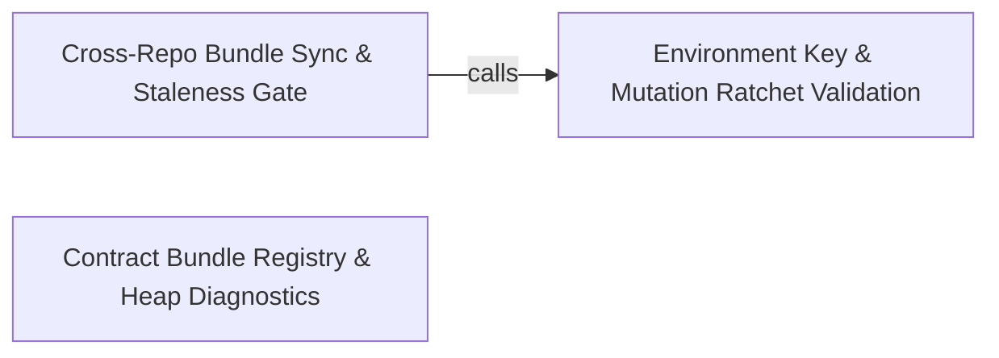

---
tags:
  - 2repo
  - 2repo/arch
  - project/boilerplate-node-backend
type: architecture
component: Environment_Validation_Cross_Repo_Consistency
---

## Details

The verification side of the operational pipeline. Validates that every documented environment key is present and correctly typed (check-environment-keys), detects stale contract bundles by comparing assembled vs. committed text (bundle.stale), enforces cross-repo spec identity by diffing shared documents against the paired frontend (sync-frontend), exports the demo seed to a portable JSON file (export-seed), and guards the mutation ratchet against partial-run corruption (missingFromReport). This is the gate that keeps the repo, the frontend, and CI in lockstep.

### Environment Key & Mutation Ratchet Validation
The input-validation gate. This component verifies that every environment variable read by the application is documented in `.env-example` (the single source of truth for deployment configuration), and guards the per-file mutation-testing ratchet against partial-run corruption. The environment key checker greps all source files for `process.env.*` and `environmentNumber/Flag` reads, then asserts each key appears in the documented set. The mutation ratchet guard detects when a Stryker report covers only a subset of the baseline's files, refusing to record a baseline that would silently drop every other file's score.

**Related Classes/Methods**:

- `scripts.check-environment-keys.documented`:64-66
- `scripts.mutation-baseline.missingFromReport`:149-155

**Source Files:**

- `db/demo/assemble.ts`
  - `db.demo.assemble.reconcileShapes.orphaned` (L148-L148) - Class
  - `db.demo.assemble.reconcileShapes.orphaned.filter() callback` (L148-L148) - Function
- `scripts/check-environment-keys.ts`
  - `scripts.check-environment-keys.documented` (L64-L66) - Class
  - `scripts.check-environment-keys.documented.map() callback` (L65-L65) - Function
- `scripts/contracts/asyncapi.ts`
  - `scripts.contracts.asyncapi.asyncapiBundle` (L159-L170) - Class
  - `scripts.contracts.asyncapi.asyncapiBundle.content` (L164-L164) - Method
  - `scripts.contracts.asyncapi.asyncapiBundle.sources.map() callback` (L167-L167) - Function
  - `scripts.contracts.asyncapi.asyncapiPublicBundle` (L179-L189) - Class
  - `scripts.contracts.asyncapi.asyncapiPublicBundle.content` (L183-L183) - Method
  - `scripts.contracts.asyncapi.asyncapiPublicBundle.sources.map() callback` (L186-L186) - Function
- `scripts/contracts/fragments.ts`
  - `scripts.contracts.fragments.BundleIdentity` (L30-L51) - Interface
  - `scripts.contracts.fragments.GeneratedBundle` (L77-L80) - Interface
- `scripts/contracts/openapi.ts`
  - `scripts.contracts.openapi.openapiBundle` (L159-L166) - Class
  - `scripts.contracts.openapi.openapiBundle.sources` (L165-L165) - Method
  - `scripts.contracts.openapi.openapiBundle.sources.MODULE_SECTIONS.map() callback` (L165-L165) - Function
- `scripts/mutation-baseline.ts`
  - `scripts.mutation-baseline.missingFromReport` (L149-L155) - Class
  - `scripts.mutation-baseline.missingFromReport.filter() callback` (L154-L154) - Function

### Cross-Repo Bundle Sync & Staleness Gate
The output-enforcement gate. This component detects stale contract bundles by comparing freshly assembled text against the committed copy, then enforces cross-repo consistency by copying every backend-owned shared file into the paired frontend checkout. Before any byte moves, it runs staleness gates to refuse copying a document that does not match its sources. After copying, it optionally triggers the frontend's type regeneration and performs a final hash comparison to catch mid-run rewrites. The `CompiledBundle` type and the per-bundle `sources()` declarations define what 'stale' means for each document.

**Related Classes/Methods**: _None_

**Source Files:**

- `db/demo/assemble.ts`
  - `db.demo.assemble.reconcileShapes.problems` (L150-L158) - Class
  - `db.demo.assemble.reconcileShapes.problems.unlabelled.map() callback` (L152-L153) - Function
  - `db.demo.assemble.reconcileShapes.problems.orphaned.map() callback` (L156-L156) - Function
  - `db.demo.assemble.assembleDemoDataset.sections` (L168-L170) - Class
  - `db.demo.assemble.assembleDemoDataset.sections.enabledModules.map() callback` (L169-L169) - Function
- `db/demo/index.ts`
  - `db.demo.index.seed.created` (L67-L67) - Class
  - `db.demo.index.seed.created.results.filter() callback` (L67-L67) - Function
- `scripts/contracts/analytics-events.ts`
  - `scripts.contracts.analytics-events.analyticsEventsBundle` (L259-L272) - Class
  - `scripts.contracts.analytics-events.analyticsEventsBundle.sources` (L271-L271) - Method
  - `scripts.contracts.analytics-events.analyticsEventsBundle.sources.map() callback` (L271-L271) - Function
- `scripts/contracts/asyncapi.ts`
  - `scripts.contracts.asyncapi.sectionsInScope` (L43-L46) - Class
  - `scripts.contracts.asyncapi.sectionsInScope.ASYNC_SECTION_ORDER.filter() callback` (L46-L46) - Function
  - `scripts.contracts.asyncapi.asyncapiBundle.sources` (L165-L168) - Method
  - `scripts.contracts.asyncapi.asyncapiPublicBundle.sources` (L184-L187) - Method
- `scripts/contracts/fragments.ts`
  - `scripts.contracts.fragments.CompiledBundle` (L62-L67) - Interface
- `scripts/gen-asyncapi-types.ts`
  - `scripts.gen-asyncapi-types.renderChannelNamespace.entries` (L266-L268) - Class
  - `scripts.gen-asyncapi-types.renderChannelNamespace.entries.channelNames.map() callback` (L267-L267) - Function
- `scripts/sync-frontend.ts`
  - `scripts.sync-frontend.of` (L96-L96) - Class
  - `scripts.sync-frontend.of.outcomes.filter() callback` (L96-L96) - Function

### Contract Bundle Registry & Heap Diagnostics
The catalog and diagnostic layer. This component holds the complete registry of all contract bundles (OpenAPI, AsyncAPI full, AsyncAPI public, analytics-events) unified under the `BundleIdentity` / `CompiledBundle` / `GeneratedBundle` type hierarchy, providing the single source of truth for what documents exist, how they are produced, and which are shared with the frontend. The `heap-report` module provides a streaming V8 heap snapshot analyzer that walks a `.heapsnapshot` file in chunks without exceeding V8's maximum string length, aggregating bytes and instance counts per object kind to surface memory-dominant types.

**Related Classes/Methods**: _None_

**Source Files:**

- `scripts/bundle-contracts.ts`
  - `scripts.bundle-contracts.bundle.stale` (L51-L51) - Class
  - `scripts.bundle-contracts.bundle.stale.bundles.filter() callback` (L51-L51) - Function
- `scripts/contracts/analytics-events.ts`
  - `scripts.contracts.analytics-events.sectionsInScope` (L108-L109) - Class
  - `scripts.contracts.analytics-events.sectionsInScope.SECTIONS.filter() callback` (L109-L109) - Function
- `scripts/heap-report.ts`
  - `scripts.heap-report.main.wanted` (L168-L168) - Class
  - `scripts.heap-report.main.wanted.ranked.map() callback` (L168-L168) - Function
