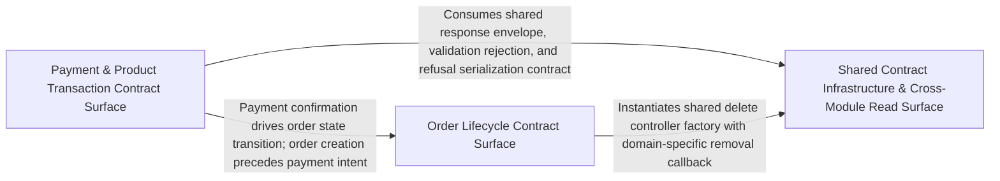

---
tags:
  - 2repo
  - 2repo/arch
  - project/boilerplate-node-backend
type: architecture
component: Generated_API_Contract_Models
---

## Details

The OpenAPI-generated TypeScript model types that form the shared data vocabulary between the HTTP layer and every domain module. These are pure type declarations (request/response envelopes, entity shapes, pagination wrappers) derived from openapi.yaml via orval. They are consumed by controllers, services, and the route handlers installed by the boot sequence, and they are the single source of truth for the wire format. This group is the contract surface of the subsystem — every request that enters through installRoutes is validated and serialized against these types.

### Payment & Product Transaction Contract Surface
The contract surface for the payment lifecycle and product/inventory write operations. Encompasses controllers that validate incoming requests against generated payment schemas (ConfirmPaymentBody, CreatePaymentIntentBody, refund bodies) and serialize responses into payment envelope types. Covers product retrieval, inventory write operations (adjustment, receipt), and wishlist seeding, all consuming generated request/response type declarations to enforce the wire format.

**Related Classes/Methods**:

- `src.modules.payments.controllers.post-payment-confirm.postPaymentConfirm`:20-58
- `src.modules.payments.controllers.post-payment-intent.postPaymentIntent`:15-29
- `src.modules.products.controllers.get-product-item.getProductItem`:15-35
- `src.modules.inventory.controllers.post-adjustment.postAdjustment`:16-51
- `src.infrastructure.http.uploads.resolveImageUrl`:73-76

**Source Files:**

- `src/infrastructure/http/errors.ts`
  - `src.infrastructure.http.errors.databaseErrorInterpreter` (L99-L129) - Function
- `src/infrastructure/http/middlewares/security.ts`
  - `src.infrastructure.http.middlewares.security.refuse` (L47-L62) - Class
  - `src.infrastructure.http.middlewares.security.refuse.<function>` (L49-L62) - Function
- `src/infrastructure/http/uploads.ts`
  - `src.infrastructure.http.uploads.resolveImageUrl` (L73-L76) - Function
- `src/modules/inventory/controllers/post-adjustment.ts`
  - `src.modules.inventory.controllers.post-adjustment.postAdjustment` (L16-L51) - Class
  - `src.modules.inventory.controllers.post-adjustment.postAdjustment.then() callback` (L37-L49) - Function
- `src/modules/inventory/model.ts`
  - `src.modules.inventory.model.StockMovementDocument` (L28-L33) - Interface
  - `src.modules.inventory.model.ReservationItem` (L107-L110) - Interface
  - `src.modules.inventory.model.ReservationDocument` (L122-L129) - Interface
- `src/modules/payments/controllers/get-payment-by-order.ts`
  - `src.modules.payments.controllers.get-payment-by-order.getPaymentByOrder` (L11-L18) - Class
  - `src.modules.payments.controllers.get-payment-by-order.getPaymentByOrder.then() callback` (L14-L17) - Function
- `src/modules/payments/controllers/post-payment-confirm.ts`
  - `src.modules.payments.controllers.post-payment-confirm.postPaymentConfirm` (L20-L58) - Class
  - `src.modules.payments.controllers.post-payment-confirm.postPaymentConfirm.then() callback` (L30-L56) - Function
- `src/modules/payments/controllers/post-payment-intent.ts`
  - `src.modules.payments.controllers.post-payment-intent.postPaymentIntent` (L15-L29) - Class
  - `src.modules.payments.controllers.post-payment-intent.postPaymentIntent.then() callback` (L24-L27) - Function
- `src/modules/products/controllers/get-product-item.ts`
  - `src.modules.products.controllers.get-product-item.getProductItem` (L15-L35) - Class
  - `src.modules.products.controllers.get-product-item.getProductItem.then() callback` (L19-L30) - Function
  - `src.modules.products.controllers.get-product-item.getProductItem.catch() callback` (L31-L35) - Function
- `src/modules/products/controllers/get-products.ts`
  - `src.modules.products.controllers.get-products.getProducts` (L65-L104) - Class
  - `src.modules.products.controllers.get-products.getProducts.then() callback` (L88-L102) - Function
- `src/modules/products/controllers/write-products.ts`
  - `src.modules.products.controllers.write-products.writeProducts` (L30-L173) - Class
  - `src.modules.products.controllers.write-products.writeProducts.then() callback` (L153-L167) - Function
  - `src.modules.products.controllers.write-products.writeProducts.then() callback.then() callback` (L155-L157) - Function
  - `src.modules.products.controllers.write-products.writeProducts.catch() callback` (L168-L171) - Function
  - `src.modules.products.controllers.write-products.writeProducts.catch() callback.then() callback` (L169-L171) - Function
- `src/modules/users/controllers/write-users.ts`
  - `src.modules.users.controllers.write-users.writeUsers` (L31-L150) - Class
  - `src.modules.users.controllers.write-users.writeUsers.then() callback` (L128-L142) - Function
  - `src.modules.users.controllers.write-users.writeUsers.then() callback.then() callback` (L130-L132) - Function
  - `src.modules.users.controllers.write-users.writeUsers.catch() callback` (L143-L148) - Function
  - `src.modules.users.controllers.write-users.writeUsers.catch() callback.then() callback` (L146-L148) - Function
- `src/modules/wishlist/demo.ts`
  - `src.modules.wishlist.demo.seedWishlistsCollection` (L48-L49) - Class
  - `src.modules.wishlist.demo.seedWishlistsCollection.wishlistFixtures.map() callback` (L49-L49) - Function
- `src/modules/wishlist/model.ts`
  - `src.modules.wishlist.model.WishlistItem` (L24-L26) - Interface
  - `src.modules.wishlist.model.WishlistDocument` (L34-L39) - Interface
- `src/types/asyncapi.generated.ts`
  - `src.types.asyncapi.generated.ObservabilityMetricsPayload` (L8-L14) - Interface
  - `src.types.asyncapi.generated.AnonymousSchema3` (L15-L20) - Interface
  - `src.types.asyncapi.generated.AnonymousSchema8` (L21-L24) - Interface
  - `src.types.asyncapi.generated.AnonymousSchema11` (L25-L27) - Interface
  - `src.types.asyncapi.generated.EmailJobPayload` (L28-L33) - Interface
  - `src.types.asyncapi.generated.AnonymousSchema13` (L34-L39) - Interface
  - `src.types.asyncapi.generated.PdfJobPayload` (L40-L44) - Interface
  - `src.types.asyncapi.generated.SseEventPayloadMap` (L81-L85) - Interface

### Order Lifecycle Contract Surface
The contract surface for the full order lifecycle and associated inventory operations. Encompasses controllers that validate order creation/update bodies, order cancellation, and order deletion against generated request schemas, and serialize order entities, invoices, and pagination wrappers into response envelope types. Also covers inventory operations tightly coupled to the order flow: stock movements, reservations sweep, and adjustments.

**Related Classes/Methods**:

- `src.modules.orders.controllers.write-orders.writeOrders`:29-131
- `src.modules.inventory.controllers.post-reservations-sweep.postReservationsSweep`:21-35
- `src.modules.inventory.controllers.get-stock-movements.getStockMovements`:24-41

**Source Files:**

- `src/modules/inventory/controllers/get-stock-movements.ts`
  - `src.modules.inventory.controllers.get-stock-movements.getStockMovements` (L24-L41) - Class
  - `src.modules.inventory.controllers.get-stock-movements.getStockMovements.then() callback` (L37-L39) - Function
- `src/modules/inventory/controllers/post-reservations-sweep.ts`
  - `src.modules.inventory.controllers.post-reservations-sweep.postReservationsSweep` (L21-L35) - Class
  - `src.modules.inventory.controllers.post-reservations-sweep.postReservationsSweep.then() callback` (L24-L34) - Function
- `src/modules/orders/controllers/get-orders.ts`
  - `src.modules.orders.controllers.get-orders.getOrders` (L45-L74) - Class
  - `src.modules.orders.controllers.get-orders.getOrders.then() callback` (L66-L72) - Function
- `src/modules/orders/controllers/write-orders.ts`
  - `src.modules.orders.controllers.write-orders.writeOrders` (L29-L131) - Class
  - `src.modules.orders.controllers.write-orders.writeOrders.then() callback` (L116-L129) - Function
- `src/modules/products/controllers/get-catalogue-facets.ts`
  - `src.modules.products.controllers.get-catalogue-facets.getCatalogueFacets` (L12-L18) - Class
  - `src.modules.products.controllers.get-catalogue-facets.getCatalogueFacets.then() callback` (L15-L17) - Function
- `src/modules/users/controllers/get-user-item.ts`
  - `src.modules.users.controllers.get-user-item.getUserItem` (L12-L26) - Class
  - `src.modules.users.controllers.get-user-item.getUserItem.then() callback` (L15-L21) - Function
  - `src.modules.users.controllers.get-user-item.getUserItem.catch() callback` (L22-L26) - Function
- `src/modules/users/controllers/get-users.ts`
  - `src.modules.users.controllers.get-users.queryBoolean` (L26-L29) - Class
  - `src.modules.users.controllers.get-users.queryBoolean.z.preprocess() callback` (L27-L27) - Function

### Shared Contract Infrastructure & Cross-Module Read Surface
The shared contract infrastructure and cross-module read operations that span multiple domain modules. Encompasses the DeleteControllerSpec factory and its handler as the single contract surface for all entity deletion endpoints, the security middleware (refuse) enforcing authorization, and cross-module read operations (inventory levels, stock movements, order list/item/invoice) sharing pagination, filtering, and envelope serialization contracts. This is the structural backbone of the contract surface.

**Related Classes/Methods**:

- `src.infrastructure.http.delete-controller.DeleteControllerSpec`:44-56
- `src.modules.inventory.controllers.get-inventory-levels.getInventoryLevels`:24-43

**Source Files:**

- `src/infrastructure/http/delete-controller.ts`
  - `src.infrastructure.http.delete-controller.DeleteControllerSpec` (L44-L56) - Interface
  - `src.infrastructure.http.delete-controller.createDeleteController.handler` (L72-L121) - Class
  - `src.infrastructure.http.delete-controller.createDeleteController.handler.[operation]` (L73-L120) - Method
  - `src.infrastructure.http.delete-controller.createDeleteController.handler.[operation].then() callback` (L99-L112) - Function
  - `src.infrastructure.http.delete-controller.createDeleteController.handler.[operation].catch() callback` (L113-L119) - Function
- `src/modules/inventory/controllers/get-inventory-levels.ts`
  - `src.modules.inventory.controllers.get-inventory-levels.getInventoryLevels` (L24-L43) - Class
  - `src.modules.inventory.controllers.get-inventory-levels.getInventoryLevels.then() callback` (L39-L41) - Function
- `src/modules/inventory/controllers/post-receipt.ts`
  - `src.modules.inventory.controllers.post-receipt.postReceipt` (L14-L38) - Class
  - `src.modules.inventory.controllers.post-receipt.postReceipt.then() callback` (L24-L36) - Function
- `src/modules/orders/controllers/delete-orders.ts`
  - `src.modules.orders.controllers.delete-orders.deleteOrders` (L14-L19) - Class
  - `src.modules.orders.controllers.delete-orders.deleteOrders.remove` (L16-L16) - Method
- `src/modules/orders/controllers/get-order-invoice.ts`
  - `src.modules.orders.controllers.get-order-invoice.getOrderInvoice` (L21-L73) - Class
  - `src.modules.orders.controllers.get-order-invoice.getOrderInvoice.then() callback` (L31-L71) - Function
  - `src.modules.orders.controllers.get-order-invoice.getOrderInvoice.then() callback.then() callback` (L61-L70) - Function
- `src/modules/orders/controllers/get-order-item.ts`
  - `src.modules.orders.controllers.get-order-item.getOrderItem` (L23-L45) - Class
  - `src.modules.orders.controllers.get-order-item.getOrderItem.then() callback` (L35-L43) - Function
- `src/modules/orders/controllers/post-cancel-order.ts`
  - `src.modules.orders.controllers.post-cancel-order.postCancelOrder` (L23-L56) - Class
  - `src.modules.orders.controllers.post-cancel-order.postCancelOrder.then() callback` (L33-L55) - Function
- `src/modules/payments/controllers/post-payment-refund.ts`
  - `src.modules.payments.controllers.post-payment-refund.postPaymentRefund` (L13-L20) - Class
  - `src.modules.payments.controllers.post-payment-refund.postPaymentRefund.then() callback` (L16-L19) - Function
- `src/modules/products/controllers/delete-products.ts`
  - `src.modules.products.controllers.delete-products.deleteProducts` (L13-L18) - Class
  - `src.modules.products.controllers.delete-products.deleteProducts.remove` (L15-L15) - Method
- `src/modules/users/controllers/delete-users.ts`
  - `src.modules.users.controllers.delete-users.deleteUsers` (L13-L18) - Class
  - `src.modules.users.controllers.delete-users.deleteUsers.remove` (L15-L15) - Method
- `src/modules/users/controllers/get-users.ts`
  - `src.modules.users.controllers.get-users.getUsers` (L52-L68) - Class
  - `src.modules.users.controllers.get-users.getUsers.then() callback` (L64-L66) - Function
