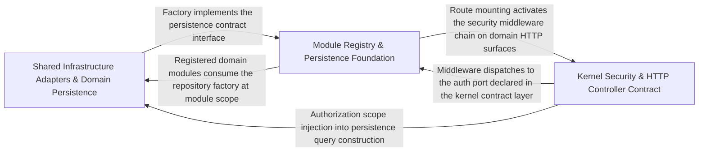

---
tags:
  - 2repo
  - 2repo/arch
  - project/boilerplate-node-backend
type: architecture
component: Kernel_HTTP_Infrastructure
---

## Details

The cross-cutting kernel (authentication, authorization, domain events, module registry) together with the shared HTTP infrastructure layer (controller, response, errors, uploads, validation) that every domain module builds on.

### Shared Infrastructure Adapters & Domain Persistence [[Expand]](./Shared_Infrastructure_Adapters_Domain_Persistence.md)
The concrete adapter and persistence layer that domain modules consume: file-storage adapters (upload validation, image store), HTTP error interpretation (ExtendedError, databaseErrorInterpreter, rejectDatabaseError), multipart upload extraction, text-search filter composition, and the createBaseRepository factory. Also includes the domain repositories (cart, delivery, inventory) that are the primary consumers of these shared patterns, binding the infrastructure to real query shapes.

**Related Classes/Methods**:

- `src.infrastructure.http.errors.ExtendedError`:23-72
- `src.infrastructure.persistence.base-repository.createBaseRepository`:222-346
- `src.infrastructure.persistence.search.addTextFilter`:133-143
- `src.infrastructure.adapters.storage.storeUploadedImages`:338-371

**Source Files:**

- `src/infrastructure/adapters/storage.ts`
  - `src.infrastructure.adapters.storage.validateUploadedImages` (L268-L315) - Class
  - `src.infrastructure.adapters.storage.validateUploadedImages.paths.map() callback` (L282-L282) - Function
  - `src.infrastructure.adapters.storage.validateUploadedImages.then() callback` (L283-L313) - Function
  - `src.infrastructure.adapters.storage.validateUploadedImages.then() callback.then() callback` (L304-L311) - Function
  - `src.infrastructure.adapters.storage.validateUploadedImages.catch() callback` (L314-L314) - Function
  - `src.infrastructure.adapters.storage.storeUploadedImages` (L338-L371) - Class
  - `src.infrastructure.adapters.storage.storeUploadedImages.staged.map() callback` (L348-L348) - Function
  - `src.infrastructure.adapters.storage.storeUploadedImages.then() callback` (L349-L369) - Function
  - `src.infrastructure.adapters.storage.storeUploadedImages.then() callback.results.map() callback` (L353-L353) - Function
  - `src.infrastructure.adapters.storage.storeUploadedImages.then() callback.staged.map() callback` (L362-L362) - Function
  - `src.infrastructure.adapters.storage.storeUploadedImages.then() callback.results.filter() callback` (L366-L366) - Function
  - `src.infrastructure.adapters.storage.storeUploadedImages.then() callback.map() callback` (L367-L367) - Function
  - `src.infrastructure.adapters.storage.storeUploadedImages.then() callback.then() callback` (L368-L368) - Function
- `src/infrastructure/http/errors.ts`
  - `src.infrastructure.http.errors.ExtendedError` (L23-L72) - Class
  - `src.infrastructure.http.errors.ExtendedError.constructor` (L42-L71) - Constructor
- `src/infrastructure/http/uploads.ts`
  - `src.infrastructure.http.uploads.getFormFiles` (L36-L56) - Function
- `src/infrastructure/i18n/negotiate.ts`
  - `src.infrastructure.i18n.negotiate.negotiateLocale.lowercaseSupported` (L31-L31) - Class
  - `src.infrastructure.i18n.negotiate.negotiateLocale.lowercaseSupported.supported.map() callback` (L31-L31) - Function
  - `src.infrastructure.i18n.negotiate.negotiateLocale.candidates` (L33-L53) - Class
  - `src.infrastructure.i18n.negotiate.negotiateLocale.candidates.map() callback` (L35-L50) - Function
  - `src.infrastructure.i18n.negotiate.negotiateLocale.candidates.map() callback.declared` (L37-L39) - Class
  - `src.infrastructure.i18n.negotiate.negotiateLocale.candidates.map() callback.declared.parameters.map() callback` (L38-L38) - Function
  - `src.infrastructure.i18n.negotiate.negotiateLocale.candidates.filter() callback` (L51-L51) - Function
  - `src.infrastructure.i18n.negotiate.negotiateLocale.candidates.toSorted() callback` (L53-L53) - Function
- `src/infrastructure/persistence/base-repository.ts`
  - `src.infrastructure.persistence.base-repository.createBaseRepository` (L222-L346) - Function
- `src/infrastructure/persistence/search.ts`
  - `src.infrastructure.persistence.search.addTextFilter` (L133-L143) - Class
  - `src.infrastructure.persistence.search.addTextFilter.fields.map() callback` (L140-L142) - Function
- `src/modules/account/model.ts`
  - `src.modules.account.model.AddressItem` (L19-L34) - Interface
  - `src.modules.account.model.AddressBookDocument` (L37-L42) - Interface
- `src/modules/cart/services/items.ts`
  - `src.modules.cart.services.items.upsertCartItem` (L66-L79) - Class
  - `src.modules.cart.services.items.upsertCartItem.then() callback` (L72-L79) - Function
  - `src.modules.cart.services.items.upsertCartItem.then() callback.then() callback` (L78-L78) - Function
- `src/modules/cart/services/reorder.ts`
  - `src.modules.cart.services.reorder.reorderIntoCart.<function>.requested` (L77-L83) - Class
  - `src.modules.cart.services.reorder.reorderIntoCart.<function>.requested.order.items.map() callback` (L77-L83) - Function
  - `src.modules.cart.services.reorder.reorderIntoCart.<function>.requested.map() callback` (L87-L90) - Function
  - `src.modules.cart.services.reorder.reorderIntoCart.<function>.requested.map() callback.then() callback` (L90-L90) - Function
- `src/modules/delivery/repository.ts`
  - `src.modules.delivery.repository.shipmentRepository` (L16-L45) - Class
  - `src.modules.delivery.repository.shipmentRepository.findByOrderId` (L26-L27) - Method
  - `src.modules.delivery.repository.shipmentRepository.upsertForOrder` (L34-L41) - Method
  - `src.modules.delivery.repository.shipmentRepository.findAllShipped` (L44-L44) - Method
- `src/modules/delivery/service.ts`
  - `src.modules.delivery.service.getForOrder` (L49-L59) - Class
  - `src.modules.delivery.service.getForOrder.then() callback` (L53-L59) - Function
  - `src.modules.delivery.service.getForOrder.then() callback.then() callback` (L55-L58) - Function
- `src/modules/inventory/metrics.ts`
  - `src.modules.inventory.metrics.productsLowStockTotal` (L23-L30) - Class
  - `src.modules.inventory.metrics.productsLowStockTotal.collect` (L27-L29) - Method
  - `src.modules.inventory.metrics.inventoryReservedUnitsTotal` (L41-L48) - Class
  - `src.modules.inventory.metrics.inventoryReservedUnitsTotal.collect` (L45-L47) - Method
- `src/modules/inventory/repository.ts`
  - `src.modules.inventory.repository.toReservationItems` (L31-L37) - Class
  - `src.modules.inventory.repository.toReservationItems.lines.map() callback` (L34-L37) - Function
  - `src.modules.inventory.repository.reservationRepository` (L59-L151) - Class
  - `src.modules.inventory.repository.reservationRepository.insertHold` (L89-L101) - Method
  - `src.modules.inventory.repository.reservationRepository.insertHold.then() callback` (L97-L97) - Function
  - `src.modules.inventory.repository.reservationRepository.insertHold.catch() callback` (L98-L101) - Function
  - `src.modules.inventory.repository.reservationRepository.findByOrderId` (L109-L110) - Method
  - `src.modules.inventory.repository.reservationRepository.claimStatus` (L125-L132) - Method
  - `src.modules.inventory.repository.reservationRepository.findExpired` (L145-L150) - Method
- `src/modules/inventory/service.ts`
  - `src.modules.inventory.service.StockLine` (L40-L43) - Interface
  - `src.modules.inventory.service.StockShortfall` (L46-L51) - Interface
  - `src.modules.inventory.service.MovementFilters` (L69-L72) - Interface
  - `src.modules.inventory.service.isStockBoundToOrder` (L292-L295) - Class
  - `src.modules.inventory.service.isStockBoundToOrder.then() callback` (L295-L295) - Function
  - `src.modules.inventory.service.listMovements` (L446-L453) - Class
  - `src.modules.inventory.service.listMovements.then() callback` (L453-L453) - Function
- `src/modules/locales/model.ts`
  - `src.modules.locales.model.LocaleDocument` (L30-L33) - Interface
  - `src.modules.locales.model.LocaleMessageDocument` (L36-L40) - Interface
  - `src.modules.locales.model.derivesBaseLanguage` (L131-L133) - Function
- `src/modules/locales/services/capabilities.ts`
  - `src.modules.locales.services.capabilities.mergeCapabilities` (L111-L135) - Class
  - `src.modules.locales.services.capabilities.mergeCapabilities.toSorted() callback` (L134-L134) - Function
- `src/modules/locales/services/entries.ts`
  - `src.modules.locales.services.entries.importEntries.survivors` (L181-L181) - Class
  - `src.modules.locales.services.entries.importEntries.survivors.stored.filter() callback` (L181-L181) - Function
- `src/modules/products/repository.ts`
  - `src.modules.products.repository.productRepository` (L39-L374) - Class
  - `src.modules.products.repository.productRepository.publicScope` (L78-L78) - Method
  - `src.modules.products.repository.productRepository.findByIdScoped` (L94-L95) - Method
  - `src.modules.products.repository.productRepository.findPublicById` (L108-L109) - Method
  - `src.modules.products.repository.productRepository.facets` (L120-L148) - Method
  - `src.modules.products.repository.productRepository.facets.then() callback` (L142-L148) - Function
  - `src.modules.products.repository.productRepository.facets.then() callback.categories.map() callback` (L143-L146) - Function
  - `src.modules.products.repository.productRepository.facets.then() callback.tags.map() callback` (L147-L147) - Function
  - `src.modules.products.repository.productRepository.reserveUnits` (L177-L188) - Method
  - `src.modules.products.repository.productRepository.reserveUnits.then() callback` (L188-L188) - Function
  - `src.modules.products.repository.productRepository.commitUnits` (L200-L212) - Method
  - `src.modules.products.repository.productRepository.commitUnits.then() callback` (L212-L212) - Function
  - `src.modules.products.repository.productRepository.releaseUnits` (L224-L232) - Method
  - `src.modules.products.repository.productRepository.releaseUnits.then() callback` (L232-L232) - Function
  - `src.modules.products.repository.productRepository.receiveUnits` (L241-L249) - Method
  - `src.modules.products.repository.productRepository.receiveUnits.then() callback` (L249-L249) - Function
  - `src.modules.products.repository.productRepository.adjustUnits` (L262-L273) - Method
  - `src.modules.products.repository.productRepository.adjustUnits.then() callback` (L273-L273) - Function
  - `src.modules.products.repository.productRepository.countLowAvailability` (L285-L291) - Method
  - `src.modules.products.repository.productRepository.sumReserved` (L302-L305) - Method
  - `src.modules.products.repository.productRepository.sumReserved.then() callback` (L305-L305) - Function
  - `src.modules.products.repository.productRepository.availabilityPage` (L329-L373) - Method
  - `src.modules.products.repository.productRepository.availabilityPage.then() callback` (L370-L373) - Function
- `src/modules/products/service.ts`
  - `src.modules.products.service.updateById` (L163-L170) - Class
  - `src.modules.products.service.updateById.then() callback` (L167-L170) - Function
  - `src.modules.products.service.updateById.then() callback.then() callback` (L169-L169) - Function
  - `src.modules.products.service.remove` (L185-L205) - Class
  - `src.modules.products.service.remove.then() callback` (L204-L204) - Function
  - `src.modules.products.service.removeById` (L214-L221) - Class
  - `src.modules.products.service.removeById.then() callback` (L218-L221) - Function
- `src/modules/wishlist/repository.ts`
  - `src.modules.wishlist.repository.wishlistRepository` (L25-L106) - Class
  - `src.modules.wishlist.repository.wishlistRepository.findByUserId` (L40-L41) - Method
  - `src.modules.wishlist.repository.wishlistRepository.addLine` (L61-L68) - Method
  - `src.modules.wishlist.repository.wishlistRepository.removeLine` (L75-L82) - Method
  - `src.modules.wishlist.repository.wishlistRepository.deleteByUserId` (L88-L94) - Method
  - `src.modules.wishlist.repository.wishlistRepository.deleteByUserId.then() callback` (L92-L94) - Function
  - `src.modules.wishlist.repository.wishlistRepository.removeProductFromAll` (L99-L105) - Method
- `src/modules/wishlist/service.ts`
  - `src.modules.wishlist.service.WishlistView` (L23-L25) - Interface
  - `src.modules.wishlist.service.toWishlistView.items.map() callback` (L29-L29) - Function
  - `src.modules.wishlist.service.wishlistGet` (L35-L36) - Class
  - `src.modules.wishlist.service.wishlistGet.then() callback` (L36-L36) - Function
  - `src.modules.wishlist.service.wishlistAdd` (L45-L56) - Class
  - `src.modules.wishlist.service.wishlistAdd.then() callback` (L49-L56) - Function
  - `src.modules.wishlist.service.wishlistAdd.then() callback.then() callback` (L53-L54) - Function
  - `src.modules.wishlist.service.wishlistRemove` (L64-L71) - Class
  - `src.modules.wishlist.service.wishlistRemove.then() callback` (L68-L71) - Function
  - `src.modules.wishlist.service.wishlistMoveToCart` (L88-L107) - Class
  - `src.modules.wishlist.service.wishlistMoveToCart.then() callback` (L92-L107) - Function
  - `src.modules.wishlist.service.wishlistMoveToCart.then() callback.saved` (L93-L93) - Class
  - `src.modules.wishlist.service.wishlistMoveToCart.then() callback.saved.wishlist.items.some() callback` (L93-L93) - Function
  - `src.modules.wishlist.service.wishlistMoveToCart.then() callback.then() callback` (L96-L106) - Function
  - `src.modules.wishlist.service.wishlistMoveToCart.then() callback.then() callback.then() callback` (L103-L104) - Function

### Kernel Security & HTTP Controller Contract [[Expand]](./Kernel_Security_HTTP_Controller_Contract.md)
The security kernel and the HTTP controller contract. On the kernel side: the AuthResolver port (access-token resolution), the two shared authorization scope builders (createOwnerScope, createVisibilityScope) that encode the admin reads all, everyone else reads a narrowed slice rule, and the Express middlewares (getAuth, isAuth, isAdmin, isAdminViaCookie) that enforce route-level access. On the HTTP side: the controller helpers (parseBody, validationErrors, refused, catchAs) that define the four-step contract every domain controller follows — validate, call service, branch on envelope, catch.

**Related Classes/Methods**:

- `src.kernel.authorization.createOwnerScope`:52-53
- `src.kernel.middlewares.authorizations.getAuth`:24-48

**Source Files:**

- `src/infrastructure/http/controller.ts`
  - `src.infrastructure.http.controller.validationErrors` (L55-L63) - Class
  - `src.infrastructure.http.controller.validationErrors.error.issues.map() callback` (L56-L63) - Function
- `src/infrastructure/persistence/base-repository.ts`
  - `src.infrastructure.persistence.base-repository.createBaseRepository.search.then() callback.then() callback` (L324-L327) - Function
- `src/kernel/authentication.ts`
  - `src.kernel.authentication.resolveAccessToken` (L55-L56) - Class
  - `src.kernel.authentication.resolveAccessToken.then() callback` (L56-L56) - Function
- `src/kernel/authorization.ts`
  - `src.kernel.authorization.createOwnerScope` (L52-L53) - Class
  - `src.kernel.authorization.createOwnerScope.restrictNonAdmin() callback` (L53-L53) - Function
- `src/kernel/middlewares/authorizations.ts`
  - `src.kernel.middlewares.authorizations.getAuth` (L24-L48) - Class
  - `src.kernel.middlewares.authorizations.getAuth.then() callback` (L33-L43) - Function
  - `src.kernel.middlewares.authorizations.getAuth.catch() callback` (L44-L46) - Function
- `src/kernel/registry.ts`
  - `src.kernel.registry.ContextEdge` (L31-L43) - Interface
- `src/modules/account/repository.ts`
  - `src.modules.account.repository.addressBookRepository` (L23-L121) - Class
  - `src.modules.account.repository.addressBookRepository.findByUserId` (L42-L43) - Method
  - `src.modules.account.repository.addressBookRepository.addEntry` (L52-L62) - Method
  - `src.modules.account.repository.addressBookRepository.updateEntry` (L72-L94) - Method
  - `src.modules.account.repository.addressBookRepository.removeEntry` (L100-L109) - Method
  - `src.modules.account.repository.addressBookRepository.removeEntry.book.items.filter() callback` (L105-L105) - Function
  - `src.modules.account.repository.addressBookRepository.deleteByUserId` (L114-L120) - Method
  - `src.modules.account.repository.addressBookRepository.deleteByUserId.then() callback` (L118-L120) - Function
- `src/modules/account/services/addresses.ts`
  - `src.modules.account.services.addresses.addressesGet` (L47-L48) - Class
  - `src.modules.account.services.addresses.addressesGet.then() callback` (L48-L48) - Function
  - `src.modules.account.services.addresses.addressAdd` (L51-L57) - Class
  - `src.modules.account.services.addresses.addressAdd.then() callback` (L57-L57) - Function
  - `src.modules.account.services.addresses.addressUpdate` (L60-L68) - Class
  - `src.modules.account.services.addresses.addressUpdate.then() callback` (L65-L68) - Function
  - `src.modules.account.services.addresses.addressRemove` (L71-L78) - Class
  - `src.modules.account.services.addresses.addressRemove.then() callback` (L75-L78) - Function
  - `src.modules.account.services.addresses.addressForCheckout` (L89-L97) - Class
  - `src.modules.account.services.addresses.addressForCheckout.then() callback` (L93-L97) - Function
  - `src.modules.account.services.addresses.addressForCheckout.then() callback.book.items.find() callback` (L96-L96) - Function
- `src/modules/account/services/authentication.ts`
  - `src.modules.account.services.authentication.signup` (L50-L100) - Class
  - `src.modules.account.services.authentication.signup.parseResult` (L60-L77) - Class
  - `src.modules.account.services.authentication.signup.parseResult.superRefine() callback` (L64-L70) - Function
  - `src.modules.account.services.authentication.signup.then() callback` (L84-L98) - Function
  - `src.modules.account.services.authentication.signup.then() callback.then() callback` (L97-L97) - Function
  - `src.modules.account.services.authentication.signup.catch() callback` (L99-L99) - Function
  - `src.modules.account.services.authentication.login` (L105-L131) - Class
  - `src.modules.account.services.authentication.login.then() callback` (L121-L128) - Function
  - `src.modules.account.services.authentication.login.then() callback.then() callback` (L124-L127) - Function
  - `src.modules.account.services.authentication.login.catch() callback` (L129-L129) - Function
- `src/modules/account/services/profile.ts`
  - `src.modules.account.services.profile.validatePasswordChange.parseResult` (L44-L62) - Class
  - `src.modules.account.services.profile.validatePasswordChange.parseResult.superRefine() callback` (L51-L58) - Function
  - `src.modules.account.services.profile.passwordChange` (L71-L85) - Class
  - `src.modules.account.services.profile.passwordChange.then() callback` (L83-L83) - Function
  - `src.modules.account.services.profile.passwordChange.catch() callback` (L84-L84) - Function
  - `src.modules.account.services.profile.updateProfile` (L121-L145) - Class
  - `src.modules.account.services.profile.updateProfile.then() callback` (L135-L142) - Function
  - `src.modules.account.services.profile.updateProfile.catch() callback` (L143-L143) - Function
  - `src.modules.account.services.profile.passwordChangeWithCurrent` (L159-L183) - Class
  - `src.modules.account.services.profile.passwordChangeWithCurrent.then() callback` (L172-L180) - Function
  - `src.modules.account.services.profile.passwordChangeWithCurrent.then() callback.then() callback` (L175-L179) - Function
  - `src.modules.account.services.profile.passwordChangeWithCurrent.catch() callback` (L181-L181) - Function
- `src/modules/cart/repository.ts`
  - `src.modules.cart.repository.cartRepository` (L78-L184) - Class
  - `src.modules.cart.repository.cartRepository.findByUserId` (L100-L100) - Method
  - `src.modules.cart.repository.cartRepository.removeLine` (L111-L118) - Method
  - `src.modules.cart.repository.cartRepository.clearLines` (L124-L131) - Method
  - `src.modules.cart.repository.cartRepository.clearLinesIfUnchanged` (L150-L158) - Method
  - `src.modules.cart.repository.cartRepository.deleteByUserId` (L166-L172) - Method
  - `src.modules.cart.repository.cartRepository.deleteByUserId.then() callback` (L170-L172) - Function
  - `src.modules.cart.repository.cartRepository.removeProductFromAll` (L177-L183) - Method
- `src/modules/cart/services/checkout.ts`
  - `src.modules.cart.services.checkout.toStockLines` (L38-L39) - Class
  - `src.modules.cart.services.checkout.toStockLines.lines.map() callback` (L39-L39) - Function
  - `src.modules.cart.services.checkout.orderConfirm` (L81-L264) - Class
  - `src.modules.cart.services.checkout.orderConfirm.then() callback` (L88-L263) - Function
  - `src.modules.cart.services.checkout.orderConfirm.then() callback.then() callback.then() callback` (L128-L261) - Function
  - `src.modules.cart.services.checkout.orderConfirm.then() callback.then() callback.then() callback.then() callback` (L192-L260) - Function
  - `src.modules.cart.services.checkout.orderConfirm.then() callback.then() callback.then() callback.then() callback.then() callback.then() callback` (L251-L257) - Function
  - `src.modules.cart.services.checkout.orderConfirm.catch() callback` (L264-L264) - Function
- `src/modules/cart/services/cleanup.ts`
  - `src.modules.cart.services.cleanup.productRemoveFromCartsById` (L31-L43) - Class
  - `src.modules.cart.services.cleanup.productRemoveFromCartsById.then() callback` (L36-L41) - Function
  - `src.modules.cart.services.cleanup.productRemoveFromCartsById.catch() callback` (L43-L43) - Function
- `src/modules/cart/services/items.ts`
  - `src.modules.cart.services.items.cartGet` (L24-L25) - Class
  - `src.modules.cart.services.items.cartGet.then() callback` (L25-L25) - Function
  - `src.modules.cart.services.items.cartGetWithSummary` (L30-L31) - Class
  - `src.modules.cart.services.items.cartGetWithSummary.then() callback` (L31-L31) - Function
  - `src.modules.cart.services.items.cartRemove` (L126-L127) - Class
  - `src.modules.cart.services.items.cartRemove.then() callback` (L127-L127) - Function
- `src/modules/cart/services/reorder.ts`
  - `src.modules.cart.services.reorder.ReorderLine` (L26-L31) - Interface
  - `src.modules.cart.services.reorder.reorderIntoCart` (L62-L116) - Class
  - `src.modules.cart.services.reorder.reorderIntoCart.then() callback` (L68-L115) - Function
  - `src.modules.cart.services.reorder.reorderIntoCart.then() callback.then() callback` (L92-L114) - Function
  - `src.modules.cart.services.reorder.<function>.then() callback.then() callback` (L112-L112) - Function
  - `src.modules.cart.services.reorder.reorderIntoCart.then() callback.then() callback.then() callback` (L113-L113) - Function
  - `src.modules.cart.services.reorder.reorderIntoCart.catch() callback` (L116-L116) - Function
- `src/modules/delivery/domain/rates.ts`
  - `src.modules.delivery.domain.rates.findShippingMethod` (L29-L30) - Class
  - `src.modules.delivery.domain.rates.findShippingMethod.SHIPPING_METHODS.find() callback` (L30-L30) - Function
- `src/modules/feedback/service.ts`
  - `src.modules.feedback.service.updateStatus` (L78-L88) - Class
  - `src.modules.feedback.service.updateStatus.then() callback` (L87-L87) - Function
  - `src.modules.feedback.service.updateStatusById` (L90-L97) - Class
  - `src.modules.feedback.service.updateStatusById.then() callback` (L94-L97) - Function
- `src/modules/locales/repository.ts`
  - `src.modules.locales.repository.importEntries.removedKeys` (L233-L233) - Class
  - `src.modules.locales.repository.importEntries.removedKeys.filter() callback` (L233-L233) - Function
  - `src.modules.locales.repository.importEntries.created` (L249-L249) - Class
  - `src.modules.locales.repository.importEntries.created.filter() callback` (L249-L249) - Function
- `src/modules/locales/services/entries.ts`
  - `src.modules.locales.services.entries.importEntries.keys` (L154-L154) - Class
  - `src.modules.locales.services.entries.importEntries.keys.inputs.map() callback` (L154-L154) - Function
- `src/modules/locales/services/keys.ts`
  - `src.modules.locales.services.keys.findUnsafeKeySegment` (L76-L77) - Class
  - `src.modules.locales.services.keys.findUnsafeKeySegment.find() callback` (L77-L77) - Function
- `src/modules/products/repository.ts`
  - `src.modules.products.repository.AvailabilityRow` (L18-L24) - Interface
- `src/modules/users/service.ts`
  - `src.modules.users.service.update` (L85-L100) - Class
  - `src.modules.users.service.update.then() callback` (L99-L99) - Function
  - `src.modules.users.service.updateById.then() callback` (L113-L116) - Function
  - `src.modules.users.service.remove` (L130-L145) - Class
  - `src.modules.users.service.remove.then() callback` (L144-L144) - Function
  - `src.modules.users.service.removeById` (L219-L226) - Class
  - `src.modules.users.service.removeById.then() callback` (L223-L226) - Function

### Module Registry & Persistence Foundation [[Expand]](./Module_Registry_Persistence_Foundation.md)
The module lifecycle and the persistence class hierarchy. The registry defines the typed AppModule manifest (common fields, RoutedModule vs HeadlessModule, DemoExport), validates the dependency DAG (validateModules), and wires domain-event subscriptions (registerModules). The BaseRepository class is the abstract persistence contract — the find, findOne, create, update, delete surface that every domain repository implements. The full authentication port (both resolveAccessToken and resolveRefreshToken) and the authorization scope builders appear here in their definition role, alongside capabilities and demo-export classification.

**Related Classes/Methods**:

- `src.kernel.registry.AppModuleCommon`:58-94
- `src.kernel.registry.RoutedModule`:137-143
- `src.infrastructure.persistence.base-repository.BaseRepository`:164-209
- `src.kernel.authentication.resolveRefreshToken`:59-60

**Source Files:**

- `src/infrastructure/persistence/base-repository.ts`
  - `src.infrastructure.persistence.base-repository.BaseRepository` (L164-L209) - Interface
  - `src.infrastructure.persistence.base-repository.createBaseRepository.buildWhere` (L344-L344) - Method
- `src/kernel/authentication.ts`
  - `src.kernel.authentication.resolveRefreshToken` (L59-L60) - Class
  - `src.kernel.authentication.resolveRefreshToken.then() callback` (L60-L60) - Function
- `src/kernel/authorization.ts`
  - `src.kernel.authorization.createVisibilityScope` (L67-L68) - Class
  - `src.kernel.authorization.createVisibilityScope.restrictNonAdmin() callback` (L68-L68) - Function
- `src/kernel/middlewares/authorizations.ts`
  - `src.kernel.middlewares.authorizations.isAdminViaCookie` (L135-L176) - Class
  - `src.kernel.middlewares.authorizations.isAdminViaCookie.then() callback` (L147-L170) - Function
  - `src.kernel.middlewares.authorizations.isAdminViaCookie.catch() callback` (L171-L174) - Function
- `src/kernel/registry.ts`
  - `src.kernel.registry.AppModuleCommon` (L58-L94) - Interface
  - `src.kernel.registry.RoutedModule` (L137-L143) - Interface
  - `src.kernel.registry.HeadlessModule` (L152-L155) - Interface
- `src/modules/locales/demo.ts`
  - `src.modules.locales.demo.seedLocalesCollection.languages` (L273-L275) - Class
  - `src.modules.locales.demo.seedLocalesCollection.languages.localeFixtures.map() callback` (L274-L274) - Function
  - `src.modules.locales.demo.seedLocalesCollection.entries` (L276-L278) - Class
  - `src.modules.locales.demo.seedLocalesCollection.entries.localeEntryFixtures.map() callback` (L277-L277) - Function
- `src/modules/locales/repository.ts`
  - `src.modules.locales.repository.EntryInput` (L37-L40) - Interface
  - `src.modules.locales.repository.ImportCounts` (L43-L47) - Interface
  - `src.modules.locales.repository.countEntriesByLocale` (L107-L119) - Class
  - `src.modules.locales.repository.countEntriesByLocale.rows.map() callback` (L118-L118) - Function
  - `src.modules.locales.repository.listKeys` (L158-L166) - Class
  - `src.modules.locales.repository.listKeys.rows.map() callback` (L165-L165) - Function
  - `src.modules.locales.repository.importEntries` (L224-L259) - Class
  - `src.modules.locales.repository.importEntries.incoming` (L231-L231) - Class
  - `src.modules.locales.repository.importEntries.incoming.inputs.map() callback` (L231-L231) - Function
  - `src.modules.locales.repository.importEntries.map() callback` (L237-L243) - Function
- `src/modules/locales/services/entries.ts`
  - `src.modules.locales.services.entries.importEntries.inputs` (L153-L153) - Class
  - `src.modules.locales.services.entries.importEntries.inputs.entries.map() callback` (L153-L153) - Function
  - `src.modules.locales.services.entries.importEntries.unsafe` (L160-L160) - Class
  - `src.modules.locales.services.entries.importEntries.unsafe.keys.find() callback` (L160-L160) - Function
- `src/modules/locales/tenants.ts`
  - `src.modules.locales.tenants.extraFrontendTenants` (L38-L46) - Class
  - `src.modules.locales.tenants.extraFrontendTenants.filter() callback` (L42-L42) - Function
  - `src.modules.locales.tenants.extraFrontendTenants.map() callback` (L43-L46) - Function
  - `src.modules.locales.tenants.listTenants` (L49-L60) - Class
  - `src.modules.locales.tenants.listTenants.rows.filter() callback` (L59-L59) - Function
  - `src.modules.locales.tenants.frontendTenantIds` (L63-L66) - Class
  - `src.modules.locales.tenants.frontendTenantIds.filter() callback` (L65-L65) - Function
  - `src.modules.locales.tenants.frontendTenantIds.map() callback` (L66-L66) - Function
- `src/modules/orders/domain/lifecycle.ts`
  - `src.modules.orders.domain.lifecycle.statusesReachableFrom` (L75-L79) - Class
  - `src.modules.orders.domain.lifecycle.statusesReachableFrom.filter() callback` (L79-L79) - Function
  - `src.modules.orders.domain.lifecycle.statusesLeadingTo` (L91-L92) - Class
  - `src.modules.orders.domain.lifecycle.statusesLeadingTo.filter() callback` (L92-L92) - Function
- `src/modules/orders/repository.ts`
  - `src.modules.orders.repository.search` (L57-L85) - Class
  - `src.modules.orders.repository.search.then() callback` (L72-L83) - Function
  - `src.modules.orders.repository.search.then() callback.then() callback` (L79-L82) - Function
  - `src.modules.orders.repository.findByIdScoped` (L110-L122) - Class
  - `src.modules.orders.repository.findByIdScoped.then() callback` (L117-L120) - Function
- `src/modules/orders/service.ts`
  - `src.modules.orders.service.create` (L79-L145) - Class
  - `src.modules.orders.service.create.items.map() callback` (L88-L89) - Function
  - `src.modules.orders.service.create.items.map() callback.then() callback` (L89-L89) - Function
  - `src.modules.orders.service.create.then() callback` (L91-L144) - Function
  - `src.modules.orders.service.create.then() callback.then() callback` (L121-L143) - Function
  - `src.modules.orders.service.update` (L159-L257) - Class
  - `src.modules.orders.service.update.updateItemsPromise` (L213-L241) - Class
  - `src.modules.orders.service.updateItemsPromise.then() callback` (L215-L240) - Function
  - `src.modules.orders.service.update.updateItemsPromise.then() callback.requestedItems.map() callback` (L225-L228) - Function
  - `src.modules.orders.service.update.updateItemsPromise.then() callback.requestedItems.map() callback.then() callback` (L228-L228) - Function
  - `src.modules.orders.service.updateItemsPromise.then() callback.then() callback` (L230-L239) - Function
  - `src.modules.orders.service.update.updateItemsPromise.then() callback.then() callback.resolvedItems.map() callback` (L234-L237) - Function
  - `src.modules.orders.service.update.updateItemsPromise.then() callback` (L243-L256) - Function
  - `src.modules.orders.service.update.updateItemsPromise.then() callback.then() callback` (L245-L255) - Function
  - `src.modules.orders.service.updateById` (L266-L278) - Class
  - `src.modules.orders.service.updateById.then() callback` (L275-L278) - Function
  - `src.modules.orders.service.remove` (L293-L318) - Class
  - `src.modules.orders.service.remove.then() callback` (L317-L317) - Function
  - `src.modules.orders.service.removeById` (L327-L334) - Class
  - `src.modules.orders.service.removeById.then() callback` (L331-L334) - Function
  - `src.modules.orders.service.withActions` (L378-L393) - Function
  - `src.modules.orders.service.cancelById` (L407-L470) - Class
  - `src.modules.orders.service.cancelById.then() callback` (L431-L469) - Function
  - `src.modules.orders.service.cancelById.then() callback.then() callback` (L459-L467) - Function
- `src/modules/payments/providers/fake.ts`
  - `src.modules.payments.providers.fake.fakePaymentProvider` (L36-L52) - Class
  - `src.modules.payments.providers.fake.fakePaymentProvider.charge` (L39-L46) - Method
  - `src.modules.payments.providers.fake.fakePaymentProvider.refund` (L48-L51) - Method
- `src/modules/payments/providers/index.ts`
  - `src.modules.payments.providers.index.PaymentProvider` (L24-L43) - Interface
  - `src.modules.payments.providers.index.PaymentProvider.charge` (L36-L36) - Method
  - `src.modules.payments.providers.index.PaymentProvider.refund` (L42-L42) - Method
- `src/modules/payments/repository.ts`
  - `src.modules.payments.repository.paymentRepository` (L21-L126) - Class
  - `src.modules.payments.repository.paymentRepository.ownerScope` (L58-L58) - Method
  - `src.modules.payments.repository.paymentRepository.findByIdScoped` (L71-L72) - Method
  - `src.modules.payments.repository.paymentRepository.findByOrderId` (L81-L82) - Method
  - `src.modules.payments.repository.paymentRepository.upsertIntent` (L95-L112) - Method
  - `src.modules.payments.repository.paymentRepository.upsertIntent.catch() callback` (L109-L112) - Function
  - `src.modules.payments.repository.paymentRepository.updateStatusIfIn` (L118-L125) - Method
- `src/modules/payments/service.ts`
  - `src.modules.payments.service.resolvePayerId` (L79-L89) - Class
  - `src.modules.payments.service.resolvePayerId.then() callback` (L82-L88) - Function
  - `src.modules.payments.service.resolvePayerId.catch() callback` (L89-L89) - Function
  - `src.modules.payments.service.createIntent` (L113-L144) - Class
  - `src.modules.payments.service.createIntent.then() callback` (L117-L144) - Function
  - `src.modules.payments.service.createIntent.then() callback.then() callback` (L134-L142) - Function
  - `src.modules.payments.service.confirmPayment` (L158-L228) - Class
  - `src.modules.payments.service.confirmPayment.then() callback` (L163-L228) - Function
  - `src.modules.payments.service.getForOrder` (L236-L248) - Class
  - `src.modules.payments.service.getForOrder.then() callback` (L240-L248) - Function
  - `src.modules.payments.service.getForOrder.then() callback.then() callback` (L247-L247) - Function
  - `src.modules.payments.service.performRefund` (L286-L299) - Class
  - `src.modules.payments.service.performRefund.then() callback` (L289-L299) - Function
  - `src.modules.payments.service.performRefund.then() callback.then() callback` (L293-L298) - Function
  - `src.modules.payments.service.refundByOrder` (L311-L330) - Class
  - `src.modules.payments.service.refundByOrder.then() callback` (L315-L330) - Function
  - `src.modules.payments.service.refundByOrder.then() callback.then() callback` (L320-L328) - Function
  - `src.modules.payments.service.refundForOrder` (L342-L343) - Class
  - `src.modules.payments.service.refundForOrder.then() callback` (L343-L343) - Function
