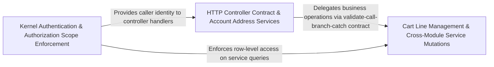

---
tags:
  - 2repo
  - 2repo/arch
  - project/boilerplate-node-backend
type: architecture
component: Kernel_Security_HTTP_Controller_Contract
---

## Details

The security kernel and the HTTP controller contract. On the kernel side: the AuthResolver port (access-token resolution), the two shared authorization scope builders (createOwnerScope, createVisibilityScope) that encode the admin reads all, everyone else reads a narrowed slice rule, and the Express middlewares (getAuth, isAuth, isAdmin, isAdminViaCookie) that enforce route-level access. On the HTTP side: the controller helpers (parseBody, validationErrors, refused, catchAs) that define the four-step contract every domain controller follows — validate, call service, branch on envelope, catch.

### HTTP Controller Contract & Account Address Services
The HTTP contract layer plus the account domain that most directly exercises it. It contains the four-step controller helpers (parseBody for Zod validation, validationErrors for mapping ZodError issues to ResponseErrorItem, refused for branching on the service envelope, and catchAs for the catch callback) and the account address services (addressAdd, addressForCheckout, addressRemove, addressUpdate, addressesGet) with the address book repository. These helpers are deliberately written as helpers rather than a wrapper so the literal .catch stays at the call site for the ESLint rule and TypeScript narrowing is preserved. The boundary is the Express Response object: everything in this group either reads the request or writes the response. The account address services serve as the reference implementation of the validate-call-branch-catch flow.

**Related Classes/Methods**:

- `src.infrastructure.http.controller.validationErrors`:55-63
- `src.modules.account.repository.addressBookRepository`:23-121

**Source Files:**

- `src/infrastructure/http/controller.ts`
  - `src.infrastructure.http.controller.validationErrors` (L55-L63) - Class
  - `src.infrastructure.http.controller.validationErrors.error.issues.map() callback` (L56-L63) - Function
- `src/infrastructure/persistence/base-repository.ts`
  - `src.infrastructure.persistence.base-repository.createBaseRepository.search.then() callback.then() callback` (L324-L327) - Function
- `src/kernel/registry.ts`
  - `src.kernel.registry.ContextEdge` (L31-L43) - Interface
- `src/modules/account/repository.ts`
  - `src.modules.account.repository.addressBookRepository` (L23-L121) - Class
  - `src.modules.account.repository.addressBookRepository.findByUserId` (L42-L43) - Method
  - `src.modules.account.repository.addressBookRepository.addEntry` (L52-L62) - Method
  - `src.modules.account.repository.addressBookRepository.updateEntry` (L72-L94) - Method
  - `src.modules.account.repository.addressBookRepository.removeEntry` (L100-L109) - Method
  - `src.modules.account.repository.addressBookRepository.removeEntry.book.items.filter() callback` (L105-L105) - Function
  - `src.modules.account.repository.addressBookRepository.deleteByUserId` (L114-L120) - Method
  - `src.modules.account.repository.addressBookRepository.deleteByUserId.then() callback` (L118-L120) - Function
- `src/modules/account/services/addresses.ts`
  - `src.modules.account.services.addresses.addressesGet` (L47-L48) - Class
  - `src.modules.account.services.addresses.addressesGet.then() callback` (L48-L48) - Function
  - `src.modules.account.services.addresses.addressAdd` (L51-L57) - Class
  - `src.modules.account.services.addresses.addressAdd.then() callback` (L57-L57) - Function
  - `src.modules.account.services.addresses.addressUpdate` (L60-L68) - Class
  - `src.modules.account.services.addresses.addressUpdate.then() callback` (L65-L68) - Function
  - `src.modules.account.services.addresses.addressRemove` (L71-L78) - Class
  - `src.modules.account.services.addresses.addressRemove.then() callback` (L75-L78) - Function
  - `src.modules.account.services.addresses.addressForCheckout` (L89-L97) - Class
  - `src.modules.account.services.addresses.addressForCheckout.then() callback` (L93-L97) - Function
  - `src.modules.account.services.addresses.addressForCheckout.then() callback.book.items.find() callback` (L96-L96) - Function
- `src/modules/account/services/authentication.ts`
  - `src.modules.account.services.authentication.signup` (L50-L100) - Class
  - `src.modules.account.services.authentication.signup.parseResult` (L60-L77) - Class
  - `src.modules.account.services.authentication.signup.parseResult.superRefine() callback` (L64-L70) - Function
  - `src.modules.account.services.authentication.signup.then() callback` (L84-L98) - Function
  - `src.modules.account.services.authentication.signup.then() callback.then() callback` (L97-L97) - Function
  - `src.modules.account.services.authentication.signup.catch() callback` (L99-L99) - Function
  - `src.modules.account.services.authentication.login` (L105-L131) - Class
  - `src.modules.account.services.authentication.login.then() callback` (L121-L128) - Function
  - `src.modules.account.services.authentication.login.then() callback.then() callback` (L124-L127) - Function
  - `src.modules.account.services.authentication.login.catch() callback` (L129-L129) - Function
- `src/modules/account/services/profile.ts`
  - `src.modules.account.services.profile.validatePasswordChange.parseResult` (L44-L62) - Class
  - `src.modules.account.services.profile.validatePasswordChange.parseResult.superRefine() callback` (L51-L58) - Function
  - `src.modules.account.services.profile.passwordChange` (L71-L85) - Class
  - `src.modules.account.services.profile.passwordChange.then() callback` (L83-L83) - Function
  - `src.modules.account.services.profile.passwordChange.catch() callback` (L84-L84) - Function
  - `src.modules.account.services.profile.updateProfile` (L121-L145) - Class
  - `src.modules.account.services.profile.updateProfile.then() callback` (L135-L142) - Function
  - `src.modules.account.services.profile.updateProfile.catch() callback` (L143-L143) - Function
  - `src.modules.account.services.profile.passwordChangeWithCurrent` (L159-L183) - Class
  - `src.modules.account.services.profile.passwordChangeWithCurrent.then() callback` (L172-L180) - Function
  - `src.modules.account.services.profile.passwordChangeWithCurrent.then() callback.then() callback` (L175-L179) - Function
  - `src.modules.account.services.profile.passwordChangeWithCurrent.catch() callback` (L181-L181) - Function
- `src/modules/cart/services/checkout.ts`
  - `src.modules.cart.services.checkout.toStockLines` (L38-L39) - Class
  - `src.modules.cart.services.checkout.toStockLines.lines.map() callback` (L39-L39) - Function
  - `src.modules.cart.services.checkout.orderConfirm` (L81-L264) - Class
  - `src.modules.cart.services.checkout.orderConfirm.then() callback` (L88-L263) - Function
  - `src.modules.cart.services.checkout.orderConfirm.then() callback.then() callback.then() callback` (L128-L261) - Function
  - `src.modules.cart.services.checkout.orderConfirm.then() callback.then() callback.then() callback.then() callback` (L192-L260) - Function
  - `src.modules.cart.services.checkout.orderConfirm.then() callback.then() callback.then() callback.then() callback.then() callback.then() callback` (L251-L257) - Function
  - `src.modules.cart.services.checkout.orderConfirm.catch() callback` (L264-L264) - Function
- `src/modules/delivery/domain/rates.ts`
  - `src.modules.delivery.domain.rates.findShippingMethod` (L29-L30) - Class
  - `src.modules.delivery.domain.rates.findShippingMethod.SHIPPING_METHODS.find() callback` (L30-L30) - Function
- `src/modules/products/repository.ts`
  - `src.modules.products.repository.AvailabilityRow` (L18-L24) - Interface

### Cart Line Management & Cross-Module Service Mutations
The service-mutation layer that the HTTP controller contract wraps. It contains the concrete business operations that controllers invoke after validation: the cart repository (persistence boundary for cart lines with findByUserId, clearLines, clearLinesIfUnchanged, removeLine, removeProductFromAll, deleteByUserId); cart services (orderConfirm for checkout hand-off and productRemoveFromCartsById for cleanup fan-out); and cross-module service mutations (feedback.service.updateStatus for admin status transitions and users.service.update for profile mutation). The boundary is the service envelope: every method returns the ServiceResult<TData> shape that refused() and the success-branch in the controller consume. This group sits between the controller contract above and the repository/persistence below, where the business decision is made.

**Related Classes/Methods**:

- `src.modules.cart.repository.cartRepository`:78-184
- `src.modules.cart.services.cleanup.productRemoveFromCartsById`:31-43
- `src.modules.feedback.service.updateStatus`:78-88
- `src.modules.users.service.update`:85-100

**Source Files:**

- `src/modules/cart/repository.ts`
  - `src.modules.cart.repository.cartRepository` (L78-L184) - Class
  - `src.modules.cart.repository.cartRepository.findByUserId` (L100-L100) - Method
  - `src.modules.cart.repository.cartRepository.removeLine` (L111-L118) - Method
  - `src.modules.cart.repository.cartRepository.clearLines` (L124-L131) - Method
  - `src.modules.cart.repository.cartRepository.clearLinesIfUnchanged` (L150-L158) - Method
  - `src.modules.cart.repository.cartRepository.deleteByUserId` (L166-L172) - Method
  - `src.modules.cart.repository.cartRepository.deleteByUserId.then() callback` (L170-L172) - Function
  - `src.modules.cart.repository.cartRepository.removeProductFromAll` (L177-L183) - Method
- `src/modules/cart/services/cleanup.ts`
  - `src.modules.cart.services.cleanup.productRemoveFromCartsById` (L31-L43) - Class
  - `src.modules.cart.services.cleanup.productRemoveFromCartsById.then() callback` (L36-L41) - Function
  - `src.modules.cart.services.cleanup.productRemoveFromCartsById.catch() callback` (L43-L43) - Function
- `src/modules/cart/services/items.ts`
  - `src.modules.cart.services.items.cartGet` (L24-L25) - Class
  - `src.modules.cart.services.items.cartGet.then() callback` (L25-L25) - Function
  - `src.modules.cart.services.items.cartGetWithSummary` (L30-L31) - Class
  - `src.modules.cart.services.items.cartGetWithSummary.then() callback` (L31-L31) - Function
  - `src.modules.cart.services.items.cartRemove` (L126-L127) - Class
  - `src.modules.cart.services.items.cartRemove.then() callback` (L127-L127) - Function
- `src/modules/cart/services/reorder.ts`
  - `src.modules.cart.services.reorder.ReorderLine` (L26-L31) - Interface
  - `src.modules.cart.services.reorder.reorderIntoCart` (L62-L116) - Class
  - `src.modules.cart.services.reorder.reorderIntoCart.then() callback` (L68-L115) - Function
  - `src.modules.cart.services.reorder.reorderIntoCart.then() callback.then() callback` (L92-L114) - Function
  - `src.modules.cart.services.reorder.<function>.then() callback.then() callback` (L112-L112) - Function
  - `src.modules.cart.services.reorder.reorderIntoCart.then() callback.then() callback.then() callback` (L113-L113) - Function
  - `src.modules.cart.services.reorder.reorderIntoCart.catch() callback` (L116-L116) - Function
- `src/modules/feedback/service.ts`
  - `src.modules.feedback.service.updateStatus` (L78-L88) - Class
  - `src.modules.feedback.service.updateStatus.then() callback` (L87-L87) - Function
  - `src.modules.feedback.service.updateStatusById` (L90-L97) - Class
  - `src.modules.feedback.service.updateStatusById.then() callback` (L94-L97) - Function
- `src/modules/locales/repository.ts`
  - `src.modules.locales.repository.importEntries.created` (L249-L249) - Class
  - `src.modules.locales.repository.importEntries.created.filter() callback` (L249-L249) - Function
- `src/modules/locales/services/entries.ts`
  - `src.modules.locales.services.entries.importEntries.keys` (L154-L154) - Class
  - `src.modules.locales.services.entries.importEntries.keys.inputs.map() callback` (L154-L154) - Function
- `src/modules/users/service.ts`
  - `src.modules.users.service.update` (L85-L100) - Class
  - `src.modules.users.service.update.then() callback` (L99-L99) - Function
  - `src.modules.users.service.updateById.then() callback` (L113-L116) - Function

### Kernel Authentication & Authorization Scope Enforcement
The security kernel: the single source of truth for who is the caller and which rows may they see. It contains three tightly-coupled layers: the AuthResolver port (resolveAccessToken, resolveRefreshToken) for async token-to-user resolution; shared authorization scope builders (createOwnerScope, createVisibilityScope) that encode the rule that admin reads all while everyone else reads a narrowed slice; and Express middlewares (getAuth, isAuth, isAdmin, isAdminViaCookie) that resolve the token onto request.authContext, reject with 401/403, and authenticate via the refresh cookie for SSE endpoints. The boundary is the Caller type: everything upstream is infrastructure, everything downstream is domain. Every HTTP request enters here first, resolving identity, attaching authContext, and providing the row-level filter via callerScope(ctx).

**Related Classes/Methods**:

- `src.kernel.authentication.resolveAccessToken`:55-56
- `src.kernel.authorization.createOwnerScope`:52-53
- `src.kernel.middlewares.authorizations.getAuth`:24-48

**Source Files:**

- `src/kernel/authentication.ts`
  - `src.kernel.authentication.resolveAccessToken` (L55-L56) - Class
  - `src.kernel.authentication.resolveAccessToken.then() callback` (L56-L56) - Function
- `src/kernel/authorization.ts`
  - `src.kernel.authorization.createOwnerScope` (L52-L53) - Class
  - `src.kernel.authorization.createOwnerScope.restrictNonAdmin() callback` (L53-L53) - Function
- `src/kernel/middlewares/authorizations.ts`
  - `src.kernel.middlewares.authorizations.getAuth` (L24-L48) - Class
  - `src.kernel.middlewares.authorizations.getAuth.then() callback` (L33-L43) - Function
  - `src.kernel.middlewares.authorizations.getAuth.catch() callback` (L44-L46) - Function
- `src/modules/locales/repository.ts`
  - `src.modules.locales.repository.importEntries.removedKeys` (L233-L233) - Class
  - `src.modules.locales.repository.importEntries.removedKeys.filter() callback` (L233-L233) - Function
- `src/modules/locales/services/keys.ts`
  - `src.modules.locales.services.keys.findUnsafeKeySegment` (L76-L77) - Class
  - `src.modules.locales.services.keys.findUnsafeKeySegment.find() callback` (L77-L77) - Function
- `src/modules/users/service.ts`
  - `src.modules.users.service.remove` (L130-L145) - Class
  - `src.modules.users.service.remove.then() callback` (L144-L144) - Function
  - `src.modules.users.service.removeById` (L219-L226) - Class
  - `src.modules.users.service.removeById.then() callback` (L223-L226) - Function
