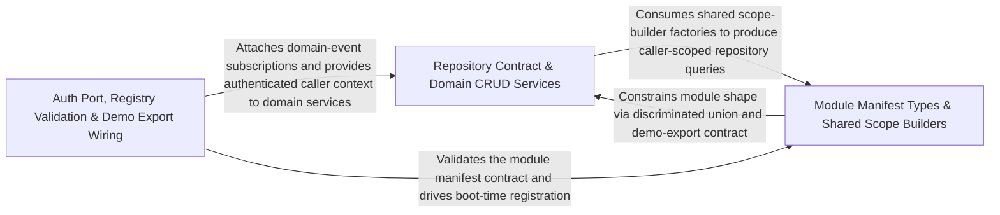

---
tags:
  - 2repo
  - 2repo/arch
  - project/boilerplate-node-backend
type: architecture
component: Module_Registry_Persistence_Foundation
---

## Details

The module lifecycle and the persistence class hierarchy. The registry defines the typed AppModule manifest (common fields, RoutedModule vs HeadlessModule, DemoExport), validates the dependency DAG (validateModules), and wires domain-event subscriptions (registerModules). The BaseRepository class is the abstract persistence contract — the find, findOne, create, update, delete surface that every domain repository implements. The full authentication port (both resolveAccessToken and resolveRefreshToken) and the authorization scope builders appear here in their definition role, alongside capabilities and demo-export classification.

### Repository Contract & Domain CRUD Services
The concrete persistence surface and the domain services that consume it. BaseRepository is the factory-returned interface (not a base class) that every domain repository spreads into its own object, providing findById, findOne, findAll, count, create, save, deleteOne, search, normalize, and buildWhere. The SearchSpec / buildWhere machinery keeps Mongo query knowledge (ObjectId coercion, regex escaping, range bounds) out of services. Domain modules (orders, payments) implement their repositories by spreading this contract and adding module-specific scoped finds (e.g. findByIdScoped), then expose service methods (create, cancelById, confirmPayment, performRefund) that orchestrate domain rules over the repository. A fake.ts provides a test double for the same surface.

**Related Classes/Methods**:

- `src.infrastructure.persistence.base-repository.BaseRepository`:164-209
- `src.modules.orders.repository.findByIdScoped`:110-122
- `src.modules.orders.service.create`:79-145
- `src.modules.payments.service.confirmPayment`:158-228

**Source Files:**

- `src/infrastructure/persistence/base-repository.ts`
  - `src.infrastructure.persistence.base-repository.BaseRepository` (L164-L209) - Interface
  - `src.infrastructure.persistence.base-repository.createBaseRepository.buildWhere` (L344-L344) - Method
- `src/modules/orders/domain/lifecycle.ts`
  - `src.modules.orders.domain.lifecycle.statusesReachableFrom` (L75-L79) - Class
  - `src.modules.orders.domain.lifecycle.statusesReachableFrom.filter() callback` (L79-L79) - Function
  - `src.modules.orders.domain.lifecycle.statusesLeadingTo` (L91-L92) - Class
  - `src.modules.orders.domain.lifecycle.statusesLeadingTo.filter() callback` (L92-L92) - Function
- `src/modules/orders/repository.ts`
  - `src.modules.orders.repository.search` (L57-L85) - Class
  - `src.modules.orders.repository.search.then() callback` (L72-L83) - Function
  - `src.modules.orders.repository.search.then() callback.then() callback` (L79-L82) - Function
  - `src.modules.orders.repository.findByIdScoped` (L110-L122) - Class
  - `src.modules.orders.repository.findByIdScoped.then() callback` (L117-L120) - Function
- `src/modules/orders/service.ts`
  - `src.modules.orders.service.create` (L79-L145) - Class
  - `src.modules.orders.service.create.items.map() callback` (L88-L89) - Function
  - `src.modules.orders.service.create.items.map() callback.then() callback` (L89-L89) - Function
  - `src.modules.orders.service.create.then() callback` (L91-L144) - Function
  - `src.modules.orders.service.create.then() callback.then() callback` (L121-L143) - Function
  - `src.modules.orders.service.update` (L159-L257) - Class
  - `src.modules.orders.service.update.updateItemsPromise` (L213-L241) - Class
  - `src.modules.orders.service.updateItemsPromise.then() callback` (L215-L240) - Function
  - `src.modules.orders.service.update.updateItemsPromise.then() callback.requestedItems.map() callback` (L225-L228) - Function
  - `src.modules.orders.service.update.updateItemsPromise.then() callback.requestedItems.map() callback.then() callback` (L228-L228) - Function
  - `src.modules.orders.service.updateItemsPromise.then() callback.then() callback` (L230-L239) - Function
  - `src.modules.orders.service.update.updateItemsPromise.then() callback.then() callback.resolvedItems.map() callback` (L234-L237) - Function
  - `src.modules.orders.service.update.updateItemsPromise.then() callback` (L243-L256) - Function
  - `src.modules.orders.service.update.updateItemsPromise.then() callback.then() callback` (L245-L255) - Function
  - `src.modules.orders.service.updateById` (L266-L278) - Class
  - `src.modules.orders.service.updateById.then() callback` (L275-L278) - Function
  - `src.modules.orders.service.remove` (L293-L318) - Class
  - `src.modules.orders.service.remove.then() callback` (L317-L317) - Function
  - `src.modules.orders.service.removeById` (L327-L334) - Class
  - `src.modules.orders.service.removeById.then() callback` (L331-L334) - Function
  - `src.modules.orders.service.withActions` (L378-L393) - Function
  - `src.modules.orders.service.cancelById` (L407-L470) - Class
  - `src.modules.orders.service.cancelById.then() callback` (L431-L469) - Function
  - `src.modules.orders.service.cancelById.then() callback.then() callback` (L459-L467) - Function
- `src/modules/payments/providers/fake.ts`
  - `src.modules.payments.providers.fake.fakePaymentProvider` (L36-L52) - Class
  - `src.modules.payments.providers.fake.fakePaymentProvider.charge` (L39-L46) - Method
  - `src.modules.payments.providers.fake.fakePaymentProvider.refund` (L48-L51) - Method
- `src/modules/payments/providers/index.ts`
  - `src.modules.payments.providers.index.PaymentProvider` (L24-L43) - Interface
  - `src.modules.payments.providers.index.PaymentProvider.charge` (L36-L36) - Method
  - `src.modules.payments.providers.index.PaymentProvider.refund` (L42-L42) - Method
- `src/modules/payments/service.ts`
  - `src.modules.payments.service.confirmPayment` (L158-L228) - Class
  - `src.modules.payments.service.confirmPayment.then() callback` (L163-L228) - Function
  - `src.modules.payments.service.performRefund` (L286-L299) - Class
  - `src.modules.payments.service.performRefund.then() callback` (L289-L299) - Function
  - `src.modules.payments.service.performRefund.then() callback.then() callback` (L293-L298) - Function
  - `src.modules.payments.service.refundByOrder` (L311-L330) - Class
  - `src.modules.payments.service.refundByOrder.then() callback` (L315-L330) - Function
  - `src.modules.payments.service.refundByOrder.then() callback.then() callback` (L320-L328) - Function
  - `src.modules.payments.service.refundForOrder` (L342-L343) - Class
  - `src.modules.payments.service.refundForOrder.then() callback` (L343-L343) - Function

### Module Manifest Types & Shared Scope Builders
The type-level contract that defines what a module is and the shared authorization rule that four domains reuse. AppModuleCommon declares the universal fields (name, subdomain, dependsOn with typed ContextEdge, subscribe, locales, seeds). RoutedModule adds basePath + routes; HeadlessModule uses never to forbid them — a discriminated union, not optional fields. The DemoExport union enforces that seedExport and demoShapes are declared together or not at all. On the authorization side, createOwnerScope and createVisibilityScope encapsulate the single shared rule — admin reads everything, everyone else reads a narrowed slice — parameterized by the repository's scope function so the kernel never names a module. The restrictNonAdmin callback is the common core both factories delegate to.

**Related Classes/Methods**:

- `src.kernel.registry.AppModuleCommon`:58-94
- `src.kernel.registry.RoutedModule`:137-143
- `src.kernel.registry.HeadlessModule`:152-155
- `src.kernel.authorization.createVisibilityScope`:67-68

**Source Files:**

- `src/kernel/authorization.ts`
  - `src.kernel.authorization.createVisibilityScope` (L67-L68) - Class
  - `src.kernel.authorization.createVisibilityScope.restrictNonAdmin() callback` (L68-L68) - Function
- `src/kernel/registry.ts`
  - `src.kernel.registry.AppModuleCommon` (L58-L94) - Interface
  - `src.kernel.registry.RoutedModule` (L137-L143) - Interface
  - `src.kernel.registry.HeadlessModule` (L152-L155) - Interface
- `src/modules/payments/repository.ts`
  - `src.modules.payments.repository.paymentRepository` (L21-L126) - Class
  - `src.modules.payments.repository.paymentRepository.ownerScope` (L58-L58) - Method
  - `src.modules.payments.repository.paymentRepository.findByIdScoped` (L71-L72) - Method
  - `src.modules.payments.repository.paymentRepository.findByOrderId` (L81-L82) - Method
  - `src.modules.payments.repository.paymentRepository.upsertIntent` (L95-L112) - Method
  - `src.modules.payments.repository.paymentRepository.upsertIntent.catch() callback` (L109-L112) - Function
  - `src.modules.payments.repository.paymentRepository.updateStatusIfIn` (L118-L125) - Method
- `src/modules/payments/service.ts`
  - `src.modules.payments.service.resolvePayerId` (L79-L89) - Class
  - `src.modules.payments.service.resolvePayerId.then() callback` (L82-L88) - Function
  - `src.modules.payments.service.resolvePayerId.catch() callback` (L89-L89) - Function
  - `src.modules.payments.service.createIntent` (L113-L144) - Class
  - `src.modules.payments.service.createIntent.then() callback` (L117-L144) - Function
  - `src.modules.payments.service.createIntent.then() callback.then() callback` (L134-L142) - Function
  - `src.modules.payments.service.getForOrder` (L236-L248) - Class
  - `src.modules.payments.service.getForOrder.then() callback` (L240-L248) - Function
  - `src.modules.payments.service.getForOrder.then() callback.then() callback` (L247-L247) - Function

### Auth Port, Registry Validation & Demo Export Wiring
The runtime wiring that turns the static manifest into a running application. validateModules performs three passes — duplicate-name rejection, unknown-dependency detection, and DFS cycle detection with path-printing errors — before any route is mounted. registerModules calls validateModules then invokes each module's subscribe() to attach domain-event handlers, ensuring all subscriptions exist before the first request. The authentication port (resolveAccessToken, resolveRefreshToken) is a kernel-declared, module-supplied resolver: the kernel declares the interface, account installs the implementation at boot via registerAuthResolver, and the two resolve functions distinguish reject (bad token → 401) from resolve undefined (valid token, deleted user → 403). The DemoExport classification (response vs stored) and the locales module's tenant/repository configuration (extraFrontendTenants, importEntries, countEntriesByLocale, listKeys) complete the boot-time data pipeline.

**Related Classes/Methods**:

- `src.kernel.authentication.resolveRefreshToken`:59-60
- `src.modules.locales.repository.importEntries`:224-259

**Source Files:**

- `src/kernel/authentication.ts`
  - `src.kernel.authentication.resolveRefreshToken` (L59-L60) - Class
  - `src.kernel.authentication.resolveRefreshToken.then() callback` (L60-L60) - Function
- `src/kernel/middlewares/authorizations.ts`
  - `src.kernel.middlewares.authorizations.isAdminViaCookie` (L135-L176) - Class
  - `src.kernel.middlewares.authorizations.isAdminViaCookie.then() callback` (L147-L170) - Function
  - `src.kernel.middlewares.authorizations.isAdminViaCookie.catch() callback` (L171-L174) - Function
- `src/modules/locales/demo.ts`
  - `src.modules.locales.demo.seedLocalesCollection.languages` (L273-L275) - Class
  - `src.modules.locales.demo.seedLocalesCollection.languages.localeFixtures.map() callback` (L274-L274) - Function
  - `src.modules.locales.demo.seedLocalesCollection.entries` (L276-L278) - Class
  - `src.modules.locales.demo.seedLocalesCollection.entries.localeEntryFixtures.map() callback` (L277-L277) - Function
- `src/modules/locales/repository.ts`
  - `src.modules.locales.repository.EntryInput` (L37-L40) - Interface
  - `src.modules.locales.repository.ImportCounts` (L43-L47) - Interface
  - `src.modules.locales.repository.countEntriesByLocale` (L107-L119) - Class
  - `src.modules.locales.repository.countEntriesByLocale.rows.map() callback` (L118-L118) - Function
  - `src.modules.locales.repository.listKeys` (L158-L166) - Class
  - `src.modules.locales.repository.listKeys.rows.map() callback` (L165-L165) - Function
  - `src.modules.locales.repository.importEntries` (L224-L259) - Class
  - `src.modules.locales.repository.importEntries.incoming` (L231-L231) - Class
  - `src.modules.locales.repository.importEntries.incoming.inputs.map() callback` (L231-L231) - Function
  - `src.modules.locales.repository.importEntries.map() callback` (L237-L243) - Function
- `src/modules/locales/services/entries.ts`
  - `src.modules.locales.services.entries.importEntries.inputs` (L153-L153) - Class
  - `src.modules.locales.services.entries.importEntries.inputs.entries.map() callback` (L153-L153) - Function
  - `src.modules.locales.services.entries.importEntries.unsafe` (L160-L160) - Class
  - `src.modules.locales.services.entries.importEntries.unsafe.keys.find() callback` (L160-L160) - Function
- `src/modules/locales/tenants.ts`
  - `src.modules.locales.tenants.extraFrontendTenants` (L38-L46) - Class
  - `src.modules.locales.tenants.extraFrontendTenants.filter() callback` (L42-L42) - Function
  - `src.modules.locales.tenants.extraFrontendTenants.map() callback` (L43-L46) - Function
  - `src.modules.locales.tenants.listTenants` (L49-L60) - Class
  - `src.modules.locales.tenants.listTenants.rows.filter() callback` (L59-L59) - Function
  - `src.modules.locales.tenants.frontendTenantIds` (L63-L66) - Class
  - `src.modules.locales.tenants.frontendTenantIds.filter() callback` (L65-L65) - Function
  - `src.modules.locales.tenants.frontendTenantIds.map() callback` (L66-L66) - Function
