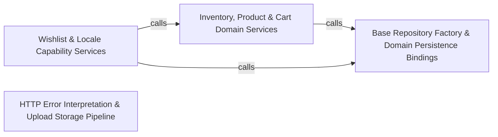

---
tags:
  - 2repo
  - 2repo/arch
  - project/boilerplate-node-backend
type: architecture
component: Shared_Infrastructure_Adapters_Domain_Persistence
---

## Details

The concrete adapter and persistence layer that domain modules consume: file-storage adapters (upload validation, image store), HTTP error interpretation (ExtendedError, databaseErrorInterpreter, rejectDatabaseError), multipart upload extraction, text-search filter composition, and the createBaseRepository factory. Also includes the domain repositories (cart, delivery, inventory) that are the primary consumers of these shared patterns, binding the infrastructure to real query shapes.

### Inventory, Product & Cart Domain Services
The business-logic layer for three tightly-coupled bounded contexts: inventory (stock reservation lifecycle, low-stock metrics, movement auditing), products (CRUD, soft-delete, update), and cart (item upsert, reorder). These services orchestrate domain rules (e.g., isStockBoundToOrder guards against double-reservation) and delegate persistence to their respective repositories. The inventory metrics (inventoryReservedUnitsTotal, productsLowStockTotal) expose Prometheus gauges collected on each reservation mutation.

**Related Classes/Methods**:

- `src.modules.products.repository.productRepository`:39-374
- `src.modules.cart.services.items.upsertCartItem`:66-79
- `src.modules.inventory.metrics.inventoryReservedUnitsTotal`:41-48

**Source Files:**

- `src/modules/account/model.ts`
  - `src.modules.account.model.AddressItem` (L19-L34) - Interface
  - `src.modules.account.model.AddressBookDocument` (L37-L42) - Interface
- `src/modules/cart/services/items.ts`
  - `src.modules.cart.services.items.upsertCartItem` (L66-L79) - Class
  - `src.modules.cart.services.items.upsertCartItem.then() callback` (L72-L79) - Function
  - `src.modules.cart.services.items.upsertCartItem.then() callback.then() callback` (L78-L78) - Function
- `src/modules/cart/services/reorder.ts`
  - `src.modules.cart.services.reorder.reorderIntoCart.<function>.requested` (L77-L83) - Class
  - `src.modules.cart.services.reorder.reorderIntoCart.<function>.requested.order.items.map() callback` (L77-L83) - Function
  - `src.modules.cart.services.reorder.reorderIntoCart.<function>.requested.map() callback` (L87-L90) - Function
  - `src.modules.cart.services.reorder.reorderIntoCart.<function>.requested.map() callback.then() callback` (L90-L90) - Function
- `src/modules/inventory/metrics.ts`
  - `src.modules.inventory.metrics.productsLowStockTotal` (L23-L30) - Class
  - `src.modules.inventory.metrics.productsLowStockTotal.collect` (L27-L29) - Method
  - `src.modules.inventory.metrics.inventoryReservedUnitsTotal` (L41-L48) - Class
  - `src.modules.inventory.metrics.inventoryReservedUnitsTotal.collect` (L45-L47) - Method
- `src/modules/locales/model.ts`
  - `src.modules.locales.model.LocaleDocument` (L30-L33) - Interface
  - `src.modules.locales.model.LocaleMessageDocument` (L36-L40) - Interface
  - `src.modules.locales.model.derivesBaseLanguage` (L131-L133) - Function
- `src/modules/products/repository.ts`
  - `src.modules.products.repository.productRepository` (L39-L374) - Class
  - `src.modules.products.repository.productRepository.publicScope` (L78-L78) - Method
  - `src.modules.products.repository.productRepository.findByIdScoped` (L94-L95) - Method
  - `src.modules.products.repository.productRepository.findPublicById` (L108-L109) - Method
  - `src.modules.products.repository.productRepository.facets` (L120-L148) - Method
  - `src.modules.products.repository.productRepository.facets.then() callback` (L142-L148) - Function
  - `src.modules.products.repository.productRepository.facets.then() callback.categories.map() callback` (L143-L146) - Function
  - `src.modules.products.repository.productRepository.facets.then() callback.tags.map() callback` (L147-L147) - Function
  - `src.modules.products.repository.productRepository.reserveUnits` (L177-L188) - Method
  - `src.modules.products.repository.productRepository.reserveUnits.then() callback` (L188-L188) - Function
  - `src.modules.products.repository.productRepository.commitUnits` (L200-L212) - Method
  - `src.modules.products.repository.productRepository.commitUnits.then() callback` (L212-L212) - Function
  - `src.modules.products.repository.productRepository.releaseUnits` (L224-L232) - Method
  - `src.modules.products.repository.productRepository.releaseUnits.then() callback` (L232-L232) - Function
  - `src.modules.products.repository.productRepository.receiveUnits` (L241-L249) - Method
  - `src.modules.products.repository.productRepository.receiveUnits.then() callback` (L249-L249) - Function
  - `src.modules.products.repository.productRepository.adjustUnits` (L262-L273) - Method
  - `src.modules.products.repository.productRepository.adjustUnits.then() callback` (L273-L273) - Function
  - `src.modules.products.repository.productRepository.countLowAvailability` (L285-L291) - Method
  - `src.modules.products.repository.productRepository.sumReserved` (L302-L305) - Method
  - `src.modules.products.repository.productRepository.sumReserved.then() callback` (L305-L305) - Function
  - `src.modules.products.repository.productRepository.availabilityPage` (L329-L373) - Method
  - `src.modules.products.repository.productRepository.availabilityPage.then() callback` (L370-L373) - Function
- `src/modules/products/service.ts`
  - `src.modules.products.service.updateById` (L163-L170) - Class
  - `src.modules.products.service.updateById.then() callback` (L167-L170) - Function
  - `src.modules.products.service.updateById.then() callback.then() callback` (L169-L169) - Function
  - `src.modules.products.service.remove` (L185-L205) - Class
  - `src.modules.products.service.remove.then() callback` (L204-L204) - Function
  - `src.modules.products.service.removeById` (L214-L221) - Class
  - `src.modules.products.service.removeById.then() callback` (L218-L221) - Function

### Wishlist & Locale Capability Services
The wishlist bounded context (add line, remove line, move-to-cart, remove product from all users) and the locales capability-merging service. The wishlist repository exercises the base repository's create, save, deleteOne, and findAll paths with user-scoped queries. The locale capability service (mergeCapabilities) composes per-locale feature flags into a unified capability set, consumed by the i18n negotiation pipeline. This group represents the read-heavy, user-scoped domain pattern — simpler query shapes than inventory but exercising the same factory contract.

**Related Classes/Methods**:

- `src.modules.wishlist.repository.wishlistRepository`:25-106
- `src.modules.wishlist.service.wishlistMoveToCart`:88-107
- `src.modules.wishlist.service.wishlistAdd`:45-56
- `src.modules.locales.services.capabilities.mergeCapabilities`:111-135

**Source Files:**

- `src/modules/locales/services/capabilities.ts`
  - `src.modules.locales.services.capabilities.mergeCapabilities` (L111-L135) - Class
  - `src.modules.locales.services.capabilities.mergeCapabilities.toSorted() callback` (L134-L134) - Function
- `src/modules/locales/services/entries.ts`
  - `src.modules.locales.services.entries.importEntries.survivors` (L181-L181) - Class
  - `src.modules.locales.services.entries.importEntries.survivors.stored.filter() callback` (L181-L181) - Function
- `src/modules/wishlist/repository.ts`
  - `src.modules.wishlist.repository.wishlistRepository` (L25-L106) - Class
  - `src.modules.wishlist.repository.wishlistRepository.findByUserId` (L40-L41) - Method
  - `src.modules.wishlist.repository.wishlistRepository.addLine` (L61-L68) - Method
  - `src.modules.wishlist.repository.wishlistRepository.removeLine` (L75-L82) - Method
  - `src.modules.wishlist.repository.wishlistRepository.deleteByUserId` (L88-L94) - Method
  - `src.modules.wishlist.repository.wishlistRepository.deleteByUserId.then() callback` (L92-L94) - Function
  - `src.modules.wishlist.repository.wishlistRepository.removeProductFromAll` (L99-L105) - Method
- `src/modules/wishlist/service.ts`
  - `src.modules.wishlist.service.WishlistView` (L23-L25) - Interface
  - `src.modules.wishlist.service.toWishlistView.items.map() callback` (L29-L29) - Function
  - `src.modules.wishlist.service.wishlistGet` (L35-L36) - Class
  - `src.modules.wishlist.service.wishlistGet.then() callback` (L36-L36) - Function
  - `src.modules.wishlist.service.wishlistAdd` (L45-L56) - Class
  - `src.modules.wishlist.service.wishlistAdd.then() callback` (L49-L56) - Function
  - `src.modules.wishlist.service.wishlistAdd.then() callback.then() callback` (L53-L54) - Function
  - `src.modules.wishlist.service.wishlistRemove` (L64-L71) - Class
  - `src.modules.wishlist.service.wishlistRemove.then() callback` (L68-L71) - Function
  - `src.modules.wishlist.service.wishlistMoveToCart` (L88-L107) - Class
  - `src.modules.wishlist.service.wishlistMoveToCart.then() callback` (L92-L107) - Function
  - `src.modules.wishlist.service.wishlistMoveToCart.then() callback.saved` (L93-L93) - Class
  - `src.modules.wishlist.service.wishlistMoveToCart.then() callback.saved.wishlist.items.some() callback` (L93-L93) - Function
  - `src.modules.wishlist.service.wishlistMoveToCart.then() callback.then() callback` (L96-L106) - Function
  - `src.modules.wishlist.service.wishlistMoveToCart.then() callback.then() callback.then() callback` (L103-L104) - Function

### Base Repository Factory & Domain Persistence Bindings
The shared persistence factory (createBaseRepository) and its search filter composition (addTextFilter, buildWhere), plus the domain repositories that bind to it: delivery (shipmentRepository), inventory (reservationRepository), and products (productRepository). This is the architectural keystone — the factory encapsulates all Mongo-specific knowledge (ObjectId coercion, lean→normalized mapping, pagination, filter compilation) behind a uniform BaseRepository<T> interface. The delivery service (getForOrder, findAllShipped) demonstrates the aggregation path that bypasses the factory's search but reuses buildWhere for $match stages. The inventory metrics collection hooks into the same repository mutations.

**Related Classes/Methods**:

- `src.infrastructure.persistence.base-repository.createBaseRepository`:222-346
- `src.infrastructure.persistence.search.addTextFilter`:133-143
- `src.modules.delivery.repository.shipmentRepository`:16-45
- `src.modules.delivery.service.getForOrder`:49-59
- `src.modules.inventory.repository.reservationRepository`:59-151

**Source Files:**

- `src/infrastructure/persistence/base-repository.ts`
  - `src.infrastructure.persistence.base-repository.createBaseRepository` (L222-L346) - Function
- `src/infrastructure/persistence/search.ts`
  - `src.infrastructure.persistence.search.addTextFilter` (L133-L143) - Class
  - `src.infrastructure.persistence.search.addTextFilter.fields.map() callback` (L140-L142) - Function
- `src/modules/delivery/repository.ts`
  - `src.modules.delivery.repository.shipmentRepository` (L16-L45) - Class
  - `src.modules.delivery.repository.shipmentRepository.findByOrderId` (L26-L27) - Method
  - `src.modules.delivery.repository.shipmentRepository.upsertForOrder` (L34-L41) - Method
  - `src.modules.delivery.repository.shipmentRepository.findAllShipped` (L44-L44) - Method
- `src/modules/delivery/service.ts`
  - `src.modules.delivery.service.getForOrder` (L49-L59) - Class
  - `src.modules.delivery.service.getForOrder.then() callback` (L53-L59) - Function
  - `src.modules.delivery.service.getForOrder.then() callback.then() callback` (L55-L58) - Function
- `src/modules/inventory/repository.ts`
  - `src.modules.inventory.repository.toReservationItems` (L31-L37) - Class
  - `src.modules.inventory.repository.toReservationItems.lines.map() callback` (L34-L37) - Function
  - `src.modules.inventory.repository.reservationRepository` (L59-L151) - Class
  - `src.modules.inventory.repository.reservationRepository.insertHold` (L89-L101) - Method
  - `src.modules.inventory.repository.reservationRepository.insertHold.then() callback` (L97-L97) - Function
  - `src.modules.inventory.repository.reservationRepository.insertHold.catch() callback` (L98-L101) - Function
  - `src.modules.inventory.repository.reservationRepository.findByOrderId` (L109-L110) - Method
  - `src.modules.inventory.repository.reservationRepository.claimStatus` (L125-L132) - Method
  - `src.modules.inventory.repository.reservationRepository.findExpired` (L145-L150) - Method
- `src/modules/inventory/service.ts`
  - `src.modules.inventory.service.StockLine` (L40-L43) - Interface
  - `src.modules.inventory.service.StockShortfall` (L46-L51) - Interface
  - `src.modules.inventory.service.MovementFilters` (L69-L72) - Interface
  - `src.modules.inventory.service.isStockBoundToOrder` (L292-L295) - Class
  - `src.modules.inventory.service.isStockBoundToOrder.then() callback` (L295-L295) - Function
  - `src.modules.inventory.service.listMovements` (L446-L453) - Class
  - `src.modules.inventory.service.listMovements.then() callback` (L453-L453) - Function

### HTTP Error Interpretation & Upload Storage Pipeline
The HTTP error semantics layer (ExtendedError class, databaseErrorInterpreter status derivation, rejectDatabaseError/rejectDatabaseEnvelope response helpers) and the multipart upload pipeline (getFormFiles extraction, validateUploadedImages byte-level content check, storeUploadedImages commit-to-storage with rollback). Also includes the locale negotiation helper (negotiateLocale) that restores AsyncLocalStorage context across multer's stream consumption. The three-stage upload pipeline is a security-critical flow: declared-type gate → byte-identification gate → storage commit with partial-failure rollback. The error interpreter is the single authority that maps driver failures (CastError, E11000, BSONError, ValidationError) to HTTP statuses across all twelve models.

**Related Classes/Methods**:

- `src.infrastructure.http.errors.ExtendedError`:23-72
- `src.infrastructure.adapters.storage.storeUploadedImages`:338-371
- `src.infrastructure.adapters.storage.validateUploadedImages`:268-315
- `src.infrastructure.http.uploads.getFormFiles`:36-56

**Source Files:**

- `src/infrastructure/adapters/storage.ts`
  - `src.infrastructure.adapters.storage.validateUploadedImages` (L268-L315) - Class
  - `src.infrastructure.adapters.storage.validateUploadedImages.paths.map() callback` (L282-L282) - Function
  - `src.infrastructure.adapters.storage.validateUploadedImages.then() callback` (L283-L313) - Function
  - `src.infrastructure.adapters.storage.validateUploadedImages.then() callback.then() callback` (L304-L311) - Function
  - `src.infrastructure.adapters.storage.validateUploadedImages.catch() callback` (L314-L314) - Function
  - `src.infrastructure.adapters.storage.storeUploadedImages` (L338-L371) - Class
  - `src.infrastructure.adapters.storage.storeUploadedImages.staged.map() callback` (L348-L348) - Function
  - `src.infrastructure.adapters.storage.storeUploadedImages.then() callback` (L349-L369) - Function
  - `src.infrastructure.adapters.storage.storeUploadedImages.then() callback.results.map() callback` (L353-L353) - Function
  - `src.infrastructure.adapters.storage.storeUploadedImages.then() callback.staged.map() callback` (L362-L362) - Function
  - `src.infrastructure.adapters.storage.storeUploadedImages.then() callback.results.filter() callback` (L366-L366) - Function
  - `src.infrastructure.adapters.storage.storeUploadedImages.then() callback.map() callback` (L367-L367) - Function
  - `src.infrastructure.adapters.storage.storeUploadedImages.then() callback.then() callback` (L368-L368) - Function
- `src/infrastructure/http/errors.ts`
  - `src.infrastructure.http.errors.ExtendedError` (L23-L72) - Class
  - `src.infrastructure.http.errors.ExtendedError.constructor` (L42-L71) - Constructor
- `src/infrastructure/http/uploads.ts`
  - `src.infrastructure.http.uploads.getFormFiles` (L36-L56) - Function
- `src/infrastructure/i18n/negotiate.ts`
  - `src.infrastructure.i18n.negotiate.negotiateLocale.lowercaseSupported` (L31-L31) - Class
  - `src.infrastructure.i18n.negotiate.negotiateLocale.lowercaseSupported.supported.map() callback` (L31-L31) - Function
  - `src.infrastructure.i18n.negotiate.negotiateLocale.candidates` (L33-L53) - Class
  - `src.infrastructure.i18n.negotiate.negotiateLocale.candidates.map() callback` (L35-L50) - Function
  - `src.infrastructure.i18n.negotiate.negotiateLocale.candidates.map() callback.declared` (L37-L39) - Class
  - `src.infrastructure.i18n.negotiate.negotiateLocale.candidates.map() callback.declared.parameters.map() callback` (L38-L38) - Function
  - `src.infrastructure.i18n.negotiate.negotiateLocale.candidates.filter() callback` (L51-L51) - Function
  - `src.infrastructure.i18n.negotiate.negotiateLocale.candidates.toSorted() callback` (L53-L53) - Function
