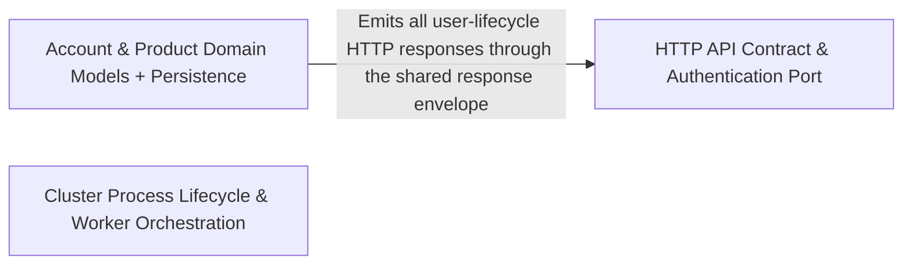

---
tags:
  - 2repo
  - 2repo/arch
  - project/boilerplate-node-backend
type: architecture
component: on_SIGINT_callback
---

## Details

40 leaf clusters, 73 symbols across 19 files. Files: cluster.ts, request.ts, response.ts, uploads.ts, validation-messages.ts, index.ts, authentication.ts, delete-account-confirm.ts, ... Key symbols: src.cluster.process.on('SIGINT') callback, src.cluster.process.on('SIGTERM') callback, src.cluster.scheduleRespawn.timer, src.kernel.authentication.AuthResolver, src.kernel.authentication.AuthenticatedUser, src.cluster.scheduleRespawn.timer.setTimeout() callback, src.infrastructure.http.response.ResponseErrorItem, src.infrastructure.http.response.ResponseNeutral, src.infrastructure.http.response.ResponseReject, src.infrastructure.http.response.ResponseSuccess, src.infrastructure.http.response.normalizeErrors, src.infrastructure.http.validation-messages.registerValidationMessages, ...

### Account & Product Domain Models + Persistence
The tactical DDD layer for the two core bounded contexts that the bootstrap path exercises: users/account and products. It contains the Mongoose document schemas (UserDocument, ProductDocument, Token), the repository abstraction (userRepository), token lifecycle methods (tokenAdd, tokenRemoveAll), seed/demo data (seedUsersCollection, seedProductsCollection), and the account-specific confirmation controllers (delete-account-confirm, post-reset-confirm, post-verify-confirm) that close the user-lifecycle flows (delete, password reset, email verification). This is the data boundary: every HTTP response that carries user or product data originates here.

**Related Classes/Methods**:

- `src.modules.users.repository.userRepository`:27-168

**Source Files:**

- `src/infrastructure/observability/audit.ts`
  - `src.infrastructure.observability.audit.AuditActionMap` (L44-L44) - Interface
- `src/modules/account/controllers/delete-account-confirm.ts`
  - `src.modules.account.controllers.delete-account-confirm.deleteAccountConfirm.then() callback.tokenEntry` (L37-L37) - Class
  - `src.modules.account.controllers.delete-account-confirm.deleteAccountConfirm.then() callback.tokenEntry.user.tokens.find() callback` (L37-L37) - Function
- `src/modules/account/controllers/get-refresh-token.ts`
  - `src.modules.account.controllers.get-refresh-token.then() callback.then() callback` (L54-L54) - Function
- `src/modules/account/controllers/get-sessions.ts`
  - `src.modules.account.controllers.get-sessions.then() callback.sessions` (L50-L52) - Class
- `src/modules/account/controllers/post-login.ts`
  - `src.modules.account.controllers.post-login.then() callback` (L98-L98) - Function
  - `src.modules.account.controllers.post-login.then() callback.then() callback` (L119-L127) - Function
- `src/modules/account/controllers/post-reset-confirm.ts`
  - `src.modules.account.controllers.post-reset-confirm.postResetConfirm.then() callback.tokenEntry` (L41-L43) - Class
  - `src.modules.account.controllers.post-reset-confirm.postResetConfirm.then() callback.tokenEntry.user.tokens.find() callback` (L42-L42) - Function
- `src/modules/account/controllers/post-verify-confirm.ts`
  - `src.modules.account.controllers.post-verify-confirm.postVerifyConfirm.then() callback.tokenEntry` (L46-L48) - Class
  - `src.modules.account.controllers.post-verify-confirm.postVerifyConfirm.then() callback.tokenEntry.user.tokens.find() callback` (L47-L47) - Function
- `src/modules/account/repository.ts`
  - `src.modules.account.repository.addressBookRepository.removeEntry.entry` (L102-L102) - Class
  - `src.modules.account.repository.addressBookRepository.removeEntry.entry.book.items.find() callback` (L102-L102) - Function
- `src/modules/account/services/authentication.ts`
  - `src.modules.account.services.authentication.signup.<function>` (L84-L98) - Function
  - `src.modules.account.services.authentication.signup.<function>.then() callback` (L97-L97) - Function
  - `src.modules.account.services.authentication.tokenRemoveAll` (L137-L161) - Class
  - `src.modules.account.services.authentication.tokenRemoveAll.then() callback` (L145-L159) - Function
  - `src.modules.account.services.authentication.tokenRemoveAll.then() callback.then() callback` (L158-L158) - Function
  - `src.modules.account.services.authentication.tokenRemoveAll.catch() callback` (L161-L161) - Function
- `src/modules/account/services/profile.ts`
  - `src.modules.account.services.profile.passwordChangeWithCurrent.<function>` (L172-L180) - Function
  - `src.modules.account.services.profile.passwordChangeWithCurrent.<function>.then() callback` (L175-L179) - Function
- `src/modules/account/services/verification.ts`
  - `src.modules.account.services.verification.then() callback` (L43-L43) - Function
- `src/modules/locales/tenants.ts`
  - `src.modules.locales.tenants.map() callback` (L41-L41) - Function
- `src/modules/orders/controllers/get-order-invoice.ts`
  - `src.modules.orders.controllers.get-order-invoice.then() callback.then() callback` (L60-L60) - Function
- `src/modules/orders/controllers/write-orders.ts`
  - `src.modules.orders.controllers.write-orders.then() callback` (L61-L99) - Function
- `src/modules/products/controllers/get-products.ts`
  - `src.modules.products.controllers.get-products.searchProductsQuerySchema.minPrice.z.preprocess() callback` (L36-L36) - Function
  - `src.modules.products.controllers.get-products.searchProductsQuerySchema.maxPrice.z.preprocess() callback` (L40-L40) - Function
  - `src.modules.products.controllers.get-products.searchProductsQuerySchema.active.z.preprocess() callback` (L45-L45) - Function
- `src/modules/products/controllers/write-products.ts`
  - `src.modules.products.controllers.write-products.catch() callback` (L84-L84) - Function
  - `src.modules.products.controllers.write-products.catch() callback.then() callback` (L139-L141) - Function
- `src/modules/products/demo.ts`
  - `src.modules.products.demo.seedProductById.product` (L148-L148) - Class
  - `src.modules.products.demo.seedProductById.product.productFixtures.find() callback` (L148-L148) - Function
  - `src.modules.products.demo.seedProductsCollection` (L155-L156) - Class
  - `src.modules.products.demo.seedProductsCollection.productFixtures.map() callback` (L156-L156) - Function
- `src/modules/products/model.ts`
  - `src.modules.products.model.ProductSnapshot` (L28-L37) - Interface
  - `src.modules.products.model.ProductDocument` (L42-L42) - Interface
- `src/modules/users/controllers/write-users.ts`
  - `src.modules.users.controllers.write-users.catch() callback` (L77-L77) - Function
  - `src.modules.users.controllers.write-users.catch() callback.then() callback` (L117-L119) - Function
- `src/modules/users/demo.ts`
  - `src.modules.users.demo.seedUsersCollection` (L56-L57) - Class
  - `src.modules.users.demo.seedUsersCollection.userFixtures.map() callback` (L57-L57) - Function
- `src/modules/users/model.ts`
  - `src.modules.users.model.TokenType` (L20-L23) - Enum
  - `src.modules.users.model.Token` (L29-L50) - Interface
  - `src.modules.users.model.UserRecord` (L61-L86) - Interface
  - `src.modules.users.model.UserDocument` (L91-L94) - Interface
  - `src.modules.users.model.UserMethods` (L99-L106) - Interface
  - `src.modules.users.model.email.error` (L139-L139) - Method
  - `src.modules.users.model.zodUserSchema.email.error` (L140-L140) - Method
  - `src.modules.users.model.username.error` (L144-L144) - Method
  - `src.modules.users.model.zodUserSchema.username.error` (L145-L145) - Method
  - `src.modules.users.model.password.error` (L149-L149) - Method
  - `src.modules.users.model.zodUserSchema.password.error` (L150-L150) - Method
  - `src.modules.users.model.userSchema.pre('save') callback` (L307-L313) - Function
  - `src.modules.users.model.userSchema.pre('save') callback.then() callback` (L310-L312) - Function
  - `src.modules.users.model.tokenAdd` (L349-L369) - Function
  - `src.modules.users.model.tokenAdd.then() callback` (L362-L368) - Function
  - `src.modules.users.model.tokenRemoveAll` (L374-L384) - Function
  - `src.modules.users.model.tokenRemoveAll.then() callback` (L377-L383) - Function
  - `src.modules.users.model.tokenRemoveAll.then() callback.tokens.filter() callback` (L382-L382) - Function
  - `src.modules.users.model.userSchema.static('tokenRemoveExpired') callback` (L390-L407) - Function
  - `src.modules.users.model.userSchema.static('tokenRemoveExpired') callback.then() callback` (L399-L399) - Function
  - `src.modules.users.model.userSchema.static('tokenRemoveExpired') callback.catch() callback` (L400-L406) - Function
- `src/modules/users/repository.ts`
  - `src.modules.users.repository.userRepository` (L27-L168) - Class
  - `src.modules.users.repository.userRepository.updateMany` (L60-L61) - Method
  - `src.modules.users.repository.userRepository.findByIdWithCredentials` (L66-L67) - Method
  - `src.modules.users.repository.userRepository.findOneWithCredentials` (L72-L73) - Method
  - `src.modules.users.repository.userRepository.findByToken` (L93-L97) - Method
  - `src.modules.users.repository.userRepository.tokenRemove` (L113-L122) - Method
  - `src.modules.users.repository.userRepository.tokenRemoveByValue` (L138-L145) - Method
  - `src.modules.users.repository.userRepository.sessionRemove` (L160-L167) - Method
- `src/modules/users/service.ts`
  - `src.modules.users.service.getById` (L63-L66) - Class
  - `src.modules.users.service.getById.then() callback` (L65-L65) - Function
  - `src.modules.users.service.updateById` (L106-L116) - Class
  - `src.modules.users.service.consumeToken` (L206-L213) - Class
  - `src.modules.users.service.consumeToken.then() callback` (L207-L213) - Function
  - `src.modules.users.service.consumeToken.then() callback.user.tokens.filter() callback` (L208-L208) - Function

### HTTP API Contract & Authentication Port
The shared infrastructure layer that defines the response envelope (discriminated ResponseSuccess / ResponseReject union), request input extraction (readInput.sources), controller base (ServiceResult, RemoveResult), upload handling, and validation-message registration. It also declares the authentication port (AuthResolver, AuthenticatedUser) that the kernel exposes and the account module implements at boot. Every domain controller in the codebase returns through successResponse / rejectResponse and reads input through RequestInputDeclaration, making this the single contract all modules speak.

**Related Classes/Methods**:

- `src.infrastructure.http.response.normalizeErrors`:145-172
- `src.infrastructure.http.validation-messages.registerValidationMessages`:102-104

**Source Files:**

- `src/infrastructure/http/controller.ts`
  - `src.infrastructure.http.controller.ServiceResult` (L33-L39) - Interface
- `src/infrastructure/http/delete-controller.ts`
  - `src.infrastructure.http.delete-controller.RemoveResult` (L36-L41) - Interface
- `src/infrastructure/http/request.ts`
  - `src.infrastructure.http.request.RequestInputDeclaration` (L152-L176) - Interface
  - `src.infrastructure.http.request.readInput.sources.map() callback` (L247-L248) - Function
  - `src.infrastructure.http.request.readInput.sources` (L247-L249) - Class
  - `src.infrastructure.http.request.readInput.stated` (L279-L281) - Class
  - `src.infrastructure.http.request.readInput.stated.sources.map() callback` (L280-L280) - Function
  - `src.infrastructure.http.request.readInput.stated.filter() callback` (L281-L281) - Function
  - `src.infrastructure.http.request.readInput.undecoded` (L285-L285) - Class
  - `src.infrastructure.http.request.readInput.undecoded.stated.find() callback` (L285-L285) - Function
- `src/infrastructure/http/response.ts`
  - `src.infrastructure.http.response.ResponseNeutral` (L12-L19) - Interface
  - `src.infrastructure.http.response.ResponseSuccess` (L21-L31) - Interface
  - `src.infrastructure.http.response.ResponseErrorItem` (L34-L41) - Interface
  - `src.infrastructure.http.response.ResponseReject` (L43-L50) - Interface
  - `src.infrastructure.http.response.normalizeErrors` (L145-L172) - Class
  - `src.infrastructure.http.response.normalizeErrors.inputErrors.map() callback` (L154-L171) - Function
- `src/infrastructure/http/uploads.ts`
  - `src.infrastructure.http.uploads.getFormFiles.paths` (L47-L49) - Class
  - `src.infrastructure.http.uploads.getFormFiles.paths.request.files.map() callback` (L48-L48) - Function
  - `src.infrastructure.http.uploads.getFormFiles.paths.flatMap() callback` (L49-L49) - Function
  - `src.infrastructure.http.uploads.getFormFiles.paths.flatMap() callback.files.map() callback` (L49-L49) - Function
- `src/infrastructure/http/validation-messages.ts`
  - `src.infrastructure.http.validation-messages.registerValidationMessages` (L102-L104) - Class
  - `src.infrastructure.http.validation-messages.registerValidationMessages.customError` (L103-L103) - Method
- `src/kernel/authentication.ts`
  - `src.kernel.authentication.AuthenticatedUser` (L15-L21) - Interface
  - `src.kernel.authentication.AuthResolver` (L24-L27) - Interface

### Cluster Process Lifecycle & Worker Orchestration
The primary-process entry point that owns the Node.js cluster model. It forks N workers, monitors each for crashes, applies exponential-backoff respawn within a sliding crash window, and performs coordinated graceful shutdown on SIGINT/SIGTERM (SIGTERM → workers, SIGKILL fallback after timeout). Workers simply import('./app'). This component is the outermost boundary of the subsystem: every request that reaches the HTTP layer was admitted by a worker this component spawned and supervised.

**Related Classes/Methods**:

- `src.cluster.process.on('SIGTERM') callback`
- `src.cluster.scheduleRespawn.timer.setTimeout() callback`:74-77

**Source Files:**

- `src/cluster.ts`
  - `src.cluster.scheduleRespawn.timer` (L74-L77) - Class
  - `src.cluster.scheduleRespawn.timer.setTimeout() callback` (L74-L77) - Function
  - `src.cluster.process.on('SIGTERM') callback` (L158-L158) - Function
  - `src.cluster.process.on('SIGINT') callback` (L159-L159) - Function
- `src/infrastructure/observability/analytics/index.ts`
  - `src.infrastructure.observability.analytics.index.AnalyticsEventMap` (L35-L35) - Interface
  - `src.infrastructure.observability.analytics.index.AnalyticsEvent` (L57-L78) - Interface
