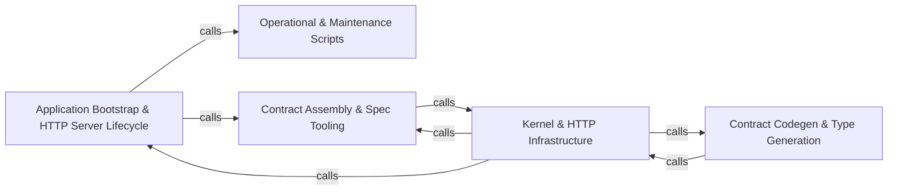

---
tags:
  - 2repo
  - 2repo/arch
  - project/boilerplate-node-backend
type: architecture
component: overview
---

## Details

This is a production-ready, contract-first Node.js/TypeScript e-commerce backend organized as a modular monolith. The Application Bootstrap & HTTP Server Lifecycle component is the entry point: it starts the Express server, installs routes, wires global error handling, and launches background workers. Every domain module (account, cart, orders, payments, products, etc.) is built on the Kernel & HTTP Infrastructure, which provides shared authentication, authorization, domain-event emission, the module registry, and the HTTP controller/response/error primitives. The remaining three components form the contract-first tooling pipeline: Contract Assembly & Spec Tooling authors and bundles the OpenAPI/AsyncAPI fragments and keeps the spec and frontend in sync; Contract Codegen & Type Generation turns those contracts into generated TypeScript types and collections; and Operational & Maintenance Scripts drives the day-to-day and CI workflows (demo seeding, cache clearing, mutation baselines, heap reports). Together they express a clear flow: authored contracts → assembled/bundled spec → generated types → a running, observable HTTP service backed by a shared kernel.

### Application Bootstrap & HTTP Server Lifecycle [[Expand]](./Application_Bootstrap_HTTP_Server_Lifecycle.md)
The application entry point that owns server startup/shutdown, global error handling, route installation, and system routes, plus the long-running worker adapters (email, outbox) and file/image storage it wires up.

**Related Classes/Methods**:

- `src.app.startServer`:59-117
- `src.app.stopServer`:122-131
- `src.app.routes.installRoutes`:26-48

**Source Files:**

- `api/models/accountDeleteConfirmRequest.ts`
  - `api.models.accountDeleteConfirmRequest.AccountDeleteConfirmRequest` (L22-L25) - Interface
- `api/models/addWishlistItemRequest.ts`
  - `api.models.addWishlistItemRequest.AddWishlistItemRequest` (L23-L25) - Interface
- `api/models/address.ts`
  - `api.models.address.Address` (L23-L34) - Interface
- `api/models/addressInput.ts`
  - `api.models.addressInput.AddressInput` (L22-L36) - Interface
- `api/models/addressesEnvelope.ts`
  - `api.models.addressesEnvelope.AddressesEnvelope` (L26-L31) - Interface
- `api/models/addressesResponse.ts`
  - `api.models.addressesResponse.AddressesResponse` (L23-L25) - Interface
- `api/models/adjustmentRequest.ts`
  - `api.models.adjustmentRequest.AdjustmentRequest` (L23-L29) - Interface
- `api/models/auditEventItem.ts`
  - `api.models.auditEventItem.AuditEventItem` (L26-L41) - Interface
- `api/models/auditLogsPage.ts`
  - `api.models.auditLogsPage.AuditLogsPage` (L24-L27) - Interface
- `api/models/auditLogsResponseEnvelope.ts`
  - `api.models.auditLogsResponseEnvelope.AuditLogsResponseEnvelope` (L26-L31) - Interface
- `api/models/authTokens.ts`
  - `api.models.authTokens.AuthTokens` (L22-L29) - Interface
- `api/models/authTokensEnvelope.ts`
  - `api.models.authTokensEnvelope.AuthTokensEnvelope` (L26-L31) - Interface
- `api/models/cancelOrderRequest.ts`
  - `api.models.cancelOrderRequest.CancelOrderRequest` (L25-L28) - Interface
- `api/models/cartResponse.ts`
  - `api.models.cartResponse.CartResponse` (L24-L27) - Interface
- `api/models/cartResponseEnvelope.ts`
  - `api.models.cartResponseEnvelope.CartResponseEnvelope` (L26-L31) - Interface
- `api/models/cartSummaryResponse.ts`
  - `api.models.cartSummaryResponse.CartSummaryResponse` (L22-L40) - Interface
- `api/models/cartSummaryResponseEnvelope.ts`
  - `api.models.cartSummaryResponseEnvelope.CartSummaryResponseEnvelope` (L26-L31) - Interface
- `api/models/catalogueFacetsEnvelope.ts`
  - `api.models.catalogueFacetsEnvelope.CatalogueFacetsEnvelope` (L26-L31) - Interface
- `api/models/catalogueFacetsResponse.ts`
  - `api.models.catalogueFacetsResponse.CatalogueFacetsResponse` (L23-L26) - Interface
- `api/models/changePasswordRequest.ts`
  - `api.models.changePasswordRequest.ChangePasswordRequest` (L23-L27) - Interface
- `api/models/checkoutRequest.ts`
  - `api.models.checkoutRequest.CheckoutRequest` (L24-L32) - Interface
- `api/models/checkoutResponse.ts`
  - `api.models.checkoutResponse.CheckoutResponse` (L23-L26) - Interface
- `api/models/checkoutResponseEnvelope.ts`
  - `api.models.checkoutResponseEnvelope.CheckoutResponseEnvelope` (L26-L31) - Interface
- `api/models/confirmPaymentRequest.ts`
  - `api.models.confirmPaymentRequest.ConfirmPaymentRequest` (L22-L30) - Interface
- `api/models/courierAdvanceResponse.ts`
  - `api.models.courierAdvanceResponse.CourierAdvanceResponse` (L22-L28) - Interface
- `api/models/courierAdvanceResponseEnvelope.ts`
  - `api.models.courierAdvanceResponseEnvelope.CourierAdvanceResponseEnvelope` (L26-L31) - Interface
- `api/models/createFeedbackRequest.ts`
  - `api.models.createFeedbackRequest.CreateFeedbackRequest` (L23-L28) - Interface
- `api/models/createLocaleEntryRequest.ts`
  - `api.models.createLocaleEntryRequest.CreateLocaleEntryRequest` (L23-L28) - Interface
- `api/models/createLocaleRequest.ts`
  - `api.models.createLocaleRequest.CreateLocaleRequest` (L24-L32) - Interface
- `api/models/createOrderRequest.ts`
  - `api.models.createOrderRequest.CreateOrderRequest` (L28-L33) - Interface
- `api/models/createPaymentIntentRequest.ts`
  - `api.models.createPaymentIntentRequest.CreatePaymentIntentRequest` (L23-L25) - Interface
- `api/models/createProductRequest.ts`
  - `api.models.createProductRequest.CreateProductRequest` (L23-L34) - Interface
- `api/models/createProductRequestMultipart.ts`
  - `api.models.createProductRequestMultipart.CreateProductRequestMultipart` (L22-L34) - Interface
- `api/models/createUserRequest.ts`
  - `api.models.createUserRequest.CreateUserRequest` (L26-L34) - Interface
- `api/models/createUserRequestMultipart.ts`
  - `api.models.createUserRequestMultipart.CreateUserRequestMultipart` (L25-L34) - Interface
- `api/models/deleteOrderRequest.ts`
  - `api.models.deleteOrderRequest.DeleteOrderRequest` (L23-L26) - Interface
- `api/models/deleteProductRequest.ts`
  - `api.models.deleteProductRequest.DeleteProductRequest` (L23-L26) - Interface
- `api/models/deleteUserRequest.ts`
  - `api.models.deleteUserRequest.DeleteUserRequest` (L23-L26) - Interface
- `api/models/errorItem.ts`
  - `api.models.errorItem.ErrorItem` (L23-L30) - Interface
- `api/models/errorResponse.ts`
  - `api.models.errorResponse.ErrorResponse` (L23-L33) - Interface
- `api/models/facetCount.ts`
  - `api.models.facetCount.FacetCount` (L22-L26) - Interface
- `api/models/feedbackRequest.ts`
  - `api.models.feedbackRequest.FeedbackRequest` (L25-L36) - Interface
- `api/models/feedbackRequestEnvelope.ts`
  - `api.models.feedbackRequestEnvelope.FeedbackRequestEnvelope` (L26-L31) - Interface
- `api/models/feedbackRequestsResponse.ts`
  - `api.models.feedbackRequestsResponse.FeedbackRequestsResponse` (L24-L27) - Interface
- `api/models/feedbackRequestsResponseEnvelope.ts`
  - `api.models.feedbackRequestsResponseEnvelope.FeedbackRequestsResponseEnvelope` (L26-L31) - Interface
- `api/models/hardDeleteRequest.ts`
  - `api.models.hardDeleteRequest.HardDeleteRequest` (L22-L24) - Interface
- `api/models/healthPing.ts`
  - `api.models.healthPing.HealthPing` (L23-L26) - Interface
- `api/models/healthPingEnvelope.ts`
  - `api.models.healthPingEnvelope.HealthPingEnvelope` (L26-L31) - Interface
- `api/models/inventoryLevel.ts`
  - `api.models.inventoryLevel.InventoryLevel` (L23-L33) - Interface
- `api/models/inventoryLevelEnvelope.ts`
  - `api.models.inventoryLevelEnvelope.InventoryLevelEnvelope` (L26-L31) - Interface
- `api/models/inventoryLevelsResponse.ts`
  - `api.models.inventoryLevelsResponse.InventoryLevelsResponse` (L24-L27) - Interface
- `api/models/inventoryLevelsResponseEnvelope.ts`
  - `api.models.inventoryLevelsResponseEnvelope.InventoryLevelsResponseEnvelope` (L26-L31) - Interface
- `api/models/language.ts`
  - `api.models.language.Language` (L28-L47) - Interface
- `api/models/languageEnvelope.ts`
  - `api.models.languageEnvelope.LanguageEnvelope` (L26-L31) - Interface
- `api/models/localeCapabilities.ts`
  - `api.models.localeCapabilities.LocaleCapabilities` (L27-L32) - Interface
- `api/models/localeCapabilitiesEnvelope.ts`
  - `api.models.localeCapabilitiesEnvelope.LocaleCapabilitiesEnvelope` (L26-L31) - Interface
- `api/models/localeCapability.ts`
  - `api.models.localeCapability.LocaleCapability` (L29-L45) - Interface
- `api/models/localeDictionary.ts`
  - `api.models.localeDictionary.LocaleDictionary` (L27-L31) - Interface
- `api/models/localeDictionaryEnvelope.ts`
  - `api.models.localeDictionaryEnvelope.LocaleDictionaryEnvelope` (L26-L31) - Interface
- `api/models/localeEntriesResponse.ts`
  - `api.models.localeEntriesResponse.LocaleEntriesResponse` (L24-L27) - Interface
- `api/models/localeEntriesResponseEnvelope.ts`
  - `api.models.localeEntriesResponseEnvelope.LocaleEntriesResponseEnvelope` (L26-L31) - Interface
- `api/models/localeEntry.ts`
  - `api.models.localeEntry.LocaleEntry` (L29-L38) - Interface
- `api/models/localeEntryEnvelope.ts`
  - `api.models.localeEntryEnvelope.LocaleEntryEnvelope` (L26-L31) - Interface
- `api/models/localeEntryInput.ts`
  - `api.models.localeEntryInput.LocaleEntryInput` (L27-L31) - Interface
- `api/models/localeImportResult.ts`
  - `api.models.localeImportResult.LocaleImportResult` (L25-L34) - Interface
- `api/models/localeImportResultEnvelope.ts`
  - `api.models.localeImportResultEnvelope.LocaleImportResultEnvelope` (L26-L31) - Interface
- `api/models/localeMessages.ts`
  - `api.models.localeMessages.LocaleMessages` (L27-L33) - Interface
- `api/models/localeMessagesEnvelope.ts`
  - `api.models.localeMessagesEnvelope.LocaleMessagesEnvelope` (L26-L31) - Interface
- `api/models/localeTenantDescriptor.ts`
  - `api.models.localeTenantDescriptor.LocaleTenantDescriptor` (L27-L32) - Interface
- `api/models/localeTenants.ts`
  - `api.models.localeTenants.LocaleTenants` (L23-L26) - Interface
- `api/models/localeTenantsEnvelope.ts`
  - `api.models.localeTenantsEnvelope.LocaleTenantsEnvelope` (L26-L31) - Interface
- `api/models/loginRequest.ts`
  - `api.models.loginRequest.LoginRequest` (L25-L30) - Interface
- `api/models/mergeLocaleEntriesRequest.ts`
  - `api.models.mergeLocaleEntriesRequest.MergeLocaleEntriesRequest` (L27-L31) - Interface
- `api/models/messageResponse.ts`
  - `api.models.messageResponse.MessageResponse` (L25-L29) - Interface
- `api/models/observabilityDependency.ts`
  - `api.models.observabilityDependency.ObservabilityDependency` (L23-L25) - Interface
- `api/models/observabilityHealth.ts`
  - `api.models.observabilityHealth.ObservabilityHealth` (L27-L44) - Interface
- `api/models/observabilityHealthDependencies.ts`
  - `api.models.observabilityHealthDependencies.ObservabilityHealthDependencies` (L26-L30) - Interface
- `api/models/observabilityHealthResponseEnvelope.ts`
  - `api.models.observabilityHealthResponseEnvelope.ObservabilityHealthResponseEnvelope` (L26-L31) - Interface
- `api/models/observabilityHealthSystem.ts`
  - `api.models.observabilityHealthSystem.ObservabilityHealthSystem` (L22-L26) - Interface
- `api/models/observabilityHealthTelemetry.ts`
  - `api.models.observabilityHealthTelemetry.ObservabilityHealthTelemetry` (L27-L33) - Interface
- `api/models/observabilityMetricsLatency.ts`
  - `api.models.observabilityMetricsLatency.ObservabilityMetricsLatency` (L22-L27) - Interface
- `api/models/observabilityMetricsSummary.ts`
  - `api.models.observabilityMetricsSummary.ObservabilityMetricsSummary` (L27-L34) - Interface
- `api/models/observabilityMetricsSummaryResponseEnvelope.ts`
  - `api.models.observabilityMetricsSummaryResponseEnvelope.ObservabilityMetricsSummaryResponseEnvelope` (L26-L31) - Interface
- `api/models/order.ts`
  - `api.models.order.Order` (L28-L63) - Interface
- `api/models/orderActions.ts`
  - `api.models.orderActions.OrderActions` (L26-L33) - Interface
- `api/models/orderAddress.ts`
  - `api.models.orderAddress.OrderAddress` (L22-L29) - Interface
- `api/models/orderEnvelope.ts`
  - `api.models.orderEnvelope.OrderEnvelope` (L26-L31) - Interface
- `api/models/orderItem.ts`
  - `api.models.orderItem.OrderItem` (L23-L27) - Interface
- `api/models/ordersResponse.ts`
  - `api.models.ordersResponse.OrdersResponse` (L24-L27) - Interface
- `api/models/ordersResponseEnvelope.ts`
  - `api.models.ordersResponseEnvelope.OrdersResponseEnvelope` (L26-L31) - Interface
- `api/models/paginationMeta.ts`
  - `api.models.paginationMeta.PaginationMeta` (L24-L31) - Interface
- `api/models/passwordResetConfirmRequest.ts`
  - `api.models.passwordResetConfirmRequest.PasswordResetConfirmRequest` (L23-L28) - Interface
- `api/models/passwordResetRequest.ts`
  - `api.models.passwordResetRequest.PasswordResetRequest` (L23-L25) - Interface
- `api/models/payment.ts`
  - `api.models.payment.Payment` (L25-L45) - Interface
- `api/models/paymentActions.ts`
  - `api.models.paymentActions.PaymentActions` (L25-L30) - Interface
- `api/models/paymentEnvelope.ts`
  - `api.models.paymentEnvelope.PaymentEnvelope` (L26-L31) - Interface
- `api/models/processMemory.ts`
  - `api.models.processMemory.ProcessMemory` (L26-L35) - Interface
- `api/models/product.ts`
  - `api.models.product.Product` (L24-L52) - Interface
- `api/models/productEnvelope.ts`
  - `api.models.productEnvelope.ProductEnvelope` (L26-L31) - Interface
- `api/models/productsResponse.ts`
  - `api.models.productsResponse.ProductsResponse` (L24-L27) - Interface
- `api/models/productsResponseEnvelope.ts`
  - `api.models.productsResponseEnvelope.ProductsResponseEnvelope` (L26-L31) - Interface
- `api/models/receiptRequest.ts`
  - `api.models.receiptRequest.ReceiptRequest` (L23-L32) - Interface
- `api/models/refreshTokenEnvelope.ts`
  - `api.models.refreshTokenEnvelope.RefreshTokenEnvelope` (L26-L31) - Interface
- `api/models/refreshTokenResponse.ts`
  - `api.models.refreshTokenResponse.RefreshTokenResponse` (L22-L29) - Interface
- `api/models/removeCartItemRequest.ts`
  - `api.models.removeCartItemRequest.RemoveCartItemRequest` (L23-L25) - Interface
- `api/models/replaceLocaleEntriesRequest.ts`
  - `api.models.replaceLocaleEntriesRequest.ReplaceLocaleEntriesRequest` (L28-L31) - Interface
- `api/models/reservationSweepEnvelope.ts`
  - `api.models.reservationSweepEnvelope.ReservationSweepEnvelope` (L26-L31) - Interface
- `api/models/reservationSweepResponse.ts`
  - `api.models.reservationSweepResponse.ReservationSweepResponse` (L22-L28) - Interface
- `api/models/searchFeedbackRequestsRequest.ts`
  - `api.models.searchFeedbackRequestsRequest.SearchFeedbackRequestsRequest` (L27-L33) - Interface
- `api/models/searchOrdersRequest.ts`
  - `api.models.searchOrdersRequest.SearchOrdersRequest` (L27-L36) - Interface
- `api/models/searchProductsRequest.ts`
  - `api.models.searchProductsRequest.SearchProductsRequest` (L26-L39) - Interface
- `api/models/searchUsersRequest.ts`
  - `api.models.searchUsersRequest.SearchUsersRequest` (L27-L37) - Interface
- `api/models/session.ts`
  - `api.models.session.Session` (L23-L31) - Interface
- `api/models/sessionsEnvelope.ts`
  - `api.models.sessionsEnvelope.SessionsEnvelope` (L26-L31) - Interface
- `api/models/sessionsResponse.ts`
  - `api.models.sessionsResponse.SessionsResponse` (L23-L25) - Interface
- `api/models/shipment.ts`
  - `api.models.shipment.Shipment` (L24-L34) - Interface
- `api/models/shipmentEnvelope.ts`
  - `api.models.shipmentEnvelope.ShipmentEnvelope` (L26-L31) - Interface
- `api/models/shippingMethod.ts`
  - `api.models.shippingMethod.ShippingMethod` (L22-L35) - Interface
- `api/models/shippingMethodsResponse.ts`
  - `api.models.shippingMethodsResponse.ShippingMethodsResponse` (L23-L25) - Interface
- `api/models/shippingMethodsResponseEnvelope.ts`
  - `api.models.shippingMethodsResponseEnvelope.ShippingMethodsResponseEnvelope` (L26-L31) - Interface
- `api/models/signupRequest.ts`
  - `api.models.signupRequest.SignupRequest` (L25-L32) - Interface
- `api/models/signupRequestMultipart.ts`
  - `api.models.signupRequestMultipart.SignupRequestMultipart` (L24-L32) - Interface
- `api/models/stockMovement.ts`
  - `api.models.stockMovement.StockMovement` (L24-L36) - Interface
- `api/models/stockMovementsResponse.ts`
  - `api.models.stockMovementsResponse.StockMovementsResponse` (L24-L27) - Interface
- `api/models/stockMovementsResponseEnvelope.ts`
  - `api.models.stockMovementsResponseEnvelope.StockMovementsResponseEnvelope` (L26-L31) - Interface
- `api/models/updateAccountRequest.ts`
  - `api.models.updateAccountRequest.UpdateAccountRequest` (L25-L31) - Interface
- `api/models/updateAccountRequestMultipart.ts`
  - `api.models.updateAccountRequestMultipart.UpdateAccountRequestMultipart` (L24-L31) - Interface
- `api/models/updateAddressRequest.ts`
  - `api.models.updateAddressRequest.UpdateAddressRequest` (L22-L36) - Interface
- `api/models/updateCartItemByIdRequest.ts`
  - `api.models.updateCartItemByIdRequest.UpdateCartItemByIdRequest` (L23-L27) - Interface
- `api/models/updateFeedbackRequestStatusRequest.ts`
  - `api.models.updateFeedbackRequestStatusRequest.UpdateFeedbackRequestStatusRequest` (L23-L26) - Interface
- `api/models/updateLocaleEntryRequest.ts`
  - `api.models.updateLocaleEntryRequest.UpdateLocaleEntryRequest` (L22-L24) - Interface
- `api/models/updateLocaleRequest.ts`
  - `api.models.updateLocaleRequest.UpdateLocaleRequest` (L26-L33) - Interface
- `api/models/updateOrderByIdRequest.ts`
  - `api.models.updateOrderByIdRequest.UpdateOrderByIdRequest` (L26-L33) - Interface
- `api/models/updateOrderRequest.ts`
  - `api.models.updateOrderRequest.UpdateOrderRequest` (L26-L34) - Interface
- `api/models/updateProductByIdRequest.ts`
  - `api.models.updateProductByIdRequest.UpdateProductByIdRequest` (L23-L32) - Interface
- `api/models/updateProductByIdRequestMultipart.ts`
  - `api.models.updateProductByIdRequestMultipart.UpdateProductByIdRequestMultipart` (L22-L32) - Interface
- `api/models/updateProductRequest.ts`
  - `api.models.updateProductRequest.UpdateProductRequest` (L24-L34) - Interface
- `api/models/updateProductRequestMultipart.ts`
  - `api.models.updateProductRequestMultipart.UpdateProductRequestMultipart` (L23-L34) - Interface
- `api/models/updateUserByIdRequest.ts`
  - `api.models.updateUserByIdRequest.UpdateUserByIdRequest` (L25-L32) - Interface
- `api/models/updateUserByIdRequestMultipart.ts`
  - `api.models.updateUserByIdRequestMultipart.UpdateUserByIdRequestMultipart` (L24-L32) - Interface
- `api/models/updateUserRequest.ts`
  - `api.models.updateUserRequest.UpdateUserRequest` (L27-L36) - Interface
- `api/models/updateUserRequestMultipart.ts`
  - `api.models.updateUserRequestMultipart.UpdateUserRequestMultipart` (L26-L36) - Interface
- `api/models/upsertCartItemRequest.ts`
  - `api.models.upsertCartItemRequest.UpsertCartItemRequest` (L23-L27) - Interface
- `api/models/user.ts`
  - `api.models.user.User` (L26-L38) - Interface
- `api/models/userEnvelope.ts`
  - `api.models.userEnvelope.UserEnvelope` (L26-L31) - Interface
- `api/models/usersResponse.ts`
  - `api.models.usersResponse.UsersResponse` (L24-L27) - Interface
- `api/models/usersResponseEnvelope.ts`
  - `api.models.usersResponseEnvelope.UsersResponseEnvelope` (L26-L31) - Interface
- `api/models/validationErrorResponse.ts`
  - `api.models.validationErrorResponse.ValidationErrorResponse` (L23-L33) - Interface
- `api/models/verifyEmailConfirmRequest.ts`
  - `api.models.verifyEmailConfirmRequest.VerifyEmailConfirmRequest` (L22-L25) - Interface
- `api/models/wishlistItem.ts`
  - `api.models.wishlistItem.WishlistItem` (L23-L25) - Interface
- `api/models/wishlistResponse.ts`
  - `api.models.wishlistResponse.WishlistResponse` (L23-L25) - Interface
- `api/models/wishlistResponseEnvelope.ts`
  - `api.models.wishlistResponseEnvelope.WishlistResponseEnvelope` (L26-L31) - Interface
- `scripts/check-mutation-baseline.ts`
  - `scripts.check-mutation-baseline.counts.held.comparisons.filter() callback` (L40-L40) - Function
  - `scripts.check-mutation-baseline.counts.improved.comparisons.filter() callback` (L41-L41) - Function
  - `scripts.check-mutation-baseline.counts.regressed.comparisons.filter() callback` (L42-L42) - Function
  - `scripts.check-mutation-baseline.counts.added.comparisons.filter() callback` (L43-L43) - Function
  - `scripts.check-mutation-baseline.counts.removed.comparisons.filter() callback` (L44-L44) - Function
  - `scripts.check-mutation-baseline.map() callback` (L70-L70) - Function
  - `scripts.check-mutation-baseline.comparisons.filter() callback` (L94-L94) - Function
- `scripts/regenerate.ts`
  - `scripts.regenerate.Step` (L31-L36) - Interface
- `src/app.ts`
  - `src.app.startServer` (L59-L117) - Class
  - `src.app.then() callback` (L64-L64) - Function
  - `src.app.startServer.then() callback.enabledModules.map() callback` (L75-L75) - Function
  - `src.app.startServer.then() callback.filter() callback` (L76-L76) - Function
  - `src.app.startServer.then() callback` (L105-L114) - Function
  - `src.app.startServer.then() callback.<function>` (L106-L114) - Function
  - `src.app.startServer.then() callback.<function>.server` (L109-L113) - Class
  - `src.app.startServer.then() callback.<function>.server.app.listen() callback` (L109-L113) - Function
  - `src.app.stopServer` (L122-L131) - Class
  - `src.app.stopServer.finally() callback` (L125-L128) - Function
  - `src.app.catch() callback` (L171-L172) - Function
- `src/app/routes.ts`
  - `src.app.routes.installRoutes` (L26-L48) - Class
  - `src.app.routes.installRoutes.app.use() callback` (L45-L47) - Function
- `src/app/system-routes.ts`
  - `src.app.system-routes.router.get('/') callback` (L7-L9) - Function
- `src/globals.d.ts`
  - `src.globals.d.'express-serve-static-core'.Request` (L5-L23) - Interface
- `src/infrastructure/adapters/demo-outbox.ts`
  - `src.infrastructure.adapters.demo-outbox.DemoOutboxEmail` (L18-L26) - Interface
  - `src.infrastructure.adapters.demo-outbox.recordDemoEmail.lines.filter() callback` (L50-L50) - Function
  - `src.infrastructure.adapters.demo-outbox.recordDemoEmail.lines.map() callback` (L51-L51) - Function
- `src/infrastructure/adapters/email.worker.ts`
  - `src.infrastructure.adapters.email.worker.handleEmailJob` (L23-L49) - Class
  - `src.infrastructure.adapters.email.worker.handleEmailJob.then() callback` (L42-L42) - Function
  - `src.infrastructure.adapters.email.worker.handleEmailJob.catch() callback` (L43-L48) - Function
- `src/infrastructure/adapters/filesystem.ts`
  - `src.infrastructure.adapters.filesystem.deleteFile` (L51-L61) - Class
  - `src.infrastructure.adapters.filesystem.deleteFile.toolkitDeleteFile() callback` (L53-L60) - Function
- `src/infrastructure/adapters/image-store.ts`
  - `src.infrastructure.adapters.image-store.ImageStore` (L21-L50) - Interface
  - `src.infrastructure.adapters.image-store.ImageStore.put` (L37-L37) - Method
  - `src.infrastructure.adapters.image-store.ImageStore.remove` (L49-L49) - Method
  - `src.infrastructure.adapters.image-store.filesystemImageStore` (L80-L126) - Class
  - `src.infrastructure.adapters.image-store.filesystemImageStore.put` (L81-L88) - Method
  - `src.infrastructure.adapters.image-store.filesystemImageStore.remove` (L90-L125) - Method
- `src/infrastructure/adapters/mailer.ts`
  - `src.infrastructure.adapters.mailer.nodemailer` (L148-L212) - Class
  - `src.infrastructure.adapters.mailer.nodemailer.withSpan('email.send') callback` (L160-L211) - Function
  - `src.infrastructure.adapters.mailer.withSpan('email.send') callback.then() callback` (L191-L200) - Function
  - `src.infrastructure.adapters.mailer.nodemailer.withSpan('email.send') callback.then() callback` (L202-L207) - Function
  - `src.infrastructure.adapters.mailer.EmailContent` (L248-L264) - Interface
  - `src.infrastructure.adapters.mailer.enqueueEmail` (L282-L310) - Class
  - `src.infrastructure.adapters.mailer.then() callback` (L289-L289) - Function
  - `src.infrastructure.adapters.mailer.enqueueEmail.then() callback` (L298-L309) - Function
  - `src.infrastructure.adapters.mailer.enqueueEmail.then() callback.then() callback` (L301-L301) - Function
- `src/infrastructure/adapters/storage.ts`
  - `src.infrastructure.adapters.storage.withLocaleRestored` (L240-L249) - Class
  - `src.infrastructure.adapters.storage.withLocaleRestored.<function>` (L242-L249) - Function
  - `src.infrastructure.adapters.storage.withLocaleRestored.<function>.middleware() callback` (L243-L249) - Function
  - `src.infrastructure.adapters.storage.withLocaleRestored.<function>.middleware() callback.runWithLocaleContext() callback` (L248-L248) - Function
  - `src.infrastructure.adapters.storage.upload` (L389-L396) - Class
  - `src.infrastructure.adapters.storage.upload.single` (L390-L390) - Method
  - `src.infrastructure.adapters.storage.upload.array` (L391-L392) - Method
  - `src.infrastructure.adapters.storage.upload.fields` (L393-L393) - Method
  - `src.infrastructure.adapters.storage.upload.none` (L394-L394) - Method
  - `src.infrastructure.adapters.storage.upload.any` (L395-L395) - Method
- `src/infrastructure/http/delete-controller.ts`
  - `src.infrastructure.http.delete-controller.DeleteControllerSpec` (L44-L56) - Interface
  - `src.infrastructure.http.delete-controller.createDeleteController.handler` (L72-L121) - Class
  - `src.infrastructure.http.delete-controller.createDeleteController.handler.[operation]` (L73-L120) - Method
  - `src.infrastructure.http.delete-controller.createDeleteController.handler.[operation].then() callback` (L99-L112) - Function
  - `src.infrastructure.http.delete-controller.createDeleteController.handler.[operation].catch() callback` (L113-L119) - Function
- `src/infrastructure/http/errors.ts`
  - `src.infrastructure.http.errors.databaseErrorInterpreter` (L99-L129) - Function
- `src/infrastructure/http/middlewares/security.ts`
  - `src.infrastructure.http.middlewares.security.refuse` (L47-L62) - Class
  - `src.infrastructure.http.middlewares.security.refuse.<function>` (L49-L62) - Function
- `src/infrastructure/http/uploads.ts`
  - `src.infrastructure.http.uploads.resolveImageUrl` (L73-L76) - Function
- `src/infrastructure/i18n/catalog.ts`
  - `src.infrastructure.i18n.catalog.listSupportedLocales` (L42-L59) - Class
  - `src.infrastructure.i18n.catalog.listSupportedLocales.declared` (L45-L47) - Class
  - `src.infrastructure.i18n.catalog.listSupportedLocales.declared.map() callback` (L46-L46) - Function
  - `src.infrastructure.i18n.catalog.listSupportedLocales.filter() callback` (L54-L54) - Function
  - `src.infrastructure.i18n.catalog.listSupportedLocales.map() callback` (L55-L55) - Function
  - `src.infrastructure.i18n.catalog.loadLocaleResources` (L153-L159) - Class
  - `src.infrastructure.i18n.catalog.loadLocaleResources.map() callback` (L155-L158) - Function
- `src/infrastructure/i18n/overrides.ts`
  - `src.infrastructure.i18n.overrides.refreshLocaleOverrides` (L105-L118) - Class
  - `src.infrastructure.i18n.overrides.refreshLocaleOverrides.then() callback` (L109-L109) - Function
  - `src.infrastructure.i18n.overrides.refreshLocaleOverrides.catch() callback` (L110-L117) - Function
- `src/infrastructure/observability/analytics/index.ts`
  - `src.infrastructure.observability.analytics.index.AnalyticsProvider` (L83-L110) - Interface
  - `src.infrastructure.observability.analytics.index.AnalyticsProvider.capture` (L91-L91) - Method
  - `src.infrastructure.observability.analytics.index.AnalyticsProvider.configured` (L101-L101) - Method
  - `src.infrastructure.observability.analytics.index.AnalyticsProvider.shutdown` (L109-L109) - Method
  - `src.infrastructure.observability.analytics.index.shutdownAnalytics` (L195-L202) - Class
  - `src.infrastructure.observability.analytics.index.shutdownAnalytics.then() callback` (L197-L201) - Function
- `src/infrastructure/observability/analytics/none.ts`
  - `src.infrastructure.observability.analytics.none.noneAnalyticsProvider` (L12-L27) - Class
  - `src.infrastructure.observability.analytics.none.noneAnalyticsProvider.capture` (L15-L17) - Method
  - `src.infrastructure.observability.analytics.none.noneAnalyticsProvider.configured` (L20-L22) - Method
  - `src.infrastructure.observability.analytics.none.noneAnalyticsProvider.shutdown` (L24-L26) - Method
- `src/infrastructure/observability/analytics/posthog.ts`
  - `src.infrastructure.observability.analytics.posthog.posthogAnalyticsProvider` (L55-L110) - Class
  - `src.infrastructure.observability.analytics.posthog.posthogAnalyticsProvider.configured` (L58-L60) - Method
  - `src.infrastructure.observability.analytics.posthog.posthogAnalyticsProvider.capture` (L62-L93) - Method
  - `src.infrastructure.observability.analytics.posthog.posthogAnalyticsProvider.shutdown` (L102-L109) - Method
- `src/infrastructure/observability/analytics/umami.ts`
  - `src.infrastructure.observability.analytics.umami.umamiAnalyticsProvider` (L94-L174) - Class
  - `src.infrastructure.observability.analytics.umami.umamiAnalyticsProvider.configured` (L99-L101) - Method
  - `src.infrastructure.observability.analytics.umami.umamiAnalyticsProvider.capture` (L103-L163) - Method
  - `src.infrastructure.observability.analytics.umami.umamiAnalyticsProvider.capture.then() callback` (L146-L156) - Function
  - `src.infrastructure.observability.analytics.umami.umamiAnalyticsProvider.capture.catch() callback` (L157-L162) - Function
  - `src.infrastructure.observability.analytics.umami.umamiAnalyticsProvider.shutdown` (L171-L173) - Method
- `src/infrastructure/observability/audit.ts`
  - `src.infrastructure.observability.audit.AuditEvent` (L57-L79) - Interface
  - `src.infrastructure.observability.audit.AuditEntry` (L85-L90) - Interface
- `src/infrastructure/observability/dependency-health.ts`
  - `src.infrastructure.observability.dependency-health.DependencyHealth` (L52-L56) - Interface
  - `src.infrastructure.observability.dependency-health.overallStatus` (L91-L94) - Class
  - `src.infrastructure.observability.dependency-health.overallStatus.every() callback` (L92-L92) - Function
- `src/infrastructure/observability/metrics-http.ts`
  - `src.infrastructure.observability.metrics-http._processUptimeGauge` (L41-L53) - Class
  - `src.infrastructure.observability.metrics-http._processUptimeGauge.collect` (L50-L52) - Method
  - `src.infrastructure.observability.metrics-http._heapSizeLimitGauge` (L68-L75) - Class
  - `src.infrastructure.observability.metrics-http._heapSizeLimitGauge.collect` (L72-L74) - Method
  - `src.infrastructure.observability.metrics-http.RequestMetricInput` (L162-L168) - Interface
  - `src.infrastructure.observability.metrics-http.sumMetricValues` (L212-L213) - Class
  - `src.infrastructure.observability.metrics-http.sumMetricValues.values.reduce() callback` (L213-L213) - Function
  - `src.infrastructure.observability.metrics-http.LatencyBucket` (L216-L220) - Interface
  - `src.infrastructure.observability.metrics-http.aggregateLatencyBuckets.buckets.toSorted() callback` (L259-L259) - Function
  - `src.infrastructure.observability.metrics-http.aggregateLatencyBuckets.buckets.map() callback` (L260-L260) - Function
  - `src.infrastructure.observability.metrics-http.getHttpRequestCounters` (L302-L308) - Class
  - `src.infrastructure.observability.metrics-http.getHttpRequestCounters.then() callback` (L304-L307) - Function
  - `src.infrastructure.observability.metrics-http.getLatencyPercentiles` (L327-L336) - Class
  - `src.infrastructure.observability.metrics-http.getLatencyPercentiles.then() callback` (L328-L336) - Function
- `src/infrastructure/observability/process-snapshot.ts`
  - `src.infrastructure.observability.process-snapshot.ProcessMemorySnapshot` (L28-L40) - Interface
  - `src.infrastructure.observability.process-snapshot.ProcessSnapshot` (L43-L53) - Interface
- `src/infrastructure/observability/stream.ts`
  - `src.infrastructure.observability.stream.buildObservabilityPayload` (L69-L90) - Class
  - `src.infrastructure.observability.stream.buildObservabilityPayload.then() callback` (L73-L89) - Function
  - `src.infrastructure.observability.stream.writeMetricsEvent` (L99-L106) - Class
  - `src.infrastructure.observability.stream.writeMetricsEvent.then() callback` (L102-L104) - Function
  - `src.infrastructure.observability.stream.writeMetricsEvent.catch() callback` (L105-L105) - Function
  - `src.infrastructure.observability.stream.streamObservabilityMetrics.updatesInterval` (L133-L135) - Class
  - `src.infrastructure.observability.stream.streamObservabilityMetrics.updatesInterval.setInterval() callback` (L133-L135) - Function
  - `src.infrastructure.observability.stream.streamObservabilityMetrics.heartbeatInterval` (L139-L141) - Class
  - `src.infrastructure.observability.stream.streamObservabilityMetrics.heartbeatInterval.setInterval() callback` (L139-L141) - Function
- `src/infrastructure/observability/tracer.ts`
  - `src.infrastructure.observability.tracer.withSpan` (L46-L90) - Class
  - `src.infrastructure.observability.tracer.withSpan.tracer.startActiveSpan() callback` (L56-L89) - Function
  - `src.infrastructure.observability.tracer.tracer.startActiveSpan() callback.then() callback` (L65-L71) - Function
  - `src.infrastructure.observability.tracer.withSpan.tracer.startActiveSpan() callback.then() callback` (L72-L87) - Function
- `src/infrastructure/runtime/server-lifecycle.ts`
  - `src.infrastructure.runtime.server-lifecycle.closeServer` (L45-L54) - Class
  - `src.infrastructure.runtime.server-lifecycle.closeServer.<function>` (L46-L54) - Function
  - `src.infrastructure.runtime.server-lifecycle.closeServer.<function>.server.close() callback` (L47-L53) - Function
  - `src.infrastructure.runtime.server-lifecycle.shutdownInfra` (L69-L85) - Class
  - `src.infrastructure.runtime.server-lifecycle.shutdownInfra.then() callback` (L85-L85) - Function
  - `src.infrastructure.runtime.server-lifecycle.onProcessSignal.then() callback` (L114-L114) - Function
- `src/modules/account/analytics.ts`
  - `src.modules.account.analytics.'@infrastructure/observability/analytics'.AnalyticsEventMap` (L26-L28) - Interface
- `src/modules/account/audit.ts`
  - `src.modules.account.audit.'@infrastructure/observability/audit'.AuditActionMap` (L36-L38) - Interface
- `src/modules/account/controllers/delete-account-confirm.ts`
  - `src.modules.account.controllers.delete-account-confirm.deleteAccountConfirm` (L20-L81) - Class
  - `src.modules.account.controllers.delete-account-confirm.deleteAccountConfirm.then() callback` (L31-L79) - Function
  - `src.modules.account.controllers.delete-account-confirm.deleteAccountConfirm.then() callback.then() callback` (L46-L78) - Function
  - `src.modules.account.controllers.delete-account-confirm.deleteAccountConfirm.catch() callback` (L80-L80) - Function
- `src/modules/account/controllers/delete-account-request.ts`
  - `src.modules.account.controllers.delete-account-request.deleteAccountRequest` (L23-L61) - Class
  - `src.modules.account.controllers.delete-account-request.deleteAccountRequest.then() callback` (L29-L59) - Function
  - `src.modules.account.controllers.delete-account-request.deleteAccountRequest.then() callback.then() callback` (L34-L58) - Function
  - `src.modules.account.controllers.delete-account-request.deleteAccountRequest.catch() callback` (L60-L60) - Function
- `src/modules/account/controllers/delete-address.ts`
  - `src.modules.account.controllers.delete-address.deleteAddress` (L17-L29) - Class
  - `src.modules.account.controllers.delete-address.deleteAddress.then() callback` (L24-L27) - Function
- `src/modules/account/controllers/delete-expired-tokens.ts`
  - `src.modules.account.controllers.delete-expired-tokens.deleteExpiredTokens` (L14-L31) - Class
  - `src.modules.account.controllers.delete-expired-tokens.deleteExpiredTokens.then() callback` (L19-L29) - Function
- `src/modules/account/controllers/delete-session.ts`
  - `src.modules.account.controllers.delete-session.deleteSession` (L23-L46) - Class
  - `src.modules.account.controllers.delete-session.deleteSession.then() callback` (L30-L44) - Function
- `src/modules/account/controllers/get-account.ts`
  - `src.modules.account.controllers.get-account.getAccount` (L17-L35) - Class
  - `src.modules.account.controllers.get-account.getAccount.then() callback` (L29-L33) - Function
  - `src.modules.account.controllers.get-account.getAccount.catch() callback` (L34-L34) - Function
- `src/modules/account/controllers/get-addresses.ts`
  - `src.modules.account.controllers.get-addresses.getAddresses` (L14-L24) - Class
  - `src.modules.account.controllers.get-addresses.getAddresses.then() callback` (L20-L22) - Function
- `src/modules/account/controllers/get-refresh-token.ts`
  - `src.modules.account.controllers.get-refresh-token.getRefreshToken` (L21-L86) - Class
  - `src.modules.account.controllers.get-refresh-token.getRefreshToken.then() callback` (L50-L77) - Function
  - `src.modules.account.controllers.get-refresh-token.getRefreshToken.then() callback.then() callback.then() callback` (L54-L54) - Function
  - `src.modules.account.controllers.get-refresh-token.getRefreshToken.then() callback.then() callback` (L55-L64) - Function
  - `src.modules.account.controllers.get-refresh-token.getRefreshToken.then() callback.catch() callback` (L65-L77) - Function
  - `src.modules.account.controllers.get-refresh-token.getRefreshToken.catch() callback` (L79-L85) - Function
- `src/modules/account/controllers/get-sessions.ts`
  - `src.modules.account.controllers.get-sessions.getSessions` (L30-L58) - Class
  - `src.modules.account.controllers.get-sessions.getSessions.then() callback` (L39-L55) - Function
  - `src.modules.account.controllers.get-sessions.getSessions.then() callback.sessions.user.tokens.filter() callback` (L51-L51) - Function
  - `src.modules.account.controllers.get-sessions.getSessions.then() callback.sessions.map() callback` (L52-L52) - Function
- `src/modules/account/controllers/post-login.ts`
  - `src.modules.account.controllers.post-login.postLogin` (L63-L144) - Class
  - `src.modules.account.controllers.post-login.postLogin.then() callback` (L99-L137) - Function
  - `src.modules.account.controllers.post-login.postLogin.then() callback.then() callback` (L128-L136) - Function
  - `src.modules.account.controllers.post-login.postLogin.catch() callback` (L138-L143) - Function
- `src/modules/account/controllers/post-logout-everywhere.ts`
  - `src.modules.account.controllers.post-logout-everywhere.postLogoutEverywhere` (L16-L33) - Class
  - `src.modules.account.controllers.post-logout-everywhere.postLogoutEverywhere.then() callback` (L19-L31) - Function
- `src/modules/account/controllers/post-logout.ts`
  - `src.modules.account.controllers.post-logout.postLogout` (L22-L40) - Class
  - `src.modules.account.controllers.post-logout.postLogout.then() callback` (L26-L38) - Function
- `src/modules/account/controllers/post-password-change.ts`
  - `src.modules.account.controllers.post-password-change.postPasswordChange` (L23-L67) - Class
  - `src.modules.account.controllers.post-password-change.postPasswordChange.then() callback` (L41-L62) - Function
  - `src.modules.account.controllers.post-password-change.postPasswordChange.catch() callback` (L63-L66) - Function
- `src/modules/account/controllers/post-reset-confirm.ts`
  - `src.modules.account.controllers.post-reset-confirm.postResetConfirm` (L19-L117) - Class
  - `src.modules.account.controllers.post-reset-confirm.postResetConfirm.then() callback` (L34-L113) - Function
  - `src.modules.account.controllers.post-reset-confirm.postResetConfirm.then() callback.then() callback` (L68-L112) - Function
  - `src.modules.account.controllers.post-reset-confirm.postResetConfirm.then() callback.then() callback.then() callback` (L79-L111) - Function
  - `src.modules.account.controllers.post-reset-confirm.postResetConfirm.catch() callback` (L114-L116) - Function
- `src/modules/account/controllers/post-reset-request.ts`
  - `src.modules.account.controllers.post-reset-request.lookupResetData` (L26-L38) - Class
  - `src.modules.account.controllers.post-reset-request.lookupResetData.then() callback` (L28-L37) - Function
  - `src.modules.account.controllers.post-reset-request.lookupResetData.then() callback.then() callback` (L30-L36) - Function
  - `src.modules.account.controllers.post-reset-request.postResetRequest` (L46-L92) - Class
  - `src.modules.account.controllers.post-reset-request.postResetRequest.catch() callback` (L59-L61) - Function
  - `src.modules.account.controllers.post-reset-request.postResetRequest.then() callback` (L62-L90) - Function
- `src/modules/account/controllers/post-signup.ts`
  - `src.modules.account.controllers.post-signup.postSignup` (L20-L94) - Class
  - `src.modules.account.controllers.post-signup.postSignup.then() callback` (L48-L88) - Function
  - `src.modules.account.controllers.post-signup.postSignup.then() callback.then() callback` (L50-L61) - Function
  - `src.modules.account.controllers.post-signup.postSignup.catch() callback` (L89-L93) - Function
- `src/modules/account/controllers/post-verify-confirm.ts`
  - `src.modules.account.controllers.post-verify-confirm.postVerifyConfirm` (L25-L82) - Class
  - `src.modules.account.controllers.post-verify-confirm.postVerifyConfirm.then() callback` (L39-L77) - Function
  - `src.modules.account.controllers.post-verify-confirm.postVerifyConfirm.then() callback.then() callback` (L55-L76) - Function
  - `src.modules.account.controllers.post-verify-confirm.postVerifyConfirm.then() callback.then() callback.then() callback` (L63-L75) - Function
  - `src.modules.account.controllers.post-verify-confirm.postVerifyConfirm.catch() callback` (L78-L81) - Function
- `src/modules/account/controllers/post-verify-request.ts`
  - `src.modules.account.controllers.post-verify-request.postVerifyRequest` (L20-L51) - Class
  - `src.modules.account.controllers.post-verify-request.postVerifyRequest.then() callback` (L28-L48) - Function
  - `src.modules.account.controllers.post-verify-request.postVerifyRequest.then() callback.then() callback` (L38-L47) - Function
- `src/modules/account/controllers/put-account.ts`
  - `src.modules.account.controllers.put-account.putAccount` (L22-L75) - Class
  - `src.modules.account.controllers.put-account.putAccount.then() callback` (L47-L70) - Function
  - `src.modules.account.controllers.put-account.putAccount.then() callback.then() callback` (L49-L51) - Function
  - `src.modules.account.controllers.put-account.putAccount.catch() callback` (L71-L74) - Function
- `src/modules/account/controllers/write-addresses.ts`
  - `src.modules.account.controllers.write-addresses.postAddress` (L28-L45) - Class
  - `src.modules.account.controllers.write-addresses.postAddress.then() callback` (L40-L43) - Function
  - `src.modules.account.controllers.write-addresses.putAddress` (L53-L71) - Class
  - `src.modules.account.controllers.write-addresses.putAddress.then() callback` (L66-L69) - Function
- `src/modules/account/services/verification.ts`
  - `src.modules.account.services.verification.sendVerificationEmail` (L40-L60) - Class
  - `src.modules.account.services.verification.sendVerificationEmail.then() callback` (L44-L60) - Function
- `src/modules/account/session/jwt.ts`
  - `src.modules.account.session.jwt.TokenData` (L22-L24) - Interface
  - `src.modules.account.session.jwt.verifyAccessToken` (L33-L42) - Class
  - `src.modules.account.session.jwt.verifyAccessToken.<function>` (L34-L42) - Function
  - `src.modules.account.session.jwt.verifyAccessToken.<function>.verify() callback` (L35-L41) - Function
  - `src.modules.account.session.jwt.verifyRefreshToken` (L50-L69) - Class
  - `src.modules.account.session.jwt.verifyRefreshToken.<function>` (L51-L69) - Function
  - `src.modules.account.session.jwt.verifyRefreshToken.<function>.verify() callback` (L52-L68) - Function
  - `src.modules.account.session.jwt.verifyRefreshToken.<function>.verify() callback.then() callback` (L60-L66) - Function
  - `src.modules.account.session.jwt.verifyRefreshToken.<function>.verify() callback.catch() callback` (L67-L67) - Function
  - `src.modules.account.session.jwt.createRefreshToken` (L77-L102) - Class
  - `src.modules.account.session.jwt.createRefreshToken.then() callback` (L80-L102) - Function
  - `src.modules.account.session.jwt.recordRefreshTokenUse` (L122-L128) - Class
  - `src.modules.account.session.jwt.recordRefreshTokenUse.then() callback` (L127-L127) - Function
  - `src.modules.account.session.jwt.recordRefreshTokenUse.catch() callback` (L128-L128) - Function
  - `src.modules.account.session.jwt.createAccessToken` (L135-L141) - Class
  - `src.modules.account.session.jwt.createAccessToken.then() callback` (L136-L140) - Function
- `src/modules/audit-logs/repository.ts`
  - `src.modules.audit-logs.repository.AuditLogSearchFilters` (L14-L22) - Interface
- `src/modules/cart/analytics.ts`
  - `src.modules.cart.analytics.'@infrastructure/observability/analytics'.AnalyticsEventMap` (L37-L39) - Interface
- `src/modules/cart/audit.ts`
  - `src.modules.cart.audit.'@infrastructure/observability/audit'.AuditActionMap` (L18-L20) - Interface
- `src/modules/cart/controllers/delete-cart-item.ts`
  - `src.modules.cart.controllers.delete-cart-item.deleteCartItem` (L18-L56) - Class
  - `src.modules.cart.controllers.delete-cart-item.deleteCartItem.then() callback` (L36-L54) - Function
- `src/modules/cart/controllers/delete-cart.ts`
  - `src.modules.cart.controllers.delete-cart.deleteCart` (L13-L27) - Class
  - `src.modules.cart.controllers.delete-cart.deleteCart.then() callback` (L18-L25) - Function
- `src/modules/cart/controllers/get-cart-summary.ts`
  - `src.modules.cart.controllers.get-cart-summary.getCartSummary` (L11-L18) - Class
  - `src.modules.cart.controllers.get-cart-summary.getCartSummary.then() callback` (L14-L16) - Function
- `src/modules/cart/controllers/get-cart.ts`
  - `src.modules.cart.controllers.get-cart.getCart` (L14-L25) - Class
  - `src.modules.cart.controllers.get-cart.getCart.then() callback` (L17-L23) - Function
- `src/modules/cart/controllers/post-cart.ts`
  - `src.modules.cart.controllers.post-cart.postCart` (L20-L50) - Class
  - `src.modules.cart.controllers.post-cart.postCart.then() callback` (L39-L48) - Function
- `src/modules/cart/controllers/post-checkout.ts`
  - `src.modules.cart.controllers.post-checkout.postCheckout` (L15-L52) - Class
  - `src.modules.cart.controllers.post-checkout.postCheckout.then() callback` (L24-L47) - Function
  - `src.modules.cart.controllers.post-checkout.postCheckout.catch() callback` (L48-L51) - Function
- `src/modules/cart/controllers/post-reorder.ts`
  - `src.modules.cart.controllers.post-reorder.postReorder` (L19-L44) - Class
  - `src.modules.cart.controllers.post-reorder.postReorder.then() callback` (L25-L42) - Function
- `src/modules/cart/controllers/put-cart-item.ts`
  - `src.modules.cart.controllers.put-cart-item.putCartItem` (L20-L51) - Class
  - `src.modules.cart.controllers.put-cart-item.putCartItem.then() callback` (L40-L49) - Function
- `src/modules/cart/repository.ts`
  - `src.modules.cart.repository.upsertLine` (L31-L65) - Class
  - `src.modules.cart.repository.upsertLine.then() callback` (L51-L59) - Function
  - `src.modules.cart.repository.upsertLine.catch() callback` (L61-L64) - Function
- `src/modules/cart/services/checkout.ts`
  - `src.modules.cart.services.checkout.orderConfirm.<function>.then() callback.then() callback.then() callback.then() callback` (L223-L259) - Function
  - `src.modules.cart.services.checkout.<function>.then() callback.then() callback.then() callback.then() callback.then() callback` (L250-L250) - Function
- `src/modules/delivery/audit.ts`
  - `src.modules.delivery.audit.'@infrastructure/observability/audit'.AuditActionMap` (L14-L16) - Interface
- `src/modules/delivery/controllers/get-shipment-by-order.ts`
  - `src.modules.delivery.controllers.get-shipment-by-order.getShipmentByOrder` (L11-L18) - Class
  - `src.modules.delivery.controllers.get-shipment-by-order.getShipmentByOrder.then() callback` (L14-L17) - Function
- `src/modules/delivery/controllers/post-courier-advance.ts`
  - `src.modules.delivery.controllers.post-courier-advance.postCourierAdvance` (L14-L27) - Class
  - `src.modules.delivery.controllers.post-courier-advance.postCourierAdvance.then() callback` (L17-L26) - Function
- `src/modules/delivery/model.ts`
  - `src.modules.delivery.model.ShipmentDocument` (L18-L26) - Interface
- `src/modules/feedback/audit.ts`
  - `src.modules.feedback.audit.'@infrastructure/observability/audit'.AuditActionMap` (L17-L19) - Interface
- `src/modules/feedback/controllers/get-feedback.ts`
  - `src.modules.feedback.controllers.get-feedback.getFeedback` (L37-L73) - Class
  - `src.modules.feedback.controllers.get-feedback.getFeedback.then() callback` (L63-L71) - Function
- `src/modules/feedback/controllers/post-feedback-contact.ts`
  - `src.modules.feedback.controllers.post-feedback-contact.postFeedbackContact` (L29-L75) - Class
  - `src.modules.feedback.controllers.post-feedback-contact.postFeedbackContact.then() callback` (L38-L73) - Function
  - `src.modules.feedback.controllers.post-feedback-contact.postFeedbackContact.then() callback.catch() callback` (L64-L68) - Function
- `src/modules/feedback/controllers/put-feedback-status.ts`
  - `src.modules.feedback.controllers.put-feedback-status.putFeedbackStatus` (L24-L49) - Class
  - `src.modules.feedback.controllers.put-feedback-status.putFeedbackStatus.then() callback` (L35-L47) - Function
- `src/modules/feedback/emails.ts`
  - `src.modules.feedback.emails.ContactRequest` (L18-L24) - Interface
- `src/modules/feedback/model.ts`
  - `src.modules.feedback.model.FeedbackRequestDocument` (L9-L14) - Interface
- `src/modules/inventory/audit.ts`
  - `src.modules.inventory.audit.'@infrastructure/observability/audit'.AuditActionMap` (L22-L24) - Interface
- `src/modules/inventory/controllers/get-inventory-levels.ts`
  - `src.modules.inventory.controllers.get-inventory-levels.getInventoryLevels` (L24-L43) - Class
  - `src.modules.inventory.controllers.get-inventory-levels.getInventoryLevels.then() callback` (L39-L41) - Function
- `src/modules/inventory/controllers/get-stock-movements.ts`
  - `src.modules.inventory.controllers.get-stock-movements.getStockMovements` (L24-L41) - Class
  - `src.modules.inventory.controllers.get-stock-movements.getStockMovements.then() callback` (L37-L39) - Function
- `src/modules/inventory/controllers/post-adjustment.ts`
  - `src.modules.inventory.controllers.post-adjustment.postAdjustment` (L16-L51) - Class
  - `src.modules.inventory.controllers.post-adjustment.postAdjustment.then() callback` (L37-L49) - Function
- `src/modules/inventory/controllers/post-receipt.ts`
  - `src.modules.inventory.controllers.post-receipt.postReceipt` (L14-L38) - Class
  - `src.modules.inventory.controllers.post-receipt.postReceipt.then() callback` (L24-L36) - Function
- `src/modules/inventory/controllers/post-reservations-sweep.ts`
  - `src.modules.inventory.controllers.post-reservations-sweep.postReservationsSweep` (L21-L35) - Class
  - `src.modules.inventory.controllers.post-reservations-sweep.postReservationsSweep.then() callback` (L24-L34) - Function
- `src/modules/inventory/domain/transitions.ts`
  - `src.modules.inventory.domain.transitions.CounterDelta` (L21-L24) - Interface
- `src/modules/inventory/events.ts`
  - `src.modules.inventory.events.'@kernel/events'.DomainEventMap` (L15-L27) - Interface
- `src/modules/inventory/model.ts`
  - `src.modules.inventory.model.StockMovementDocument` (L28-L33) - Interface
  - `src.modules.inventory.model.ReservationItem` (L107-L110) - Interface
  - `src.modules.inventory.model.ReservationDocument` (L122-L129) - Interface
- `src/modules/locales/audit.ts`
  - `src.modules.locales.audit.'@infrastructure/observability/audit'.AuditActionMap` (L37-L39) - Interface
- `src/modules/locales/controllers/delete-locale-entry.ts`
  - `src.modules.locales.controllers.delete-locale-entry.deleteLocaleEntry` (L22-L48) - Class
  - `src.modules.locales.controllers.delete-locale-entry.deleteLocaleEntry.then() callback` (L28-L47) - Function
- `src/modules/locales/controllers/delete-locale.ts`
  - `src.modules.locales.controllers.delete-locale.deleteLocale` (L22-L45) - Class
  - `src.modules.locales.controllers.delete-locale.deleteLocale.then() callback` (L25-L44) - Function
- `src/modules/locales/controllers/get-locale-entries.ts`
  - `src.modules.locales.controllers.get-locale-entries.getLocaleEntries` (L22-L55) - Class
  - `src.modules.locales.controllers.get-locale-entries.getLocaleEntries.then() callback` (L49-L52) - Function
- `src/modules/locales/controllers/get-locale-messages.ts`
  - `src.modules.locales.controllers.get-locale-messages.getLocaleMessages` (L24-L36) - Class
  - `src.modules.locales.controllers.get-locale-messages.getLocaleMessages.then() callback` (L31-L34) - Function
- `src/modules/locales/controllers/get-locales.ts`
  - `src.modules.locales.controllers.get-locales.getLocales` (L24-L30) - Class
  - `src.modules.locales.controllers.get-locales.getLocales.then() callback` (L29-L29) - Function
- `src/modules/locales/controllers/write-locale-entries.ts`
  - `src.modules.locales.controllers.write-locale-entries.createLocaleEntry` (L59-L90) - Class
  - `src.modules.locales.controllers.write-locale-entries.createLocaleEntry.then() callback` (L68-L88) - Function
  - `src.modules.locales.controllers.write-locale-entries.updateLocaleEntry` (L99-L129) - Class
  - `src.modules.locales.controllers.write-locale-entries.updateLocaleEntry.then() callback` (L108-L127) - Function
  - `src.modules.locales.controllers.write-locale-entries.importEntries` (L132-L162) - Class
  - `src.modules.locales.controllers.write-locale-entries.importEntries.then() callback` (L141-L161) - Function
  - `src.modules.locales.controllers.write-locale-entries.importEntries.catch() callback` (L162-L162) - Function
- `src/modules/locales/controllers/write-locales.ts`
  - `src.modules.locales.controllers.write-locales.createLocale` (L41-L69) - Class
  - `src.modules.locales.controllers.write-locales.createLocale.then() callback` (L53-L67) - Function
  - `src.modules.locales.controllers.write-locales.updateLocale` (L78-L109) - Class
  - `src.modules.locales.controllers.write-locales.updateLocale.then() callback` (L90-L107) - Function
- `src/modules/locales/module.ts`
  - `src.modules.locales.module.registerLocaleOverrideProvider() callback` (L70-L70) - Function
- `src/modules/locales/tenants.ts`
  - `src.modules.locales.tenants.isKnownTenant` (L69-L69) - Class
  - `src.modules.locales.tenants.isKnownTenant.some() callback` (L69-L69) - Function
- `src/modules/observability/controllers/get-observability-audit.ts`
  - `src.modules.observability.controllers.get-observability-audit.getObservabilityAuditLogs` (L13-L51) - Class
  - `src.modules.observability.controllers.get-observability-audit.getObservabilityAuditLogs.then() callback` (L49-L49) - Function
- `src/modules/observability/controllers/get-observability-metrics-overview.ts`
  - `src.modules.observability.controllers.get-observability-metrics-overview.MetricSample` (L12-L15) - Interface
  - `src.modules.observability.controllers.get-observability-metrics-overview.sumByLabel` (L39-L40) - Class
  - `src.modules.observability.controllers.get-observability-metrics-overview.sumByLabel.reduce() callback` (L40-L40) - Function
  - `src.modules.observability.controllers.get-observability-metrics-overview.sumByLabel.values.filter() callback` (L40-L40) - Function
  - `src.modules.observability.controllers.get-observability-metrics-overview.getObservabilityMetricsOverview` (L46-L110) - Class
  - `src.modules.observability.controllers.get-observability-metrics-overview.getObservabilityMetricsOverview.then() callback` (L61-L106) - Function
  - `src.modules.observability.controllers.get-observability-metrics-overview.getObservabilityMetricsOverview.then() callback.inFlight` (L73-L73) - Class
  - `src.modules.observability.controllers.get-observability-metrics-overview.getObservabilityMetricsOverview.then() callback.inFlight.inflightMetric.values.reduce() callback` (L73-L73) - Function
  - `src.modules.observability.controllers.get-observability-metrics-overview.getObservabilityMetricsOverview.then() callback.data.business.ordersCreated.orderValues.reduce() callback` (L90-L90) - Function
  - `src.modules.observability.controllers.get-observability-metrics-overview.getObservabilityMetricsOverview.then() callback.data.business.lowStockProducts.lowStockValues.reduce() callback` (L91-L91) - Function
  - `src.modules.observability.controllers.get-observability-metrics-overview.getObservabilityMetricsOverview.then() callback.data.business.reservedUnits.reservedValues.reduce() callback` (L92-L92) - Function
  - `src.modules.observability.controllers.get-observability-metrics-overview.getObservabilityMetricsOverview.catch() callback` (L108-L110) - Function
- `src/modules/observability/routes.ts`
  - `src.modules.observability.routes.router.get('/events') callback` (L24-L26) - Function
  - `src.modules.observability.routes.router.get('/metrics') callback` (L28-L38) - Function
  - `src.modules.observability.routes.router.get('/metrics') callback.then() callback` (L30-L33) - Function
  - `src.modules.observability.routes.router.get('/metrics') callback.catch() callback` (L34-L37) - Function
- `src/modules/orders/analytics.ts`
  - `src.modules.orders.analytics.'@infrastructure/observability/analytics'.AnalyticsEventMap` (L26-L28) - Interface
- `src/modules/orders/audit.ts`
  - `src.modules.orders.audit.'@infrastructure/observability/audit'.AuditActionMap` (L23-L25) - Interface
- `src/modules/orders/controllers/delete-orders.ts`
  - `src.modules.orders.controllers.delete-orders.deleteOrders` (L14-L19) - Class
  - `src.modules.orders.controllers.delete-orders.deleteOrders.remove` (L16-L16) - Method
- `src/modules/orders/controllers/get-order-invoice.ts`
  - `src.modules.orders.controllers.get-order-invoice.getOrderInvoice` (L21-L73) - Class
  - `src.modules.orders.controllers.get-order-invoice.getOrderInvoice.then() callback` (L31-L71) - Function
  - `src.modules.orders.controllers.get-order-invoice.getOrderInvoice.then() callback.then() callback` (L61-L70) - Function
- `src/modules/orders/controllers/get-order-item.ts`
  - `src.modules.orders.controllers.get-order-item.getOrderItem` (L23-L45) - Class
  - `src.modules.orders.controllers.get-order-item.getOrderItem.then() callback` (L35-L43) - Function
- `src/modules/orders/controllers/get-orders.ts`
  - `src.modules.orders.controllers.get-orders.getOrders` (L45-L74) - Class
  - `src.modules.orders.controllers.get-orders.getOrders.then() callback` (L66-L72) - Function
- `src/modules/orders/controllers/post-cancel-order.ts`
  - `src.modules.orders.controllers.post-cancel-order.postCancelOrder` (L23-L56) - Class
  - `src.modules.orders.controllers.post-cancel-order.postCancelOrder.then() callback` (L33-L55) - Function
- `src/modules/orders/controllers/write-orders.ts`
  - `src.modules.orders.controllers.write-orders.writeOrders` (L29-L131) - Class
  - `src.modules.orders.controllers.write-orders.writeOrders.then() callback` (L116-L129) - Function
- `src/modules/orders/emails.ts`
  - `src.modules.orders.emails.orderConfirmEmail.data.lines.order.items.map() callback` (L50-L55) - Function
  - `src.modules.orders.emails.invoiceDocument.lines.order.items.map() callback` (L88-L93) - Function
- `src/modules/orders/events.ts`
  - `src.modules.orders.events.'@kernel/events'.DomainEventMap` (L15-L33) - Interface
- `src/modules/payments/analytics.ts`
  - `src.modules.payments.analytics.'@infrastructure/observability/analytics'.AnalyticsEventMap` (L26-L28) - Interface
- `src/modules/payments/audit.ts`
  - `src.modules.payments.audit.'@infrastructure/observability/audit'.AuditActionMap` (L18-L20) - Interface
- `src/modules/payments/controllers/get-payment-by-order.ts`
  - `src.modules.payments.controllers.get-payment-by-order.getPaymentByOrder` (L11-L18) - Class
  - `src.modules.payments.controllers.get-payment-by-order.getPaymentByOrder.then() callback` (L14-L17) - Function
- `src/modules/payments/controllers/post-payment-confirm.ts`
  - `src.modules.payments.controllers.post-payment-confirm.postPaymentConfirm` (L20-L58) - Class
  - `src.modules.payments.controllers.post-payment-confirm.postPaymentConfirm.then() callback` (L30-L56) - Function
  - `src.modules.payments.controllers.post-payment-confirm.postPaymentConfirm.then() callback.declined` (L31-L32) - Class
  - `src.modules.payments.controllers.post-payment-confirm.postPaymentConfirm.then() callback.declined.result.errors.some() callback` (L32-L32) - Function
- `src/modules/payments/controllers/post-payment-intent.ts`
  - `src.modules.payments.controllers.post-payment-intent.postPaymentIntent` (L15-L29) - Class
  - `src.modules.payments.controllers.post-payment-intent.postPaymentIntent.then() callback` (L24-L27) - Function
- `src/modules/payments/controllers/post-payment-refund.ts`
  - `src.modules.payments.controllers.post-payment-refund.postPaymentRefund` (L13-L20) - Class
  - `src.modules.payments.controllers.post-payment-refund.postPaymentRefund.then() callback` (L16-L19) - Function
- `src/modules/payments/model.ts`
  - `src.modules.payments.model.PaymentDocument` (L26-L40) - Interface
- `src/modules/products/analytics.ts`
  - `src.modules.products.analytics.'@infrastructure/observability/analytics'.AnalyticsEventMap` (L24-L26) - Interface
- `src/modules/products/audit.ts`
  - `src.modules.products.audit.'@infrastructure/observability/audit'.AuditActionMap` (L16-L18) - Interface
- `src/modules/products/controllers/delete-products.ts`
  - `src.modules.products.controllers.delete-products.deleteProducts` (L13-L18) - Class
  - `src.modules.products.controllers.delete-products.deleteProducts.remove` (L15-L15) - Method
- `src/modules/products/controllers/get-catalogue-facets.ts`
  - `src.modules.products.controllers.get-catalogue-facets.getCatalogueFacets` (L12-L18) - Class
  - `src.modules.products.controllers.get-catalogue-facets.getCatalogueFacets.then() callback` (L15-L17) - Function
- `src/modules/products/controllers/get-product-item.ts`
  - `src.modules.products.controllers.get-product-item.getProductItem` (L15-L35) - Class
  - `src.modules.products.controllers.get-product-item.getProductItem.then() callback` (L19-L30) - Function
  - `src.modules.products.controllers.get-product-item.getProductItem.catch() callback` (L31-L35) - Function
- `src/modules/products/controllers/get-products.ts`
  - `src.modules.products.controllers.get-products.getProducts` (L65-L104) - Class
  - `src.modules.products.controllers.get-products.getProducts.then() callback` (L88-L102) - Function
- `src/modules/products/controllers/write-products.ts`
  - `src.modules.products.controllers.write-products.writeProducts` (L30-L173) - Class
  - `src.modules.products.controllers.write-products.writeProducts.then() callback` (L153-L167) - Function
  - `src.modules.products.controllers.write-products.writeProducts.then() callback.then() callback` (L155-L157) - Function
  - `src.modules.products.controllers.write-products.writeProducts.catch() callback` (L168-L171) - Function
  - `src.modules.products.controllers.write-products.writeProducts.catch() callback.then() callback` (L169-L171) - Function
- `src/modules/products/events.ts`
  - `src.modules.products.events.'@kernel/events'.DomainEventMap` (L9-L18) - Interface
- `src/modules/products/service.ts`
  - `src.modules.products.service.sanitizeStringArray` (L43-L46) - Class
  - `src.modules.products.service.sanitizeStringArray.values.map() callback` (L45-L45) - Function
  - `src.modules.products.service.update` (L111-L149) - Class
  - `src.modules.products.service.update.then() callback` (L141-L148) - Function
  - `src.modules.products.service.update.then() callback.then() callback` (L147-L147) - Function
- `src/modules/users/audit.ts`
  - `src.modules.users.audit.'@infrastructure/observability/audit'.AuditActionMap` (L16-L18) - Interface
- `src/modules/users/controllers/delete-users.ts`
  - `src.modules.users.controllers.delete-users.deleteUsers` (L13-L18) - Class
  - `src.modules.users.controllers.delete-users.deleteUsers.remove` (L15-L15) - Method
- `src/modules/users/controllers/get-user-item.ts`
  - `src.modules.users.controllers.get-user-item.getUserItem` (L12-L26) - Class
  - `src.modules.users.controllers.get-user-item.getUserItem.then() callback` (L15-L21) - Function
  - `src.modules.users.controllers.get-user-item.getUserItem.catch() callback` (L22-L26) - Function
- `src/modules/users/controllers/get-users.ts`
  - `src.modules.users.controllers.get-users.queryBoolean` (L26-L29) - Class
  - `src.modules.users.controllers.get-users.queryBoolean.z.preprocess() callback` (L27-L27) - Function
  - `src.modules.users.controllers.get-users.getUsers` (L52-L68) - Class
  - `src.modules.users.controllers.get-users.getUsers.then() callback` (L64-L66) - Function
- `src/modules/users/controllers/write-users.ts`
  - `src.modules.users.controllers.write-users.writeUsers` (L31-L150) - Class
  - `src.modules.users.controllers.write-users.writeUsers.then() callback` (L128-L142) - Function
  - `src.modules.users.controllers.write-users.writeUsers.then() callback.then() callback` (L130-L132) - Function
  - `src.modules.users.controllers.write-users.writeUsers.catch() callback` (L143-L148) - Function
  - `src.modules.users.controllers.write-users.writeUsers.catch() callback.then() callback` (L146-L148) - Function
- `src/modules/users/events.ts`
  - `src.modules.users.events.'@kernel/events'.DomainEventMap` (L9-L22) - Interface
- `src/modules/wishlist/analytics.ts`
  - `src.modules.wishlist.analytics.'@infrastructure/observability/analytics'.AnalyticsEventMap` (L25-L27) - Interface
- `src/modules/wishlist/controllers/delete-wishlist-item.ts`
  - `src.modules.wishlist.controllers.delete-wishlist-item.deleteWishlistItem` (L15-L40) - Class
  - `src.modules.wishlist.controllers.delete-wishlist-item.deleteWishlistItem.then() callback` (L28-L38) - Function
- `src/modules/wishlist/controllers/get-wishlist.ts`
  - `src.modules.wishlist.controllers.get-wishlist.getWishlist` (L12-L19) - Class
  - `src.modules.wishlist.controllers.get-wishlist.getWishlist.then() callback` (L15-L17) - Function
- `src/modules/wishlist/controllers/post-move-to-cart.ts`
  - `src.modules.wishlist.controllers.post-move-to-cart.postMoveToCart` (L16-L41) - Class
  - `src.modules.wishlist.controllers.post-move-to-cart.postMoveToCart.then() callback` (L29-L39) - Function
- `src/modules/wishlist/controllers/post-wishlist.ts`
  - `src.modules.wishlist.controllers.post-wishlist.postWishlist` (L17-L49) - Class
  - `src.modules.wishlist.controllers.post-wishlist.postWishlist.then() callback` (L37-L47) - Function
- `src/modules/wishlist/demo.ts`
  - `src.modules.wishlist.demo.seedWishlistsCollection` (L48-L49) - Class
  - `src.modules.wishlist.demo.seedWishlistsCollection.wishlistFixtures.map() callback` (L49-L49) - Function
- `src/modules/wishlist/model.ts`
  - `src.modules.wishlist.model.WishlistItem` (L24-L26) - Interface
  - `src.modules.wishlist.model.WishlistDocument` (L34-L39) - Interface
- `src/types/asyncapi.generated.ts`
  - `src.types.asyncapi.generated.ObservabilityMetricsPayload` (L8-L14) - Interface
  - `src.types.asyncapi.generated.AnonymousSchema3` (L15-L20) - Interface
  - `src.types.asyncapi.generated.AnonymousSchema8` (L21-L24) - Interface
  - `src.types.asyncapi.generated.AnonymousSchema11` (L25-L27) - Interface
  - `src.types.asyncapi.generated.EmailJobPayload` (L28-L33) - Interface
  - `src.types.asyncapi.generated.AnonymousSchema13` (L34-L39) - Interface
  - `src.types.asyncapi.generated.PdfJobPayload` (L40-L44) - Interface
  - `src.types.asyncapi.generated.SseEventPayloadMap` (L81-L85) - Interface
- `src/types/auth-context.ts`
  - `src.types.auth-context.AuthContext` (L6-L12) - Interface

### Kernel & HTTP Infrastructure [[Expand]](./Kernel_HTTP_Infrastructure.md)
The cross-cutting kernel (authentication, authorization, domain events, module registry) together with the shared HTTP infrastructure layer (controller, response, errors, uploads, validation) that every domain module builds on.

**Related Classes/Methods**:

- `src.kernel.authorization.createOwnerScope`:52-53
- `src.kernel.registry.AppModuleCommon`:58-94

**Source Files:**

- `src/infrastructure/adapters/storage.ts`
  - `src.infrastructure.adapters.storage.validateUploadedImages` (L268-L315) - Class
  - `src.infrastructure.adapters.storage.validateUploadedImages.paths.map() callback` (L282-L282) - Function
  - `src.infrastructure.adapters.storage.validateUploadedImages.then() callback` (L283-L313) - Function
  - `src.infrastructure.adapters.storage.validateUploadedImages.then() callback.then() callback` (L304-L311) - Function
  - `src.infrastructure.adapters.storage.validateUploadedImages.catch() callback` (L314-L314) - Function
  - `src.infrastructure.adapters.storage.storeUploadedImages` (L338-L371) - Class
  - `src.infrastructure.adapters.storage.storeUploadedImages.staged.map() callback` (L348-L348) - Function
  - `src.infrastructure.adapters.storage.storeUploadedImages.then() callback` (L349-L369) - Function
  - `src.infrastructure.adapters.storage.storeUploadedImages.then() callback.results.map() callback` (L353-L353) - Function
  - `src.infrastructure.adapters.storage.storeUploadedImages.then() callback.staged.map() callback` (L362-L362) - Function
  - `src.infrastructure.adapters.storage.storeUploadedImages.then() callback.results.filter() callback` (L366-L366) - Function
  - `src.infrastructure.adapters.storage.storeUploadedImages.then() callback.map() callback` (L367-L367) - Function
  - `src.infrastructure.adapters.storage.storeUploadedImages.then() callback.then() callback` (L368-L368) - Function
- `src/infrastructure/http/controller.ts`
  - `src.infrastructure.http.controller.validationErrors` (L55-L63) - Class
  - `src.infrastructure.http.controller.validationErrors.error.issues.map() callback` (L56-L63) - Function
- `src/infrastructure/http/errors.ts`
  - `src.infrastructure.http.errors.ExtendedError` (L23-L72) - Class
  - `src.infrastructure.http.errors.ExtendedError.constructor` (L42-L71) - Constructor
- `src/infrastructure/http/uploads.ts`
  - `src.infrastructure.http.uploads.getFormFiles` (L36-L56) - Function
- `src/infrastructure/i18n/negotiate.ts`
  - `src.infrastructure.i18n.negotiate.negotiateLocale.lowercaseSupported` (L31-L31) - Class
  - `src.infrastructure.i18n.negotiate.negotiateLocale.lowercaseSupported.supported.map() callback` (L31-L31) - Function
  - `src.infrastructure.i18n.negotiate.negotiateLocale.candidates` (L33-L53) - Class
  - `src.infrastructure.i18n.negotiate.negotiateLocale.candidates.map() callback` (L35-L50) - Function
  - `src.infrastructure.i18n.negotiate.negotiateLocale.candidates.map() callback.declared` (L37-L39) - Class
  - `src.infrastructure.i18n.negotiate.negotiateLocale.candidates.map() callback.declared.parameters.map() callback` (L38-L38) - Function
  - `src.infrastructure.i18n.negotiate.negotiateLocale.candidates.filter() callback` (L51-L51) - Function
  - `src.infrastructure.i18n.negotiate.negotiateLocale.candidates.toSorted() callback` (L53-L53) - Function
- `src/infrastructure/persistence/base-repository.ts`
  - `src.infrastructure.persistence.base-repository.BaseRepository` (L164-L209) - Interface
  - `src.infrastructure.persistence.base-repository.createBaseRepository` (L222-L346) - Function
  - `src.infrastructure.persistence.base-repository.createBaseRepository.search.then() callback.then() callback` (L324-L327) - Function
  - `src.infrastructure.persistence.base-repository.createBaseRepository.buildWhere` (L344-L344) - Method
- `src/infrastructure/persistence/search.ts`
  - `src.infrastructure.persistence.search.addTextFilter` (L133-L143) - Class
  - `src.infrastructure.persistence.search.addTextFilter.fields.map() callback` (L140-L142) - Function
- `src/kernel/authentication.ts`
  - `src.kernel.authentication.resolveAccessToken` (L55-L56) - Class
  - `src.kernel.authentication.resolveAccessToken.then() callback` (L56-L56) - Function
  - `src.kernel.authentication.resolveRefreshToken` (L59-L60) - Class
  - `src.kernel.authentication.resolveRefreshToken.then() callback` (L60-L60) - Function
- `src/kernel/authorization.ts`
  - `src.kernel.authorization.createOwnerScope` (L52-L53) - Class
  - `src.kernel.authorization.createOwnerScope.restrictNonAdmin() callback` (L53-L53) - Function
  - `src.kernel.authorization.createVisibilityScope` (L67-L68) - Class
  - `src.kernel.authorization.createVisibilityScope.restrictNonAdmin() callback` (L68-L68) - Function
- `src/kernel/middlewares/authorizations.ts`
  - `src.kernel.middlewares.authorizations.getAuth` (L24-L48) - Class
  - `src.kernel.middlewares.authorizations.getAuth.then() callback` (L33-L43) - Function
  - `src.kernel.middlewares.authorizations.getAuth.catch() callback` (L44-L46) - Function
  - `src.kernel.middlewares.authorizations.isAdminViaCookie` (L135-L176) - Class
  - `src.kernel.middlewares.authorizations.isAdminViaCookie.then() callback` (L147-L170) - Function
  - `src.kernel.middlewares.authorizations.isAdminViaCookie.catch() callback` (L171-L174) - Function
- `src/kernel/registry.ts`
  - `src.kernel.registry.ContextEdge` (L31-L43) - Interface
  - `src.kernel.registry.AppModuleCommon` (L58-L94) - Interface
  - `src.kernel.registry.RoutedModule` (L137-L143) - Interface
  - `src.kernel.registry.HeadlessModule` (L152-L155) - Interface
- `src/modules/account/model.ts`
  - `src.modules.account.model.AddressItem` (L19-L34) - Interface
  - `src.modules.account.model.AddressBookDocument` (L37-L42) - Interface
- `src/modules/account/repository.ts`
  - `src.modules.account.repository.addressBookRepository` (L23-L121) - Class
  - `src.modules.account.repository.addressBookRepository.findByUserId` (L42-L43) - Method
  - `src.modules.account.repository.addressBookRepository.addEntry` (L52-L62) - Method
  - `src.modules.account.repository.addressBookRepository.updateEntry` (L72-L94) - Method
  - `src.modules.account.repository.addressBookRepository.removeEntry` (L100-L109) - Method
  - `src.modules.account.repository.addressBookRepository.removeEntry.book.items.filter() callback` (L105-L105) - Function
  - `src.modules.account.repository.addressBookRepository.deleteByUserId` (L114-L120) - Method
  - `src.modules.account.repository.addressBookRepository.deleteByUserId.then() callback` (L118-L120) - Function
- `src/modules/account/services/addresses.ts`
  - `src.modules.account.services.addresses.addressesGet` (L47-L48) - Class
  - `src.modules.account.services.addresses.addressesGet.then() callback` (L48-L48) - Function
  - `src.modules.account.services.addresses.addressAdd` (L51-L57) - Class
  - `src.modules.account.services.addresses.addressAdd.then() callback` (L57-L57) - Function
  - `src.modules.account.services.addresses.addressUpdate` (L60-L68) - Class
  - `src.modules.account.services.addresses.addressUpdate.then() callback` (L65-L68) - Function
  - `src.modules.account.services.addresses.addressRemove` (L71-L78) - Class
  - `src.modules.account.services.addresses.addressRemove.then() callback` (L75-L78) - Function
  - `src.modules.account.services.addresses.addressForCheckout` (L89-L97) - Class
  - `src.modules.account.services.addresses.addressForCheckout.then() callback` (L93-L97) - Function
  - `src.modules.account.services.addresses.addressForCheckout.then() callback.book.items.find() callback` (L96-L96) - Function
- `src/modules/account/services/authentication.ts`
  - `src.modules.account.services.authentication.signup` (L50-L100) - Class
  - `src.modules.account.services.authentication.signup.parseResult` (L60-L77) - Class
  - `src.modules.account.services.authentication.signup.parseResult.superRefine() callback` (L64-L70) - Function
  - `src.modules.account.services.authentication.signup.then() callback` (L84-L98) - Function
  - `src.modules.account.services.authentication.signup.then() callback.then() callback` (L97-L97) - Function
  - `src.modules.account.services.authentication.signup.catch() callback` (L99-L99) - Function
  - `src.modules.account.services.authentication.login` (L105-L131) - Class
  - `src.modules.account.services.authentication.login.then() callback` (L121-L128) - Function
  - `src.modules.account.services.authentication.login.then() callback.then() callback` (L124-L127) - Function
  - `src.modules.account.services.authentication.login.catch() callback` (L129-L129) - Function
- `src/modules/account/services/profile.ts`
  - `src.modules.account.services.profile.validatePasswordChange.parseResult` (L44-L62) - Class
  - `src.modules.account.services.profile.validatePasswordChange.parseResult.superRefine() callback` (L51-L58) - Function
  - `src.modules.account.services.profile.passwordChange` (L71-L85) - Class
  - `src.modules.account.services.profile.passwordChange.then() callback` (L83-L83) - Function
  - `src.modules.account.services.profile.passwordChange.catch() callback` (L84-L84) - Function
  - `src.modules.account.services.profile.updateProfile` (L121-L145) - Class
  - `src.modules.account.services.profile.updateProfile.then() callback` (L135-L142) - Function
  - `src.modules.account.services.profile.updateProfile.catch() callback` (L143-L143) - Function
  - `src.modules.account.services.profile.passwordChangeWithCurrent` (L159-L183) - Class
  - `src.modules.account.services.profile.passwordChangeWithCurrent.then() callback` (L172-L180) - Function
  - `src.modules.account.services.profile.passwordChangeWithCurrent.then() callback.then() callback` (L175-L179) - Function
  - `src.modules.account.services.profile.passwordChangeWithCurrent.catch() callback` (L181-L181) - Function
- `src/modules/cart/repository.ts`
  - `src.modules.cart.repository.cartRepository` (L78-L184) - Class
  - `src.modules.cart.repository.cartRepository.findByUserId` (L100-L100) - Method
  - `src.modules.cart.repository.cartRepository.removeLine` (L111-L118) - Method
  - `src.modules.cart.repository.cartRepository.clearLines` (L124-L131) - Method
  - `src.modules.cart.repository.cartRepository.clearLinesIfUnchanged` (L150-L158) - Method
  - `src.modules.cart.repository.cartRepository.deleteByUserId` (L166-L172) - Method
  - `src.modules.cart.repository.cartRepository.deleteByUserId.then() callback` (L170-L172) - Function
  - `src.modules.cart.repository.cartRepository.removeProductFromAll` (L177-L183) - Method
- `src/modules/cart/services/checkout.ts`
  - `src.modules.cart.services.checkout.toStockLines` (L38-L39) - Class
  - `src.modules.cart.services.checkout.toStockLines.lines.map() callback` (L39-L39) - Function
  - `src.modules.cart.services.checkout.orderConfirm` (L81-L264) - Class
  - `src.modules.cart.services.checkout.orderConfirm.then() callback` (L88-L263) - Function
  - `src.modules.cart.services.checkout.orderConfirm.then() callback.then() callback.then() callback` (L128-L261) - Function
  - `src.modules.cart.services.checkout.orderConfirm.then() callback.then() callback.then() callback.then() callback` (L192-L260) - Function
  - `src.modules.cart.services.checkout.orderConfirm.then() callback.then() callback.then() callback.then() callback.then() callback.then() callback` (L251-L257) - Function
  - `src.modules.cart.services.checkout.orderConfirm.catch() callback` (L264-L264) - Function
- `src/modules/cart/services/cleanup.ts`
  - `src.modules.cart.services.cleanup.productRemoveFromCartsById` (L31-L43) - Class
  - `src.modules.cart.services.cleanup.productRemoveFromCartsById.then() callback` (L36-L41) - Function
  - `src.modules.cart.services.cleanup.productRemoveFromCartsById.catch() callback` (L43-L43) - Function
- `src/modules/cart/services/items.ts`
  - `src.modules.cart.services.items.cartGet` (L24-L25) - Class
  - `src.modules.cart.services.items.cartGet.then() callback` (L25-L25) - Function
  - `src.modules.cart.services.items.cartGetWithSummary` (L30-L31) - Class
  - `src.modules.cart.services.items.cartGetWithSummary.then() callback` (L31-L31) - Function
  - `src.modules.cart.services.items.upsertCartItem` (L66-L79) - Class
  - `src.modules.cart.services.items.upsertCartItem.then() callback` (L72-L79) - Function
  - `src.modules.cart.services.items.upsertCartItem.then() callback.then() callback` (L78-L78) - Function
  - `src.modules.cart.services.items.cartRemove` (L126-L127) - Class
  - `src.modules.cart.services.items.cartRemove.then() callback` (L127-L127) - Function
- `src/modules/cart/services/reorder.ts`
  - `src.modules.cart.services.reorder.ReorderLine` (L26-L31) - Interface
  - `src.modules.cart.services.reorder.reorderIntoCart` (L62-L116) - Class
  - `src.modules.cart.services.reorder.reorderIntoCart.then() callback` (L68-L115) - Function
  - `src.modules.cart.services.reorder.reorderIntoCart.<function>.requested` (L77-L83) - Class
  - `src.modules.cart.services.reorder.reorderIntoCart.<function>.requested.order.items.map() callback` (L77-L83) - Function
  - `src.modules.cart.services.reorder.reorderIntoCart.<function>.requested.map() callback` (L87-L90) - Function
  - `src.modules.cart.services.reorder.reorderIntoCart.<function>.requested.map() callback.then() callback` (L90-L90) - Function
  - `src.modules.cart.services.reorder.reorderIntoCart.then() callback.then() callback` (L92-L114) - Function
  - `src.modules.cart.services.reorder.<function>.then() callback.then() callback` (L112-L112) - Function
  - `src.modules.cart.services.reorder.reorderIntoCart.then() callback.then() callback.then() callback` (L113-L113) - Function
  - `src.modules.cart.services.reorder.reorderIntoCart.catch() callback` (L116-L116) - Function
- `src/modules/delivery/domain/rates.ts`
  - `src.modules.delivery.domain.rates.findShippingMethod` (L29-L30) - Class
  - `src.modules.delivery.domain.rates.findShippingMethod.SHIPPING_METHODS.find() callback` (L30-L30) - Function
- `src/modules/delivery/repository.ts`
  - `src.modules.delivery.repository.shipmentRepository` (L16-L45) - Class
  - `src.modules.delivery.repository.shipmentRepository.findByOrderId` (L26-L27) - Method
  - `src.modules.delivery.repository.shipmentRepository.upsertForOrder` (L34-L41) - Method
  - `src.modules.delivery.repository.shipmentRepository.findAllShipped` (L44-L44) - Method
- `src/modules/delivery/service.ts`
  - `src.modules.delivery.service.getForOrder` (L49-L59) - Class
  - `src.modules.delivery.service.getForOrder.then() callback` (L53-L59) - Function
  - `src.modules.delivery.service.getForOrder.then() callback.then() callback` (L55-L58) - Function
- `src/modules/feedback/service.ts`
  - `src.modules.feedback.service.updateStatus` (L78-L88) - Class
  - `src.modules.feedback.service.updateStatus.then() callback` (L87-L87) - Function
  - `src.modules.feedback.service.updateStatusById` (L90-L97) - Class
  - `src.modules.feedback.service.updateStatusById.then() callback` (L94-L97) - Function
- `src/modules/inventory/metrics.ts`
  - `src.modules.inventory.metrics.productsLowStockTotal` (L23-L30) - Class
  - `src.modules.inventory.metrics.productsLowStockTotal.collect` (L27-L29) - Method
  - `src.modules.inventory.metrics.inventoryReservedUnitsTotal` (L41-L48) - Class
  - `src.modules.inventory.metrics.inventoryReservedUnitsTotal.collect` (L45-L47) - Method
- `src/modules/inventory/repository.ts`
  - `src.modules.inventory.repository.toReservationItems` (L31-L37) - Class
  - `src.modules.inventory.repository.toReservationItems.lines.map() callback` (L34-L37) - Function
  - `src.modules.inventory.repository.reservationRepository` (L59-L151) - Class
  - `src.modules.inventory.repository.reservationRepository.insertHold` (L89-L101) - Method
  - `src.modules.inventory.repository.reservationRepository.insertHold.then() callback` (L97-L97) - Function
  - `src.modules.inventory.repository.reservationRepository.insertHold.catch() callback` (L98-L101) - Function
  - `src.modules.inventory.repository.reservationRepository.findByOrderId` (L109-L110) - Method
  - `src.modules.inventory.repository.reservationRepository.claimStatus` (L125-L132) - Method
  - `src.modules.inventory.repository.reservationRepository.findExpired` (L145-L150) - Method
- `src/modules/inventory/service.ts`
  - `src.modules.inventory.service.StockLine` (L40-L43) - Interface
  - `src.modules.inventory.service.StockShortfall` (L46-L51) - Interface
  - `src.modules.inventory.service.MovementFilters` (L69-L72) - Interface
  - `src.modules.inventory.service.isStockBoundToOrder` (L292-L295) - Class
  - `src.modules.inventory.service.isStockBoundToOrder.then() callback` (L295-L295) - Function
  - `src.modules.inventory.service.listMovements` (L446-L453) - Class
  - `src.modules.inventory.service.listMovements.then() callback` (L453-L453) - Function
- `src/modules/locales/demo.ts`
  - `src.modules.locales.demo.seedLocalesCollection.languages` (L273-L275) - Class
  - `src.modules.locales.demo.seedLocalesCollection.languages.localeFixtures.map() callback` (L274-L274) - Function
  - `src.modules.locales.demo.seedLocalesCollection.entries` (L276-L278) - Class
  - `src.modules.locales.demo.seedLocalesCollection.entries.localeEntryFixtures.map() callback` (L277-L277) - Function
- `src/modules/locales/model.ts`
  - `src.modules.locales.model.LocaleDocument` (L30-L33) - Interface
  - `src.modules.locales.model.LocaleMessageDocument` (L36-L40) - Interface
  - `src.modules.locales.model.derivesBaseLanguage` (L131-L133) - Function
- `src/modules/locales/repository.ts`
  - `src.modules.locales.repository.EntryInput` (L37-L40) - Interface
  - `src.modules.locales.repository.ImportCounts` (L43-L47) - Interface
  - `src.modules.locales.repository.countEntriesByLocale` (L107-L119) - Class
  - `src.modules.locales.repository.countEntriesByLocale.rows.map() callback` (L118-L118) - Function
  - `src.modules.locales.repository.listKeys` (L158-L166) - Class
  - `src.modules.locales.repository.listKeys.rows.map() callback` (L165-L165) - Function
  - `src.modules.locales.repository.importEntries` (L224-L259) - Class
  - `src.modules.locales.repository.importEntries.incoming` (L231-L231) - Class
  - `src.modules.locales.repository.importEntries.incoming.inputs.map() callback` (L231-L231) - Function
  - `src.modules.locales.repository.importEntries.removedKeys` (L233-L233) - Class
  - `src.modules.locales.repository.importEntries.removedKeys.filter() callback` (L233-L233) - Function
  - `src.modules.locales.repository.importEntries.map() callback` (L237-L243) - Function
  - `src.modules.locales.repository.importEntries.created` (L249-L249) - Class
  - `src.modules.locales.repository.importEntries.created.filter() callback` (L249-L249) - Function
- `src/modules/locales/services/capabilities.ts`
  - `src.modules.locales.services.capabilities.mergeCapabilities` (L111-L135) - Class
  - `src.modules.locales.services.capabilities.mergeCapabilities.toSorted() callback` (L134-L134) - Function
- `src/modules/locales/services/entries.ts`
  - `src.modules.locales.services.entries.importEntries.inputs` (L153-L153) - Class
  - `src.modules.locales.services.entries.importEntries.inputs.entries.map() callback` (L153-L153) - Function
  - `src.modules.locales.services.entries.importEntries.keys` (L154-L154) - Class
  - `src.modules.locales.services.entries.importEntries.keys.inputs.map() callback` (L154-L154) - Function
  - `src.modules.locales.services.entries.importEntries.unsafe` (L160-L160) - Class
  - `src.modules.locales.services.entries.importEntries.unsafe.keys.find() callback` (L160-L160) - Function
  - `src.modules.locales.services.entries.importEntries.survivors` (L181-L181) - Class
  - `src.modules.locales.services.entries.importEntries.survivors.stored.filter() callback` (L181-L181) - Function
- `src/modules/locales/services/keys.ts`
  - `src.modules.locales.services.keys.findUnsafeKeySegment` (L76-L77) - Class
  - `src.modules.locales.services.keys.findUnsafeKeySegment.find() callback` (L77-L77) - Function
- `src/modules/locales/tenants.ts`
  - `src.modules.locales.tenants.extraFrontendTenants` (L38-L46) - Class
  - `src.modules.locales.tenants.extraFrontendTenants.filter() callback` (L42-L42) - Function
  - `src.modules.locales.tenants.extraFrontendTenants.map() callback` (L43-L46) - Function
  - `src.modules.locales.tenants.listTenants` (L49-L60) - Class
  - `src.modules.locales.tenants.listTenants.rows.filter() callback` (L59-L59) - Function
  - `src.modules.locales.tenants.frontendTenantIds` (L63-L66) - Class
  - `src.modules.locales.tenants.frontendTenantIds.filter() callback` (L65-L65) - Function
  - `src.modules.locales.tenants.frontendTenantIds.map() callback` (L66-L66) - Function
- `src/modules/orders/domain/lifecycle.ts`
  - `src.modules.orders.domain.lifecycle.statusesReachableFrom` (L75-L79) - Class
  - `src.modules.orders.domain.lifecycle.statusesReachableFrom.filter() callback` (L79-L79) - Function
  - `src.modules.orders.domain.lifecycle.statusesLeadingTo` (L91-L92) - Class
  - `src.modules.orders.domain.lifecycle.statusesLeadingTo.filter() callback` (L92-L92) - Function
- `src/modules/orders/repository.ts`
  - `src.modules.orders.repository.search` (L57-L85) - Class
  - `src.modules.orders.repository.search.then() callback` (L72-L83) - Function
  - `src.modules.orders.repository.search.then() callback.then() callback` (L79-L82) - Function
  - `src.modules.orders.repository.findByIdScoped` (L110-L122) - Class
  - `src.modules.orders.repository.findByIdScoped.then() callback` (L117-L120) - Function
- `src/modules/orders/service.ts`
  - `src.modules.orders.service.create` (L79-L145) - Class
  - `src.modules.orders.service.create.items.map() callback` (L88-L89) - Function
  - `src.modules.orders.service.create.items.map() callback.then() callback` (L89-L89) - Function
  - `src.modules.orders.service.create.then() callback` (L91-L144) - Function
  - `src.modules.orders.service.create.then() callback.then() callback` (L121-L143) - Function
  - `src.modules.orders.service.update` (L159-L257) - Class
  - `src.modules.orders.service.update.updateItemsPromise` (L213-L241) - Class
  - `src.modules.orders.service.updateItemsPromise.then() callback` (L215-L240) - Function
  - `src.modules.orders.service.update.updateItemsPromise.then() callback.requestedItems.map() callback` (L225-L228) - Function
  - `src.modules.orders.service.update.updateItemsPromise.then() callback.requestedItems.map() callback.then() callback` (L228-L228) - Function
  - `src.modules.orders.service.updateItemsPromise.then() callback.then() callback` (L230-L239) - Function
  - `src.modules.orders.service.update.updateItemsPromise.then() callback.then() callback.resolvedItems.map() callback` (L234-L237) - Function
  - `src.modules.orders.service.update.updateItemsPromise.then() callback` (L243-L256) - Function
  - `src.modules.orders.service.update.updateItemsPromise.then() callback.then() callback` (L245-L255) - Function
  - `src.modules.orders.service.updateById` (L266-L278) - Class
  - `src.modules.orders.service.updateById.then() callback` (L275-L278) - Function
  - `src.modules.orders.service.remove` (L293-L318) - Class
  - `src.modules.orders.service.remove.then() callback` (L317-L317) - Function
  - `src.modules.orders.service.removeById` (L327-L334) - Class
  - `src.modules.orders.service.removeById.then() callback` (L331-L334) - Function
  - `src.modules.orders.service.withActions` (L378-L393) - Function
  - `src.modules.orders.service.cancelById` (L407-L470) - Class
  - `src.modules.orders.service.cancelById.then() callback` (L431-L469) - Function
  - `src.modules.orders.service.cancelById.then() callback.then() callback` (L459-L467) - Function
- `src/modules/payments/providers/fake.ts`
  - `src.modules.payments.providers.fake.fakePaymentProvider` (L36-L52) - Class
  - `src.modules.payments.providers.fake.fakePaymentProvider.charge` (L39-L46) - Method
  - `src.modules.payments.providers.fake.fakePaymentProvider.refund` (L48-L51) - Method
- `src/modules/payments/providers/index.ts`
  - `src.modules.payments.providers.index.PaymentProvider` (L24-L43) - Interface
  - `src.modules.payments.providers.index.PaymentProvider.charge` (L36-L36) - Method
  - `src.modules.payments.providers.index.PaymentProvider.refund` (L42-L42) - Method
- `src/modules/payments/repository.ts`
  - `src.modules.payments.repository.paymentRepository` (L21-L126) - Class
  - `src.modules.payments.repository.paymentRepository.ownerScope` (L58-L58) - Method
  - `src.modules.payments.repository.paymentRepository.findByIdScoped` (L71-L72) - Method
  - `src.modules.payments.repository.paymentRepository.findByOrderId` (L81-L82) - Method
  - `src.modules.payments.repository.paymentRepository.upsertIntent` (L95-L112) - Method
  - `src.modules.payments.repository.paymentRepository.upsertIntent.catch() callback` (L109-L112) - Function
  - `src.modules.payments.repository.paymentRepository.updateStatusIfIn` (L118-L125) - Method
- `src/modules/payments/service.ts`
  - `src.modules.payments.service.resolvePayerId` (L79-L89) - Class
  - `src.modules.payments.service.resolvePayerId.then() callback` (L82-L88) - Function
  - `src.modules.payments.service.resolvePayerId.catch() callback` (L89-L89) - Function
  - `src.modules.payments.service.createIntent` (L113-L144) - Class
  - `src.modules.payments.service.createIntent.then() callback` (L117-L144) - Function
  - `src.modules.payments.service.createIntent.then() callback.then() callback` (L134-L142) - Function
  - `src.modules.payments.service.confirmPayment` (L158-L228) - Class
  - `src.modules.payments.service.confirmPayment.then() callback` (L163-L228) - Function
  - `src.modules.payments.service.getForOrder` (L236-L248) - Class
  - `src.modules.payments.service.getForOrder.then() callback` (L240-L248) - Function
  - `src.modules.payments.service.getForOrder.then() callback.then() callback` (L247-L247) - Function
  - `src.modules.payments.service.performRefund` (L286-L299) - Class
  - `src.modules.payments.service.performRefund.then() callback` (L289-L299) - Function
  - `src.modules.payments.service.performRefund.then() callback.then() callback` (L293-L298) - Function
  - `src.modules.payments.service.refundByOrder` (L311-L330) - Class
  - `src.modules.payments.service.refundByOrder.then() callback` (L315-L330) - Function
  - `src.modules.payments.service.refundByOrder.then() callback.then() callback` (L320-L328) - Function
  - `src.modules.payments.service.refundForOrder` (L342-L343) - Class
  - `src.modules.payments.service.refundForOrder.then() callback` (L343-L343) - Function
- `src/modules/products/repository.ts`
  - `src.modules.products.repository.AvailabilityRow` (L18-L24) - Interface
  - `src.modules.products.repository.productRepository` (L39-L374) - Class
  - `src.modules.products.repository.productRepository.publicScope` (L78-L78) - Method
  - `src.modules.products.repository.productRepository.findByIdScoped` (L94-L95) - Method
  - `src.modules.products.repository.productRepository.findPublicById` (L108-L109) - Method
  - `src.modules.products.repository.productRepository.facets` (L120-L148) - Method
  - `src.modules.products.repository.productRepository.facets.then() callback` (L142-L148) - Function
  - `src.modules.products.repository.productRepository.facets.then() callback.categories.map() callback` (L143-L146) - Function
  - `src.modules.products.repository.productRepository.facets.then() callback.tags.map() callback` (L147-L147) - Function
  - `src.modules.products.repository.productRepository.reserveUnits` (L177-L188) - Method
  - `src.modules.products.repository.productRepository.reserveUnits.then() callback` (L188-L188) - Function
  - `src.modules.products.repository.productRepository.commitUnits` (L200-L212) - Method
  - `src.modules.products.repository.productRepository.commitUnits.then() callback` (L212-L212) - Function
  - `src.modules.products.repository.productRepository.releaseUnits` (L224-L232) - Method
  - `src.modules.products.repository.productRepository.releaseUnits.then() callback` (L232-L232) - Function
  - `src.modules.products.repository.productRepository.receiveUnits` (L241-L249) - Method
  - `src.modules.products.repository.productRepository.receiveUnits.then() callback` (L249-L249) - Function
  - `src.modules.products.repository.productRepository.adjustUnits` (L262-L273) - Method
  - `src.modules.products.repository.productRepository.adjustUnits.then() callback` (L273-L273) - Function
  - `src.modules.products.repository.productRepository.countLowAvailability` (L285-L291) - Method
  - `src.modules.products.repository.productRepository.sumReserved` (L302-L305) - Method
  - `src.modules.products.repository.productRepository.sumReserved.then() callback` (L305-L305) - Function
  - `src.modules.products.repository.productRepository.availabilityPage` (L329-L373) - Method
  - `src.modules.products.repository.productRepository.availabilityPage.then() callback` (L370-L373) - Function
- `src/modules/products/service.ts`
  - `src.modules.products.service.updateById` (L163-L170) - Class
  - `src.modules.products.service.updateById.then() callback` (L167-L170) - Function
  - `src.modules.products.service.updateById.then() callback.then() callback` (L169-L169) - Function
  - `src.modules.products.service.remove` (L185-L205) - Class
  - `src.modules.products.service.remove.then() callback` (L204-L204) - Function
  - `src.modules.products.service.removeById` (L214-L221) - Class
  - `src.modules.products.service.removeById.then() callback` (L218-L221) - Function
- `src/modules/users/service.ts`
  - `src.modules.users.service.update` (L85-L100) - Class
  - `src.modules.users.service.update.then() callback` (L99-L99) - Function
  - `src.modules.users.service.updateById.then() callback` (L113-L116) - Function
  - `src.modules.users.service.remove` (L130-L145) - Class
  - `src.modules.users.service.remove.then() callback` (L144-L144) - Function
  - `src.modules.users.service.removeById` (L219-L226) - Class
  - `src.modules.users.service.removeById.then() callback` (L223-L226) - Function
- `src/modules/wishlist/repository.ts`
  - `src.modules.wishlist.repository.wishlistRepository` (L25-L106) - Class
  - `src.modules.wishlist.repository.wishlistRepository.findByUserId` (L40-L41) - Method
  - `src.modules.wishlist.repository.wishlistRepository.addLine` (L61-L68) - Method
  - `src.modules.wishlist.repository.wishlistRepository.removeLine` (L75-L82) - Method
  - `src.modules.wishlist.repository.wishlistRepository.deleteByUserId` (L88-L94) - Method
  - `src.modules.wishlist.repository.wishlistRepository.deleteByUserId.then() callback` (L92-L94) - Function
  - `src.modules.wishlist.repository.wishlistRepository.removeProductFromAll` (L99-L105) - Method
- `src/modules/wishlist/service.ts`
  - `src.modules.wishlist.service.WishlistView` (L23-L25) - Interface
  - `src.modules.wishlist.service.toWishlistView.items.map() callback` (L29-L29) - Function
  - `src.modules.wishlist.service.wishlistGet` (L35-L36) - Class
  - `src.modules.wishlist.service.wishlistGet.then() callback` (L36-L36) - Function
  - `src.modules.wishlist.service.wishlistAdd` (L45-L56) - Class
  - `src.modules.wishlist.service.wishlistAdd.then() callback` (L49-L56) - Function
  - `src.modules.wishlist.service.wishlistAdd.then() callback.then() callback` (L53-L54) - Function
  - `src.modules.wishlist.service.wishlistRemove` (L64-L71) - Class
  - `src.modules.wishlist.service.wishlistRemove.then() callback` (L68-L71) - Function
  - `src.modules.wishlist.service.wishlistMoveToCart` (L88-L107) - Class
  - `src.modules.wishlist.service.wishlistMoveToCart.then() callback` (L92-L107) - Function
  - `src.modules.wishlist.service.wishlistMoveToCart.then() callback.saved` (L93-L93) - Class
  - `src.modules.wishlist.service.wishlistMoveToCart.then() callback.saved.wishlist.items.some() callback` (L93-L93) - Function
  - `src.modules.wishlist.service.wishlistMoveToCart.then() callback.then() callback` (L96-L106) - Function
  - `src.modules.wishlist.service.wishlistMoveToCart.then() callback.then() callback.then() callback` (L103-L104) - Function

### Contract Codegen & Type Generation
The code-generation tooling that derives TypeScript types and collections from the AsyncAPI/OpenAPI contracts, bundles generated contract artifacts, and validates environment keys and seed export.

**Related Classes/Methods**:

- `scripts.bundle-contracts.generated`

**Source Files:**

- `api/models/cartItem.ts`
  - `api.models.cartItem.CartItem` (L23-L27) - Interface
- `eslint/rules/no-hardcoded-user-text.ts`
  - `eslint.rules.no-hardcoded-user-text.noHardcodedUserText` (L19-L67) - Class
  - `eslint.rules.no-hardcoded-user-text.noHardcodedUserText.create` (L30-L66) - Method
  - `eslint.rules.no-hardcoded-user-text.noHardcodedUserText.create.CallExpression` (L32-L64) - Method
- `scripts/bundle-contracts.ts`
  - `scripts.bundle-contracts.CONTRACT_BUNDLES.map() callback` (L40-L40) - Function
  - `scripts.bundle-contracts.generated` (L72-L72) - Class
  - `scripts.bundle-contracts.generated.selected.filter() callback` (L72-L72) - Function
  - `scripts.bundle-contracts.generated.map() callback` (L80-L80) - Function
  - `scripts.bundle-contracts.stale.map() callback` (L129-L129) - Function
- `scripts/check-environment-keys.ts`
  - `scripts.check-environment-keys.undocumented` (L68-L68) - Class
  - `scripts.check-environment-keys.undocumented.filter() callback` (L68-L68) - Function
- `scripts/contracts/analytics-events.ts`
  - `scripts.contracts.analytics-events.assertSliceMatches.sliced` (L198-L198) - Class
  - `scripts.contracts.analytics-events.assertSliceMatches.sliced.map() callback` (L198-L198) - Function
- `scripts/contracts/asyncapi.ts`
  - `scripts.contracts.asyncapi.marker` (L72-L77) - Class
  - `scripts.contracts.asyncapi.marker.sections.map() callback` (L76-L76) - Function
- `scripts/contracts/generate-collections.ts`
  - `scripts.contracts.generate-collections.values` (L76-L206) - Class
  - `scripts.contracts.generate-collections.values.pathParam` (L169-L179) - Method
  - `scripts.contracts.generate-collections.values.tokens.seedSoftDeletedProductId.seedProducts.find() callback` (L201-L201) - Function
  - `scripts.contracts.generate-collections.values.tokens.seedInactiveProductId.seedProducts.find() callback` (L203-L203) - Function
  - `scripts.contracts.generate-collections.values.tokens.seedDeletedOrderId.seedOrders.find() callback` (L204-L204) - Function
- `scripts/export-seed.ts`
  - `scripts.export-seed.then() callback` (L75-L78) - Function
- `scripts/gen-asyncapi-types.ts`
  - `scripts.gen-asyncapi-types.schemaToType` (L132-L183) - Class
  - `scripts.gen-asyncapi-types.schemaToType.schema.oneOf.map() callback` (L140-L140) - Function
  - `scripts.gen-asyncapi-types.schemaToType.schema.anyOf.map() callback` (L143-L143) - Function
  - `scripts.gen-asyncapi-types.schemaToType.schema.allOf.map() callback` (L146-L146) - Function
  - `scripts.gen-asyncapi-types.schemaToType.schema.enum.map() callback` (L149-L149) - Function
  - `scripts.gen-asyncapi-types.schemaToType.properties` (L155-L159) - Class
  - `scripts.gen-asyncapi-types.schemaToType.properties.map() callback` (L155-L159) - Function
  - `scripts.gen-asyncapi-types.collectChannelMessageEntries` (L193-L206) - Class
  - `scripts.gen-asyncapi-types.collectChannelMessageEntries.filter() callback` (L199-L199) - Function
  - `scripts.gen-asyncapi-types.collectChannelMessageEntries.map() callback` (L200-L205) - Function
  - `scripts.gen-asyncapi-types.collectChannelMessageEntries.toSorted() callback` (L206-L206) - Function
  - `scripts.gen-asyncapi-types.renderPayloadMap.rows` (L231-L235) - Class
  - `scripts.gen-asyncapi-types.renderPayloadMap.rows.entries.map() callback` (L233-L233) - Function
  - `scripts.gen-asyncapi-types.modelNameConstraints` (L298-L300) - Class
  - `scripts.gen-asyncapi-types.modelNameConstraints.NAMING_FORMATTER` (L299-L299) - Method
  - `scripts.gen-asyncapi-types.messageTypeBlocks` (L323-L334) - Class
  - `scripts.gen-asyncapi-types.messageTypeBlocks.map() callback` (L324-L333) - Function
  - `scripts.gen-asyncapi-types.buildOutput.sections` (L343-L366) - Class
  - `scripts.gen-asyncapi-types.buildOutput.sections.sseEntries.map() callback` (L360-L360) - Function
- `scripts/heap-report.ts`
  - `scripts.heap-report.streamArray('nodes') callback` (L131-L165) - Function
  - `scripts.heap-report.main.ranked` (L167-L167) - Class
  - `scripts.heap-report.main.ranked.toSorted() callback` (L167-L167) - Function
  - `scripts.heap-report.streamArray('strings') callback` (L174-L181) - Function
- `scripts/heap-retainers.ts`
  - `scripts.heap-retainers.streamArray` (L49-L106) - Class
  - `scripts.heap-retainers.streamArray.<function>` (L50-L106) - Function
  - `scripts.heap-retainers.streamArray.<function>.stream.on('data') callback` (L59-L103) - Function
  - `scripts.heap-retainers.streamArray.<function>.stream.on('close') callback` (L105-L105) - Function
  - `scripts.heap-retainers.readInts` (L109-L119) - Class
  - `scripts.heap-retainers.readInts.streamArray() callback` (L112-L116) - Function
  - `scripts.heap-retainers.main` (L121-L268) - Class
  - `scripts.heap-retainers.main.streamArray('strings') callback` (L193-L201) - Function
  - `scripts.heap-retainers.main.totalBytes` (L213-L213) - Class
  - `scripts.heap-retainers.main.totalBytes.targets.reduce() callback` (L213-L213) - Function
  - `scripts.heap-retainers.ranked` (L260-L260) - Class
  - `scripts.heap-retainers.ranked.toSorted() callback` (L260-L260) - Function
- `scripts/mutation-baseline.ts`
  - `scripts.mutation-baseline.scoresFromReport.killed` (L82-L82) - Class
  - `scripts.mutation-baseline.scoresFromReport.killed.scored.filter() callback` (L82-L82) - Function
  - `scripts.mutation-baseline.formatRegressions.regressed` (L181-L181) - Class
  - `scripts.mutation-baseline.formatRegressions.regressed.comparisons.filter() callback` (L181-L181) - Function
- `scripts/mutation.ts`
  - `scripts.mutation.main` (L78-L124) - Class
  - `scripts.mutation.main.stryker.stdout.on('data') callback` (L99-L119) - Function
  - `scripts.mutation.main.stryker.on('exit') callback` (L121-L123) - Function
- `scripts/prism-smoke.ts`
  - `scripts.prism-smoke.prism.stdout.on('data') callback` (L29-L29) - Function
  - `scripts.prism-smoke.prism.stderr.on('data') callback` (L30-L30) - Function
  - `scripts.prism-smoke.process.on('SIGINT') callback` (L37-L37) - Function
- `scripts/spec-identity.ts`
  - `scripts.spec-identity.compareSharedFiles` (L144-L173) - Class
  - `scripts.spec-identity.compareSharedFiles.SHARED_FILES.map() callback` (L149-L173) - Function
  - `scripts.spec-identity.formatSharedFileProblems.lines` (L194-L210) - Class
  - `scripts.spec-identity.formatSharedFileProblems.lines.problems.map() callback` (L194-L210) - Function
- `scripts/sync-frontend.ts`
  - `scripts.sync-frontend.Outcome` (L71-L75) - Interface
  - `scripts.sync-frontend.outcomes` (L77-L92) - Class
  - `scripts.sync-frontend.outcomes.SHARED_FILES.map() callback` (L77-L92) - Function
  - `scripts.sync-frontend.list` (L98-L99) - Class
  - `scripts.sync-frontend.list.items.map() callback` (L99-L99) - Function
- `scripts/test-report.ts`
  - `scripts.test-report.rows.toSorted() callback` (L152-L153) - Function
  - `scripts.test-report.rows` (L152-L154) - Class
  - `scripts.test-report.wall` (L158-L161) - Class
  - `scripts.test-report.wall.report.testResults.reduce() callback` (L159-L159) - Function
  - `scripts.test-report.slowestTests` (L193-L202) - Class
  - `scripts.test-report.slowestTests.report.testResults.flatMap() callback` (L194-L199) - Function
  - `scripts.test-report.slowestTests.report.testResults.flatMap() callback.suite.assertionResults.map() callback` (L195-L199) - Function
  - `scripts.test-report.slowestTests.toSorted() callback` (L201-L201) - Function
  - `scripts.test-report.failures.report.testResults.flatMap() callback` (L210-L219) - Function
  - `scripts.test-report.failures` (L210-L220) - Class
  - `scripts.test-report.failures.report.testResults.flatMap() callback.suite.assertionResults.filter() callback` (L212-L212) - Function
  - `scripts.test-report.failures.report.testResults.flatMap() callback.map() callback` (L213-L219) - Function
  - `scripts.test-report.covered.toSorted() callback` (L271-L272) - Function
  - `scripts.test-report.covered` (L271-L273) - Class
- `src/cluster.ts`
  - `src.cluster.startPrimaryShutdown.forceShutdownTimer` (L106-L113) - Class
  - `src.cluster.startPrimaryShutdown.forceShutdownTimer.setTimeout() callback` (L106-L113) - Function
  - `src.cluster.cluster.on('exit') callback` (L120-L156) - Function
- `src/infrastructure/persistence/base-repository.ts`
  - `src.infrastructure.persistence.base-repository.FindAllOptions` (L21-L26) - Interface
  - `src.infrastructure.persistence.base-repository.SearchSpec` (L38-L59) - Interface
  - `src.infrastructure.persistence.base-repository.PaginatedResult` (L145-L148) - Interface
  - `src.infrastructure.persistence.base-repository.BaseRepositoryOptions` (L150-L155) - Interface
  - `src.infrastructure.persistence.base-repository.createBaseRepository.normalize.transformed.items.map() callback` (L237-L238) - Function
  - `src.infrastructure.persistence.base-repository.createBaseRepository.normalize.transformed` (L237-L239) - Class
  - `src.infrastructure.persistence.base-repository.createBaseRepository.deleteOne.then() callback` (L297-L297) - Function
  - `src.infrastructure.persistence.base-repository.createBaseRepository.search.then() callback` (L322-L328) - Function
- `src/infrastructure/persistence/factory.ts`
  - `src.infrastructure.persistence.factory.FactoryIdentity` (L17-L22) - Interface
  - `src.infrastructure.persistence.factory.compact` (L51-L52) - Class
  - `src.infrastructure.persistence.factory.compact.filter() callback` (L52-L52) - Function
- `src/infrastructure/persistence/search.ts`
  - `src.infrastructure.persistence.search.PaginationInput` (L9-L15) - Interface
- `src/infrastructure/persistence/seed.ts`
  - `src.infrastructure.persistence.seed.SeedRepository` (L22-L25) - Interface
  - `src.infrastructure.persistence.seed.exportCollection` (L71-L80) - Class
  - `src.infrastructure.persistence.seed.exportCollection.then() callback` (L80-L80) - Function
  - `src.infrastructure.persistence.seed.exportCollection.then() callback.documents.map() callback` (L80-L80) - Function
- `src/infrastructure/persistence/serialize.ts`
  - `src.infrastructure.persistence.serialize.SerializeOptions` (L26-L40) - Interface
  - `src.infrastructure.persistence.serialize.SerializableSchema` (L50-L52) - Interface
  - `src.infrastructure.persistence.serialize.applySerialization` (L61-L94) - Class
  - `src.infrastructure.persistence.serialize.transform` (L65-L79) - Class
  - `src.infrastructure.persistence.serialize.applySerialization.transform.toString` (L68-L68) - Method
  - `src.infrastructure.persistence.serialize.applySerialization.transform` (L90-L90) - Method
- `src/kernel/events.ts`
  - `src.kernel.events.DomainEventMap` (L22-L22) - Interface
- `src/modules/account/demo.ts`
  - `src.modules.account.demo.seedAddressBooksCollection` (L110-L111) - Class
  - `src.modules.account.demo.seedAddressBooksCollection.addressBookFixtures.map() callback` (L111-L111) - Function
- `src/modules/account/factory.ts`
  - `src.modules.account.factory.AddressBookOverrides` (L26-L31) - Interface
- `src/modules/account/module.ts`
  - `src.modules.account.module.resolve` (L35-L49) - Class
  - `src.modules.account.module.resolve.<function>` (L35-L49) - Function
  - `src.modules.account.module.<function>.then() callback` (L37-L37) - Function
  - `src.modules.account.module.resolve.<function>.then() callback` (L39-L48) - Function
- `src/modules/account/repository.ts`
  - `src.modules.account.repository.addressBookRepository.updateEntry.entry` (L78-L78) - Class
  - `src.modules.account.repository.addressBookRepository.updateEntry.entry.book.items.find() callback` (L78-L78) - Function
- `src/modules/account/services/addresses.ts`
  - `src.modules.account.services.addresses.AddressesView` (L26-L28) - Interface
  - `src.modules.account.services.addresses.toView.addresses.map() callback` (L43-L43) - Function
  - `src.modules.account.services.addresses.then() callback.book.items.find() callback` (L95-L95) - Function
- `src/modules/account/session/config.ts`
  - `src.modules.account.session.config.RefreshTokenExpiryTime` (L12-L16) - Enum
- `src/modules/audit-logs/model.ts`
  - `src.modules.audit-logs.model.AuditLogDocument` (L39-L41) - Interface
  - `src.modules.audit-logs.model.applyAuditLogTransform` (L170-L177) - Class
  - `src.modules.audit-logs.model.applyAuditLogTransform.after` (L173-L176) - Method
- `src/modules/audit-logs/service.ts`
  - `src.modules.audit-logs.service.record` (L29-L39) - Class
  - `src.modules.audit-logs.service.record.catch() callback` (L30-L38) - Function
- `src/modules/cart/demo.ts`
  - `src.modules.cart.demo.seedCartsCollection` (L50-L51) - Class
  - `src.modules.cart.demo.seedCartsCollection.cartFixtures.map() callback` (L51-L51) - Function
- `src/modules/cart/domain/rules.ts`
  - `src.modules.cart.domain.rules.CartLineCandidate` (L7-L18) - Interface
  - `src.modules.cart.domain.rules.CheckoutShortfall` (L21-L26) - Interface
  - `src.modules.cart.domain.rules.evaluateCheckout` (L67-L86) - Class
  - `src.modules.cart.domain.rules.evaluateCheckout.lines.some() callback` (L69-L69) - Function
  - `src.modules.cart.domain.rules.shortfalls` (L75-L82) - Class
  - `src.modules.cart.domain.rules.evaluateCheckout.shortfalls.lines.filter() callback` (L76-L76) - Function
  - `src.modules.cart.domain.rules.evaluateCheckout.shortfalls.map() callback` (L77-L82) - Function
- `src/modules/cart/factory.ts`
  - `src.modules.cart.factory.CartOverrides` (L29-L34) - Interface
- `src/modules/cart/model.ts`
  - `src.modules.cart.model.CartItem` (L32-L35) - Interface
  - `src.modules.cart.model.CartDocument` (L43-L59) - Interface
- `src/modules/cart/services/checkout.ts`
  - `src.modules.cart.services.checkout.orderConfirm.<function>` (L88-L263) - Function
  - `src.modules.cart.services.checkout.orderConfirm.<function>.then() callback` (L122-L262) - Function
  - `src.modules.cart.services.checkout.orderConfirm.<function>.then() callback.then() callback` (L128-L261) - Function
  - `src.modules.cart.services.checkout.orderConfirm.<function>.then() callback.then() callback.joined` (L160-L160) - Class
  - `src.modules.cart.services.checkout.orderConfirm.<function>.then() callback.then() callback.joined.lines.filter() callback` (L160-L160) - Function
  - `src.modules.cart.services.checkout.orderConfirm.<function>.then() callback.then() callback.orderItems` (L162-L165) - Class
  - `src.modules.cart.services.checkout.orderConfirm.<function>.then() callback.then() callback.orderItems.joined.map() callback` (L162-L165) - Function
  - `src.modules.cart.services.checkout.orderConfirm.<function>.then() callback.then() callback.then() callback` (L192-L260) - Function
  - `src.modules.cart.services.checkout.orderConfirm.<function>.then() callback.then() callback.then() callback.then() callback.then() callback` (L251-L257) - Function
- `src/modules/cart/services/items.ts`
  - `src.modules.cart.services.items.cartItemRemoveById` (L111-L118) - Class
  - `src.modules.cart.services.items.cartItemRemoveById.then() callback` (L115-L118) - Function
  - `src.modules.cart.services.items.cartItemRemoveById.then() callback.then() callback` (L117-L117) - Function
- `src/modules/cart/services/reorder.ts`
  - `src.modules.cart.services.reorder.reorderIntoCart.<function>` (L68-L115) - Function
  - `src.modules.cart.services.reorder.reorderIntoCart.<function>.then() callback` (L92-L114) - Function
  - `src.modules.cart.services.reorder.reorderIntoCart.<function>.then() callback.addable` (L93-L93) - Class
  - `src.modules.cart.services.reorder.reorderIntoCart.<function>.then() callback.addable.lines.filter() callback` (L93-L93) - Function
  - `src.modules.cart.services.reorder.reorderIntoCart.<function>.then() callback.then() callback` (L113-L113) - Function
- `src/modules/cart/services/view.ts`
  - `src.modules.cart.services.view.CartLine` (L24-L27) - Interface
  - `src.modules.cart.services.view.CartView` (L38-L41) - Interface
  - `src.modules.cart.services.view.PopulatedCart` (L50-L52) - Interface
  - `src.modules.cart.services.view.readCartLines` (L63-L76) - Class
  - `src.modules.cart.services.view.readCartLines.productIds` (L66-L66) - Class
  - `src.modules.cart.services.view.readCartLines.productIds.cart.items.map() callback` (L66-L66) - Function
  - `src.modules.cart.services.view.readCartLines.then() callback` (L69-L74) - Function
  - `src.modules.cart.services.view.readCartLines.then() callback.items.map() callback` (L70-L74) - Function
  - `src.modules.cart.services.view.toCartView` (L87-L101) - Class
  - `src.modules.cart.services.view.toCartView.then() callback` (L88-L101) - Function
  - `src.modules.cart.services.view.toCartView.then() callback.items.lines.map() callback` (L91-L94) - Function
- `src/modules/delivery/service.ts`
  - `src.modules.delivery.service.shipOrder.user` (L79-L79) - Class
  - `src.modules.delivery.service.shipOrder.user.catch() callback` (L79-L79) - Function
- `src/modules/inventory/service.ts`
  - `src.modules.inventory.service.LevelFilters` (L64-L66) - Interface
- `src/modules/orders/demo.ts`
  - `src.modules.orders.demo.seedOrdersCollection` (L138-L139) - Class
  - `src.modules.orders.demo.seedOrdersCollection.orderFixtures.map() callback` (L139-L139) - Function
- `src/modules/orders/domain/rules.ts`
  - `src.modules.orders.domain.rules.OrderLineCandidate` (L7-L10) - Interface
  - `src.modules.orders.domain.rules.checkOrderLines` (L23-L28) - Class
  - `src.modules.orders.domain.rules.checkOrderLines.lines.some() callback` (L25-L25) - Function
- `src/modules/orders/domain/totals.ts`
  - `src.modules.orders.domain.totals.LineItem` (L29-L33) - Interface
  - `src.modules.orders.domain.totals.LineItemTotals` (L35-L42) - Interface
  - `src.modules.orders.domain.totals.OrderTotalInput` (L69-L76) - Interface
- `src/modules/orders/emails.ts`
  - `src.modules.orders.emails.OrderLines` (L21-L25) - Interface
  - `src.modules.orders.emails.InvoiceOrder` (L70-L72) - Interface
- `src/modules/orders/factory.ts`
  - `src.modules.orders.factory.makeOrder.items.map() callback` (L107-L110) - Function
- `src/modules/orders/model.ts`
  - `src.modules.orders.model.OrderDocumentItem` (L19-L29) - Interface
  - `src.modules.orders.model.OrderDocument` (L43-L66) - Interface
  - `src.modules.orders.model.applyOrderTransform` (L235-L240) - Class
  - `src.modules.orders.model.applyOrderTransform.after` (L236-L239) - Method
- `src/modules/orders/repository.ts`
  - `src.modules.orders.repository.then() callback` (L114-L114) - Function
- `src/modules/orders/service.ts`
  - `src.modules.orders.service.create.then() callback.verdict` (L92-L94) - Class
  - `src.modules.orders.service.create.then() callback.verdict.resolvedItems.map() callback` (L93-L93) - Function
  - `src.modules.orders.service.create.then() callback.orderItems` (L100-L103) - Class
  - `src.modules.orders.service.create.then() callback.orderItems.resolvedItems.map() callback` (L100-L103) - Function
  - `src.modules.orders.service.create.then() callback.then() callback.outcome` (L122-L128) - Class
  - `src.modules.orders.service.create.then() callback.then() callback.outcome.resolvedItems.map() callback` (L124-L127) - Function
  - `src.modules.orders.service.update.updateItemsPromise.then() callback.then() callback.missingProduct` (L231-L231) - Class
  - `src.modules.orders.service.update.updateItemsPromise.then() callback.then() callback.missingProduct.resolvedItems.some() callback` (L231-L231) - Function
- `src/modules/payments/providers/card.ts`
  - `src.modules.payments.providers.card.CardDetails` (L8-L10) - Interface
- `src/modules/payments/service.ts`
  - `src.modules.payments.service.then() callback.then() callback` (L127-L132) - Function
- `src/modules/products/model.ts`
  - `src.modules.products.model.title.error` (L76-L76) - Method
  - `src.modules.products.model.zodProductSchema.title.error` (L77-L77) - Method
  - `src.modules.products.model.price.error` (L80-L80) - Method
  - `src.modules.products.model.zodProductSchema.price.error` (L81-L81) - Method
- `src/modules/products/service.ts`
  - `src.modules.products.service.then() callback` (L194-L194) - Function
- `src/modules/wishlist/factory.ts`
  - `src.modules.wishlist.factory.WishlistOverrides` (L18-L29) - Interface

### Operational & Maintenance Scripts [[Expand]](./Operational_Maintenance_Scripts.md)
The operational/maintenance tooling for running the app in development and CI — cache clearing, demo seeding, mutation-baseline comparison, heap reporting, and contract/spec build orchestration.

**Related Classes/Methods**:

- `scripts.demo.waitForDatabase`:41-56
- `scripts.mutation-baseline.compareToBaseline`:120-139
- `scripts.bundle-contracts.selected`

**Source Files:**

- `db/cache-clear.ts`
  - `db.cache-clear.runScript() callback` (L41-L41) - Function
- `db/demo/assemble.ts`
  - `db.demo.assemble.sortKeys` (L74-L82) - Class
  - `db.demo.assemble.sortKeys.value.map() callback` (L75-L75) - Function
  - `db.demo.assemble.sortKeys.toSorted() callback` (L79-L79) - Function
  - `db.demo.assemble.sortKeys.map() callback` (L80-L80) - Function
  - `db.demo.assemble.reconcileShapes.unlabelled` (L147-L147) - Class
  - `db.demo.assemble.reconcileShapes.unlabelled.filter() callback` (L147-L147) - Function
  - `db.demo.assemble.reconcileShapes.orphaned` (L148-L148) - Class
  - `db.demo.assemble.reconcileShapes.orphaned.filter() callback` (L148-L148) - Function
  - `db.demo.assemble.reconcileShapes.problems` (L150-L158) - Class
  - `db.demo.assemble.reconcileShapes.problems.unlabelled.map() callback` (L152-L153) - Function
  - `db.demo.assemble.reconcileShapes.problems.orphaned.map() callback` (L156-L156) - Function
  - `db.demo.assemble.assembleDemoDataset` (L167-L206) - Class
  - `db.demo.assemble.assembleDemoDataset.sections` (L168-L170) - Class
  - `db.demo.assemble.assembleDemoDataset.sections.enabledModules.map() callback` (L169-L169) - Function
  - `db.demo.assemble.assembleDemoDataset.shapes` (L186-L189) - Class
  - `db.demo.assemble.assembleDemoDataset.shapes.enabledModules.map() callback` (L188-L188) - Function
  - `db.demo.assemble.assembleDemoDataset.dangling.map() callback` (L202-L202) - Function
- `db/demo/index.ts`
  - `db.demo.index.seed` (L38-L92) - Function
  - `db.demo.index.seed.perModule` (L62-L64) - Class
  - `db.demo.index.seed.perModule.enabledModules.map() callback` (L63-L63) - Function
  - `db.demo.index.seed.created` (L67-L67) - Class
  - `db.demo.index.seed.created.results.filter() callback` (L67-L67) - Function
  - `db.demo.index.runScript() callback` (L100-L100) - Function
- `scripts/bundle-contracts.ts`
  - `scripts.bundle-contracts.bundle.stale` (L51-L51) - Class
  - `scripts.bundle-contracts.bundle.stale.bundles.filter() callback` (L51-L51) - Function
  - `scripts.bundle-contracts.selected` (L64-L64) - Class
  - `scripts.bundle-contracts.selected.named.map() callback` (L64-L64) - Function
- `scripts/check-environment-keys.ts`
  - `scripts.check-environment-keys.documented` (L64-L66) - Class
  - `scripts.check-environment-keys.documented.map() callback` (L65-L65) - Function
- `scripts/contracts/analytics-events.ts`
  - `scripts.contracts.analytics-events.sectionsInScope` (L108-L109) - Class
  - `scripts.contracts.analytics-events.sectionsInScope.SECTIONS.filter() callback` (L109-L109) - Function
  - `scripts.contracts.analytics-events.analyticsEventsBundle` (L259-L272) - Class
  - `scripts.contracts.analytics-events.analyticsEventsBundle.sources` (L271-L271) - Method
  - `scripts.contracts.analytics-events.analyticsEventsBundle.sources.map() callback` (L271-L271) - Function
- `scripts/contracts/asyncapi.ts`
  - `scripts.contracts.asyncapi.sectionsInScope` (L43-L46) - Class
  - `scripts.contracts.asyncapi.sectionsInScope.ASYNC_SECTION_ORDER.filter() callback` (L46-L46) - Function
  - `scripts.contracts.asyncapi.asyncapiBundle` (L159-L170) - Class
  - `scripts.contracts.asyncapi.asyncapiBundle.content` (L164-L164) - Method
  - `scripts.contracts.asyncapi.asyncapiBundle.sources` (L165-L168) - Method
  - `scripts.contracts.asyncapi.asyncapiBundle.sources.map() callback` (L167-L167) - Function
  - `scripts.contracts.asyncapi.asyncapiPublicBundle` (L179-L189) - Class
  - `scripts.contracts.asyncapi.asyncapiPublicBundle.content` (L183-L183) - Method
  - `scripts.contracts.asyncapi.asyncapiPublicBundle.sources` (L184-L187) - Method
  - `scripts.contracts.asyncapi.asyncapiPublicBundle.sources.map() callback` (L186-L186) - Function
- `scripts/contracts/fragments.ts`
  - `scripts.contracts.fragments.BundleIdentity` (L30-L51) - Interface
  - `scripts.contracts.fragments.CompiledBundle` (L62-L67) - Interface
  - `scripts.contracts.fragments.GeneratedBundle` (L77-L80) - Interface
- `scripts/contracts/generate-collections.ts`
  - `scripts.contracts.generate-collections.sections` (L56-L57) - Class
  - `scripts.contracts.generate-collections.sections.SECTION_ORDER.map() callback` (L57-L57) - Function
- `scripts/contracts/openapi.ts`
  - `scripts.contracts.openapi.openapiBundle` (L159-L166) - Class
  - `scripts.contracts.openapi.openapiBundle.sources` (L165-L165) - Method
  - `scripts.contracts.openapi.openapiBundle.sources.MODULE_SECTIONS.map() callback` (L165-L165) - Function
- `scripts/demo.ts`
  - `scripts.demo.waitForDatabase` (L41-L56) - Class
  - `scripts.demo.waitForDatabase.<function>` (L42-L56) - Function
- `scripts/export-seed.ts`
  - `scripts.export-seed.run` (L34-L71) - Class
  - `scripts.export-seed.run.enabledModules.map() callback` (L42-L42) - Function
- `scripts/gen-asyncapi-types.ts`
  - `scripts.gen-asyncapi-types.renderChannelNamespace.entries` (L266-L268) - Class
  - `scripts.gen-asyncapi-types.renderChannelNamespace.entries.channelNames.map() callback` (L267-L267) - Function
  - `scripts.gen-asyncapi-types.then() callback.modelBlocks` (L377-L380) - Class
  - `scripts.gen-asyncapi-types.then() callback.modelBlocks.models.map() callback` (L378-L379) - Function
- `scripts/heap-report.ts`
  - `scripts.heap-report.main.wanted` (L168-L168) - Class
  - `scripts.heap-report.main.wanted.ranked.map() callback` (L168-L168) - Function
- `scripts/mutation-baseline.ts`
  - `scripts.mutation-baseline.MutationReport` (L38-L40) - Interface
  - `scripts.mutation-baseline.MutationBaseline` (L42-L47) - Interface
  - `scripts.mutation-baseline.FileComparison` (L51-L56) - Interface
  - `scripts.mutation-baseline.scoresFromReport.scored` (L74-L74) - Class
  - `scripts.mutation-baseline.scoresFromReport.scored.mutants.filter() callback` (L74-L74) - Function
  - `scripts.mutation-baseline.compareToBaseline` (L120-L139) - Class
  - `scripts.mutation-baseline.compareToBaseline.files.map() callback` (L127-L138) - Function
  - `scripts.mutation-baseline.missingFromReport` (L149-L155) - Class
  - `scripts.mutation-baseline.missingFromReport.filter() callback` (L154-L154) - Function
- `scripts/sync-frontend.ts`
  - `scripts.sync-frontend.of` (L96-L96) - Class
  - `scripts.sync-frontend.of.outcomes.filter() callback` (L96-L96) - Function
- `scripts/test-report.ts`
  - `scripts.test-report.width` (L170-L170) - Class
  - `scripts.test-report.width.rows.map() callback` (L170-L170) - Function
- `src/app/demo.ts`
  - `src.app.demo.runDemoSeed` (L34-L43) - Class
  - `src.app.demo.runDemoSeed.then() callback.enabledModules.map() callback` (L38-L38) - Function
  - `src.app.demo.runDemoSeed.then() callback` (L41-L43) - Function
  - `src.app.demo.installDemo` (L45-L58) - Class
  - `src.app.demo.installDemo.app.post('/__demo/reset') callback` (L46-L53) - Function
  - `src.app.demo.installDemo.app.post('/__demo/reset') callback.then() callback` (L48-L48) - Function
  - `src.app.demo.installDemo.app.post('/__demo/reset') callback.catch() callback` (L49-L52) - Function
  - `src.app.demo.installDemo.app.get('/__demo/emails') callback` (L55-L57) - Function
- `src/app/error-handling.ts`
  - `src.app.error-handling.installErrorHandling` (L93-L124) - Class
  - `src.app.error-handling.installErrorHandling.process.on('unhandledRejection') callback` (L99-L107) - Function
  - `src.app.error-handling.installErrorHandling.process.on('uncaughtException') callback` (L113-L123) - Function
- `src/app/request-context.ts`
  - `src.app.request-context.installRequestContext` (L19-L40) - Class
  - `src.app.request-context.installRequestContext.app.use() callback` (L23-L28) - Function
- `src/app/security.ts`
  - `src.app.security.allowedOrigins` (L27-L32) - Class
  - `src.app.security.allowedOrigins.map() callback` (L30-L30) - Function
  - `src.app.security.installSecurity` (L39-L98) - Class
  - `src.app.security.installSecurity.origin` (L62-L73) - Method
- `src/app/static-assets.ts`
  - `src.app.static-assets.installStatic` (L13-L40) - Class
  - `src.app.static-assets.installStatic.setHeaders` (L35-L37) - Method
- `src/app/telemetry.ts`
  - `src.app.telemetry.installTelemetry` (L23-L43) - Class
  - `src.app.telemetry.installTelemetry.app.use() callback` (L27-L42) - Function
  - `src.app.telemetry.installTelemetry.app.use() callback.response.once('finish') callback` (L30-L40) - Function
- `src/app/workers.ts`
  - `src.app.workers.registerWorkers` (L20-L30) - Class
  - `src.app.workers.registerWorkers.then() callback` (L27-L29) - Function
- `src/cluster.ts`
  - `src.cluster.cluster.on('exit') callback.recentCrashes` (L140-L140) - Class
  - `src.cluster.cluster.on('exit') callback.recentCrashes.crashHistory.filter() callback` (L140-L140) - Function
- `src/infrastructure/adapters/cache.ts`
  - `src.infrastructure.adapters.cache.cacheConnection` (L60-L112) - Class
  - `src.infrastructure.adapters.cache.cacheConnection.isReady` (L66-L66) - Method
  - `src.infrastructure.adapters.cache.cacheConnection.connect` (L67-L94) - Method
  - `src.infrastructure.adapters.cache.cacheConnection.connect.then() callback` (L93-L93) - Function
  - `src.infrastructure.adapters.cache.cacheConnection.close` (L95-L111) - Method
  - `src.infrastructure.adapters.cache.close.then() callback` (L105-L105) - Function
  - `src.infrastructure.adapters.cache.cacheConnection.close.then() callback` (L108-L108) - Function
  - `src.infrastructure.adapters.cache.startCache` (L138-L138) - Class
  - `src.infrastructure.adapters.cache.startCache.then() callback` (L138-L138) - Function
  - `src.infrastructure.adapters.cache.getCacheValue` (L152-L169) - Class
  - `src.infrastructure.adapters.cache.getCacheValue.then() callback` (L155-L161) - Function
  - `src.infrastructure.adapters.cache.getCacheValue.then() callback.then() callback` (L160-L160) - Function
  - `src.infrastructure.adapters.cache.getCacheValue.catch() callback` (L162-L169) - Function
  - `src.infrastructure.adapters.cache.setCacheValue` (L180-L230) - Class
  - `src.infrastructure.adapters.cache.setCacheValue.then() callback` (L196-L222) - Function
  - `src.infrastructure.adapters.cache.setCacheValue.then() callback.then() callback.cacheTags.map() callback` (L216-L216) - Function
  - `src.infrastructure.adapters.cache.setCacheValue.then() callback.then() callback` (L220-L220) - Function
  - `src.infrastructure.adapters.cache.setCacheValue.catch() callback` (L223-L229) - Function
  - `src.infrastructure.adapters.cache.invalidateCacheTags` (L246-L291) - Class
  - `src.infrastructure.adapters.cache.invalidateCacheTags.then() callback` (L252-L282) - Function
  - `src.infrastructure.adapters.cache.invalidateCacheTags.then() callback.cacheTags.map() callback` (L262-L277) - Function
  - `src.infrastructure.adapters.cache.then() callback.cacheTags.map() callback.then() callback` (L271-L271) - Function
  - `src.infrastructure.adapters.cache.invalidateCacheTags.then() callback.cacheTags.map() callback.then() callback.then() callback` (L275-L275) - Function
  - `src.infrastructure.adapters.cache.invalidateCacheTags.then() callback.then() callback` (L278-L281) - Function
  - `src.infrastructure.adapters.cache.invalidateCacheTags.then() callback.then() callback.deleted.perTag.reduce() callback` (L279-L279) - Function
  - `src.infrastructure.adapters.cache.invalidateCacheTags.catch() callback` (L283-L290) - Function
  - `src.infrastructure.adapters.cache.ClearCacheResult` (L300-L312) - Interface
  - `src.infrastructure.adapters.cache.clearCache` (L326-L367) - Class
  - `src.infrastructure.adapters.cache.clearCache.then() callback` (L329-L357) - Function
  - `src.infrastructure.adapters.cache.clearCache.catch() callback` (L358-L367) - Function
- `src/infrastructure/adapters/image-signatures.ts`
  - `src.infrastructure.adapters.image-signatures.ImageSignature` (L23-L27) - Interface
  - `src.infrastructure.adapters.image-signatures.HEADER_LENGTH` (L58-L60) - Class
  - `src.infrastructure.adapters.image-signatures.HEADER_LENGTH.IMAGE_SIGNATURES.map() callback` (L59-L59) - Function
  - `src.infrastructure.adapters.image-signatures.identifyImage` (L68-L73) - Class
  - `src.infrastructure.adapters.image-signatures.identifyImage.IMAGE_SIGNATURES.find() callback` (L70-L72) - Function
  - `src.infrastructure.adapters.image-signatures.identifyImage.IMAGE_SIGNATURES.find() callback.signature.bytes.every() callback` (L72-L72) - Function
- `src/infrastructure/adapters/logger.ts`
  - `src.infrastructure.adapters.logger.redactSensitiveFields` (L59-L79) - Class
  - `src.infrastructure.adapters.logger.redactSensitiveFields.input.map() callback` (L62-L62) - Function
  - `src.infrastructure.adapters.logger.redactFormat` (L114-L129) - Class
  - `src.infrastructure.adapters.logger.redactFormat.winston.format() callback` (L114-L129) - Function
  - `src.infrastructure.adapters.logger.prettyFormat` (L166-L179) - Class
  - `src.infrastructure.adapters.logger.prettyFormat.winston.format.printf() callback` (L172-L178) - Function
- `src/infrastructure/adapters/pdf.ts`
  - `src.infrastructure.adapters.pdf.renderHtmlToPdf` (L45-L71) - Class
  - `src.infrastructure.adapters.pdf.renderHtmlToPdf.then() callback` (L50-L70) - Function
  - `src.infrastructure.adapters.pdf.renderHtmlToPdf.then() callback.then() callback` (L54-L66) - Function
  - `src.infrastructure.adapters.pdf.renderHtmlToPdf.then() callback.then() callback.then() callback` (L66-L66) - Function
  - `src.infrastructure.adapters.pdf.renderHtmlToPdf.then() callback.finally() callback` (L70-L70) - Function
- `src/infrastructure/adapters/pdf.worker.ts`
  - `src.infrastructure.adapters.pdf.worker.handlePdfJob` (L19-L45) - Class
  - `src.infrastructure.adapters.pdf.worker.then() callback` (L36-L36) - Function
  - `src.infrastructure.adapters.pdf.worker.handlePdfJob.then() callback` (L37-L40) - Function
  - `src.infrastructure.adapters.pdf.worker.handlePdfJob.catch() callback` (L41-L44) - Function
- `src/infrastructure/adapters/queue.ts`
  - `src.infrastructure.adapters.queue.queueConnection` (L90-L151) - Class
  - `src.infrastructure.adapters.queue.queueConnection.isReady` (L99-L99) - Method
  - `src.infrastructure.adapters.queue.queueConnection.connect` (L100-L133) - Method
  - `src.infrastructure.adapters.queue.connect.then() callback` (L111-L121) - Function
  - `src.infrastructure.adapters.queue.connect.then() callback.superviseHandle() callback` (L114-L117) - Function
  - `src.infrastructure.adapters.queue.queueConnection.connect.then() callback` (L122-L131) - Function
  - `src.infrastructure.adapters.queue.queueConnection.connect.then() callback.superviseHandle() callback` (L127-L129) - Function
  - `src.infrastructure.adapters.queue.queueConnection.close` (L134-L150) - Method
  - `src.infrastructure.adapters.queue.queueConnection.close.finally() callback` (L146-L148) - Function
  - `src.infrastructure.adapters.queue.startQueue` (L173-L173) - Class
  - `src.infrastructure.adapters.queue.startQueue.then() callback` (L173-L173) - Function
  - `src.infrastructure.adapters.queue.assertJobQueue` (L225-L240) - Class
  - `src.infrastructure.adapters.queue.then() callback` (L228-L228) - Function
  - `src.infrastructure.adapters.queue.assertJobQueue.then() callback` (L240-L240) - Function
  - `src.infrastructure.adapters.queue.PublishOptions` (L244-L253) - Interface
  - `src.infrastructure.adapters.queue.publishToQueue` (L271-L304) - Class
  - `src.infrastructure.adapters.queue.publishToQueue.then() callback` (L274-L304) - Function
  - `src.infrastructure.adapters.queue.publishToQueue.then() callback.then() callback` (L283-L291) - Function
  - `src.infrastructure.adapters.queue.publishToQueue.then() callback.catch() callback` (L299-L302) - Function
  - `src.infrastructure.adapters.queue.ConsumeOptions` (L308-L317) - Interface
  - `src.infrastructure.adapters.queue.consumeFromQueue` (L339-L405) - Class
  - `src.infrastructure.adapters.queue.consumeFromQueue.then() callback` (L342-L405) - Function
  - `src.infrastructure.adapters.queue.then() callback.then() callback` (L353-L353) - Function
  - `src.infrastructure.adapters.queue.consumeFromQueue.then() callback.then() callback.ch.consume() callback` (L357-L400) - Function
  - `src.infrastructure.adapters.queue.consumeFromQueue.then() callback.then() callback.ch.consume() callback.then() callback` (L391-L396) - Function
  - `src.infrastructure.adapters.queue.consumeFromQueue.then() callback.then() callback.ch.consume() callback.catch() callback` (L399-L399) - Function
  - `src.infrastructure.adapters.queue.consumeFromQueue.then() callback.then() callback` (L403-L403) - Function
- `src/infrastructure/adapters/storage.ts`
  - `src.infrastructure.adapters.storage.resolveUploadDestination` (L70-L90) - Class
  - `src.infrastructure.adapters.storage.resolveUploadDestination.then() callback` (L88-L88) - Function
  - `src.infrastructure.adapters.storage.resolveUploadDestination.catch() callback` (L89-L89) - Function
  - `src.infrastructure.adapters.storage.validateUploadedImages.then() callback.rejected` (L284-L288) - Class
  - `src.infrastructure.adapters.storage.validateUploadedImages.then() callback.rejected.paths.filter() callback` (L285-L287) - Function
  - `src.infrastructure.adapters.storage.validateUploadedImages.then() callback.rejected.map() callback` (L304-L304) - Function
  - `src.infrastructure.adapters.storage.storeUploadedImages.then() callback.failed` (L350-L350) - Class
  - `src.infrastructure.adapters.storage.storeUploadedImages.then() callback.failed.results.find() callback` (L350-L350) - Function
- `src/infrastructure/http/middlewares/cache.ts`
  - `src.infrastructure.http.middlewares.cache.CachedResponse` (L19-L22) - Interface
  - `src.infrastructure.http.middlewares.cache.CacheOptions` (L123-L161) - Interface
  - `src.infrastructure.http.middlewares.cache.getCacheKey.values` (L228-L234) - Class
  - `src.infrastructure.http.middlewares.cache.getCacheKey.values.sortedKeyParameters.filter() callback` (L229-L229) - Function
  - `src.infrastructure.http.middlewares.cache.getCacheKey.values.map() callback` (L230-L233) - Function
  - `src.infrastructure.http.middlewares.cache.setCache` (L248-L373) - Class
  - `src.infrastructure.http.middlewares.cache.setCache.<function>` (L253-L372) - Function
  - `src.infrastructure.http.middlewares.cache.setCache.<function>.then() callback` (L342-L371) - Function
  - `src.infrastructure.http.middlewares.cache.setCache.<function>.then() callback.<function>` (L355-L367) - Function
  - `src.infrastructure.http.middlewares.cache.invalidateCache` (L383-L406) - Class
  - `src.infrastructure.http.middlewares.cache.invalidateCache.<function>` (L384-L406) - Function
  - `src.infrastructure.http.middlewares.cache.invalidateCache.<function>.response.on('finish') callback` (L385-L403) - Function
  - `src.infrastructure.http.middlewares.cache.invalidateCache.<function>.response.on('finish') callback.then() callback` (L389-L402) - Function
- `src/infrastructure/http/middlewares/rate-limit-store.ts`
  - `src.infrastructure.http.middlewares.rate-limit-store.build` (L104-L124) - Class
  - `src.infrastructure.http.middlewares.rate-limit-store.build.redisClient.on('error') callback` (L121-L121) - Function
  - `src.infrastructure.http.middlewares.rate-limit-store.send` (L133-L181) - Class
  - `src.infrastructure.http.middlewares.rate-limit-store.then() callback` (L137-L137) - Function
  - `src.infrastructure.http.middlewares.rate-limit-store.send.then() callback` (L148-L157) - Function
  - `src.infrastructure.http.middlewares.rate-limit-store.send.catch() callback` (L158-L179) - Function
  - `src.infrastructure.http.middlewares.rate-limit-store.lazyRedisStore` (L194-L223) - Class
  - `src.infrastructure.http.middlewares.rate-limit-store.lazyRedisStore.store` (L198-L212) - Class
  - `src.infrastructure.http.middlewares.rate-limit-store.lazyRedisStore.store.sendCommand` (L204-L204) - Method
  - `src.infrastructure.http.middlewares.rate-limit-store.lazyRedisStore.init` (L215-L217) - Method
  - `src.infrastructure.http.middlewares.rate-limit-store.lazyRedisStore.increment` (L218-L218) - Method
  - `src.infrastructure.http.middlewares.rate-limit-store.lazyRedisStore.decrement` (L219-L219) - Method
  - `src.infrastructure.http.middlewares.rate-limit-store.lazyRedisStore.resetKey` (L220-L220) - Method
  - `src.infrastructure.http.middlewares.rate-limit-store.lazyRedisStore.get` (L221-L221) - Method
  - `src.infrastructure.http.middlewares.rate-limit-store.stopRateLimitStore` (L257-L269) - Class
  - `src.infrastructure.http.middlewares.rate-limit-store.stopRateLimitStore.then() callback` (L267-L267) - Function
- `src/infrastructure/http/middlewares/request-logger.ts`
  - `src.infrastructure.http.middlewares.request-logger.requestLogger` (L10-L35) - Class
  - `src.infrastructure.http.middlewares.request-logger.requestLogger.response.once('finish') callback` (L14-L32) - Function
- `src/infrastructure/i18n/context.ts`
  - `src.infrastructure.i18n.context.LocaleContext` (L26-L29) - Interface
- `src/infrastructure/i18n/overrides.ts`
  - `src.infrastructure.i18n.overrides.startLocaleOverrideRefresh` (L132-L136) - Class
  - `src.infrastructure.i18n.overrides.startLocaleOverrideRefresh.setInterval() callback` (L134-L134) - Function
- `src/infrastructure/persistence/search.ts`
  - `src.infrastructure.persistence.search.PaginationResult` (L17-L21) - Interface
  - `src.infrastructure.persistence.search.PaginatedMeta` (L23-L28) - Interface
- `src/infrastructure/runtime/database.ts`
  - `src.infrastructure.runtime.database.start.attemptConnect` (L70-L88) - Class
  - `src.infrastructure.runtime.database.attemptConnect.then() callback` (L75-L75) - Function
  - `src.infrastructure.runtime.database.start.attemptConnect.then() callback` (L76-L87) - Function
  - `src.infrastructure.runtime.database.start.attemptConnect.then() callback.then() callback` (L86-L86) - Function
  - `src.infrastructure.runtime.database.stopDatabase` (L100-L110) - Class
  - `src.infrastructure.runtime.database.stopDatabase.then() callback` (L103-L109) - Function
- `src/infrastructure/runtime/environment.ts`
  - `src.infrastructure.runtime.environment.validateRequiredEnvironment.missing` (L85-L88) - Class
  - `src.infrastructure.runtime.environment.validateRequiredEnvironment.missing.REQUIRED_ENV_KEYS.filter() callback` (L85-L88) - Function
- `src/infrastructure/runtime/managed-connection.ts`
  - `src.infrastructure.runtime.managed-connection.ManagedConnectionOptions` (L26-L70) - Interface
  - `src.infrastructure.runtime.managed-connection.ManagedConnection` (L73-L112) - Interface
  - `src.infrastructure.runtime.managed-connection.manageConnection` (L120-L221) - Class
  - `src.infrastructure.runtime.managed-connection.manageConnection.get.attempt` (L157-L174) - Class
  - `src.infrastructure.runtime.managed-connection.manageConnection.get.attempt.then() callback` (L158-L163) - Function
  - `src.infrastructure.runtime.managed-connection.manageConnection.get.attempt.catch() callback` (L164-L170) - Function
  - `src.infrastructure.runtime.managed-connection.manageConnection.get.attempt.finally() callback` (L171-L174) - Function
  - `src.infrastructure.runtime.managed-connection.manageConnection.state` (L184-L192) - Method
  - `src.infrastructure.runtime.managed-connection.manageConnection.forget` (L194-L196) - Method
  - `src.infrastructure.runtime.managed-connection.manageConnection.stop` (L200-L219) - Method
  - `src.infrastructure.runtime.managed-connection.manageConnection.stop.catch() callback` (L212-L212) - Function
  - `src.infrastructure.runtime.managed-connection.manageConnection.stop.finally() callback` (L213-L217) - Function
- `src/infrastructure/runtime/otel-sdk.ts`
  - `src.infrastructure.runtime.otel-sdk.buildProcessors.headers.map() callback` (L67-L72) - Function
- `src/infrastructure/runtime/server-lifecycle.ts`
  - `src.infrastructure.runtime.server-lifecycle.registerSignalHandlers` (L92-L135) - Class
  - `src.infrastructure.runtime.server-lifecycle.registerSignalHandlers.onProcessSignal` (L97-L129) - Class
  - `src.infrastructure.runtime.server-lifecycle.registerSignalHandlers.onProcessSignal.forcedExitTimer` (L103-L106) - Class
  - `src.infrastructure.runtime.server-lifecycle.registerSignalHandlers.onProcessSignal.forcedExitTimer.setTimeout() callback` (L103-L106) - Function
  - `src.infrastructure.runtime.server-lifecycle.registerSignalHandlers.onProcessSignal.then() callback` (L115-L120) - Function
  - `src.infrastructure.runtime.server-lifecycle.registerSignalHandlers.onProcessSignal.catch() callback` (L121-L128) - Function
  - `src.infrastructure.runtime.server-lifecycle.registerSignalHandlers.process.on('SIGTERM') callback` (L132-L132) - Function
  - `src.infrastructure.runtime.server-lifecycle.registerSignalHandlers.process.on('SIGINT') callback` (L134-L134) - Function

### Contract Assembly & Spec Tooling [[Expand]](./Contract_Assembly_Spec_Tooling.md)
The contract-assembly and spec tooling that authors, bundles, and staleness-checks the OpenAPI/AsyncAPI contract fragments, groups channels by namespace, and keeps the frontend and spec identity in sync.

**Related Classes/Methods**:

- `scripts.bundle-contracts.authored`

**Source Files:**

- `eslint/rules/controller-chain-must-catch.ts`
  - `eslint.rules.controller-chain-must-catch.controllerChainMustCatch` (L83-L111) - Class
  - `eslint.rules.controller-chain-must-catch.controllerChainMustCatch.create` (L94-L110) - Method
  - `eslint.rules.controller-chain-must-catch.controllerChainMustCatch.create.CallExpression` (L96-L108) - Method
- `eslint/rules/no-hardcoded-user-text.ts`
  - `eslint.rules.no-hardcoded-user-text.noHardcodedUserText.create.CallExpression.errors` (L36-L38) - Class
  - `eslint.rules.no-hardcoded-user-text.noHardcodedUserText.create.CallExpression.errors.node.arguments.find() callback` (L37-L37) - Function
- `scripts/bundle-contracts.ts`
  - `scripts.bundle-contracts.named` (L34-L34) - Class
  - `scripts.bundle-contracts.named.arguments_.filter() callback` (L34-L34) - Function
  - `scripts.bundle-contracts.unknown` (L36-L36) - Class
  - `scripts.bundle-contracts.unknown.named.filter() callback` (L36-L36) - Function
  - `scripts.bundle-contracts.authored` (L108-L108) - Class
  - `scripts.bundle-contracts.authored.CONTRACT_BUNDLES.filter() callback` (L108-L108) - Function
- `scripts/check-environment-keys.ts`
  - `scripts.check-environment-keys.sourceFiles` (L49-L54) - Class
  - `scripts.check-environment-keys.sourceFiles.flatMap() callback` (L50-L54) - Function
- `scripts/contracts/analytics-events.ts`
  - `scripts.contracts.analytics-events.content.slices` (L240-L244) - Class
  - `scripts.contracts.analytics-events.content.slices.map() callback` (L240-L244) - Function
- `scripts/contracts/generate-collections.ts`
  - `scripts.contracts.generate-collections.allProbes` (L260-L261) - Class
  - `scripts.contracts.generate-collections.allProbes.requests.filter() callback` (L261-L261) - Function
  - `scripts.contracts.generate-collections.contentFor` (L264-L269) - Class
  - `scripts.contracts.generate-collections.contentFor.<function>` (L264-L269) - Function
- `scripts/contracts/index.ts`
  - `scripts.contracts.index.findBundle` (L39-L40) - Class
  - `scripts.contracts.index.findBundle.CONTRACT_BUNDLES.find() callback` (L40-L40) - Function
- `scripts/contracts/openapi.ts`
  - `scripts.contracts.openapi.rootPaths` (L85-L92) - Class
  - `scripts.contracts.openapi.rootPaths.filter() callback` (L90-L90) - Function
  - `scripts.contracts.openapi.rootPaths.map() callback` (L91-L91) - Function
  - `scripts.contracts.openapi.sectionPaths` (L95-L100) - Class
  - `scripts.contracts.openapi.sectionPaths.map() callback` (L99-L99) - Function
- `scripts/demo.ts`
  - `scripts.demo.then() callback` (L59-L89) - Function
  - `scripts.demo.then() callback.process.once() callback` (L65-L70) - Function
  - `scripts.demo.then() callback.process.once() callback.catch() callback` (L68-L68) - Function
  - `scripts.demo.then() callback.process.once() callback.then() callback` (L69-L69) - Function
  - `scripts.demo.then() callback.then() callback.waitForDatabase() callback` (L81-L81) - Function
  - `scripts.demo.then() callback.then() callback` (L84-L88) - Function
  - `scripts.demo.catch() callback` (L90-L93) - Function
- `scripts/gen-asyncapi-types.ts`
  - `scripts.gen-asyncapi-types.AsyncApiOperation` (L27-L31) - Interface
  - `scripts.gen-asyncapi-types.AsyncApiChannel` (L33-L36) - Interface
  - `scripts.gen-asyncapi-types.AsyncApiMessage` (L38-L40) - Interface
  - `scripts.gen-asyncapi-types.JsonSchema` (L42-L53) - Interface
  - `scripts.gen-asyncapi-types.AsyncApiDocument` (L55-L60) - Interface
  - `scripts.gen-asyncapi-types.toPascalCase` (L91-L98) - Class
  - `scripts.gen-asyncapi-types.toPascalCase.map() callback` (L97-L97) - Function
  - `scripts.gen-asyncapi-types.renderLiteralArray.lines` (L216-L216) - Class
  - `scripts.gen-asyncapi-types.renderLiteralArray.lines.values.map() callback` (L216-L216) - Function
  - `scripts.gen-asyncapi-types.channelNamespaceBlocks` (L319-L321) - Class
  - `scripts.gen-asyncapi-types.channelNamespaceBlocks.map() callback` (L320-L320) - Function
  - `scripts.gen-asyncapi-types.then() callback` (L376-L401) - Function
  - `scripts.gen-asyncapi-types.catch() callback` (L402-L405) - Function
- `scripts/heap-report.ts`
  - `scripts.heap-report.streamArray` (L50-L112) - Class
  - `scripts.heap-report.streamArray.<function>` (L51-L112) - Function
  - `scripts.heap-report.streamArray.<function>.stream.on('data') callback` (L61-L108) - Function
  - `scripts.heap-report.streamArray.<function>.stream.on('close') callback` (L111-L111) - Function
  - `scripts.heap-report.main` (L114-L194) - Class
  - `scripts.heap-report.main.streamArray('nodes') callback` (L131-L165) - Function
  - `scripts.heap-report.main.streamArray('strings') callback` (L174-L181) - Function
- `scripts/heap-retainers.ts`
  - `scripts.heap-retainers.main.ranked` (L260-L260) - Class
  - `scripts.heap-retainers.main.ranked.toSorted() callback` (L260-L260) - Function
- `scripts/mutation-baseline.ts`
  - `scripts.mutation-baseline.formatRegressions.lines` (L184-L187) - Class
  - `scripts.mutation-baseline.formatRegressions.lines.regressed.map() callback` (L185-L186) - Function
- `scripts/mutation.ts`
  - `scripts.mutation.wasPassed` (L44-L44) - Class
  - `scripts.mutation.wasPassed.passthrough.some() callback` (L44-L44) - Function
- `scripts/prism-smoke.ts`
  - `scripts.prism-smoke.prism.on('error') callback` (L47-L48) - Function
  - `scripts.prism-smoke.prism.on('exit') callback` (L50-L52) - Function
- `scripts/spec-identity.ts`
  - `scripts.spec-identity.SharedFile` (L32-L35) - Interface
  - `scripts.spec-identity.SpecComparison` (L112-L122) - Interface
  - `scripts.spec-identity.sharedFileProblems` (L176-L177) - Class
  - `scripts.spec-identity.sharedFileProblems.comparisons.filter() callback` (L177-L177) - Function
- `scripts/test-report.ts`
  - `scripts.test-report.SuiteResult` (L51-L63) - Interface
  - `scripts.test-report.Report` (L65-L71) - Interface
  - `scripts.test-report.Bucket` (L124-L129) - Interface
  - `scripts.test-report.suite.assertionResults.filter() callback` (L139-L139) - Function
  - `scripts.test-report.slowestSuites` (L181-L187) - Class
  - `scripts.test-report.slowestSuites.report.testResults.map() callback` (L182-L185) - Function
  - `scripts.test-report.slowestSuites.toSorted() callback` (L186-L186) - Function
  - `scripts.test-report.labelWidth` (L274-L274) - Class
  - `scripts.test-report.labelWidth.covered.map() callback` (L274-L274) - Function
- `src/cluster.ts`
  - `src.cluster.scheduleRespawn.timer` (L74-L77) - Class
  - `src.cluster.scheduleRespawn.timer.setTimeout() callback` (L74-L77) - Function
  - `src.cluster.process.on('SIGTERM') callback` (L158-L158) - Function
  - `src.cluster.process.on('SIGINT') callback` (L159-L159) - Function
- `src/infrastructure/http/controller.ts`
  - `src.infrastructure.http.controller.ServiceResult` (L33-L39) - Interface
- `src/infrastructure/http/delete-controller.ts`
  - `src.infrastructure.http.delete-controller.RemoveResult` (L36-L41) - Interface
- `src/infrastructure/http/request.ts`
  - `src.infrastructure.http.request.RequestInputDeclaration` (L152-L176) - Interface
  - `src.infrastructure.http.request.readInput.sources.map() callback` (L247-L248) - Function
  - `src.infrastructure.http.request.readInput.sources` (L247-L249) - Class
  - `src.infrastructure.http.request.readInput.stated` (L279-L281) - Class
  - `src.infrastructure.http.request.readInput.stated.sources.map() callback` (L280-L280) - Function
  - `src.infrastructure.http.request.readInput.stated.filter() callback` (L281-L281) - Function
  - `src.infrastructure.http.request.readInput.undecoded` (L285-L285) - Class
  - `src.infrastructure.http.request.readInput.undecoded.stated.find() callback` (L285-L285) - Function
- `src/infrastructure/http/response.ts`
  - `src.infrastructure.http.response.ResponseNeutral` (L12-L19) - Interface
  - `src.infrastructure.http.response.ResponseSuccess` (L21-L31) - Interface
  - `src.infrastructure.http.response.ResponseErrorItem` (L34-L41) - Interface
  - `src.infrastructure.http.response.ResponseReject` (L43-L50) - Interface
  - `src.infrastructure.http.response.normalizeErrors` (L145-L172) - Class
  - `src.infrastructure.http.response.normalizeErrors.inputErrors.map() callback` (L154-L171) - Function
- `src/infrastructure/http/uploads.ts`
  - `src.infrastructure.http.uploads.getFormFiles.paths` (L47-L49) - Class
  - `src.infrastructure.http.uploads.getFormFiles.paths.request.files.map() callback` (L48-L48) - Function
  - `src.infrastructure.http.uploads.getFormFiles.paths.flatMap() callback` (L49-L49) - Function
  - `src.infrastructure.http.uploads.getFormFiles.paths.flatMap() callback.files.map() callback` (L49-L49) - Function
- `src/infrastructure/http/validation-messages.ts`
  - `src.infrastructure.http.validation-messages.registerValidationMessages` (L102-L104) - Class
  - `src.infrastructure.http.validation-messages.registerValidationMessages.customError` (L103-L103) - Method
- `src/infrastructure/observability/analytics/index.ts`
  - `src.infrastructure.observability.analytics.index.AnalyticsEventMap` (L35-L35) - Interface
  - `src.infrastructure.observability.analytics.index.AnalyticsEvent` (L57-L78) - Interface
- `src/infrastructure/observability/audit.ts`
  - `src.infrastructure.observability.audit.AuditActionMap` (L44-L44) - Interface
- `src/kernel/authentication.ts`
  - `src.kernel.authentication.AuthenticatedUser` (L15-L21) - Interface
  - `src.kernel.authentication.AuthResolver` (L24-L27) - Interface
- `src/modules/account/controllers/delete-account-confirm.ts`
  - `src.modules.account.controllers.delete-account-confirm.deleteAccountConfirm.then() callback.tokenEntry` (L37-L37) - Class
  - `src.modules.account.controllers.delete-account-confirm.deleteAccountConfirm.then() callback.tokenEntry.user.tokens.find() callback` (L37-L37) - Function
- `src/modules/account/controllers/get-refresh-token.ts`
  - `src.modules.account.controllers.get-refresh-token.then() callback.then() callback` (L54-L54) - Function
- `src/modules/account/controllers/get-sessions.ts`
  - `src.modules.account.controllers.get-sessions.then() callback.sessions` (L50-L52) - Class
- `src/modules/account/controllers/post-login.ts`
  - `src.modules.account.controllers.post-login.then() callback` (L98-L98) - Function
  - `src.modules.account.controllers.post-login.then() callback.then() callback` (L119-L127) - Function
- `src/modules/account/controllers/post-reset-confirm.ts`
  - `src.modules.account.controllers.post-reset-confirm.postResetConfirm.then() callback.tokenEntry` (L41-L43) - Class
  - `src.modules.account.controllers.post-reset-confirm.postResetConfirm.then() callback.tokenEntry.user.tokens.find() callback` (L42-L42) - Function
- `src/modules/account/controllers/post-verify-confirm.ts`
  - `src.modules.account.controllers.post-verify-confirm.postVerifyConfirm.then() callback.tokenEntry` (L46-L48) - Class
  - `src.modules.account.controllers.post-verify-confirm.postVerifyConfirm.then() callback.tokenEntry.user.tokens.find() callback` (L47-L47) - Function
- `src/modules/account/repository.ts`
  - `src.modules.account.repository.addressBookRepository.removeEntry.entry` (L102-L102) - Class
  - `src.modules.account.repository.addressBookRepository.removeEntry.entry.book.items.find() callback` (L102-L102) - Function
- `src/modules/account/services/authentication.ts`
  - `src.modules.account.services.authentication.signup.<function>` (L84-L98) - Function
  - `src.modules.account.services.authentication.signup.<function>.then() callback` (L97-L97) - Function
  - `src.modules.account.services.authentication.tokenRemoveAll` (L137-L161) - Class
  - `src.modules.account.services.authentication.tokenRemoveAll.then() callback` (L145-L159) - Function
  - `src.modules.account.services.authentication.tokenRemoveAll.then() callback.then() callback` (L158-L158) - Function
  - `src.modules.account.services.authentication.tokenRemoveAll.catch() callback` (L161-L161) - Function
- `src/modules/account/services/profile.ts`
  - `src.modules.account.services.profile.passwordChangeWithCurrent.<function>` (L172-L180) - Function
  - `src.modules.account.services.profile.passwordChangeWithCurrent.<function>.then() callback` (L175-L179) - Function
- `src/modules/account/services/verification.ts`
  - `src.modules.account.services.verification.then() callback` (L43-L43) - Function
- `src/modules/locales/tenants.ts`
  - `src.modules.locales.tenants.map() callback` (L41-L41) - Function
- `src/modules/orders/controllers/get-order-invoice.ts`
  - `src.modules.orders.controllers.get-order-invoice.then() callback.then() callback` (L60-L60) - Function
- `src/modules/orders/controllers/write-orders.ts`
  - `src.modules.orders.controllers.write-orders.then() callback` (L61-L99) - Function
- `src/modules/products/controllers/get-products.ts`
  - `src.modules.products.controllers.get-products.searchProductsQuerySchema.minPrice.z.preprocess() callback` (L36-L36) - Function
  - `src.modules.products.controllers.get-products.searchProductsQuerySchema.maxPrice.z.preprocess() callback` (L40-L40) - Function
  - `src.modules.products.controllers.get-products.searchProductsQuerySchema.active.z.preprocess() callback` (L45-L45) - Function
- `src/modules/products/controllers/write-products.ts`
  - `src.modules.products.controllers.write-products.catch() callback` (L84-L84) - Function
  - `src.modules.products.controllers.write-products.catch() callback.then() callback` (L139-L141) - Function
- `src/modules/products/demo.ts`
  - `src.modules.products.demo.seedProductById.product` (L148-L148) - Class
  - `src.modules.products.demo.seedProductById.product.productFixtures.find() callback` (L148-L148) - Function
  - `src.modules.products.demo.seedProductsCollection` (L155-L156) - Class
  - `src.modules.products.demo.seedProductsCollection.productFixtures.map() callback` (L156-L156) - Function
- `src/modules/products/model.ts`
  - `src.modules.products.model.ProductSnapshot` (L28-L37) - Interface
  - `src.modules.products.model.ProductDocument` (L42-L42) - Interface
- `src/modules/users/controllers/write-users.ts`
  - `src.modules.users.controllers.write-users.catch() callback` (L77-L77) - Function
  - `src.modules.users.controllers.write-users.catch() callback.then() callback` (L117-L119) - Function
- `src/modules/users/demo.ts`
  - `src.modules.users.demo.seedUsersCollection` (L56-L57) - Class
  - `src.modules.users.demo.seedUsersCollection.userFixtures.map() callback` (L57-L57) - Function
- `src/modules/users/model.ts`
  - `src.modules.users.model.TokenType` (L20-L23) - Enum
  - `src.modules.users.model.Token` (L29-L50) - Interface
  - `src.modules.users.model.UserRecord` (L61-L86) - Interface
  - `src.modules.users.model.UserDocument` (L91-L94) - Interface
  - `src.modules.users.model.UserMethods` (L99-L106) - Interface
  - `src.modules.users.model.email.error` (L139-L139) - Method
  - `src.modules.users.model.zodUserSchema.email.error` (L140-L140) - Method
  - `src.modules.users.model.username.error` (L144-L144) - Method
  - `src.modules.users.model.zodUserSchema.username.error` (L145-L145) - Method
  - `src.modules.users.model.password.error` (L149-L149) - Method
  - `src.modules.users.model.zodUserSchema.password.error` (L150-L150) - Method
  - `src.modules.users.model.userSchema.pre('save') callback` (L307-L313) - Function
  - `src.modules.users.model.userSchema.pre('save') callback.then() callback` (L310-L312) - Function
  - `src.modules.users.model.tokenAdd` (L349-L369) - Function
  - `src.modules.users.model.tokenAdd.then() callback` (L362-L368) - Function
  - `src.modules.users.model.tokenRemoveAll` (L374-L384) - Function
  - `src.modules.users.model.tokenRemoveAll.then() callback` (L377-L383) - Function
  - `src.modules.users.model.tokenRemoveAll.then() callback.tokens.filter() callback` (L382-L382) - Function
  - `src.modules.users.model.userSchema.static('tokenRemoveExpired') callback` (L390-L407) - Function
  - `src.modules.users.model.userSchema.static('tokenRemoveExpired') callback.then() callback` (L399-L399) - Function
  - `src.modules.users.model.userSchema.static('tokenRemoveExpired') callback.catch() callback` (L400-L406) - Function
- `src/modules/users/repository.ts`
  - `src.modules.users.repository.userRepository` (L27-L168) - Class
  - `src.modules.users.repository.userRepository.updateMany` (L60-L61) - Method
  - `src.modules.users.repository.userRepository.findByIdWithCredentials` (L66-L67) - Method
  - `src.modules.users.repository.userRepository.findOneWithCredentials` (L72-L73) - Method
  - `src.modules.users.repository.userRepository.findByToken` (L93-L97) - Method
  - `src.modules.users.repository.userRepository.tokenRemove` (L113-L122) - Method
  - `src.modules.users.repository.userRepository.tokenRemoveByValue` (L138-L145) - Method
  - `src.modules.users.repository.userRepository.sessionRemove` (L160-L167) - Method
- `src/modules/users/service.ts`
  - `src.modules.users.service.getById` (L63-L66) - Class
  - `src.modules.users.service.getById.then() callback` (L65-L65) - Function
  - `src.modules.users.service.updateById` (L106-L116) - Class
  - `src.modules.users.service.consumeToken` (L206-L213) - Class
  - `src.modules.users.service.consumeToken.then() callback` (L207-L213) - Function
  - `src.modules.users.service.consumeToken.then() callback.user.tokens.filter() callback` (L208-L208) - Function
