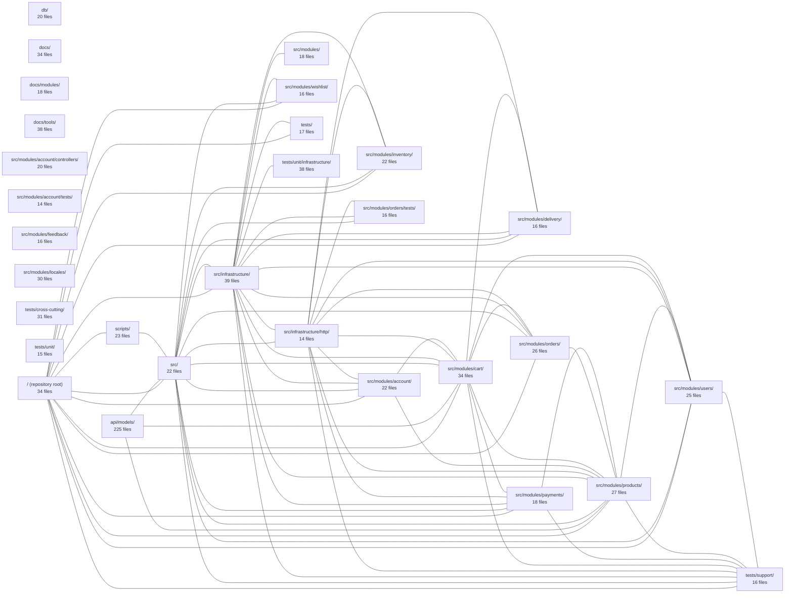

---
tags:
  - 2repo
  - 2repo/index
  - project/boilerplate-node-backend
type: index
modules: 30
updated: 2026-08-25T11:24:16.815563+00:00
---

# boilerplate-node-backend

`boilerplate-node-backend` is a Node.js backend organized around a modular e-commerce domain, with feature modules for accounts, cart, orders, payments, products, inventory, wishlist, delivery, feedback, users, and localization under `src/modules/`. Cross-cutting concerns such as HTTP transport live in `src/infrastructure/`, database models are defined in `api/models/`, and database configuration resides in `db/`. The project ships a layered test suite (unit, infrastructure, and cross-cutting) under `tests/`, utility scripts in `scripts/`, and API documentation split between `docs/modules/` and `docs/tools/`.

## Module map

_117 lower-traffic connection(s) hidden to keep the diagram readable._

## Modules
- [[boilerplate-node-backend_api_models|api/models/]] — 225 files, 14 connected modules
- [[boilerplate-node-backend_db|db/]] — 20 files, 4 connected modules
- [[boilerplate-node-backend_docs|docs/]] — 34 files, 3 connected modules
- [[boilerplate-node-backend_docs_modules|docs/modules/]] — 18 files, 2 connected modules
- [[boilerplate-node-backend_docs_tools|docs/tools/]] — 38 files, 3 connected modules
- [[boilerplate-node-backend_scripts|scripts/]] — 23 files, 12 connected modules
- [[boilerplate-node-backend_src|src/]] — 22 files, 23 connected modules
- [[boilerplate-node-backend_src_infrastructure|src/infrastructure/]] — 39 files, 24 connected modules
- [[boilerplate-node-backend_src_infrastructure_http|src/infrastructure/http/]] — 14 files, 21 connected modules
- [[boilerplate-node-backend_src_modules|src/modules/]] — 18 files, 9 connected modules
- [[boilerplate-node-backend_src_modules_account|src/modules/account/]] — 22 files, 15 connected modules
- [[boilerplate-node-backend_src_modules_account_controllers|src/modules/account/controllers/]] — 20 files, 8 connected modules
- [[boilerplate-node-backend_src_modules_account_tests|src/modules/account/tests/]] — 14 files, 8 connected modules
- [[boilerplate-node-backend_src_modules_cart|src/modules/cart/]] — 34 files, 20 connected modules
- [[boilerplate-node-backend_src_modules_delivery|src/modules/delivery/]] — 16 files, 14 connected modules
- [[boilerplate-node-backend_src_modules_feedback|src/modules/feedback/]] — 16 files, 8 connected modules
- [[boilerplate-node-backend_src_modules_inventory|src/modules/inventory/]] — 22 files, 13 connected modules
- [[boilerplate-node-backend_src_modules_locales|src/modules/locales/]] — 30 files, 6 connected modules
- [[boilerplate-node-backend_src_modules_orders|src/modules/orders/]] — 26 files, 15 connected modules
- [[boilerplate-node-backend_src_modules_orders_tests|src/modules/orders/tests/]] — 16 files, 12 connected modules
- [[boilerplate-node-backend_src_modules_payments|src/modules/payments/]] — 18 files, 15 connected modules
- [[boilerplate-node-backend_src_modules_products|src/modules/products/]] — 27 files, 19 connected modules
- [[boilerplate-node-backend_src_modules_users|src/modules/users/]] — 25 files, 16 connected modules
- [[boilerplate-node-backend_src_modules_wishlist|src/modules/wishlist/]] — 16 files, 11 connected modules
- [[boilerplate-node-backend_tests|tests/]] — 17 files, 11 connected modules
- [[boilerplate-node-backend_tests_cross-cutting|tests/cross-cutting/]] — 31 files, 8 connected modules
- [[boilerplate-node-backend_tests_support|tests/support/]] — 16 files, 19 connected modules
- [[boilerplate-node-backend_tests_unit|tests/unit/]] — 15 files, 8 connected modules
- [[boilerplate-node-backend_tests_unit_infrastructure|tests/unit/infrastructure/]] — 38 files, 11 connected modules
- [[boilerplate-node-backend_ROOT|/ (repository root)]] — 34 files, 22 connected modules
