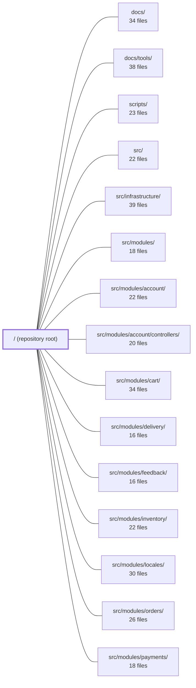

---
tags:
  - 2repo
  - 2repo/module
  - project/boilerplate-node-backend
type: module
module: / (repository root)
files: 34
updated: 2026-08-25T11:16:45.621256+00:00
---

# / (repository root)

## Purpose

The repository root is the orchestration layer for **boilerplate-node-api-mongodb-mongoose** (Express 5 + TypeScript + Mongoose REST API). It owns every top-level concern that doesn't belong to a single application module: project build and tool configuration, the bundled public API contracts (OpenAPI / AsyncAPI), the code-generation pipeline, deployment compose stacks, load-test scripts, and the documentation a contributor reads before touching `src/`.

## Key parts

- **Project manifest & build config** — `package.json` (all npm scripts and dependencies), `tsconfig.json`, `eslint.config.ts`, `jest.config.js` / `.cluster.js` / `.mutation.js`, `stryker.config.json`, `tsconfig.jest.json`, `orval.config.ts`, `migrate-mongo-config.js`.
- **Bundled API contracts (generated, not hand-edited)** — `openapi.yaml` (REST), `asyncapi.yaml` (SSE + RabbitMQ), `asyncapi.public.yaml` (SSE-only subset for external consumers), `api/schemas.zod.ts` (Zod validators from Orval).
- **Contract source files** — `shared/contracts/openapi.root.yaml`, `shared/contracts/asyncapi.root.yaml`, `shared/contracts/asyncapi.workers.yaml`, `shared/contracts/analytics.frontend.ts`. These are the hand-authored fragments that `npm run contracts:bundle` merges into the bundled specs.
- **Lint & contract-lint rules** — `eslint/rules/` (custom ESLint rules: chain-catch, no-hardcoded-user-text, barrel index), `spectral.yaml`, `spectral.modules.yaml`, `spectral.asyncapi.modules.yaml`.
- **Deployment stacks** — `docker-compose.yml` (full dev environment with observability sidecars), `docker-compose.production.yml` (lean prod stack, OTLP export).
- **Load tests** — `k6/browse.js` (read path), `k6/checkout.js` (write-path / stock-reservation contention).
- **Documentation & design decisions** — `README.md` (entry point / quick-start), `CHANGELOG.md` (API-contract version history), `CONTRACT_PLAN_POLYMORPHISM.md` (polymorphism backlog with verdicts), `CLAUDE.md`.
- **Public assets** — `public/favicon/`, `public/images/seed/` (committed demo fixture images).

## How it connects

- **`src/` and its modules** — The root configs (Jest, ESLint, TypeScript, Orval, Stryker) all target files under `src/`. Each module's `openapi.yaml` and `asyncapi.yaml` are the fragments that `contracts:bundle` merges into the root-level `openapi.yaml` / `asyncapi.yaml`. The `k6/` scripts exercise the HTTP endpoints those modules expose.
- **`shared/contracts/`** — Lives inside the root tree and feeds the bundled specs. The Spectral rulesets validate both the root-level and per-module contract files.
- **`scripts/`** — Implements the npm-script bodies referenced by `package.json` (bundle, lint, test, seed, etc.).
- **`docs/` and `docs/tools/`** — `README.md` explicitly defers detailed reference to this tree; `CONTRACT_PLAN_POLYMORPHISM.md` defers mechanism details to `docs/theory/`.
- **`tests/` (unit, cross-cutting, support)** — Executed by the Jest configs defined at the root; `tsconfig.jest.json` exists so those suites can import `src/app.ts` under CJS transpilation.

## Where to start

1. **`README.md`** — the "door" that orients you to the architecture, quick-start commands, and directory layout without drowning you in reference detail.
2. **`package.json`** — every `npm run …` command, the dependency tree, and the script names you'll type daily all live here; reading the scripts section is the fastest way to map the repo's tooling onto the files above.

## Connected modules

[[boilerplate-node-backend_docs|docs/]] · [[boilerplate-node-backend_docs_tools|docs/tools/]] · [[boilerplate-node-backend_scripts|scripts/]] · [[boilerplate-node-backend_src|src/]] · [[boilerplate-node-backend_src_infrastructure|src/infrastructure/]] · [[boilerplate-node-backend_src_modules|src/modules/]] · [[boilerplate-node-backend_src_modules_account|src/modules/account/]] · [[boilerplate-node-backend_src_modules_account_controllers|src/modules/account/controllers/]] · [[boilerplate-node-backend_src_modules_cart|src/modules/cart/]] · [[boilerplate-node-backend_src_modules_delivery|src/modules/delivery/]] · [[boilerplate-node-backend_src_modules_feedback|src/modules/feedback/]] · [[boilerplate-node-backend_src_modules_inventory|src/modules/inventory/]] · [[boilerplate-node-backend_src_modules_locales|src/modules/locales/]] · [[boilerplate-node-backend_src_modules_orders|src/modules/orders/]] · [[boilerplate-node-backend_src_modules_payments|src/modules/payments/]] · … and 7 more

## Files
- `CHANGELOG.md` — Records all notable changes to this API's contract (`openapi.yaml`), defining a "breaking change" as one a generated client cannot absorb without regeneration. Serves as the single source of truth for what changed between versions and why, so neither implementers nor the paired frontend team need to diff the contract to understand intent.
- `CLAUDE.md`
- `CONTRACT_PLAN_POLYMORPHISM.md` — Design-decision document that records *where* the API offers multiple spellings of one operation, *where it does not*, and *what it costs to close each gap*. It is a backlog with verdicts (not a reference for the input-mechanism machinery — see `docs/theory/request-input.md`). Absorbed `CONTRACT_PLAN_POST_AS_GET.md` on 2026-08-24.
- `README.md` — Project-level entry point for **boilerplate-node-api-mongodb-mongoose** (Express 5 + TypeScript + Mongoose REST API). It orients a new contributor to the architecture, the quick-start commands, the directory layout, and the documentation map. It explicitly defers detailed reference to the `docs/` tree and to the generated contract, positioning itself as "the door" rather than the reference.
- `api/schemas.zod.ts` — Auto-generated Zod validation schemas derived from the project's OpenAPI specification (v2.0.0) via Orval. Each exported schema mirrors a single API endpoint's request or response shape, providing runtime type-checking and self-documenting descriptions for consumers of the contract. The file is overwritten on every codegen run and must not be edited by hand.
- `asyncapi.public.yaml` — Generated AsyncAPI 2.6.0 contract that describes the project's real-time (SSE) event channels. It is the bundled, public-facing spec produced by `npm run contracts:bundle` from two source files (`shared/contracts/asyncapi.root.yaml` and `src/modules/observability/asyncapi.yaml`). Consumers (dashboards, client SDKs, external tooling) read this single file to learn every channel, message shape, and server endpoint the backend exposes over SSE.
- `asyncapi.yaml` — Auto-generated AsyncAPI 2.6.0 contract that is the single source of truth for all real-time (SSE) and async (RabbitMQ) message flows in this boilerplate. It is produced by `npm run contracts:bundle` from three upstream YAML files and must never be edited by hand.
- `docker-compose.production.yml` — The production deployment stack for the API. It builds the application from `.docker/Dockerfile.production`, runs it alongside its four hard dependencies (MongoDB, Redis, RabbitMQ), and exposes the HTTP interface only on the loopback interface. It deliberately excludes the observability estate (Prometheus, Loki, Tempo, Grafana, Alloy, Umami) that the development stack provides, expecting telemetry to be exported over OTLP to an externally-managed collector.
- `docker-compose.yml` — Defines the full local development stack (Node API, MongoDB, Redis, RabbitMQ, OpenTelemetry, and observability sidecars) as a single Compose project. It exists so that `npm run compose:up` yields a wired, populated, browsable environment without manual container orchestration.
- `eslint.config.ts` — Flat ESLint configuration for a TypeScript/Express server project. It wires together `typescript-eslint` (strict type-checked tier), `eslint-plugin-unicorn`, `eslint-plugin-boundaries`, project-local rules, and a large set of per-rule overrides—each annotated with the reasoning behind the choice—so that `npm run lint` enforces the codebase's style and correctness contract in a single, self-documenting file.
- `eslint/rules/controller-chain-must-catch.ts` — A custom ESLint rule that enforces promise chains started in exported controller handlers must terminate in a `.catch()`. It exists because the global error handler in `app.ts` cannot substitute for per-chain handling: it cannot perform cleanup (e.g., deleting an orphaned upload) or record domain-specific metrics after a failure.
- `eslint/rules/index.ts` — Barrel file that aggregates all project-local ESLint rules into a single default export (a name→rule map). It exists so `eslint.config.ts` can register every custom rule in one place without importing each rule file individually.
- `eslint/rules/no-hardcoded-user-text.ts` — Custom ESLint rule that prevents hardcoded user-facing strings in the `errors` argument of `rejectResponse` and `generateReject` calls. It enforces that all copy a user actually reads must originate from an i18n dictionary (`t(…)`) rather than a literal at the call site.
- `jest.config.cluster.js` — Dedicated Jest configuration for the cluster integration suite (`npm run test:cluster`). It exists because every default in the main config is counterproductive here: the tests spawn real child-process workers on real ports, boot their own mongod over TCP, and run longer than the standard timeout. Keeping it in a separate file means `npm test` and `test:all` stay single-process and fast while the cluster suite runs in its own, isolated invocation.
- `jest.config.js` — Jest configuration for the unit test suite. It defines test discovery, worker-count resolution, coverage collection, and per-file coverage thresholds. It is a `.js` file (not `.json`) specifically so the `coverageThreshold` block can carry explanatory comments; Jest would warn on any unrecognised key a JSON `_comment` approach would require.
- `jest.config.mutation.js` — Jest configuration consumed exclusively by Stryker (`npm run test:mutation`). It swaps the `ts-jest` transform from the base config for `@swc/jest` so that each mutant is transpiled statelessly, avoiding the unbounded memory growth caused by ts-jest's `LanguageService` cache when Jest is invoked repeatedly inside a single Stryker process.
- `k6/browse.js` — k6 load-test script that simulates an anonymous visitor walking the product storefront (catalogue list → detail page → category facets). Unlike the flat-concurrency `npm run bench` (autocannon), this script ramps VUs, hits multiple endpoints in sequence, and asserts quality thresholds so a CI script or a human can treat the run as a pass/fail verdict rather than just a number.
- `k6/checkout.js` — k6 load-test script for the **write path** (login → fill cart → checkout). It exists to stress the stock-reservation logic (`reserveForOrder`) under concurrent contention, complementing the read-only test in `k6/browse.js`. Deliberately drives all virtual users through a single account so that cart-reservation races are actually exercised.
- `migrate-mongo-config.js` — Configuration entry point for the `migrate-mongo` CLI. It resolves the target MongoDB URI from environment variables and tells migrate-mongo where to find migration scripts, what changelog collection to use, and how to interpret migration files.
- `openapi.yaml` — Generated OpenAPI 3.0.3 contract for the Ecommerce Demo API. It is the single, bundled specification consumed by code generators (client stubs, DTOs, SDKs) and by API linters. It is **not** hand-edited; it is produced by `npm run contracts:bundle` from `shared/contracts/openapi.root.yaml` and per-module files under `src/modules/*/openapi.yaml`.
- `orval.config.ts` — Orval build configuration that drives code generation from `openapi.yaml`. It produces two artifacts: TypeScript model types (under `./api/models`) and Zod schema/validator files (at `./api/schemas.zod.ts`). It exists so that typed API contracts are generated rather than hand-maintained.
- `package.json` — Project manifest for **boilerplate-node-api-mongodb-mongoose** (v2.0.0, AGPL-3.0). It declares the Express + MongoDB/Mongoose + Redis application's runtime and dev dependencies, and provides the full suite of npm scripts for development, linting, testing, code generation, database management, benchmarking, and documentation. It is the single entry point for every `npm run …` command in the repo.
- `public/favicon/safari-pinned-tab.svg` — A 558×558 pt vector icon that Safari uses for its "pinned tab" (Favorites) display when the site is pinned to the toolbar. It renders the site's logo as a single black silhouette so it reads clearly at small toolbar sizes.
- `public/images/seed/README.md` — Documents the conventions for the `seed/` subdirectory of `public/images/`: it holds committed fixture images used by the demo data seeder, as opposed to the sibling `public/images/` tree which holds runtime user uploads. The README exists so future contributors understand *why* this subdirectory is separated and how the `.gitignore` boundary works.
- `shared/contracts/analytics.frontend.ts` — Declares the set of analytics event names that **only the client (browser) can emit**, forming the client half of a single shared Umami event namespace. It exists to give that namespace an owner in the server repo: a test cross-checks these names against every server-declared event to prevent collisions, and `npm run contracts:bundle` publishes this file as the sole catalogue the frontend imports.
- `shared/contracts/asyncapi.root.yaml` — The service-level preamble for the project's AsyncAPI contract. It declares facts about the backend as a whole—version, identifier, metadata, and tags—exactly once, so that per-module channel files and `asyncapi.workers.yaml` don't need to restate them. It is the AsyncAPI twin of `openapi.root.yaml`.
- `shared/contracts/asyncapi.workers.yaml` — AsyncAPI 2.6.0 document that declares the two application-level job queues (`worker.email.send`, `worker.pdf.generate`) and their message schemas. These queues are "verbs, not domains" — any module can enqueue a job, and the consumers are fixed infrastructure adapters — so the contract lives at the root level rather than inside a domain. It exists as a standalone AsyncAPI document (i.e. it carries its own `info` block) so the shared lint script can validate it identically to a module's contract.
- `shared/contracts/openapi.root.yaml` — Shared OpenAPI 3.0.3 base contract for the Ecommerce API. It defines the cross-module building blocks—security scheme, common parameters, standard error/success responses, and reusable schemas—that every per-module `openapi.yaml` composes. Designed as a stable, codegen-oriented document (orval/zod, client/server stubs, SDKs) rather than a living, path-annotated spec.
- `spectral.asyncapi.modules.yaml` — A Spectral ruleset for linting individual AsyncAPI module sections (`src/modules/<name>/asyncapi.yaml`, `shared/contracts/asyncapi.workers.yaml`) in isolation via `npm run lint:asyncapi:modules`. It disables rules that demand service-wide facts (tags, contact, license) so a section can pass as a standalone document without restating what `shared/contracts/asyncapi.root.yaml` already declares. It is the AsyncAPI twin of `spectral.modules.yaml`.
- `spectral.modules.yaml` — Spectral ruleset for linting a single module's OpenAPI file (`src/modules/<name>/openapi.yaml`) in isolation. It inherits the full rule set from `spectral.yaml` but disables the handful of rules that require the document to *be* the whole API (tag list, security schemes, servers, `info` prose), because those are declared once in the root contract and are intentionally absent from per-module files.
- `spectral.yaml` — Spectral ruleset configuration that enforces project-specific conventions on the OpenAPI specification. It extends the built-in `spectral:oas` ruleset and layers on naming, style, and codegen-friendliness rules so that `openapi.yaml` stays consistent and produces clean generated clients.
- `stryker.config.json` — Stryker mutation-testing configuration. Defines which source files are mutated, which Jest suites execute them, incremental caching, memory-safe concurrency, and the `break` threshold that acts as a global collapse detector. The real per-file gate lives in `mutation-baseline.json`; this file only governs *how* a run executes.
- `tsconfig.jest.json` — Jest-specific TypeScript compiler configuration that overrides the project's base `tsconfig.json` with module-resolution and syntax settings compatible with ts-jest's per-file CJS transpilation. Without these overrides, `src/app.ts` cannot be imported by any test at all.
- `tsconfig.json` — Base TypeScript compiler configuration for the project. Defines module resolution, path aliases, strictness rules, and the set of files TypeScript should consider. It is the root config that other configs (e.g. for tests) extend or reference.

---
[[boilerplate-node-backend_INDEX|← boilerplate-node-backend index]]
