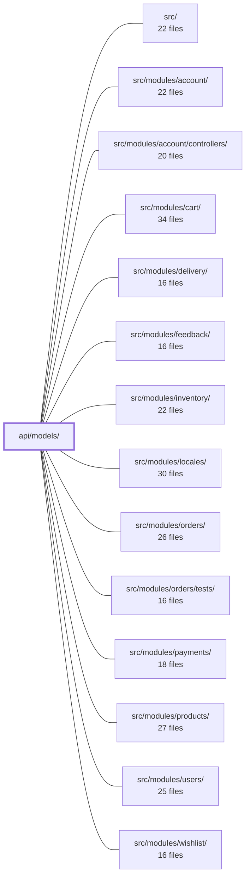

---
tags:
  - 2repo
  - 2repo/module
  - project/boilerplate-node-backend
type: module
module: api/models/
files: 225
updated: 2026-08-25T11:17:01.322159+00:00
---

# api/models/

## Purpose

`api/models/` is the auto-generated TypeScript type layer for the Ecommerce Demo API. Every file here is a DTO (request body, response payload, envelope wrapper, or enum) produced by **Orval v8.22.0** from the project's OpenAPI spec (v2.0.0). The module exists so that client code, server controllers, and SDKs all share a single, typed contract for every endpoint's shape without hand-maintained duplication. Files in this directory must never be edited by hand; changes belong in the OpenAPI definition.

## Key parts

- **Request DTOs** (`*Request.ts`) — Typed body shapes for mutation endpoints: `createOrderRequest`, `checkoutRequest`, `createProductRequest` (plus its `Multipart` variant), `addWishlistItemRequest`, `changePasswordRequest`, `createUserRequest`, `adjustmentRequest`, `cancelOrderRequest`, `createFeedbackRequest`, `createLocaleEntryRequest`, `createPaymentIntentRequest`, and many more. Each isolates the exact fields a client must send for one operation.
- **Response payloads** (`*Response.ts`, `*Item.ts`, etc.) — The domain data a successful call returns: `cartResponse`, `cartSummaryResponse`, `addressesResponse`, `catalogueFacetsResponse`, `checkoutResponse`, `courierAdvanceResponse`, `auditEventItem`, `auditLogsPage`, `authTokens`.
- **Envelope wrappers** (`*Envelope.ts`, `conflictResponse.ts`) — The standard `{ success, status, message, data }` outer shape that wraps every payload, e.g. `cartResponseEnvelope`, `checkoutResponseEnvelope`, `addressesEnvelope`, `authTokensEnvelope`, `auditLogsResponseEnvelope`. `conflictResponse` is the 409 variant.
- **Enum / constant unions** — Small closed-value types like `auditEventItemActorRole`, `auditEventItemLevel`, `auditEventItemOutcome` that replace raw string literals with a type-safe set.
- **Auxiliary shapes** — `cartItem`, `address`, `addressInput`, `auditEventItemMetadata`, and the 185+ remaining files covering every other resource in the spec.

## How it connects

- **Domain modules** (`src/modules/account/`, `cart/`, `delivery/`, `feedback/`, `inventory/`, `locales/`, `orders/`, `payments/`, `products/`, `users/`, `wishlist/`) import the request, response, and envelope types from this directory to type their controllers, service functions, and test fixtures. No module re-declares a payload shape locally; it references the generated type.
- **`src/`** (application root) wires the modules together and, in tests (`src/modules/orders/tests/`), asserts against the same generated shapes, making the model layer the single source of truth for expected API contracts.
- Because every file is derived from the same OpenAPI document, the module is effectively a read-only contract: regenerating it (via Orval) is the only sanctioned way to change any type here, and downstream modules pick up the new shapes on the next build.

## Where to start

1. **`api/models/cartItem.ts`** → **`api/models/cartResponse.ts`** → **`api/models/cartResponseEnvelope.ts`** — Reading these three files in order shows the full pattern in miniature: a leaf domain object, the composed payload, and the standard envelope that wraps it. Once that triad is clear, every other `*Request` / `*Response` / `*Envelope` triple in the directory follows the same shape.
2. **`api/models/auditEventItem.ts`** (and its sibling enums) — A good second read because it demonstrates how the generator handles nested objects, closed enums, and an unconstrained metadata bag, which covers the edge cases you'll hit less often in simpler DTOs.

## Connected modules

[[boilerplate-node-backend_src|src/]] · [[boilerplate-node-backend_src_modules_account|src/modules/account/]] · [[boilerplate-node-backend_src_modules_account_controllers|src/modules/account/controllers/]] · [[boilerplate-node-backend_src_modules_cart|src/modules/cart/]] · [[boilerplate-node-backend_src_modules_delivery|src/modules/delivery/]] · [[boilerplate-node-backend_src_modules_feedback|src/modules/feedback/]] · [[boilerplate-node-backend_src_modules_inventory|src/modules/inventory/]] · [[boilerplate-node-backend_src_modules_locales|src/modules/locales/]] · [[boilerplate-node-backend_src_modules_orders|src/modules/orders/]] · [[boilerplate-node-backend_src_modules_orders_tests|src/modules/orders/tests/]] · [[boilerplate-node-backend_src_modules_payments|src/modules/payments/]] · [[boilerplate-node-backend_src_modules_products|src/modules/products/]] · [[boilerplate-node-backend_src_modules_users|src/modules/users/]] · [[boilerplate-node-backend_src_modules_wishlist|src/modules/wishlist/]]

## Files
- `api/models/accountDeleteConfirmRequest.ts` — Auto-generated request DTO that defines the payload shape for confirming account deletion. It exists as a typed contract shared between API client stubs and server-side controllers, produced by orval from the Ecommerce Demo API's OpenAPI spec (v2.0.0).
- `api/models/addWishlistItemRequest.ts` — Auto-generated (orval v8.22.0) request DTO for the "add item to wishlist" endpoint. It defines the minimal shape of the JSON body a client must send when creating a wishlist entry, keeping the contract decoupled from any particular controller implementation.
- `api/models/address.ts` — Auto-generated (orval v8.22.0) TypeScript type definition for a single shipping/billing address returned by the Ecommerce Demo API. It exists as a shared, immutable contract type so that client code and server stubs agree on the exact shape of an address object without hand-maintained duplication.
- `api/models/addressInput.ts` — Auto-generated TypeScript interface that defines the shape of an address creation/update payload for the Ecommerce Demo API. It is produced by Orval from the OpenAPI spec and should never be hand-edited.
- `api/models/addressesEnvelope.ts` — Auto-generated (orval v8.22.0) TypeScript interface that models the success response envelope for the addresses endpoint. It wraps the payload (`AddressesResponse`) in a standard envelope of success flag, status, and i18n-aware message, providing a single importable type for clients handling that endpoint's response shape.
- `api/models/addressesResponse.ts` — Auto-generated TypeScript interface that models the response body of an addresses-list endpoint in the Ecommerce Demo API. It exists so client and server code can reference a typed shape for that endpoint's payload without hand-maintaining it.
- `api/models/adjustmentRequest.ts` — Auto-generated DTO (by orval v8.22.0) representing an adjustment request in the Ecommerce Demo API. It defines the shape of a payload used to record a signed quantity correction for a product, optionally accompanied by a human-readable explanation.
- `api/models/auditEventItem.ts` — A generated TypeScript interface representing a single audit-log entry. It is the per-item shape inside paginated audit-log responses and exists to give consumers a typed DTO for who did what, when, and with what outcome. Generated by **orval v8.22.0** from the Ecommerce Demo API OpenAPI spec (v2.0.0).
- `api/models/auditEventItemActorRole.ts` — Auto-generated (orval v8.22.0) TypeScript enum definition for the `actorRole` field on audit-event items. It exists as a stable, codegen-oriented constant so client and server code share a single source of truth for the allowed actor-role values without hand-maintaining string literals.
- `api/models/auditEventItemLevel.ts` — Auto-generated (orval v8.22.0) enum type defining the set of severity levels available for an audit event item. It exists so that both the client and server share a single, type-safe representation of the `level` discriminator without hard-coding string literals.
- `api/models/auditEventItemMetadata.ts` — A generated type alias that models an unconstrained metadata bag on an audit event item. It exists so the OpenAPI contract can represent arbitrary key/value metadata without prescribing a fixed schema, and so client/server code gets a named, importable type rather than an inline `{ [k: string]: unknown }`.
- `api/models/auditEventItemOutcome.ts` — A codegen-produced constant enum (orval v8.22.0) that defines the finite set of outcome values (`success`, `failure`) for an audit-event item in the Ecommerce Demo API. It exists so TypeScript consumers get a closed, type-safe union instead of arbitrary strings.
- `api/models/auditLogsPage.ts` — A generated TypeScript interface representing a single page of audit-log results returned by the Ecommerce Demo API. It pairs the actual event records with pagination metadata so clients can render or iterate over one slice of a larger log set.
- `api/models/auditLogsResponseEnvelope.ts` — Auto-generated type definition for the standard response envelope returned by the audit-logs list endpoint. It wraps the paginated audit-log data (`AuditLogsPage`) in the API's common success/status/message envelope so consumers get a uniform response shape. Generated by **orval v8.22.0** from the Ecommerce Demo OpenAPI spec v2.0.0 — do not edit manually.
- `api/models/authTokens.ts` — Auto-generated (orval v8.22.0) TypeScript interface that models the authentication token payload returned by the Ecommerce Demo API. It exists so client and server code share a single, typed contract for token responses without hand-maintaining the shape.
- `api/models/authTokensEnvelope.ts` — Auto-generated TypeScript interface that defines the standard API response envelope wrapping an `AuthTokens` payload. It exists as the contract type for auth-token endpoint responses, ensuring clients and servers share a single shape (success, status, message, data) without duplicating the envelope structure per resource.
- `api/models/cancelOrderRequest.ts` — Auto-generated request-body model (via orval v8.22.0) defining the optional JSON payload for the `POST /orders/{orderId}/cancel` endpoint. It exists so clients and the server controller share a single typed contract for the cancellation parameters.
- `api/models/cartItem.ts` — Auto-generated (orval v8.22.0) TypeScript interface representing a single line item in a shopping cart. It exists as a shared, codegen-oriented DTO so that every consumer (cart views, order creation, order updates) speaks the same shape for a product reference plus quantity.
- `api/models/cartResponse.ts` — Auto-generated DTO interface (via orval v8.22.0) representing the cart payload returned by the Ecommerce Demo API. It composes a list of `CartItem` entries with a `CartSummaryResponse`, giving consumers a single typed shape for any endpoint that returns a full cart.
- `api/models/cartResponseEnvelope.ts` — Auto-generated type that defines the standard response envelope shape wrapping a `CartResponse` payload. It exists so API consumers get a uniform `{ success, status, message, data }` structure around every cart endpoint's payload, keeping the inner `CartResponse` type reusable in isolation.
- `api/models/cartSummaryResponse.ts` — Auto-generated DTO interface (by orval v8.22.0) representing the compact cart summary shape returned by the Ecommerce Demo API. It captures headline cart figures—item count, total quantity, pre-tax/shipping total, and currency—without the per-line detail, suitable for lightweight UI displays (e.g. a cart badge or checkout header).
- `api/models/cartSummaryResponseEnvelope.ts` — Auto-generated type definition (via orval v8.22.0) that defines the full HTTP response envelope for a cart summary endpoint. It wraps the domain payload (`CartSummaryResponse`) inside a standard envelope containing transport-level metadata (`success`, `status`, `message`), separating business data from delivery status for consumers of the Ecommerce Demo API.
- `api/models/catalogueFacetsEnvelope.ts` — Auto-generated (orval v8.22.0) TypeScript interface that wraps the `CatalogueFacetsResponse` payload in a standard API envelope, adding `success`, `status`, and `message` fields alongside the domain data. It exists to give clients a single, typed shape for the catalogue-facets endpoint response.
- `api/models/catalogueFacetsResponse.ts` — Auto-generated TypeScript interface describing the shape of a catalogue-facets API response (categories and tags with counts). It exists as a typed DTO in the orval-generated client layer so consuming code can reference a stable, importable shape without hand-maintaining the definition.
- `api/models/changePasswordRequest.ts` — Defines the request-body shape for the change-password endpoint. It is a generated TypeScript interface (orval v8.22.0) that groups the three `Password` fields a client must send when updating an account's password.
- `api/models/checkoutRequest.ts` — Auto-generated TypeScript interface defining the request body for a checkout operation in the Ecommerce Demo API. It is produced by orval from an OpenAPI 2.0.0 spec and must not be edited by hand.
- `api/models/checkoutResponse.ts` — Auto-generated type definition (orval v8.22.0) for the checkout success response body of the Ecommerce Demo API. It declares the shape a client can expect after a checkout completes: the confirmed `Order` and an optional human-readable `message`.
- `api/models/checkoutResponseEnvelope.ts` — A generated TypeScript interface that defines the standard response envelope for checkout endpoints. It wraps the actual `CheckoutResponse` payload with uniform metadata fields (`success`, `status`, `message`) so all API responses share a consistent outer shape, per the Ecommerce Demo API's OpenAPI contract.
- `api/models/confirmPaymentRequest.ts` — Auto-generated TypeScript interface defining the request body for the confirm-payment endpoint in the Ecommerce Demo API. It exists as a typed contract shared across client and server projects, produced from the OpenAPI spec by orval so that hand-editing is not expected.
- `api/models/conflictResponse.ts` — Auto-generated type definition (via orval v8.22.0) that models the HTTP 409 Conflict response body for the Ecommerce Demo API. It exists so consumers of the generated client SDK have a named type to expect when a request conflicts with the current state of a resource.
- `api/models/courierAdvanceResponse.ts` — Auto-generated TypeScript interface (by orval v8.22.0) that defines the shape of the API response body returned when the courier-advance operation succeeds. It exists as a typed DTO so client and server code can reference the payload without re-declaring the contract.
- `api/models/courierAdvanceResponseEnvelope.ts` — Auto-generated response-envelope type that wraps a `CourierAdvanceResponse` payload inside the API's standard success envelope (`success`, `status`, `message`, `data`). It exists so that client code can consume the courier-advance endpoint's response with a uniform shape regardless of which domain payload is inside.
- `api/models/createFeedbackRequest.ts` — Auto-generated TypeScript interface defining the request payload for the feedback submission endpoint. It exists as a shared, typed contract (produced by orval from the OpenAPI spec) so both client and server code agree on the shape of a feedback request without duplication.
- `api/models/createLocaleEntryRequest.ts` — Auto-generated TypeScript interface (via Orval v8.22.0) that defines the request body shape for creating a locale entry. It exists as a shared DTO between client and server code, derived from the Ecommerce Demo API OpenAPI spec (v2.0.0). Do not edit manually—changes belong in the OpenAPI contract.
- `api/models/createLocaleRequest.ts` — Auto-generated (orval v8.22.0) TypeScript interface that defines the request body for creating a new locale entry. It exists as a typed DTO shared between the OpenAPI contract and consuming client/server code so both sides agree on the shape of a locale-creation payload.
- `api/models/createOrderRequest.ts` — A generated TypeScript interface defining the request body for creating a new order. It is auto-produced by **orval v8.22.0** from the project's OpenAPI spec (v2.0.0) and is part of a stable, codegen-oriented contract intended for multi-project, multi-language reuse (client/server stubs, DTOs, SDKs). Do not edit manually.
- `api/models/createPaymentIntentRequest.ts` — Auto-generated DTO type for the request body of the "create payment intent" endpoint in the Ecommerce Demo API. It exists as a stable, codegen-oriented contract (OpenAPI spec v2.0.0) so that multi-project clients and server stubs share a single TypeScript shape without hand-maintenance.
- `api/models/createProductRequest.ts` — Auto-generated TypeScript interface defining the request body for creating a product. It is produced by orval from the Ecommerce Demo API's OpenAPI 2.0.0 spec and exists as a shared DTO so both client code and server code agree on the shape of a "create product" payload.
- `api/models/createProductRequestMultipart.ts` — Auto-generated TypeScript interface (by orval v8.22.0) that describes the multipart request body for the product-creation endpoint. It exists as a typed DTO so both server handlers and client SDKs share a single, spec-derived contract for the fields a client must send when creating a product via `multipart/form-data`.
- `api/models/createUserRequest.ts` — Auto-generated DTO (Data Transfer Object) interface that defines the request body shape for user-creation endpoints in the Ecommerce Demo API. It exists to give both client and server code a single, typed contract for the fields accepted when creating a user, without any runtime logic.
- `api/models/createUserRequestMultipart.ts` — Auto-generated TypeScript interface (orval v8.22.0) defining the multipart request payload for creating a user via the Ecommerce Demo API. It exists as a typed DTO so clients and server-side code share a single contract for the `POST` user-creation endpoint that accepts form-data / multipart bodies (noted by the `imageUpload?: Blob` field).
- `api/models/deleteOrderByIdParams.ts` — Auto-generated TypeScript type definition (by orval v8.22.0) that describes the query/path parameters accepted when deleting an order by ID via the Ecommerce Demo API. It exists as the parameter contract for the `DELETE /orders/:id` operation so that client code is type-safe against the OpenAPI spec.
- `api/models/deleteOrderParams.ts` — Auto-generated (orval v8.22.0) parameter type that describes the query/body parameters for order-deletion endpoints in the Ecommerce Demo API. It exists so that generated client code can type-check the optional `hardDelete` flag without a hand-written interface.
- `api/models/deleteOrderRequest.ts` — Auto-generated TypeScript DTO defining the request payload for the delete-order endpoint. It exists as a shared, codegen-oriented contract (orval v8.22.0, OpenAPI spec v2.0.0) so that both client and server code can reference the same shape for identifying which order to delete and whether it is a hard delete.
- `api/models/deleteProductByIdParams.ts` — Auto-generated (orval v8.22.0) query-parameter type for the delete-product-by-ID endpoint. It defines the shape of optional request parameters that can be passed when calling that operation, specifically the `hardDelete` flag. Do not edit manually.
- `api/models/deleteProductParams.ts` — Auto-generated (orval v8.22.0) parameter type for the "delete product" endpoint in the Ecommerce Demo API. It defines the optional query/path parameters a caller may pass when deleting a product, specifically whether to bypass soft-delete and permanently remove the record.
- `api/models/deleteProductRequest.ts` — Generated request-model type for the "delete product" endpoint of the Ecommerce Demo API. It defines the shape of the payload a client must send when deleting a product, and exists as part of the orval-generated OpenAPI client stubs (spec v2.0.0).
- `api/models/deleteUserByIdParams.ts` — Auto-generated TypeScript type definition for the query parameters of the "delete user by ID" endpoint. It exists as a typed contract so client and server code can pass structured parameters without hand-rolling strings. Generated by orval from the Ecommerce Demo API OpenAPI spec (v2.0.0); **do not edit manually**.
- `api/models/deleteUserParams.ts` — A generated (orval v8.22.0) TypeScript type defining the query-parameter shape for the "delete user" endpoint. It exists so that clients and server stubs can type the optional `hardDelete` flag without reading the OpenAPI spec directly.
- `api/models/deleteUserRequest.ts` — Auto-generated (by orval v8.22.0) DTO interface representing the request body for the delete-user endpoint in the Ecommerce Demo API. It exists as a typed contract shared between client and server code so callers and handlers agree on the exact shape of a delete request.
- `api/models/dependencyStatus.ts` — Generated (orval v8.22.0) union type and constant enum for the four states a backing dependency can report in this API's payloads. It exists so every consumer shares one vocabulary (`ready`, `connecting`, `unavailable`, `disabled`) without re-declaring the strings.
- `api/models/email.ts` — Auto-generated type alias that defines `Email` as a `string`. It exists so request/response models in the API can reference a semantically named type for email fields instead of raw `string`, improving readability in generated client stubs and SDKs.
- `api/models/entryTenantQueryParamParameter.ts` — A generated type alias (orval v8.22.0) that re-exposes `LocaleTenant` under the name `EntryTenantQueryParamParameter`, giving a context-specific label to the `LocaleTenant` schema when it is used as a query parameter for tenant-scoped entry lookups. It exists because the OpenAPI contract references the same schema under different parameter names, and the codegen emits a distinct alias per usage site.
- `api/models/envelopeMessage.ts` — Auto-generated type definition for the `message` field shared across API response envelopes. It exists so that every envelope model (addresses, auth tokens, cart, checkout, etc.) can reference a single, consistent type for the human-readable `message` string rather than inlining `string` independently.
- `api/models/envelopeStatus.ts` — Auto-generated type definition (via orval v8.22.0) that defines the `EnvelopeStatus` type used in API response envelopes for the Ecommerce Demo API. It exists as a shared, single-source type alias so every envelope model can reference the status field consistently without duplicating the type.
- `api/models/envelopeSuccess.ts` — Auto-generated (orval v8.22.0) type that defines the `success` field used across all API response envelopes. It exists as a shared literal type so every endpoint response carries a consistent, type-safe indicator of success.
- `api/models/errorItem.ts` — Auto-generated (orval v8.22.0) TypeScript interface describing a single entry in an API error list. It provides the shape of each item in the `errors` array returned by the Ecommerce Demo API, pairing a stable machine-readable code with a human-readable message and optional structured details.
- `api/models/errorItemDetails.ts` — Generated type definition that models the optional, open-ended structured metadata field on an error item. It exists so clients can attach arbitrary programmatic context (e.g. a retry hint, correlation ID) to an error without the server needing to enumerate every possible key. The type is produced by Orval from the Ecommerce Demo API OpenAPI spec (v2.0.0) and must not be edited by hand.
- `api/models/errorResponse.ts` — Auto-generated TypeScript interface representing the standard error response envelope returned by the Ecommerce Demo API (spec v2.0.0). It defines the shared shape for all failure responses so clients can destructure a uniform `success / status / message / errors` contract regardless of the specific HTTP error.
- `api/models/facetCount.ts` — Generated DTO interface (via orval from the Ecommerce Demo API OpenAPI spec) that represents a single facet with its associated count. It exists to give client and server code a typed shape for facet-count data exchanged in catalogue endpoints.
- `api/models/feedbackRequest.ts` — Auto-generated TypeScript interface (`FeedbackRequest`) representing a single feedback-request entity in the Ecommerce Demo API. It serves as the canonical DTO shape shared by all API consumers.
- `api/models/feedbackRequestEnvelope.ts` — Auto-generated (orval v8.22.0) TypeScript interface that wraps a `FeedbackRequest` payload inside the API's standard response envelope. It exists so clients have a typed shape for the success response returned by the feedback endpoint.
- `api/models/feedbackRequestStatus.ts` — Auto-generated (orval v8.22.0) enum representing the lifecycle states of a feedback request in the Ecommerce Demo API. It exists to give both the API client and server a single, type-safe source of truth for the four allowed status values.
- `api/models/feedbackRequestsResponse.ts` — Auto-generated (orval v8.22.0) type definition for the paginated list response of the Feedback Requests endpoint in the Ecommerce Demo API. It defines the shape clients and servers use when consuming `GET` (or equivalent) endpoints that return a page of `FeedbackRequest` items alongside pagination metadata.
- `api/models/feedbackRequestsResponseEnvelope.ts` — Auto-generated (orval v8.22.0) TypeScript interface that models the standard response envelope for the feedback-requests endpoint. It wraps the payload in the API-wide success/status/message triple so every endpoint response shares a uniform outer shape.
- `api/models/forbiddenResponse.ts` — Auto-generated type alias that models the 403 Forbidden response shape for the Ecommerce Demo API. It exists so that generated client/server code can reference a semantically named type (`ForbiddenResponse`) for the 403 path while reusing the single `ErrorResponse` structure defined elsewhere.
- `api/models/getLocaleMessagesParams.ts` — Auto-generated (orval v8.22.0) request-parameters type for the "get locale messages" endpoint. It defines the single optional query parameter (`tenant`) that callers can pass to scope locale-message lookups to a specific tenant (keyspace). It exists so that generated client SDKs have a typed contract for the endpoint's query string.
- `api/models/getObservabilityAuditLogsOutcome.ts` — Auto-generated (orval v8.22.0) discriminator type for the `GET /observability/audit-logs` endpoint. It defines the two possible outcome labels (`success` | `failure`) that a response envelope uses to indicate whether the operation succeeded or failed. The file is regenerated from the OpenAPI spec and must not be edited by hand.
- `api/models/getObservabilityAuditLogsParams.ts` — Auto-generated (orval v8.22.0) TypeScript type defining the query-parameter shape for the observability audit-logs `GET` endpoint. It exists so clients and generated SDK stubs share a single, strongly-typed contract for filtering and paginating audit-log results.
- `api/models/hardDeleteParamParameter.ts` — A generated type definition that represents the `hardDelete` query/body parameter shared across several DELETE endpoints. It tells the server to permanently remove a record instead of soft-deleting it. The file exists as an orval-generated artifact from the Ecommerce Demo API's OpenAPI spec (v2.0.0) so that each endpoint model can reference the flag by a named type rather than repeating an inline `boolean`.
- `api/models/hardDeleteRequest.ts` — Auto-generated (by Orval v8.22.0) TypeScript model defining the `HardDeleteRequest` DTO used by the Ecommerce Demo API. It exists as a codegen output from the project's OpenAPI spec (v2.0.0) and must not be edited by hand.
- `api/models/healthPing.ts` — Auto-generated DTO (orval v8.22.0) representing the response body of a health-check/liveness endpoint. It exists as the typed shape of the JSON payload the API returns to confirm the process is alive and answering.
- `api/models/healthPingEnvelope.ts` — Auto-generated TypeScript interface (by orval v8.22.0) that defines the standard response envelope shape for the `/health/ping` endpoint. It wraps the domain payload (`HealthPing`) in the project-wide success/status/message contract so every API response follows a uniform structure.
- `api/models/healthPingStatus.ts` — Auto-generated (orval v8.22.0) model file that defines the `HealthPingStatus` enum — a liveness indicator with a single permitted value (`ok`). It exists as a typed constant so that API consumers can reference the health-check status without hard-coding string literals.
- `api/models/id.ts` — Auto-generated type alias that defines the canonical `Id` type (`string`) used across the Ecommerce Demo API client models. It exists so every model references a single, named identifier type rather than a bare `string`, keeping generated code consistent and making future type changes (e.g., switching to a branded UUID type) a one-line edit.
- `api/models/idParamParameter.ts` — A generated type alias that gives a descriptive name (`IdParamParameter`) to the shared `Id` type when it is used as a path parameter in API operations. It exists so that orval can reference a parameter-specific type name in generated client stubs without importing `Id` directly at every call site.
- `api/models/imageUrl.ts` — A generated type alias (`ImageUrl = string`) representing an image reference in the Ecommerce Demo API. It exists as a shared, named type so that request/response models can annotate image fields consistently.
- `api/models/index.ts` — Barrel (re-export) file generated by Orval v8.22.0 that aggregates every model type from the `api/models/` directory into a single import point. It exists so consumers can `import { User, Order, ... } from 'api/models'` instead of importing each file individually. The file is auto-generated from the Ecommerce Demo API OpenAPI spec (v2.0.0) and must not be edited by hand.
- `api/models/internalErrorResponse.ts` — Auto-generated type stub (orval v8.22.0) that provides a named alias for the shared `ErrorResponse` type under the semantically distinct name `InternalErrorResponse`. It exists so that API consumers can reference a 500-level error by a dedicated name while reusing the exact same shape as the generic error response.
- `api/models/inventoryLevel.ts` — Auto-generated (orval v8.22.0) TypeScript interface representing a single product's inventory record in the Ecommerce Demo API. It exists as a stable, codegen-oriented DTO so that client and server code share a single shape for inventory data without hand-maintenance.
- `api/models/inventoryLevelEnvelope.ts` — Auto-generated type definition (via orval v8.22.0) for the standard success-response envelope that wraps an `InventoryLevel` payload. It exists so client and server code share a single, contract-stable shape for inventory-level responses in the Ecommerce Demo API.
- `api/models/inventoryLevelsResponse.ts` — Auto-generated type definition (via orval v8.22.0) representing a paginated list of inventory levels returned by the Ecommerce Demo API. It exists as a DTO that callers use to type the `items` + `meta` payload of inventory-level endpoints.
- `api/models/inventoryLevelsResponseEnvelope.ts` — Generated TypeScript type that defines the response envelope shape returned by the inventory-levels endpoint. It wraps the actual `InventoryLevelsResponse` payload inside the API's standard `{ success, status, message, data }` envelope, so callers have a single typed structure to destructure from any inventory-levels API response.
- `api/models/language.ts` — Auto-generated (orval v8.22.0) TypeScript interface for the `Language` resource in the Ecommerce Demo API. It defines the shape of a DYNAMIC-tier language registration — i.e., a locale into which entries can be translated and downloaded by a client. It does **not** mean the API itself can respond in that language; that is determined by deployed files at runtime.
- `api/models/languageEnvelope.ts` — Auto-generated (orval v8.22.0) type definition for the API's standard response envelope when the `data` payload is a `Language` object (e.g. the `GET /locales` endpoint). It combines the common success/status/message fields with a language-specific `data` field so clients get a single typed shape per endpoint response.
- `api/models/listFeedbackRequestsParams.ts` — Auto-generated (orval v8.22.0) TypeScript type defining the query-parameter object accepted by the "list feedback requests" endpoint. It exists so client and server code share a single, type-safe shape for pagination, free-text search, and status/email filtering without each caller redefining the fields.
- `api/models/listInventoryLevelsParams.ts` — Auto-generated (orval v8.22.0) query-parameter type for the "list inventory levels" endpoint of the Ecommerce Demo API. It exists so TypeScript callers have a typed contract for the optional pagination and filtering parameters accepted by that endpoint.
- `api/models/listLocaleEntriesParams.ts` — Auto-generated (orval v8.22.0) query-parameter type for the "list locale entries" endpoint. It exists as a typed, importable contract so API clients can pass pagination, search, and tenant-filter arguments without hand-writing an object shape.
- `api/models/listOrdersParams.ts` — Auto-generated (orval v8.22.0) TypeScript type describing the optional query parameters accepted by the list-orders endpoint. It exists so clients can pass filters and pagination in a type-safe way without hand-maintaining the shape.
- `api/models/listProductsParams.ts` — Auto-generated (orval v8.22.0) type definition for the query-parameter object used when listing products from the Ecommerce Demo API. It exists so that client/server stubs have a typed, shareable shape for the filter and pagination parameters accepted by the products list endpoint.
- `api/models/listStockMovementsParams.ts` — Auto-generated (orval v8.22.0) TypeScript type defining the query-parameter contract for the "list stock movements" endpoint. It exists so clients and servers share a single, typed shape for pagination and filtering arguments without hand-maintenance.
- `api/models/listUsersParams.ts` — Auto-generated (orval v8.22.0) type definition for the query-parameter object of the "list users" endpoint in the Ecommerce Demo API. It exists to give TypeScript consumers a structured, typed way to pass filter and pagination arguments to the list-users call.
- `api/models/locale.ts` — Auto-generated type definition (by orval v8.22.0) that exports the `Locale` type — a BCP 47 language tag string with a pattern constraint. It exists as part of the OpenAPI-driven contract so that client/server code shares a single typed representation of a locale identifier.
- `api/models/localeCapabilities.ts` — Auto-generated (orval v8.22.0) TypeScript interface that describes the runtime language capabilities of a deployment—which locales are available, which is the default, and which is the fallback. It is derived from actually-deployed dictionaries and stored data, so it is intentionally a runtime shape rather than a fixed contract enum.
- `api/models/localeCapabilitiesEnvelope.ts` — A code-generated (orval v8.22.0) TypeScript interface that defines the full response envelope for the `GET /locales` endpoint. It wraps the `LocaleCapabilities` payload in the standard success/status/message envelope used across the API, giving consumers a single typed shape for the entire response.
- `api/models/localeCapability.ts` — Auto-generated (orval v8.22.0) TypeScript model for a single locale entry in the API's locale manifest. It represents one language as the merged view of two tenant tiers (e.g. backend and frontend), letting clients know what the deployment supports for that tag, which tenants provide content, and metadata like directionality and revision.
- `api/models/localeDictionary.ts` — Auto-generated (orval v8.22.0) TypeScript interface representing the API's own localized message dictionary for a single language. It exists as a typed contract so consumers can reference the API's user-facing copy (error messages, success-envelope messages) without conflating it with client-side UI strings.
- `api/models/localeDictionaryEnvelope.ts` — Generated TypeScript interface describing the full response envelope for locale-dictionary endpoints. It pairs a `LocaleDictionary` payload with the standard success/status/message fields so clients have a single typed shape to consume.
- `api/models/localeDictionaryMessages.ts` — Auto-generated type stub for the locale-dictionary messages payload returned by the Ecommerce Demo API. It exists so client/server code can type the nested key/value message dictionary without re-declaring the shape, and is produced by Orval from the OpenAPI contract.
- `api/models/localeDirection.ts` — Defines the `LocaleDirection` type (a union of `'ltr' | 'rtl'`) and its backing const object. It tells a client the writing direction of a locale before it can lay out text. It exists as a stored column rather than a derived value so that adding a right-to-left language later requires no schema migration.
- `api/models/localeEntriesResponse.ts` — Auto-generated DTO interface representing the paginated list response returned by `GET /locales`. It defines the response shape so that clients and server stubs share a single, type-safe contract for the collection of supported locale entries and their pagination metadata.
- `api/models/localeEntriesResponseEnvelope.ts` — Auto-generated response envelope type for the `GET /locales` endpoint. It wraps the `LocaleEntriesResponse` payload in a standard success/status/message envelope so clients can inspect transport-level metadata alongside the actual data.
- `api/models/localeEntry.ts` — Generated TypeScript interface representing a single translated string (one row per language + tenant + key). It is the core DTO for the locales feature, defining the shape of a localized copy entry as returned by the Ecommerce Demo API. Generated by orval v8.22.0 from the OpenAPI spec (v2.0.0) — do not edit manually.
- `api/models/localeEntryEnvelope.ts` — Defines the `LocaleEntryEnvelope` interface — a standard response envelope that wraps a single `LocaleEntry` in the API's uniform success/status/message structure. Generated by Orval from the Ecommerce Demo OpenAPI spec; exists to give clients a typed shape for locale-related endpoints.
- `api/models/localeEntryInput.ts` — Auto-generated TypeScript interface (orval v8.22.0) defining the shape of a single locale translation entry — one `key` and one `value` string — as accepted by import and create write-operations. It is a pure DTO with no logic; it exists so that request models and write handlers share a single, typed definition of what "one entry" looks like.
- `api/models/localeImportResult.ts` — Auto-generated (orval v8.22.0) type definition describing the outcome of a locale import operation. It exists so clients can programmatically verify *what* an import did (counts of created/updated/removed entries and the resulting revision) rather than inferring it from side effects.
- `api/models/localeImportResultEnvelope.ts` — A generated (orval) TypeScript interface that defines the standard API envelope wrapping the `LocaleImportResult` payload. It exists so that locale-import endpoints return a uniform success envelope (status, message, success flags) alongside the domain-specific data, matching the project's multi-language response contract.
- `api/models/localeMessages.ts` — Auto-generated (orval v8.22.0) DTO that represents the **client-side** locale dictionary payload returned by the Ecommerce Demo API. It bundles a `Locale`, a revision counter, and the flat-to-nested message tree that a consuming client merges with server-side strings. The file exists so clients have a typed contract for the `Accept-Language`–aware message endpoint without hand-maintaining the shape.
- `api/models/localeMessagesEnvelope.ts` — Auto-generated type (orval v8.22.0) that describes the response envelope wrapping the `LocaleMessages` payload returned by the Ecommerce Demo API. It exists so client code can destructure a standardised success/status/message wrapper around the locale list without hand-rolling the shape.
- `api/models/localeMessagesMessages.ts` — Auto-generated type definition (orval v8.22.0) representing the `messages` payload of a locale in the Ecommerce Demo API. It exists as a dedicated export so that other generated model types (and consumers) can reference the message-bag shape without importing the full OpenAPI spec or the parent `LocaleMessages` type.
- `api/models/localeSource.ts` — Auto-generated (orval v8.22.0) type definition for the `LocaleSource` discriminator, which indicates the origin tier of a locale entry in the Ecommerce Demo API — whether it was supplied by deployed (static) files, the database (dynamic), or both. Part of the OpenAPI 2.0.0 contract.
- `api/models/localeTenant.ts` — A generated (orval) type alias that defines the `LocaleTenant` identifier — the tenant ID string used throughout the locales API. It carries a rich docblock contract explaining the tenant's dual role: as a capability marker on a language and as an ownership/override marker on a locale entry.
- `api/models/localeTenantDescriptor.ts` — Auto-generated type definition (via Orval v8.22.0) describing a single locale-tenant entry as returned by the registry. It exists as a shared DTO so client and server code can reference the tenant's identity, display name, and category without redefining the shape.
- `api/models/localeTenantKind.ts` — Generated type model (orval v8.22.0) that defines the two possible kinds of locale tenant: `backend` (the API's internal copy, never served to clients) and `frontend` (a client's downloadable copy, per language). It exists so that the OpenAPI contract can distinguish which copy a given locale belongs to.
- `api/models/localeTenants.ts` — Auto-generated (orval v8.22.0) TypeScript type for the `LocaleTenants` payload — the body returned by `GET /locales` — representing the list of locale-aware tenants supported by a deployment. It exists purely as a codegen artifact of the Ecommerce Demo API's OpenAPI spec (v2.0.0) and should never be edited by hand.
- `api/models/localeTenantsEnvelope.ts` — A generated (orval v8.22.0) TypeScript interface that wraps the `LocaleTenants` payload in the standard API success envelope. It exists so clients can consume `GET` (or equivalent) locale-tenants responses with a uniform shape: `success`, `status`, `message`, and `data`.
- `api/models/loginRequest.ts` — Auto-generated (orval v8.22.0) TypeScript interface describing the request body for the login endpoint. It exists as a shared contract type so client code and server handlers agree on the shape of credentials plus the optional "remember me" tier without hand-maintaining duplicates.
- `api/models/loginRequestRemember.ts` — Auto-generated (orval v8.22.0) model that defines the `LoginRequestRemember` union type — the three "remember me" tiers (`short`, `medium`, `long`) controlling how long a refresh cookie outlives an access token. It exists as a typed constraint for the `remember` field in login requests.
- `api/models/mergeLocaleEntriesRequest.ts` — Auto-generated (orval v8.22.0) request DTO for merging/upserting locale entries into a single tenant. It exists as a typed contract consumed by the API client layer so callers can construct the correct payload shape for the write-locale-entries endpoint.
- `api/models/messageResponse.ts` — Auto-generated type definition (orval v8.22.0) for the `MessageResponse` interface, a composite envelope that bundles success, status, and message sub-objects into a single response shape. It exists as a codegen output from the Ecommerce Demo API's OpenAPI 2.0.0 spec and must not be edited by hand.
- `api/models/messagesTenantQueryParamParameter.ts` — Auto-generated (orval v8.22.0) type alias that maps the `MessagesTenantQueryParamParameter` name to the existing `LocaleTenant` type. It exists so the OpenAPI schema's parameter name is available as a typed export in the generated client code without duplicating the `LocaleTenant` definition.
- `api/models/notFoundResponse.ts` — Generated type alias that represents a "resource not found" response in the Ecommerce Demo API. It exists so API consumers can reference a semantically named 404 response type rather than reaching for the generic `ErrorResponse` directly.
- `api/models/observabilityDependency.ts` — Auto-generated (orval v8.22.0) type definition for a single dependency's status within the observability domain of the Ecommerce Demo API. It exists as a leaf DTO in the client/server stub layer so that consumers can type-check a dependency's health without pulling in the full health-report model.
- `api/models/observabilityHealth.ts` — Auto-generated type definition (via orval v8.22.0) for the observability health/readiness endpoint response body. It exists as a typed contract for the `GET` health-check endpoint so that client and server code share a single source of truth for the shape of readiness diagnostics.
- `api/models/observabilityHealthDependencies.ts` — Auto-generated TypeScript interface (via orval v8.22.0) that describes the set of backing services a process depends on for health reporting. It exists to give clients a typed shape they can expect when querying an observability health endpoint, without the server performing any I/O at read time.
- `api/models/observabilityHealthResponseEnvelope.ts` — Generated TypeScript interface that defines the standard response envelope shape for the observability health endpoint. It exists so that client code can type-check the wrapper (`success`, `status`, `message`) around the domain-specific `ObservabilityHealth` payload returned by the API.
- `api/models/observabilityHealthStatus.ts` — Auto-generated (orval v8.22.0) type and enum defining the two possible **readiness** states (`ok`, `degraded`) for the observability health endpoint. It exists to give consumers a closed, type-safe union rather than free-form strings, and to separate readiness from liveness (liveness is answered by `GET /`).
- `api/models/observabilityHealthSystem.ts` — Auto-generated type stub (orval v8.22.0) defining the `ObservabilityHealthSystem` interface — a small, flat DTO representing host-level system metrics (platform, CPU count, load averages) returned by the Ecommerce Demo API. It exists as a standalone export so other models and clients can reference the system-health sub-object without pulling in the full health response.
- `api/models/observabilityHealthTelemetry.ts` — Auto-generated TypeScript type definitions (via orval) for the observability telemetry-sink section of the Ecommerce Demo API's health endpoint. It declares which telemetry backends a deployment is *wired to* (configured via environment), deliberately separated from the overall service `status` so that a downed sink degrades visibility without changing the "can serve traffic" signal.
- `api/models/observabilityHealthTelemetryAnalytics.ts` — Auto-generated type definition (orval v8.22.0) for the analytics sub-object of the observability health-telemetry response. It captures which analytics provider is selected and whether that provider is properly configured. Part of the Ecommerce Demo API's codegen-oriented OpenAPI contract.
- `api/models/observabilityHealthTelemetryAnalyticsProvider.ts` — A code-generated type definition that enumerates the valid analytics/telemetry provider identifiers (`umami`, `posthog`, `none`) for the observability health endpoint. It exists so that both the API client and any server-side DTOs share a single, type-safe set of allowed values.
- `api/models/observabilityMetricsLatency.ts` — Auto-generated TypeScript interface defining the shape of a latency metrics payload (`p50` / `p95` percentiles in milliseconds) used in the Ecommerce Demo API's observability endpoints. It exists as a typed DTO so consumers can reference the exact response structure without hand-maintaining it.
- `api/models/observabilityMetricsSummary.ts` — Auto-generated (orval v8.22.0) TypeScript interface that represents the top-level shape of an observability-metrics summary response. It composes five domain-specific metric sub-objects into a single aggregate DTO, providing the canonical client-side type for consuming that endpoint.
- `api/models/observabilityMetricsSummaryAuth.ts` — A generated TypeScript type definition (via orval v8.22.0) representing the authentication-related counters within an observability metrics summary. It exists as a machine-generated DTO from the Ecommerce Demo API OpenAPI contract (v2.0.0) and is intended to be consumed as a read-only shape in client or server code.
- `api/models/observabilityMetricsSummaryBusiness.ts` — Auto-generated (orval v8.22.0) TypeScript type defining the **business** subset of an observability metrics summary in the Ecommerce Demo API. It exists as a codegen output from the OpenAPI spec so that clients and servers share a stable DTO for business-level metric counters (checkout success, orders, stock, reservations).
- `api/models/observabilityMetricsSummaryDatabase.ts` — Auto-generated TypeScript type representing the database-persisted shape of an observability metrics summary (total query count and total error count). It exists as a codegen artifact from the OpenAPI contract so that server-side storage layers have a distinct DTO separate from the API-facing representation.
- `api/models/observabilityMetricsSummaryHttp.ts` — Auto-generated (orval v8.22.0) TypeScript type that models the HTTP-level observability metrics summary returned by the Ecommerce Demo API. It captures request counts, error rate, in-flight gauges, and a nested latency breakdown for client/server stubs and SDKs.
- `api/models/observabilityMetricsSummaryProcess.ts` — Auto-generated type definition (orval v8.22.0) representing the "process" section of an observability metrics summary in the Ecommerce Demo API. It captures process-level metrics (uptime and memory) and exists as a stable, codegen-oriented DTO for multi-project use.
- `api/models/observabilityMetricsSummaryResponseEnvelope.ts` — Auto-generated TypeScript interface representing the standard response envelope for the observability metrics summary endpoint. It exists to give generated API clients a typed wrapper (`success` / `status` / `message` / `data`) around the `ObservabilityMetricsSummary` payload, consistent with the project's uniform response contract.
- `api/models/order.ts` — Auto-generated (orval v8.22.0) TypeScript interface representing a single order in the Ecommerce Demo API. It is a pure type definition derived from the OpenAPI contract (v2.0.0) and must not be edited by hand.
- `api/models/orderActions.ts` — Auto-generated DTO (via orval v8.22.0) describing which actions a given caller is permitted to perform on an order. The server computes this per-request based on the caller's role and the order's current state, so clients render their UI controls directly from the response instead of re-implementing lifecycle rules locally.
- `api/models/orderAddress.ts` — Auto-generated TypeScript interface representing the address portion of an order. It is emitted by Orval (v8.22.0) from the Ecommerce Demo API OpenAPI spec (v2.0.0) to provide a typed DTO that both client and server code can share without manual maintenance.
- `api/models/orderEnvelope.ts` — Generated TypeScript type defining the standard response envelope shape for order-related API endpoints. It exists to give clients a single, predictable wrapper (`success` / `status` / `message` / `data`) around the `Order` payload so every order response is structurally uniform.
- `api/models/orderItem.ts` — Auto-generated TypeScript interface (via orval v8.22.0) representing a single line item within an order. It binds a `Product` reference to a positive integer quantity, serving as the shared DTO for the Ecommerce Demo API.
- `api/models/orderStatus.ts` — Auto-generated (orval v8.22.0) enum defining the closed set of order lifecycle states for the Ecommerce Demo API. It exists to give every consumer (client, server, SDK) a single, typed source of truth for the status values without hand-maintaining string literals.
- `api/models/ordersResponse.ts` — Auto-generated type definition for the paginated list-of-orders response body in the Ecommerce Demo API. It exists as a single, importable shape (`OrdersResponse`) that callers use when a `GET` endpoint returns multiple orders with pagination metadata.
- `api/models/ordersResponseEnvelope.ts` — Auto-generated (orval v8.22.0) TypeScript interface that wraps the `OrdersResponse` payload inside the API's standard response envelope (success flag, status, message, data). It exists so client code can type the full response shape returned by the orders endpoint rather than the bare data object.
- `api/models/page.ts` — A generated TypeScript type alias defining the `Page` parameter type (a 1-based page index) used throughout the Ecommerce Demo API's pagination contract. It exists as a single-source definition so every paginated endpoint and search query shares the same constraint.
- `api/models/pageParamParameter.ts` — Auto-generated type alias that re-exports `Page` under the name `PageParamParameter`. It exists so that generated list-endpoint parameter objects (e.g. `ListProductsParams`) can reference the pagination shape with a name that matches the OpenAPI parameter spec without duplicating the `Page` definition.
- `api/models/pageSize.ts` — Generated type alias defining the allowed page-size value for list/search endpoints. It exists as a shared, single-source constraint (1–100) so every pagination-consuming param object references the same bounds rather than re-declaring them.
- `api/models/pageSizeParamParameter.ts` — A generated type alias that re-exports `PageSize` under the name `PageSizeParamParameter`. It exists so that list-pagination endpoints in the OpenAPI spec can reference a parameter-specific name (e.g., `page_size` query param) while still sharing the single canonical `PageSize` type definition. Generated by orval v8.22.0 from the Ecommerce Demo API spec (v2.0.0); do not edit manually.
- `api/models/paginationMeta.ts` — A generated TypeScript interface that standardises the pagination envelope (`page`, `pageSize`, `totalItems`, `totalPages`) shared across all paginated list endpoints in the Ecommerce Demo API. It exists so every paginated response carries a uniform, machine-readable pagination block without duplicating the shape in each endpoint's DTO.
- `api/models/password.ts` — Auto-generated type definition for the `Password` field used across the Ecommerce Demo API's request/response models. It exists so that all password-bearing DTOs share a single, documented constraint (minimum 8 characters) rather than repeating the annotation inline.
- `api/models/passwordResetConfirmRequest.ts` — Auto-generated (orval v8.22.0) request DTO that models the JSON body for the password-reset confirmation endpoint. It exists as a typed contract shared between the API client stubs and the server controller so both sides agree on the shape of a reset-confirmation payload without a hand-maintained file.
- `api/models/passwordResetRequest.ts` — Auto-generated DTO that defines the request body shape for the password-reset endpoint (a single `email` field). It exists as a typed contract shared between client and server code, produced by **orval v8.22.0** from the Ecommerce Demo OpenAPI spec (v2.0.0).
- `api/models/payment.ts` — Auto-generated (orval v8.22.0) TypeScript type definition for the `Payment` resource in the Ecommerce Demo API. It exists as the shared DTO that both client and server code use to describe a payment record, frozen from the OpenAPI spec at version 2.0.0. Do not edit manually.
- `api/models/paymentActions.ts` — Auto-generated (orval v8.22.0) DTO that describes which payment-level mutations the requesting caller is currently permitted to perform. It exists so clients can enable/disable UI controls (e.g. a Confirm or Refund button) without trial-and-error API calls or client-side state guessing.
- `api/models/paymentEnvelope.ts` — Auto-generated TypeScript interface representing the successful-payment response envelope returned by the Ecommerce Demo API. It wraps a `Payment` payload with the standard success/status/message metadata fields so clients get a uniform response shape across endpoints.
- `api/models/paymentStatus.ts` — Auto-generated (orval v8.22.0) enum and type for the provider-facing payment lifecycle. It exists as a single source of truth for the four valid status values so that both the API client types and server-side modules can reference the same closed set without string duplication.
- `api/models/processMemory.ts` — Auto-generated (orval v8.22.0) TypeScript interface describing a process's memory footprint. It exists as a stable, codegen-oriented DTO shared by every API payload that reports memory for this process, so that all emitters use identical field names, order, and units.
- `api/models/product.ts` — A code-generated TypeScript interface defining the `Product` resource shape for the Ecommerce Demo API (OpenAPI spec v2.0.0). It exists as the canonical client-side type that other models, controllers, and services reference when constructing or deserializing product data.
- `api/models/productEnvelope.ts` — Auto-generated TypeScript type that models a **successful** product response envelope. It wraps a concrete `Product` payload inside the API's standard success envelope (success flag, status, and human-readable message), giving consumers a single typed shape for product-endpoint responses.
- `api/models/productIdParamParameter.ts` — A generated type alias that maps the `productId` path/query parameter to the shared `Id` type. It exists so the OpenAPI-generated client can reference a named parameter type (per the spec's `parameters` definition) without duplicating the `Id` definition. The file is produced by Orval and must not be edited by hand.
- `api/models/productsResponse.ts` — Auto-generated TypeScript type for the paginated product list response body. It defines the shape returned by the products listing endpoint (an array of `Product` objects plus pagination metadata). Generated by orval v8.22.0 from the Ecommerce Demo API OpenAPI spec (v2.0.0) — do not edit by hand.
- `api/models/productsResponseEnvelope.ts` — Auto-generated TypeScript interface that wraps a `ProductsResponse` payload in the standard API response envelope (success flag, status, localized message). It exists so every endpoint response shares a uniform shape, enabling consistent client-side handling of success/error state regardless of which resource was requested.
- `api/models/receiptRequest.ts` — Auto-generated DTO interface describing the payload for submitting a receipt (incoming delivery) in the Ecommerce Demo API. It exists as a typed contract so client and server code share a single source of truth for the shape of a receipt request.
- `api/models/refreshTokenEnvelope.ts` — Generated type definition (via orval v8.22.0) that models the standard success response envelope for the refresh-token endpoint of the Ecommerce Demo API. It exists to give TypeScript consumers a typed shape for the wrapper object the API returns, composed from shared envelope sub-types plus the endpoint-specific payload.
- `api/models/refreshTokenResponse.ts` — Generated TypeScript interface that defines the shape of a refresh-token API response. It exists as a typed contract (produced by orval from the Ecommerce Demo OpenAPI spec) so callers can safely destructure the new access token, an optional replacement refresh token, and an optional expiry duration without runtime guessing.
- `api/models/removeCartItemRequest.ts` — Auto-generated TypeScript interface that defines the request body shape for the "remove cart item" endpoint. It exists as a typed DTO so client and server code share a single source of truth for the payload, produced by **orval** from the project's OpenAPI contract.
- `api/models/replaceLocaleEntriesRequest.ts` — Auto-generated (orval v8.22.0) TypeScript interface defining the request body for the "replace all locale entries in one tenant" operation. It exists as a typed DTO so client and server code share a single contract for a bulk, atomic replace of a tenant's locale entries.
- `api/models/reservationSweepEnvelope.ts` — Auto-generated DTO (via orval v8.22.0) representing the standard API envelope for a reservation-sweep operation. It wraps the operation-specific payload (`ReservationSweepResponse`) inside the project-wide success/status/message envelope so callers get a uniform response shape across all endpoints.
- `api/models/reservationSweepResponse.ts` — Auto-generated TypeScript model (by Orval v8.22.0) defining the response body shape for the reservation sweep endpoint in the Ecommerce Demo API. It captures the single field returned when a sweep run reports how many expired holds it released.
- `api/models/searchFeedbackRequestsRequest.ts` — Generated TypeScript interface that defines the query-parameter shape for searching (filtering and paginating) feedback requests. It exists so that both the OpenAPI client stubs and server-side handlers share a single, type-safe definition of what a search request can contain.
- `api/models/searchOrdersRequest.ts` — Auto-generated (orval v8.22.0) TypeScript interface defining the request payload for searching/filtering orders with optional pagination. It exists as a typed contract derived from the project's OpenAPI spec so that both client and server code share a single, stable shape for order-search queries.
- `api/models/searchProductsRequest.ts` — Auto-generated request DTO defining the query parameters accepted by the product-search endpoint. It exists to give both client stubs and the server a single, typed contract for filtering and paginating product lookups, produced from the OpenAPI spec by Orval.
- `api/models/searchUsersRequest.ts` — Auto-generated request DTO defining the query-parameter shape for the user-search endpoint. It exists so that the controller, service, and any client-side callers share a single typed contract for filtering/paging users, derived from the project's OpenAPI spec (v2.0.0) via orval.
- `api/models/session.ts` — Auto-generated DTO interface (via orval v8.22.0) describing a single user session resource in the Ecommerce Demo API. It exists to give TypeScript callers a typed shape for the `Session` object returned by the sessions endpoints. Do not edit manually.
- `api/models/sessionsEnvelope.ts` — A generated TypeScript interface that defines the standard response envelope shape for the Sessions endpoint. It wraps the `SessionsResponse` payload inside the project-wide success/status/message envelope, giving consumers a single typed contract to deserialize. The file is produced by **orval** (v8.22.0) from the OpenAPI spec (v2.0.0) and is not meant to be hand-edited.
- `api/models/sessionsResponse.ts` — Auto-generated (orval v8.22.0) DTO interface that represents the response body of the "list sessions" endpoint. It exists as a typed contract so client and server code share a single definition of the sessions payload.
- `api/models/shipment.ts` — A generated TypeScript interface (`Shipment`) representing a shipment record in the Ecommerce Demo API. It is the shape-contract for any endpoint that returns or accepts shipment data, produced by orval v8.22.0 from the OpenAPI spec (v2.0.0) and not meant for manual editing.
- `api/models/shipmentEnvelope.ts` — Auto-generated type definition for the standard API response envelope wrapping a `Shipment` payload. It exists as part of the orval codegen output for the Ecommerce Demo API, providing a typed contract for multi-project, multi-language client/server use.
- `api/models/shipmentStatus.ts` — Auto-generated (orval v8.22.0) OpenAPI model that defines the shipment status enum for the Ecommerce Demo API. It captures the two terminal states of the courier-side lifecycle (`shipped`, `delivered`) as a single source of truth consumed across the codebase.
- `api/models/shippingMethod.ts` — Auto-generated DTO interface defining the shape of a single shipping method as returned by the Ecommerce Demo API. It exists as a typed, language-specific stub so clients can decode and consume shipping options without hand-rolling deserialization.
- `api/models/shippingMethodsResponse.ts` — Auto-generated (orval v8.22.0) TypeScript interface defining the response body shape for an endpoint that returns a list of available shipping methods. It exists as the typed contract between the OpenAPI spec and client/server code so that consumers get a precise `methods` array without manual mapping.
- `api/models/shippingMethodsResponseEnvelope.ts` — Auto-generated (orval v8.22.0) TypeScript interface that models the standard response envelope wrapping a `ShippingMethodsResponse`. It pairs the domain payload with the API-wide `success`/`status`/`message` metadata fields so clients can read a uniform envelope shape regardless of endpoint.
- `api/models/signupRequest.ts` — Auto-generated DTO interface that defines the shape of a signup request body. It is produced by Orval from the Ecommerce Demo API's OpenAPI spec (v2.0.0) and should never be edited manually; the source of truth is the spec itself.
- `api/models/signupRequestMultipart.ts` — Auto-generated (orval v8.22.0) TypeScript type defining the request payload for a multipart signup endpoint. It exists so that client code and the `post-signup` controller can share a single typed contract for the fields a user submits when creating an account, including an optional profile image upload.
- `api/models/stockMovement.ts` — Auto-generated TypeScript interface for a single stock-movement record in the Ecommerce Demo API. Produced by orval from an OpenAPI spec (v2.0.0); it exists as a typed DTO that clients and server code share for reading/writing inventory adjustments.
- `api/models/stockMovementReason.ts` — Generated type definition (orval v8.22.0) that enumerates the six valid reasons a stock movement can occur in the Ecommerce Demo API. It exists as a shared, codegen-oriented contract so that clients, server stubs, and the inventory domain module all agree on the same closed set of movement reasons and their counter-effect semantics.
- `api/models/stockMovementsResponse.ts` — Generated DTO (orval v8.22.0) representing the paginated response body for the stock-movements list endpoint. It pairs an array of `StockMovement` items with a `PaginationMeta` object so clients can render a page of results alongside total-count / page-info data.
- `api/models/stockMovementsResponseEnvelope.ts` — A generated TypeScript interface that models the standard response envelope for the stock-movements endpoint. It wraps the domain payload (`StockMovementsResponse`) inside the API-wide success/status/message envelope, giving clients a uniform shape to type-check against regardless of which endpoint produced the body.
- `api/models/successResponse.ts` — Auto-generated (orval v8.22.0) type alias that provides a `SuccessResponse` name for the `MessageResponse` shape, giving API consumers a domain-meaningful label for the generic success envelope while keeping a single source of truth for the underlying structure.
- `api/models/text.ts` — Auto-generated type definition (via orval v8.22.0) that aliases `string` to a named `Text` type, representing a free-text search query value (`minLength: 1`) used across the Ecommerce Demo API's list and search endpoints. It exists so that generated client code references a semantically meaningful name rather than a bare `string`.
- `api/models/textParamParameter.ts` — Auto-generated type alias that re-exports `Text` under the name `TextParamParameter`, giving list-endpoint query-parameter objects a consistently named field for their `text` search filter. It exists purely as a codegen artifact of orval (v8.22.0) from the Ecommerce Demo API OpenAPI spec (v2.0.0).
- `api/models/unauthorizedResponse.ts` — A generated type alias that maps the HTTP 401 "Unauthorized" response shape to the shared `ErrorResponse` type. It exists to give callers a semantically named type for 401 responses in generated client/server code, even though the structure is identical to the generic error envelope.
- `api/models/updateAccountRequest.ts` — TypeScript interface defining the request body for the `PUT /account` endpoint. It is auto-generated by **orval v8.22.0** from the Ecommerce Demo OpenAPI spec (v2.0.0) and serves as the typed DTO for partial account updates.
- `api/models/updateAccountRequestMultipart.ts` — Auto-generated (orval v8.22.0) TypeScript interface describing the multipart request body accepted by the account-update endpoint (`PUT /account`). It exists so that both the generated API client and the server-side controller share a single, type-safe shape for partial account updates without duplicating field definitions.
- `api/models/updateAddressRequest.ts` — Auto-generated TypeScript interface (via orval v8.22.0) defining the request body shape for updating an address in the Ecommerce Demo API. It exists as a typed DTO so client and server code share a single, spec-derived contract for address mutations.
- `api/models/updateCartItemByIdRequest.ts` — Auto-generated TypeScript interface (by orval v8.22.0) that defines the request body shape for updating a cart item by its ID. It exists as a typed DTO so that server controllers and client SDKs share a single contract for the `PUT /cart-items/:id` payload without duplicating the field definitions.
- `api/models/updateFeedbackRequestStatusRequest.ts` — Auto-generated (orval v8.22.0) DTO interface representing the JSON body for a "update feedback request status" endpoint. It exists so that client and server code share a single typed contract for the fields a caller may send when updating a feedback request's status.
- `api/models/updateLocaleEntryRequest.ts` — Auto-generated (orval v8.22.0) TypeScript type for the request body of the locale-entry update endpoint. It exists so client and server code share a single, spec-derived contract for the payload shape, keeping the API stable across multi-project, multi-language consumers.
- `api/models/updateLocaleRequest.ts` — Auto-generated request-body type for the `PATCH /locales/{id}` (or equivalent) endpoint in the Ecommerce Demo API. It defines the shape of a partial locale update where every field is optional — omission means "leave unchanged," not "clear." Generated by orval v8.22.0 from the OpenAPI 2.0.0 spec; do not edit by hand.
- `api/models/updateOrderByIdRequest.ts` — Auto-generated TypeScript interface (via orval v8.22.0) defining the request body for the "update order by ID" endpoint. It exists as a typed DTO so that client and server code share a single source of truth for the fields accepted when mutating an order, without manually maintaining the shape.
- `api/models/updateOrderByIdRequestStatus.ts` — Auto-generated (orval v8.22.0) model file defining the set of valid order status values used when updating an order via `PATCH /orders/{id}`. It exists to give the client a typed union of permitted status transitions rather than raw strings.
- `api/models/updateOrderRequest.ts` — Generated TypeScript interface defining the request body for the order-update endpoint. It exists as a codegen output (orval v8.22.0) from a versioned OpenAPI 2.0.0 contract so that client and server code share a single structural definition for update payloads.
- `api/models/updateOrderRequestStatus.ts` — Codegen-generated (orval v8.22.0) model defining the set of valid status values an order can transition to via the update-order endpoint. It exists so both client and server code share a single, typed vocabulary for order lifecycle states.
- `api/models/updateProductByIdRequest.ts` — Auto-generated (orval v8.22.0) DTO interface describing the request body for updating a product by its ID in the Ecommerce Demo API. It exists as a typed, codegen-oriented contract so that clients and server stubs share a single source of truth for the update-payload shape.
- `api/models/updateProductByIdRequestMultipart.ts` — Auto-generated (orval v8.22.0) TypeScript interface that describes the multipart request body accepted by the `PUT /products/:id` endpoint. It exists so client and server code share a single typed contract for the product-update payload, including the optional binary `imageUpload` field.
- `api/models/updateProductRequest.ts` — Auto-generated DTO (via orval v8.22.0) defining the request body schema for the product-update endpoint in the Ecommerce Demo API. It exists as a typed contract shared by clients and server stubs so both sides agree on the shape of an update payload without hand-written duplication.
- `api/models/updateProductRequestMultipart.ts` — Auto-generated TypeScript interface (via orval v8.22.0) defining the shape of a multipart product-update request body for the Ecommerce Demo API. It exists as a typed contract so that both the generated client stubs and the server-side controller share a single source of truth for the fields a multipart `PUT/PATCH /products/{id}` call may carry.
- `api/models/updateUserByIdRequest.ts` — Auto-generated request-body type for the `PUT /users/:id` endpoint in the Ecommerce Demo API. It defines the optional fields a client may send when partially updating a user by ID. Generated by orval v8.22.0 from an OpenAPI 2.0.0 spec; do not edit manually.
- `api/models/updateUserByIdRequestMultipart.ts` — Auto-generated (orval v8.22.0) TypeScript interface that models the multipart request body for the `PUT /users/{id}` endpoint. It exists as a typed DTO so the controller and any API client can construct or validate an update payload without manual type duplication.
- `api/models/updateUserRequest.ts` — Auto-generated TypeScript interface (by orval v8.22.0) that defines the request-body contract for the "update user" endpoint of the Ecommerce Demo API. It exists as a typed DTO so that clients and the server share a single source of truth for the fields a user update may carry, generated from the OpenAPI 2.0.0 spec.
- `api/models/updateUserRequestMultipart.ts` — Generated TypeScript interface that models the request body for a multipart user-update endpoint. It exists as a typed DTO (data-transfer object) so clients can construct a `multipart/form-data` payload where the `imageUpload` field carries a binary `Blob`, while the remaining fields are sent as form fields alongside it.
- `api/models/upsertCartItemRequest.ts` — Auto-generated (orval v8.22.0) request-body type for the upsert-cart-item endpoint. It defines the shape a client must send when creating or updating a cart line, ensuring both client and server code compile against the same OpenAPI contract (v2.0.0).
- `api/models/user.ts` — Auto-generated (orval v8.22.0) TypeScript interface that mirrors the `User` schema from the Ecommerce Demo API's OpenAPI 2.0.0 spec. It provides a shared, codegen-oriented type for the user resource across client and server code.
- `api/models/userEnvelope.ts` — Auto-generated TypeScript type that defines the standard response envelope shape for user-related endpoints. It exists to give clients a typed, predictable wrapper (`success`, `status`, `message`, `data`) around a `User` payload so that every API consumer can rely on a uniform success envelope structure.
- `api/models/userIdParamParameter.ts` — A generated type alias that maps the OpenAPI `userId` parameter to the shared `Id` type. It exists because orval emits one file per named schema/parameter in the spec, giving downstream models a stable import path even though the type is structurally identical to `Id`.
- `api/models/usersResponse.ts` — Auto-generated TypeScript interface that defines the shape of a paginated list of users returned by the API. It exists as a typed contract for client code, produced by Orval from the OpenAPI 2.0.0 spec.
- `api/models/usersResponseEnvelope.ts` — Auto-generated (orval v8.22.0) TypeScript interface that defines the standard response envelope shape for the Users endpoint in the Ecommerce Demo API. It wraps the domain payload (`UsersResponse`) with common metadata fields (`success`, `status`, `message`) so every API response follows a uniform, codegen-friendly contract.
- `api/models/validationErrorResponse.ts` — Generated type definition for a validation-failure response envelope in the Ecommerce Demo API. It exists as a codegen output (orval v8.22.0) so that TypeScript consumers get a strongly-typed shape for 4xx-style validation errors returned by the API, guaranteeing that `success` is always the literal `false` and that at least one structured `ErrorItem` is present.
- `api/models/verifyEmailConfirmRequest.ts` — A generated TypeScript interface (`orval v8.22.0`) that defines the request body shape for the email-verification confirmation endpoint. It exists as a shared, codegen-produced type so that both the API client stubs and the server-side controller agree on the single-field payload contract without manual duplication.
- `api/models/wishlistItem.ts` — Generated TypeScript interface defining a single wishlist item in the Ecommerce Demo API. It exists as a client/server stub so both sides share one typed contract for what a wishlist entry looks like.
- `api/models/wishlistResponse.ts` — Auto-generated (orval v8.22.0) TypeScript type that defines the plain body shape of a wishlist response: an array of `WishlistItem` objects. It exists as a standalone DTO so consumers can reference the bare payload without coupling to the success-envelope wrapper.
- `api/models/wishlistResponseEnvelope.ts` — Auto-generated TypeScript interface that models the standard API response envelope for wishlist endpoints. It wraps a `WishlistResponse` payload with the common `success`, `status`, and `message` fields shared across all endpoints in the Ecommerce Demo API.

---
[[boilerplate-node-backend_INDEX|← boilerplate-node-backend index]]
