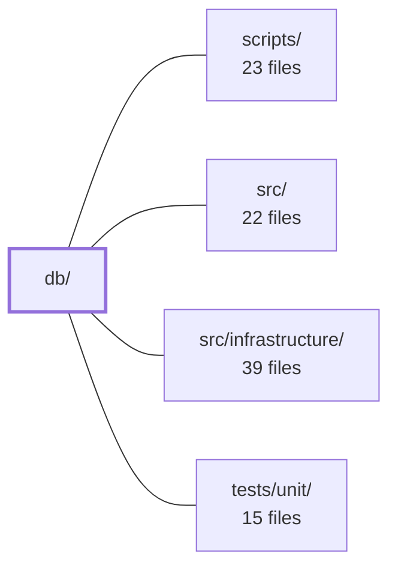

---
tags:
  - 2repo
  - 2repo/module
  - project/boilerplate-node-backend
type: module
module: db/
files: 20
updated: 2026-08-25T11:17:15.418371+00:00
---

# db/

## Purpose

`db/` owns every database-facing task that runs *outside* the API request cycle: seeding the demo dataset, executing ordered schema and data migrations, and clearing the Redis response cache. It is the single place where MongoDB and Redis are touched directly by operator or CI tooling, ensuring those writes follow the same lifecycle rules (connection cleanup, deterministic exit codes) as the rest of the codebase.

## Key parts

- **`demo/`** — The seed pipeline. `index.ts` is the entry point that opens a Mongo connection, enforces the production gate, and loops over each enabled module's `seeds` function. `assemble.ts` is the pure "DB → JSON" serializer used both by the seed exporter and by migration tests so the two never drift apart.
- **`migrations/`** — Ordered, idempotent scripts (via `migrate-mongo`) that evolve the schema and repair historical data: creating/dropping indexes, backfilling new columns, reshaping collections (e.g. cart extraction, stock → onHand+reserved), and fixing one-off bugs (backslash image URLs, missing locale fields). Each file is frozen once shipped; new changes go into subsequent migrations or schema declarations.
- **`cache-clear.ts`** — A standalone CLI that purges this app's cached responses from Redis, covering the gap left by writes that bypass the API's `invalidateCache` middleware.
- **`run-script.ts`** — A thin wrapper every one-shot script above imports for guaranteed connection teardown, non-zero exit on failure, and structured error logging.

## How it connects

- **`scripts/`** — npm script definitions (`db:bootstrap`, `db:seed`, `cache:clear`) are the invocation layer that calls into `demo/index.ts`, `cache-clear.ts`, and the migration runner. `db/` provides the logic; `scripts/` wires it to the command line.
- **`src/`** — The API's Mongoose schemas, `enabledModules` registry, and per-module `seeds` functions are the data contract that `demo/index.ts` iterates over. Migrations here must stay consistent with the field names and index declarations in `src/` schemas.
- **`src/infrastructure/`** — Shared connection factories (Mongo, Redis) and the logger used by `run-script.ts` and `cache-clear.ts` live here; `db/` consumes them rather than re-implementing connections.
- **`tests/unit/`** — Migration tests import `demo/assemble.ts` to derive an expected dataset from the same code path the seed exporter uses, guaranteeing both stay in sync.

## Where to start

1. **`db/run-script.ts`** — Short, single-file, and shows the lifecycle contract (connect → work → clean up → exit) that every other script in this module follows.
2. **`db/demo/index.ts`** — Illustrates the module-discovery pattern (`enabledModules` loop) and the production-safety gate, giving context for how new domain modules plug into seeding without touching this file.

## Connected modules

[[boilerplate-node-backend_scripts|scripts/]] · [[boilerplate-node-backend_src|src/]] · [[boilerplate-node-backend_src_infrastructure|src/infrastructure/]] · [[boilerplate-node-backend_tests_unit|tests/unit/]]

## Files
- `db/cache-clear.ts` — A standalone CLI script that drops every cached response belonging to this app from Redis. It exists because writes that bypass the API (seeding, `migrate-mongo`, manual `mongosh` sessions) skip the API's built-in `invalidateCache` middleware, leaving stale responses served until TTL expiry.
- `db/demo/assemble.ts` — Single source of truth for turning whatever is currently in the database into the committed `demo-data.json` byte sequence. It reads every enabled module's rows, flattens Mongoose types, validates internal referential integrity and shape coverage, and returns a deterministic JSON string. It exists as a standalone module (not inlined in the export script) so that the seed exporter and the migration test derive the dataset from identical code and cannot drift apart.
- `db/demo/index.ts` — Runner for the `db:seed` script. It owns connection setup, the production-environment gate, and the loop over `enabledModules` to call each module's `seeds` function. It intentionally knows no domain — adding or removing a module's demo data requires no change here. Executed on every container boot via `npm run db:bootstrap`, so it must be idempotent and safe.
- `db/migrations/20240101000000-initial-indexes.js` — Bootstrap migration that creates the initial set of indexes across the `users`, `products`, and `orders` collections. It is intentionally frozen ("kept as written") because it has already executed against every production database; any index changes go through subsequent migrations or the schema declarations that run at app startup.
- `db/migrations/20260806120000-user-locale.js` — One-time backfill that sets `locale` on every existing `users` document that lacks the field. The Mongoose schema default only applies on write, so documents already persisted before the field was introduced would otherwise read `undefined` indefinitely. This migration closes that gap for out-of-band consumers (queued emails, nightly jobs) that have no `Accept-Language` header to fall back on.
- `db/migrations/20260806140000-image-url-separators.js` — One-shot data repair migration that fixes two related bugs in stored `imageUrl` values: backslashes from Windows `path.join()` that make URLs unresolvable, and seed-fixture images whose directory moved from `/images/` to `/images/seed/`. It touches `imageUrl` on products, users, and the embedded product snapshots inside order items.
- `db/migrations/20260808120000-user-active-column.js` — Adds a stored `active` boolean field to every `users` document, decoupling "is this account enabled" from "is this account soft-deleted" (`deletedAt`). All existing rows are initialized to `true`, regardless of deletion state, because no prior `active` value ever existed to preserve.
- `db/migrations/20260808160000-cart-collection.js` — Migrates the embedded `cart` subdocument out of each user into a standalone `carts` collection, normalising item shape from `{ product, quantity }` to `{ productId, quantity }` and dropping the per-item `_id`s Mongoose generated. The copy-and-unset both ship in the same deploy because the API contract (`CartResponse`, `CartItem`) is unchanged on either side, so no dual-read window is needed.
- `db/migrations/20260808180000-prune-unused-indexes.js` — One-shot migration that drops three MongoDB indexes confirmed to serve no live query. Each index was traced against the queries that could have used it; none qualified. Dropping them removes per-write maintenance cost and frees memory from the working index cache. It exists as a migration because a schema declares what *should* exist, not what should stop existing.
- `db/migrations/20260808200000-users-email-unique.js` — Adds a unique index on `users.email` to close a check-then-insert race in `authService.signup` that can produce two accounts for one address. Because Mongo cannot alter an existing index's options in place, the migration drops and recreates the `users_email` index, and it refuses to run (throwing a descriptive error) if the collection already contains duplicate email addresses.
- `db/migrations/20260810120000-orders-soft-delete.js` — Adds the soft-delete surface to the `orders` collection — the `deletedAt` field and its supporting index — matching the pattern already in use by `products` and `users`. No data is migrated; only the index is created.
- `db/migrations/20260813090000-user-verified-column.js` — Backfills the `verified` field on all pre-existing `users` documents, grandfathering them as `true` so they are not subjected to the email-confirmation flow that only new self-signups go through. It exists to make the column meaningful for the entire table, not just rows created after deploy.
- `db/migrations/20260813091000-product-stock-column.js` — Backfills the `products.stock` field in MongoDB with a default of `100` (the same demo default the schema and `openapi.yaml` declare for new products). It exists to give every pre-existing row a usable stock count so that checkout-decrement and cancel-restore logic works immediately after the column is introduced, without requiring an admin to touch each product.
- `db/migrations/20260817120000-inventory-counters.js` — Migrates the `products` collection from a single `stock` counter to a two-counter reservation model (`onHand` + `reserved`), and drops the legacy `stockmovements` ledger. It exists to make the schema express the distinction between units physically present and units spoken for by an open order, which a single number cannot capture.
- `db/migrations/20260817140000-locale-collections.js` — Creates two unique indexes that enforce race-condition safety on the locale and locale-message collections. No data is migrated (both collections start empty and are populated by `npm run db:seed`); the migration exists solely to install the constraints that application-level check-then-insert logic cannot guarantee under concurrency.
- `db/migrations/20260818120000-locale-entry-scope.js` — Adds a `scope` field (`'app'` | `'api'`) to every `localemessages` row so that the same `(locale, key)` pair can appear once per dictionary. Before this migration the collection was keyed only by `(locale, key)`, which was unambiguous with a single dictionary; the introduction of `api`-side rows (layered over the API's own files) made that key insufficient.
- `db/migrations/20260818160000-locale-base-language.js` — Backfills a `baseLanguage` field on every `locales` document by extracting the ISO 639-1 primary subtag from the existing `tag` field (the substring before the first hyphen, trimmed and lowercased). This enables server-side grouping of language variants (e.g., all `pt-*` tags) without requiring application code to re-derive the value per query.
- `db/migrations/20260820140000-order-shipping-cost.js` — Backfills `shippingCost` on legacy orders that predate the `delivery` module. Without this, the absence of the field was ambiguous in the money path: it could mean "no delivery method was chosen" (a live, valid state) or "the column didn't exist yet" (a historical artifact). After this migration the column is always present and defaults to `0`, so a missing `shippingCost` becomes a genuine data-integrity signal rather than a tolerated legacy shape.
- `db/migrations/20260822120000-locale-entry-tenant.js` — Migrates the `localemessages` collection from a two-value `scope` enum (`app` / `api`) to a general `tenant` field holding a deployment-configured id. It renames the column, remaps the two legacy values to the demo tenant ids, and swaps the unique index from `(locale, scope, key)` to `(locale, tenant, key)`.
- `db/run-script.ts` — A single-export wrapper that provides the boilerplate every one-shot script in `db/` needs: a deterministic non-zero exit code on failure, guaranteed cleanup of open connections (Mongo, Redis) on both success and failure paths, and a structured error log through the shared logger. It exists so individual scripts don't each re-implement (or forget) that lifecycle handling.

---
[[boilerplate-node-backend_INDEX|← boilerplate-node-backend index]]
