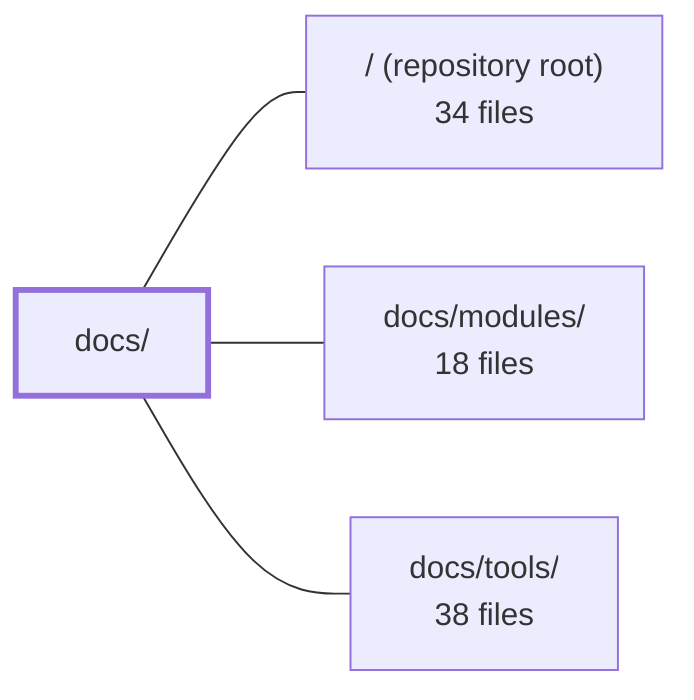

---
tags:
  - 2repo
  - 2repo/module
  - project/boilerplate-node-backend
type: module
module: docs/
files: 34
updated: 2026-08-25T11:17:28.721108+00:00
---

# docs/

## Purpose

The `docs/` directory is the project's complete documentation site, built with VitePress. It covers every layer of the boilerplate — architectural theory, API contract workflows, file-by-file reference indexes, and onboarding instructions — so that a reader (human or AI) can orient, navigate, and act without reverse-engineering the codebase.

## Key parts

- **Site infrastructure** — `.vitepress/config.mts` defines the site title, navigation, per-section sidebars, local search, and Mermaid rendering. `.vitepress/theme/index.ts` adds a click-to-zoom overlay for Mermaid SVG diagrams.
- **Landing & onboarding** — `index.md` introduces the project and its five documentation sections; `getting-started.md` walks a developer from fresh clone to a running, seeded API.
- **Theory** (`theory/`) — The architectural rationale: `architecture.md` (high-level blocks), `layers.md` (tier/layer boundaries), `modules.md` + `module-lifecycle.md` (module system and add/remove procedure), `strategic-ddd.md` / `tactical-ddd.md` (DDD adoption and exclusions), `domain-layer.md`, `request-flow.md`, `request-input.md`, `clustering.md`, `glossary.md`, and `reading-path.md` (prescribed first-pass file order).
- **API** (`api/`) — Contract-first workflows and endpoint reasoning: `openapi-workflow.md` (fragment → bundle → codegen pipeline), `asyncapi-workflow.md` (event-driven contracts), `contract-fragmentation.md` (ownership and byte-identity), `regenerating.md` (two-command cheat sheet), `endpoints.md` (design rationale per domain), `observability.md` (the five `/observability/*` routes), and `index.md` (section TOC and task routing).
- **Reference** (`reference/`) — File-level glossaries that map "which file do I edit?": `contracts.md` (pipeline map), `data.md` (schema/seeds split), `ops.md` (Docker, CI, templates), `root.md` (top-level files), `scripts.md` (build/lint/hook tooling), `src-app.md`, `src-infrastructure.md`, `src-modules.md`, `tests.md`, and `index.md` (entry-point and conventions for the section).

## How it connects

- **`/` (repository root)** — The reference pages (`root.md`, `ops.md`, `scripts.md`) document the root-level files and operational artifacts that live there. The API and theory pages describe the source tree they ship alongside.
- **`docs/modules/`** — The Theory section (`module-lifecycle.md`, `modules.md`) explains *why* the module shape is what it is; `docs/modules/` provides the per-domain pages. `reference/src-modules.md` explicitly tells readers to consult `docs/modules/` for domain-specific detail after learning the shared file patterns.
- **`docs/tools/`** — `api/index.md` routes readers to the appropriate workflow or pattern doc in `docs/tools/` based on their task (lint, mock, codegen, etc.), making it the "how to use the tooling" companion to this module's "what the tools do and why."

## Where to start

1. **`docs/getting-started.md`** — Takes you from `git clone` to a running, seeded API in under ten minutes, covering both container-first and host-mode setups.
2. **`docs/theory/reading-path.md`** — Prescribes a 9-file reading order through the source tree and restates the five structural invariants, so you build a correct mental model without reading ~21 000 lines.

## Connected modules

[[boilerplate-node-backend_ROOT|/ (repository root)]] · [[boilerplate-node-backend_docs_modules|docs/modules/]] · [[boilerplate-node-backend_docs_tools|docs/tools/]]

## Files
- `docs/.vitepress/config.mts` — VitePress site configuration for the project documentation. It defines the site title, top-level navigation, per-section sidebars, local search, and enables Mermaid diagram rendering via a plugin wrapper. It is the single source of truth for how the generated docs site is structured and navigated.
- `docs/.vitepress/theme/index.ts` — Custom VitePress theme that layers a click-to-zoom interaction on top of the default theme, letting users enlarge Mermaid SVG diagrams in a fullscreen overlay dialog.
- `docs/api/asyncapi-workflow.md` — Documents the async/event-driven contract layer of the codebase: how `asyncapi.yaml` is built from per-section source documents, split into a full and a public bundle, turned into generated TypeScript types, and consumed by RabbitMQ workers and the SSE observability stream. It exists so a reader knows where to edit, what to run, and why the contract is shaped the way it is without re-deriving those decisions.
- `docs/api/contract-fragmentation.md` — Defines the contract-ownership model between the backend and frontend repositories: which repo authors fragments, which bundles are produced, how they reach the frontend, and the byte-identity guarantee that keeps the two sides in sync. It complements `openapi-workflow.md` (how to *change* the contract) by answering *who owns it, where it lives, and how it gets shipped*.
- `docs/api/endpoints.md` — Narrative companion to the OpenAPI spec. It documents the *reasoning* behind the application's HTTP surface, domain by domain — design decisions, constraints, and trade-offs that don't fit in a table row. The authoritative route list lives in `openapi.yaml`; this page explains why the shape is what it is.
- `docs/api/index.md` — Landing page and table-of-contents for the API documentation section. It orients readers to the contract sources of truth (REST and async), summarizes the tooling pipeline around `openapi.yaml`, and routes readers to the appropriate workflow or pattern doc based on their task.
- `docs/api/observability.md` — Documents the five `/observability/*` routes that expose operational data (health, metrics, audit, SSE stream) as JSON or Prometheus text for dashboards, scrapers, and monitoring tooling. It exists so a reader can choose the right endpoint and auth mechanism without reading the route source.
- `docs/api/openapi-workflow.md` — Documents the contract-first OpenAPI workflow for this boilerplate: the rule that per-module YAML fragments are the edit surface, `openapi.yaml` is an assembled artifact, and all downstream tooling (lint, mock, codegen) flows from it. Exists so developers and AI assistants follow the correct sequence rather than hand-editing generated files.
- `docs/api/regenerating.md` — A quick-reference "I edited a fragment — now what?" cheat sheet. It documents the two-command regeneration workflow (`npm run regenerate` → `npm run complete`), the dependency chain between contract fragments and generated artifacts, a decision table mapping edits to the correct commands, and how to interpret each verification failure. It exists so a developer (or AI assistant) can act without re-deriving the pipeline order from `package.json` or the scripts.
- `docs/getting-started.md` — The onboarding page that takes a developer from a fresh clone to a running API with seeded demo data. It documents the container-first setup path (primary), the host-mode alternative (secondary), verification steps, contract-client generation, and the pre-commit quality gate. It exists so no one has to reverse-engineer the compose/env/script wiring before they can click a button.
- `docs/index.md` — Landing page (Docusaurus `layout: home`) for the boilerplate's documentation site. It introduces the project, positions this repo within the "Node backend boilerplate family," outlines the five documentation sections (Theory, Modules, Tools, API, Files), and provides navigation entry points for new readers.
- `docs/reference/contracts.md` — Reference page that maps the full contract pipeline: which YAML/TS files are hand-authored sources, how they are bundled into the canonical `openapi.yaml` / `asyncapi.yaml` documents, and what downstream artifacts (Zod schemas, TypeScript models, Spectral rulesets, client collections) are generated from them. It exists so a reader can identify the correct editable file without touching a generated one.
- `docs/reference/data.md` — Reference document for the `db/` directory. It explains the schema-vs-data split (migrations own shape, seeds own content), the demo-dataset pipeline that turns seeded rows into a published API-shaped JSON file, and the small utility scripts for cache clearing and one-shot DB work.
- `docs/reference/index.md` — Entry point and index for the `docs/reference/` section. Acts as a **file glossary**: given a filename, it tells you in one hop what the file is, what breaks without it, and which deeper page explains the concept. It also defines the conventions (three-tier classification, entry format) that every other reference page follows.
- `docs/reference/ops.md` — Reference index for every non-application-code artifact the project ships: the Docker/Podman compose stacks, container images, the full observability config chain, CI pipeline definitions, server-rendered EJS templates, and the static assets directory. It exists so a reader can locate and understand operational infrastructure without hunting through `.docker/`, `.github/`, or `public/` on their own.
- `docs/reference/root.md` — A reference index that catalogs every file with no parent directory in the repository, explaining what each one is, why it sits at the root (usually because a CLI tool resolves it by name), and where to read more. It exists so a reader can answer "what is this file at the top level?" without opening the file itself.
- `docs/reference/scripts.md` — Catalogs every file under `scripts/`, `eslint/rules/`, and `.husky/` — the repo's own build tooling, self-authored lint rules, and git hooks. It maps each implementation file to its `npm run` entry, its category, and the deeper doc that explains the workflow it supports. Nothing here ships in the production image.
- `docs/reference/src-app.md` — Reference page for the top-level `src/` files (`cluster.ts`, `app.ts`, `modules.ts`, `globals.d.ts`), the `src/app/` assembly layer (the ordered install steps that *are* the middleware stack), the `src/kernel/` module-system abstractions, and the `src/types/` contract re-exports. Exists so a reader can locate the right file for a given concern without reading every one.
- `docs/reference/src-infrastructure.md` — Reference page documenting the `src/infrastructure/` directory — the bottom tier of the application that handles everything the app runs *on* (external services, I/O, transport) while carrying zero domain knowledge. It exists so a reader can navigate the five infrastructure subdirectories and their contracts without opening each file.
- `docs/reference/src-modules.md` — Documents the standardized file shapes shared by all thirteen domain modules under `src/modules/`. Instead of reading each module individually, a reader learns the two dozen file patterns once here, then consults a domain-specific page under `docs/modules/` for what that particular module does with those shapes.
- `docs/reference/tests.md` — Documents the test-suite layout and the one-file-per-rule convention used in `tests/cross-cutting/`. It exists so a developer (or AI) can locate which test enforces a given architectural rule without reading the tests themselves.
- `docs/theory/architecture.md` — Defines the high-level architectural blocks (Contract → Entry → Business core → Persistence) and the ownership boundaries between them. It exists to answer "which major blocks talk to each other?" so readers can orient themselves before diving into folder-level detail.
- `docs/theory/clustering.md` — Explains the primary/worker clustering model and the graceful shutdown lifecycle for the Node.js application. It documents how `src/cluster.ts` supervises worker processes, how `src/app.ts` handles per-worker HTTP lifecycle, and the crash-backoff / shutdown-ordering rules that keep the system healthy across deploys and restarts.
- `docs/theory/domain-layer.md` — Explains the project's domain-layer convention: what logic belongs in `src/modules/<name>/domain/`, the lint-enforced import boundary, the "verdict, not rejection" shape, and the floor test that decides whether a rule earns a place there. Serves as the authoritative reference for placement decisions and for onboarding readers unfamiliar with the framework-free innermost layer.
- `docs/theory/glossary.md` — Defines the domain vocabulary (ubiquitous language) for each module's bounded context. Each term is scoped to the module that uses it, so the same word can legitimately carry different meanings in different contexts (e.g. *Soft delete* in `products` vs `users`). The file exists to capture the *meaning* and *constraints* behind identifiers that the code itself cannot express.
- `docs/theory/index.md` — Landing page for the **Theory** section of the docs. It frames the boilerplate's architectural mindset (contract-first → modules → layers → request flow), defines the two recurring vocabulary terms ("domain" in four senses, "barrel"), lists the strategies already baked into the code, and provides a navigation table that routes readers to the correct sub-page. It exists so a reader (human or AI) can orient before opening any single theory document.
- `docs/theory/layers.md` — Folder map for the codebase's two-axis architecture: **tiers** (what a file is allowed to know) and **layers** (what a file does within its domain). Exists so a reader can locate the exact implementation path and boundary rules without opening source files.
- `docs/theory/module-lifecycle.md` — Procedural reference for adding or removing a module: the exact sequence of commands, registry edits, and files to create or delete. Pairs with [modules.md](./modules.md), which explains *why* the shape is what it is; this page is *what you actually type*.
- `docs/theory/modules.md` — Documents the four-tier module architecture (app → modules → kernel → infrastructure), the strict downward-only dependency rule between them, and the rationale for every naming and placement decision. Exists so that "adding a domain is a folder plus a line" and "removing one is `rm -rf` plus deleting that line" remain true.
- `docs/theory/reading-path.md` — Prescribes a 9-file reading order for a first pass through the codebase, tells the reader what to skip initially, and restates the five structural invariants the code relies on. It exists so a newcomer (human or AI) can build a correct mental model without reading ~21 000 lines.
- `docs/theory/request-flow.md` — Documents the end-to-end path a request takes through the application — middleware chain, controller → service → repository → model → MongoDB — plus the parallel observability streams (traces, logs, metrics) and the error-handling strategy. Exists so a reader can understand *where* each concern lives and *why* the layers are ordered this way, without tracing code.
- `docs/theory/request-input.md` — Documents the single source of truth for how endpoint inputs are read, merged, and validated across route params, query strings, and body fields. It exists so that the polymorphism rules (which sources are read, in what precedence, how values are treated) are stated once rather than re-derived per call site.
- `docs/theory/strategic-ddd.md` — Documents the four strategic DDD patterns adopted at the module level in this codebase—bounded contexts, context mapping, ubiquitous language, and subdomain distillation—and explains how each is declared in `module.ts` and enforced by cross-cutting tests. Exists so a reader (human or AI) can understand the boundary and vocabulary rules without re-deriving them from test files or manifest entries.
- `docs/theory/tactical-ddd.md` — Documents the repo's selective adoption of Tactical DDD patterns—specifically the two that passed the "is the rule duplicated and do the copies disagree?" test—and explains the deliberate exclusion of aggregates, domain repositories, mappers, and a read model. Serves as the rationale layer for anyone (human or AI) modifying order-lifecycle or capability logic so they understand *why* the shape is what it is.

---
[[boilerplate-node-backend_INDEX|← boilerplate-node-backend index]]
