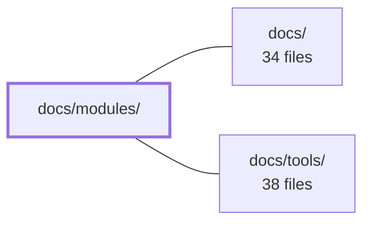

---
tags:
  - 2repo
  - 2repo/module
  - project/boilerplate-node-backend
type: module
module: docs/modules/
files: 18
updated: 2026-08-25T11:17:40.012520+00:00
---

# docs/modules/

## Purpose

The `docs/modules/` directory is the per-domain reference layer of the project documentation. Each Markdown file is a "vertical cut" through the codebase—one page per domain module (cart, orders, inventory, account, etc.)—written to explain *why* a module exists, what invariants it enforces, and how it relates to its neighbours. A top-level `index.md` groups the thirteen modules by subdomain and serves as the entry point for anyone navigating the module landscape.

## Key parts

- **`index.md`** – Table of contents for the whole section. Defines the subdomain grouping (core, supporting, generic), notes the naming asymmetry with the Vue frontend repo, and links to the navigation-tip table, endpoints reference, and every per-module page.
- **Core commerce pages** (`cart.md`, `cart-checkout.md`, `orders.md`, `payments.md`, `payments-provider-port.md`, `inventory.md`, `inventory-reservations.md`, `products.md`) – Cover the purchase lifecycle: catalogue → cart → checkout → payment → stock reservation/commit. `cart-checkout.md` is the deepest page, explaining the nine-step ordering and cross-module data flow of the only endpoint that writes into another module's collection.
- **Identity & auth pages** (`account.md`, `account-sessions.md`, `users.md`, `feedback.md`) – Describe the session/auth subsystem, the leaf `users` record, and the sole unauthenticated write route (contact requests).
- **Cross-cutting & infrastructure pages** (`audit-logs.md`, `observability.md`, `locales.md`, `delivery.md`, `wishlist.md`) – Document the headless audit sink, the operator-facing HTTP surface for metrics/health, the two-tier translation system, the shipping/courier lifecycle, and the smallest domain (per-user product list).

## How it connects

- **`docs/`** – The parent documentation tree. `docs/modules/` is a subdirectory within it; the top-level `docs/` page provides the overall site structure and navigation, while this directory supplies the per-module depth.
- **`docs/tools/`** – A sibling directory covering developer tooling and operational runbooks. The `index.md` page in this module cross-references `docs/tools/` for commands and scripts that operate on the modules described here, but the two directories do not share files.

## Where to start

1. **`index.md`** – Read first to learn the subdomain taxonomy, see which modules belong to which group, and get the link map to every other page.
2. **`cart-checkout.md`** – The single most instructive page: it shows how the documentation captures a cross-module sequence (cart → inventory → payments → orders → delivery) and explains *why* the steps are ordered that way, making the pattern obvious for understanding the remaining pages.

## Connected modules

[[boilerplate-node-backend_docs|docs/]] · [[boilerplate-node-backend_docs_tools|docs/tools/]]

## Files
- `docs/modules/account-sessions.md` — Documents the internal session/authentication subsystem: how JWTs are signed and verified, how the refresh-token cookie is managed, and how token lifetimes are configured. The module is deliberately **unpublished** — no barrel, no imports from outside `account/` — and exists solely to back the kernel's authentication port.
- `docs/modules/account.md` — Owns session management (signup, login, refresh, password reset, logout-everywhere, two-step deletion) and the per-account address book. Registers the application's auth resolver at import time so that every request guard can resolve "who is making this request?" before the first request arrives.
- `docs/modules/audit-logs.md` — Headless domain module that owns the MongoDB audit-log collection and installs the write sink at import time. It declares no router and exports nothing; its sole side-effect is registering a sink with `@infrastructure/observability/audit` so that the ~53 `emitAuditEvent` call-sites across the app have somewhere to write. Retention (90 days) is enforced entirely by a TTL index, not by application code.
- `docs/modules/cart-checkout.md` — Documents the `POST /cart/checkout` endpoint — the only cart operation that writes into another module's collection (`orders`) and the only one where a race can charge a customer twice. The page exists to explain *why* the nine-step sequence is ordered the way it is, and what each cross-module edge actually carries.
- `docs/modules/cart.md` — Defines the per-user cart document and the checkout that finalises it. The module exists so that pricing, stock, address, shipping, and order creation can all be reconciled in a single write path, and so that a user's cart lives in its own small indexed document rather than embedded in the account.
- `docs/modules/delivery.md` — Documents the delivery module: shipping rate functions, shipment records, and the fake courier that advances them through their lifecycle. It exists so readers understand how a parcel moves from `shipped → delivered` and how the cart prices a checkout without coupling to this module's state.
- `docs/modules/feedback.md` — Documents the feedback module, which handles contact requests from unauthenticated users and admin triage of those requests. It exists as a reference for the data model (email address + status enum), the sole unauthenticated write route in the app, and the operator-only fields on the record.
- `docs/modules/index.md` — Index page for the Modules section of the documentation. It defines the "vertical cut" through the codebase (one page per domain), groups all thirteen modules by subdomain (core, supporting, generic), documents the naming asymmetry between this repository and `boilerplate-vue-frontend`, and links out to the navigation tip table, the endpoints reference, and the per-module pages.
- `docs/modules/inventory-reservations.md` — Documents the reservation subsystem inside the inventory module: the lifecycle of a stock hold (reserve → commit or release), the exactly-once guarantee mechanism, the ledger-writing contract, and the sweep that expires stale holds.
- `docs/modules/inventory.md` — Owns all stock-counter mutations (`onHand`, `reserved`) and the `stockmovements` audit ledger. The counters physically live on the product document, but this module is the **only** writer; `products` never modifies them.
- `docs/modules/locales.md` — Documents the locales module: the two-tier translation system (bundled JSON files + runtime DB overrides) that determines which languages the deployment supports and how copy is resolved. It exists to clarify the `scope` distinction and the hard rule that DB rows can only override, never introduce, keys.
- `docs/modules/observability.md` — Defines the operator-facing HTTP surface for the observability domain: health check, metrics overview, live SSE stream, Prometheus scrape endpoint, and the audit-log read route. The module owns **URLs and routing** only — all metric data is measured and stored by `infrastructure/observability`, so this module contains no `model.ts` or `repository.ts`.
- `docs/modules/orders.md` — Documents the orders module: the aggregate that owns placed orders, their frozen line items, the status transition machine, and what cancellation restores. It exists as the canonical reference for the module's invariants (totals, legal transitions, rollback semantics) so that changes to any of those are made with full awareness of the cross-module contracts they enforce.
- `docs/modules/payments-provider-port.md` — Documents the `PaymentProvider` port: the single interface that `payments/service.ts` calls for all charge and refund operations. It defines the three-member contract, the env-driven provider selection mechanism (`NODE_PAYMENT_PROVIDER`), and the behavior of the shipped `fake` implementation. The page exists so that anyone wiring in a real PSP (or debugging the fake) knows the exact surface area and its invariants without reading the service code.
- `docs/modules/payments.md` — Documents the payments module: the layer that owns an order's money behind a provider port. An intent freezes the order's total; a confirm moves the order to `paid` and commits its held inventory units in one atomic step. Without it, reserved stock would expire without ever becoming a sale.
- `docs/modules/products.md` — Documentation for the **products** module — the catalogue domain that defines what the shop sells and carries the two stock counters (`onHand`, `reserved`) on every product row. It exists as the single source of truth that four other domains conform to, and deliberately depends on nothing to avoid import cycles.
- `docs/modules/users.md` — Documents the `users` module, which owns the user record (email, password hash, admin flag, reset/refresh tokens). It sits at the bottom of the dependency graph—zero outgoing dependencies, five incoming—making it the repo's only true leaf. Authentication logic intentionally does not live here; that is `account`'s job.
- `docs/modules/wishlist.md` — Documentation page for the **wishlist** module — the smallest domain in the repo. It describes a per-user list of product references (no checkout logic) and explains its three one-way dependencies, its event-driven back-links, and its trivially deletable position in the dependency graph.

---
[[boilerplate-node-backend_INDEX|← boilerplate-node-backend index]]
