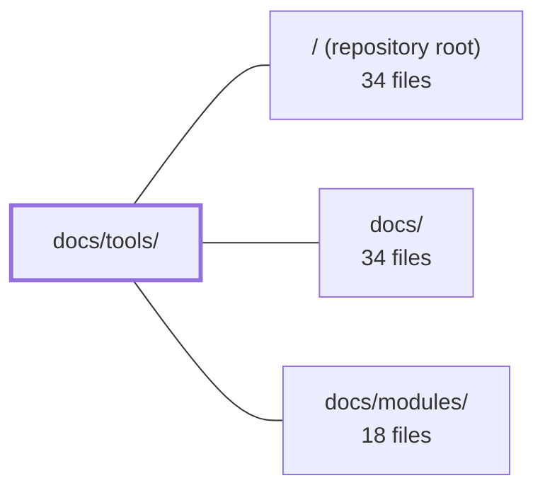

---
tags:
  - 2repo
  - 2repo/module
  - project/boilerplate-node-backend
type: module
module: docs/tools/
files: 38
updated: 2026-08-25T11:17:53.053272+00:00
---

# docs/tools/

## Purpose

`docs/tools/` is the deep-dive documentation section for every third-party technology, testing strategy, and cross-cutting concern in the boilerplate. Each page answers *why* a tool or pattern exists, *how* it is wired into the repo, and *what* a developer must preserve when modifying it. It is the operational reference that complements the architectural narrative in `docs/modules/`.

## Key parts

- **Orientation & index** — `index.md` (table of contents and concern-based grouping), `tools-explained.md` (one-paragraph-per-tool overview), `runtime.md`, `package-dependencies.md`, `package-scripts.md` (grouped by job, not alphabetical).
- **Testing strategy** — `testing-and-docs.md` (layered model and data architecture), `testing-quickstart.md` (script-to-question map), then per-layer pages: `unit-testing.md`, `integration-testing.md`, `contract-testing.md` / `contract-request-data.md`, `property-testing.md`, `concurrency-testing.md`, `fuzz-testing.md`, `mutation-testing.md`, `cluster-testing.md`, `load-testing.md`.
- **Observability stack** — `observability-layer.md` (in-repo code seams) and `observability-reference.md` (config quick-ref), plus per-tool pages: `prometheus.md`, `loki.md`, `tempo.md`, `grafana.md`, `opentelemetry.md`, `winston.md`, `analytics.md`, `frontend-observability.md`, `events-and-logging.md` (disambiguation of the seven signal types).
- **Infrastructure & data** — `mongodb-mongoose.md`, `rabbitmq.md`, `redis-cache.md`, `email-and-rendering.md`, `docker-and-podman.md`, `demo-profile.md`.
- **Cross-cutting concerns** — `security.md`, `i18n.md`, `dependency-graph.md`, `pairing-and-ports.md`.

## How it connects

- **`/` (repository root)** — Every page in this directory documents code, scripts, or configuration that lives at the repo root (`src/`, `package.json`, `docker-compose.yml`, `/.docker/observability/`). The docs are the "why and how" layer above that code; they do not duplicate it but point into it.
- **`docs/`** — The parent directory holds the top-level `README` and cross-section navigation. `docs/tools/index.md` links back to sibling sections and forward to `docs/modules/` for the architectural narrative.
- **`docs/modules/`** — Sibling section that describes *what each source module does* (routing, services, repositories, etc.). `docs/tools/` pages reference those modules when explaining how a tool integrates (e.g., how analytics hooks into controllers, how the observability layer wraps middleware). A reader who finishes a module page and needs to know "how do I test that?" or "where does this config live?" lands here.

## Where to start

1. **`index.md`** — the table of contents and concern-based map; tells you which sub-page to open for any question.
2. **`tools-explained.md`** — a single-pass, tool-by-tool orientation that requires no prior context; read it once and the rest of the section becomes navigable by topic rather than by searching filenames.

## Connected modules

[[boilerplate-node-backend_ROOT|/ (repository root)]] · [[boilerplate-node-backend_docs|docs/]] · [[boilerplate-node-backend_docs_modules|docs/modules/]]

## Files
- `docs/tools/analytics.md` — Documents the server-side product-analytics pipeline: how 21 controllers emit business events through a single helper, how the deployment selects a backend provider (Umami, PostHog, or none), and what configuration and operational caveats apply. Exists so a reader can wire up or debug analytics without tracing controller code.
- `docs/tools/cluster-testing.md` — Documents the `npm run test:cluster` suite — the only test that boots `src/cluster.ts` and forks real worker processes to verify cross-worker state (specifically rate limiting). Single-process suites cannot observe bugs where per-worker state is correct locally but absent cluster-wide, so this file exists to explain *why* that gap matters, how the two-case assertion works, and which settings silently invalidate the suite.
- `docs/tools/concurrency-testing.md` — Documents the concurrency-test strategy and the four race patterns it guards against. It exists because read-then-write races (double-insert, lost-update, phantom-session) are invisible to every other testing layer — unit tests, integration suites, and mutation testing all run serially by construction. This page is the "why" and "how" behind the test files, so a reader can understand invariants without re-deriving them.
- `docs/tools/contract-request-data.md` — Documents the request-side contract testing strategy: for every write endpoint, verify the API accepts every payload its own `openapi.yaml` declares legal and rejects exactly what it declares illegal. Data is generated **from the zod schema itself** (via `_zod.def` AST walking) rather than from hand-written factories, enabling "any legal input" queries. This is the mirror image of [Contract Testing](./contract-testing.md), which covers responses.
- `docs/tools/contract-testing.md` — Documents the response-shape contract testing layer: it verifies that the serialized JSON wire response matches `openapi.yaml` exactly, including the absence of undeclared fields (credential leaks, Mongoose `_id`/`__v`, populated sub-objects). This is the response half of contract testing; the request half is covered by [Contract-Derived Request Data](./contract-request-data.md).
- `docs/tools/demo-profile.md` — Documents the "demo profile": a self-contained, disposable API boot (`npm run demo`) that runs the real application against an in-memory MongoDB with Redis/RabbitMQ disabled. It exists so the paired Vue frontend's e2e suite (and any human developer) can exercise the actual API without Docker, external services, or hand-written mocks.
- `docs/tools/dependency-graph.md` — Documents the `dependency-cruiser` setup (`npm run check:dependencies`) that enforces reachability and cycle rules across `src/` — the two whole-graph properties that per-file lint rules cannot see. Explains *why* a second tool exists alongside `eslint-plugin-boundaries`, and flags the config settings that silently disable the rules if misconfigured.
- `docs/tools/docker-and-podman.md` — Documents the single local-container implementation the repo ships: the service topology defined in `docker-compose.yml`, the app image built from the Dockerfile, and the Podman compatibility layer (engine switching, log-driver differences for Promtail). Exists so contributors and AI assistants can understand the container setup without reading the compose file or the npm scripts directly.
- `docs/tools/email-and-rendering.md` — Documents the two "outbound rendering" pipelines shipped in the boilerplate—email (Nodemailer + EJS) and PDF invoices (puppeteer-core)—which run outside the standard request/response loop and are entirely optional (activated only when the relevant env vars or browser binary are configured).
- `docs/tools/events-and-logging.md` — A single-page disambiguation guide for the seven "something happened" signals in the codebase (application log, audit, analytics, metrics, traces, live SSE stream, queue jobs). It maps each signal to its entry point, destination, and intended reader so contributors pick the right one by *who reads it* rather than by what happened.
- `docs/tools/frontend-observability.md` — Documents how a paired frontend should be instrumented for observability, and why this repo deliberately avoids external SaaS (Sentry, PostHog cloud) in favor of reusing the existing self-hosted, container-based stack. It splits frontend observability into two distinct jobs—error/perf tracking and product analytics—and prescribes one lightweight, podman-friendly tool per job, with a documented upgrade path to heavier self-hosted alternatives.
- `docs/tools/fuzz-testing.md` — Documents the spec-driven fuzzing suite: it auto-discovers every operation in `openapi.yaml`, generates spec-valid but hostile requests via `fast-check`, drives them through the real app with `supertest`, and asserts two things — no 5xx status, and the response satisfies the OpenAPI contract via `jest-openapi`. It exists to cover endpoints the author never thought to hand-test, and to keep doing so as the API grows.
- `docs/tools/grafana.md` — Reference documentation for Grafana's role as the single unified UI over the project's observability stack (Tempo traces, Prometheus metrics, Loki logs). It records where Grafana runs, how to navigate it, the full data-flow pipeline, and the pinned image versions of every adjacent service.
- `docs/tools/i18n.md` — Documents how per-request translations are resolved and delivered without touching i18next's global instance. Covers the four-file `@infrastructure/i18n` module, the `AsyncLocalStorage`-based ambient `t`, the boundaries where that mechanism fails, and the database-override layer. Exists so a reader understands *why* `t` is imported from `@infrastructure/i18n` rather than `i18next`, and *where* they must carry the locale explicitly.
- `docs/tools/index.md` — Serves as the table of contents and conceptual map for the tools documentation section. It explains *why* each dependency exists in the app, groups them by concern (core stack, async/outbound, observability, project workflows), and directs readers to the relevant sub-page. It is the starting point for anyone new to the repo's tooling.
- `docs/tools/integration-testing.md` — Documents the integration-test layer: driving the real `src/app.ts` through `supertest` to verify that routes, middleware, and auth gates are correctly wired together. It exists to close the gap between "each unit works in isolation" and "the mounted app actually serves those units."
- `docs/tools/load-testing.md` — Documents how to generate external load against a running server using `autocannon` (a devDependency), and what to inspect in the observability stack while it runs. It exists so developers know the two built-in npm scripts, their intended targets, and how to read the results without conflating client-side and server-side latency.
- `docs/tools/loki.md` — Documents Grafana Loki's role as the log store in this boilerplate: how container logs reach it (via Promtail), how to query them in Grafana, and how log lines correlate with Tempo traces. Exists so a developer can set up, query, and troubleshoot the log pipeline without reading the Compose stack or Loki config directly.
- `docs/tools/mongodb-mongoose.md` — Documents the MongoDB + Mongoose persistence stack for this backend flavor: the architectural layering (service → repository → model → Mongo), the migrate-mongo migration workflow, the index-naming conflict rule, and the seed/export pipeline that publishes a deterministic snapshot for serializer-drift detection.
- `docs/tools/mutation-testing.md` — Documents how Stryker-based mutation testing is configured, run, and interpreted in this repo. It defines the glossary (mutant, killed, survived, no-coverage, static mutant, etc.), explains the per-file ratchet via `mutation-baseline.json`, and records the operational costs (memory, setup) that make mutation runs expensive. Exists so a human or AI can understand *why* the pipeline looks the way it does without re-deriving the constraints from `stryker.config.json` and the scripts.
- `docs/tools/observability-layer.md` — Documents the **in-repo** observability code — what the layer is made of, which seams hold it together, and the invariants any change must preserve. It is the companion to the external-stack reference (Prometheus, Loki, Tempo, Grafana, OTel collector) and answers "where is the code and how do the pieces connect?" rather than "how is the stack configured?"
- `docs/tools/observability-reference.md` — Quick-reference map of the boilerplate observability stack (traces, metrics, logs, alerts) and the most common config knobs for each tool. Exists so a developer can locate the right config file and setting without opening every YAML under `/.docker/observability/`.
- `docs/tools/opentelemetry.md` — Documents the OpenTelemetry tracing layer of the boilerplate: what is auto-instrumented, how the SDK is configured via environment variables, how spans flow through the OTel Collector to Tempo, and how `trace_id` correlates logs (Winston) with traces. Exists so a reader can understand the tracing setup without reading the SDK wiring or collector config directly.
- `docs/tools/package-dependencies.md` — A single-page index that groups every `package.json` dependency (runtime and dev) by purpose, explains why each group exists, and links to the deeper tool-specific doc pages. It exists so a reader can scan the full dependency surface without opening `package.json` or hunting through individual tool docs.
- `docs/tools/package-scripts.md` — Groups the `package.json` scripts by job (runtime, validation, testing, benchmarking) rather than raw list order, giving a single reference for which script to run in a given situation. Highlights the three daily commands (`compose:restart`, `regenerate`, `complete`) and explains two wrapper prefixes (`host`, `compose`) that eliminate repeated inline invocations.
- `docs/tools/pairing-and-ports.md` — Documents the co-existence contract between this API repository and its paired frontend: the two disjoint host-port blocks they occupy, the env-var mappings that must agree, and the shared-file identity mechanism that keeps generated artefacts in sync across the two checkouts.
- `docs/tools/prometheus.md` — Documents Prometheus, the boilerplate's metrics backend. Covers what metrics are exposed on `/observability/metrics`, the alert rules, Alertmanager wiring, the SSE live-metrics stream, and the admin-facing observability endpoints. Exists so a reader can understand the monitoring stack without reading the Prometheus/Grafana config files directly.
- `docs/tools/property-testing.md` — A documentation and convention page that defines how and why this repo uses property-based testing (via `fast-check`) alongside example-based tests. It sets the rules (seeding, committing counterexamples), states the criteria for choosing property-test targets, documents the division of labor between property and example files, and maps every property test file in the repository.
- `docs/tools/rabbitmq.md` — Documents how RabbitMQ serves as the project's message broker, offloading heavy or unreliable work (email sending, PDF generation) from the HTTP request/response cycle into durable background queues with retry and dead-lettering semantics.
- `docs/tools/redis-cache.md` — Documents the project's optional Redis response cache: the two-layer architecture (byte-store adapter + HTTP middleware), the key-construction rules, size and memory caps, invalidation semantics, and behavior under multi-process/multi-host deployments. Exists so readers understand *why* caching is optional, *how* keys are derived, and *what* breaks (and what doesn't) when Redis is absent.
- `docs/tools/runtime.md` — Catalogs the project's runtime stack (Node.js ≥ 22, Express 5, Zod, Multer, i18next, dotenv, TypeScript, tsx) and maps each tool to its concrete role in the repo. Exists so a reader can locate the right layer for a change without scanning `package.json` or source files.
- `docs/tools/security.md` — Documents the project's security architecture: the split-token auth model, rate-limit budgets, trust-proxy configuration, search-regex escaping, and the conventions around status codes and SSE authentication. Exists so developers (and AI assistants) understand *why* the security choices are shaped the way they are, not just *what* they are.
- `docs/tools/tempo.md` — Reference page documenting how Grafana Tempo (the trace store) is wired into the boilerplate's observability stack and how to query traces through Grafana.
- `docs/tools/testing-and-docs.md` — The top-level overview and index for the project's testing system. It defines the layered testing strategy (Unit → Integration → Contract → Property/Concurrency → Fuzz → Mutation), explains why each layer exists without overlapping the others, documents the `test:report` tool, and lays out the test-data architecture (one hand-maintained dataset + three generators). Every other `docs/tools/*` testing page is reached from the table and "Related pages" links here.
- `docs/tools/testing-quickstart.md` — A one-stop quick-start that maps every test/perf script in the repo to the question it answers, its runtime cost, and whether it is part of the CI gate. It exists so a developer can pick the right command in seconds without reading the full testing documentation.
- `docs/tools/tools-explained.md` — A single-page overview of every technology in the stack. For each tool it answers three questions—what it is, what problem it solves, and what role it plays in this repo—then links out to the dedicated deep-dive page for configuration details and code pointers. The goal is orientation: a reader (human or AI) can understand the full architecture in one pass without opening a dozen files.
- `docs/tools/unit-testing.md` — Documents the project's unit-test layer: what tools run the suite, the core patterns (real in-memory Mongo, selective `jest.mock()`), the file layout, the Jest-specific TypeScript config, and the npm commands to invoke it. Exists so a developer (or AI assistant) can orient themselves in the test infrastructure without reading every test file.
- `docs/tools/winston.md` — Documents the two Winston-based log streams (`logger` for app logs, `auditLogger` for security/admin events), their JSON formats, the `emitAuditEvent` audit pipeline (stdout + Mongo), configuration env vars, and the redaction layer. Exists so developers and ops know what to expect in stdout, what the audit endpoint serves, and how log/trace correlation works.

---
[[boilerplate-node-backend_INDEX|← boilerplate-node-backend index]]
