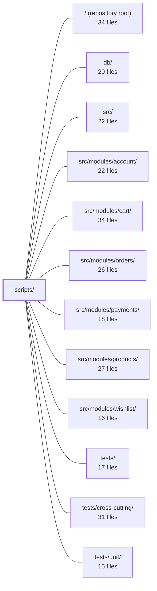

---
tags:
  - 2repo
  - 2repo/module
  - project/boilerplate-node-backend
type: module
module: scripts/
files: 23
updated: 2026-08-25T11:18:08.988590+00:00
---

# scripts/

## Purpose

`scripts/` is the build, verification, and tooling layer of the repository. It owns every CLI entry point that keeps committed artifacts (OpenAPI/AsyncAPI contracts, the demo dataset, generated types) in sync with their sources, enforces cross-repo contract identity with the paired frontend, and provides developer utilities for debugging, testing, and local demos. It does not contain application logic itself; it orchestrates the build pipeline and guards that the repo's published documents remain authoritative.

## Key parts

- **Contract bundling (`contracts/`)** — `fragments.ts` defines the shared `ContractBundle` type and helpers; `index.ts` assembles the registry of all bundles. Each sibling file (`openapi.ts`, `asyncapi.ts`, `analytics-events.ts`, `generate-collections.ts`) owns the build logic for one artifact. `bundle-contracts.ts` is the CLI that drives them and exposes a `--check` mode for CI staleness detection.
- **Cross-repo sync & identity** — `frontend-path.ts` resolves the sibling Vue checkout; `spec-identity.ts` / `check-spec-identity.ts` hash-compare shared spec files; `sync-frontend.ts` copies backend-owned files into the frontend with integrity verification.
- **Generation & regeneration** — `regenerate.ts` runs the full artifact chain in dependency order; `gen-asyncapi-types.ts` emits realtime TypeScript types from the AsyncAPI bundle; `export-seed.ts` serialises the demo dataset through the API's own assembly path into `db/demo/`.
- **Quality gates** — `check-environment-keys.ts` verifies `.env-example` completeness against `src/`; `mutation-baseline.ts` + `check-mutation-baseline.ts` implement a per-file mutation-score ratchet; `mutation.ts` wraps Stryker with env-sourced settings and OOM protection.
- **Demo & smoke testing** — `demo.ts` boots the full app against in-memory MongoDB for the frontend dev server and e2e suite; `prism-smoke.ts` validates that `openapi.yaml` is complete enough for Prism to serve a 2xx.
- **Developer utilities** — `test-report.ts` summarises Jest/Vitest JSON reports per module; `heap-report.ts` and `heap-retainers.ts` inspect V8 heap snapshots for leak debugging.

## How it connects

- **`/` (repository root)** — The npm scripts defined in `package.json` invoke every entry point here. `check-environment-keys.ts` reads the root-level `.env-example`; `regenerate.ts` chains root-level npm commands.
- **`src/`** — `check-environment-keys.ts` statically scans `src/` for undocumented env-var reads. `demo.ts` and `export-seed.ts` boot the application from `src/` to exercise its seeders, serializers, and assembly path. `contracts/openapi.ts` reads per-module YAML fragments authored under `src/modules/`.
- **`src/modules/*` (account, cart, orders, payments, products, wishlist)** — The contract bundles reference paths owned by these modules; `demo.ts` and `export-seed.ts` seed fixtures from every enabled module's seeders, making the demo dataset and `db/demo/demo-data.json` a function of their combined output.
- **`db/`** — `export-seed.ts` writes `db/demo/demo-data.json`; `demo.ts` uses a throwaway in-memory MongoDB rather than the files in `db/`, but the published dataset lives there.
- **`tests/`, `tests/cross-cutting/`, `tests/unit/`** — The committed contract bundles produced by `contracts/` are consumed by Spectral, Orval, Prism, and the cross-cutting test suite. `check-spec-identity.ts` is wired into CI and into `npm run complete`, which the test workflows depend on. `demo.ts` is the canonical backend that the e2e test suite in `tests/` targets.

## Where to start

1. **`scripts/contracts/index.ts`** — Reading this single file gives you the full inventory of contract artifacts, their source paths, and their output destinations. It is the map for everything the bundling subsystem produces.
2. **`scripts/bundle-contracts.ts`** — The CLI entry that ties the fragments together. Understanding its `--check` mode and how it iterates `CONTRACT_BUNDLES` makes the rest of the `contracts/` directory's structure immediately clear.

## Connected modules

[[boilerplate-node-backend_ROOT|/ (repository root)]] · [[boilerplate-node-backend_db|db/]] · [[boilerplate-node-backend_src|src/]] · [[boilerplate-node-backend_src_modules_account|src/modules/account/]] · [[boilerplate-node-backend_src_modules_cart|src/modules/cart/]] · [[boilerplate-node-backend_src_modules_orders|src/modules/orders/]] · [[boilerplate-node-backend_src_modules_payments|src/modules/payments/]] · [[boilerplate-node-backend_src_modules_products|src/modules/products/]] · [[boilerplate-node-backend_src_modules_wishlist|src/modules/wishlist/]] · [[boilerplate-node-backend_tests|tests/]] · [[boilerplate-node-backend_tests_cross-cutting|tests/cross-cutting/]] · [[boilerplate-node-backend_tests_unit|tests/unit/]]

## Files
- `scripts/bundle-contracts.ts` — CLI entry point (invoked via `npm run contracts:bundle`) that rebuilds the repo's committed contract bundle documents from their source fragments. It supports a `--check` mode that asserts bundles are not stale without writing, and accepts optional bundle names to narrow the run. It exists so that fragments remain the single source of truth while the committed bundles — consumed by spectral, orval, Prism, the seed runner, and `check:spec-identity` — stay in sync.
- `scripts/check-environment-keys.ts` — Static-analysis guard that verifies every environment variable read in `src/` is present in `.env-example`. It exists because `.env-example` is the sole deployment contract, and an undocumented key fails silently (the feature just never activates). Run via `npm run check:environment-keys`; exits 0 when all reads are documented, 1 otherwise.
- `scripts/check-mutation-baseline.ts` — CLI entry point for the per-file mutation-score ratchet. It reads the Stryker report (`reports/mutation/mutation.json`) and compares it against `mutation-baseline.json`, flagging any file whose score dropped. With `--update` it records the run as the new baseline (improvements only). It deliberately does **not** invoke Stryker, so a CI job can split the expensive run and the cheap gate into separate steps.
- `scripts/check-spec-identity.ts` — CLI entry point (`npm run check:spec-identity`) that verifies the shared contract files in this repo are byte-identical to those in the paired frontend repo. It exists to catch accidental drift between the two checkouts before it reaches production, and is invoked both by CI and by `npm run complete`.
- `scripts/contracts/analytics-events.ts` — Builds the `analytics-events` contract bundle: it slices the frontend's analytics event names verbatim from `shared/contracts/analytics.frontend.ts` and publishes them into `src/infrastructure/observability/analytics-events.frontend.ts`. Only the frontend half is published because both repos share one Umami namespace and every name has exactly one emitter — backend names stay as ordinary imports in their controllers, so a published copy would have no reader on either side.
- `scripts/contracts/asyncapi.ts` — Merges per-section AsyncAPI YAML documents into two complete bundles — a full `asyncapi.yaml` (all channels) and a public `asyncapi.public.yaml` (only API-client-reachable channels) — by copying four map nodes through the YAML AST. It exists to produce the committed contract files without dereferencing `$ref`s, preserving authored quoting/scalar style, and keeping the document small enough for `gen-asyncapi-types.ts` to walk.
- `scripts/contracts/fragments.ts` — Defines the type system and small set of helper functions for contract bundles. It distinguishes **compiled** bundles (built from authored source files in this repo) from **generated** bundles (built from an already-committed document), and provides the common operations both kinds support: producing text, reading the committed copy, and listing source files for staleness checks. It performs no bundling itself — each bundle owns its own build.
- `scripts/contracts/generate-collections.ts` — Configuration file that drives `@guebbit/openapi-runnable-collections` to generate API-client collections (Bruno, Insomnia, Mockoon, Postman) for the Ecommerce Demo API. It is run on demand via `npm run contracts:bundle` and its outputs are gitignored. The file itself is not machinery—it supplies the three things only this repo can answer: section-to-path ownership, concrete seed values for requests, and authored rejection probes.
- `scripts/contracts/index.ts` — Central registry of every contract document the repo produces. It assembles the eight `ContractBundle` descriptors into a single `CONTRACT_BUNDLES` array so the CLI, staleness checker, and cross-cutting tests can iterate one list. It also re-exports the shared `ContractBundle` type and helpers from `./fragments`.
- `scripts/contracts/openapi.ts` — Compiles the REST OpenAPI contract from per-module standalone YAML documents into a single `openapi.yaml` using `redocly bundle`, and exposes the section ordering and path-lookup utilities that downstream tooling (client collections, tests) relies on.
- `scripts/demo.ts` — Entry point for the "demo profile" (`npm run demo`): boots the real application against a throwaway in-memory MongoDB, seeds fixtures from every enabled module, and serves the API on `NODE_PORT` with cache and queue disabled. It is the canonical backend for the paired frontend's dev server and the e2e test suite, replacing a hand-written mock.
- `scripts/export-seed.ts` — CLI script (`npm run seed:export`) that regenerates `db/demo/demo-data.json` by seeding a throwaway in-memory MongoDB with the project's real seeders and then serializing the result through the API's own assembly path. It exists to guarantee the published demo dataset reflects what the API actually emits—including schema defaults, derived totals, and serializer omissions—rather than a hand-maintained fixture that can silently drift.
- `scripts/frontend-path.ts` — Resolves the absolute path to the paired Vue frontend checkout for cross-repo contract checks. It centralises the sibling-directory convention and the `FRONTEND_PATH` env-var override so that every script that needs to reach the other repo resolves the location the same way.
- `scripts/gen-asyncapi-types.ts` — Generates the TypeScript realtime-contract types (payload interfaces, message aliases, per-namespace channel constants/unions, and SSE event maps) from the local `asyncapi.yaml`. It exists so both repos in the pair get a single, byte-identical generation script: the backend runs it against the full contract, the frontend against the public subset, and both write `src/types/asyncapi.generated.ts`.
- `scripts/heap-report.ts` — CLI tool that summarises a V8 `.heapsnapshot` file by streaming it and reporting the top-N object kinds (by `self_size`). It exists because snapshots of any real size exceed V8's maximum string length, so the standard `JSON.parse(readFileSync(...))` approach fails with `ERR_STRING_TOO_LONG` before parsing even starts.
- `scripts/heap-retainers.ts` — Answers "who is holding these?" for one kind of heap object by building a reverse-edge index over a V8 `.heapsnapshot` and walking retainer chains upward. It exists because `heap-report.ts` aggregates node sizes but never reads the edges between nodes, so it cannot identify owners. Typical workflow: run `heap-report.ts` to find the dominant kind, then run this script to find its retainer.
- `scripts/mutation-baseline.ts` — Implements a per-file mutation-testing ratchet. Because Stryker's built-in thresholds are global (one strong file can mask a weak one), this module records each file's score from a real run, then enforces that no file drops below its recorded baseline unless a human explicitly re-baselines it. It provides the scoring, comparison, and baseline-building logic; a separate checker script consumes it.
- `scripts/mutation.ts` — A `tsx`-run wrapper around `npx stryker run` that layers three things a committed `stryker.config.json` cannot express: machine-specific settings sourced from `.env`, a pre-run cleanup of the Jest scratch directory, and a circuit-breaker that kills a run stuck in an OOM restart loop.
- `scripts/prism-smoke.ts` — A one-shot smoke test that boots [Prism](https://stoplight.io/prism) in mock mode against `openapi.yaml`, polls until the server is accepting connections, and issues a single `GET` to verify the spec is complete enough to serve a 2xx response. It validates the **contract document** itself, not application logic. Wired to `npm run test:prism`.
- `scripts/regenerate.ts` — Renders every committed generated artifact in the correct dependency order by running a fixed sequence of npm scripts. It exists so that a single command (`npm run regenerate`) reproduces the full chain (`contracts:bundle` → `gen:api` → `gen:asyncapi` → `seed:export` → optional `sync:frontend`) without the caller needing to know or remember the ordering constraint (e.g. `api/` must exist before `seed:export` runs).
- `scripts/spec-identity.ts` — Cross-repo contract identity check. Verifies that a small set of spec files are **byte-for-byte identical** in this (backend) repo and the paired frontend checkout, catching silent forks that would still pass each repo's own CI. It is deliberately an identity check (hash equality), not a semantic one.
- `scripts/sync-frontend.ts` — CLI script (`npm run sync:frontend`) that copies every backend-owned shared file into the paired frontend checkout. It enforces that the frontend always receives a byte-identical copy of files this repo owns, with staleness gates, hash-based no-op detection, optional frontend regeneration, and a post-copy integrity check.
- `scripts/test-report.ts` — CLI script that reads a Jest or Vitest JSON test report and prints three things a raw log cannot: a per-module rollup (suites, tests, failures, time), the slowest suites/tests, and per-module line coverage. It exists so that a red build or a slow suite can be attributed to a domain module at a glance, without changing how tests are run. Invoked via `npm run test:report [-- <file.json>]`.

---
[[boilerplate-node-backend_INDEX|← boilerplate-node-backend index]]
