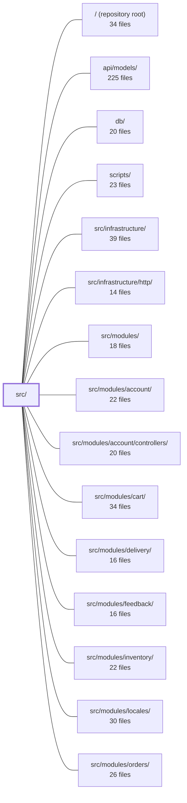

---
tags:
  - 2repo
  - 2repo/module
  - project/boilerplate-node-backend
type: module
module: src/
files: 22
updated: 2026-08-25T11:18:23.652484+00:00
---

# src/

## Purpose

`src/` is the application assembly layer: it wires the Express server, orders the middleware stack, bootstraps infrastructure dependencies, mounts every enabled domain module, and provides the cross-cutting contracts (auth, authorization, events, module registry) that those modules rely on. It contains no business logic itself—its job is to decide *what runs, in what order, and under what constraints*.

## Key parts

- **Entry & lifecycle** — `app.ts` (single-process bootstrap: middleware ordering → infra boot → listen), `cluster.ts` (multi-process fork/respawn wrapper), `app/workers.ts` (queue-consumer wiring at startup).
- **Express middleware & transport** — `app/security.ts`, `app/request-context.ts`, `app/telemetry.ts`, `app/static-assets.ts`, `app/error-handling.ts`. Together they define the order-sensitive middleware chain and the last-line-of-defense error paths before any domain route executes.
- **Route mounting & system endpoints** — `app/routes.ts` walks the enabled-module list from `modules.ts` and attaches each module's router at its declared base path (zero domain imports). `app/system-routes.ts` serves the bare health-check. `app/demo.ts` exposes two unauthenticated control routes gated behind `NODE_DEMO=true`.
- **Kernel (shared contracts & cross-cutting logic)** — `kernel/registry.ts` (typed `AppModule` contract, DAG validation, event-subscription vs. route-mount separation), `kernel/authentication.ts` (port + registry for token verification), `kernel/authorization.ts` (single shared row-level access rule), `kernel/events.ts` (in-process event bus), `kernel/middlewares/authorizations.ts` (Bearer-token → `authContext` resolution, composable guards, audit emission), `kernel/seed-accounts.ts` (fixed demo identities referenced by four modules).
- **Shared types & module list** — `modules.ts` (authoritative enabled-module list), `types/index.ts` (barrel re-export of generated API models, AsyncAPI types, and hand-written auth DTOs), `types/auth-context.ts` (transport-safe `AuthContext` / `Caller` shapes), `types/asyncapi.generated.ts` (channel names & payload shapes from `asyncapi.yaml`), `globals.d.ts` (Express `Request` augmentation).

## How it connects

- **`src/modules/*` (all domain modules)** — each module satisfies the `AppModule` contract defined in `kernel/registry.ts`; `app/routes.ts` mounts their routers, and `modules.ts` is the single list that both the server and tooling scripts read.
- **`src/infrastructure/` and `src/infrastructure/http/`** — security handlers, queue clients, cache, and DB drivers are imported here but implemented in the infrastructure layer; `app/workers.ts` binds those clients to queue names at boot.
- **`api/models/`** — re-exported through `types/index.ts` so controllers and middleware across all modules share one import path for request/response DTOs.
- **`db/`** — the sequential infra boot in `app.ts` (env → DB → cache → queue → workers → i18n) depends on the database connection established by the `db/` package before any route is reachable.
- **`scripts/`** — tooling scripts import `modules.ts` to discover enabled modules without maintaining their own lists.
- **`tests/` (unit, cross-cutting, support)** — `app/demo.ts` and `kernel/seed-accounts.ts` exist specifically so e2e and integration suites can reach a deterministic start state and read side-effects (sent emails, fixed credentials).

## Where to start

1. **`src/app.ts`** — read top-to-bottom to see the exact boot sequence (middleware order, infra dependencies, listen) and the `startServer` / `stopServer` lifecycle API. It is the single file that tells you *what the process does in the first second*.
2. **`src/kernel/registry.ts`** — once you understand the boot order, this file defines the shape every domain module must take (`AppModule`), the dependency DAG, and how routes vs. event subscriptions are separated. It is the contract that makes the rest of the module list predictable.

## Connected modules

[[boilerplate-node-backend_ROOT|/ (repository root)]] · [[boilerplate-node-backend_api_models|api/models/]] · [[boilerplate-node-backend_db|db/]] · [[boilerplate-node-backend_scripts|scripts/]] · [[boilerplate-node-backend_src_infrastructure|src/infrastructure/]] · [[boilerplate-node-backend_src_infrastructure_http|src/infrastructure/http/]] · [[boilerplate-node-backend_src_modules|src/modules/]] · [[boilerplate-node-backend_src_modules_account|src/modules/account/]] · [[boilerplate-node-backend_src_modules_account_controllers|src/modules/account/controllers/]] · [[boilerplate-node-backend_src_modules_cart|src/modules/cart/]] · [[boilerplate-node-backend_src_modules_delivery|src/modules/delivery/]] · [[boilerplate-node-backend_src_modules_feedback|src/modules/feedback/]] · [[boilerplate-node-backend_src_modules_inventory|src/modules/inventory/]] · [[boilerplate-node-backend_src_modules_locales|src/modules/locales/]] · [[boilerplate-node-backend_src_modules_orders|src/modules/orders/]] · … and 8 more

## Files
- `src/app.ts` — The application's entry point and Express server bootstrap. It wires the middleware stack in dependency-critical order, runs the sequential infra boot (env validation → DB → cache → queue → workers → i18n → listen), and exposes `startServer` / `stopServer` as the single lifecycle API. Everything that needs to be "before routes" or "before error handlers" is ordered here, deliberately, at module top-level.
- `src/app/demo.ts` — Control surface for the demo profile, mounted only when `NODE_DEMO=true` (set by `npm run demo`). Exposes two unauthenticated routes (`POST /__demo/reset`, `GET /__demo/emails`) that the paired frontend's e2e suite uses to reach a deterministic start-of-spec state and to read "sent" emails. Lives at the app tier because reseeding requires walking every enabled domain module.
- `src/app/error-handling.ts` — Last-line-of-defense error handling for the application: the Express global error handler (for request-scoped failures nobody else caught) and the Node process-level handlers (`unhandledRejection`, `uncaughtException`). Both answer the same question — "what happens to a failure with no owner?" — at the two levels it can occur.
- `src/app/request-context.ts` — Installs the per-request context middleware group (request ID, access logging, locale negotiation) onto an Express app in a single, ordered call. It exists as one grouped unit because every piece attaches state that downstream handlers read, and the internal ordering is load-bearing.
- `src/app/routes.ts` — Installs all HTTP route mounts onto the Express application. It walks the enabled-module list and attaches each module's router at the base path the module itself declares, so the file contains zero domain-specific imports. The only explicit route import is `system-routes`, which serves cross-cutting endpoints (contract, docs, root redirect) that don't belong to any single domain.
- `src/app/security.ts` — Installs the application's transport-level protections and body-parsing middlewares onto an Express instance in a specific, order-sensitive sequence. It exists to centralise *which* security handlers are active and *in what order*, while delegating the actual handler implementations to infrastructure packages.
- `src/app/static-assets.ts` — Configures Express's built-in static file handler to serve uploaded images and other public assets directly from the Node process (rather than a reverse proxy). Exists so the security guarantees around uploaded files stay within the test suite's reach.
- `src/app/system-routes.ts` — Defines a minimal Express router that exposes a single public health-check endpoint (`GET /`). It exists so that load balancers, orchestrators, or operators can verify the process is alive without touching any domain logic.
- `src/app/telemetry.ts` — Installs Prometheus HTTP metrics middleware on the Express application, recording per-request latency and in-flight request counts. It exists to make request performance observable without each handler carrying its own instrumentation.
- `src/app/workers.ts` — Wires queue consumers to their job handlers at application startup. This is the assembly point that decides *which* queues this build drains, keeping the handlers themselves in the infrastructure layer. No-ops cleanly when RabbitMQ is disabled.
- `src/cluster.ts` — Entry point for multi-process (cluster) mode. When `NODE_ENABLE_CLUSTERING` is enabled, this file acts as the primary process: it forks worker processes, monitors them for crashes, and applies exponential-backoff respawning. Workers simply load `src/app.ts`. OTel tracing is initialized here before any other module loads. If clustering is not needed, `package.json`'s `main` can be pointed at `src/app.ts` instead.
- `src/globals.d.ts` — TypeScript module augmentation that extends Express's `Request` interface with project-specific properties (auth context, locale, translation function, stored image URLs, request ID). It exists so that controllers and middleware can type-safely access per-request state without manual casting or a separate request-wrapper type.
- `src/kernel/authentication.ts` — Declares the authentication port (interface) for the kernel and provides a lightweight registry so that whichever module owns token verification can inject its implementation at boot. It keeps the kernel free of any concrete auth dependency while giving middleware a single, stable entry point to turn tokens into users.
- `src/kernel/authorization.ts` — Defines the single shared authorization rule used by four domains (orders, payments, products, locales): admins read everything, everyone else reads a narrowed slice. It centralises the rule so it is written once instead of four times, preventing silent scope drift. It answers *which rows* a caller may see once route access has already been granted.
- `src/kernel/events.ts` — In-process domain event bus that lets two modules communicate without importing each other, breaking what would otherwise be circular dependencies (e.g. products ↔ cart). It is explicitly **not** a durable broker: no persistence, no retry, no replay.
- `src/kernel/middlewares/authorizations.ts` — Express middleware layer that enforces authentication and authorization on API routes. It resolves bearer tokens into a normalized `request.authContext` and provides composable guards (`isAuth`, `isAdmin`) plus a cookie-based variant (`isAdminViaCookie`) for browser-initiated endpoints that cannot send headers (e.g. SSE via `EventSource`). Every rejection path emits an audit event before responding.
- `src/kernel/registry.ts` — Defines the typed contract (`AppModule`) that every domain module must satisfy to be mounted into the running application, plus the validation and registration functions that turn the static list in `src/modules.ts` into a bootable server. It enforces a DAG of inter-module dependencies, classifies each module's strategic-DDD subdomain, and separates event subscription from route mounting.
- `src/kernel/seed-accounts.ts` — Single source of truth for the two fixed demo accounts (admin + user) — their MongoDB ObjectIds, login credentials, and a bundled `seedCredentials` object. It lives in the kernel rather than in the `users` module because four other modules need references to these identities, and centralizing six string literals here avoids adding three extra registry edges.
- `src/modules.ts` — Central registry that declares which domain modules are enabled in this build. It exists so that the application, demo harness, and tooling scripts share a single authoritative list of modules without each file maintaining its own imports.
- `src/types/asyncapi.generated.ts` — Auto-generated TypeScript type definitions and channel-name constants derived from the project's `asyncapi.yaml` specification. It provides a single source of truth for message payload shapes, channel identifiers, and SSE event mappings used across the infrastructure layer.
- `src/types/auth-context.ts` — Defines the transport-safe authentication context types that decouple controllers, middleware, and services from Mongoose document internals. It provides a single `AuthContext` shape for "who is calling" and a narrower `Caller` shape for "what a rule may check," so that authorization logic is type-enforced to touch only permission-relevant fields.
- `src/types/index.ts` — Barrel module that re-exports all shared TypeScript types from the three canonical sources (generated API models, generated AsyncAPI types, and hand-written auth-context DTOs) under a single import path, so consumers across the codebase never need to know the internal file layout.

---
[[boilerplate-node-backend_INDEX|← boilerplate-node-backend index]]
