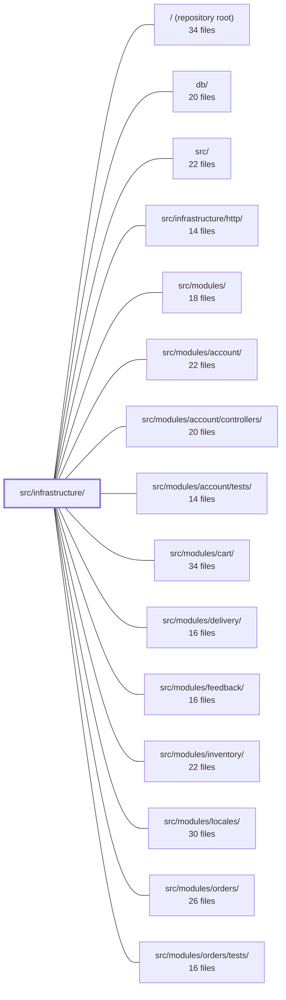

---
tags:
  - 2repo
  - 2repo/module
  - project/boilerplate-node-backend
type: module
module: src/infrastructure/
files: 39
updated: 2026-08-25T11:18:43.092138+00:00
---

# src/infrastructure/

## Purpose

`src/infrastructure/` is the bottom layer of the dependency graph. It owns every integration with an external system (Redis, RabbitMQ, MongoDB, SMTP, Puppeteer, OpenTelemetry, analytics endpoints), provides the shared persistence primitives that domain repositories build on, and centralises cross-cutting concerns—logging, i18n, observability, and process lifecycle—so that `src/modules/` and `src/infrastructure/http/` never talk to a vendor SDK directly.

## Key parts

- **`adapters/`** — One file per external dependency.
  - *Messaging & email:* `queue.ts` (RabbitMQ publish/consume, no-op when broker absent), `mailer.ts` (EJS + Nodemailer producer), `email.worker.ts` (queue consumer that renders and sends), `demo-outbox.ts` (in-memory sink for the `demo` profile).
  - *Storage & uploads:* `image-store.ts` (the `ImageStore` port), `storage.ts` (multer pipeline config), `filesystem.ts` (temp-file relocation & cleanup), `image-signatures.ts` (magic-byte MIME verification), `cache.ts` (Redis byte store, fail-open).
  - *Rendering:* `pdf.ts` (single Puppeteer launch wrapper), `pdf.worker.ts` (queue handler that turns EJS → HTML → A4 PDF).
  - *Logging:* `logger.ts` (Winston setup, redaction policy, `logger` + `auditLogger` exports).

- **`i18n/`** — Request-scoped internationalisation.
  - `catalog.ts` resolves available locales; `negotiate.ts` picks a locale from `Accept-Language`; `context.ts` binds a per-request `t` via `AsyncLocalStorage`; `overrides.ts` layers admin-edited translations from the database; `index.ts` is the single barrel every call-site imports.

- **`observability/`** — Metrics, tracing, audit, and analytics.
  - `metrics-http.ts` and `metrics-cache.ts` register all Prometheus counters/histograms; `process-snapshot.ts` gives one consistent `memoryUsage`/`uptime` reading; `stream.ts` pushes them over SSE.
  - `tracer.ts` wraps the OTel API behind a single import; `audit.ts` defines the structured audit-event vocabulary and emit pipeline.
  - `analytics/` holds the `AnalyticsProvider` port plus concrete `umami`, `posthog`, and `none` implementations selected by an env variable; `analytics-events.frontend.ts` is the shared event-name contract.
  - `dependency-health.ts` reads in-memory connection states (zero I/O) for the readiness endpoint.

- **`persistence/`** — Domain-agnostic Mongoose helpers.
  - `base-repository.ts` turns a model into a CRUD + search object; `search.ts` standardises pagination/filter conventions; `serialize.ts` maps stored documents to the OpenAPI wire shape; `factory.ts` + `seed.ts` provide reproducible fixture upserts and export.

- **`runtime/`** — Process-level lifecycle.
  - `environment.ts` validates required env vars at boot; `database.ts` manages the MongoDB connection; `managed-connection.ts` shares the open/close/thunder-herd logic for optional deps (Redis, RabbitMQ); `otel-sdk.ts` bootstraps the tracing SDK; `server-lifecycle.ts` sequences graceful shutdown and signal handling.

## How it connects

- **`src/infrastructure/http/`** is the immediate consumer: route handlers import multer from `adapters/storage.ts`, attach `upload.single(...)`, and the HTTP middleware reads the i18n context and logger instances defined here.
- **`src/modules/`** (and every feature sub-module such as `account`, `orders`, `payments`, `products`, etc.) builds its repositories on `persistence/base-repository.ts`, serialises responses through `persistence/serialize.ts`, emits audit events via `observability/audit.ts`, sends mail through `adapters/mailer.ts`, and reads translated strings from `i18n/index.ts`. No module imports a vendor SDK directly.
- **`db/`** holds the Mongoose schema definitions that `persistence/base-repository.ts` and `runtime/database.ts` operate on.
- **`src/modules/locales/`** supplies the per-module JSON translation files that `i18n/catalog.ts` merges into the i18next `Resource` object.
- **`tests/`** (including `tests/unit/infrastructure/`, `tests/cross-cutting/`, and per-module test dirs under `src/modules/*/tests/`) exercises the adapters in isolation (e.g. `cache.ts` fail-open behaviour, `queue.ts` no-op path) and the shared persistence helpers.
- **`/` (repository root)** and **`src/`** provide the project-level config (env files, build scripts, `package.json` entries) that the runtime and adapter files read at boot.

## Where to start

1. **`adapters/queue.ts`** — It is the shortest, most self-contained adapter and shows the pattern the whole module follows: a small public API, a `managed-connection` guard, and a fail-open contract. Reading it once makes `cache.ts`, `mailer.ts`, and `database.ts` feel like variations on the same theme.
2. **`i18n/context.ts`** — Understanding the `AsyncLocalStorage`-scoped `t` explains why ~70 call-sites import `@infrastructure/i18n` instead of `i18next` directly, and it is the single concept a newcomer needs before touching any controller or service in `src/modules/`.

## Connected modules

[[boilerplate-node-backend_ROOT|/ (repository root)]] · [[boilerplate-node-backend_db|db/]] · [[boilerplate-node-backend_src|src/]] · [[boilerplate-node-backend_src_infrastructure_http|src/infrastructure/http/]] · [[boilerplate-node-backend_src_modules|src/modules/]] · [[boilerplate-node-backend_src_modules_account|src/modules/account/]] · [[boilerplate-node-backend_src_modules_account_controllers|src/modules/account/controllers/]] · [[boilerplate-node-backend_src_modules_account_tests|src/modules/account/tests/]] · [[boilerplate-node-backend_src_modules_cart|src/modules/cart/]] · [[boilerplate-node-backend_src_modules_delivery|src/modules/delivery/]] · [[boilerplate-node-backend_src_modules_feedback|src/modules/feedback/]] · [[boilerplate-node-backend_src_modules_inventory|src/modules/inventory/]] · [[boilerplate-node-backend_src_modules_locales|src/modules/locales/]] · [[boilerplate-node-backend_src_modules_orders|src/modules/orders/]] · [[boilerplate-node-backend_src_modules_orders_tests|src/modules/orders/tests/]] · … and 9 more

## Files
- `src/infrastructure/adapters/cache.ts` — Redis cache adapter that exposes a namespaced byte store with tag-based group invalidation. It deliberately sits below the HTTP-response layer (stores opaque `string`s, knows nothing about status codes or envelopes) and **fails open**: every function resolves to "no cache" rather than throwing when Redis is unreachable, so the cache is an optimisation and never a hard dependency.
- `src/infrastructure/adapters/demo-outbox.ts` — In-memory email sink for the `npm run demo` profile. Because the demo environment has no SMTP server, the mailer adapter records sends here instead of dispatching via nodemailer, and the demo router exposes the recording at `GET /__demo/emails` so e2e specs can extract reset/verify tokens. Inert in any non-demo deployment.
- `src/infrastructure/adapters/email.worker.ts` — The email-worker adapter: consumes jobs from the email queue, validates the payload, and delegates rendering + delivery to `nodemailer`. It exists as the consumer half of the mail pipeline, paired with the producer in `mailer.ts`, and is registered as the handler for `EMAIL_QUEUE`.
- `src/infrastructure/adapters/filesystem.ts` — Filesystem helpers for persisting and cleaning up multer upload files. Exists because uploads are staged in the OS temp directory (often tmpfs) and must be relocated to the public/app storage directory, and orphaned uploads must be removed silently when the surrounding request fails.
- `src/infrastructure/adapters/image-signatures.ts` — Identifies image files by their magic bytes rather than trusting client-supplied `Content-Type` or filenames. It exists to prevent attackers from smuggling executable content (e.g. SVG with scripts, HTML masquerading as an image) through upload pipelines, and to ensure stored files carry a safe, server-derived extension when served statically.
- `src/infrastructure/adapters/image-store.ts` — Defines the `ImageStore` port — the single abstraction between the application and wherever uploaded images physically live. It exists so that the `imageUrl` string persisted in the database is an opaque handle: only this file knows whether it names a local file under `public/images/`, an object in a bucket, or an external URL. Swapping to remote storage should change this file and nothing else.
- `src/infrastructure/adapters/logger.ts` — Central Winston-based logging setup for the application. Defines the redaction policy, environment-aware level/format resolution, and exports two logger instances (`logger` for general use, `auditLogger` for compliance-critical events) that every other module in the codebase imports.
- `src/infrastructure/adapters/mailer.ts` — Email adapter that renders EJS templates and delivers messages over SMTP (or records them into the demo outbox). It is the single producer-side entry point for sending email, wrapping Nodemailer + EJS behind a small API so that modules never touch the transport or templating engine directly. It also defines the queue-job envelope types that the paired `email.worker` consumes.
- `src/infrastructure/adapters/pdf.ts` — Provides a single `renderHtmlToPdf` helper that launches headless Chromium (via `puppeteer-core`) to convert an HTML string into a PDF `Uint8Array`. It exists so that callers (invoice generation, reports) don't each reimplement the launch → render → close lifecycle, and so the Puppeteer launch configuration (binary path, sandbox flags) lives in one place.
- `src/infrastructure/adapters/pdf.worker.ts` — Worker handler for the PDF-generation queue. Receives a job payload from the broker, renders an EJS template to HTML, then converts that HTML to an A4 PDF via Puppeteer. It exists so the application can produce PDF documents asynchronously (e.g. invoices, reports) without blocking the calling request.
- `src/infrastructure/adapters/queue.ts` — RabbitMQ (AMQP 0-9-1) adapter that publishes and consumes job messages for the application. Every public function degrades to a safe no-op when the broker is not configured, letting callers fall back to inline work (e.g. `mailer.ts` sends email directly). Centralises connection lifecycle, dead-letter topology, and health reporting behind the shared `manageConnection` wrapper.
- `src/infrastructure/adapters/storage.ts` — Configures the multer upload pipeline for image uploads: where files land (a staging temp directory, not `public/`), what they are renamed to (crypto-random hex), which MIME types are accepted at the declared-type and byte-level gates, and what size/field limits apply. Exposes a single memoised multer instance that route handlers attach as `upload.single('imageUpload')`.
- `src/infrastructure/i18n/catalog.ts` — Resolves which locale dictionaries exist on disk, merges the shared `locales/` file with per-module contributions, and produces the `i18next` `Resource` object handed to `init()` at boot. It is the single source of truth for "what languages are available" and "what keys exist in each one."
- `src/infrastructure/i18n/context.ts` — Solves a concurrency bug inherent to `i18next`'s single global instance: two simultaneous requests in different languages would interleave and one would be answered in the other's locale. This file introduces request-scoped translation via `AsyncLocalStorage`, so each async chain carries its own `t` bound to a specific language, with a safe fallback to the boot locale outside a request.
- `src/infrastructure/i18n/index.ts` — Barrel (re-export) entry point for the request-scoped i18n subsystem. It re-exports the public API of four submodules—`catalog`, `overrides`, `context`, and `negotiate`—under a single `@infrastructure/i18n` path so that ~70 import sites never need to know which file actually provides a symbol. It also enforces the project's convention that `t` and all i18n helpers are accessed through this module rather than through `i18next`'s global instance, keeping the library's single-active-language global out of the request path.
- `src/infrastructure/i18n/negotiate.ts` — Pure, side-effect-free locale negotiation: given a raw `Accept-Language` header string and a list of supported locales, returns the best-matching locale. It exists so the HTTP locale middleware (and any test) can pick a locale without needing a request object or ambient state.
- `src/infrastructure/i18n/overrides.ts` — Database-backed overlay for i18n copy. Static files under `./catalog` are the defaults; this tier layers admin-edited translations (stored in a database) on top of them. It exists as a self-contained file so a project can delete the feature by removing this file plus two boot-sequence lines, with no cross-cutting edits.
- `src/infrastructure/observability/analytics-events.frontend.ts` — Machine-generated contract file that enumerates the analytics event names emitted exclusively by the browser client. It exists so the frontend and backend repos share a single, verified event namespace: any name the client can emit is declared here, and the backend's catalogue (a sibling file) declares the rest. A build-check (`npm run check:spec-identity`) enforces byte-identity between the two copies.
- `src/infrastructure/observability/analytics/index.ts` — Defines the product-analytics **port** (`AnalyticsProvider`), the shared event-payload schema, and the registry that maps the `NODE_ANALYTICS_PROVIDER` env value to a concrete implementation. It exists so callers (controllers, services) emit product events without knowing where they land — the backend choice is a deployment concern, not a call-site concern.
- `src/infrastructure/observability/analytics/none.ts` — A no-op implementation of the `AnalyticsProvider` interface, selected by setting `NODE_ANALYTICS_PROVIDER=none`. It makes "this deployment collects no analytics" an explicit, stated choice rather than a side effect of missing credentials — the other providers warn when unconfigured because that state is usually accidental; this one is deliberately silent.
- `src/infrastructure/observability/analytics/posthog.ts` — Implements the PostHog analytics provider, an alternative to the default `umami` provider for projects that need identity-shaped funnels (stitching a user's action timeline by `distinct_id`). Selected via `NODE_ANALYTICS_PROVIDER=posthog`; not the default because it introduces a hosted dependency into an otherwise self-hosted estate.
- `src/infrastructure/observability/analytics/umami.ts` — Default analytics provider that records backend events into a self-hosted Umami instance by POSTing to its `/api/send` endpoint. It exists so server-side events land in the same `website_event` table as the browser tracking script already emits, giving a single queryable funnel. There is no Umami server SDK; the entire integration is one `fetch` call.
- `src/infrastructure/observability/audit.ts` — Provides the structured audit-trail layer: a stable, machine-readable "who did what, and did it work" record that is deliberately decoupled from application logging. It defines the vocabulary (action constants), the event shape, the emit/sink pipeline, and convenience helpers for building events from an in-flight request. The file lives in `infrastructure` (bottom of the dependency graph) and therefore knows nothing about domain modules; those extend it via declaration merging.
- `src/infrastructure/observability/dependency-health.ts` — Readiness snapshot for all backing services (database, cache, queue) in a single, uniform vocabulary. It reads each dependency's existing in-memory connection state — performing zero I/O — so the `GET /observability/health` endpoint can report "serving everything it promises" without opening sockets that would amplify load under polling.
- `src/infrastructure/observability/metrics-cache.ts` — Defines the single Prometheus counter for cache-invalidation failures, making the "stale-read after write" failure mode alertable. It exists because the failure is only known *after* the response has already been sent, so a log line is the only available signal—and a log line cannot trigger an alert.
- `src/infrastructure/observability/metrics-http.ts` — Defines and exports the HTTP-layer and process-level Prometheus metrics for the service, along with helpers to record per-request observations and to read/aggregate those metrics for the observability overview endpoint. It is the single registration point for all HTTP-related `prom-client` metrics, ensuring every module writes into the same scrape-able registry.
- `src/infrastructure/observability/process-snapshot.ts` — Single point of truth for reading `process.memoryUsage()` and `process.uptime()` so that every observability payload (SSE stream, health endpoint, metrics-overview endpoint) reports values from the **same instant** using the **same units** (bytes, whole seconds). Without this, three separate readings taken at slightly different moments can drift by a second or a byte, producing phantom inconsistencies between endpoints.
- `src/infrastructure/observability/stream.ts` — Provides a Server-Sent Events (SSE) endpoint that pushes live process and HTTP metrics to a browser dashboard. SSE was chosen over WebSockets because the data flows one direction, requires no protocol upgrade, and browsers reconnect automatically via `EventSource`.
- `src/infrastructure/observability/tracer.ts` — Thin, single-point wrapper around the `@opentelemetry/api` package that lets any part of the codebase create custom spans and read the active span context without importing the OTel API directly. It isolates the tracing dependency behind one module so a future library swap touches a single file, and it degrades to no-ops when no SDK provider is registered (e.g. in unit tests).
- `src/infrastructure/persistence/base-repository.ts` — Factory that turns a Mongoose model into a standard CRUD + search repository object. It centralizes the three pieces of Mongo knowledge a service layer must not carry: ObjectId coercion, lean→normalized serialization, and filter-bag-to-query compilation. It is a closure-backed factory consumed by **spread** (not `extends`), so each module repository can narrow its own surface without inheriting methods it would have to break.
- `src/infrastructure/persistence/factory.ts` — Shared fixture-identity helpers that every module's `factory.ts` composes to build a seedable Mongoose document. It lives in `infrastructure` because it only knows a document has an `_id` and two timestamps — it knows nothing about domain meaning. Timestamps are pinned (caller-supplied) rather than left to Mongoose so that a seed export is reproducible.
- `src/infrastructure/persistence/search.ts` — Shared pagination and text-search helpers extracted into one module so that filter conventions (defaults, bounds, regex safety, sort order) are defined once and reused across every service's search path, rather than duplicated per-module.
- `src/infrastructure/persistence/seed.ts` — Provides the seeding primitive that every module's `demo.ts` file calls to upsert fixtures by their pinned `_id`, and a helper to read collections back through Mongoose's serializer for deterministic data export. It lives in `infrastructure` because it is domain-agnostic: it only knows a repository shape and a fixture with a fixed `_id`, never the module name.
- `src/infrastructure/persistence/serialize.ts` — Single serialization utility that converts a stored Mongoose document into the wire payload expected by the OpenAPI contract. It centralizes the `_id` → `id` rename, `__v` removal, and per-model custom steps, and serves **both** the `toJSON` path (where Mongoose virtuals already handle some of this) and the `.lean()` / `.aggregate()` path (where nothing is applied automatically).
- `src/infrastructure/runtime/database.ts` — Manages the MongoDB connection lifecycle (connect, retry, disconnect) for the application. It centralises URI resolution from environment variables, provides a backoff-based startup that tolerates container orchestration ordering, and exposes the live Mongoose connection for health probes.
- `src/infrastructure/runtime/environment.ts` — Centralises the two coercions every environment-variable reader shares—string-to-integer and string-to-boolean—plus a fail-fast validation gate for the handful of variables the app cannot start without. It exists because the same coercions were previously written several different ways (some silently producing `NaN`, some misreading trailing units, some flipping flag polarity), and because a missing JWT secret would otherwise only surface as a runtime auth error after the HTTP listener is already accepting traffic.
- `src/infrastructure/runtime/managed-connection.ts` — Centralises the shared lifecycle of an *optional* external dependency (Redis, RabbitMQ) so that adapters supply only their specific open/ready/close logic instead of each re-implementing memoisation, thunder-herd protection, warn-once logging, and status reporting. The goal is a single rule set where a failure resolves to `undefined` (skip) rather than rejecting, keeping every caller fail-open.
- `src/infrastructure/runtime/otel-sdk.ts` — Bootstraps the OpenTelemetry SDK for this Node.js service. It wires together resource identity, an OTLP trace exporter, and auto-instrumentations for the four libraries the app uses (HTTP, Express, Mongoose, Redis). Must be imported **before** any of those libraries begin handling traffic, because instrumentation patches them at `sdk.start()` time.
- `src/infrastructure/runtime/server-lifecycle.ts` — Centralises graceful shutdown orchestration for the Node.js process. It sequences the HTTP server drain, then tears down every infrastructure dependency (i18n refresh, cache, rate-limit store, queue, database, analytics, tracing) in a deterministic order, and registers OS signal handlers (SIGTERM/SIGINT) that trigger that sequence with a hard timeout.

---
[[boilerplate-node-backend_INDEX|← boilerplate-node-backend index]]
