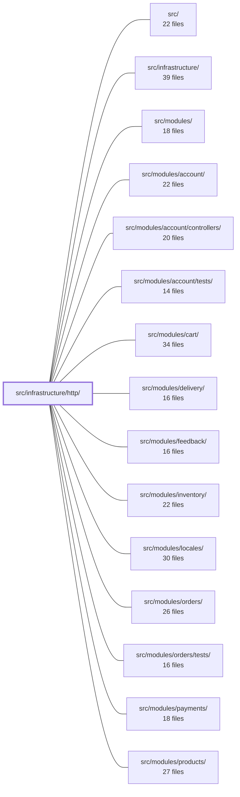

---
tags:
  - 2repo
  - 2repo/module
  - project/boilerplate-node-backend
type: module
module: src/infrastructure/http/
files: 14
updated: 2026-08-25T11:18:57.286570+00:00
---

# src/infrastructure/http/

## Purpose

This module is the shared HTTP-layer infrastructure: it defines the response envelope, input-reading rules, error vocabulary, validation scaffolding, and the set of Express middlewares that every controller in the codebase composes. It exists so the 72 feature controllers (spread across `src/modules/*`) share identical behaviour for validation, error mapping, caching, rate-limiting, locale negotiation, and request logging without duplicating that logic per endpoint.

## Key parts

- **Controller scaffolding**
  - `controller.ts` – composable helpers that express the five-step pattern (validate → call service → branch → catch) without a `defineController()` wrapper, preserving type inference and stack traces.
  - `delete-controller.ts` – `createDeleteController` factory that produces a complete `DELETE /x` and `DELETE /x/:id/hard` handler from a single parameterised implementation.

- **Request / response contract**
  - `request.ts` – `readInput` entry point that resolves a value from route params, query, JSON body, or multipart form-data using a single precedence rule.
  - `response.ts` – the `ResponseSuccess<T>` / `ResponseReject` discriminated union and the helpers that build and send each variant.
  - `schemas.ts` – shared Zod schemas for contract scalars (pagination, hard-delete flag) used by more than one endpoint.
  - `uploads.ts` – normalises multer's output (`.single`, `.array`, `.fields`) into one shape controllers can read uniformly.
  - `validation-messages.ts` – global Zod `customError` map so every 422 is emitted in the caller's language regardless of schema origin.

- **Error vocabulary**
  - `errors.ts` – `ExtendedError` and `databaseErrorInterpreter`; the single path through which driver/driver-level failures become client-safe status codes and messages.

- **Middlewares** (`middlewares/`)
  - `cache.ts` – `setCache` response-caching middleware, JSON envelope, dev TTL clamp, per-entry byte limit.
  - `locale.ts` – negotiates the request language and binds the translation context to async-local storage.
  - `rate-limit-store.ts` – Redis-backed counter store (with `MemoryStore` fallback) so all worker processes share one budget.
  - `request-logger.ts` – structured access-log entry per request with severity derived from status code.
  - `route-flag.ts` – middleware factory that maps a literal path segment (e.g. `/hard`) into a param `readInput` can consume.
  - `security.ts` – global and credential-specific rate limiting; bearer-token auth for the Prometheus scrape endpoint.

## How it connects

- **`src/modules/*` (account, cart, delivery, feedback, inventory, locales, orders, payments, products, users, wishlist)** – Every feature controller imports the helpers, envelope, error classes, schemas, and middleware from this module. This module is their shared HTTP contract; the modules supply business logic, this module supplies transport mechanics.
- **`src/infrastructure/`** – Sibling infrastructure adapters (Redis, storage, database) are consumed *by* the middlewares here (e.g. `cache.ts` talks to the Redis adapter; `uploads.ts` hands normalised paths to the storage adapters) but the HTTP-specific policies stay in this module.
- **`tests/`** – `tests/unit/infrastructure/` exercises the envelope shape, `readInput` precedence, and error-mapping rules; `tests/cross-cutting/` verifies that middleware ordering (locale → security → cache) holds across feature routes.

## Where to start

1. **`response.ts`** – Read the `ResponseSuccess` / `ResponseReject` union first; every controller's return type and every client-side branch flows from this contract, so understanding it unlocks the rest.
2. **`controller.ts`** – The five-step helpers are the structural skeleton of every endpoint. Once you see how validate → call → branch → catch is expressed, the 72 controllers reduce to small configuration blocks around these primitives.

## Connected modules

[[boilerplate-node-backend_src|src/]] · [[boilerplate-node-backend_src_infrastructure|src/infrastructure/]] · [[boilerplate-node-backend_src_modules|src/modules/]] · [[boilerplate-node-backend_src_modules_account|src/modules/account/]] · [[boilerplate-node-backend_src_modules_account_controllers|src/modules/account/controllers/]] · [[boilerplate-node-backend_src_modules_account_tests|src/modules/account/tests/]] · [[boilerplate-node-backend_src_modules_cart|src/modules/cart/]] · [[boilerplate-node-backend_src_modules_delivery|src/modules/delivery/]] · [[boilerplate-node-backend_src_modules_feedback|src/modules/feedback/]] · [[boilerplate-node-backend_src_modules_inventory|src/modules/inventory/]] · [[boilerplate-node-backend_src_modules_locales|src/modules/locales/]] · [[boilerplate-node-backend_src_modules_orders|src/modules/orders/]] · [[boilerplate-node-backend_src_modules_orders_tests|src/modules/orders/tests/]] · [[boilerplate-node-backend_src_modules_payments|src/modules/payments/]] · [[boilerplate-node-backend_src_modules_products|src/modules/products/]] · … and 6 more

## Files
- `src/infrastructure/http/controller.ts` — Extracts the repeated boilerplate of the five-step controller pattern (validate → call service → branch → catch) into small composable helpers. Exists so the 72 controllers in the codebase share identical validation, rejection, and error-catch logic without needing a `defineController()` wrapper that would break type inference, obscure stack traces, and defeat the `controller-chain-must-catch` ESLint rule.
- `src/infrastructure/http/delete-controller.ts` — A single factory (`createDeleteController`) that produces a complete `DELETE /x` / `DELETE /x/:id/hard` Express handler for any entity. It exists to collapse three byte-identical controllers (orders, products, users) into one parameterised implementation, so a fix to the ObjectId→404 mapping or the `hardDelete` flag logic lands in exactly one place.
- `src/infrastructure/http/errors.ts` — Defines the HTTP-layer error vocabulary and the single interpretation path for database/driver failures. It exists so that controllers and services never guess a status code or leak a driver message to the client — every failure is either an `ExtendedError` (thrown, caught by central middleware) or routed through `databaseErrorInterpreter` (returned as a reject envelope).
- `src/infrastructure/http/middlewares/cache.ts` — Implements the Express response-caching middleware (`setCache`) and its supporting policies: the JSON envelope that wraps a status code and body, a development TTL clamp, and a per-entry byte limit. These concerns live here—rather than in the Redis adapter—because they are specific to caching *HTTP responses*; a non-HTTP consumer of the same adapter inherits none of them.
- `src/infrastructure/http/middlewares/locale.ts` — Express middleware that negotiates the incoming request's language and binds the resulting translation context to both the request object and async-local storage, so that every downstream handler, service, and validator can resolve localized copy without explicit passing. Mounted before routes; every handler that emits user-facing text must run after it.
- `src/infrastructure/http/middlewares/rate-limit-store.ts` — Provides the counter store that `express-rate-limit` middleware uses to track per-client budgets. Without it, each forked worker would hold an independent in-process `Map`, multiplying the effective rate limit by the worker count. This file gives all workers (and all instances) a single Redis-backed budget, while falling back to a per-process `MemoryStore` when Redis is not configured.
- `src/infrastructure/http/middlewares/request-logger.ts` — Express middleware that emits a single structured access-log entry per HTTP request. It measures sub-millisecond duration with `process.hrtime.bigint()` and assigns log severity based on the response status code (4xx → WARN, 5xx → ERROR), ensuring caller-fault and server-fault responses are not conflated.
- `src/infrastructure/http/middlewares/route-flag.ts` — A tiny Express middleware factory that lets a controller read a boolean-like flag from a literal path segment (e.g. `DELETE /products/:id/hard`) as though it were a normal route param. This unifies "flag in the path" and "flag in the query string" into a single input source that `readInput` can consume, so a controller declares the flag once regardless of how the client spelled it.
- `src/infrastructure/http/middlewares/security.ts` — Central module for HTTP-level security middleware: global and credential-specific rate limiting, and bearer-token authentication for the Prometheus scrape endpoint. It isolates all "who is allowed to hit this endpoint, and how often" logic so that route files stay focused on business behavior.
- `src/infrastructure/http/request.ts` — Centralises the rules for reading an endpoint's input from whichever of route params, query string, JSON body, or multipart form-data the value actually arrived on. Provides a single `readInput` entry point so controllers do not re-derive source-precedence and string-decoding logic per call site, and so the polymorphism contract (documented in `docs/theory/request-input.md`) lives in one auditable place.
- `src/infrastructure/http/response.ts` — Defines the single response envelope every HTTP endpoint returns — a discriminated union of `ResponseSuccess<T>` and `ResponseReject` — plus the helper functions that build and send each variant. It exists so clients (including the orval-generated API client) can branch on `success` without knowing the route, and so no handler can accidentally emit a non-conforming shape.
- `src/infrastructure/http/schemas.ts` — Defines shared Zod validation schemas for the handful of contract scalars (pagination, hard-delete flag) that more than one HTTP endpoint accepts. By declaring bounds and semantics once in infrastructure, it prevents per-controller drift—e.g. one endpoint 422-ing `?pageSize=500` while another silently clamped the same request.
- `src/infrastructure/http/uploads.ts` — Read-side upload helpers. This module normalizes what multer placed on the Express request into a uniform shape so controllers never need to know which multer variant (`.single()`, `.array()`, `.fields()`) a route used. The write side—file naming, storage destination—lives in the storage adapters; this file only extracts and path-fixes the results.
- `src/infrastructure/http/validation-messages.ts` — Installs a global Zod `customError` map so that every validation failure (422) is returned in the caller's language via i18n, regardless of whether the schema was generated (`@api/schemas.zod`, which carries no per-field messages) or hand-written (which uses `t(...)` per field). Without it, the language a client sees depends on which endpoint they hit.

---
[[boilerplate-node-backend_INDEX|← boilerplate-node-backend index]]
