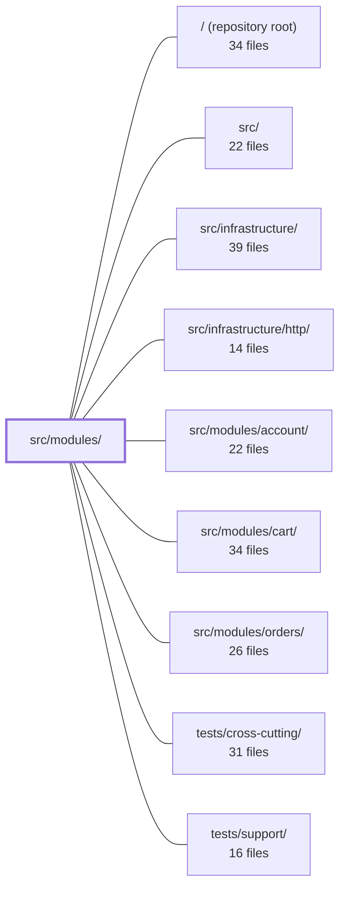

---
tags:
  - 2repo
  - 2repo/module
  - project/boilerplate-node-backend
type: module
module: src/modules/
files: 18
updated: 2026-08-25T11:19:11.282190+00:00
---

# src/modules/

## Purpose

`src/modules/` holds the application's domain modules—each one owns a bounded set of business logic, a data model, and (where applicable) HTTP routes. It currently contains two modules: **audit-logs**, which provides the persistent, queryable store and domain service for audit entries, and **observability**, which exposes the operator-facing read surface (health, metrics overview, SSE stream, Prometheus scrape, and the audit-log viewer). Modules here are intentionally decoupled: each exposes a narrow public barrel (or none at all) so siblings cannot reach into internals.

## Key parts

- **`audit-logs/`** — The full audit-persistence stack.
  - `index.ts` is the sole import surface for sibling modules; `model.ts`, `repository.ts`, `service.ts`, and `metrics.ts` implement the schema, append-only store, fail-open/fail-closed service contract, and Prometheus failure counter respectively. `module.ts` is the one-line install step that hooks the write sink into the global observability emitter at import time.
  - `tests/unit/` covers repository behaviour, service error contracts, and TTL-index retention.

- **`observability/`** — The operator-facing HTTP module (mounted at `/observability`).
  - `module.ts` declares the router and route→controller wiring; `routes.ts` assigns per-route auth middleware.
  - `controllers/` contains the three JSON handlers (health, metrics overview, audit) and the SSE/Prometheus endpoints.
  - `openapi.yaml` and `asyncapi.yaml` are the module-level API contracts, independently lintable and mergeable by the root bundler.
  - `tests/contract/` guards response-shape drift; `tests/unit/` pins the name-based metric-resolution pattern.

## How it connects

- **`src/infrastructure/`** — The audit-logs write sink is installed into the global observability emitter that lives in infrastructure. The metrics-overview controller reads counters *produced* by infrastructure without importing the domain modules that emit them.
- **`src/infrastructure/http/`** — Provides the Express app and middleware utilities that `observability/routes.ts` and the controllers build on.
- **`src/modules/account/`, `cart/`, `orders/`** — Their Prometheus counters appear in the metrics-overview response. The controller resolves them by metric name so that these modules can be absent from a build without a compile error.
- **`tests/cross-cutting/` / `tests/support/`** — Shared test helpers and fixtures consumed by the unit and contract tests in both sub-modules.
- **Repository root** — The barrel convention (`index.ts` as the only allowed import path) and the absence of one in `observability` are structural boundary rules enforced at the root level.

## Where to start

1. **`src/modules/audit-logs/index.ts`** — Ten lines or fewer; it shows the barrel convention and the single thing external code is allowed to import, which immediately clarifies the module-boundary rule.
2. **`src/modules/observability/module.ts`** — Shows how routes are declared, which controllers are mounted, and the deliberate "generic, no domain, no barrel" constraint. Reading it alongside `routes.ts` gives a complete picture of the HTTP surface in a few minutes.

## Connected modules

[[boilerplate-node-backend_ROOT|/ (repository root)]] · [[boilerplate-node-backend_src|src/]] · [[boilerplate-node-backend_src_infrastructure|src/infrastructure/]] · [[boilerplate-node-backend_src_infrastructure_http|src/infrastructure/http/]] · [[boilerplate-node-backend_src_modules_account|src/modules/account/]] · [[boilerplate-node-backend_src_modules_cart|src/modules/cart/]] · [[boilerplate-node-backend_src_modules_orders|src/modules/orders/]] · [[boilerplate-node-backend_tests_cross-cutting|tests/cross-cutting/]] · [[boilerplate-node-backend_tests_support|tests/support/]]

## Files
- `src/modules/audit-logs/index.ts` — Public barrel for the `audit-logs` module. It is the **only** import surface allowed for sibling modules (same convention as `modules/products/index.ts`). The module owns the audit-log collection but no HTTP route; the write sink is wired in `app.ts` and the read endpoint is served by the `observability` module. This file simply re-exports the single thing external consumers need.
- `src/modules/audit-logs/metrics.ts` — Declares the domain-owned Prometheus counters for the audit-logs module. It exposes a single metric — `audit_sink_failures_total` — that makes silently swallowed persistence failures visible on the existing observability dashboard without introducing alerting, retry, or any change to the fail-open sink contract.
- `src/modules/audit-logs/model.ts` — Defines the Mongoose schema, indexes, serialization transform, and compiled model for the persisted audit-log collection. It provides the queryable copy of audit entries that lets `GET /observability/audit` answer "what has actor X done" from the API without a log backend. It replaced a 200-entry in-process ring buffer that was per-worker, non-durable, and too small for multi-actor queries.
- `src/modules/audit-logs/module.ts` — Headless module that wires the audit-log service into the global observability sink at import time. It exists solely so that deleting this one file disables audit persistence while the rest of the app continues to build and run. No routes, no domain logic—just the install step for the `record` sink.
- `src/modules/audit-logs/repository.ts` — Append-only persistence layer for audit log entries. It wraps `createBaseRepository` to expose exactly two operations—`create` (append) and `search` (filtered page read)—and deliberately omits `save`/`deleteOne` so the type system itself rejects edits. Expiry is handled by a Mongo TTL index on the model, not by application code.
- `src/modules/audit-logs/service.ts` — The audit-logs domain service. It exposes two operations: `record`, the fire-and-forget write path that persists emitted audit entries into the queryable collection, and `search`, the filtered paginated read path used by the observability dashboard. It sits between the high-level audit emitter (`@infrastructure/observability/audit`) and the raw repository, applying collection-specific policies (sort order, time scoping) without baking them into the repository.
- `src/modules/audit-logs/tests/unit/repository.test.ts` — Unit tests for `auditLogRepository` (create, search, deep-paging). They verify that the audit-log store accepts well-formed entries, enforces required fields, returns correctly filtered and sorted pages, and that pagination counts reflect the true total rather than a capped read.
- `src/modules/audit-logs/tests/unit/retention.test.ts` — Unit test that verifies the TTL index on the audit-log collection is declared with the correct `expireAfterSeconds` value—both the 90-day default and a custom value from `NODE_AUDIT_RETENTION_DAYS`. Because the env var is read once at module-import time, the test must re-execute the import to observe a different value.
- `src/modules/audit-logs/tests/unit/service.test.ts` — Unit tests for `auditLogService` that verify its asymmetric error contract: `record` must be fail-open (swallow write errors into a warning log and a failure counter, never throw, never produce an unhandled rejection) and `search` must be fail-closed (propagate read errors to the caller). The repository and logger are mocked so the tests isolate the service's error-handling logic from any real data store.
- `src/modules/observability/asyncapi.yaml` — A self-contained AsyncAPI 2.6.0 slice that declares the observability module's SSE server, its three channels (snapshot, periodic update, heartbeat), and the shared `ObservabilityMetricsPayload` schema. It exists as a module-level fragment so a bundler can merge it into the repo-root contract while remaining independently lintable, openable in AsyncAPI Studio, and readable in isolation.
- `src/modules/observability/controllers/get-observability-audit.ts` — Handler for `GET /observability/audit`. Returns a single page of audit events, filtered by actor, action, outcome, and a `since` timestamp. It validates pagination and the `outcome` enum inline, then delegates the query to the audit-logs service.
- `src/modules/observability/controllers/get-observability-health.ts` — Express handler for `GET /observability/health`. Serves the **readiness** answer: can this instance serve its promises, and if not, which specific part is missing. Deliberately separate from the liveness endpoint (`GET /`), because an orchestrator restarting on liveness failure would not recover a downed backing service.
- `src/modules/observability/controllers/get-observability-metrics-overview.ts` — Express route handler for `GET /observability/metrics/overview`. Aggregates HTTP, auth, business, and process metrics into a single structured JSON response so a dashboard can poll one endpoint instead of many. It is deliberately written to remain compilable even when the domain modules it reports on (auth, cart, orders, inventory) are absent from the build.
- `src/modules/observability/module.ts` — Declares the `observability` app module: the operator-facing surface (health check, metrics overview, live SSE stream, Prometheus scrape endpoint, and audit-trail view). It owns URLs and routing, not data — all measurements are produced by `infrastructure/observability`. The module is intentionally "generic" (no business domain) and has no barrel `index.ts` so boundary lint structurally prevents sibling modules from importing it.
- `src/modules/observability/openapi.yaml` — OpenAPI 3.0.3 module contract for the observability service. Defines five read-only endpoints (SSE event stream, readiness health check, Prometheus text metrics, JSON metrics summary, and paginated audit logs) along with their response schemas. Serves as the source-of-truth API spec consumed by dashboards, Prometheus scrapers, and the admin UI.
- `src/modules/observability/routes.ts` — Defines the Express router for all observability HTTP endpoints (mounted at `/observability`). It wires each route to the appropriate controller or streaming handler and, critically, selects the correct authentication middleware per route based on what the caller can technically send (browser cookie, static credential, or JWT).
- `src/modules/observability/tests/contract/api.contract.test.ts` — Contract (shape + error) tests for the three JSON endpoints under `/observability` — health, metrics overview, and audit log. The file exists because these endpoints build their response bodies field-by-field in a controller rather than through a shared serializer, making them prone to silent spec drift. `toSatisfyApiSpec` is the primary assertion in every case; a few value-level checks pin behavior the shape alone cannot prove (real DB connection state, zeroed counters for absent modules, audit filter correctness).
- `src/modules/observability/tests/unit/metrics-overview.test.ts` — Unit tests verifying that the `GET /observability/metrics/overview` controller returns real counter values resolved by metric name from the shared Prometheus registry. The tests exist to guard the name-based indirection pattern: because the controller deliberately avoids importing domain modules, a renamed or unregistered metric silently degrades to zero. This suite is the only coverage that would catch that failure.

---
[[boilerplate-node-backend_INDEX|← boilerplate-node-backend index]]
