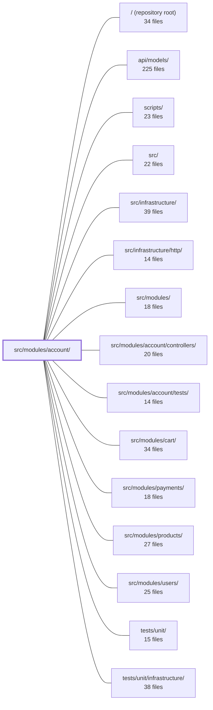

---
tags:
  - 2repo
  - 2repo/module
  - project/boilerplate-node-backend
type: module
module: src/modules/account/
files: 22
updated: 2026-08-25T11:19:28.448638+00:00
---

# src/modules/account/

## Purpose

The account module is the authentication and account-lifecycle service for the application. It owns signup, login, token issuance/verification, password reset, session management, profile self-service, two-step account deletion, and the per-user address book. It is mounted at `/account` as its own Express router, kept separate from the `users` module because each module manifest carries a single `basePath`.

## Key parts

- **Module bootstrap & routing** — `module.ts` registers the module, installs the kernel auth resolver, and wires the `USER_DELETED` cleanup subscription. `routes.ts` mounts all endpoints under the shared prefix and applies cross-cutting middleware (auth population, rate limiting, cache invalidation). `index.ts` is the only public import surface for sibling modules, exposing one function and one type.
- **Service layer** (`services/`) — `authentication.ts` handles the write paths for signup/login and token add/remove-all. `profile.ts` covers self-service field updates and password changes. `addresses.ts` owns address-book CRUD and the checkout-address lookup. `verification.ts` is the single entry point for issuing verification tokens and queuing the email. `token-cleanup.ts` exposes one function for bulk expired-token removal. `index.ts` aggregates all five into a single `accountService` namespace.
- **Session internals** (`session/`) — `config.ts` centralises token TTLs and secrets read from environment variables. `jwt.ts` handles all signing, verification, and the one DB interaction refresh tokens require (revocation lookup + `lastUsedAt` stamping). `cookies.ts` creates/destroys the `jwt` and `isAuth` cookies.
- **Data layer** — `model.ts` defines the Mongoose schema for the address book (one document per user, array of individually-IDed entries). `repository.ts` provides read-modify-write access with optimistic versioning. `factory.ts` builds deterministic fixtures for seeds and tests. `demo.ts` supplies the address-book slice of the demo dataset so checkout has a default address.
- **Observability registration** — `analytics.ts` declares the analytics event vocabulary, `audit.ts` defines the closed set of audit-action strings, and `metrics.ts` defines Prometheus counters. All three register into shared infrastructure ports via TypeScript module augmentation, keeping the domain free of import cycles.
- **Outbound communication** — `emails.ts` builds fully-resolved `EmailContent` objects (template, subject, render context) per locale so the downstream email worker needs no request-scoped state.
- **API contract** — `openapi.yaml` declares every endpoint under `/account` for clients and code generators. `probes.ts` defines negative-path probe requests (401/403/409/429) that the OpenAPI spec cannot express.

## How it connects

- **`src/modules/users/`** — Sibling module on a distinct mount path (`/users`). Account exposes its public surface through `index.ts` so `users` (and other modules) can call account logic without reaching into internals. The `USER_DELETED` subscription in `module.ts` couples the two for cleanup.
- **`src/modules/cart/`** — Checkout depends on the address book: `demo.ts` explicitly seeds addresses so "checkout has no address to select" never occurs, and `services/addresses.ts` exposes the checkout-address lookup that cart calls.
- **`src/infrastructure/`** — The observability triple (`analytics.ts`, `audit.ts`, `metrics.ts`) registers into shared ports owned by infrastructure, and `routes.ts` pulls Express middleware and HTTP helpers from `src/infrastructure/http/`.
- **`src/modules/account/controllers/`** — The controller layer that sits between `routes.ts` and the service layer; each route in `routes.ts` delegates to a controller which in turn calls into `services/`.
- **`scripts/`** — `factory.ts` is consumed by `scripts/export-seed.ts` to produce stable, deterministic seed output with pinned `_id` values.
- **`api/models/`** — Shared wire-contract types (e.g., the `Address` shape referenced by `factory.ts`) live here; the account module imports them rather than redefining them.
- **`tests/unit/` & `src/modules/account/tests/`** — Unit and integration tests exercise the service and controller layers described above.

## Where to start

1. **`module.ts`** — Read this first to understand what the module registers at import time (auth resolver, address-book collection, `USER_DELETED` subscription) and how it fits into the kernel's module system.
2. **`services/index.ts`** — This single barrel shows the full public surface of the service layer in one file, making it easy to see which sub-file owns which concern before diving into any individual service.

## Connected modules

[[boilerplate-node-backend_ROOT|/ (repository root)]] · [[boilerplate-node-backend_api_models|api/models/]] · [[boilerplate-node-backend_scripts|scripts/]] · [[boilerplate-node-backend_src|src/]] · [[boilerplate-node-backend_src_infrastructure|src/infrastructure/]] · [[boilerplate-node-backend_src_infrastructure_http|src/infrastructure/http/]] · [[boilerplate-node-backend_src_modules|src/modules/]] · [[boilerplate-node-backend_src_modules_account_controllers|src/modules/account/controllers/]] · [[boilerplate-node-backend_src_modules_account_tests|src/modules/account/tests/]] · [[boilerplate-node-backend_src_modules_cart|src/modules/cart/]] · [[boilerplate-node-backend_src_modules_payments|src/modules/payments/]] · [[boilerplate-node-backend_src_modules_products|src/modules/products/]] · [[boilerplate-node-backend_src_modules_users|src/modules/users/]] · [[boilerplate-node-backend_tests_unit|tests/unit/]] · [[boilerplate-node-backend_tests_unit_infrastructure|tests/unit/infrastructure/]]

## Files
- `src/modules/account/analytics.ts` — Declares the analytics event names owned by the account domain and registers them in the shared analytics port via TypeScript module augmentation. This keeps the event catalogue local to the owning module (same pattern as `./audit.ts`) so `infrastructure/observability` remains domain-agnostic.
- `src/modules/account/audit.ts` — Defines the closed set of audit-action strings the account domain emits and registers them in the shared `AuditActionMap` type via a type-only module augmentation. This lets the `@infrastructure/observability/audit` package know the full vocabulary without importing anything from the account module.
- `src/modules/account/demo.ts` — Provides the address-book slice of the demo dataset. It defines fixture address books for the seeded admin and regular user, a seed function that upserts them by owner, and an export function that reads the stored rows back. Without this module the seeder silently skips the collection, leaving checkout with no address to select.
- `src/modules/account/emails.ts` — Centralized email-content builders for the account module. Each exported function takes a locale (the recipient's language) and returns a fully-resolved `EmailContent` object — template name, subject, and complete render context — so that the downstream email worker can render the HTML without any request-scoped i18n store, `Accept-Language` header, or configuration access.
- `src/modules/account/factory.ts` — Factory that builds address-book fixtures for test and seed data. It pins `_id` values (both the book's and each entry's) so that `scripts/export-seed.ts` produces stable, deterministic output across runs, and it converts the wire-contract `Address` shape into the internal `AddressItem` subdocument shape expected by the repository.
- `src/modules/account/index.ts` — Public barrel for the `account` module — the **only** import surface a sibling module may use. It intentionally exposes a single function and one type, keeping the module's internal token/session logic and address CRUD entirely private.
- `src/modules/account/metrics.ts` — Defines the set of Prometheus counters the account (auth) domain owns. Each counter tracks a single user-facing or maintenance event, labelled by outcome so it serves as both a volume and a success-ratio signal for alerting. The counters are registered on the shared infrastructure registry so they appear in the same `/metrics` scrape as HTTP metrics, without the domain importing any read logic.
- `src/modules/account/model.ts` — Defines the Mongoose schema and registered model for the user **address book** — one document per user holding an array of individually addressable entries. It exists so that `account` owns its own collection (one small read/write per address edit, no cross-user leakage) and so each entry is identified by its own `_id` rather than by position in an array.
- `src/modules/account/module.ts` — Defines and registers the **account** module — the authentication and account-lifecycle service (signup, login, refresh, password reset, logout, two-step deletion). It installs the kernel's auth resolver at import time, owns the address-book collection, and wires the `USER_DELETED` cleanup subscription. It exists as a separate module from `users` because each manifest carries one `basePath`, and `/account` and `/users` are distinct mounts.
- `src/modules/account/openapi.yaml` — OpenAPI 3.0.3 contract for the **account** module (v2.0.0). It declares every endpoint under the `/account` namespace—profile CRUD, password change, session management, and the address book—so that clients, code generators, and other module specs can agree on request/response shapes without reading server code.
- `src/modules/account/probes.ts` — Defines a set of negative-path probe requests (401, 403, 409, 429) that an OpenAPI contract cannot express because they require specific pre-existing state or middleware behavior. These probes are appended to every generated client collection so that consumers can verify the API rejects invalid input with the correct status and error envelope.
- `src/modules/account/repository.ts` — Repository for a per-user address book (an array of address items inside a single Mongoose document). It deliberately uses a read-modify-write pattern via `book.save()` rather than atomic MongoDB operators, because the "exactly one default" invariant spans the whole array and cannot be expressed as a single `$set`/`$pull`. Concurrency is handled by Mongoose's optimistic versioning on save.
- `src/modules/account/routes.ts` — Express router that mounts all account and authentication endpoints (login, signup, password reset, session management, address book, account deletion) under a shared prefix. It wires each route to its controller and applies cross-cutting middlewares (auth population, cache invalidation, rate limiting, file upload) at the router level so individual controllers stay focused on business logic.
- `src/modules/account/services/addresses.ts` — Service layer for the user's address book. Owns the CRUD endpoints and the checkout-address lookup. It is one slice of the account module's single service object (not a standalone service), keeping the module's two collections (account + addresses) behind one namespace.
- `src/modules/account/services/authentication.ts` — Handles the two write paths for user authentication (signup, login) and the two token lifecycle operations (add, remove-all). It deliberately excludes anything about credential *value*: hashing lives in the model's pre-save hook, JWT signing lives in `../session/jwt`, and password changes live in `./profile`.
- `src/modules/account/services/index.ts` — Barrel/re-export file for the account service folder. It aggregates the public surface of five sub-files (`authentication`, `profile`, `addresses`, `verification`, `token-cleanup`) into a single `accountService` namespace and selectively re-exports individual functions by name for callers that import them directly. It exists so that controllers and tests have one stable import point regardless of which sub-file a function lives in.
- `src/modules/account/services/profile.ts` — Self-service account maintenance: updating the caller's own profile fields (email, username, locale, image) and changing the password. Split from `./authentication` along the line between *proving* an identity (login/signup) and *maintaining* one. The password lives here because every write-flow (reset-confirm, logged-in change) is a mutation of an existing account, not a way into it.
- `src/modules/account/services/token-cleanup.ts` — Provides a single entry point (`runTokenCleanup`) that triggers one cycle of expired-token removal across all user documents. It exists so that a scheduled job or manual invocation can clear stale tokens without needing to know the storage-layer API directly.
- `src/modules/account/services/verification.ts` — Single entry point for issuing an email-verification token and queuing the verification email. Three controller flows (signup, email-address change, verify-request re-send) all call this one function so their behaviour cannot drift.
- `src/modules/account/session/config.ts` — Centralises token-lifetime and secret configuration by reading environment variables into typed, reusable helpers. It is deliberately named `config.ts` (not `tokens.ts`) to signal that it **reads** expiry settings and secrets but never issues or stores a token itself. Every consumer that needs "how long does this tier live" or "what is the signing secret" pulls from here rather than parsing `process.env` independently.
- `src/modules/account/session/cookies.ts` — A focused HTTP cookie utility that creates and destroys the two cookies used for session management (`jwt` and `isAuth`). It is deliberately isolated from JWT token generation/verification logic so that cookie concerns (flags, expiry, path) live in exactly one place.
- `src/modules/account/session/jwt.ts` — Owns all JWT issuance and verification for the account domain: minting refresh tokens, exchanging them for access tokens, and verifying either type. Policy (secrets, TTLs, expiry tiers) lives in `./config`; this file is purely the signing/verification mechanics plus the one DB interaction refresh tokens require (revocation lookup and `lastUsedAt` stamping).

---
[[boilerplate-node-backend_INDEX|← boilerplate-node-backend index]]
