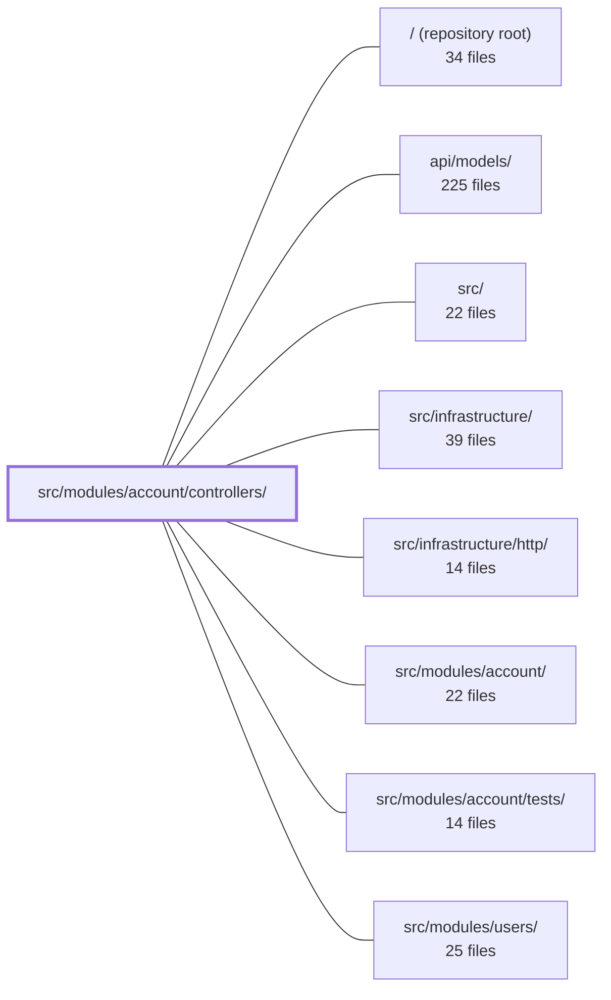

---
tags:
  - 2repo
  - 2repo/module
  - project/boilerplate-node-backend
type: module
module: src/modules/account/controllers/
files: 20
updated: 2026-08-25T11:19:40.886599+00:00
---

# src/modules/account/controllers/

## Purpose

The HTTP controller layer for the account module. Each file is a single Express handler (or a tightly paired set) that translates an inbound request into a service call and shapes the response. The controllers own validation, authentication checks, cookie management, observability side-effects (metrics, audit, analytics), and localized messaging, while delegating actual data mutations to the account service layer.

## Key parts

- **Authentication & sessions** — `post-login`, `post-logout`, `post-logout-everywhere`, `get-refresh-token`, `get-sessions`, `delete-session`, `delete-expired-tokens`. Together they cover the full token lifecycle: issuing access/refresh pairs, revoking a single or all sessions, and periodic stale-token cleanup.
- **Account lifecycle** — `post-signup` (registration with optional avatar upload), `delete-account-request` / `delete-account-confirm` (two-step hard-delete gated by a one-time token).
- **Credentials & verification** — `post-password-change`, `post-reset-request` / `post-reset-confirm`, `post-verify-request` / `post-verify-confirm`. The request/confirm pairs follow a shared "generate one-time token → email → consume token" pattern; the confirm handlers are deliberately unauthenticated (the token is the credential).
- **Profile** — `get-account` (full profile read that fills in fields absent from the JWT) and `put-account` (self-service field update that bypasses the admin-gated `/users` write path).
- **Address book** — `get-addresses` (read), `write-addresses` (POST + PUT, co-located because they share the same Zod-validate → service-call → branch shape), `delete-address`.

## How it connects

- **`src/modules/account/`** (parent) — Every controller delegates its business logic (credential hashing, token generation, address CRUD) to the account service exported by this parent module. Controllers never touch the data store directly.
- **`src/infrastructure/`** — Controllers emit observability signals (Prometheus counters, audit events, analytics) and enqueue outbound emails (verification, reset, deletion) through infrastructure utilities.
- **`src/infrastructure/http/`** — Provides the Express app/router wiring, cookie helpers, and error-handling middleware that these handlers plug into.
- **`api/models/`** — The wire-format types (`User`, `Session`, address shapes) that controllers serialize into responses and validate in requests.
- **`src/modules/users/`** — Referenced indirectly: `put-account` exists specifically because the `/users` write endpoints are admin-gated; this module provides the self-service alternative for regular users.
- **`src/modules/account/tests/`** — Integration and unit tests that exercise each controller's handler in isolation.

## Where to start

1. **`post-login.ts`** — The shortest "full" flow: body validation → service call → dual-token issuance → metrics/audit/analytics. Understanding this pattern makes every other controller feel familiar.
2. **`post-signup.ts`** — The most complex orchestration (optional file upload, verification email, multiple side-effects). Reading it after login shows how the same structure scales to a longer pipeline.

## Connected modules

[[boilerplate-node-backend_ROOT|/ (repository root)]] · [[boilerplate-node-backend_api_models|api/models/]] · [[boilerplate-node-backend_src|src/]] · [[boilerplate-node-backend_src_infrastructure|src/infrastructure/]] · [[boilerplate-node-backend_src_infrastructure_http|src/infrastructure/http/]] · [[boilerplate-node-backend_src_modules_account|src/modules/account/]] · [[boilerplate-node-backend_src_modules_account_tests|src/modules/account/tests/]] · [[boilerplate-node-backend_src_modules_users|src/modules/users/]]

## Files
- `src/modules/account/controllers/delete-account-confirm.ts` — Controller handler for `DELETE /account/delete-confirm`. Validates a one-time deletion token against the user's token list (including expiration), hard-deletes the account, sends a localized "goodbye" email, records audit and analytics events, and clears session cookies.
- `src/modules/account/controllers/delete-account-request.ts` — Controller for `DELETE /account`. When an authenticated user requests account deletion, this handler creates a one-time token, queues a confirmation email (rendered in the user's own locale), emits an audit event, and returns a 200 with a localized "email sent" message.
- `src/modules/account/controllers/delete-address.ts` — Thin Express controller that handles `DELETE /account/addresses/:addressId`. It authenticates the caller, delegates the removal to `accountService.addressRemove`, and serializes the result (or a refusal) into the HTTP response. It exists to keep route-level wiring and business logic in separate layers.
- `src/modules/account/controllers/delete-expired-tokens.ts` — Express route handler for `DELETE /account/tokens/expired`. Provides an admin-only endpoint that bulk-removes all expired tokens from the database, intended for periodic cleanup of stale refresh tokens.
- `src/modules/account/controllers/delete-session.ts` — Handler for `DELETE /account/sessions/:sessionId`. Lets an authenticated caller revoke a specific refresh-token session (i.e. "log out that device"). The repository scopes the deletion to the caller's own document and `type: refresh`, so foreign or non-refresh session ids simply match nothing and yield a 404.
- `src/modules/account/controllers/get-account.ts` — Express controller for `GET /account`. Resolves the authenticated user's full profile by querying the users collection, rather than echoing the subset carried in the JWT. Exists to close the gap between the token's fields (`id`, `email`, `username`, `admin`) and the contract's `User` shape (which also includes `verified` and `locale`).
- `src/modules/account/controllers/get-addresses.ts` — GET controller for `/account/addresses`. It resolves the authenticated caller's full address book in a single service call and returns it. This same whole-book view is also the response shape of the write and delete address controllers, so a client never needs a follow-up read after mutating an entry.
- `src/modules/account/controllers/get-refresh-token.ts` — Controller for the `GET /account/refresh` endpoint. It exchanges the long-lived refresh token (carried in the `HttpOnly` `jwt` cookie) for a new short-lived access token, emitting audit events and a Prometheus counter on every attempt.
- `src/modules/account/controllers/get-sessions.ts` — Single Express handler for `GET /account/sessions`. It fetches the authenticated user's document (including credentials) and returns the list of live refresh tokens shaped as wire-format `Session` objects.
- `src/modules/account/controllers/post-login.ts` — Single-handler controller for `POST /account/login`. Authenticates a user via `accountService.login`, then issues a short-lived access token (returned in the body) and a long-lived refresh token (set as a cookie). Also emits the full observability trail (metrics, audit, analytics) for both success and failure paths.
- `src/modules/account/controllers/post-logout-everywhere.ts` — Controller handler for `POST /account/logout-all`. It invalidates **all** refresh tokens belonging to the authenticated user in the database, clears the refresh and logged-in cookies on the response, records an audit event, and returns a 200 success. It is the "log out every device" endpoint.
- `src/modules/account/controllers/post-logout.ts` — Express controller for `POST /account/logout`. It revokes the current session's refresh token and clears the associated cookies, leaving other devices' sessions untouched. The design deliberately always returns `200` so that an already-logged-out or missing-cookie request is not treated as an error.
- `src/modules/account/controllers/post-password-change.ts` — HTTP controller handler for `POST /account/password`. Changes the authenticated user's password by requiring proof of the current password (no email round-trip or token). Delegates actual credential logic to the account service and is responsible for validation, response shaping, metrics, audit events, and localized success messaging.
- `src/modules/account/controllers/post-reset-confirm.ts` — Express route handler for `POST /account/reset-confirm`. It validates a one-time password-reset token (delivered in a link inside a reset email), verifies the proposed new password, atomically consumes the token, writes the new password, sends a confirmation email, and invalidates existing session cookies.
- `src/modules/account/controllers/post-reset-request.ts` — Express controller for `POST /account/reset-request`. Validates the request body, looks up the user by email, generates a 1-hour reset token, and enqueues a localized reset email. The entire flow is designed so that the public response (always `200` + a fixed "email sent" message) is identical whether the email exists or not, preventing account enumeration.
- `src/modules/account/controllers/post-signup.ts` — Controller handler for `POST /account/signup`. Orchestrates the full sign-up flow: body extraction, optional image-upload resolution, delegation to `accountService.signup`, and post-outcome side-effects (metrics, audit, analytics, verification email). It is the single HTTP-facing entry point for account registration.
- `src/modules/account/controllers/post-verify-confirm.ts` — Handles `POST /account/verify-confirm`: the final step where a user follows a link in a verification email and the server spends a one-time token to mark the account's email as verified. The endpoint is deliberately unauthenticated — the token in the body is the credential, matching the pattern used by `reset-confirm` and `delete-confirm`.
- `src/modules/account/controllers/post-verify-request.ts` — Handler for `POST /account/verify-request`. Re-sends the email-verification link to the authenticated user's own address when the original signup email never arrived. It exists separately from the reset flow because the caller is already authenticated, so there is no enumeration surface to blur — an already-verified account receives an explicit `409` rather than a misleading `200`.
- `src/modules/account/controllers/put-account.ts` — Route handler for `PUT /account`. Lets an authenticated user update their **own** profile fields (email, username, locale, avatar image). It exists because the `/users` write endpoints are admin-gated; this self-service path was added so regular users can edit their own account without hitting a 403.
- `src/modules/account/controllers/write-addresses.ts` — Handles the two body-parsing write operations for the account address book: adding an address (`POST /account/addresses`) and editing one (`PUT /account/addresses/:addressId`). Both follow the same three-step shape — validate the body against a Zod schema, call the service, branch on `result.success` — and are co-located so that a change to that shared shape has a single place to land. Read and delete handlers live in separate files because they do not parse a body.

---
[[boilerplate-node-backend_INDEX|← boilerplate-node-backend index]]
