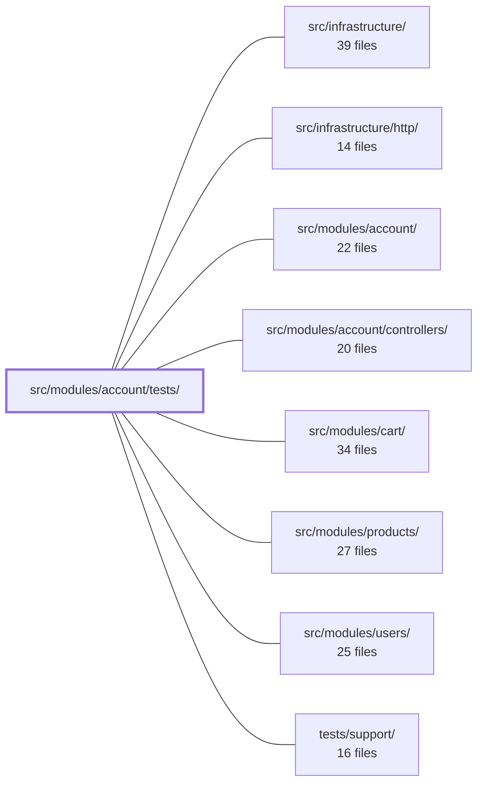

---
tags:
  - 2repo
  - 2repo/module
  - project/boilerplate-node-backend
type: module
module: src/modules/account/tests/
files: 14
updated: 2026-08-25T11:19:54.050945+00:00
---

# src/modules/account/tests/

## Purpose

Test suite for the `src/modules/account/` module. It covers the full breadth of the account domain—authentication (JWT, cookies, tokens), self-service operations (profile, password, sessions, email), address book, account deletion, audit constants, and the module's public export boundary—across unit, integration-flavored, and stateful contract-test levels.

## Key parts

- **Contract tests** — `contract/api.contract.test.ts`: scenario-level tests for the `/account` HTTP surface (profile update, password change, session revocation, email verification, cookie-tier sizing) that require stateful setup a generated request sweep can't provide.
- **Auth & session unit tests** — `unit/jwt.test.ts`, `unit/cookies.test.ts`, `unit/tokens.test.ts`, `unit/token-cleanup.test.ts`, `unit/token-cleanup-job.test.ts`: pin the security-critical contracts of token creation/verification, cookie flags, env-var-driven token config, and the scheduled cleanup job's log-output contract.
- **Service-level unit tests** — `unit/service.test.ts` (security invariants: indistinguishable failures, hashing, soft-delete), `unit/service-flows.test.ts` (happy-path and rejection flows against a real test DB), `unit/self-service.test.ts` (profile/password/session/email at the service/repository layer).
- **Feature-specific unit tests** — `unit/addresses.test.ts` (address-book invariants and checkout resolver), `unit/audit.test.ts` (wire-contract string values), `unit/persisted-locale.test.ts` (locale lifecycle across signup and user document), `unit/delete-account.test.ts` (deletion controllers, enumeration prevention, side-effect calls).
- **Module-boundary guard** — `unit/auth-surface.test.ts`: verifies the barrel re-exports exactly one function by identity and that no file outside `src/modules/account/` imports internal sub-paths.

## How it connects

- **`src/modules/account/`** — the module under test; every file here exercises its services, session utilities, controllers, and public barrel.
- **`src/modules/account/controllers/`** — `service-flows.test.ts`, `self-service.test.ts`, and `token-cleanup.test.ts` invoke controllers directly to verify orchestration (cleanup-before-work, token validation, response shape).
- **`src/modules/users/`** — `persisted-locale.test.ts` spans the account signup route and the users entity, asserting locale capture, editability, and serialization across both modules.
- **`src/modules/cart/`** / **`src/modules/products/`** — `addresses.test.ts` exercises the checkout resolver that the cart module calls to pick a shipping address from the account's address book.
- **`src/infrastructure/`** / **`src/infrastructure/http/`** — `auth-surface.test.ts` guards the import boundary so that infrastructure and middleware code cannot reach past the account barrel; contract tests use the HTTP layer to drive real request/response cycles.
- **`tests/support/`** — shared fixtures, test-database helpers, and mocks consumed across the unit and contract suites.

## Where to start

Read `unit/service.test.ts` first: it is organized around the security invariants (indistinguishable login failures, hashing, soft-delete) that define the module's most critical behaviors, and its structure mirrors how the rest of the suite is grouped. Then open `unit/service-flows.test.ts` to see the same service's happy paths and argument-rejection cases, which together give a complete behavioral picture of `accountService` before diving into the narrower token, cookie, or controller tests.

## Connected modules

[[boilerplate-node-backend_src_infrastructure|src/infrastructure/]] · [[boilerplate-node-backend_src_infrastructure_http|src/infrastructure/http/]] · [[boilerplate-node-backend_src_modules_account|src/modules/account/]] · [[boilerplate-node-backend_src_modules_account_controllers|src/modules/account/controllers/]] · [[boilerplate-node-backend_src_modules_cart|src/modules/cart/]] · [[boilerplate-node-backend_src_modules_products|src/modules/products/]] · [[boilerplate-node-backend_src_modules_users|src/modules/users/]] · [[boilerplate-node-backend_tests_support|tests/support/]]

## Files
- `src/modules/account/tests/contract/api.contract.test.ts` — Scenario-level contract tests for the self-service `/account` surface: profile update, password change, single-session logout, sessions listing, email verification, and login cookie-tier sizing. These endpoints require stateful setup (a competing account, a revoked cookie, a spent token, a foreign session) that generated payloads cannot provide, so they live here rather than in the auto-derived request sweep.
- `src/modules/account/tests/unit/addresses.test.ts` — Unit tests for the address-book feature of the account module. The suite pins down one structural invariant (a non-empty book has exactly one default), verifies ownership isolation (foreign entries are indistinguishable from missing ones), and confirms how the checkout resolver picks a shipping address from the book.
- `src/modules/account/tests/unit/audit.test.ts` — Pins the exact string values of the account module's audit-action constants. These strings are wire contracts read by external log queries, dashboards, and alert rules; the test exists because renaming the TypeScript constant is a safe refactor, but changing the emitted string silently breaks tooling outside this repo. Whole-object equality is used so that adding or removing an action also fails the test until the change is intentionally recorded here.
- `src/modules/account/tests/unit/auth-surface.test.ts` — Guards the account module's public barrel (`index.ts`) and its import boundary. It verifies that the barrel re-exports exactly one function (`addressForCheckout`) by identity (not merely existence), that no undeclared names leak into the barrel, and that no file outside `src/modules/account/` reaches past the barrel to import internal sub-paths. It exists because ESLint's module-boundary rule only covers `src/modules/**`; directories like `src/middlewares/`, `src/bootstrap/`, `src/jobs/`, `src/workers/`, and `src/infrastructure/` would otherwise be unguarded.
- `src/modules/account/tests/unit/cookies.test.ts` — Unit tests for the four auth-cookie functions in `session/cookies.ts`. Each test isolates a single security-critical flag (httpOnly, secure, sameSite, path, maxAge) on either the `jwt` credential cookie or the `isAuth` UI-hint cookie, asserting both the create path and the clear path so that a logout can't silently fail due to flag drift.
- `src/modules/account/tests/unit/delete-account.test.ts` — Unit tests for the two account-deletion controllers (`deleteAccountRequest` and `deleteAccountConfirm`). Verifies the happy paths, error handling, security behaviours (enumeration prevention, token expiry), and that all side-effect calls (email, audit, metrics) fire with the expected arguments.
- `src/modules/account/tests/unit/jwt.test.ts` — Unit tests for the four JWT functions exported by the account session module (`createAccessToken`, `verifyAccessToken`, `createRefreshToken`, `verifyRefreshToken`). The suite enforces the security-critical contract that access tokens are verified statelessly (signature + expiry only) while refresh tokens require a live database revocation lookup, and it guards against several failure modes: cross-secret forgery, tampered payloads, revoked tokens surviving logout, and multi-device token accumulation.
- `src/modules/account/tests/unit/persisted-locale.test.ts` — Verifies that the `locale` field on the user document behaves correctly across its lifecycle: it is captured from the `Accept-Language` context at signup, falls back to the boot locale when no request context exists, remains editable through the users service, is preserved when unrelated fields are updated, and is exposed to API clients via the `UserDocument` serialization. The file exists because this contract spans the account signup route and the users entity, and a single integration-flavored unit test is the only place both halves are exercised together.
- `src/modules/account/tests/unit/self-service.test.ts` — Unit tests for the self-service account surface at the service/repository layer: profile updates, authenticated password changes, session revocation, and email verification. Tests are organized by the security invariant each defends (e.g. "a session handle must not reach non-REFRESH tokens") rather than by function, following the same convention as `service.test.ts`.
- `src/modules/account/tests/unit/service-flows.test.ts` — Tests the ordinary (happy-path and argument-level rejection) flows of the account service — signup, login, token addition, and password change — against a real test database. It is the behavioral companion to the sibling `service.test.ts`, which covers security invariants (indistinguishable login failures, soft-delete rejection, no plaintext storage). This file verifies *what happens* on each path; the sibling verifies *what must never happen* across paths.
- `src/modules/account/tests/unit/service.test.ts` — Unit tests for `accountService` (the signup, login, password-change, and token methods in `src/modules/account/service.ts`). The test file is organized around security invariants rather than individual functions, because the critical behaviors (indistinguishable login failures, password hashing, soft-delete enforcement) are branch-level decisions that happy-path controller tests never exercise.
- `src/modules/account/tests/unit/token-cleanup-job.test.ts` — Unit tests for the `runTokenCleanup` scheduled job, which removes expired refresh tokens across all users. The tests treat **log output as the behavioural contract** (level, message content, mutual exclusivity of branches) rather than merely asserting that a repository method was called, because the job runs unattended and the log line is the only signal an operator has.
- `src/modules/account/tests/unit/token-cleanup.test.ts` — Verifies that `runTokenCleanup` is invoked before the core auth work in both the login and refresh-token controllers, and that it is skipped entirely when no refresh token cookie is present. Exists to lock in the "cleanup-first" invariant so refactors don't silently drop the call.
- `src/modules/account/tests/unit/tokens.test.ts` — Unit tests for the token-configuration module (`src/modules/account/session/config.ts`). Because that module is pure env-var parsing whose output feeds directly into JWT lifetimes and signing secrets, a wiring mistake (wrong variable, wrong tier) is silent and security-relevant. These tests pin each documented contract so regressions surface immediately.

---
[[boilerplate-node-backend_INDEX|← boilerplate-node-backend index]]
