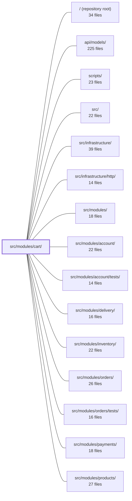

---
tags:
  - 2repo
  - 2repo/module
  - project/boilerplate-node-backend
type: module
module: src/modules/cart/
files: 34
updated: 2026-08-25T11:20:13.186795+00:00
---

# src/modules/cart/

## Purpose

The cart module owns the user's shopping cart as a bounded domain: reading, mutating, clearing, checking out, and re-ordering cart line items. It exposes a REST API for the cart surface, enforces the "one cart per user" invariant, and acts as the single module responsible for converting a cart into an order at checkout (the one point where it writes into another module's collection).

## Key parts

- **Domain rules** (`domain/rules.ts`, `domain/index.ts`) — Pure, framework-free decision logic that answers "may this cart become an order?" (empty, product-unavailable, insufficient-stock). No I/O, no HTTP codes; the service layer maps the verdict outward.
- **Services** (`services/items.ts`, `services/checkout.ts`, `services/reorder.ts`, `services/cleanup.ts`, `services/view.ts`) — The business-logic layer. `items.ts` handles add/set/remove/clear; `checkout.ts` orchestrates the cross-module write (order creation, inventory reservation, email enqueue); `reorder.ts` copies order lines back; `cleanup.ts` serves domain-event subscriptions for product/user deletion; `view.ts` is the shared projection from stored document to wire shape.
- **Controllers** (`controllers/*.ts`) — Thin HTTP handlers (one per route) that validate input, call a service, emit analytics/audit events, and shape the response. No business rules live here.
- **Persistence** (`model.ts`, `repository.ts`) — Mongoose schema with the unique `userId` index and atomic write operations (upsert line, remove line, clear, conditional clear), all addressed by user ID.
- **Module wiring** (`module.ts`, `routes.ts`, `index.ts`) — `module.ts` declares routes, dependencies, and event subscriptions for the kernel registry; `routes.ts` builds the Express router; `index.ts` is the only public barrel a sibling module may import from.
- **Observability** (`analytics.ts`, `audit.ts`, `metrics.ts`) — Typed event-name catalogue, audit action identifiers (registered into the app-wide map), and module-owned Prometheus counters.
- **API contract & tests** (`openapi.yaml`, `probes.ts`, `tests/`) — OpenAPI 3.0.3 spec for all six endpoints, hand-written rejection probes, and a layered test suite (contract, unit, domain-rules, schema, stock).
- **Seed data** (`demo.ts`, `factory.ts`) — Deterministic cart fixtures for demo/seed scripts, keeping cart documents in the cart module's own collection.

## How it connects

- **orders** — Checkout (`services/checkout.ts`) creates an order document in the orders collection and conditionally clears the cart. Reorder (`services/reorder.ts`) reads an existing order's lines and writes them into the cart. The dependency direction is strictly `cart → orders`.
- **inventory** — Checkout reserves stock units (held, not destroyed, until payment). The domain rule `evaluateCheckout` checks reservation-aware availability, and `tests/unit/stock.test.ts` cross-checks the availability subtraction against inventory's canonical `availabilityOf`.
- **products** — Cart lines reference product IDs; the domain rule rejects unavailable products; `services/cleanup.ts` removes cart lines when a product is permanently deleted (subscribed via `module.ts`).
- **users / account** — The cart is keyed to a user; `services/cleanup.ts` clears the cart when a user or account is deleted.
- **delivery** — Checkout resolves the shipping method from the delivery module before creating the order.
- **payments** — The stock-reservation model (tested in `tests/unit/stock.test.ts`) defines the window between checkout and payment during which units are held; the cart module participates in this invariant but does not call the payments API directly.
- **wishlist** — The `POST /cart` controller notes that the same service-layer path serves the wishlist "move-to-cart" flow, keeping business rules shared.
- **infrastructure / http** — The analytics port, the shared `catchAs` error helper, and Prometheus exposition are consumed from the infrastructure layer; the cart module owns its event names and counters to avoid the infrastructure layer importing domain concepts.

## Where to start

1. **`services/items.ts`** — Covers the four day-to-day operations (read, set, add, remove/clear) and shows the typical controller → service → repository → view-projection flow without cross-module writes.
2. **`domain/rules.ts`** — A short, dependency-free file that states the single core question ("can this cart check out?") and its structured verdict, giving immediate context for why `checkout.ts` is more complex than the other services.

## Connected modules

[[boilerplate-node-backend_ROOT|/ (repository root)]] · [[boilerplate-node-backend_api_models|api/models/]] · [[boilerplate-node-backend_scripts|scripts/]] · [[boilerplate-node-backend_src|src/]] · [[boilerplate-node-backend_src_infrastructure|src/infrastructure/]] · [[boilerplate-node-backend_src_infrastructure_http|src/infrastructure/http/]] · [[boilerplate-node-backend_src_modules|src/modules/]] · [[boilerplate-node-backend_src_modules_account|src/modules/account/]] · [[boilerplate-node-backend_src_modules_account_tests|src/modules/account/tests/]] · [[boilerplate-node-backend_src_modules_delivery|src/modules/delivery/]] · [[boilerplate-node-backend_src_modules_inventory|src/modules/inventory/]] · [[boilerplate-node-backend_src_modules_orders|src/modules/orders/]] · [[boilerplate-node-backend_src_modules_orders_tests|src/modules/orders/tests/]] · [[boilerplate-node-backend_src_modules_payments|src/modules/payments/]] · [[boilerplate-node-backend_src_modules_products|src/modules/products/]] · … and 5 more

## Files
- `src/modules/cart/analytics.ts` — Defines the analytics event-name catalogue for the cart module (view, add, update, remove, clear, reorder) and the two checkout outcome events. It exists so that cart controllers can reference typed event names and the analytics port knows the `cart` namespace, without any shared mutable file or the infrastructure layer needing to know about domain concepts.
- `src/modules/cart/audit.ts` — Declares the cart-specific audit action identifiers and registers them in the shared `AuditActionMap` via TypeScript module augmentation. This lets the cart controllers emit typed, discoverable audit events for customer-visible cart mutations (line-item removal, full re-order).
- `src/modules/cart/controllers/delete-cart-item.ts` — Controller for the `DELETE /cart/:productId` endpoint. Validates the path parameter, delegates to `cartService.cartItemRemoveById`, and on success emits audit + analytics events before returning the updated cart. Exists to separate HTTP-level concerns (input extraction, response shaping, observability) from the service-layer business logic.
- `src/modules/cart/controllers/delete-cart.ts` — Controller handler for the `DELETE /cart` endpoint. It removes **all** items from the authenticated user's cart, emits a `CART_CLEARED` analytics event on success, and delegates error handling to the shared `catchAs` helper.
- `src/modules/cart/controllers/get-cart-summary.ts` — Express controller handler for `GET /cart/summary`. Retrieves a lightweight summary of the authenticated user's cart and returns it as a JSON response. Exists as the thin HTTP-layer entry point that delegates all business logic to the cart service.
- `src/modules/cart/controllers/get-cart.ts` — HTTP controller handler for `GET /cart`. It retrieves the authenticated user's cart (with summary) via the cart service, emits a `CART_VIEWED` analytics event, and returns the cart as a success response. Authentication is guaranteed upstream of this handler.
- `src/modules/cart/controllers/post-cart.ts` — Controller for `POST /cart`. Validates the request body, extracts the authenticated user, delegates the add-or-update-cart-line operation to `cartService`, emits an analytics event on success, and shapes the HTTP response. It intentionally contains **no** business rules (e.g. "can this product go in a cart?") — that logic lives in the service layer so it is shared with `PUT /cart/{productId}` and the wishlist move-to-cart flow.
- `src/modules/cart/controllers/post-checkout.ts` — Express handler for `POST /cart/checkout`. It converts the caller's cart into a confirmed order via the cart service, clears the cart, and returns the created order. It is the single controller that bridges the HTTP layer to the cart domain for the checkout action.
- `src/modules/cart/controllers/post-reorder.ts` — HTTP handler for `POST /cart/reorder/:orderId`. Copies the line items of one of the caller's own orders back into their cart. It is a thin controller: it delegates all domain logic to `cartService`, then emits audit/analytics side-effects and formats the response.
- `src/modules/cart/controllers/put-cart-item.ts` — Controller handler for `PUT /cart/:productId`. Sets the quantity of a specific cart item to an explicit value (not an increment) and returns the full updated cart. Also serves as a creation path — if the product line does not yet exist it creates one, mirroring `POST /cart` behavior, including the same 404 for non-storefront products.
- `src/modules/cart/demo.ts` — The cart module's slice of the demo/seed dataset. It defines which cart documents exist in the seed data and exposes the functions that create them and read them back for inspection. Keeping the fixtures here—inside the cart module rather than nested under a person record—enforces the "each module owns its own collection" boundary.
- `src/modules/cart/domain/index.ts` — Barrel (public entry) for the cart domain layer. It re-exports the pure, framework-free checkout rules so that consumers can import from a single `domain` path rather than reaching into individual rule files. The header doc-comment enforces the invariant that this layer contains no framework dependencies (enforced by lint).
- `src/modules/cart/domain/rules.ts` — Pure decision logic that answers one question: *may this cart become an order?* It takes already-joined cart lines and returns a structured verdict (ok / empty / product-unavailable / insufficient-stock) with no side effects, no i18n, and no HTTP status codes. The `services/` layer is responsible for mapping these verdicts outward.
- `src/modules/cart/factory.ts` — Builds a deterministic cart fixture object ready for `cartRepository.create`. It exists so that seed scripts and the `./demo` entry point produce identical, hash-stable cart documents across runs, and so that callers don't have to manually assemble `ObjectId` conversions and identity fields.
- `src/modules/cart/index.ts` — Public barrel (entry point) for the cart module. It is the **only** surface a sibling module may import from, enforcing the same import rule used by `modules/products/index.ts`. It re-exports the two production-facing collaborators (`cartService`, `cartRepository`) and deliberately keeps the cart model and document type internal, since nothing embeds a cart document.
- `src/modules/cart/metrics.ts` — Defines the cart module's domain-specific Prometheus counters. By convention, each module owns its own metric counters here (rather than in `infrastructure`) so the overview endpoint can read them without creating a direct import dependency on the module's internals.
- `src/modules/cart/model.ts` — Defines the Mongoose schema, document interface, and model for the **Cart** collection. Establishes the "one cart per user" invariant (via a unique index), pins the cart-line shape to match `openapi.yaml`'s `CartItem` so no mapper is needed between stored and wire representations, and exposes a serialization transform for the persistence base factory.
- `src/modules/cart/module.ts` — Module manifest for the shopping-cart domain. Declares the cart's route, its architectural dependencies, and the domain-event subscriptions that keep cart rows in sync when products or users are deleted. Satisfies the `AppModule` contract so the kernel registry can load it.
- `src/modules/cart/openapi.yaml` — OpenAPI 3.0.3 contract for the **cart module**. Defines every cart endpoint (read, upsert, remove, summary, checkout, reorder) along with the request/response schemas the module exposes, so clients and server-side code share a single source of truth for the cart API surface.
- `src/modules/cart/probes.ts` — Defines hand-written rejection probes for the cart module — requests that prove the API *refuses* certain inputs. These live outside the OpenAPI contract (which only declares valid calls and their responses) and are appended to generated client collections as extra test steps.
- `src/modules/cart/repository.ts` — Data-access layer for cart documents. Wraps the shared `BaseRepository` factory with the four cart-specific atomic writes (upsert line, remove line, clear, conditional clear) plus account/product teardown operations. Every operation is addressed by `userId`—there is no cart ID—so callers never need to read a cart before mutating it.
- `src/modules/cart/routes.ts` — Defines the Express `Router` for all cart HTTP endpoints (view, add/update/remove items, checkout, reorder). It wires each route to its dedicated controller, enforces authentication globally, and applies cache invalidation where needed. This file is the single entry point the module exposes to the HTTP layer.
- `src/modules/cart/services/checkout.ts` — Implements the checkout operation: the single cart action that writes into another module's collection (orders). It resolves the caller's identity, shipping method, and address; validates cart lines against domain rules; creates an order; reserves inventory; conditionally empties the cart; and enqueues a confirmation email. It exists as a dedicated service because its concurrency semantics and cross-module write ordering make it fundamentally different from the read-only cart operations.
- `src/modules/cart/services/cleanup.ts` — Provides cross-module cleanup entry points for when entities the cart references (a user or a product) are permanently deleted. The cart does not own these entities, and no other service tidies up after them, so other modules call into this file. Neither function is reachable from a cart HTTP route; `module.ts` wires them to domain events fired on deletion.
- `src/modules/cart/services/index.ts` — Barrel file that re-exports the cart service functions and aggregates them into a single `cartService` object. It exists so that controllers and `module.ts` have one import path for all cart operations (read, mutate, checkout, reorder, cleanup) without reaching into individual service files.
- `src/modules/cart/services/items.ts` — Service-layer functions for reading a user's cart and mutating its contents (set, add, remove, clear). Each write operation is one repository write followed by a join that prices the result. Operations that name a specific product carry a response envelope (success/reject); `cartRemove` does not, because clearing an already-empty cart is a valid state.
- `src/modules/cart/services/reorder.ts` — Implements the "reorder" operation: copies an existing order's line items back into the caller's cart. Lives in the cart module (not orders) because it *writes* to the cart; the order is only read, preserving the declared `cart → orders` dependency direction and avoiding the cycle a checkout-arrow route would introduce.
- `src/modules/cart/services/view.ts` — Projection layer for the cart: transforms a stored `CartDocument` into the read shapes (`CartLine`, `CartView`) that the other cart service files and the API contract consume. It exists so that joining, narrowing, and serializing a cart is done in exactly one place shared by `items.ts`, `checkout.ts`, and `reorder.ts`.
- `src/modules/cart/tests/contract/api.contract.test.ts` — Contract tests that verify every `/cart` route responds with the `CartResponseEnvelope` shape declared in the OpenAPI spec. Because all six endpoints share one response schema, a serialization drift in any single route would otherwise go undetected. These tests assert only the wire-format contract (status code + body shape); business-logic rules (whose cart, which products are eligible) live in the service suites.
- `src/modules/cart/tests/unit/audit.test.ts` — Unit test that pins the exact string values of the cart module's audit actions and verifies they are registered in the app-wide `AuditAction` union. It exists because these strings are a **wire contract** consumed by external log queries, dashboards, and alert rules; a rename or typo would type-check, pass every other test, and silently break production observability.
- `src/modules/cart/tests/unit/domain-rules.test.ts` — Unit tests for the `evaluateCheckout` rule in the cart domain. They verify the pre-flight verdict logic (empty cart, product resolution, stock sufficiency, reservation-aware availability) without mocks or a database. A second block cross-checks that `rules.ts`'s local copy of the availability subtraction stays in sync with the inventory module's canonical `availabilityOf`.
- `src/modules/cart/tests/unit/schema-contract.test.ts` — Validates the Mongoose schema *declarations* for the cart model—defaults, `required` flags, `minimum` constraints, the unique `userId` index, and timestamp fields—by issuing writes through `cartRepository.create` against a real MongoDB instance. It exists because these schema-level guarantees are part of the public API contract but are not exercised by the behaviour-focused sibling specs.
- `src/modules/cart/tests/unit/service.test.ts` — Unit tests for the cart service (`src/modules/cart/services/*`), run against a real MongoDB instance via `setupTestDb`. The suite guards three invariants that are easy to break silently: the semantic difference between `set` (replace quantity) and `add` (increment quantity), the over-serialization constraint that `CartItem` responses carry only `productId` and `quantity`, and the storage shape of a cart document (no per-line `_id`, one document per user, absent until first write).
- `src/modules/cart/tests/unit/stock.test.ts` — Behavioural test suite pinning the stock reservation model's core invariant: **units leave the shop if and only if they were PAID for**. Between checkout and payment, units are held (reserved) — unavailable to other buyers but still physically on the shelf. Every assertion reads the *pair* of counters (`onHand` and `reserved`) rather than a single value, because the old single-counter model destroyed units at checkout and these tests are designed to catch that regression.

---
[[boilerplate-node-backend_INDEX|← boilerplate-node-backend index]]
