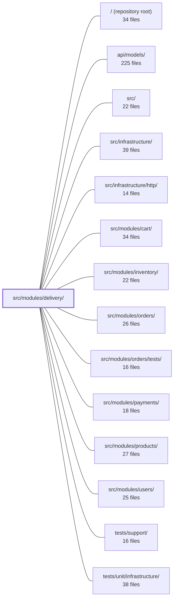

---
tags:
  - 2repo
  - 2repo/module
  - project/boilerplate-node-backend
type: module
module: src/modules/delivery/
files: 16
updated: 2026-08-25T11:20:29.717358+00:00
---

# src/modules/delivery/

## Purpose

The delivery module owns everything that happens after an order is marked `shipped`: it stores the courier-side record (tracking code, arrival timestamp), exposes the public shipping-rate table used at checkout, and provides a manual "courier tick" that simulates parcel delivery. It never initiates the order's transition to `shipped`—that is the orders module's responsibility—but it reacts to that transition to create the shipment and notify the customer.

## Key parts

- **Domain (`domain/`)** — `rates.ts` holds a three-row static shipping table plus two pure functions (`findShippingMethod`, `priceShipping`). `index.ts` re-exports them so consumers import domain logic without touching HTTP or storage concerns.
- **HTTP surface (`routes.ts`, `controllers/`)** — `routes.ts` mounts three endpoints (list methods, read shipment by order, advance courier) with per-route auth. Each controller is a thin handler that delegates to the service or domain.
- **Service (`service.ts`)** — Orchestrates the two runtime behaviours: reacting to the `ORDER_STATUS_CHANGED` event to create a shipment and email the customer, and running the courier-advance tick that flips every in-transit parcel to `delivered`.
- **Data layer (`model.ts`, `repository.ts`)** — `model.ts` defines the Mongoose `Shipment` schema; `repository.ts` wraps the shared base-repository factory with three domain queries (by-order lookup, idempotent create, in-transit listing) so the service never touches Mongoose directly.
- **Module wiring (`module.ts`, `index.ts`, `audit.ts`)** — `module.ts` registers routes, dependencies, and event subscriptions with the application kernel. `index.ts` is the public barrel that exposes only `findShippingMethod` and `priceShipping` to sibling modules. `audit.ts` declares the `admin.courier.advanced` audit action used on the courier-advance endpoint.
- **Supporting artifacts** — `emails.ts` pre-resolves locale-aware delivery copy; `openapi.yaml` is the v2 OpenAPI contract for the three endpoints.
- **Tests** — `tests/contract/` pins the three HTTP routes against the API spec; `tests/unit/service.test.ts` runs the service against a real Mongo instance (mailer mocked) covering threshold logic, idempotency, and ordering guarantees.

## How it connects

- **`src/modules/orders/`** — The orders module emits the `ORDER_STATUS_CHANGED` event when an order reaches `shipped`; this module's service subscribes to that event to create the shipment and send the customer email. The orders module is the sole writer that moves an order into the `shipped` state; delivery never does.
- **`src/modules/cart/` / `src/modules/payments/`** — Sibling modules import `findShippingMethod` and `priceShipping` from this module's public barrel (`index.ts`) to quote shipping cost during checkout without coupling to the Shipment collection or courier logic.
- **`src/modules/users/`** — Delivery emails reference user profile data (name, locale) when rendering notification copy via `emails.ts`.
- **`src/infrastructure/` / `src/infrastructure/http/`** — The module relies on shared infrastructure for Express routing, the mailer adapter (mocked in tests), and the base-repository factory used by `repository.ts`.
- **`tests/support/` / `tests/unit/infrastructure/`** — Provide the `setupTestDb` harness and shared test utilities consumed by the delivery test suites.

## Where to start

1. **`domain/rates.ts`** — Twelve lines of pure logic that show exactly what "delivery" means to the rest of the app (three methods, a free-shipping threshold). Reading it first gives you the vocabulary (`ShipmentMethod`, `priceShipping`) used everywhere else.
2. **`service.ts`** — The only file with runtime orchestration. It makes the event-driven flow (order → shipped → parcel created → customer emailed → courier tick → delivered) concrete, and its two public functions (`shipOrder`, `runCourierAdvance`) map one-to-one to the module's two jobs.

## Connected modules

[[boilerplate-node-backend_ROOT|/ (repository root)]] · [[boilerplate-node-backend_api_models|api/models/]] · [[boilerplate-node-backend_src|src/]] · [[boilerplate-node-backend_src_infrastructure|src/infrastructure/]] · [[boilerplate-node-backend_src_infrastructure_http|src/infrastructure/http/]] · [[boilerplate-node-backend_src_modules_cart|src/modules/cart/]] · [[boilerplate-node-backend_src_modules_inventory|src/modules/inventory/]] · [[boilerplate-node-backend_src_modules_orders|src/modules/orders/]] · [[boilerplate-node-backend_src_modules_orders_tests|src/modules/orders/tests/]] · [[boilerplate-node-backend_src_modules_payments|src/modules/payments/]] · [[boilerplate-node-backend_src_modules_products|src/modules/products/]] · [[boilerplate-node-backend_src_modules_users|src/modules/users/]] · [[boilerplate-node-backend_tests_support|tests/support/]] · [[boilerplate-node-backend_tests_unit_infrastructure|tests/unit/infrastructure/]]

## Files
- `src/modules/delivery/audit.ts` — Declares the single audit action emitted by the delivery module (`admin.courier.advanced`) and registers it into the global `AuditActionMap` via TypeScript module augmentation. It exists so the delivery controller's courier-advance endpoint has a typed action name to tag audit entries with.
- `src/modules/delivery/controllers/get-shipment-by-order.ts` — Express controller handler for `GET /delivery/order/:orderId`. It retrieves the shipment (parcel) associated with an order — specifically its tracking code and arrival status — and returns it as a JSON response. Called from the frontend shipping panel once the order status reaches `shipped`.
- `src/modules/delivery/controllers/get-shipping-methods.ts` — Express handler for `GET /delivery/methods`. Returns the shop's available shipping methods (flat rates, free-above thresholds) as a public, unauthenticated endpoint so guests can see shipping costs before signing up.
- `src/modules/delivery/controllers/post-courier-advance.ts` — Single-purpose Express handler for `POST /delivery/advance`. It triggers one "tick" of the fake delivery-courier simulation: every parcel currently on a truck arrives. Because the repo intentionally has no scheduler, this endpoint is the manual cron — invoked by an operator or the demo's admin button.
- `src/modules/delivery/domain/index.ts` — Barrel file that exposes the delivery domain's pure business logic (shipping rates) without pulling in any HTTP or service-layer concerns. It gives consumers a single import point for the domain layer, separating domain rules from the module's network-facing surface.
- `src/modules/delivery/domain/rates.ts` — Static shipping-rate table and the two pure functions that resolve a method by id and compute its cost for a given items total. It lives in `domain/` (alongside `evaluateCheckout` and `sumLineItems`) so that the quoted numbers originate from exactly one place, and because a three-row table does not justify a collection or a database.
- `src/modules/delivery/emails.ts` — Contains the resolved, ready-to-render email copy for delivery-related notifications. It converts locale + user data into finished strings at call time so that downstream renderers never perform i18n lookups themselves.
- `src/modules/delivery/index.ts` — Public barrel (re-export surface) for the delivery module. It exposes exactly two pure functions — `findShippingMethod` and `priceShipping` — so that sibling modules can price a chosen shipping method without depending on the module's internal storage, couriers, or `shipmentRepository`. It exists to enforce a single, minimal import contract between modules.
- `src/modules/delivery/model.ts` — Defines the Mongoose schema, document interface, and compiled model for the **Shipment** entity. A shipment is the courier-side record (tracking code, delivery timestamp) created when an order reaches `shipped`. It exists as a separate collection because those fields have no home on the Order document.
- `src/modules/delivery/module.ts` — Declares the **delivery** module's registration metadata (name, subdomain, base path, HTTP routes, inter-module dependencies, event subscriptions, and locale path) so the kernel can wire it into the application. It is the single integration point that connects the delivery domain's HTTP surface (`./routes`) and business logic (`./service`) to the rest of the system.
- `src/modules/delivery/openapi.yaml` — OpenAPI 3.0.3 contract (v2.0.0) for the delivery module. It defines three endpoints — listing available shipping methods, reading a shipment record for a specific order, and manually advancing the fake courier — along with the request/response schemas that back them. It exists so that API clients, docs, and contract tests share a single source of truth for the module's wire format.
- `src/modules/delivery/repository.ts` — Data-access layer for `Shipment` documents. Wraps the shared `createBaseRepository` factory with three domain-specific queries that the delivery service needs (lookup by order, idempotent creation, and "still in transit" listing). Exists so the service layer never touches Mongoose directly.
- `src/modules/delivery/routes.ts` — Defines the Express router for all delivery-domain HTTP endpoints (shipping-method lookup, order-shipment retrieval, and the courier-advance tick). It wires the three route paths to their respective controller handlers and applies the appropriate authorization middleware per route.
- `src/modules/delivery/service.ts` — Service layer for the delivery module. It answers the `ORDER_STATUS_CHANGED` domain event to create a parcel and notify the customer when an order reaches `shipped`, and it exposes a manual "courier tick" that moves every `shipped` parcel to `delivered`. The module never initiates the `→ shipped` transition itself; that is the order module's write path.
- `src/modules/delivery/tests/contract/api.contract.test.ts` — Contract tests that pin the HTTP-level behavior of the three `/delivery` routes (methods list, owner shipment read, courier advance) against the project's API spec. They verify each auth/contract branch is reachable over real HTTP; deeper courier ordering rules are deliberately left to the unit suite.
- `src/modules/delivery/tests/unit/service.test.ts` — Integration-level test suite for the delivery service (`shipOrder`, `runCourierAdvance`, `getForOrder`) and the domain-event subscription that auto-creates a shipment when an order transitions to `shipped`. Runs against a real Mongo instance (`setupTestDb`) with only the mailer adapter mocked, pinning the free-shipping threshold, parcel idempotency, courier ordering guarantees, and the "admin write is sufficient" contract.

---
[[boilerplate-node-backend_INDEX|← boilerplate-node-backend index]]
