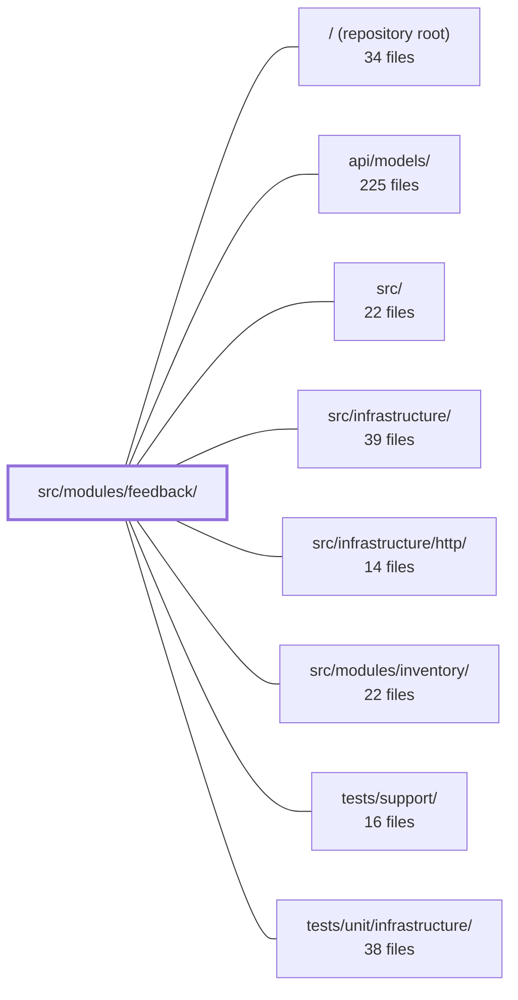

---
tags:
  - 2repo
  - 2repo/module
  - project/boilerplate-node-backend
type: module
module: src/modules/feedback/
files: 16
updated: 2026-08-25T11:20:45.749917+00:00
---

# src/modules/feedback/

## Purpose

The feedback module implements the visitor contact-request workflow: a public form for submitting feedback, an admin surface for listing, searching, and updating ticket status, and an operator notification email. It is a self-contained leaf module—by design it records a raw email address rather than a user ID, so it has no runtime dependency on other feature modules.

## Key parts

- **Registration & routing** — `module.ts` declares the module's identity, base path, and router for the kernel to mount. `routes.ts` wires the three endpoints (public `POST /feedback/contact`, admin `GET /feedback`, `POST /feedback/search`, `PUT /feedback/:id`) to their controllers, applies the auth boundary, and attaches Redis cache set/invalidate middleware.
- **Controllers** — One file per endpoint (`post-feedback-contact.ts`, `get-feedback.ts`, `put-feedback-status.ts`). Each validates input, delegates to the service, emits an audit event, and formats the HTTP response, keeping the route layer thin.
- **Service & repository** — `service.ts` sits between controllers and data access: it normalises payloads, enforces the `FeedbackRequestStatus` enum, stamps `respondedAt` on first status change, and produces standardised responses. `repository.ts` exposes a single repository instance built from the shared base-repository factory, wired to the Mongoose model and a result transform.
- **Model** — `model.ts` defines the Mongoose schema, document interface, and `toJSON` serialization for the `FeedbackRequest` collection, bridging API string dates to MongoDB `Date` fields.
- **Cross-cutting concerns** — `audit.ts` registers feedback-specific audit action strings into the global `AuditActionMap`. `emails.ts` resolves all translated strings and customer values into a finished `EmailContent` object for the sending worker. `openapi.yaml` is the OpenAPI 3.0.3 contract that both the backend and the orval-generated frontend client rely on.
- **Tests** — `tests/contract/` asserts every route conforms to the shared API spec and guards the public-vs-admin security boundary. `tests/unit/` covers audit string values, model serialization (no `_id`/`__v` leakage), schema declarations (run against a real MongoDB), and the four service functions.

## How it connects

- **`src/infrastructure/http/`** — Provides the shared HTTP utilities the controllers and routes depend on: standard response helpers, cache middleware, and audit-event plumbing.
- **`api/models/`** — Houses the shared API specification (OpenAPI schema) that the contract tests (`toSatisfyApiSpec()`) validate against and that the orval codegen consumes to produce the frontend client.
- **`tests/support/` / `tests/unit/infrastructure/`** — Supply `setupTestDb()` and other test harness utilities used by the unit and contract suites in this module.
- **`src/modules/inventory/`** — No direct runtime relationship; the feedback module is an intentionally independent leaf module and does not import from inventory or any other feature module.

## Where to start

Read `module.ts` and `routes.ts` first. Together they show the module's public surface in about forty lines: which endpoints exist, who can call them, and how the kernel mounts the module. From there, follow one route into its controller and the `service.ts` function it calls to see the full request-to-persistence path.

## Connected modules

[[boilerplate-node-backend_ROOT|/ (repository root)]] · [[boilerplate-node-backend_api_models|api/models/]] · [[boilerplate-node-backend_src|src/]] · [[boilerplate-node-backend_src_infrastructure|src/infrastructure/]] · [[boilerplate-node-backend_src_infrastructure_http|src/infrastructure/http/]] · [[boilerplate-node-backend_src_modules_inventory|src/modules/inventory/]] · [[boilerplate-node-backend_tests_support|tests/support/]] · [[boilerplate-node-backend_tests_unit_infrastructure|tests/unit/infrastructure/]]

## Files
- `src/modules/feedback/audit.ts` — Declares the feedback-specific audit action identifiers and registers them into the global `AuditActionMap` via module augmentation, so that downstream controllers can emit type-safe audit events without a shared enum.
- `src/modules/feedback/controllers/get-feedback.ts` — Controller handler for searching and paginating feedback tickets. Serves two routes — the cacheable `GET /feedback` (query-string filters) and the uncached `POST /feedback/search` (body filters) — by delegating to the feedback service, emitting an audit event, and returning a paginated result.
- `src/modules/feedback/controllers/post-feedback-contact.ts` — HTTP controller for the public `POST /feedback/contact` endpoint. Validates the incoming feedback form, delegates persistence to the feedback service, and sends a single operator-facing notification email. It is the entry point a visitor hits when submitting a contact/feedback form.
- `src/modules/feedback/controllers/put-feedback-status.ts` — Express controller handler for `PUT /feedback/:id` (admin). Validates the incoming body against a Zod schema, delegates to `feedbackRequestService.updateStatusById`, emits an audit event on success, and returns a standard HTTP response. It exists to keep the route layer thin: parsing, service orchestration, auditing, and error formatting in one place.
- `src/modules/feedback/emails.ts` — Defines the operator-facing email content for new contact/feedback requests. It resolves all translated strings and customer-supplied values into a finished `EmailContent` object so the sending worker never has to interpret locale, pick fallbacks, or assemble partials.
- `src/modules/feedback/model.ts` — Defines the Mongoose schema, document interface, and model registration for the `FeedbackRequest` collection. It bridges the gap between the API-generated TypeScript types (which use string dates) and MongoDB's native `Date` fields, and exposes a serialization transform for lean query results.
- `src/modules/feedback/module.ts` — Module registration for the **feedback** (contact-request) feature. It declares the module's identity, base path, router, and locale directory so the kernel can mount it. It is intentionally a leaf module with no cross-module dependencies — the form records a raw email address rather than a user ID, keeping it independent of the `users` module.
- `src/modules/feedback/openapi.yaml` — OpenAPI 3.0.3 contract for the feedback module (v2.0.0). Defines the REST surface for user contact requests and admin review, along with the request/response schemas the backend and the orval-generated frontend client depend on.
- `src/modules/feedback/repository.ts` — Defines the data-access layer for feedback requests. It exposes a single repository instance built via the shared base-repository factory, wiring up the domain model, a result transform, and the searchable-field spec.
- `src/modules/feedback/routes.ts` — Defines the Express route table for the feedback module: a single public contact-form endpoint and a set of admin-only endpoints for reading, searching, and updating visitor-submitted feedback. It wires each route to its controller, applies the authorization boundary, and attaches Redis-backed cache set/invalidate middleware.
- `src/modules/feedback/service.ts` — Domain service layer for the feedback module. Sits between the HTTP controllers and the repository, translating raw API payloads (strings, widened types) into typed domain operations, enforcing the closed `FeedbackRequestStatus` enum, and producing standardized HTTP responses.
- `src/modules/feedback/tests/contract/api.contract.test.ts` — Contract test suite for every `/feedback` route. It asserts that each response conforms to the shared API specification (`toSatisfyApiSpec()`) and specifically guards the security boundary between the single public write endpoint (`POST /feedback/contact`, `security: []`) and the admin-only list, search, and update routes—ensuring the public response never leaks admin fields and the admin routes return 401/403 instead of exposing data.
- `src/modules/feedback/tests/unit/audit.test.ts` — Pins the exact string values emitted by the feedback module's audit vocabulary. These strings are a wire contract consumed by external tooling (log queries, dashboards, alert rules) that lives outside this repo, so a silent rename or reformat would break alerts without tripping any other test.
- `src/modules/feedback/tests/unit/model.test.ts` — Guards a serialization contract: feedback requests must never expose Mongoose internals (`_id`, `__v`) on **either** response path — the hydrated document's `toJSON` output or the `.lean()` list result produced by the service's transform. The file codifies this invariant so a regression in either path fails the suite immediately.
- `src/modules/feedback/tests/unit/schema-contract.test.ts` — Guards the Mongoose schema declarations themselves—defaults, `required` flags, enum membership, `select: false`, and `toJSON` serialization—because those declarations constitute part of the public API and are not exercised by the repository's behavioural specs in the same folder. Runs against a real MongoDB instance so that Mongoose's own interpretation of `default`, `required`, and `select` is what gets asserted, not a mock's approximation.
- `src/modules/feedback/tests/unit/service.test.ts` — Unit tests for the four exported functions of the feedback service (`create`, `search`, `updateStatus`, `updateStatusById`). They verify input normalisation, status-vocabulary enforcement, pagination metadata, persistence side-effects, and the one-shot `respondedAt` stamping rule. Each suite runs against a real test database initialised by `setupTestDb()`.

---
[[boilerplate-node-backend_INDEX|← boilerplate-node-backend index]]
