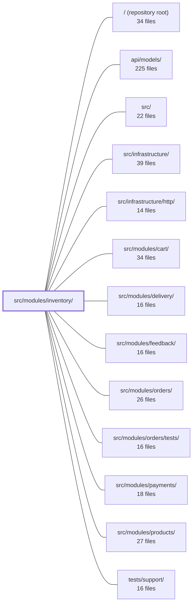

---
tags:
  - 2repo
  - 2repo/module
  - project/boilerplate-node-backend
type: module
module: src/modules/inventory/
files: 22
updated: 2026-08-25T11:21:00.416699+00:00
---

# src/modules/inventory/

## Purpose

The inventory module owns all stock accounting in the application: the two counters on every product (`onHand`, `reserved`), the append-only stock-movement ledger, and the full reservation lifecycle (reserve → commit | release | expire). It is the single chokepoint through which every stock counter change passes, enforcing the invariant that a counter never moves without a corresponding ledger row.

## Key parts

- **Domain layer** (`domain/transitions.ts`, `domain/index.ts`) — Pure, side-effect-free functions that define the reason→delta table, the availability calculation, and the invariants every transition must satisfy. No I/O, no Express, no Mongoose; lint-enforced.
- **Service** (`service.ts`) — The business-logic core. Routes every mutation through `applyTransition`, owns the reservation lifecycle (`reserveForOrder`, `commitForOrder`, `releaseForOrder`, expiry sweep), and guarantees atomicity between counter writes and ledger rows.
- **Persistence** (`model.ts`, `repository.ts`) — Mongoose schemas for the `StockMovement` (append-only ledger) and `Reservation` (temporary hold) collections, plus the sole place in the module that touches raw Mongoose query APIs.
- **HTTP layer** (`controllers/`, `routes.ts`, `openapi.yaml`) — Five admin-only endpoints (view levels, read ledger, receive, adjust, sweep) with Zod-validated inputs, Express handlers, and a published OpenAPI 3.0.3 contract.
- **Module wiring** (`module.ts`, `index.ts`, `events.ts`, `metrics.ts`, `config.ts`, `audit.ts`) — Registration with the app kernel, the public barrel (the only surface sibling modules may import from), the `inventory.reservation_expired` domain event, two Prometheus gauges, tunable config values, and the three audited admin actions.
- **Tests** (`tests/unit/`, `tests/contract/`) — Unit tests for the transition table, service guarantees, and a fast-check property test proving ledger/counter consistency; contract tests pinning every HTTP response shape to the OpenAPI spec.

## How it connects

- **cart** – Calls `reserveForOrder` when an item is added, creating a `Reservation` hold.
- **orders** – Drives `commitForOrder` (fulfilment) and `releaseForOrder` (cancellation). The `inventory.reservation_expired` event is emitted *after* the sweep so orders can react without a circular import.
- **payments** – Checkout/payment flows are the originators of commit/release; their requests carry the audit context that inventory's lifecycle transitions reference.
- **products** – Exposes the derived `available` flag on each product document; the inventory module is the sole writer of the counters behind that flag.
- **infrastructure / http** – Relies on the shared Express app, Mongoose connection, and Zod validation utilities provided by `src/infrastructure/`.
- **api/models** – Shares base document shapes and common types defined at the repository level.

## Where to start

1. **`domain/transitions.ts`** — Small, pure, and free of dependencies. Reading the reason→delta table and the availability function gives you the full mental model of what a "stock move" means before any I/O enters the picture.
2. **`service.ts`** — The single file where business rules meet persistence. Tracing `applyTransition` and the three reservation methods shows how the module enforces its core invariant in practice.

## Connected modules

[[boilerplate-node-backend_ROOT|/ (repository root)]] · [[boilerplate-node-backend_api_models|api/models/]] · [[boilerplate-node-backend_src|src/]] · [[boilerplate-node-backend_src_infrastructure|src/infrastructure/]] · [[boilerplate-node-backend_src_infrastructure_http|src/infrastructure/http/]] · [[boilerplate-node-backend_src_modules_cart|src/modules/cart/]] · [[boilerplate-node-backend_src_modules_delivery|src/modules/delivery/]] · [[boilerplate-node-backend_src_modules_feedback|src/modules/feedback/]] · [[boilerplate-node-backend_src_modules_orders|src/modules/orders/]] · [[boilerplate-node-backend_src_modules_orders_tests|src/modules/orders/tests/]] · [[boilerplate-node-backend_src_modules_payments|src/modules/payments/]] · [[boilerplate-node-backend_src_modules_products|src/modules/products/]] · [[boilerplate-node-backend_tests_support|tests/support/]]

## Files
- `src/modules/inventory/audit.ts` — Declares the three audit action identifiers that the inventory module emits and registers them in the shared `AuditActionMap` via a module augmentation. The design intentionally limits auditing to human-initiated stock changes (receive, adjust, sweep) rather than to lifecycle transitions (reserve, commit, release, expire), which are already recorded by the originating checkout/payment/cancellation requests.
- `src/modules/inventory/config.ts` — Central read point for two deployment-tunable numbers (reservation TTL and low-stock threshold) that previously lived as hard-coded copies in multiple consumers. Read per call rather than captured at import so that env-var changes take effect on the next request and tests can vary them per case.
- `src/modules/inventory/controllers/get-inventory-levels.ts` — Express controller handler for `GET /inventory/levels`. Validates the query string against a Zod schema, coerces booleans, delegates to the inventory service's `listLevels` method, and returns a paginated "stock board" (counters + availability, scarcest first). It exists as the thin HTTP layer that keeps transport concerns (parsing, status codes, error mapping) out of the service.
- `src/modules/inventory/controllers/get-stock-movements.ts` — HTTP controller for `GET /inventory/movements`. Accepts query-string parameters (`productId`, `reason`, `page`, `pageSize`), validates them against a Zod schema, delegates to `inventoryService.listMovements`, and returns a paginated page of the stock-movement ledger (newest first).
- `src/modules/inventory/controllers/post-adjustment.ts` — HTTP handler for `POST /inventory/adjustments` — the stocktake-correction endpoint. Because an unexplained stock change is indistinguishable from shrinkage, this endpoint is the primary audited action in the inventory module: every successful call writes a structured audit record capturing the admin, the signed delta, and the free-text reason.
- `src/modules/inventory/controllers/post-receipt.ts` — Request handler for `POST /inventory/receipts`. Validates an inbound stock-receipt payload, delegates to the inventory service, and emits an audit record. A receipt is one of only two ways units can enter the shop, so every successful call is audited with the admin, product, and resulting on-hand count.
- `src/modules/inventory/controllers/post-reservations-sweep.ts` — Handler for `POST /inventory/reservations/sweep`. Triggers a one-shot reservation-expiry sweep via the inventory service. The application ships no internal scheduler, so an external driver (cron, platform scheduled job, or operator) hits this endpoint to tick the clock.
- `src/modules/inventory/domain/index.ts` — Barrel file that defines the public API surface of the inventory **domain layer**. It re-exports the pure, DB-free rules (the reason→delta table and availability logic) from `./transitions` so consumers can import from a single stable path. The layer is intentionally free of Express, Mongoose, and all transport/infrastructure concerns; this constraint is lint-enforced.
- `src/modules/inventory/domain/transitions.ts` — Single definition point for how inventory transitions affect a product's two counters (`onHand`, `reserved`) and for the availability calculation. Pure functions—no side effects, no I/O—so the domain layer can be reasoned about and tested in isolation.
- `src/modules/inventory/events.ts` — Declares the single domain event owned by the inventory module (`inventory.reservation_expired`) and exports its name as a shared constant. It exists to announce a fact to other modules *after* inventory has already acted, avoiding a circular import with `orders`.
- `src/modules/inventory/index.ts` — Public barrel (entry point) for the inventory module. It is the **only** surface sibling modules are allowed to import from—lint enforces that reaching `./service` directly from outside is an error. It deliberately withholds repositories, models, counter primitives, and internal types so that no external code can move a stock number or inspect internal accounting.
- `src/modules/inventory/metrics.ts` — Defines two Prometheus gauges owned by the inventory module: one for product availability (low-stock count) and one for units held in open reservations. Both are computed at scrape time via `collect` callbacks so the metric always reflects current shelf state rather than a snapshot that could drift.
- `src/modules/inventory/model.ts` — Defines the Mongoose schemas, models, and document interfaces for the two collections owned by the inventory module: **StockMovement** (the append-only ledger) and **Reservation** (a temporary hold on stock). This file is purely the persistence contract — it declares shape, constraints, and indexes but contains no business logic or queries.
- `src/modules/inventory/module.ts` — Module registration for the **inventory** domain. Declares the module's metadata (name, subdomain, base path, routes, dependencies, locales) and pulls in its side-effect imports (events, metrics) so they register at load time. All actual business logic (the reservation lifecycle: `reserveForOrder` → `commitForOrder` / `releaseForOrder`) lives in sibling files; this file is the wiring point that makes the module discoverable to the kernel.
- `src/modules/inventory/openapi.yaml` — OpenAPI 3.0.3 contract for the inventory module. It defines the five admin-facing operations for managing stock (view levels, read the movement ledger, receive, adjust, sweep) and the schemas that describe them. It is the module's public API surface — the single document clients and tests contract against.
- `src/modules/inventory/repository.ts` — Provides the persistence layer for the inventory module: an append-only stock-movement ledger and a reservation (hold) store with domain-specific query and state-transition methods. It exists so that `./service` can enforce business rules while all raw Mongoose access stays in one place.
- `src/modules/inventory/routes.ts` — Defines the Express router for all inventory endpoints. Every route in this file is restricted to authenticated admin staff; the customer-facing surface of the inventory module is intentionally excluded (stock visibility lives on the product's `available` field, not on a public endpoint).
- `src/modules/inventory/service.ts` — The single chokepoint through which every stock counter change in the application passes. It enforces one invariant — a counter never moves without a ledger row, and a row is never written for a counter that did not move — by routing all mutations through `applyTransition`. It also owns the reservation lifecycle (reserve → commit | release | expire) so that the cart, orders, and expiry-sweep modules can change stock without knowing *how*.
- `src/modules/inventory/tests/contract/api.contract.test.ts` — Contract tests that pin each HTTP-level response shape for the `/inventory` API (levels, movements, receipts, adjustments, reservations/sweep). They verify status codes, body structure, and error formats against the published API spec — the business-rule transitions themselves are covered by the unit suite.
- `src/modules/inventory/tests/unit/ledger.property.test.ts` — Property-based test (via `fast-check`) that verifies the inventory ledger is a faithful, gap-free account of counter changes: summing `onHandDelta` / `reservedDelta` across all ledger rows must equal the actual change in the stored counters, and no row may appear for a refused transition. It exists to pin down a guarantee the prior event-listener design could not provide — that a ledger row is written atomically with the counter move.
- `src/modules/inventory/tests/unit/service.test.ts` — Unit tests for the inventory service's own guarantees: all-or-nothing reservation claims, at-most-once commit/release semantics, admin receive/adjust transitions and their refusal conditions, and the reservation sweep. Uses a real Mongo instance (`setupTestDb`) because every guarantee under test is a conditional (atomic) write that a mock would paper over. Cross-module lifecycle and replay-invariant tests live elsewhere (`cart/tests/unit/stock.test.ts`, `ledger.property.test.ts`).
- `src/modules/inventory/tests/unit/transitions.test.ts` — Unit tests for the inventory transition table. Rather than restating each table row, the suite asserts the three business invariants the table encodes: which reasons may change unit count, that a commit preserves availability, and that reserve/release/expire are exact inverses. It runs against the real, pure domain functions with no mocks or database.

---
[[boilerplate-node-backend_INDEX|← boilerplate-node-backend index]]
