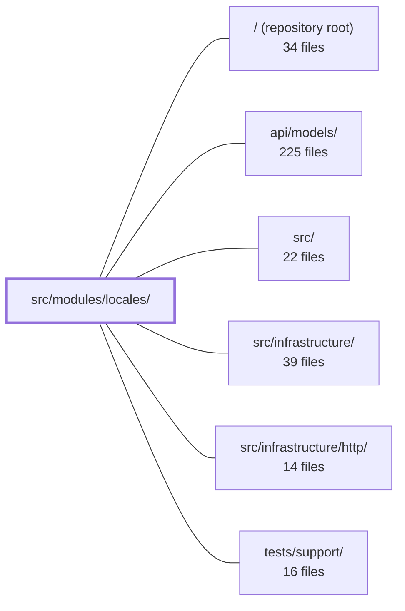

---
tags:
  - 2repo
  - 2repo/module
  - project/boilerplate-node-backend
type: module
module: src/modules/locales/
files: 30
updated: 2026-08-25T11:21:17.153687+00:00
---

# src/modules/locales/

## Purpose

The locales module manages the application's translation layer across two tiers: a **static** tier (language files bundled at build time, served from a fixed manifest) and a **dynamic** tier (per-tenant, per-language key/value rows stored in MongoDB). It exposes admin CRUD for registering languages and editing their dictionaries, provides client-facing endpoints for runtime dictionary discovery and download, and maintains an i18n override cache that lets the API serve freshly-edited translations without a restart.

## Key parts

- **Domain model & data access** — `model.ts` (Mongoose schemas for `locales` and `localemessages`), `repository.ts` (query surface with a mandatory revision-bump on every message mutation), and `tenants.ts` (tenant registry derived from environment variables; the single source of truth for which keyspace IDs the API accepts).
- **Service layer** (`services/`) — `languages.ts` (language CRUD), `entries.ts` (per-key and bulk-import writes), `messages.ts` (nested-tree expansion for client and backend), `keys.ts` (pure key-validation and tree-building logic shared by both), and `capabilities.ts` (builds the unified language manifest, degrading gracefully if Mongo is unavailable). All are aggregated into one `localeService` object via `services/index.ts`.
- **HTTP surface** — `routes.ts` wires every endpoint with auth guards and cache middleware; `controllers/` contains one or two handlers per route (reads, writes, deletes, tenant discovery). Each write handler emits an audit event (defined in `audit.ts`) and triggers a cache refresh.
- **Module wiring & contract** — `module.ts` is the single entry point the app kernel calls to mount routes, seed demo data, and register the i18n override provider. `openapi.yaml` documents the full HTTP contract for client code-generation and gateway routing.
- **Demo & fixtures** — `demo.ts` + `factory.ts` produce a byte-stable seed dataset covering every combination of the "deployed × rows × active" grid, so local development exercises all code paths.
- **Tests** (`tests/`) — Unit tests pin schema invariants, pure service logic, tenant-registry behavior, and audit-string literals; a repository test suite runs against real MongoDB for cascade/import semantics; a contract suite pins response shapes against the OpenAPI spec.

## How it connects

- **`src/infrastructure/`** — `module.ts` registers the backend-tenant override provider with `@infrastructure/i18n` at import time; the i18n overlay reads the dynamic-tier rows (at boot, on a timer, or after a write) to build its translation cache. The locales module never `await`s on Mongo during a request, so a database outage degrades to stale translations rather than a 500.
- **`src/infrastructure/http/`** — The Express router defined in `routes.ts` is mounted onto the shared HTTP application provided by this layer, inheriting its middleware pipeline (auth guards, cache headers, error handling).
- **`src/` (app kernel)** — `module.ts` conforms to the `AppModule` contract the kernel iterates over, making this module discoverable without the kernel importing any locale-specific symbol directly.
- **`tests/support/`** — Shared test utilities (e.g., server bootstrap, auth-token helpers) are reused by the locales contract and integration test suites.
- **`/` (repository root)** — `tenants.ts` resolves its tenant list from environment configuration established at the project root; `audit.ts`'s action identifiers are consumed by cross-cutting log queries and dashboards defined at the repository level.

## Where to start

1. **`module.ts`** — Ten or so lines that show how the router, service, seed function, and i18n provider are stitched together. Reading it first gives you the map of every other file in the directory.
2. **`services/keys.ts`** — Pure functions, no I/O, no dependencies. It encodes the key-safety rules, collision detection, and the flat-to-nested tree transformation that underpin both read and write paths. Understanding it makes the rest of the service layer and the controllers straightforward to follow.

## Connected modules

[[boilerplate-node-backend_ROOT|/ (repository root)]] · [[boilerplate-node-backend_api_models|api/models/]] · [[boilerplate-node-backend_src|src/]] · [[boilerplate-node-backend_src_infrastructure|src/infrastructure/]] · [[boilerplate-node-backend_src_infrastructure_http|src/infrastructure/http/]] · [[boilerplate-node-backend_tests_support|tests/support/]]

## Files
- `src/modules/locales/audit.ts` — Declares the set of audit action identifiers for all write operations in the locales module. It exists because the translation dictionary itself keeps no edit history and the copy has left the git repository, so these rows are the only durable record of *who* changed *what users read*. Reads are intentionally excluded (public, no PII).
- `src/modules/locales/controllers/delete-locale-entry.ts` — Express controller handler for `DELETE /locales/:locale/entries/:entryId` (admin). Removes a single key from a single language's locale entries, records the deletion in the audit trail, and invalidates the in-process override cache so the removed key stops answering on this worker immediately.
- `src/modules/locales/controllers/delete-locale.ts` — Handler for the admin `DELETE /locales/:locale` endpoint. It delegates the actual removal (and the active-language guard that returns 409) to `localeService.deleteLanguage`, then emits an audit record and triggers a fire-and-forget refresh of the i18n override cache on the current worker.
- `src/modules/locales/controllers/get-locale-entries.ts` — Controller for `GET /locales/:locale/entries` (admin). Returns the flat, paginated list of dictionary rows behind one language — the data a translator's editing screen displays. It is intentionally a separate endpoint from `GET /locales/:locale/messages` (the nested tree a client consumes), and is deliberately **not** cached because a stale page would let a translator edit an already-changed value.
- `src/modules/locales/controllers/get-locale-messages.ts` — Single controller function for `GET /locales/:locale/messages`. It returns the full client-facing dictionary for one language (optionally scoped to a tenant) as a **nested** object, so a frontend that lazy-loads a language at runtime can merge it with the same code path it uses for the bundle-shipped tier. The module exists because a built frontend only ships the languages it knew at build time; this endpoint covers anything added later.
- `src/modules/locales/controllers/get-locale-tenants.ts` — Express handler for the `GET /locales/tenants` route. It returns the list of tenants (keyspaces) that the current deployment holds words for, so admin UIs and clients can discover which tenant IDs the API will accept without hardcoding them. The data originates from environment configuration (via `../tenants`), not a database query.
- `src/modules/locales/controllers/get-locales.ts` — HTTP controller handling two read-only locale endpoints: a catalog of supported languages with their capability scopes, and the API's own fallback message dictionary for a single locale. Exists because locale support is a runtime fact (deployed dictionary files + registered languages) that cannot be expressed statically in OpenAPI, and because the API's own copy must remain available even when the database is down.
- `src/modules/locales/controllers/write-locale-entries.ts` — Admin-facing Express controllers for the four write routes on a language's locale entries: create one key, update one value, and two bulk import modes (replace and merge). Each handler validates the body with a Zod schema, delegates to `localeService`, emits an audit event, and refreshes the i18n overrides overlay.
- `src/modules/locales/controllers/write-locales.ts` — Admin-only HTTP handlers for the two locale write endpoints: `POST /locales` (register a language) and `PUT /locales/:locale` (edit its display names, direction, or visibility). They validate the body against a Zod schema, delegate persistence to the locale service, emit an audit event on success, and shape the HTTP response. Writing a row here does **not** make the API answer in that language; i18next resources are loaded once per worker at boot from a static manifest.
- `src/modules/locales/demo.ts` — Seed dataset for the locales module's dynamic tier. It exists so that every branch the module's code actually has (downloadable-only, deployed-and-overridable, inactive, empty, backend-inert, deep key trees) is exercised by at least one fixture row. The four languages — `es`, `fr`, `it`, `ja` — are chosen to occupy every cell of the "deployed file × rows × active" grid the module's design implies.
- `src/modules/locales/factory.ts` — Provides fixture builders for the two locale collections (languages and locale entries). Each factory returns a fully-addressed document with a pinned `_id` so the exported demo dataset is byte-stable across runs. Fields not explicitly set fall through to the schema defaults in `./model`, keeping `demo-data.json` a record of schema behavior rather than fixture assumptions.
- `src/modules/locales/model.ts` — Defines the two Mongoose schemas, models, and document interfaces behind the **override tier** of locale data (registered languages and per-tenant translated strings). The file is intentionally free of any `await`-bearing logic on the request path: the i18n overlay in `@infrastructure/i18n` reads these rows only at boot, on a timer, or after a write, so Mongo unavailability degrades to stale translations rather than failing a request.
- `src/modules/locales/module.ts` — Module registration file for the `locales` domain. It wires the locales router, service, and demo seeds into the `AppModule` contract, and registers the backend-tenant override provider with `@infrastructure/i18n` at import time. It is the single entry point the kernel uses to mount this module's routes, locale files, and seed functions.
- `src/modules/locales/openapi.yaml` — OpenAPI 3.0.3 contract for the **locales** module. It documents the public and admin HTTP surface for managing supported languages, their dictionaries, and the tenant keyspace model. The file exists so that client code generation, API-gateway routing, and human onboarding all start from a single source of truth for this module's endpoints.
- `src/modules/locales/repository.ts` — Data-access layer for the two locale collections (`locales` and `localemessages`). It wraps Mongoose models in repository objects that expose a small, opinionated query surface and enforces a single structural invariant: every mutation of a message row is coupled to a revision bump on its parent language, so no service can write a translation without advancing the cache-invalidation counter.
- `src/modules/locales/routes.ts` — Defines the Express router for locale discovery and translation administration. It wires every REST endpoint in the locales module—public reads of dictionaries and manifests, and admin-only CRUD for locales and their entries—applying the correct auth guards and cache middleware per route.
- `src/modules/locales/services/capabilities.ts` — Builds the locale **manifest** — a single, ordered list describing every language this deployment offers and what each can do. It unifies two distinct tiers (file-based *static* languages and row-based *dynamic* languages) into one response shape without conflating their capabilities, and it degrades gracefully so the static tier is always served even if the database is down.
- `src/modules/locales/services/entries.ts` — CRUD and bulk-import operations for individual locale entries (translated key/value rows). Every read and write is scoped to a single language (by tag) and a single tenant, because a key is only unique within one tenant's keyspace. Sits at the service layer between HTTP handlers and the repository, translating business rules (key collisions, unsafe segments, tenant validation) into repository calls and typed HTTP responses.
- `src/modules/locales/services/index.ts` — Barrel namespace for the locales service layer. Aggregates all 23 functions from five sibling service files into a single `localeService` object, giving controllers, `module.ts`, and test suites exactly one import name to use.
- `src/modules/locales/services/keys.ts` — Pure, database-free validation and tree-building logic for translation keys. It decides whether a key is safe to store, whether it collides with siblings, and assembles flat dotted rows into the nested object shape served by `GET /locales/{locale}`. It is shared by `entries.ts` and `messages.ts` without either owning it.
- `src/modules/locales/services/languages.ts` — Service layer for CRUD operations on language (locale) documents in the dynamic tier. Owns the two shared rejection helpers (`languageNotFound`, `rejectUnknownTenant`) that other route handlers in the locales module reuse, so every route phrases 404s and unknown-tenant 422s identically.
- `src/modules/locales/services/messages.ts` — Two read paths that expand flat locale-message rows into nested trees via `buildMessageTree`: one serves a frontend client its downloadable overrides (scoped to a single language and a frontend tenant), the other serves the backend its full i18n overlay (all languages, backend tenant only).
- `src/modules/locales/tenants.ts` — Defines the set of tenants (translation keyspace owners) for this deployment, sourced entirely from environment variables. A tenant is a single consumer of the translation service (the API itself, a paired frontend, or an additional client). This file is configuration, not persisted data: which tenants exist is a deployment fact resolved at runtime, and the list is published via `GET /locales/tenants` so no client hardcodes it.
- `src/modules/locales/tests/contract/api.contract.test.ts` — Contract tests that pin the response *shape* of every `/locales` endpoint against the OpenAPI spec, and verify the critical tier boundary: a locale registered in the database is **not** automatically servable by the API's own dictionary endpoint. The suite exists so that a refactor collapsing the two keyspaces (file-deployed vs. DB-registered) fails here rather than surfacing as a broken client.
- `src/modules/locales/tests/unit/audit.test.ts` — Pins the exact string values emitted by the locales module's audit actions. Because these strings are a wire contract consumed by external log queries, dashboards, and alert rules, this test is the only place in the codebase that asserts their literal values. It also guards the underscore (not hyphen) spelling required by the cross-cutting sweep and verifies the TypeScript module augmentation that folds these values into the global `AuditAction` union.
- `src/modules/locales/tests/unit/model.test.ts` — Unit tests that verify Mongoose **schema-level** invariants for the locale and localeMessage models: serialization (no `_id`/`__v` leakage on either the `toJSON` or the `.lean()` path), schema defaults, tag normalization, and `baseLanguage` derivation. Tests are deliberately aimed at the repository/schema layer rather than the service layer, because a schema hook is the only guarantee that holds for every write path (seeds, migrations, future callers).
- `src/modules/locales/tests/unit/repository.test.ts` — Integration-level unit tests for the locale write paths (create, edit, remove, import, delete) run against a real MongoDB instance. They exist because the invariants under test—atomic revision-counter bump, cross-collection cascade, and replace-vs-merge import semantics—cannot be meaningfully pinned with an in-memory fake.
- `src/modules/locales/tests/unit/service.test.ts` — Unit tests for the pure, decision-making half of `localeService`: the message-tree builder, key-collision detectors, and the capability-manifest merge. These functions perform no I/O, so they are asserted directly here rather than through Mongo (`repository.test.ts`) or HTTP (contract suite). The emphasis is on silent-failure modes — a dropped key, a false capability claim, a prototype-pollution vector — that would otherwise surface nondeterministically in production.
- `src/modules/locales/tests/unit/tenants.fixture.ts` — Provides shared tenant-ID constants for unit tests in the locales module. Rather than hard-coding IDs inline in each test file, the values are sourced from the production tenant registry, preventing tests from silently drifting from what the service actually accepts.
- `src/modules/locales/tests/unit/tenants.test.ts` — Unit tests for the tenant registry in `tenants.ts`. Verifies that the three public readers (`listTenants`, `backendTenant`, `frontendTenant`) plus the identity helpers (`frontendTenantIds`, `isFrontendTenant`, `isKnownTenant`) behave correctly when driven by environment variables, with the demo pair as the implicit floor.

---
[[boilerplate-node-backend_INDEX|← boilerplate-node-backend index]]
