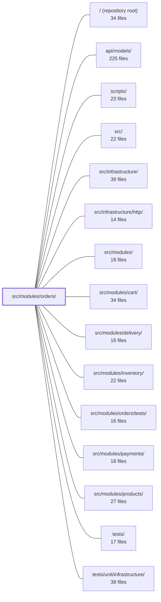

---
tags:
  - 2repo
  - 2repo/module
  - project/boilerplate-node-backend
type: module
module: src/modules/orders/
files: 26
updated: 2026-08-25T11:21:30.847178+00:00
---

# src/modules/orders/

## Purpose

The orders module owns the complete lifecycle of an order: creation from a cart or admin payload, validation, status transitions, search and retrieval, cancellation, deletion, and invoice generation. It sits low in the dependency DAG—payments and delivery depend on it, never the reverse—and exposes domain events as its only outbound channel.

## Key parts

- **Domain layer** (`domain/`) — Pure, framework-free rules: `lifecycle.ts` (status-transition graph and actor permissions), `money.ts` (integer-cent arithmetic and rounding), `totals.ts` (line-item summation and shipping-inclusive totals), `rules.ts` (line-item validation verdicts). `domain/index.ts` is the barrel.
- **Persistence & data access** — `model.ts` defines the Mongoose schema and serialization transform; `repository.ts` wires CRUD, scoped reads, aggregation-based search/pagination, and atomic status updates.
- **Application service** — `service.ts` orchestrates creation, search, retrieval, transitions, item replacement, cancellation, and deletion, delegating stock calls to `inventoryService` and persistence to the repository.
- **HTTP controllers** (`controllers/`) — Thin handlers for each route: list/search, single-order read, cancel, admin write (create/update), delete (soft/hard), and invoice PDF download.
- **Module wiring** — `module.ts` (registration, route/event/seed hooks), `routes.ts` (Express route table with auth and scope middleware), `index.ts` (public barrel that curates what sibling modules may import).
- **Events & observability** — `events.ts` (domain event declarations via `@kernel/events` augmentation), `analytics.ts` and `audit.ts` (event-name and action-string registration), `metrics.ts` (Prometheus counters).
- **Presentation & contracts** — `emails.ts` (i18n-resolved copy for confirmation email and invoice), `openapi.yaml` (REST contract), `probes.ts` (negative access-control test cases).
- **Fixtures & demo** — `factory.ts` (correctly-shaped order fixtures with product snapshots), `demo.ts` (three scenario-specific seed orders).

## How it connects

- **cart** — Cart's transactional checkout imports the orders repository (exposed via `index.ts`) to persist the order atomically with cart clearing.
- **payments / delivery** — Both subscribe to the domain events declared in `events.ts`. Orders never imports them; the events are the sole outbound signal.
- **inventory** — `service.ts` calls `inventoryService` to reserve or release stock during order creation and cancellation.
- **products** — Orders embed a *value snapshot* of product data (name, price, image) rather than a foreign key, so the product reference is frozen at purchase time.
- **infrastructure / infrastructure/http** — Routes layer Express middleware from `infrastructure/http`; observability infrastructure stays domain-agnostic because `analytics.ts` and `metrics.ts` register definitions here rather than importing infra code.
- **tests (`src/modules/orders/tests/`, `tests/unit/infrastructure/`)** — Unit and integration suites exercise the service, domain rules, repository, and controller layers in isolation.

## Where to start

1. **`domain/lifecycle.ts`** — The status-transition graph (which actor may move an order from which state to which) is the single source of truth for order behaviour; understanding it makes every other file easier to read.
2. **`service.ts`** — The application-layer orchestrator shows how domain rules, the repository, and the inventory service compose into each use case (create, cancel, transition, etc.) and is the natural entry point for tracing a request end-to-end.

## Connected modules

[[boilerplate-node-backend_ROOT|/ (repository root)]] · [[boilerplate-node-backend_api_models|api/models/]] · [[boilerplate-node-backend_scripts|scripts/]] · [[boilerplate-node-backend_src|src/]] · [[boilerplate-node-backend_src_infrastructure|src/infrastructure/]] · [[boilerplate-node-backend_src_infrastructure_http|src/infrastructure/http/]] · [[boilerplate-node-backend_src_modules|src/modules/]] · [[boilerplate-node-backend_src_modules_cart|src/modules/cart/]] · [[boilerplate-node-backend_src_modules_delivery|src/modules/delivery/]] · [[boilerplate-node-backend_src_modules_inventory|src/modules/inventory/]] · [[boilerplate-node-backend_src_modules_orders_tests|src/modules/orders/tests/]] · [[boilerplate-node-backend_src_modules_payments|src/modules/payments/]] · [[boilerplate-node-backend_src_modules_products|src/modules/products/]] · [[boilerplate-node-backend_tests|tests/]] · [[boilerplate-node-backend_tests_unit_infrastructure|tests/unit/infrastructure/]]

## Files
- `src/modules/orders/analytics.ts` — Defines the analytics event names owned by the orders module and registers them in the shared `AnalyticsEventMap` type via module augmentation. This keeps the catalogue of valid event names colocated with the module that emits them, while `infrastructure/observability` stays domain-agnostic.
- `src/modules/orders/audit.ts` — Defines the set of audit action strings the orders module can emit and registers them into the global `AuditActionMap` via TypeScript module augmentation. It exists to keep audit vocabulary co-located with the module that produces the events and to provide type-safe action values to every controller that logs an order mutation.
- `src/modules/orders/controllers/delete-orders.ts` — Admin-only DELETE controller for orders. It exposes a single factory-created handler that supports soft-delete (default) and hard-delete (via `?hardDelete=true` or the `/hard` path suffix) for individual orders.
- `src/modules/orders/controllers/get-order-invoice.ts` — Express controller for `GET /orders/:id/invoice`. Validates the order ID, loads the order through the scoped service layer, renders a localized EJS template to HTML, converts that HTML to PDF, and streams the PDF back as a download attachment. Enforces that non-admin callers can only retrieve their own invoices.
- `src/modules/orders/controllers/get-order-item.ts` — Handles `GET /orders/:id`. Validates the path parameter, fetches a single order through the order service with the caller's scope (admin sees all; non-admin sees only their own), and returns the order annotated with the actions the caller is permitted to perform.
- `src/modules/orders/controllers/get-orders.ts` — HTTP controller for `GET /orders`. Validates query-string parameters (or body) against a Zod schema, enforces admin/non-admin scoping on the `userId` filter, delegates the search to `orderService`, emits an analytics event, and returns the paginated result.
- `src/modules/orders/controllers/post-cancel-order.ts` — HTTP controller for `POST /orders/:id/cancel`. It is the single entry point a customer (or admin) uses to cancel an order. The controller is deliberately thin: it extracts the id, auth context, and optional `refund` flag, delegates to `orderService.cancelById`, and on success emits an audit event, an analytics event, and a standard HTTP response.
- `src/modules/orders/controllers/write-orders.ts` — HTTP controller for admin order management. Handles three routes (`POST /orders`, `PUT /orders`, `PUT /orders/:id`) to create or update an order from an explicit payload, bypassing the user cart entirely. Exists to give admins a direct write path that does not depend on cart state.
- `src/modules/orders/demo.ts` — Defines the three fixture orders that seed the demo database and the functions to persist and export them. Each fixture targets a specific scenario (admin pickup, admin shipped-with-free-shipping, non-admin soft-deleted) so that the demo dataset exercises cases the application's normal flow would not surface.
- `src/modules/orders/domain/index.ts` — Barrel file for the orders domain layer. It is the single public entry point for the pure, framework-free rules (totals, validation, lifecycle) that sit below the service and HTTP tiers, so callers import one path instead of reaching into sub-modules.
- `src/modules/orders/domain/lifecycle.ts` — Defines the order status-transition graph: which statuses may follow which, and which actor (`customer`, `admin`, `system`) may make each move. It adds the *edges* between the contract-defined `OrderStatus` values and is the single source of truth for "what is legal." It decides; a separate repository function enforces.
- `src/modules/orders/domain/money.ts` — Defines a `Money` brand type (a `number` tagged with a unique symbol) and a small set of integer-arithmetic helpers for handling monetary amounts in minor units (cents). The file centralises the float→integer boundary so that addition and scaling are exact and order-independent, and the decimal rounding rule lives in one place rather than at every call site.
- `src/modules/orders/domain/rules.ts` — Pure validation rules for order line items. Given a set of candidate lines (already joined to their products), it returns a typed verdict (`ok` or a specific failure reason) with no side effects, no status codes, and no i18n. The service layer is responsible for translating those verdicts into API responses.
- `src/modules/orders/domain/totals.ts` — Pure-arithmetic module that computes what a set of priced line items adds up to (`sumLineItems`) and what the customer owes including frozen shipping (`orderTotal`). It exists as a single source of truth so the order record, the payment intent, and the confirmation email all publish the same number without each implementing their own summation.
- `src/modules/orders/emails.ts` — Resolves all human-facing copy for the two order documents — the customer confirmation email and the invoice PDF — into finished, translated strings. Downstream renderers (the mail queue, Puppeteer) receive plain text and never resolve a translation key themselves.
- `src/modules/orders/events.ts` — Declares the domain events the `orders` module emits and exports their canonical name constants. Because `orders` sits low in the dependency DAG (payments and delivery depend on it, never the reverse), these events are the module's only outbound channel. The declarations are made via TypeScript module augmentation of `@kernel/events`, so the event catalogue grows per-module without a central enumeration file.
- `src/modules/orders/factory.ts` — Builds order fixtures (pre-seeded test/demo data) for `orderRepository.create`. It encodes the domain rule that an order item carries a **product snapshot** (value-embedded, not an id reference) and that order totals are derived at serialization time, never stored. The factory's job is to produce a correctly-shaped `OrderFixture` while keeping optional fields truly absent rather than defaulting them.
- `src/modules/orders/index.ts` — Public barrel (facade) for the `orders` module. It is the **only** import surface allowed for sibling modules, and it curates exports deliberately: money arithmetic, lifecycle-transition helpers, the repository (for cart's transactional checkout), and the confirm-email function are published, while schema/serialization types and the `OrderDocumentItem` shape are intentionally withheld.
- `src/modules/orders/metrics.ts` — Declares the orders module's domain-level Prometheus counter(s). Counters live here (in the module) rather than in infrastructure so each domain owns its metric definitions; the overview endpoint can read them via the shared registry without importing this file directly.
- `src/modules/orders/model.ts` — Defines the Mongoose schema, document interface, and model for persisted Order documents. It is the persistence-layer representation of an order: embedded product and address snapshots, a frozen shipping choice, and serialization-time derivation of totals. All business logic and query construction live elsewhere (service, repository); this file only declares shape, storage, and the transform that turns a raw document into a wire response.
- `src/modules/orders/module.ts` — Module registration entry point for the **orders** module. Declares its identity (`name`, `subdomain`, `basePath`), wires up routes, dependencies, event subscriptions, and seeding so the kernel registry can load it. Also performs a side-effect import of `./events` to install the module's domain event declarations.
- `src/modules/orders/openapi.yaml` — OpenAPI 3.0.3 contract (v2.0.0) defining the REST surface of the Orders module. It documents the full CRUD lifecycle (`GET/POST/PUT/DELETE /orders`, `GET/PUT/DELETE /orders/{id}`) plus a DTO-friendly search variant (`POST /orders/search`), so that clients, codegen tooling, and API gateways have a single authoritative description of the endpoints, their auth requirements, and their error semantics.
- `src/modules/orders/probes.ts` — Declares the orders module's *probe* requests — negative test cases that prove the API **rejects** unauthorized access. Because a contract only describes valid calls and their declared answers, rejection scenarios have no place in it; this file fills that gap. Probes are appended to every generated client collection after the contract-derived requests.
- `src/modules/orders/repository.ts` — Data-access layer for the Order collection. Because orders embed a product snapshot (no foreign key to a Products collection), filtering and pagination run through the Mongoose aggregation pipeline rather than `find()`. The file wires a standard base-repository (CRUD + normalization) to order-specific search, scoped reads, atomic status transitions, and authorization-scope helpers.
- `src/modules/orders/routes.ts` — Defines the Express route table for the orders module. Every route is gated behind authentication; non-admin callers are scoped to their own orders. The file wires each HTTP verb/path to the appropriate controller, layering cache, authorization, and route-flag middleware in the correct order.
- `src/modules/orders/service.ts` — Application-layer service for the Order aggregate. It orchestrates order creation, search, retrieval, status transitions, item replacement, cancellation, and deletion — translating domain rules into HTTP-shaped responses while delegating persistence to `orderRepository` and stock operations to `inventoryService`.

---
[[boilerplate-node-backend_INDEX|← boilerplate-node-backend index]]
